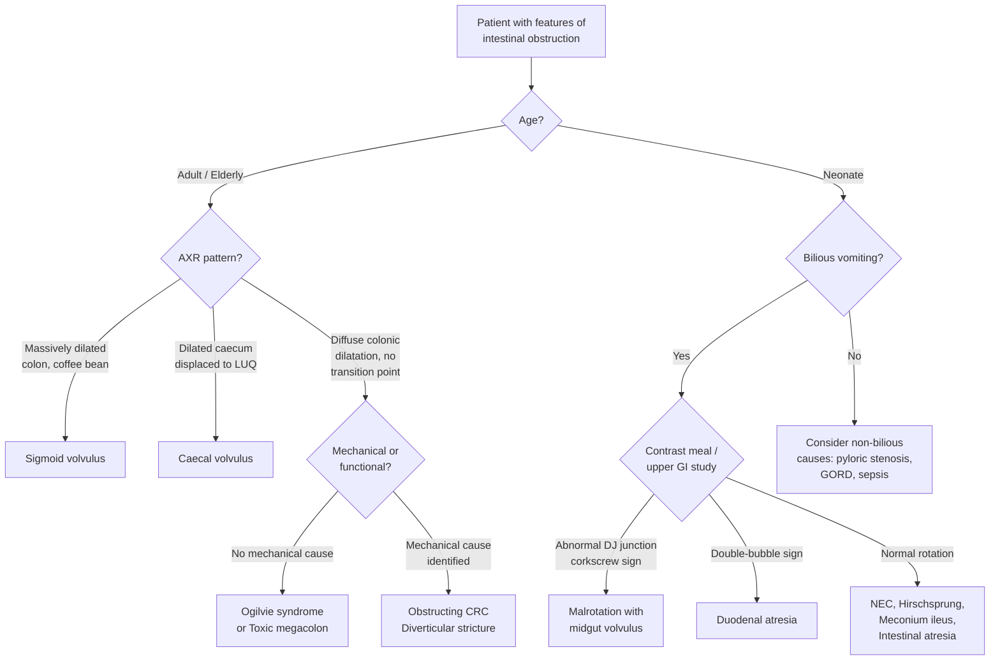

## Differential Diagnosis of Volvulus

The art of differential diagnosis in volvulus revolves around one central question: **this patient has features of intestinal obstruction — is it truly a volvulus, or is something else causing the same picture?** To answer this, we need to think anatomically (sigmoid volvulus mimics vs caecal volvulus mimics vs neonatal midgut volvulus mimics) and pathophysiologically (what else can cause a massively distended colon, acute abdominal pain with obstipation, or bilious vomiting in a neonate?).

The differentials are best organised by clinical context: (1) **adult large bowel obstruction** (sigmoid/caecal volvulus), (2) **neonatal intestinal obstruction** (midgut volvulus), and (3) **specific mimics** that deserve individual attention because they are commonly confused with volvulus on imaging or at the bedside.

---

### 1. Framework for Approaching the Differential

---

### 2. Differential Diagnosis in Adults (Sigmoid / Caecal Volvulus)

When an adult presents with abdominal distension, pain, and obstipation, volvulus must be differentiated from other causes of ***large bowel obstruction***. The lecture slides identify the ***common causes of large bowel obstruction*** as: ***cancer of colon, volvulus, diverticular stricture, and pseudo-obstruction*** [1][5].

#### 2.1 Obstructing Colorectal Cancer (CRC)

| Feature | How It Differs from Volvulus | Why |
|---|---|---|
| **Presentation** | More insidious onset with preceding change in bowel habit, weight loss, rectal bleeding, iron-deficiency anaemia | CRC grows slowly over months; obstruction is a late complication when the tumour narrows the lumen beyond a critical point |
| **Age** | Older adults (overlap with sigmoid volvulus age group) | CRC incidence increases with age |
| **AXR** | Dilated colon proximal to a transition point (often at splenic flexure or sigmoid for left-sided CRC); ***no coffee bean sign*** | The obstruction is fixed at the tumour site, not caused by twisting |
| **CT abdomen** | Colonic mass / wall thickening at transition point; ***no whirl sign*** | Whirl sign is pathognomonic of mesenteric twisting in volvulus |
| **Competent ileocaecal valve** | If present (1/3 of population), creates a ***closed-loop obstruction*** — massive caecal distension with risk of perforation, mimicking caecal volvulus [2][13] | The ileocaecal valve prevents retrograde decompression into small bowel → caecum bears the full distension load |
| **Contrast enema** | "Apple-core" lesion at site of CRC; ***bird's beak sign absent*** | Bird's beak = smooth tapering at the twist point (volvulus); apple-core = irregular mucosal destruction (carcinoma) |

> ***Causes of colonic obstruction: Cancer, Volvulus, Diverticulitis, Stricture (anastomotic, radiation, ischaemic, endometriotic), Extrinsic compression (metastasis, pelvic/extraperitoneal tumour)*** [1]

<Callout title="Exam Trap — CRC Causing Closed-Loop Obstruction" type="error">
A left-sided CRC in a patient with a **competent ileocaecal valve** can mimic caecal volvulus on AXR because the caecum becomes massively distended. The key differentiator is that in CRC-related closed-loop obstruction, the **transition point is at the tumour** (usually sigmoid/descending colon), not at the caecum itself. CT will show a colonic mass, not a mesenteric whirl sign. Always look for the transition point.
</Callout>

#### 2.2 Toxic Megacolon

| Feature | How It Differs from Volvulus | Why |
|---|---|---|
| **Definition** | ***Total or segmental colonic dilatation with systemic toxicity*** [3] | An inflammatory / infectious process causes loss of colonic motor function → dilatation, NOT a mechanical twist |
| **Causes** | Complication of ***IBD, infectious colitis (especially Clostridium difficile), ischaemic colitis, volvulus itself, diverticulitis, obstructive CRC*** [3] | Any severe colonic inflammation can cause neuromuscular dysfunction of the colonic wall |
| **Key clinical feature** | ***Bloody diarrhoea*** is the most common presentation; ***systemic toxicity*** (high fever > 38.6°C, tachycardia > 120, leukocytosis > 10.5, anaemia) [3] | The underlying colitis causes mucosal ulceration and bleeding; transmural inflammation triggers SIRS |
| **History** | Often a history of ***antibiotic use*** (C. difficile) or known IBD | C. difficile toxin damages colonocytes; IBD flare causes transmural inflammation |
| **AXR** | ***Diffuse colonic dilatation*** (transverse colon > 6 cm); ***no coffee bean sign, no convergence of sigmoid wall lines*** | Dilatation is generalised, not focal to one twisted segment |
| **PR exam** | May pass bloody stool | In volvulus, the rectum is typically empty |

<Callout title="Key Distinction" type="idea">
Toxic megacolon = **dilated colon + systemic toxicity + diarrhoea (often bloody)**. Volvulus = **dilated colon + obstipation (no passage of stool/flatus) + NO diarrhoea**. The presence of bloody diarrhoea strongly favours toxic megacolon over volvulus.
</Callout>

#### 2.3 Ogilvie Syndrome (Acute Colonic Pseudo-obstruction)

| Feature | How It Differs from Volvulus | Why |
|---|---|---|
| **Definition** | ***Acute dilatation of colon in the absence of an anatomic lesion that obstructs the flow of intestinal content*** [3][13] | Autonomic imbalance (↓parasympathetic / ↑sympathetic) → functional aperistalsis, not a mechanical twist |
| **Setting** | ***Hospitalised patients*** with severe illness, post-surgery, metabolic imbalance, or on medications (opioids, CCBs) [3][13] | These conditions disrupt the autonomic regulation of colonic motility |
| **Key clinical feature** | ***Abdominal distension*** is the predominant symptom; ***relatively less pain*** compared to volvulus [3][13] | No mesenteric stretch or ischaemia — just a dilated, adynamic colon |
| **Bowel sounds** | ***Normal bowel sounds*** (key differentiator from mechanical obstruction!) [13] | There is no physical obstruction for peristalsis to struggle against |
| **PR exam** | ***Dilated rectum*** on PR exam (contrast with collapsed rectum in mechanical obstruction) [13] | No distal obstruction — gas can reach the rectum |
| **AXR** | Diffuse colonic dilatation; ***gas present in rectum*** (unlike volvulus where rectal gas is absent) [2][13] | No mechanical block → gas distributes throughout colon including rectum |
| **CT** | No transition point, no whirl sign; ***diagnosis of exclusion*** (must rule out mechanical cause first) | No anatomical lesion causing obstruction |

> ***Differentiating signs of pseudo-obstruction from mechanical obstruction: normal bowel sounds; dilated rectum on PR exam*** [13]

#### 2.4 Diverticular Stricture / Acute Diverticulitis

| Feature | How It Differs from Volvulus | Why |
|---|---|---|
| **Mechanism** | ***Severity ranges from diverticulitis → localised abscess → purulent peritonitis → faecal peritonitis*** [14] | Inflammation of a diverticulum causes pericolic oedema and fibrosis → can narrow the lumen enough to cause obstruction |
| **Clinical features** | ***Fever, tenderness and guarding, leucocytosis*** [14]; typically LLQ pain | Pericolic inflammation and abscess formation |
| **CT** | Pericolic fat stranding, colonic wall thickening > 10 cm segment, pericolonic abscess; ***no whirl sign*** | Inflammatory process, not torsion |
| **Onset** | More gradual; prior episodes of diverticulitis common | Chronic inflammatory process with acute-on-chronic exacerbations |

#### 2.5 Ischaemic Bowel Disease / Ischaemic Colitis

The lecture slides list ***mechanical causes of ischaemic bowel (volvulus, hernia)*** alongside embolic, thrombotic, and non-occlusive causes [5][11]. The key issue is that volvulus **itself causes ischaemia**, but primary mesenteric ischaemia without volvulus can mimic a gangrenous volvulus.

| Feature | How It Differs from Volvulus | Why |
|---|---|---|
| **Presentation** | ***Generalised abdominal pain out of proportion to physical findings; PR bleeding / bloody diarrhoea*** [11] | Ischaemic mucosa sloughs → intraluminal bleeding; visceral peritoneum initially not involved (pain out of proportion) |
| **Setting** | Patient with ***AF*** (embolism), strong cardiovascular risk factors (thrombosis), or haemodynamic instability (NOMI) [11] | Each pathological mechanism has a characteristic patient profile |
| **AXR** | Thumbprinting (submucosal oedema/haemorrhage); may show ileus but ***no coffee bean or whirl sign*** | Mucosal and submucosal ischaemic changes, not mechanical twisting |
| **CT angiography** | Filling defect in SMA/IMA (embolism/thrombosis); bowel wall thickening without mesenteric whirl | Identifies the vascular cause directly |
| **Lactate** | Markedly elevated | Both volvulus with ischaemia and primary mesenteric ischaemia cause elevated lactate — this does NOT differentiate them; imaging is needed |

#### 2.6 Incarcerated / Strangulated Hernia

| Feature | How It Differs from Volvulus | Why |
|---|---|---|
| **Physical examination** | ***Hernial orifices*** must always be examined — a tender, irreducible groin or incisional lump [5] | Bowel trapped in hernia sac → closed-loop obstruction + ischaemia |
| **AXR** | Small bowel dilatation (if SBO from hernia); ***no coffee bean sign*** | The obstruction is at the hernia site, not sigmoid/caecum |
| **CT** | Bowel loop within hernia defect; no mesenteric whirl in the abdomen | Identifies the site and nature of incarceration |

> ***Physical Examination of large bowel obstruction: Hydration status, Tachycardia & hypotension, Abdominal tenderness, Hernial orifices, Bowel sounds, Rectal Examination*** [5]

<Callout title="Never Forget the Hernial Orifices!" type="error">
It is a classic exam pitfall (and real-life disaster) to diagnose "volvulus" or "adhesive obstruction" and take the patient to theatre without checking the groins. An incarcerated inguinal or femoral hernia is the most easily correctable cause of intestinal obstruction — and the most embarrassing to miss. ***Always examine the hernial orifices*** in any patient with IO [5].
</Callout>

---

### 3. Differential Diagnosis in Neonates (Midgut Volvulus)

When a neonate presents with ***bilious vomiting***, the differential includes both ***medical and surgical causes*** [7]. Midgut volvulus from malrotation is the most dangerous and must be excluded first, but several other conditions overlap in presentation.

> ***Causes of bilious vomiting in a neonate — Medical: Sepsis, Medical NEC, CMPI, Hyponatraemia, Congenital heart disease, HIE. Surgical: Malrotation/volvulus, Anorectal malformation, Intestinal atresias, Hirschsprung's disease, Duplication cysts, Meconium ileus, Incarcerated hernia, SLCS*** [7]

#### 3.1 Intestinal Atresia (Duodenal, Jejunal, Ileal, Colonic)

| Feature | How It Differs from Midgut Volvulus | Why |
|---|---|---|
| **Timing** | Duodenal atresia presents on ***Day 1*** (contrast with malrotation/volvulus on ***Day 3–7***) [8] | Complete atresia causes obstruction from birth; malrotation may not volvulise until the bowel fills with feeds |
| **AXR** | ***Double-bubble sign*** in duodenal atresia (dilated stomach + dilated proximal duodenum, no distal gas) [3] | Complete obstruction at D2 → air trapped in stomach and proximal duodenum |
| **Contrast study** | Failure of contrast to pass beyond the atresia site; ***no corkscrew sign*** | Corkscrew sign is characteristic of malrotation with volvulus |
| **Associations** | Duodenal atresia strongly associated with ***Down syndrome (Trisomy 21)*** [3] | Developmental association; not seen with malrotation |
| **Vomiting** | Bilious if atresia is distal to ampulla; non-bilious if proximal to ampulla | Same principle as volvulus — the relationship to the ampulla of Vater determines bile content |

#### 3.2 Necrotising Enterocolitis (NEC)

| Feature | How It Differs from Midgut Volvulus | Why |
|---|---|---|
| **Population** | Predominantly ***premature infants*** (< 37 weeks); rare in term neonates | Immature gut barrier + immature immune system + abnormal bacterial colonisation |
| **Onset** | Usually after initiation of enteral feeds; timing variable (days to weeks) | Enteral feeds provide substrate for pathological bacterial fermentation in immature gut |
| **Clinical features** | Abdominal distension, bilious vomiting, bloody stools, ***pneumatosis intestinalis*** on AXR (intramural gas) | Gas produced by bacteria invading the ischaemic bowel wall — pathognomonic of NEC |
| **AXR** | Pneumatosis intestinalis, portal venous gas, ***NO coffee bean or whirl sign*** | Gas in bowel wall (not lumen) differentiates NEC from volvulus |
| **Systemic** | More prominent systemic features early: apnoea, bradycardia, temperature instability, metabolic acidosis | Gut barrier failure → bacterial translocation → sepsis |

#### 3.3 Hirschsprung Disease

| Feature | How It Differs from Midgut Volvulus | Why |
|---|---|---|
| **Presentation** | ***Failure to pass meconium within 48 hours***; progressive abdominal distension; late bilious vomiting | Aganglionic segment (usually rectosigmoid) causes functional distal obstruction from birth |
| **PR exam** | Explosive passage of gas and meconium on rectal examination ("squirt sign") | The examining finger dilates the aganglionic spastic segment, releasing trapped proximal contents |
| **Contrast enema** | ***Transition zone*** between narrow distal aganglionic segment and dilated proximal normal colon | The ganglionated segment dilates because it receives contents it cannot pass through the aganglionic segment |
| **Definitive diagnosis** | Rectal suction biopsy showing ***absent ganglion cells*** in submucosa | Histological confirmation is required |

#### 3.4 Meconium Ileus

| Feature | How It Differs from Midgut Volvulus | Why |
|---|---|---|
| **Association** | Strongly associated with ***cystic fibrosis*** (CF) | Thick, inspissated meconium due to defective CFTR chloride channel → reduced water secretion into GI lumen |
| **AXR** | Dilated small bowel loops; ***"soap-bubble" / ground-glass*** appearance in RLQ (air mixed with thick meconium) | Viscid meconium has a characteristic mottled appearance when mixed with air |
| **Contrast enema** | ***Microcolon*** (unused colon) with meconium pellets in terminal ileum | The colon is small because thick meconium obstructs the ileum and never reaches the colon |

#### 3.5 Other Neonatal Differentials

| Condition | Key Distinguishing Feature |
|---|---|
| **Duplication cysts** | Fluid-filled cystic mass on ultrasound; may act as lead point for intussusception or volvulus |
| **Incarcerated inguinal hernia** | Palpable groin mass; more common in premature males |
| **Anorectal malformation** | Absent or abnormally positioned anus on perineal inspection — should be identified on routine newborn examination |
| ***Sepsis, HIE, CMPI, hyponatraemia, congenital heart disease*** | **Medical causes** of bilious vomiting — systemic signs predominate (lethargy, poor perfusion, abnormal neurology); no mechanical obstruction on imaging [7] |

---

### 4. Summary Table — Key Differentiators

| Condition | Key AXR Finding | Key CT Finding | Key Clinical Clue | Bowel Sounds | Rectal Gas |
|---|---|---|---|---|---|
| **Sigmoid volvulus** | ***Coffee bean sign; ahaustral; 3 converging lines from pelvis*** [2] | ***Whirl sign, bird's beak*** [3] | Elderly, constipated, massive distension | Hyperactive → absent | ***Absent*** |
| **Caecal volvulus** | Dilated haustral loop from RLQ, displaced; dilated SB [2] | Whirl sign around ileocolic vessels [3] | Younger female, post-surgery | Hyperactive → absent | ***Absent*** |
| **Obstructing CRC** | Dilated colon to transition point; no coffee bean | Mass at transition point | Weight loss, altered bowel habit, rectal bleeding | Hyperactive | Absent (if complete) |
| **Toxic megacolon** | Diffuse colonic dilatation; transverse colon > 6 cm | Colonic wall thickening, no whirl | ***Bloody diarrhoea, systemic toxicity*** | Absent | Present |
| ***Ogilvie syndrome*** | Diffuse colonic dilatation; ***gas in rectum*** | No transition point, no mass | Hospitalised, post-op, ***less pain*** | ***Normal*** | ***Present*** |
| ***Diverticular stricture*** | Dilated colon to sigmoid; no coffee bean | Fat stranding, wall thickening, ± abscess | ***Fever, LLQ tenderness, leucocytosis*** [14] | Variable | Absent (if complete) |
| **Ischaemic colitis** | Thumbprinting; no coffee bean | Wall thickening at watershed zones | ***Pain out of proportion, AF, PR bleeding*** [11] | Absent (paralytic phase) | Variable |
| **Malrotation + midgut volvulus** | Dilated stomach, no distal gas | Whirl sign around SMA | ***Bilious vomiting, neonate Day 3–7*** [8] | Variable | Variable |
| **Duodenal atresia** | ***Double-bubble sign*** | — | Bilious vomiting Day 1, Down syndrome | Absent distally | Absent |
| **NEC** | ***Pneumatosis intestinalis***, portal venous gas | Pneumatosis, portal gas | Premature infant, bloody stools | Absent | Variable |
| **Hirschsprung** | Dilated proximal colon, narrow distal | Transition zone | Failure to pass meconium within 48 h | Present | Explosive on PR |

---

### 5. Approach to Narrowing the Differential

The following clinical and investigative features help you narrow the differential efficiently:

1. **Check the AXR pattern first** — coffee bean sign is virtually diagnostic of sigmoid volvulus. Dilated caecum in LUQ suggests caecal volvulus.
2. **Is there rectal gas?** Absent rectal gas → mechanical obstruction (volvulus, CRC, stricture). Present rectal gas → consider pseudo-obstruction (Ogilvie syndrome).
3. **PR examination** — empty rectum (mechanical LBO); dilated rectum (pseudo-obstruction); explosive decompression (Hirschsprung); blood (ischaemia, CRC, NEC).
4. **Is the patient a neonate?** Bilious vomiting in a neonate = ***malrotation with midgut volvulus until proven otherwise*** [7][8]. Get an urgent contrast meal study.
5. **Systemic toxicity + bloody diarrhoea?** Think toxic megacolon rather than volvulus.
6. **CT with whirl sign** is highly specific for volvulus — if absent, reconsider diagnosis.

<Callout title="High Yield Summary — Differential Diagnosis of Volvulus">

**Adult sigmoid volvulus DDx**: Obstructing CRC, toxic megacolon, Ogilvie syndrome, diverticular stricture, ischaemic colitis, incarcerated hernia.

**Key differentiators**: Coffee bean sign + absent rectal gas + obstipation = volvulus. Bloody diarrhoea + systemic toxicity = toxic megacolon. Normal bowel sounds + gas in rectum + hospitalised = Ogilvie. Mass at transition point = CRC.

**Neonatal midgut volvulus DDx**: Duodenal atresia (Day 1, double-bubble), NEC (premature, pneumatosis), Hirschsprung (failure to pass meconium), meconium ileus (CF, microcolon), plus medical causes (sepsis, CMPI, HIE, hyponatraemia, CHD).

**Golden rule**: Bilious vomiting in neonate = malrotation with midgut volvulus until proven otherwise. Always check hernial orifices in any IO.

</Callout>

---

<ActiveRecallQuiz
  title="Active Recall - Differential Diagnosis of Volvulus"
  items={[
    {
      question: "Name four common causes of large bowel obstruction that must be differentiated from sigmoid volvulus.",
      markscheme: "Colorectal cancer, diverticular stricture, Ogilvie syndrome (pseudo-obstruction), toxic megacolon. Also acceptable: incarcerated hernia, ischaemic stricture."
    },
    {
      question: "How do you differentiate Ogilvie syndrome from sigmoid volvulus on AXR and PR examination?",
      markscheme: "Ogilvie: diffuse colonic dilatation with gas present in rectum; dilated rectum on PR exam; normal bowel sounds. Sigmoid volvulus: coffee bean sign arising from pelvis; absent rectal gas; empty rectum on PR; hyperactive then absent bowel sounds."
    },
    {
      question: "A neonate presents with bilious vomiting on Day 4 of life. What is the most important diagnosis to exclude, and what investigation would you request urgently?",
      markscheme: "Malrotation with midgut volvulus. Urgent upper GI contrast study (contrast meal / follow-through) to assess position of DJ junction. Abnormal DJ junction or corkscrew appearance confirms malrotation."
    },
    {
      question: "What AXR finding is pathognomonic for NEC and differentiates it from midgut volvulus?",
      markscheme: "Pneumatosis intestinalis (intramural gas within the bowel wall). May also see portal venous gas. These are not seen in simple midgut volvulus."
    },
    {
      question: "A patient with sigmoid volvulus has bloody diarrhoea and high fever. What alternative diagnosis should you consider, and what is the key distinguishing pathological feature?",
      markscheme: "Toxic megacolon. Key feature: systemic toxicity (fever >38.6C, tachycardia >120, leucocytosis, anaemia) plus bloody diarrhoea from underlying colitis (IBD, C. difficile). Volvulus causes obstipation, not diarrhoea. Toxic megacolon shows diffuse colonic dilatation without coffee bean sign."
    },
    {
      question: "Why must you always examine the hernial orifices in a patient presenting with intestinal obstruction?",
      markscheme: "An incarcerated inguinal or femoral hernia is a common and easily correctable cause of intestinal obstruction. If missed, it can progress to strangulation, bowel necrosis, and perforation. A tender irreducible groin lump clinches the diagnosis and changes management immediately."
    }
  ]}
/>

## References

[1] Lecture slides: GC 194. Intestinal obstruction colorectal cancer.pdf (p41, p60)
[2] Senior notes: maxim.md (Section: Volvulus)
[3] Senior notes: felixlai.md (Sections: Volvulus, Intestinal atresia, Hirschsprung disease)
[5] Lecture slides: GC 195. Lower and diffuse abdominal pain RLQ problems; pelvic inflammatory disease; peritonitis and abdominal emergencies.pdf (p28, p31)
[7] Lecture slides: Case Study – Paediatric Surgery Bilious vomiting of new-born _ACH Fung.pdf (p51)
[8] Senior notes: maxim.md (Section: Malrotation & volvulus table)
[11] Senior notes: maxim.md (Section: Ischemic bowel disease)
[13] Senior notes: maxim.md (Section: Pseudo-obstruction / Ogilvie syndrome)
[14] Lecture slides: GC 195. Lower and diffuse abdominal pain RLQ problems; pelvic inflammatory disease; peritonitis and abdominal emergencies.pdf (p19)
