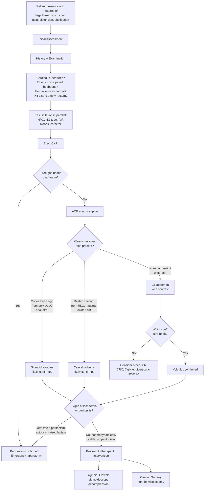
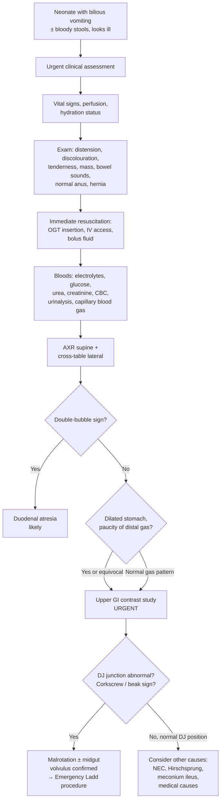

## Diagnostic Criteria, Diagnostic Algorithm, and Investigation Modalities for Volvulus

### 1. Diagnostic Criteria — Does Volvulus Have Formal "Criteria"?

Unlike conditions such as rheumatic fever or SLE, volvulus does **not** have formalised diagnostic criteria with a scoring system. Instead, the diagnosis is established through a combination of:

1. **Clinical suspicion** based on the presentation (cardinal features of IO in the right demographic context).
2. **Radiological confirmation** — this is where the diagnosis is truly made.

The clinical picture raises the alarm; the imaging seals the deal. Let's think about this from first principles: volvulus is an anatomical event (a twist), so you need an investigation that can **visualise the twist or its consequences** — that's radiology and endoscopy.

For **neonatal midgut volvulus**, the diagnostic standard is even more time-critical: ***time is essence*** [4] — you cannot wait for elaborate workups.

---

### 2. Diagnostic Algorithm

The following algorithm represents the systematic approach to a patient with suspected volvulus, integrating clinical assessment, resuscitation, and stepwise investigations. It separates the **adult pathway** (sigmoid/caecal) from the **neonatal pathway** (midgut).

#### 2.1 Adult Volvulus Diagnostic Algorithm

#### 2.2 Neonatal Midgut Volvulus Diagnostic Algorithm

> ***Approach: Expedited but thorough clinical evaluation. Vital signs, perfusion, hydration status. Exam: Abdominal distension, discolouration, tenderness, mass, bowel sounds; normal anus, hernia. Labs: electrolytes, glucose, urea, creatinine, CBC, urinalysis, capillary blood gas. XRs: AXR supine, cross table lateral. OGT insertion, IV, bolus fluid. Further Ix ± intervention according to DDx*** [7]

<Callout title="Time is Essence in Neonatal Midgut Volvulus" type="error">
***Time is essence*** [4]. In neonatal midgut volvulus, every hour of delay increases the risk of irreversible midgut infarction. If the clinical suspicion is high (bilious vomiting in an otherwise well neonate who then deteriorates), do NOT wait for contrast studies — take the baby to theatre. A negative laparotomy is far better than a dead bowel. The upper GI contrast study is done when you have time and doubt, not when the baby is in extremis.
</Callout>

---

### 3. Investigation Modalities — Detailed Breakdown

The investigations for volvulus follow the standard surgical principle: **bedside → bloods → imaging → endoscopy**. The lecture slides outline the general framework for investigating intestinal obstruction: ***Blood tests, Plain abdominal X-ray (SBO: valvulae conniventes, central; LBO: haustra, peripheral), CT (level of obstruction, cause, viability of bowel, presence of metastasis if malignant cause), Contrast study (Gastrografin follow-through / enema)*** [15].

Let's also integrate the general investigation framework from the lecture slides: ***Bedside tests: Urinalysis, pregnancy test. Blood tests: Blood count, renal and liver function, amylase, clotting profile, arterial blood gas, type and screen. Imaging: Erect CXR, erect and supine AXR, USG, CT, contrast studies. Endoscopy: Colonoscopy, upper endoscopy*** [16].

---

#### 3.1 Bedside Tests

| Test | Purpose | Key Findings | Explanation |
|---|---|---|---|
| ***Urinalysis*** | Rule out urological causes of abdominal pain (renal colic, UTI) [16] | Normal in volvulus | Volvulus is a surgical cause; urinalysis helps exclude medical mimics |
| ***Pregnancy test*** | Mandatory in females of reproductive age [16] | Rule out ectopic pregnancy | Abdominal pain + vomiting in a young woman — always exclude pregnancy before imaging/surgery |
| **PR examination** | Assess rectal contents and tone | **Empty rectum** with no gas = mechanical LBO; blood on glove = mucosal ischaemia/necrosis | In volvulus, the obstruction is proximal to the rectum, so the rectum is empty and collapsed. Blood suggests gangrenous bowel. |

#### 3.2 Blood Tests (Laboratory Investigations)

> ***Labs: electrolytes, glucose, urea, creatinine, CBC, urinalysis, capillary blood gas*** [7]

| Investigation | Key Findings in Volvulus | Pathophysiological Explanation |
|---|---|---|
| ***CBC with differentials*** [3] | **Leukocytosis** (raised WCC) | Bowel wall ischaemia → inflammatory cascade → neutrophil mobilisation from bone marrow. A markedly elevated WCC (> 15–20 × 10⁹/L) with left shift suggests **gangrenous bowel or established sepsis**. |
| ***RFT (Renal function tests: urea, creatinine, electrolytes)*** [3] | **Hyponatraemia**: Na⁺ < 135 mmol/L | Loss of Na⁺ and water from vomiting (gastric secretions contain ~60 mmol/L Na⁺) + third-space sequestration into dilated bowel and peritoneal cavity → total body Na⁺ depletion. |
| | **Hypokalaemia**: K⁺ < 3.5 mmol/L | Multiple mechanisms: (1) Direct K⁺ loss in vomitus; (2) Metabolic alkalosis from vomiting shifts K⁺ intracellularly (H⁺/K⁺ exchange); (3) Increased plasma HCO₃⁻ exceeds resorptive threshold → increased NaHCO₃ delivery to distal nephron → enhanced urinary K⁺ secretion; (4) Hypovolaemia → RAAS activation → aldosterone → renal K⁺ wasting [3]. |
| | **Raised urea** (pre-renal pattern: urea↑ > creatinine↑) | Dehydration/hypovolaemia → reduced renal perfusion → increased urea reabsorption in proximal tubule |
| ***LFT*** [3] | Usually normal | Ordered to rule out hepatobiliary causes of abdominal pain |
| ***Serum amylase*** [3] | Usually normal; may be mildly elevated | Rule out acute pancreatitis; mild elevation can occur with bowel ischaemia (non-specific) |
| ***Serum lactate*** [3][11] | **Elevated** (> 2 mmol/L) | ***Sensitive marker for bowel ischaemia*** [3]. Anaerobic glycolysis in ischaemic bowel wall → lactate production. A rising lactate is an ominous sign suggesting progression from reversible ischaemia to irreversible necrosis. |
| ***Arterial blood gas (ABG)*** [3][11] | **Metabolic acidosis** (lactic acidosis: high anion gap) | Bowel ischaemia → anaerobic metabolism → lactic acid accumulation; also reflects systemic hypoperfusion if the patient is hypovolaemic. ***HAGMA (high anion gap metabolic acidosis)*** [11]. |
| | **Metabolic alkalosis** (may coexist) | Vomiting of gastric HCl → net loss of H⁺ → rise in plasma HCO₃⁻. In early volvulus with prominent vomiting but no ischaemia yet, alkalosis may predominate [3]. |
| ***Clotting profile*** [16] | Check for coagulopathy | Pre-operative assessment; DIC may develop with advanced bowel gangrene and sepsis |
| ***Type and screen / Group & save*** [16] | Blood group + antibody screen | Pre-operative preparation — surgery may be needed urgently |

<Callout title="The Lactate-ABG Axis — What It Tells You" type="idea">
In any patient with suspected volvulus, the **lactate** and **ABG** together give you the most important information about bowel viability:
- **Normal lactate + metabolic alkalosis** → early volvulus, vomiting predominant, bowel likely still viable → attempt endoscopic decompression.
- **Rising lactate + metabolic acidosis (HAGMA)** → bowel ischaemia progressing → this patient needs surgery, not a sigmoidoscope.
- **Very high lactate (> 5 mmol/L) + severe acidosis** → established gangrene, likely perforation imminent → emergency laparotomy.
</Callout>

---

#### 3.3 Imaging

##### A. Erect Chest X-Ray (CXR)

| Finding | Significance | Why |
|---|---|---|
| ***Free gas under diaphragm (pneumoperitoneum)*** [3] | Bowel **perforation** | Gas escapes from perforated bowel into peritoneal cavity → rises to highest point (under diaphragm in upright position). If present, skip further imaging — go to **emergency laparotomy**. |
| NG tube position | Confirm correct placement | Essential for drip-and-suck management |
| Basal atelectasis / aspiration pneumonia | Complication of vomiting / distension | Diaphragmatic splinting from massive distension; aspiration of vomitus |

> ***Erect CXR: Look for free gas under diaphragm*** [3]

##### B. Plain Abdominal X-Ray (AXR) — Erect and Supine

The AXR is the **first-line imaging investigation** for suspected volvulus and is often diagnostic, especially for sigmoid volvulus. Understanding what you see requires knowing the difference between small and large bowel on AXR:

- ***Small bowel***: **valvulae conniventes** (thin, complete mucosal folds crossing the entire width), **central** position [15].
- ***Large bowel***: **haustra** (thick, incomplete folds that do NOT cross the full width), **peripheral** position [15].

**AXR Findings — Sigmoid Volvulus vs Caecal Volvulus:**

| Feature | ***Sigmoid Volvulus*** | ***Caecal Volvulus*** |
|---|---|---|
| **Origin** | ***Arises from pelvis / LLQ*** [2] | ***Arises from RLQ*** [2] |
| **Haustral markings** | ***Ahaustral*** (the sigmoid is so distended that haustral markings are effaced) [2] | ***Haustral*** (the caecum retains its haustral markings even when distended) [2] |
| **Characteristic sign** | ***Coffee bean sign*** — U-shaped, massively distended sigmoid loop extending from pelvis towards RUQ; the two walls of the loop pressed together create a central dense line [1][2][3] | ***Coffee bean sign*** — but the dilated caecum is ***displaced medially and superiorly*** (often to LUQ or epigastrium) [3] |
| **Convergence** | ***3 lines of sigmoid wall converging to site of obstruction*** (the two outer walls + the central crease) [2] | Not described |
| **Proximal bowel** | ***Dilated large bowel*** proximal to sigmoid [3] | ***Dilated small bowel*** with decompressed colon distal to caecum [2][3] |
| **Rectal gas** | ***Absent*** [2] | ***Absent*** [2] |
| **Air-fluid levels** | ***Present*** [3] | ***Present*** [3] |

> ***X-rays: dilated sigmoid (coffee bean)*** [1]

**AXR Findings — Complications:**

| Finding | Significance | Description |
|---|---|---|
| ***Thumbprinting sign*** [3] | **Bowel wall ischaemia** | Submucosal oedema/haemorrhage thickens the haustral folds at regular intervals, projecting into the lumen like thumbprints |
| ***Pneumatosis intestinalis*** [3] | **Bowel wall necrosis** | Gas produced by bacteria that have invaded the necrotic bowel wall — appears as linear or bubbly lucencies within the bowel wall |
| ***Pneumoperitoneum / Free gas under diaphragm*** [3] | **Perforation** | Gas escaped from perforated bowel into peritoneal cavity |
| ***Rigler sign (Double-wall sign)*** [3] | **Perforation** | Both the inner (luminal) and outer (serosal) surfaces of the bowel wall are outlined by gas — possible only when there is gas on BOTH sides of the bowel wall (i.e., extraluminal gas present) |

<Callout title="Why Is the Coffee Bean Sign So Characteristic?">
Imagine the sigmoid colon as a U-shaped loop. When it twists, the two limbs of the U come together and the loop inflates with trapped gas like a balloon. On AXR, you see a **massively dilated, ahaustral, ovoid gas shadow** extending from the pelvis upward, with a **central dense line** where the two walls of the loop are pressed against each other. The overall shape resembles a coffee bean — hence the name. The three converging lines at the base of the bean represent the two outer walls and the central crease converging at the point of torsion.
</Callout>

##### C. CT Abdomen with Contrast

CT is the **gold standard for adult volvulus** when the AXR is non-diagnostic, and is increasingly used as the first-line cross-sectional study. It provides information on **level of obstruction, cause, viability of bowel, and presence of metastasis if malignant cause** [15].

| Finding | Type | Significance |
|---|---|---|
| ***Whirl sign*** | Sigmoid and caecal | ***Dilated sigmoid colon twisting around its mesocolon and vessels*** [2][3] — the mesentery and mesenteric vessels spiral around the point of torsion, creating a swirling pattern on axial cuts. Pathognomonic of volvulus. For caecal volvulus: ***twisting of mesentery around ileocolic vessels*** [3]. |
| ***Bird-beak sign*** | Sigmoid | ***Bird-beak appearance of the afferent and efferent colonic segments*** [2][3] — the two limbs of the sigmoid taper smoothly towards the point of torsion, converging like a bird's beak |
| ***Absence of rectal gas*** | Both | Confirms complete distal obstruction [3] |
| ***Transition point*** | Both | Identifies the exact level where dilated proximal bowel transitions to collapsed distal bowel |
| **CT findings of ischaemia** | | |
| ***Pneumatosis intestinalis*** | | Gas within the bowel wall — indicates necrosis [3] |
| ***Bowel wall thickening*** | | Oedema and congestion from venous obstruction [3] |
| ***Reduced or lack of bowel wall enhancement*** | | Arterial compromise → poor perfusion → bowel wall does not enhance with IV contrast [3] |
| ***Oedematous and thickened mesentery*** | | Venous congestion and inflammatory fluid in the mesentery [3] |
| ***Engorgement of mesenteric vessels*** | | Venous outflow obstruction → distended, engorged veins [3] |
| ***Portal venous gas*** | | Gas from necrotic bowel wall enters mesenteric veins → portal system — a very late and ominous sign [3] |

> ***CT (only if AXR / enema inconclusive): whirl sign*** [2]

##### D. Contrast Enema (Water-Soluble / Gastrografin or Barium)

| Feature | Details |
|---|---|
| **Indications** | ***Reserved when AXR or CT abdomen is NOT diagnostic, provided there is no evidence of peritonitis on physical examination*** [3] |
| **Contraindication** | **Suspected perforation or peritonitis** — introducing contrast into a perforated bowel worsens contamination |
| **Sigmoid volvulus finding** | ***Bird-beak sign*** — contrast tapers smoothly to the point of obstruction where the sigmoid twist narrows the lumen [2][3] |
| **Therapeutic potential** | ***Can occasionally reduce a volvulus*** (hydrostatic pressure from the contrast may untwist the sigmoid), but this is unreliable and the primary purpose is diagnostic [3] |
| **Risk** | ***Rarely used given the risk of perforation in volvulus*** [3] |
| **Contrast type** | **Water-soluble contrast (gastrografin)** is preferred over barium — if perforation occurs, barium causes severe chemical peritonitis, whereas gastrografin is absorbed and is less harmful |

##### E. Upper GI Contrast Study (for Neonatal Midgut Volvulus)

This is a **completely different investigation** from the contrast enema used in adults. It is the ***gold standard*** for diagnosing malrotation and midgut volvulus in neonates [3].

| Feature | Details |
|---|---|
| **What it is** | ***Upper GI contrast series (barium meal / small bowel follow-through / small bowel enema)*** [3] — contrast is administered orally or via NG/OG tube and its passage through the duodenum and proximal jejunum is fluoroscopically observed |
| **Why it is the gold standard** | ***GOLD STANDARD — best to visualise the duodenum*** [3]. The key diagnostic question is: "Where is the DJ junction (ligament of Treitz)?" In normal anatomy, the DJ junction is in the **LUQ**, to the left of the vertebral column. In malrotation, it is displaced to the **right** or midline. |
| **Classical findings** | ***Corkscrew appearance*** in the duodenum (the duodenum spirals around the SMA rather than crossing normally from right to left) [3] |
| | ***Beak appearance*** where contrast tapers to a point at the site of volvulus [3] |
| | ***Dilatation of stomach and proximal duodenum*** in duodenal obstruction (from Ladd bands or volvulus) [3] |
| | ***Clearly misplaced duodenum with ligament of Treitz on right side of abdomen*** [3] |
| **When to do it** | ***If in doubt*** [4] — when clinical suspicion exists but AXR is not conclusive. If the baby is critically ill with clear peritonitis or shock, skip this and go straight to theatre. |

> ***Diagnosis: AXR. Upper GI contrast if in doubt. Time is essence.*** [4]

<Callout title="Neonatal Investigations — Contrast Meal NOT Contrast Enema" type="error">
A common mistake is to order a contrast enema for a neonate with suspected malrotation. The pathology is in the **duodenum** (DJ junction position, duodenal obstruction by Ladd bands), so you need an **upper GI contrast study** that traces the duodenum, not a lower GI study. A contrast enema can show the caecal position (which may be abnormal in malrotation), but this is unreliable — up to 20% of malrotation cases have a normally positioned caecum on enema.
</Callout>

##### F. CT Abdomen with Contrast (Neonatal — Supplementary)

| Feature | Details |
|---|---|
| **Role** | ***Used in evaluation of abdominal pain but is NOT the best test to evaluate for intestinal malrotation*** [3] — upper GI contrast study is superior |
| **Findings** | ***Whirlpool sign*** (twisting of blood vessels around mesenteric pedicle) [3]; ***proximal SB mostly to the right of midline***; ***3rd part of duodenum does not pass between mesenteric artery and aorta***; ***abnormal position of SMA and SMV*** (SMA/SMV reversal — the SMV is normally to the right of the SMA; in malrotation, the relationship is altered) [3] |
| **Limitation** | Radiation exposure in neonates; less dynamic than fluoroscopic upper GI study |

---

#### 3.4 Endoscopy

Endoscopy in volvulus serves a **dual role — both diagnostic AND therapeutic**. The choice of endoscopy depends on the location of the volvulus [2]:

| Endoscope | Volvulus Type | Diagnostic Role | Therapeutic Role |
|---|---|---|---|
| ***Flexible sigmoidoscopy*** [2] | **Sigmoid volvulus** | Visualise twisted mucosa; assess viability (pink = viable; dark/necrotic = gangrenous → abandon and go to surgery) | ***De-rotation with cautious insufflation (first line!)*** [2] — the scope is gently advanced past the twist, decompressing the obstructed loop. Successful reduction is signalled by ***sudden expulsion of gas and stool*** [2]. |
| ***Colonoscopy*** [2] | **Caecal volvulus** | Visualise the twist; assess viability | ***Colonoscopic de-rotation ± caecopexy*** — but this has a **high recurrence rate** and is generally not preferred; surgery (right hemicolectomy) is the definitive treatment [2] |

**Key points about endoscopy:**
- ***Contraindicated if suspected perforation (e.g., toxic megacolon)*** [17] — insufflation of air into a perforated bowel is catastrophic.
- If necrotic mucosa is visualised during sigmoidoscopy → **abandon the procedure immediately** and proceed to **emergency laparotomy** [2].
- After successful endoscopic decompression of sigmoid volvulus: ***leave rectal tube in situ for 24 hours for ongoing decompression → serial AXR to monitor*** [2].

> ***Endoscopy: sigmoidoscopy (sigmoid), colonoscopy (caecal)*** [2]
>
> ***Colonoscopy — Therapeutic indication: Volvulus (decompression)*** [17]

---

### 4. Summary — Investigation Pathway at a Glance

| Step | Investigation | What You're Looking For | When |
|---|---|---|---|
| 1 | **Bedside**: PR exam, urinalysis, pregnancy test | Empty rectum, blood, exclude other causes | Immediately |
| 2 | **Bloods**: CBC, RFT, LFT, amylase, ***lactate***, ***ABG***, clotting, G&S | Leukocytosis, electrolyte derangement, ***metabolic acidosis, raised lactate*** (ischaemia), pre-op workup | Immediately |
| 3 | ***Erect CXR*** | ***Free gas under diaphragm*** (perforation → straight to theatre) | First imaging |
| 4 | ***AXR erect + supine*** | ***Coffee bean sign*** (sigmoid), dilated caecum (caecal), ***air-fluid levels***, ischaemia signs (thumbprinting, pneumatosis), ***absent rectal gas*** | First-line for diagnosis |
| 5 | ***CT abdomen with contrast*** | ***Whirl sign, bird-beak sign***, transition point, ischaemia features, exclude other causes | If AXR non-diagnostic or to assess viability/complications |
| 6 | ***Contrast enema (gastrografin)*** | ***Bird-beak sign***; may reduce volvulus | Only if AXR and CT non-diagnostic AND no peritonitis |
| 7 | ***Flexible sigmoidoscopy / colonoscopy*** | Mucosal viability; therapeutic decompression | Sigmoid: first-line treatment; Caecal: rarely successful |
| **Neonatal** | ***Upper GI contrast study*** | ***Corkscrew sign, beak sign, DJ junction position*** | ***Gold standard*** for malrotation; do urgently if in doubt |

---

<Callout title="High Yield Summary — Diagnosis of Volvulus">

**AXR is the first-line investigation.**
- Sigmoid: ***coffee bean sign, ahaustral, 3 converging lines, arises from pelvis/LLQ, absent rectal gas***
- Caecal: ***dilated haustral caecum from RLQ, dilated SB, absent rectal gas***

**CT abdomen** if AXR non-diagnostic: ***whirl sign*** (pathognomonic), ***bird-beak sign***, assess for ischaemia (pneumatosis, reduced wall enhancement, portal venous gas).

**Contrast enema**: ***bird-beak sign***; reserved for non-diagnostic AXR/CT; contraindicated if peritonitis.

**Endoscopy**: Sigmoidoscopy (sigmoid volvulus — first-line treatment); colonoscopy (caecal — usually not successful).

**Neonatal**: ***Upper GI contrast study is gold standard*** — corkscrew sign, abnormal DJ junction. ***Time is essence***.

**Bloods**: ***Lactate + ABG*** are the most important for assessing bowel viability. Rising lactate + HAGMA = ischaemia = surgery.

**Red flags on AXR**: Pneumatosis intestinalis, portal venous gas, Rigler sign → gangrene/perforation → emergency laparotomy, NOT endoscopy.

</Callout>

---

<ActiveRecallQuiz
  title="Active Recall - Diagnosis of Volvulus"
  items={[
    {
      question: "Describe the coffee bean sign on AXR. What causes this appearance and which type of volvulus is it associated with?",
      markscheme: "Coffee bean sign = massively dilated, ahaustral, ovoid sigmoid loop extending from pelvis to RUQ with a central dense line where the two walls are pressed together. Caused by the U-shaped sigmoid twisting and inflating with trapped gas. Pathognomonic of sigmoid volvulus. Three converging lines at the base represent the two outer walls and central crease at the torsion point."
    },
    {
      question: "What is the whirl sign on CT and why is it pathognomonic of volvulus?",
      markscheme: "Whirl sign = the mesentery and mesenteric vessels spiralling around the point of torsion on axial CT cuts. Pathognomonic because it directly visualises the twisting of the mesentery that defines volvulus. In sigmoid volvulus: sigmoid colon twists around mesocolon and vessels. In caecal volvulus: mesentery twists around ileocolic vessels."
    },
    {
      question: "A neonate with bilious vomiting has a non-diagnostic AXR. What is the gold standard investigation and what are two classical findings?",
      markscheme: "Gold standard: Upper GI contrast study (barium meal / small bowel follow-through). Classical findings: (1) Corkscrew appearance of the duodenum (duodenum spirals around SMA instead of crossing normally); (2) Abnormal position of DJ junction (ligament of Treitz) on the right side instead of LUQ. Also: beak appearance at site of volvulus, dilatation of stomach and proximal duodenum."
    },
    {
      question: "Name three AXR findings that indicate bowel ischaemia or perforation in volvulus and mandate emergency laparotomy.",
      markscheme: "Any 3 of: (1) Pneumatosis intestinalis (gas within bowel wall = necrosis); (2) Portal venous gas (very late sign of necrosis); (3) Thumbprinting sign (submucosal oedema/haemorrhage from ischaemia); (4) Pneumoperitoneum / free gas under diaphragm (perforation); (5) Rigler sign / double-wall sign (perforation)."
    },
    {
      question: "Explain why serum lactate and ABG are the most important blood tests for determining management in volvulus.",
      markscheme: "Serum lactate is a sensitive marker for bowel ischaemia - produced by anaerobic glycolysis in ischaemic bowel wall. ABG shows metabolic acidosis (HAGMA from lactic acidosis) when bowel is ischaemic. Together, rising lactate plus HAGMA indicate that the bowel is dying and endoscopic decompression is insufficient - the patient needs emergency surgery. Conversely, normal lactate with metabolic alkalosis from vomiting suggests viable bowel amenable to endoscopic treatment."
    },
    {
      question: "Why is a contrast enema contraindicated in volvulus with peritonitis, and why is water-soluble contrast preferred over barium?",
      markscheme: "Contraindicated with peritonitis because introducing contrast into a perforated bowel worsens peritoneal contamination. Water-soluble contrast (gastrografin) preferred because if perforation occurs, it is absorbed by the peritoneum and causes minimal harm. Barium is inert and not absorbed - it causes severe chemical peritonitis (barium peritonitis) which is potentially fatal."
    }
  ]}
/>

## References

[1] Lecture slides: GC 194. Intestinal obstruction colorectal cancer.pdf (p60)
[2] Senior notes: maxim.md (Section: Volvulus)
[3] Senior notes: felixlai.md (Sections: Volvulus — Diagnosis, Intestinal malrotation — Diagnosis, Intestinal obstruction — Diagnosis)
[4] Lecture slides: GC 205. The newborn baby is vomiting repeatedly Neonatal intestinal obstruction and other GI emergencies.pdf (p22, p23)
[7] Lecture slides: Case Study – Paediatric Surgery Bilious vomiting of new-born _ACH Fung.pdf (p52)
[11] Senior notes: maxim.md (Section: Ischemic bowel disease — Investigations)
[15] Lecture slides: GC 195. Lower and diffuse abdominal pain RLQ problems; pelvic inflammatory disease; peritonitis and abdominal emergencies.pdf (p29)
[16] Lecture slides: GC 195. Lower and diffuse abdominal pain RLQ problems; pelvic inflammatory disease; peritonitis and abdominal emergencies.pdf (p12)
[17] Senior notes: maxim.md (Section: Colonoscopy — indications and contraindications)
