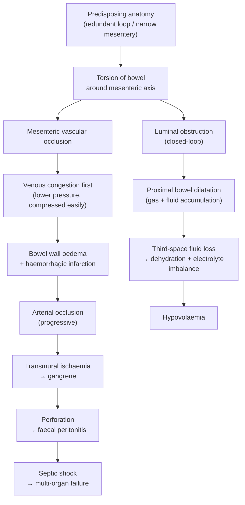

# Volvulus

## 1. Definition

Volvulus derives from the Latin *volvere*, meaning "to twist." It refers to the **torsion (twisting) of a segment of the alimentary tract around its own mesentery** [1][2]. This twisting creates two simultaneous pathological events:

1. **Intestinal obstruction** — the lumen is kinked shut at the point(s) of torsion.
2. **Vascular compromise** — the mesenteric vessels (veins first, then arteries) are compressed and occluded, leading to ischaemia and, if unreduced, gangrene, perforation, and peritonitis.

Because both the bowel lumen and its blood supply are compromised, volvulus is a **closed-loop obstruction** — the segment is obstructed at two points with no proximal or distal outlet [2][3]. This makes it one of the most dangerous forms of intestinal obstruction; it can progress from viable bowel to full-thickness necrosis within hours.

> ***Rotation of the colon along the axis formed by its mesentery → colon obstruction with impairment of circulation*** [1]

<Callout title="Key Concept — Closed-Loop Obstruction">
A closed-loop obstruction means the bowel is blocked at two points. The trapped segment cannot decompress in either direction — intraluminal pressure rises rapidly, compressing intramural veins first (venous congestion → oedema → arterial compromise → ischaemia → necrosis → perforation). This is why volvulus is a surgical emergency: timing is everything.
</Callout>

---

## 2. Epidemiology

### 2.1 Global Perspective

- Volvulus accounts for approximately **5–8% of all intestinal obstructions** in Western countries but up to **20–50%** in parts of Africa, the Middle East, and South Asia (the so-called "volvulus belt"), where a high-fibre diet and chronic constipation are prevalent [2].
- ***Volvulus is a common cause of large bowel obstruction***, second only to colorectal cancer in many series [1][5].

### 2.2 By Location

| Location | Frequency | Typical Patient |
|---|---|---|
| ***Sigmoid volvulus*** | ***~65–70%*** | Older adult **males**, mean age ~70 y; institutionalised / psychiatric patients; high-fibre diet regions [1][2] |
| ***Caecal volvulus*** | ***~25–30%*** | Younger **females**, mean age ~33–53 y [2][3] |
| ***Transverse colon*** | ***~3%*** | Rare [2] |
| ***Splenic flexure*** | ***~2%*** | Rare [2] |

### 2.3 Neonatal / Paediatric Volvulus

- In neonates, volvulus almost always means **midgut volvulus** secondary to ***malrotation*** [4][6][7].
- Onset classically ***Day 3–7*** of life (contrast with duodenal atresia which presents Day 1) [8].
- Malrotation with midgut volvulus is a **true neonatal surgical emergency** — delay leads to catastrophic loss of the entire midgut (short-gut syndrome for life).

<Callout title="High Yield — Adult vs Neonatal Volvulus" type="idea">
In **adults**, think sigmoid or caecal volvulus. In **neonates**, think midgut volvulus from malrotation. The pathophysiology (twist → obstruction + ischaemia) is the same, but the anatomy, urgency, and management differ dramatically.
</Callout>

---

## 3. Anatomy and Function

### 3.1 Why Does Volvulus Happen Where It Happens?

For a segment of bowel to twist on itself, it needs:
1. **A long mesentery** (mobile segment).
2. **A narrow mesenteric base** (small pivot point around which the bowel can rotate).
3. **A distensible, redundant loop** (provides the "lever arm" for torsion).

#### Sigmoid Colon
- The sigmoid colon is naturally a **mobile, redundant loop** with a relatively narrow mesenteric attachment.
- With chronic constipation, high-fibre diet, or ageing, the sigmoid elongates further ("redundant sigmoid"), and the mesenteric base narrows — the perfect setup for torsion.
- The two "feet" of the sigmoid (proximal descending colon and rectosigmoid junction) come close together, forming a narrow base around which the heavy, loaded loop can spin.

#### Caecum
- The caecum is normally **retroperitoneal** (fixed to the posterior abdominal wall).
- In some individuals (~10–25%), ***failed fusion of the ascending colon mesentery to the posterior parietal peritoneum*** during embryological development leaves the caecum **intraperitoneal and hypermobile** — it has its own mesentery and can therefore twist [3].

#### Midgut (Neonatal)
- ***Malrotation results in a short mesentery*** [4][6][7].
- During normal embryological development, the midgut undergoes a ***270° anticlockwise rotation*** around the superior mesenteric artery (SMA) and then becomes fixed, creating a **wide-based mesentery** stretching from the ligament of Treitz (LUQ) to the ileocaecal valve (RLQ) [3].
- When this rotation is ***incomplete (malrotation)***, the mesenteric base remains **abnormally narrow**. The entire midgut hangs from this narrow vascular pedicle like a fan — any slight twist can occlude the SMA and its branches, causing **midgut volvulus** [3][4].

### 3.2 Vascular Anatomy

| Segment | Arterial Supply | Relevance |
|---|---|---|
| Sigmoid colon | Sigmoid arteries (branches of IMA) | Twisted mesentery occludes these → sigmoid ischaemia |
| Caecum / ascending colon | Ileocolic and right colic arteries (branches of SMA) | Torsion occludes SMA branches → right colon ischaemia |
| Midgut (neonatal) | Entire SMA territory (D2 → proximal 2/3 transverse colon) | Midgut volvulus can infarct the **entire small bowel and right colon** |

---

## 4. Risk Factors

### 4.1 Sigmoid Volvulus

| Category | Risk Factor | Mechanism |
|---|---|---|
| **Anatomical** | ***Long redundant sigmoid colon with narrow mesenteric attachment*** [3] | Congenital elongation provides a long lever arm for torsion |
| **Dietary / Lifestyle** | ***High-fibre diet, chronic constipation, laxative abuse*** [2] | Chronic faecal loading elongates and dilates the sigmoid; bulky stool acts as a "mass" that drags the loop around |
| **Neuropsychiatric** | Institutionalised / psychiatric patients, Parkinson's disease | Medications (anticholinergics, antipsychotics, opioids) slow motility → chronic constipation → redundant sigmoid |
| **Age** | ***Ageing*** [2] | Loss of mesenteric elasticity and connective tissue → stretching of bowel and mesentery |
| ***Immobility*** | ***Bedbound patients*** [2] | Reduced peristalsis → chronic constipation |
| **GI Disease** | ***Hirschsprung disease*** [3] | Aganglionic distal segment → chronic proximal dilatation of sigmoid; freely mobile mesosigmoid predisposes to volvulus |
| **Obstetric** | ***Pregnancy*** [2] | Gravid uterus displaces sigmoid superiorly; hormonal effects relax smooth muscle |
| **Chagas disease** | Endemic in South America | Trypanosoma cruzi destroys myenteric plexus → megacolon → volvulus |

### 4.2 Caecal Volvulus

| Category | Risk Factor | Mechanism |
|---|---|---|
| **Congenital** | ***Failed fusion of ascending colon mesentery to posterior peritoneum → hypermobile caecum*** [2][3] | Allows the caecum to twist on a mobile mesentery |
| **Post-surgical** | ***Adhesions from abdominal surgery*** [3] | Create fixed points around which mobile caecum can rotate |
| **GI Disease** | ***Hirschsprung disease*** [3] | Chronic distension can promote caecal volvulus |
| **Colonoscopy / distal obstruction** | Any cause of massive caecal distension | Over-distended caecum on a mobile mesentery can flip and twist |

### 4.3 Midgut Volvulus (Neonatal)

| Category | Risk Factor | Mechanism |
|---|---|---|
| ***Malrotation*** | ***Failure of normal 270° anticlockwise rotation during weeks 4–10*** [3][4][6][7] | Narrow mesenteric base permits the entire midgut to twist around the SMA |
| ***Ladd bands*** | ***Peritoneal bands fixing abnormally positioned caecum to right lateral abdominal wall*** [3] | Cross over duodenum → extrinsic duodenal obstruction even without volvulus |
| Congenital diaphragmatic hernia, omphalocele, gastroschisis | Disrupted return of bowel to abdomen | Associated rotational anomalies |

---

## 5. Aetiology (with Hong Kong Focus)

In **Hong Kong**, the most relevant aetiologies are:

### 5.1 Adult Volvulus
- **Sigmoid volvulus** is less common in Hong Kong than in Africa/Middle East (lower fibre diet relative to those regions), but it is still the **second most common cause of large bowel obstruction after colorectal cancer**.
- ***Causes of colonic obstruction: Cancer, Volvulus, Diverticulitis, Stricture (anastomotic, radiation, ischaemic, endometriotic), Extrinsic compression (metastasis, pelvic/extraperitoneal tumour)*** [1][5].
- Elderly institutionalised patients (nursing homes) with chronic constipation and polypharmacy (anticholinergics, opioids) are the typical population.
- **Caecal volvulus** is rare but seen in younger patients post-abdominal surgery.

### 5.2 Neonatal Volvulus
- ***Malrotation with midgut volvulus*** is the critical diagnosis in any neonate with ***bilious vomiting*** [4][6][7][8].
- Incidence of malrotation: ~1 in 500 live births; ~75% present in the first month of life.
- In Hong Kong, most cases are identified in neonatal units at tertiary centres (Queen Mary Hospital, Prince of Wales Hospital).

---

## 6. Pathophysiology

### 6.1 Stepwise Pathogenesis of Volvulus

The pathophysiology follows a predictable cascade. Let's trace it step by step:

> ***Occurs when air-filled loop of sigmoid colon twists about its mesentery → intestinal obstruction and impairment of vascular perfusion when degree of torsion exceeds 180° and 360°*** [3]

#### Key Points in the Cascade

1. **Torsion ≥ 180°** → partial obstruction; **≥ 360°** → complete obstruction + significant vascular compromise [3].
2. **Veins are compressed before arteries** (because venous pressure is lower, ~5–10 mmHg vs arterial ~80–120 mmHg). This means:
   - Arterial inflow continues while venous outflow is blocked → **venous congestion → bowel wall oedema → haemorrhagic infarction** (the bowel turns dark purple/black).
   - Eventually, the oedema and rising intraluminal pressure also compress the arteries → **full-thickness ischaemia → gangrene**.
3. **Closed-loop mechanics**: The obstructed segment cannot decompress because both ends are twisted shut. Intraluminal pressure rises rapidly. Bacterial translocation occurs through the ischaemic, permeable bowel wall → **bacteraemia and endotoxaemia**.
4. **Proximal bowel** dilates with swallowed air and accumulated secretions → further fluid sequestration ("third spacing") → **dehydration, hypovolaemia, electrolyte disturbances**.

### 6.2 Specific Pathophysiology by Type

#### Sigmoid Volvulus
- The long, loaded sigmoid loop rotates around its narrow mesenteric pedicle (usually anticlockwise).
- The two limbs of the sigmoid approximate at the base → "coffee bean" appearance on AXR.
- Because the sigmoid is distal, **vomiting is a late feature** (contrast with proximal SBO where vomiting occurs early).
- **Abdominal distension is massive** (the trapped sigmoid loop fills with gas and can occupy the entire abdomen).

#### Caecal Volvulus
- Two types:
  - **Axial torsion** (true caecal volvulus): the caecum twists on its long axis.
  - **Caecal bascule**: the caecum folds anteriorly and superiorly (no actual twist, but still causes obstruction). Less common, less likely to cause ischaemia.
- Ischaemia occurs earlier than sigmoid volvulus because the caecal wall is thinner and distends more easily → wall tension rises (Laplace's law: wall tension = pressure × radius / wall thickness) → earlier vascular compromise.
- On AXR: the distended caecum characteristically **migrates to the LUQ or epigastrium** (like a "kidney-shaped" gas shadow in the wrong place).

#### Midgut Volvulus (Neonatal)
- ***Malrotation results in short mesentery → predisposes to midgut volvulus*** [4][6][7].
- The entire midgut (duodenum to mid-transverse colon) twists around the SMA.
- The consequences are catastrophic: ischaemia of the entire small bowel and right colon.
- ***Ladd bands*** crossing the duodenum add an element of **extrinsic duodenal obstruction** even before volvulus occurs [3].
- If not corrected urgently, the neonate loses the entire midgut → **short gut syndrome** (requires lifelong TPN or intestinal transplantation) [9].

<Callout title="Why Bilious Vomiting in Malrotation?" type="idea">
The obstruction in malrotation + midgut volvulus is at or distal to the ampulla of Vater (D2 of duodenum), where bile enters the GI tract. Therefore, the vomitus contains bile and is characteristically **green or fluorescent yellow** (bilious). ***Any neonate with bilious vomiting must be considered to have malrotation with midgut volvulus until proven otherwise*** — this is a surgical emergency [4][6][7][8].
</Callout>

---

## 7. Classification

### 7.1 By Anatomical Site

| Type | Site | Percentage | Key Feature |
|---|---|---|---|
| **Sigmoid volvulus** | Sigmoid colon | ***~65–70%*** | Most common in adults; responds to endoscopic decompression |
| **Caecal volvulus** | Caecum ± ascending colon | ***~25–30%*** | Usually requires surgery; high ischaemia rate |
| **Transverse colon volvulus** | Transverse colon | ***~3%*** | Very rare; requires surgery |
| **Splenic flexure volvulus** | Splenic flexure | ***~2%*** | Extremely rare |
| **Midgut volvulus** | Entire midgut (D2 → mid-transverse colon) | Neonatal | Always associated with malrotation |
| **Gastric volvulus** | Stomach | Rare in adults | Often secondary to paraesophageal (rolling-type) hiatal hernia; ***Borchardt's triad: severe epigastric pain, retching without vomiting, inability to pass NG tube*** [10] |

### 7.2 By Mechanism (Sigmoid and Caecal)

| Mechanism | Description |
|---|---|
| **Axial torsion** | Bowel rotates around its mesenteric axis (classic volvulus) |
| **Bascule** (caecal only) | Caecum folds anteriorly/superiorly without actual axial twist; less ischaemia risk but still causes obstruction |

### 7.3 Within Context of Intestinal Obstruction

- Volvulus is classified as:
  - A cause of **mechanical large bowel obstruction** (sigmoid, caecal) [1][5]
  - A cause of ***extrinsic*** **small bowel obstruction** (midgut volvulus, or SB volvulus from adhesive bands) [1]
  - A type of **closed-loop obstruction** [2][3]

> ***Most common causes of small bowel obstruction: Adhesions, Hernias, Malignancy (ABC: Adhesion, Bulge [hernia], Cancer)*** [1][3][5]
>
> ***Most common causes of large bowel obstruction: Cancer, Volvulus, Diverticular disease*** [1][3][5]

---

## 8. Clinical Features

### 8.1 Symptoms

The clinical presentation depends on the **site**, **degree of torsion**, and **presence of ischaemia**. The four ***cardinal features of intestinal obstruction*** apply [5]:

| Symptom | Pathophysiological Basis | Clinical Details |
|---|---|---|
| ***Abdominal pain*** | Torsion stretches the mesentery → visceral peritoneal irritation; closed-loop causes rapid intraluminal pressure rise; ischaemia activates nociceptors | ***Continuous and severe*** initially (mesenteric stretch + ischaemia); ***superimposed colicky component during peristalsis*** as the obstructed bowel tries to push contents past the twist [3]. In sigmoid volvulus, pain is typically **lower abdominal / LIF**. In caecal volvulus, pain is **RIF initially** but may become diffuse. ***Colicky pain becoming constant*** suggests transition from simple obstruction to ischaemia [2]. |
| ***Abdominal distension*** | The closed-loop segment traps gas (swallowed air + bacterial fermentation) and fluid; proximal bowel also dilates | ***Massive distension*** is characteristic of sigmoid volvulus (the entire sigmoid loop inflates like a balloon). Caecal volvulus causes more **localised asymmetric distension**. In neonatal midgut volvulus, distension may be **minimal** initially because the obstruction is proximal. |
| ***Vomiting*** | Proximal bowel dilates → retrograde peristalsis; vagal stimulation from mesenteric stretch | **Late** in sigmoid volvulus (distal obstruction — vomitus must travel retrograde through the entire colon and small bowel). **Early** in midgut volvulus (proximal obstruction). ***Bilious (green/fluorescent yellow) vomiting*** in neonatal midgut volvulus because obstruction is distal to ampulla of Vater [3][4][6][7][8]. |
| ***Absolute constipation (obstipation)*** | Complete luminal obstruction → no passage of flatus or faeces distally | Failure to pass both flatus and stool. Patients may report some initial passage of stool/flatus (evacuation of contents already distal to the twist) but then **complete cessation**. |

#### Additional Symptoms

| Symptom | Pathophysiological Basis |
|---|---|
| **Nausea and anorexia** | Vagal afferents from distended bowel → nausea centre in medulla |
| ***Haematochezia (bloody stool / PR bleeding)*** | Bowel wall ischaemia and mucosal necrosis → intraluminal haemorrhage [3] — this is a **late and ominous sign** indicating gangrenous bowel |
| **Failure to thrive / feeding intolerance** (neonatal) | Chronic partial obstruction from malrotation without acute volvulus → malabsorption [3] |

### 8.2 Signs

The signs on physical examination mirror the underlying pathophysiology and also help determine whether ischaemia/perforation has occurred — this distinction is critical because it changes management from conservative (endoscopic decompression) to **emergency surgery**.

#### General Examination

| Sign | Pathophysiological Basis | Clinical Significance |
|---|---|---|
| **Dehydration** (dry mucous membranes, reduced skin turgor, sunken eyes) | Third-space fluid loss into dilated bowel lumen and peritoneal cavity; vomiting; reduced oral intake | Assess fluid status; guides resuscitation |
| ***Tachycardia*** | Hypovolaemia → sympathetic activation; pain; sepsis (if gangrenous bowel) | Early sign of haemodynamic compromise |
| ***Hypotension*** | Severe hypovolaemia or septic shock from perforation/bacterial translocation | Late, ominous sign — suggests significant fluid deficit or established sepsis |
| ***Fever*** | Bowel ischaemia → bacterial translocation through permeable bowel wall → systemic inflammatory response | Suggests **gangrenous or perforated bowel** — indicates need for urgent surgery [3] |

#### Abdominal Examination

| Sign | Pathophysiological Basis | Clinical Significance |
|---|---|---|
| ***Abdominal distension*** | Trapped gas and fluid in closed-loop segment + proximal dilation | ***Sigmoid volvulus***: massive, tympanitic distension, often asymmetric (the distended sigmoid loop may be palpable). ***Caecal volvulus***: distended loop may be palpable in LUQ/epigastrium (displaced from RIF). |
| ***Abdominal tenderness*** | Mesenteric stretch; bowel wall oedema and ischaemia; peritoneal irritation | Localised initially; becomes **diffuse** with peritonitis. **Tenderness out of proportion to examination findings** may suggest ischaemia (similar to mesenteric ischaemia) [11]. |
| **Visible peristalsis** | Hyperperistalsis of proximal bowel trying to overcome obstruction | More common in thin patients with distal obstruction |
| **Bowel sounds** | Initially **hyperactive / high-pitched** (obstructive peristalsis → "tinkling"); later **absent** if ileus supervenes or bowel becomes gangrenous | ***Hyperactive → absent bowel sounds*** transition indicates progression from simple obstruction to ischaemia / paralytic phase [11] |
| **Tympanic percussion** | Gas-filled, distended bowel | Helps differentiate from ascites (which is dull) |
| **Empty rectum on PR examination** | Distal bowel is decompressed because obstruction is proximal to rectum | Classic finding in large bowel obstruction; ***absent rectal gas*** on AXR [2] |
| ***Peritoneal signs: Guarding, Rigidity, Rebound tenderness*** | Gangrenous bowel → perforation → faecal/purulent peritonitis → parietal peritoneal inflammation | **Red flags** indicating perforation — mandate **emergency laparotomy** [3]. Guarding = voluntary muscle contraction (pain). Rigidity = involuntary ("board-like abdomen") — indicates established peritonitis. Rebound tenderness = pain on release of palpation — peritoneal irritation. |
| **Blood on PR examination** | Mucosal ischaemia / necrosis → intraluminal bleeding | Ominous sign suggesting gangrenous bowel |

#### Signs Specific to Neonatal Midgut Volvulus

| Sign | Pathophysiological Basis |
|---|---|
| ***Bilious vomiting*** (the cardinal sign) | Obstruction distal to ampulla of Vater [3][4][6][7][8] |
| **Abdominal distension** (may be minimal) | Proximal obstruction → less distal bowel to distend |
| **Erythema / discolouration of abdominal wall** | Underlying gangrenous bowel → inflammation extends to parietal peritoneum and abdominal wall |
| ***Haemodynamic instability / shock*** | Hypovolaemia (dehydration, third spacing); septic shock (bowel necrosis, bacterial translocation) [3] |
| **Passage of bloody stools** | Ischaemic necrosis of midgut mucosa |

<Callout title="Clinical Pearl — Sigmoid vs Caecal Volvulus Presentation" type="idea">

| Feature | Sigmoid Volvulus | Caecal Volvulus |
|---|---|---|
| Age | Elderly (~70 y) | Younger (~33–53 y) |
| Sex | Male predominance | Female predominance |
| Onset | Often insidious; may have prior episodes | Usually acute |
| Distension | ***Massive*** | Moderate, asymmetric |
| Vomiting | Late | Earlier (more proximal obstruction) |
| AXR | ***Coffee bean sign arising from pelvis/LLQ; ahaustral; 3 converging lines*** | Dilated loop from RLQ, haustral markings; dilated SB |
| Rectal gas | ***Absent*** | ***Absent*** |
| Response to endoscopy | Often successful (~70–80%) | Usually unsuccessful; surgery indicated |

</Callout>

<Callout title="Red Flags — When Volvulus Has Progressed to Ischaemia / Gangrene" type="error">
The following signs indicate gangrenous bowel and mandate **emergency laparotomy** — do NOT attempt endoscopic decompression:
- ***Fever, tachycardia, hypotension*** (septic shock)
- ***Peritoneal signs: guarding, rigidity, rebound tenderness*** (perforation + peritonitis)
- ***Metabolic acidosis / raised lactate*** (tissue ischaemia)
- ***PR bleeding / bloody stool*** (mucosal necrosis)
- **Necrotic-appearing mucosa on endoscopy** (if sigmoidoscopy attempted)
</Callout>

---

## 9. Relevant Pathophysiology of Electrolyte and Metabolic Derangements

Because volvulus causes intestinal obstruction with vomiting and third-space losses, the metabolic consequences deserve explanation [3]:

| Derangement | Mechanism |
|---|---|
| **Hyponatraemia** | Loss of Na⁺ and water from vomiting (gastric secretions are Na⁺-rich); third-space sequestration |
| **Hypokalaemia** | Direct loss of K⁺ in vomitus; metabolic alkalosis shifts K⁺ intracellularly (H⁺/K⁺ exchange); RAAS activation (hypovolaemia → aldosterone → renal K⁺ wasting); increased NaHCO₃ delivery to distal nephron → urinary K⁺ secretion |
| **Metabolic alkalosis** | Loss of gastric HCl through vomiting → net gain of HCO₃⁻ in blood |
| **Metabolic acidosis (lactic)** | Bowel ischaemia → anaerobic glycolysis → lactate production; hypovolaemia → systemic hypoperfusion → end-organ ischaemia |
| **Raised serum lactate** | Sensitive marker for bowel ischaemia — correlates with severity of vascular compromise |
| **Leukocytosis** | Bowel wall ischaemia / necrosis → inflammation → neutrophilic response |

<Callout title="Why Can Metabolic Alkalosis AND Metabolic Acidosis Coexist?">
In early volvulus with prominent vomiting but no ischaemia yet, **metabolic alkalosis** predominates (loss of HCl). As ischaemia develops, **lactic acidosis** is superimposed. The ABG may show a mixed picture. A rising lactate in the context of volvulus is an ominous sign — it means the bowel is dying.
</Callout>

---

## 10. Associations and Related Conditions

### 10.1 Hirschsprung Disease and Volvulus
- ***Sigmoid volvulus can be the first presentation in Hirschsprung disease*** [3].
- The aganglionic segment (usually rectosigmoid) causes functional obstruction → chronic proximal sigmoid dilatation and elongation → freely mobile mesosigmoid → predisposes to volvulus.
- ***Hirschsprung-associated enterocolitis (HAEC)*** can also cause volvulus of the sigmoid or transverse colon, related to ***torsion of an enlarged colonic segment filled with meconium or feces*** [3].

### 10.2 Meckel Diverticulum and Volvulus
- A Meckel diverticulum can act as a **lead point for volvulus** of the small bowel (the diverticulum creates a fixed point around which the ileum can twist) [12].
- Can also cause **intussusception** or **Littre's hernia**.

### 10.3 Ischaemic Bowel and Volvulus
- ***Mechanical causes of ischaemic bowel: volvulus, strangulating hernia*** [2][5][11].
- Volvulus is both an **extrinsic cause** of mesenteric ischaemia (twisting of vessels) and a cause of **non-occlusive ischaemia** (distension → raised intraluminal pressure → reduced perfusion).

### 10.4 Short Gut Syndrome
- Midgut volvulus with extensive bowel necrosis requiring massive resection is a major cause of ***short gut syndrome (SBS) in children*** [9].

---

<Callout title="High Yield Summary">

**Definition**: Volvulus = twisting of bowel around its mesentery → **closed-loop obstruction + vascular compromise**.

**Sites**: Sigmoid (~65–70%) > Caecum (~25–30%) > Transverse (~3%) > Splenic flexure (~2%). Neonates = midgut volvulus from malrotation.

**Risk Factors (Sigmoid)**: Redundant sigmoid, chronic constipation, high-fibre diet, elderly, bedbound, neuropsychiatric patients, Hirschsprung disease.

**Risk Factors (Caecal)**: Congenital mobile caecum (failed retroperitoneal fixation), post-surgical adhesions.

**Risk Factors (Midgut)**: Malrotation → narrow mesenteric base → entire midgut suspended from SMA pedicle.

**Pathophysiology**: Torsion → venous congestion first (low pressure) → bowel wall oedema → arterial compromise → gangrene → perforation → peritonitis → septic shock.

**Clinical Features**: Cardinal features of IO — abdominal pain (colicky → constant = ischaemia), abdominal distension (massive in sigmoid), vomiting (late in sigmoid, early and bilious in neonatal midgut), absolute constipation.

**Red Flags for Ischaemia**: Fever, tachycardia, hypotension, peritonism (guarding/rigidity/rebound), metabolic acidosis/raised lactate, PR bleeding.

**AXR**: Sigmoid = ***coffee bean sign***, ahaustral, arising from pelvis. Caecal = dilated haustral loop from RLQ, dilated SB.

**Key Exam Point**: ***Bilious vomiting in a neonate = malrotation with midgut volvulus until proven otherwise — surgical emergency.***

</Callout>

---

<ActiveRecallQuiz
  title="Active Recall - Volvulus (Definition to Clinical Features)"
  items={[
    {
      question: "Define volvulus and explain why it is classified as a closed-loop obstruction.",
      markscheme: "Volvulus = twisting of bowel around its mesentery. Closed-loop because the bowel is obstructed at two points (proximal and distal twist), trapping a segment with no outlet. This leads to rapid rise in intraluminal pressure, vascular compromise, and risk of ischaemia/perforation."
    },
    {
      question: "What are the two most common sites for adult colonic volvulus, and which demographic does each classically affect?",
      markscheme: "Sigmoid volvulus (65-70%): elderly males, mean age 70. Caecal volvulus (25-30%): younger females, mean age 33-53."
    },
    {
      question: "Explain the embryological basis of midgut volvulus in neonates.",
      markscheme: "Normal development: midgut rotates 270 degrees anticlockwise around SMA, then fixes to create wide mesenteric base (Treitz to ileocaecal valve). Malrotation: incomplete rotation leaves a narrow mesenteric base. Entire midgut hangs from this narrow pedicle, permitting it to twist around SMA causing midgut volvulus."
    },
    {
      question: "Why does venous congestion precede arterial compromise in volvulus?",
      markscheme: "Veins have lower intramural pressure (5-10 mmHg) compared to arteries (80-120 mmHg), so they are compressed first by the twisting mesentery. Arterial inflow continues while venous outflow is blocked, causing venous congestion, bowel wall oedema, and haemorrhagic infarction before arterial occlusion occurs."
    },
    {
      question: "A 3-day-old neonate presents with bilious vomiting. What is the most important diagnosis to exclude and why is the vomiting bilious?",
      markscheme: "Malrotation with midgut volvulus. Bilious because obstruction is distal to ampulla of Vater (D2 duodenum) where bile enters the GI tract. This is a surgical emergency; delay risks loss of entire midgut leading to short gut syndrome."
    },
    {
      question: "List three clinical signs that indicate gangrenous bowel in volvulus and mandate emergency laparotomy rather than endoscopic decompression.",
      markscheme: "Any 3 of: (1) Peritoneal signs - guarding, rigidity, rebound tenderness; (2) Fever with tachycardia and hypotension (septic shock); (3) Metabolic acidosis or raised serum lactate; (4) PR bleeding or bloody stool; (5) Necrotic mucosa seen on endoscopy."
    }
  ]}
/>

## References

[1] Lecture slides: GC 194. Intestinal obstruction colorectal cancer.pdf (p41, p60)
[2] Senior notes: maxim.md (Section: Volvulus)
[3] Senior notes: felixlai.md (Sections: Volvulus, Intestinal obstruction, Malrotation)
[4] Lecture slides: GC 205. The newborn baby is vomiting repeatedly Neonatal intestinal obstruction and other GI emergencies.pdf (p22)
[5] Lecture slides: GC 195. Lower and diffuse abdominal pain RLQ problems; pelvic inflammatory disease; peritonitis and abdominal emergencies.pdf (p28, p31)
[6] Lecture slides: Neonatal Surgery.pdf (p31)
[7] Lecture slides: Case Study – Paediatric Surgery Bilious vomiting of new-born _ACH Fung.pdf
[8] Senior notes: maxim.md (Section: Malrotation & volvulus table)
[9] Senior notes: felixlai.md (Section: Short gut syndrome)
[10] Senior notes: maxim.md (Section: Gastric volvulus)
[11] Senior notes: maxim.md (Section: Ischemic bowel disease)
[12] Senior notes: maxim.md (Section: Meckel diverticulum)
