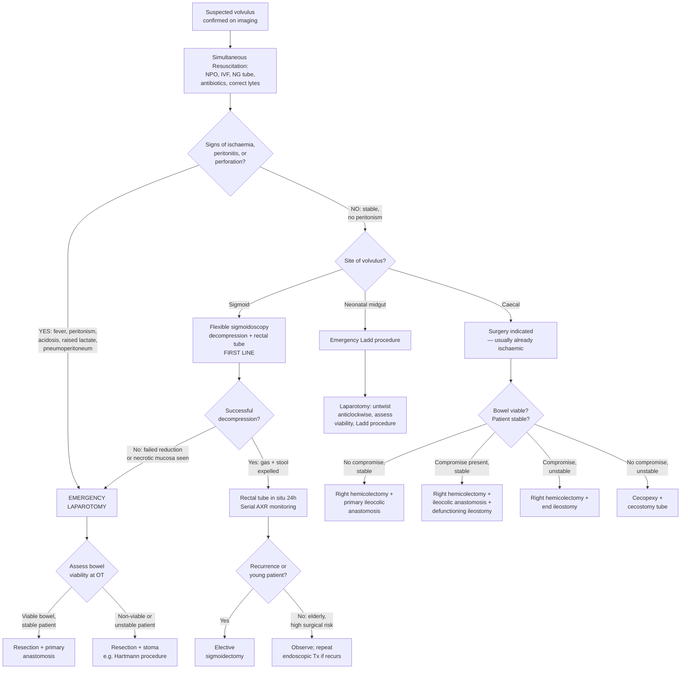

## Management of Volvulus

### 1. General Principles

The management of volvulus follows a logical cascade that every surgeon thinks through — sometimes in seconds at 3 AM:

1. **Is the patient dying right now?** → Resuscitate first (ABC).
2. **Is the bowel dying?** → If yes, emergency laparotomy — no time for endoscopy.
3. **Can I decompress non-operatively?** → If sigmoid volvulus without ischaemia, try endoscopic decompression first.
4. **How do I prevent recurrence?** → Definitive surgery (elective resection) for appropriate patients.

The fundamental decision tree splits on **two axes**:
- **Site**: Sigmoid vs Caecal vs Midgut (neonatal) — because the management differs dramatically.
- **Bowel viability**: Viable (no ischaemia) vs Compromised (ischaemia/gangrene/perforation) — because this determines whether you can attempt conservative measures or must operate immediately.

---

### 2. Management Algorithm — Overview (Mermaid)

---

### 3. Initial Resuscitation (All Types)

Before any definitive treatment — whether endoscopic or surgical — every patient with volvulus needs simultaneous resuscitation. This is the **"drip and suck"** approach familiar from any intestinal obstruction [2][3][18]:

> ***Initial: NPO, drip & suck, IV antibiotics*** [2]

> ***Non-operative treatment: Intravenous fluid and electrolytes, Nasogastric decompression, Nutrition when prolonged fasting is anticipated, Frequent monitor of vital signs, abdominal signs and X-rays*** [18]

| Measure | Rationale | Details |
|---|---|---|
| ***Nil per os (NPO)*** [3][18] | Limits further bowel distension from swallowed air/fluid; reduces aspiration risk for anaesthesia | All patients, immediately |
| ***IV fluid resuscitation (Drip)*** [3][18] | Replaces intravascular volume lost through vomiting, third-space sequestration into dilated bowel, and reduced oral intake | Crystalloids (normal saline, Ringer's lactate, Hartmann's); guide by urine output, HR, BP. K⁺ replacement guided by serum levels (cautious in AKI) [3]. |
| ***Nasogastric tube decompression (Suck)*** [3][18] | Decompresses proximal bowel → reduces vomiting → reduces aspiration risk → reduces intraluminal pressure | NG tube (Ryle or Salem Sump) on **free drainage + 4-hourly aspiration** [3]. In neonates: OGT (orogastric tube) [8]. |
| ***IV antibiotics*** [2][3] | Bacterial translocation occurs through ischaemic, permeable bowel wall → prophylaxis against bacteraemia and peritonitis | Broad-spectrum covering bowel flora: typically ***IV ceftriaxone + metronidazole*** [13] or piperacillin-tazobactam. Mandatory for all patients undergoing surgery; warranted especially with complicated obstruction [3]. |
| **Analgesia** | Mesenteric stretch + ischaemia cause severe pain | Opioids are reasonable, though pain from mechanical IO often responds incompletely to analgesics [3]. |
| **Urinary catheter** | Monitor urine output as a guide to resuscitation adequacy | Target UO > 0.5 mL/kg/h (adults); > 1 mL/kg/h (neonates) |
| **Monitoring** | Detect deterioration early | ***Frequent monitor of vital signs, abdominal signs and X-rays*** [18] — serial abdominal examination, temperature, HR, BP, WCC, lactate, ABG |

<Callout title="Why Antibiotics for Everyone?" type="idea">
Even if the bowel looks viable on imaging, you cannot be sure until you see it directly (at endoscopy or surgery). Bacterial translocation begins early — as soon as the bowel wall becomes congested and oedematous, its mucosal barrier function is compromised. Giving antibiotics upfront provides a safety net against developing sepsis during the time between diagnosis and definitive treatment.
</Callout>

---

### 4. Indications for Emergency Surgery (All Types)

The lecture slides clearly delineate when conservative management must be abandoned and the patient taken straight to the operating theatre:

> ***Indications for urgent surgery: Incarcerated, strangulated hernia; Suspected or proven strangulation; Peritonitis; Pneumoperitoneum; Pneumatosis cystoides intestinalis; Close loop obstruction; Volvulus with peritoneal signs*** [1]

Translating this to volvulus specifically:

| Indication | Why |
|---|---|
| ***Peritonitis (guarding, rigidity, rebound tenderness)*** | Indicates bowel perforation → faecal contamination of peritoneal cavity → endoscopic intervention is futile and dangerous (insufflation would worsen contamination) |
| ***Pneumoperitoneum (free gas under diaphragm)*** | Confirmed perforation — needs source control (resection of perforated bowel) |
| ***Pneumatosis cystoides intestinalis*** | Gas in bowel wall = transmural necrosis from bacterial invasion — the bowel is dead |
| ***Volvulus with peritoneal signs*** [1] | Combined mechanical + vascular compromise with peritoneal irritation — endoscopic decompression will not save gangrenous bowel |
| **Failed endoscopic decompression** | If the sigmoidoscope cannot reduce the volvulus, the twist is too tight or the bowel is too compromised → surgery is the only option [2][3] |
| **Necrotic mucosa visualised at endoscopy** | If sigmoidoscopy reveals dark, necrotic, or non-viable mucosa → ***procedure should be immediately stopped*** to prevent perforation → proceed to laparotomy [3] |
| **Haemodynamic instability refractory to resuscitation** | Suggests established sepsis from gangrenous bowel → source control urgently needed |

---

### 5. Management by Type

#### 5.1 Sigmoid Volvulus

Sigmoid volvulus is the one type where **non-operative management is the preferred first-line approach** — specifically, endoscopic decompression. This is because the sigmoid is easily accessible with a sigmoidoscope, and successful decompression avoids an emergency operation in what is typically an elderly, comorbid patient.

> ***Sigmoidoscopic decompression (recurrence: 50%). Surgery (perforation, strangulation or failed decompression). Resection.*** [1]

> ***Sigmoid volvulus: conservative decompression preferred*** [2][18]

##### A. Non-Operative: Endoscopic Decompression (First Line)

| Step | Details | Rationale |
|---|---|---|
| **Instrument** | ***Flexible sigmoidoscopy*** [2] or rigid sigmoidoscopy [17] | The flexible scope can navigate the twist more easily; rigid scope is simpler and available at bedside |
| **Technique** | ***De-rotation with cautious insufflation*** [2] — gentle pressure advances the scope past the point of torsion, straightening and untwisting the sigmoid colon [3] | Minimal insufflation is critical — excessive air pressure in an already compromised bowel risks perforation |
| **Signs of success** | ***Sudden expulsion of gas and stool*** [2]; visualisation of a ***dilated proximal segment filled with gas and stool*** [3] | The decompressed segment releases its trapped contents when the twist is undone |
| **Viability assessment** | ***Allows assessment of viability of the colon — mucosa proximal to the site of obstruction should be inspected for evidence of bowel ischaemia*** [3] | Pink, healthy-looking mucosa = viable → proceed with rectal tube. Dark, necrotic mucosa = gangrenous → **stop immediately** and go to surgery [3]. |
| **Post-decompression** | ***Leave rectal tube in situ for 24 hours for decompression → serial AXR to monitor*** [2] | The rectal tube maintains the lumen open, prevents immediate re-torsion, and allows ongoing gas/stool drainage while the oedematous bowel recovers |
| **Success rate** | ~70–80% initial success | But ***recurrence rate is ~50%*** [1] — hence the need for definitive surgery in selected patients |

> ***Lower gastrointestinal endoscopy — Diagnostic. Therapeutic: Decompression in sigmoid volvulus and pseudo-obstruction. Stenting. Cautions: to avoid excessive insufflation of gas*** [1]

**Contraindications to endoscopic decompression:**
- ***Peritonitis*** (guarding, rigidity, rebound tenderness) [1]
- ***Perforation*** (pneumoperitoneum on CXR/AXR)
- ***Necrotic mucosa*** seen during the procedure [3]
- **Haemodynamic instability** unresponsive to resuscitation

<Callout title="Why Not Just Keep Doing Endoscopic Decompression?" type="error">
Because the ***recurrence rate is ~50%*** [1]. Each recurrence carries the same risk of ischaemia, gangrene, and perforation. Repeated endoscopic decompression without definitive surgery is like repeatedly draining an abscess without treating the source — eventually, you will lose the patient. This is why elective sigmoidectomy is recommended for appropriate candidates after successful initial decompression.
</Callout>

##### B. Operative Management — Emergency

***Indicated when sigmoidoscopic reduction is unsuccessful, or in patients with signs and symptoms suggestive of peritonitis*** [3].

The choice of operation depends on **bowel viability** and **patient fitness**:

| Scenario | Operation | Explanation |
|---|---|---|
| **Viable bowel, stable patient, no contamination** | ***Sigmoid colectomy with primary anastomosis*** [3] | The redundant sigmoid is resected and the two healthy bowel ends are joined directly. Only safe when bowel ends are viable, no peritoneal contamination, and the patient is haemodynamically stable [3]. On-table colonic lavage may be performed to decompress and clean the unprepared proximal colon [2]. |
| **Non-viable bowel, or contamination, or unstable patient** | ***Emergency Hartmann's operation*** [2][18] — sigmoid resection + formation of **end colostomy** at LIF + closure of **rectal stump** | When the bowel is gangrenous or perforated, or the patient is too unstable for a prolonged operation with anastomosis, Hartmann's is the safer choice. A primary anastomosis in a contaminated, inflamed, or unprepared field has a very high leak rate. The colostomy can be reversed electively in 2–3 months [18]. |
| **Alternative to Hartmann's** | ***Paul-Mikulicz procedure*** — resection of volvulus + formation of **double-barrel colostomy** for future anastomosis [2] | Both ends of the bowel are brought out as adjacent stomas. This avoids leaving a closed rectal stump (which can leak/form abscess). Easier to reverse than Hartmann's. |
| **Sigmoidopexy** | Fixation of sigmoid colon to posterior abdominal wall | ***Rarely performed due to high risk of recurrence*** [3] — the underlying problem (redundant sigmoid) is not addressed |

##### C. Elective Sigmoidectomy — Definitive / Recurrence Prevention

> ***Elective sigmoidectomy: for young patients or elderly with recurrent volvulus (not in every elderly: high mortality) due to high risk of recurrence after endoscopic Tx*** [2]

| Indication | Rationale |
|---|---|
| **Young / fit patients** after first episode | The ***recurrence rate after endoscopic decompression alone is ~50%*** [1]. Young patients have many decades ahead — the cumulative risk of recurrent volvulus with eventual gangrene is unacceptable. Elective surgery in a prepared, stable patient has much lower mortality than emergency surgery for a recurrence with gangrene. |
| **Elderly patients with recurrent volvulus** | If an elderly patient has had ≥ 2 episodes despite endoscopic treatment, the benefit of elective surgery outweighs the risk. However, elective sigmoidectomy is **not offered to every elderly patient** after first episode because the surgical mortality in this frail population is significant [2]. |
| **Patients who cannot be reduced endoscopically but have no acute ischaemia** | Semi-urgent sigmoidectomy after resuscitation |

The elective operation is typically a **sigmoid colectomy with primary colorectal anastomosis** (one-stage procedure). This can be done open or laparoscopically.

---

#### 5.2 Caecal Volvulus

Caecal volvulus is fundamentally different from sigmoid volvulus in management because:
1. ***Endoscopic reduction with colonoscopy is RARELY successful and therefore should NOT be attempted*** [3] — the colonoscope cannot reliably navigate the twist.
2. ***Caecal volvulus is usually already ischaemic*** at presentation [2] — the thin-walled caecum distends rapidly (Laplace's law), and vascular compromise occurs early.
3. Therefore, ***surgery is indicated*** as the primary treatment [2].

> ***Caecal volvulus: surgery is indicated — usually ischaemic. Surgery: right hemicolectomy. Colonoscopic derotation ± caecopexy (fixation of caecum to RIF) — high recurrence*** [2]

The operative approach is guided by **bowel viability** and **haemodynamic stability** [3]:

| Bowel Compromise | Haemodynamic Stability | Treatment | Rationale |
|---|---|---|---|
| **No** | **Stable** | ***Surgical detorsion + Right hemicolectomy with primary ileocolic anastomosis*** [3] | Resection is required because ***detorsion alone is associated with a high failure rate*** — the underlying mobile caecum will simply twist again [3]. Right hemicolectomy removes the mobile caecum and ascending colon, eliminating the substrate for recurrence. |
| **No** | **Unstable** | ***Cecopexy + Cecostomy tube placement*** [3] | ***ONLY for patients who cannot tolerate a resectional procedure*** [3]. Cecopexy = fixation of caecum to RIF peritoneum to prevent re-torsion. Cecostomy tube = decompresses the caecum. However, recurrence is high because the fundamental problem (mobile caecum) is not fully addressed. |
| **Yes** | **Stable** | ***Right hemicolectomy with primary ileocolic anastomosis + defunctioning loop ileostomy*** [3] | ***Detorsion is NOT performed*** when the bowel is compromised because ***reperfusion of compromised bowel may promote bacteraemia and sepsis*** [3]. The gangrenous segment is resected en bloc. A defunctioning ileostomy protects the anastomosis. |
| **Yes** | **Unstable** | ***Right hemicolectomy with end ileostomy*** [3] | Quickest, safest option in a critically ill patient. No anastomosis (avoids leak risk). ***Ileostomy is reversed once the patient is stabilised*** [3]. |

<Callout title="Why NOT Detorse a Gangrenous Caecum?">
It seems intuitive to untwist the bowel first to "save" it. But if the bowel is already gangrenous, untwisting it restores blood flow to dead, bacteria-laden tissue. This creates a **reperfusion injury**: reactive oxygen species flood the necrotic tissue, bacterial toxins and endotoxin wash out into the portal and systemic circulation, and the patient develops overwhelming sepsis. This is why ***detorsion is NOT performed when bowel is compromised*** [3] — you resect the dead bowel without untwisting it first.
</Callout>

---

#### 5.3 Neonatal Midgut Volvulus (Malrotation)

This is a **pure surgical emergency**. There is no role for endoscopic management. The baby goes to theatre.

> ***Management: Time is essence. Laparotomy. Malrotation — Ladd's procedure. Midgut volvulus: De-torting of volvulus, Assess viability, Resection if needed*** [4][6]

##### Pre-operative Preparation [3][8]

| Step | Details |
|---|---|
| ***NPO*** | Immediately on suspicion |
| ***NG/OGT decompression*** | Decompress stomach and proximal duodenum |
| ***IV access + bolus fluid*** | NS 10–20 mL/kg; correct electrolytes, glucose |
| ***Broad-spectrum IV antibiotics*** | Cover bowel flora (e.g., ampicillin + gentamicin + metronidazole) |
| **Warming** | Neonates lose heat rapidly — maintain normothermia |
| ***Bloods***: electrolytes, glucose, CBC, blood gas, cross-match | Pre-operative workup |

##### The Ladd Procedure — Step by Step

The Ladd procedure (*named after Dr William Ladd, 1880–1967, pioneer of paediatric surgery*) is the definitive operation for malrotation ± midgut volvulus. Understanding its steps requires understanding what went wrong embryologically:

> ***Untwist the bowel if volvulus (anticlockwise). Check viability ± resect ± anastomosis. Widen mesentery. Appendectomy. Return large bowel to left, small bowel to right (non-rotation position).*** [7]

| Step | Technique | Rationale |
|---|---|---|
| **1. Assessment for volvulus** [3] | Inspect the mesentery for twisting; identify the direction of rotation | Must determine if volvulus is present before proceeding |
| **2. Detorsion** | ***Volvulus is untwisted counterclockwise*** [3][7] | Midgut volvulus occurs clockwise (following the failed rotation); therefore, you reverse it by going anticlockwise |
| **3. Assess viability** | ***Check viability ± resect ± anastomosis*** [7]. Inspect bowel colour, peristalsis, mesenteric arterial pulsation. Wrap in warm saline-soaked packs and reassess after 15–20 minutes if questionable. | ***Necrotic segments should be resected; segments with questionable viability should be preserved to avoid short bowel syndrome*** [3] — you only resect what is clearly dead. In a neonate, every centimetre of bowel matters. |
| **4. Ladd band division** | ***Ladd bands are fibrous bands that run between duodenum and cecum*** → divide them completely [3] | These bands cross the duodenum and cause extrinsic compression. Dividing them relieves duodenal obstruction. |
| **5. Widen mesentery** | ***Widen mesentery*** [7] — the narrow mesenteric base is broadened by dividing peritoneal attachments | A wider base reduces the risk of re-volvulus (harder for a wide fan to twist than a narrow pedicle) |
| **6. Appendectomy** | ***Appendectomy*** [3][7] | The caecum is placed in the LUQ (non-rotation position) after the procedure. If the patient develops appendicitis in the future, it would present with LUQ pain, confusing the clinical picture. Removing the appendix pre-emptively eliminates this diagnostic trap. |
| **7. Position bowel in non-rotation** | ***Return large bowel to left, small bowel to right (non-rotation position)*** [7] | The purpose of surgery is ***NOT to return the bowel to a normal configuration (which is anatomically impossible)*** [3], but to place it in a **stable non-rotation position** — small bowel on the right, colon on the left — with a widened mesenteric base. This creates adhesions that hold the bowel in place and makes future volvulus unlikely. |

<Callout title="Why Non-Rotation and Not 'Normal' Position?">
Normal rotation requires 270° of anticlockwise rotation with subsequent fixation — you cannot recreate this surgically. Instead, the Ladd procedure places the bowel in the position of **non-rotation** (which is actually what the bowel looks like if it never rotated at all). The key is that the mesentery is widened and the bowel is positioned so it cannot twist. Adhesions that form post-operatively further stabilise the bowel.
</Callout>

##### If Extensive Bowel Necrosis Is Found

- If the entire midgut is gangrenous (catastrophic midgut volvulus), the surgeon faces an agonising decision: resecting the entire midgut leaves the child with **short gut syndrome** requiring lifelong TPN or intestinal transplantation.
- ***Resection if needed*** [4][6] — but the principle is maximal bowel preservation. A "second-look" laparotomy at 24–48 hours may be planned to reassess borderline segments before committing to resection.

---

### 6. Summary Table — Management by Type

| Type | First-Line | Indications for Surgery | Definitive Operation | Recurrence Prevention |
|---|---|---|---|---|
| ***Sigmoid volvulus*** | ***Flexible sigmoidoscopy decompression + rectal tube*** [1][2] | Failed endoscopy, peritonitis, perforation, necrotic mucosa at endoscopy, haemodynamic instability | Sigmoid colectomy ± primary anastomosis or ***Hartmann's*** [2][18] | ***Elective sigmoidectomy*** for young patients or recurrent volvulus [2] |
| ***Caecal volvulus*** | ***Surgery*** (endoscopy NOT recommended) [2][3] | All cases — surgery is primary treatment | ***Right hemicolectomy*** with primary ileocolic anastomosis (stable) or end ileostomy (unstable) [3] | Right hemicolectomy is definitive (removes mobile caecum) |
| ***Neonatal midgut volvulus*** | ***Emergency Ladd procedure*** [4][6][7] | All cases — this is a surgical emergency | ***Ladd procedure*** (detorsion, Ladd band division, widen mesentery, appendectomy, non-rotation positioning) ± bowel resection [3][7] | Ladd procedure itself prevents recurrence by widening mesentery + creating adhesions |

---

### 7. Assessing Bowel Viability at Surgery

A critical intra-operative decision is whether the bowel is viable or needs resection. The surgeon assesses [3]:

| Feature | Viable | Non-Viable |
|---|---|---|
| **Colour** | ***Dark colour becomes lighter*** (after detorsion/reperfusion) | ***Dark colour persists*** (does not pink up) |
| **Mesenteric pulsation** | ***Visible pulsation in mesenteric arteries*** | ***No detectable pulsation*** |
| **Surface appearance** | ***Shiny*** (serosal glistening intact) | ***Dull and lusterless*** (serosal necrosis) |
| **Peristalsis** | ***Peristalsis may be observed*** (give it time — wrap in warm packs for 10–15 min) | ***No peristalsis*** |
| **Musculature** | ***Firm*** (maintains tone) | Flaccid, paper-thin |

If viability is equivocal, the surgeon may use adjuncts:
- **Intravenous fluorescein + Wood's lamp**: fluorescein glows under UV light in perfused tissue; non-perfused tissue remains dark.
- **Doppler ultrasound** of mesenteric vessels.
- **Second-look laparotomy** at 24–48 hours (especially in neonates where preserving maximal bowel length is critical) [3].

---

### 8. Post-Operative Care and Monitoring

| Aspect | Details |
|---|---|
| **NG/OGT decompression** | Continue until bowel function returns (passage of flatus/stool) |
| **IVF / TPN** | Continue IV fluids; TPN if prolonged NPO anticipated (especially neonates) |
| **Serial AXR** | Monitor for resolution of dilatation; detect early re-volvulus or anastomotic leak |
| **Stoma care** (if applicable) | Education on colostomy/ileostomy management; plan for reversal (typically 2–3 months post-op for Hartmann's) |
| **Signs of resolution** [18] | ***Passage of flatus/stool, decreased abdominal distension, reduced NG tube output, resolved AXR signs*** |

---

<Callout title="High Yield Summary — Management of Volvulus">

**All volvulus**: Resuscitate first — ***NPO, IVF, NG tube, IV antibiotics, monitoring***.

**Sigmoid volvulus**:
- ***First line: Flexible sigmoidoscopy decompression with cautious insufflation*** → rectal tube in situ 24h → serial AXR.
- ***Recurrence ~50%*** → elective sigmoidectomy for young patients or recurrent episodes.
- Surgery if: failed endoscopy, peritonitis, perforation, necrotic mucosa at endoscopy.
- Operations: Sigmoid colectomy + primary anastomosis (viable, stable) or ***Hartmann's*** (non-viable/unstable/contaminated) or Paul-Mikulicz (double-barrel colostomy).

**Caecal volvulus**:
- ***Endoscopy NOT recommended*** — surgery is the primary treatment.
- ***Right hemicolectomy*** is definitive.
- Match operation to patient stability: primary anastomosis (stable) vs end ileostomy (unstable).
- ***Do NOT detorse gangrenous bowel*** — reperfusion injury causes sepsis.

**Neonatal midgut volvulus**:
- ***Emergency Ladd procedure***: Untwist anticlockwise → assess viability ± resect → divide Ladd bands → widen mesentery → appendectomy → non-rotation position.
- ***Time is essence*** — delay = short gut syndrome.

**Indications for emergency laparotomy**: ***Peritonitis, pneumoperitoneum, pneumatosis, volvulus with peritoneal signs, failed endoscopic decompression, necrotic mucosa at endoscopy***.

</Callout>

---

<ActiveRecallQuiz
  title="Active Recall - Management of Volvulus"
  items={[
    {
      question: "What is the first-line treatment for sigmoid volvulus without signs of ischaemia, and what indicates successful decompression?",
      markscheme: "First line: flexible sigmoidoscopy decompression with cautious insufflation. Success indicated by sudden expulsion of gas and stool. Post-procedure: leave rectal tube in situ for 24h for ongoing decompression, serial AXR monitoring."
    },
    {
      question: "Why is elective sigmoidectomy recommended after successful endoscopic decompression of sigmoid volvulus in young patients?",
      markscheme: "Because recurrence rate after endoscopic decompression alone is approximately 50%. Young patients have many decades of cumulative recurrence risk. Each recurrence risks ischaemia, gangrene, and perforation. Elective surgery in a prepared stable patient has much lower mortality than emergency surgery for gangrenous recurrence."
    },
    {
      question: "Name the five steps of the Ladd procedure for neonatal malrotation with midgut volvulus.",
      markscheme: "(1) Untwist volvulus anticlockwise and assess viability, resect necrotic segments if needed. (2) Divide Ladd bands between duodenum and caecum. (3) Widen the mesenteric base. (4) Appendectomy. (5) Return bowel to non-rotation position — large bowel to left, small bowel to right."
    },
    {
      question: "A patient with caecal volvulus has gangrenous bowel and is haemodynamically unstable. What operation should be performed and why is detorsion avoided?",
      markscheme: "Right hemicolectomy with end ileostomy (no anastomosis in unstable patient). Detorsion is avoided because reperfusion of compromised/gangrenous bowel washes bacterial toxins and endotoxin into the systemic circulation, promoting bacteraemia and septic shock. The dead bowel is resected en bloc without untwisting."
    },
    {
      question: "List four indications for emergency laparotomy in volvulus as mentioned in the lecture slides.",
      markscheme: "Any 4 of: (1) Peritonitis, (2) Pneumoperitoneum, (3) Pneumatosis cystoides intestinalis, (4) Volvulus with peritoneal signs, (5) Failed endoscopic decompression, (6) Suspected or proven strangulation, (7) Incarcerated strangulated hernia, (8) Close-loop obstruction."
    },
    {
      question: "What is a Hartmann's operation and when is it indicated in sigmoid volvulus?",
      markscheme: "Hartmann's operation: sigmoid resection + formation of temporary end colostomy at LIF + closure of rectal stump. Re-anastomosis performed electively 2-3 months later. Indicated when sigmoid is gangrenous/perforated, there is faecal contamination of peritoneal cavity, or the patient is haemodynamically unstable — situations where primary anastomosis has unacceptably high leak rate."
    }
  ]}
/>

## References

[1] Lecture slides: GC 194. Intestinal obstruction colorectal cancer.pdf (p25, p44, p62)
[2] Senior notes: maxim.md (Section: Volvulus, Hartmann's operation)
[3] Senior notes: felixlai.md (Sections: Volvulus — Treatment, Intestinal obstruction — Treatment, Intestinal malrotation — Treatment)
[4] Lecture slides: GC 205. The newborn baby is vomiting repeatedly Neonatal intestinal obstruction and other GI emergencies.pdf (p25)
[6] Lecture slides: Neonatal Surgery.pdf (p33)
[7] Lecture slides: Case Study – Paediatric Surgery Bilious vomiting of new-born _ACH Fung.pdf (p34)
[8] Senior notes: maxim.md (Section: Malrotation & volvulus table — Management)
[13] Senior notes: maxim.md (Section: Intestinal obstruction — Initial management)
[17] Senior notes: maxim.md (Section: Rigid sigmoidoscopy — Therapeutic indication)
[18] Lecture slides: GC 194. Intestinal obstruction colorectal cancer.pdf (p7, p28, p43)
