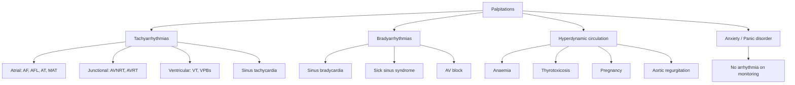
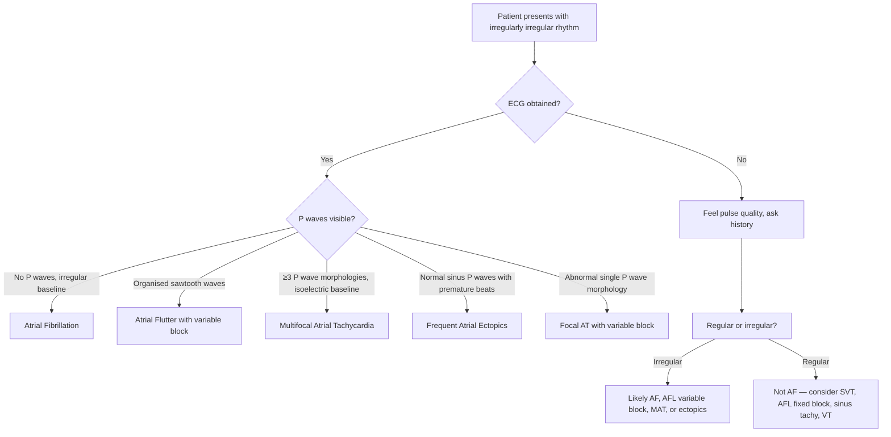

## Differential Diagnosis of Atrial Fibrillation

The differential diagnosis of AF is essentially the question: **"What else can produce an irregularly irregular pulse or mimic AF on examination/ECG?"** This is a clinical reality you will face on call — a patient has an "irregular" rhythm, and you need to confirm it is truly AF before committing to anticoagulation and rate control. Equally important is the differential of the **presenting symptom** (palpitations, dyspnoea, embolic event) that led you to discover AF.

We will approach this systematically:
1. DDx of the **irregularly irregular pulse/rhythm** (i.e., what else looks like AF?)
2. DDx of **palpitations** (the most common presenting complaint)
3. DDx of **embolic complications** of AF (stroke, acute limb ischaemia, mesenteric ischaemia)

---

### A. Differential Diagnosis of the Irregularly Irregular Rhythm

This is the most exam-relevant DDx. When you feel or see an irregularly irregular rhythm, your mind should run through this list:

***D/dx for irregularly irregular pulse*** [1]:
- ***Atrial flutter (AFL) or atrial tachycardia (AT) with variable AV block*** [1]
- ***Frequent multifocal ectopic beats*** [1]
- ***Multifocal atrial tachycardia (MAT)*** [1]

Let's expand on each and explain **why** they mimic AF:

#### 1. Atrial Flutter with Variable Block

***Atrial flutter (AFL): rapid regular atrial activity at 180–350 bpm*** [1]. Typical AFL has an atrial rate of ~300 bpm. With **fixed** 2:1 AV block, the ventricular rate is a regular 150 bpm — this is regular, so it doesn't mimic AF. However:

- When the AV block ratio **varies** (e.g., alternating between 2:1, 3:1, 4:1), the ventricular response becomes **irregular** → mimics AF on pulse palpation
- **How to distinguish from AF**: Look at the ECG carefully for ***sawtooth flutter (F) waves*** [1], best seen in leads **II, III, aVF and V1**. In AFL, the baseline between QRS complexes shows organised, repetitive flutter waves at ~300 bpm. In AF, the baseline is chaotic or fine fibrillatory waves without a repeating pattern
- ***Vagal manoeuvres or adenosine injection can reveal the underlying atrial rhythm*** [1] — they transiently increase AV block, "unmasking" flutter waves that may be hidden within QRS complexes

> Why does this matter clinically? Because AFL with variable block is sometimes mistaken for AF. The management overlaps significantly (both need anticoagulation based on CHA₂DS₂-VASc), but AFL is more amenable to **catheter ablation of the cavotricuspid isthmus (CTI)** [1], which has a very high success rate (~95%).

#### 2. Atrial Tachycardia with Variable AV Block

***Focal atrial tachycardia (AT): regular atrial rhythm at > 100 bpm originating from one focus*** [1]. Normally AT is regular, but with variable AV conduction (especially at higher atrial rates), the ventricular response can become irregular.

- **How to distinguish from AF**: On ECG, AT shows **identifiable P waves of abnormal morphology** (different from sinus P waves) [1]. The atrial rate is typically 110–250 bpm — slower than AF's 350–600 bpm. ***The isoelectric baseline is preserved between P waves*** (unlike the chaotic baseline in AF)
- ***Causes: no underlying disease, atrial enlargement, digitalis toxicity*** [1]

#### 3. Multifocal Atrial Tachycardia (MAT)

***Multifocal atrial tachycardia (MAT)*** [1]:
- ***Mechanism: abnormal automaticity in multiple foci, triggered activity*** [1]
- ***ECG: irregularly irregular rate with average atrial rate > 100 bpm; ≥3 P wave morphologies in the same lead*** [1]
- ***Key distinguishing feature: flat isoelectric line preserved (cf AF)*** [1]

MAT is the most commonly confused DDx with AF because it is also **irregularly irregular**. However:

| Feature | AF | MAT |
|---|---|---|
| P waves | Absent (chaotic fibrillatory baseline) | Present — ≥3 different P wave morphologies |
| Baseline | Irregular/fibrillatory | ***Flat isoelectric line preserved*** [1] |
| Typical atrial rate | 350–600 bpm | > 100 bpm (much slower) |
| Typical associations | Structural heart disease, HTN, thyrotoxicosis | ***Pulmonary disease (~60%), CHF, hypoK, hypoMg*** [1] |
| Treatment approach | Rate control + anticoagulation | ***Treat underlying condition*** [1] (antiarrhythmics often ineffective) |

> **Clinical pearl**: If you see an "irregularly irregular" rhythm in an elderly patient with severe COPD, always consider MAT before labelling it AF. MAT in COPD is very common and the management is entirely different — focus on treating the lung disease and correcting electrolytes rather than rate control drugs.

#### 4. Frequent Atrial Ectopics (Atrial Premature Beats / APBs)

Frequent atrial ectopics interspersed with sinus beats create an irregular rhythm that can feel irregularly irregular on palpation, especially if the ectopics are frequent and from multiple foci.

- **How to distinguish from AF**: On ECG, you will see an **underlying sinus rhythm** with identifiable sinus P waves, punctuated by premature beats with abnormal P wave morphology followed by a compensatory pause
- The key is that between ectopics, the rhythm returns to normal sinus

#### 5. Frequent Ventricular Ectopics (VPBs)

Similar to atrial ectopics but with **wide QRS complexes** not preceded by P waves. Frequent VPBs in a bigeminal or trigeminal pattern can produce an irregular pulse. Distinguished easily on ECG by the wide, bizarre QRS morphology.

#### 6. Sinus Arrhythmia

A physiological variation in heart rate with respiration — heart rate increases with inspiration and decreases with expiration. This creates a mildly irregular rhythm but:
- P waves are present and normal
- The variation follows a regular cyclical pattern linked to breathing
- Most common in young, healthy individuals
- Easily distinguished from AF on ECG

#### 7. Second-Degree AV Block (Mobitz Type I / Wenckebach)

Progressive PR prolongation with eventual dropped beats creates an irregular rhythm. Distinguished by:
- Identifiable P waves with progressively lengthening PR intervals
- Regular atrial rate (P-P intervals constant)
- Grouped beating pattern

---

### B. Differential Diagnosis of Palpitations (the Presenting Complaint)

When a patient presents with palpitations (the most common symptom of AF), you must consider the full spectrum of causes [2]:

Key discriminating features from the history [2]:

| Feature | Suggests |
|---|---|
| ***At rest*** [2] | ***Ectopics and AF*** [2] |
| ***During exercise*** [2] | ***PSVT, AF and VT*** [2] |
| ***Skipped or 'heavy' beats*** [2] | ***Ectopic beats (often triggered by stress, alcohol, nicotine, worse at rest)*** [2] |
| ***Irregular palpitations*** [2] | ***AF, AFL/AT with variable block and MAT*** [2] |
| ***Regular, relatively fast pounding (90–120 bpm)*** [2] | ***Hyperdynamic circulation (anaemia, pregnancy, thyrotoxicosis, AR, PDA)*** [2] |
| ***Discrete bouts, very rapid (> 120 bpm)*** [2] | ***Paroxysmal nodal re-entrant tachycardia*** [2] |
| ***Terminated by vagal manoeuvres (sneeze, cough, defecation)*** [2] | ***Nodal re-entrant tachycardia*** [2] |
| ***Sudden onset and offset*** [2] | Re-entrant circuit (AVRT, AVNRT, some AT) [2] |
| ***Gradual onset*** [2] | Increased automaticity (sinus tachycardia, some AT) [2] |

<Callout title="Exam Approach: Irregular vs Regular Palpitations" type="idea">
The single most useful question to ask: **"Is the palpitation regular or irregular?"** If irregular → think AF, AFL with variable block, MAT, or frequent ectopics. If regular → think AVNRT, AVRT, AFL with fixed block, sinus tachycardia, or VT. Then ask about onset (sudden vs gradual), duration, and termination (vagal manoeuvres) to narrow further.
</Callout>

---

### C. Differential Diagnosis of Embolic Complications of AF

AF may present not with palpitations but with the consequences of thromboembolism. You must consider other causes of these presentations:

#### 1. DDx of Cardioembolic Stroke (presenting as acute neurological deficit)

When a patient with AF presents with sudden focal neurological deficit, it is likely cardioembolic stroke. However, other stroke subtypes and stroke mimics must be considered [7]:

| Diagnosis | Key Distinguishing Features |
|---|---|
| **Cardioembolic stroke** (from AF) | ***Sudden onset, maximal at onset, large focal or multifocal deficit, known AF/VHD/HF*** [7]. Irregular pulse, heart murmur |
| **Thrombotic stroke** (large vessel atherosclerosis) | ***Stuttering progression, atherosclerotic RFs (HTN, DM, HL), ± Hx of TIA in same territory*** [7] |
| **Lacunar stroke** (small vessel disease) | Pure motor/sensory deficit, HTN as dominant RF, subcortical location |
| **Haemorrhagic stroke (ICH)** | ***Gradual progression, a/w progressive headache, triggered by physical activity, features of ↑ICP*** [7]. CT shows hyperdensity |
| **SAH** | Thunderclap headache, meningism, ↓consciousness |
| **Stroke mimics** | ***Transient events: seizures (Todd's paralysis), migraine aura, syncope. Persistent events: brain tumours, SDH, cerebral abscess, encephalitis, MS, metabolic encephalopathy (e.g., hypoglycaemia)*** [7] |

***Clues to distinguish stroke from mimics*** [7]:
- ***Nature: stroke/TIA invariably produces negative symptoms (loss of function) rather than positive symptoms (e.g., tingling, visual scintillation = more likely migraine aura)*** [7]
- ***Extent: usually focal instead of global*** [7]
- ***Progression: rarely changes in modality*** [7]

***Neuroimaging (CT/MRI) is essential for all stroke patients*** [7] — you **cannot** reliably distinguish ischaemic from haemorrhagic stroke clinically.

#### 2. DDx of Acute Limb Ischaemia (presenting as acute painful cold limb)

AF is the most common cardiac cause of embolic acute limb ischaemia [9][10]. The DDx includes:

| Diagnosis | Key Features | How to Distinguish from Embolism |
|---|---|---|
| **Arterial embolism** (from AF) | ***Cardiac source identifiable (e.g., AF), hyperacute onset (seconds–minutes), contralateral limb pulses present, absent bruits, complete ischaemia (no collaterals)*** [9] | Classic vignette: older patient with known AF, sudden onset 6Ps, no prior claudication |
| **Arterial thrombosis-in-situ** | ***Previous claudication, PVD in contralateral limb, present bruits, incomplete ischaemia (collaterals), onset over hours–days*** [9] | History of peripheral vascular disease, gradual onset, bilateral signs of atherosclerosis |
| **Acute compartment syndrome** | Pain (especially with passive stretch), tense swollen compartment, paraesthesia | Trauma or reperfusion history, compartment pressure measurement |
| **DVT (phlegmasia cerulea dolens)** [9] | Massive iliofemoral DVT with venous outflow obstruction → swollen, cyanotic, painful limb | Swelling is prominent (unlike arterial ischaemia where limb may be shrunken), cyanosis rather than pallor |
| **Aortic dissection** | May occlude branch arteries → limb ischaemia | Tearing chest/back pain, BP differential between arms, widened mediastinum on CXR |

#### 3. DDx of Acute Mesenteric Ischaemia (presenting as acute abdomen)

***AF may predispose to arterial embolism to mesenteric arteries*** [11][12]. The DDx of acute abdominal pain out of proportion to physical findings includes:

| Diagnosis | Key Features |
|---|---|
| **Mesenteric embolism** (from AF) | ***Acute embolus: severe sudden periumbilical pain in old patient with AF*** [11]. Pain out of proportion to exam findings |
| **Mesenteric thrombosis** | ***Strong cardiovascular risk factors (HTN/HL/DM) and PVD*** [11] |
| **Non-occlusive mesenteric ischaemia (NOMI)** | Critically ill patient with low cardiac output, on vasopressors/digoxin [11][12] |
| **Perforated viscus** | Sudden onset, peritonism, rigid abdomen, free air on AXR |
| **Acute pancreatitis** | Epigastric pain radiating to back, ↑amylase/lipase |
| **Bowel obstruction** | Colicky pain, vomiting, constipation, distended abdomen |

---

### D. Summary: A Systematic Approach to DDx

<Callout title="The ECG Is King" type="error">
Never diagnose AF on clinical examination alone. An irregularly irregular pulse can be caused by AFL with variable block, MAT, or frequent ectopics. **Always confirm with a 12-lead ECG** — look specifically for: (1) absence of P waves, (2) irregular (fibrillatory) baseline, and (3) irregularly irregular narrow QRS complexes. If P waves are present in any form, it is NOT AF.
</Callout>

---

### E. DDx Table — At a Glance

| Differential | Pulse | ECG Features | Key Distinguishing Point |
|---|---|---|---|
| **Atrial Fibrillation** | Irregularly irregular, variable volume | No P waves, fibrillatory baseline, irregular narrow QRS | Chaotic baseline, no identifiable P waves |
| **Atrial Flutter (variable block)** | Irregularly irregular | Sawtooth F waves (~300 bpm), variable R-R | Organised flutter waves seen in II, III, aVF, V1; adenosine unmasks |
| **MAT** | Irregularly irregular | ≥3 P wave morphologies, preserved isoelectric baseline | P waves present, flat baseline; a/w COPD |
| **Focal AT (variable block)** | Irregularly irregular | Single abnormal P morphology, rate 110–250 bpm | Slower atrial rate, consistent P wave shape |
| **Frequent APBs** | Irregular | Underlying sinus rhythm with premature P waves | Sinus P waves visible between ectopics |
| **Frequent VPBs** | Irregular | Wide bizarre QRS, no preceding P wave | Wide QRS morphology, compensatory pauses |
| **Sinus arrhythmia** | Mildly irregular | Normal P waves, rate varies with respiration | Cyclical variation, young/healthy patient |
| **2° AV block (Wenckebach)** | Irregular | Progressive PR prolongation, dropped QRS | Grouped beating pattern, regular P-P |

---

<Callout title="High Yield Summary">

1. **The three main DDx for an irregularly irregular rhythm** (frequently tested): AF, AFL with variable block, MAT, and frequent ectopics.
2. **AF vs MAT**: Both irregularly irregular, but MAT has ≥3 P wave morphologies with preserved isoelectric baseline. MAT is strongly associated with COPD. Treatment of MAT = treat the underlying condition, NOT standard AF management.
3. **AF vs AFL with variable block**: AFL shows organised sawtooth flutter waves (~300 bpm atrial rate). Adenosine/vagal manoeuvres can unmask flutter waves. AFL is highly amenable to CTI ablation.
4. **Always get an ECG** — clinical examination alone cannot reliably distinguish AF from its mimics.
5. **When AF presents as stroke**: distinguish cardioembolic (sudden, maximal at onset, AF present) from thrombotic (stuttering, atherosclerotic RFs) and haemorrhagic (gradual, headache, ↑ICP). Neuroimaging is mandatory.
6. **When AF presents as acute limb ischaemia**: embolism (from AF) is hyperacute, no prior claudication, contralateral pulses present vs thrombosis-in-situ (gradual, prior PVD, bruits).
7. For palpitations, ask: regular vs irregular, onset (sudden vs gradual), termination (vagal manoeuvres suggest re-entrant SVT), precipitants, and rate.

</Callout>

---

<ActiveRecallQuiz
  title="Active Recall - Differential Diagnosis of Atrial Fibrillation"
  items={[
    {
      question: "Name the three main differential diagnoses for an irregularly irregular pulse other than AF, and state one key ECG feature that distinguishes each from AF.",
      markscheme: "(1) Atrial flutter with variable block — organised sawtooth flutter waves at ~300 bpm. (2) Multifocal atrial tachycardia — >=3 P wave morphologies with preserved flat isoelectric baseline. (3) Frequent atrial ectopics — underlying sinus P waves visible between premature beats. (Accept frequent VPBs or sinus arrhythmia as alternatives with appropriate distinguishing features.)"
    },
    {
      question: "How does MAT differ from AF on ECG, and what is the most common underlying condition associated with MAT?",
      markscheme: "MAT: P waves present with >=3 different morphologies in same lead, flat isoelectric baseline preserved, atrial rate >100 bpm. AF: no P waves, chaotic fibrillatory baseline. Most common association: pulmonary disease (~60%), especially COPD."
    },
    {
      question: "A patient with known AF presents with sudden-onset left-sided hemiparesis and aphasia, maximal at onset. What is the most likely stroke subtype and what clinical features support this?",
      markscheme: "Cardioembolic stroke. Supporting features: sudden onset maximal at onset (not stuttering), known AF (embolic source), large vessel territory deficit (MCA), may have irregular pulse and heart murmur. Must confirm with CT brain to exclude haemorrhage before treatment."
    },
    {
      question: "An elderly patient with AF presents with a hyperacute cold painful leg. List four features that distinguish arterial embolism from thrombosis-in-situ as the cause.",
      markscheme: "Embolism: (1) identifiable embolic source (AF), (2) hyperacute onset in seconds-minutes, (3) no prior claudication history, (4) contralateral limb pulses present, (5) absent bruits, (6) complete ischaemia (no collaterals). (Any 4 for full marks.)"
    },
    {
      question: "What bedside manoeuvre can help unmask atrial flutter waves hidden within QRS complexes, and why does it work?",
      markscheme: "Vagal manoeuvres (e.g., carotid sinus massage, Valsalva) or IV adenosine. They transiently increase AV block, slowing ventricular rate and revealing the underlying atrial flutter waves (sawtooth pattern) that were previously obscured by the QRS complexes."
    }
  ]}
/>

## References

[1] Lecture slides / Senior notes: Ryan Ho Cardiology.pdf (pages 92–94 — AF, AFL, AT, MAT differential, ECG features)
[2] Senior notes: Ryan Ho Fundamentals.pdf (page 206 — Palpitations differential diagnosis)
[7] Senior notes: Ryan Ho Neurology.pdf (pages 76–79 — Stroke evaluation, DDx of stroke)
[9] Senior notes: Maksim SURGERY notes.pdf (page 168 — Acute limb ischaemia, embolism vs thrombosis distinction)
[10] Senior notes: MBBS Final MB (Surgery) (Felix PY Lai).pdf (page 920 — Acute arterial ischaemia aetiology)
[11] Senior notes: Maksim SURGERY notes.pdf (page 92 — Ischaemic bowel disease, mesenteric ischaemia DDx)
[12] Senior notes: MBBS Final MB (Surgery) (Felix PY Lai).pdf (page 718 — Mesenteric ischaemia aetiology)
