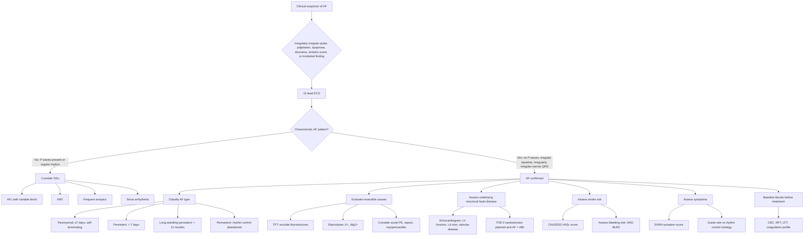
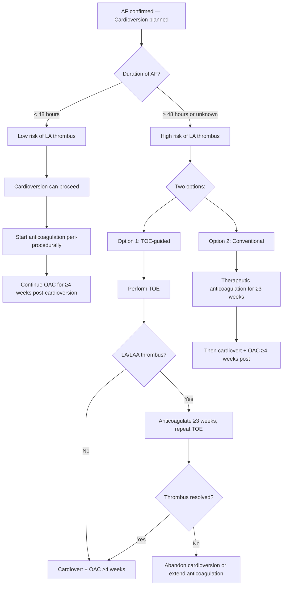

## Diagnostic Criteria, Diagnostic Algorithm and Investigations for Atrial Fibrillation

### A. Diagnostic Criteria for Atrial Fibrillation

AF is fundamentally an **ECG diagnosis**. There are no "clinical diagnostic criteria" in the way that, say, rheumatic fever has Jones criteria or heart failure has Framingham criteria. The diagnosis rests on demonstrating the characteristic ECG pattern, ideally on a **12-lead ECG** or, if paroxysmal, on a rhythm recording of sufficient quality and duration.

#### ESC 2020 / ACC/AHA 2023 Diagnostic Criteria

The diagnosis of AF requires **documentation** of the arrhythmia on an ECG recording showing the following features:

***ECG features of AF*** [1]:

| Criterion | Explanation |
|---|---|
| ***1. No distinct P waves*** [1] | Chaotic atrial depolarisation means no organised P wave preceding QRS complexes. ***The baseline may show irregular fibrillatory (f) waves*** [1]. ***These f waves tend to be coarse (> 2 mm) when AF is of recent onset and tend to be fine (< 1 mm) in long-standing AF. These can be easily missed or confused with movement artefacts*** [1] |
| ***2. Irregularly irregular QRS complexes*** [1][2] | AV node conducts chaotic atrial impulses unpredictably → R-R intervals are irregularly irregular. ***Note that the irregular baseline may not always be present → look for irregular QRS complexes*** [2] |
| ***3. Narrow QRS morphology (unless coexisting BBB/pre-excitation)*** [1] | Ventricular conduction via the His-Purkinje system is preserved → QRS is normally shaped. ***Typically 120–160 bpm but may ↓ in chronic cases*** [1] |

**Duration requirement (ESC 2020):**
- A **minimum of 30 seconds** of continuous AF on a single-lead or multi-lead ECG recording is conventionally required to make the diagnosis
- Shorter episodes detected on wearable devices (smartwatches, implantable loop recorders) are termed **"subclinical AF"** or **"atrial high-rate episodes (AHRE)"** — their management (particularly regarding anticoagulation) is still evolving based on trials like NOAH-AFNET 6 and ARTESiA (2023)

<Callout title="Exam Tip: Duration Matters">
For a formal AF diagnosis, you need ≥30 seconds of continuous irregularly irregular rhythm without P waves on any ECG recording. A few seconds of irregular rhythm on a telemetry strip is suggestive but not diagnostic. For device-detected episodes < 30 seconds, the term "subclinical AF" is used, and the threshold for anticoagulation is higher (generally ≥24 hours of cumulative AF burden before considering OAC, per ARTESiA 2023).
</Callout>

#### What the ECG Cannot Tell You

The ECG confirms the **rhythm** but does not tell you:
- The **cause** of AF → requires further workup
- The **stroke risk** → requires CHA₂DS₂-VASc scoring
- The **presence of LA thrombus** → requires echocardiography (particularly TOE)
- Whether AF is **paroxysmal, persistent, or permanent** → requires clinical history and serial monitoring

---

### B. Diagnostic Algorithm

The diagnostic algorithm for AF addresses two separate but related questions:
1. **Confirming the diagnosis** (is this truly AF?)
2. **Evaluating the underlying cause and complications** (why does this patient have AF, and what is the stroke risk?)

#### Special Scenario: Paroxysmal AF Not Captured on 12-lead ECG

If AF is suspected (e.g., transient palpitations, cryptogenic stroke) but the 12-lead ECG shows sinus rhythm, further monitoring is needed:

***± Ambulatory ECG for paroxysmal AF*** [1]:

| Monitoring Modality | Duration | When to Use |
|---|---|---|
| **24-hour Holter monitor** | 24–48 hours | Frequent symptoms (daily or near-daily) |
| **Event recorder / patch monitor** | 7–14 days | Symptoms occurring weekly |
| **Implantable loop recorder (ILR)** | Up to 3 years | Cryptogenic stroke with high suspicion of paroxysmal AF; infrequent symptoms |
| **Smartwatch / wearable PPG** | Continuous | Screening tool; any detection must be confirmed by ECG |
| ***Exercise testing*** [1] | During test | If AF is exercise-induced, or to assess rate control adequacy during exertion |

<Callout title="Cryptogenic Stroke and Occult AF" type="idea">
In patients with ischaemic stroke of undetermined aetiology ("cryptogenic stroke"), prolonged cardiac monitoring with an implantable loop recorder (ILR) detects AF in ~30% of cases over 3 years (CRYSTAL-AF trial). This is why current guidelines recommend extended cardiac monitoring (≥ 30 days) in all patients with cryptogenic stroke. Finding AF changes management from antiplatelet to anticoagulation.
</Callout>

---

### C. Investigation Modalities — Detailed Breakdown

#### 1. The 12-Lead Electrocardiogram (ECG)

**Purpose**: Confirm the diagnosis of AF and identify coexisting abnormalities.

This is the **single most important investigation**. Let's go through what to look for systematically:

***ECG features of AF*** [1][2]:

| Finding | Interpretation | Why It Matters |
|---|---|---|
| ***No distinct P waves ± irregular baseline (fibrillation waves)*** [1][2] | Chaotic atrial depolarisation. ***May have flutter-like waves for 2–3 seconds*** [2] — brief organised segments can occur in AF without making it flutter | Confirms diagnosis |
| ***Narrow but irregular QRS complexes*** [1] | AV node conducts variably → irregularly irregular ventricular response | If QRS is wide → consider AF with BBB, AF with pre-excitation (WPW), or VT [2] |
| **Ventricular rate** | ***Typically 120–160 bpm but may ↓ in chronic cases*** [1] | Controlled (< 110 bpm at rest for lenient; < 80 bpm for strict) vs uncontrolled. Slow ventricular rate without rate-control drugs → suspect AV node disease or drug toxicity |
| ***ST depression*** [1] | May suggest: ***underlying LVH (LV strain pattern)*** [1], ***ischaemia***, or ***digoxin effect (upsloping ST depression)*** [1] | Guides further evaluation for CAD or drug effects |
| **LVH voltage criteria** | Tall R in V5/V6, deep S in V1/V2, ± strain pattern | Suggests hypertensive heart disease or HCMP as substrate |
| **P mitrale (if transient sinus rhythm)** | Bifid P wave in lead II > 120 ms | Suggests LA enlargement (from MS, MR, HTN) |
| **Right heart strain** | Right axis deviation, P pulmonale, RBBB, RV strain in V1–V3 | Suggests PE or cor pulmonale as trigger |

***If QRS complex frequency is very irregular during a wide complex tachycardia → likely AF + BBB*** [2]. This is important because a wide, irregularly irregular tachycardia has a specific differential:
- **AF with pre-existing BBB** (most common) — compare with baseline ECG
- **AF with WPW (pre-excited AF)** — extremely important to recognise because AV nodal blockers (digoxin, verapamil, diltiazem) are **contraindicated** → they can enhance conduction down the accessory pathway → VF → death
- **Polymorphic VT** — if truly no pattern to QRS morphology and patient is haemodynamically unstable

<Callout title="Pre-excited AF: A Deadly Trap" type="error">
If you see AF with a very fast rate (> 200 bpm) and wide QRS complexes with varying morphology (short and long pre-excitation), suspect **AF with WPW**. Do NOT give AV nodal blockers (adenosine, verapamil, diltiazem, digoxin). These block the AV node but leave the accessory pathway unblocked → all impulses conduct via the accessory pathway → VF. Use **procainamide, ibutilide, or DC cardioversion** instead.
</Callout>

#### 2. Blood Tests

***Blood tests for reversible causes (TFT, K, Mg)*** [1]:

| Test | Rationale | Key Findings |
|---|---|---|
| ***Thyroid function tests (TFT)*** [1] | Hyperthyroidism is a reversible cause of AF. Must be excluded in **every** new-onset AF | ↑fT4, ↓TSH → thyrotoxicosis. Subclinical hyperthyroidism (N fT4, ↓TSH) also ↑AF risk |
| ***Serum potassium (K⁺)*** [1] | Hypokalaemia increases myocardial excitability and predisposes to arrhythmias | Low K⁺ (< 3.5 mmol/L) → correct before attempting cardioversion |
| ***Serum magnesium (Mg²⁺)*** [1] | Hypomagnesaemia often coexists with hypokalaemia (diuretic use) and promotes arrhythmias | Low Mg²⁺ (< 0.7 mmol/L) → supplement; refractory hypokalaemia may be due to concurrent hypoMg |
| **Complete blood count (CBC)** | Anaemia → hyperdynamic circulation → can trigger/worsen AF. Infection (↑WCC) → sepsis-induced AF | Anaemia (↓Hb), leucocytosis (infection) |
| **Renal function (RFT: U, Cr, eGFR)** | Baseline before anticoagulation (NOAC dose adjustment for renal impairment). Electrolyte assessment | ↓eGFR → dose reduce dabigatran, rivaroxaban, edoxaban. CKD ↑both thrombotic and bleeding risk |
| **Liver function (LFT)** | Baseline before anticoagulation. Hepatic dysfunction ↑bleeding risk, affects drug metabolism | ↑bilirubin, ↑INR → caution with anticoagulation |
| **Coagulation profile (PT/INR, aPTT)** | Baseline before initiating warfarin or NOAC | Elevated baseline INR → suspect liver disease or coagulopathy |
| **Fasting glucose / HbA1c** | DM is a component of CHA₂DS₂-VASc score and a risk factor for AF | Guides risk stratification and overall CV risk management |
| **Lipid profile** | Cardiovascular risk factor assessment (HTN, DM, HL all contribute to structural heart disease) | Guides statin therapy |
| **BNP / NT-proBNP** | Heart failure assessment. Elevated in AF even without HF (due to atrial stretch), but very high levels suggest coexisting HF | Guides HF management. Useful for prognostication |
| **Cardiac enzymes (troponin)** | If clinical suspicion of ACS as precipitant of AF | Elevated troponin → ACS or demand ischaemia from rapid AF. Note: minor troponin elevation can occur from tachycardia alone (type 2 MI) |

#### 3. Echocardiography

***Echocardiogram for underlying structural heart disease*** [1]:

| Modality | What It Shows | When to Use |
|---|---|---|
| **Transthoracic echocardiography (TTE)** | LV systolic function (EF), LV wall thickness (LVH), LA size, valvular disease (MS, MR, AS, AR), RV function, pericardial effusion, pulmonary artery pressure estimation | ***All patients with new-onset AF*** [1]. Guides management decisions (rate vs rhythm, anticoagulation, valve intervention) |
| ***Transoesophageal echocardiography (TOE/TEE)*** [1] | ***LA mural thrombus best assessed by TOE*** [1]. Also visualises the left atrial appendage (LAA), mitral valve in detail, and interatrial septum (PFO/ASD) | Before cardioversion if AF duration > 48 hours or unknown (to exclude LA/LAA thrombus). Also for surgical/procedural planning (LAA occlusion, mitral valve intervention) |

**Key echocardiographic findings and their significance**:

| Finding | Significance |
|---|---|
| **LA dilatation** (> 40 mm or > 20 cm²) | Substrate for AF maintenance. Larger LA → lower success of cardioversion/ablation. Marker of chronicity |
| **↓ LVEF** (< 50%) | Coexisting HF. Determines drug choices (avoid CCB if ↓EF). Consider tachycardia-mediated cardiomyopathy if EF improves with rate control |
| **LVH** | HTN heart disease, HCMP, AS → substrate for AF + loss of atrial kick is poorly tolerated |
| **Mitral stenosis** | Rheumatic MS → classifies as "valvular AF" → warfarin required (NOACs contraindicated) |
| **LA/LAA thrombus** (on TOE) | Absolute contraindication to cardioversion until thrombus resolved (usually 3–4 weeks of therapeutic anticoagulation then repeat TOE) |
| **Spontaneous echo contrast ("smoke")** in LA | Indicates stasis and high thrombotic risk. Often seen with large LA and low LA appendage velocities |
| **RV dilatation / ↑PASP** | Pulmonary hypertension → cor pulmonale, PE, or chronically elevated LAP from left heart disease |

> **Why is TOE needed before cardioversion?** When AF has been present for > 48 hours (or unknown duration), thrombus may have formed in the LAA. If you cardiovert (electrically or pharmacologically), the atrium suddenly contracts again — this can dislodge a pre-formed thrombus → stroke. TOE can visualise the LAA directly (TTE cannot reliably see the LAA). If no thrombus → safe to cardiovert. If thrombus present → anticoagulate for ≥3 weeks, repeat TOE, then cardiovert if resolved.

#### 4. Chest X-Ray (CXR)

Not diagnostic for AF itself but essential to evaluate:

| Finding | Interpretation |
|---|---|
| **Cardiomegaly** | Suggests underlying structural heart disease (DCMP, valvular disease, chronic HTN) |
| **LA enlargement** | Double density behind cardiac silhouette, splaying of carina, posterior displacement on lateral CXR |
| **Pulmonary congestion / upper lobe venous diversion** | Suggests heart failure (either causing or resulting from AF) |
| **Pleural effusion** | May indicate HF |
| **Lung pathology** | Pneumonia (sepsis-induced AF), COPD (chronic lung disease as cause), widened mediastinum (aortic dissection) |

#### 5. Ambulatory ECG Monitoring

***± Exercise testing, ambulatory ECG for paroxysmal AF*** [1]:

| Modality | Mechanism | Indication |
|---|---|---|
| **24–48h Holter monitor** | Continuous 3-lead ECG recording onto a portable device | Suspected paroxysmal AF with frequent symptoms; assess rate control |
| **7–14 day event recorder / patch** | Extended continuous recording triggered automatically or by patient when symptomatic | Less frequent symptoms; higher yield than Holter for paroxysmal AF |
| **Implantable loop recorder (ILR)** | Subcutaneous device implanted under local anaesthesia, continuously monitors for up to 3 years | Cryptogenic stroke (to detect occult AF), very infrequent but clinically important symptoms |
| **Mobile cardiac telemetry** | Real-time wireless ECG transmission | High-risk patients requiring immediate notification (e.g., post-ablation monitoring) |
| **Consumer wearables (smartwatch PPG)** | Photoplethysmography detects pulse irregularity; algorithm flags AF | Screening tool only. Any detection must be confirmed by a diagnostic-quality ECG recording |

#### 6. Additional / Adjunct Investigations

| Investigation | Indication | Key Findings |
|---|---|---|
| ***Exercise testing*** [1] | Assess rate control during exertion; unmask ischaemia; evaluate exercise-induced AF | Inadequate rate control (HR > 110 at submaximal exertion) guides drug titration. ST changes suggest CAD |
| **CT/MR angiography of the LA and PVs** | Pre-procedural planning for catheter ablation (PVI) | Maps PV anatomy (number, size, branching), LA dimensions, excludes PV stenosis |
| **Cardiac MRI** | Evaluate myocardial substrate (fibrosis, cardiomyopathy, infiltrative disease) | Late gadolinium enhancement quantifies LA fibrosis → predicts ablation success (Utah staging) |
| **Electrophysiology study (EPS)** | Rarely needed for diagnosis of AF itself | May be performed as part of catheter ablation procedure. Used if arrhythmia mechanism unclear (e.g., distinguishing AF from AFL) |
| **Sleep study (polysomnography)** | Suspected obstructive sleep apnoea (OSA) | OSA is a modifiable risk factor for AF. Treatment of OSA ↓AF recurrence after cardioversion/ablation |

---

### D. Approach to the ECG Interpretation — Worked Example

Let's walk through interpreting a 12-lead ECG in a patient with suspected AF, step by step:

| Step | What to Assess | In AF |
|---|---|---|
| **1. Rate** | Count R-R intervals or use 300/large squares method | Variable. Average rate estimated by counting QRS complexes in 10 seconds × 6 |
| **2. Rhythm** | Regular, regularly irregular, or irregularly irregular | **Irregularly irregular** — this is the hallmark. R-R intervals vary with no repeating pattern |
| **3. P waves** | Present? Shape? Relationship to QRS? | ***No distinct P waves. Irregular baseline with fibrillatory (f) waves*** [1][2]. No consistent P-QRS relationship |
| **4. PR interval** | Consistent? Prolonged? | Cannot be measured (no P waves) |
| **5. QRS** | Narrow or wide? Morphology? | ***Normally shaped but at irregular frequency*** [2]. If wide → consider BBB, WPW, or VT |
| **6. ST segment / T waves** | Ischaemia? LVH strain? Drug effect? | ***Note any ST depression → underlying LVH, ischaemia, or digoxin effect*** [1] |
| **7. QT interval** | Prolonged? | Difficult to assess in AF (variable R-R). Use QTc of the shortest R-R interval as a conservative estimate |

<Callout title="Practical Tip: How to Count Heart Rate in AF">
Because the rate is irregular, the standard "300 ÷ number of large squares" method does not work for a single beat. Instead: count the number of QRS complexes in a **6-second strip** (30 large squares) and multiply by 10. This gives the average ventricular rate. Alternatively, many modern ECG machines automatically calculate the average rate.
</Callout>

---

### E. Pre-Cardioversion Workup Algorithm

This is a specific diagnostic pathway relevant when cardioversion is being considered:

> **Why 48 hours?** This is the traditional threshold because studies show that thrombus is unlikely to form in < 48 hours of AF. Beyond 48 hours (or if duration is unknown), the risk of thrombus in the LAA rises significantly, and either a TOE to exclude thrombus or a 3-week period of therapeutic anticoagulation is required before cardioversion is safe.

> **Why continue anticoagulation for ≥4 weeks after cardioversion?** Even after successful cardioversion, atrial mechanical function ("atrial stunning") takes 2–4 weeks to recover. During this period, the atria are contracting weakly despite being in sinus rhythm → stasis persists → thrombus risk persists. Anticoagulation bridges this vulnerable period.

---

### F. Risk Stratification Tools (Diagnostic Scoring)

While not "diagnostic criteria" for AF itself, these scoring systems are integral to the diagnostic workup and guide management. They will be discussed in detail in the Management section, but are introduced here as part of the evaluation:

#### CHA₂DS₂-VASc Score — Stroke Risk

| Component | Points | Explanation |
|---|---|---|
| **C** — Congestive HF (or LVEF ≤40%) | 1 | ↓CO → stasis |
| **H** — Hypertension | 1 | Endothelial dysfunction, LVH |
| **A₂** — Age ≥75 | 2 | Strongest independent risk factor |
| **D** — Diabetes mellitus | 1 | Prothrombotic state |
| **S₂** — Stroke/TIA/thromboembolism (prior) | 2 | Strongest predictor of future stroke |
| **V** — Vascular disease (prior MI, PAD, aortic plaque) | 1 | Marker of systemic atherosclerosis |
| **A** — Age 65–74 | 1 | Intermediate risk |
| **Sc** — Sex category (female) | 1 | Female sex ↑stroke risk in AF |

***Anticoagulation based on CHA₂DS₂-VASc score*** [1]:
- **Score 0 (males) or 1 (females, where the 1 point is solely from female sex)**: No anticoagulation needed
- **Score 1 (males) or 2 (females)**: Consider anticoagulation (shared decision-making)
- **Score ≥2 (males) or ≥3 (females)**: Anticoagulation recommended

#### HAS-BLED Score — Bleeding Risk

| Component | Points |
|---|---|
| **H** — Hypertension (uncontrolled, sBP > 160) | 1 |
| **A** — Abnormal renal/liver function (1 point each) | 1 or 2 |
| **S** — Stroke (prior) | 1 |
| **B** — Bleeding history or predisposition | 1 |
| **L** — Labile INR (if on warfarin, TTR < 60%) | 1 |
| **E** — Elderly (age > 65) | 1 |
| **D** — Drugs (antiplatelet, NSAIDs) or alcohol (1 each) | 1 or 2 |

- Score ≥3 = "high bleeding risk" → does **NOT** contraindicate anticoagulation but flags the need to **address modifiable bleeding risk factors** (control BP, stop unnecessary NSAIDs, improve INR control or switch to NOAC, treat alcohol excess)

<Callout title="HAS-BLED Does Not Mean 'Don't Anticoagulate'" type="error">
A common misconception is that a high HAS-BLED score contraindicates anticoagulation. This is wrong. The score is meant to identify and **modify** correctable bleeding risks. In almost all cases, the stroke risk (from not anticoagulating) outweighs the bleeding risk. The only absolute contraindications to anticoagulation are active major bleeding or severe thrombocytopenia.
</Callout>

---

### G. Summary of the Complete Diagnostic Workup

| Investigation Category | Specific Tests | Purpose |
|---|---|---|
| **Confirm rhythm** | ***12-lead ECG*** [1] | Diagnosis of AF |
| **Document paroxysmal AF** | ***Holter, event recorder, ILR*** [1] | Capture intermittent episodes |
| **Exclude reversible causes** | ***TFT, K⁺, Mg²⁺*** [1] | Thyrotoxicosis, electrolyte imbalance |
| **Assess structural heart disease** | ***Echocardiogram (TTE)*** [1] | LV function, LA size, valvular disease |
| **Exclude LA thrombus** | ***TOE*** [1] | Before cardioversion if AF > 48h |
| **Baseline bloods** | CBC, RFT, LFT, coagulation, glucose, lipids | Pre-anticoagulation assessment |
| **Risk stratification** | CHA₂DS₂-VASc, HAS-BLED | Guide anticoagulation decision |
| **CXR** | Cardiomegaly, pulmonary congestion, lung pathology | Underlying cause and complications |
| **Assess rate control** | ***Exercise testing*** [1] | Adequacy of rate control during exertion |
| **Pre-ablation planning** | CT/MRI LA/PV anatomy, cardiac MRI for LA fibrosis | Procedural planning |

---

<Callout title="High Yield Summary">

1. **AF is an ECG diagnosis** — requires ≥30 seconds of: no P waves + irregular baseline (fibrillatory waves) + irregularly irregular narrow QRS complexes.
2. **Fibrillatory (f) waves** are coarse in recent-onset AF and fine in long-standing AF; they may be absent in fine AF — **diagnose by irregular R-R intervals**.
3. **Every new-onset AF needs**: 12-lead ECG, TFT, K⁺, Mg²⁺, echocardiogram, CBC, RFT, LFT, coagulation profile, CXR.
4. **TOE** is the gold standard for detecting LA/LAA thrombus — indicated before cardioversion if AF > 48 hours or unknown duration.
5. **Paroxysmal AF not caught on 12-lead ECG** → Holter (frequent symptoms), event recorder (weekly), ILR (cryptogenic stroke or rare symptoms).
6. **Wide complex irregularly irregular tachycardia** = AF + BBB or pre-excited AF (WPW) — compare with baseline ECG; never give AV nodal blockers if WPW suspected.
7. **CHA₂DS₂-VASc** stratifies stroke risk; **HAS-BLED** identifies modifiable bleeding risk factors (does NOT contraindicate anticoagulation).
8. **Pre-cardioversion rule**: if AF > 48h → either 3 weeks therapeutic anticoagulation OR TOE to exclude thrombus before cardioverting. Continue OAC ≥4 weeks post-cardioversion regardless.
9. **Cryptogenic stroke** → prolonged monitoring (≥30 days, ideally ILR) to detect occult AF; detection rate ~30% over 3 years.

</Callout>

---

<ActiveRecallQuiz
  title="Active Recall - AF Diagnosis and Investigations"
  items={[
    {
      question: "What are the three essential ECG criteria for diagnosing AF?",
      markscheme: "(1) Absence of distinct P waves with irregular baseline (fibrillatory waves), (2) Irregularly irregular QRS complexes, (3) Narrow QRS morphology (unless coexisting BBB or pre-excitation). Minimum 30 seconds duration required for formal diagnosis."
    },
    {
      question: "A patient has new-onset AF. List the four essential blood tests you must order to exclude reversible causes, and explain why each is needed.",
      markscheme: "(1) TFT — exclude thyrotoxicosis (reversible cause). (2) Potassium — hypokalaemia promotes arrhythmias. (3) Magnesium — hypomagnesaemia promotes arrhythmias and causes refractory hypokalaemia. (4) Also accept CBC (anaemia causes hyperdynamic state) or cardiac enzymes (ACS as precipitant)."
    },
    {
      question: "When is a TOE indicated in AF management, and what specific finding are you looking for?",
      markscheme: "TOE is indicated before cardioversion when AF duration is >48 hours or unknown. Looking for LA or LAA thrombus. If thrombus is present, cardioversion is deferred and patient is anticoagulated for >=3 weeks before repeating TOE. TTE cannot reliably visualise the LAA."
    },
    {
      question: "You see a wide complex, irregularly irregular tachycardia at 220 bpm. What is the most dangerous diagnosis to consider, and what drugs must you avoid?",
      markscheme: "Pre-excited AF (AF with WPW syndrome). Must avoid AV nodal blockers: adenosine, verapamil, diltiazem, digoxin. These block the AV node but leave the accessory pathway unblocked, allowing all atrial impulses to conduct via the accessory pathway at very high rates, potentially degenerating into VF. Treat with procainamide, ibutilide, or DC cardioversion."
    },
    {
      question: "Why must anticoagulation be continued for at least 4 weeks after successful cardioversion to sinus rhythm?",
      markscheme: "After cardioversion, atrial mechanical function takes 2-4 weeks to recover ('atrial stunning'). During this period, despite being in sinus rhythm electrically, the atria contract weakly, allowing continued stasis and thrombus formation risk. Anticoagulation bridges this vulnerable period until full atrial mechanical recovery."
    },
    {
      question: "What monitoring modality has the highest yield for detecting occult AF in cryptogenic stroke, and what is the approximate detection rate?",
      markscheme: "Implantable loop recorder (ILR). Detection rate approximately 30% over 3 years (CRYSTAL-AF trial). Recommended for cryptogenic stroke when standard 24-48h Holter is negative. Detection of AF changes management from antiplatelet to anticoagulation."
    }
  ]}
/>

## References

[1] Lecture slides / Senior notes: Ryan Ho Cardiology.pdf (pages 92–94 — AF ECG features, evaluation, approach to new-onset AF)
[2] Senior notes: Ryan Ho Fundamentals.pdf (pages 24, 206, 448, 467–468 — ECG interpretation of AF, pulse assessment, palpitations workup, fibrillation ECG features)
[14] Senior notes: Ryan Ho Critical Care.pdf (pages 39–40 — Tachyarrhythmia management algorithm, cardioversion indications and energy levels)
[15] Senior notes: Ryan Ho Respiratory.pdf (pages 21, 135 — Dyspnoea workup, PE investigations including ECG and echocardiography)
