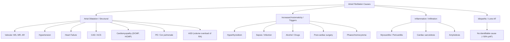
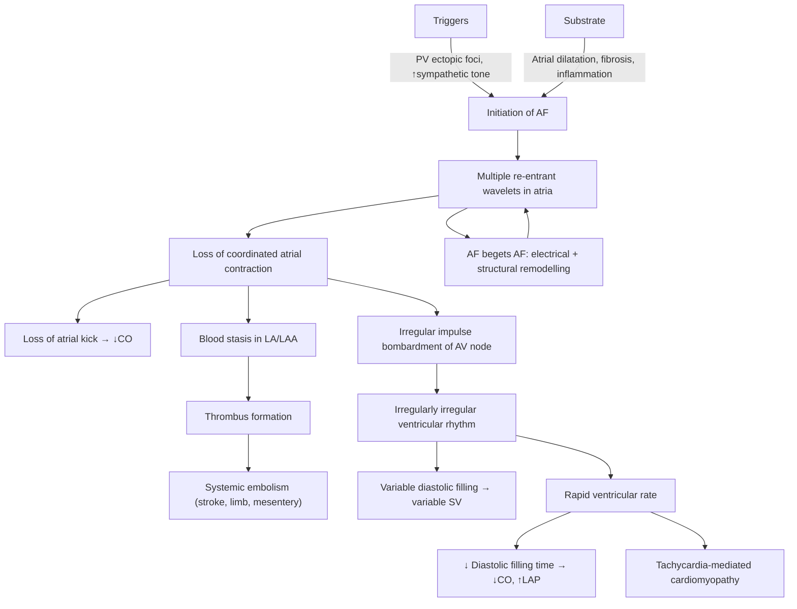

# Atrial Fibrillation (AF)

## 1. Definition

***Atrial fibrillation (AF) is the most common sustained cardiac arrhythmia*** [1]. It is characterised by:

- **Chaotic, disorganised electrical activity of the atrial myocardium**, with atrial muscle fibres contracting independently without synchronous depolarisation [1][2]
- ***Atrial rate so fast (350–600 bpm) that distinct P waves are not discernible*** [1]
- ***Variable conduction at the AV node → irregularly irregular ventricular rhythm*** [1]

Let's break down the name:
- "Atrial" = pertaining to the atria (upper heart chambers)
- "Fibrillation" = from Latin *fibrilla* (small fibre) → chaotic, quivering contraction of individual muscle fibres rather than coordinated contraction

The key conceptual point: the atria are not contracting as a unit. Hundreds of tiny re-entrant wavelets are firing simultaneously, so the atria effectively "quiver" rather than pump. The AV node acts as a gatekeeper, conducting some (but not all) of these chaotic impulses to the ventricles in an unpredictable fashion — hence the hallmark **irregularly irregular** ventricular rhythm.

---

## 2. Epidemiology

***Very common in the elderly: ~1% in those aged 60–64 years, ~9% in those aged > 80 years*** [1].

### Global and Hong Kong Context
- **Prevalence**: AF affects approximately 33 million people worldwide [3]. In Hong Kong, the prevalence mirrors that of other developed East Asian populations — estimated at ~1.3–1.8% of the general adult population, rising sharply with age [3].
- **Incidence**: increasing due to population ageing, rising burden of hypertension, obesity, and heart failure, and improved detection (wearable devices, screening programmes).
- **Sex**: overall slightly more common in males (M:F ≈ 1.5:1), but women with AF have higher stroke risk and mortality.
- **Ethnic considerations**: AF is somewhat less prevalent in East Asian populations compared to Caucasians at equivalent ages; however, the absolute burden in Hong Kong is enormous given the ageing demographics.
- **Hospital burden**: AF is a major driver of medical admissions, particularly for acute heart failure decompensation and stroke.

<Callout title="Why is AF prevalence increasing?">
Three reasons: (1) the population is ageing, (2) comorbidities that predispose to AF (HTN, obesity, HF, DM) are increasing, and (3) we are detecting more AF with widespread ECG screening and wearable devices. This makes AF one of the emerging cardiovascular epidemics of the 21st century.
</Callout>

---

## 3. Risk Factors

Understanding risk factors requires understanding what predisposes atrial tissue to develop and sustain chaotic re-entrant circuits. The two fundamental requirements are:

1. **A trigger** (usually a rapidly firing ectopic focus, most commonly from the **pulmonary veins**)
2. **A substrate** (structurally or electrically abnormal atrial tissue that allows multiple re-entrant wavelets to propagate)

### 3.1 Conditions Causing Atrial Dilatation / Structural Remodelling

These enlarge or scar the atria, creating the substrate for multiple re-entrant circuits:

| Risk Factor | Why It Causes AF |
|---|---|
| ***Valvular heart disease*** (esp. mitral stenosis) [1][4] | LA pressure overload → LA dilatation. MS is the classic cause; ***AF occurs in ~45% of MS patients*** [4] |
| ***Hypertension*** [1] | LV hypertrophy → diastolic dysfunction → ↑LAP → LA dilatation |
| ***Heart failure (HF)*** [1] | ↑LAP from volume/pressure overload → LA dilatation; also neurohormonal activation promotes fibrosis |
| ***Coronary artery disease (CAD)*** [1] | Ischaemia → atrial fibrosis + acute haemodynamic stress during ACS |
| ***Pulmonary embolism (PE)*** [1] | Acute RV pressure overload → RA dilatation + haemodynamic stress |
| ***Cardiomyopathy*** [1] | Dilated CMP → chamber dilatation; HCMP → diastolic dysfunction → ↑LAP |

### 3.2 Conditions Causing Increased Sympathetic / Autonomic Tone

These act as **triggers** — they increase automaticity of ectopic foci:

| Risk Factor | Mechanism |
|---|---|
| ***Hyperthyroidism*** [1][5] | Thyroid hormones ↑β-adrenergic sensitivity, ↑automaticity, ↑resting heart rate → trigger + maintenance. **Must always check TFT in new-onset AF** |
| ***Sepsis / acute infection*** [1] | Systemic inflammation + ↑sympathetic drive + catecholamine surge |
| Post-operative state (esp. cardiac surgery) [1] | Pericardial inflammation + sympathetic surge + electrolyte shifts |
| ***Alcoholism*** [1] | Direct toxic effect on atrial myocytes + autonomic dysfunction. "Holiday heart syndrome" = binge drinking → paroxysmal AF |

### 3.3 Chronic Lung Disease

***Chronic lung disease*** [1] — COPD, pulmonary fibrosis, etc. → chronic hypoxia → pulmonary hypertension → RV/RA dilatation → atrial remodelling. Also, theophylline use in COPD ↑arrhythmia risk.

### 3.4 Other Risk Factors

- **Obesity**: direct mechanical effect (↑pericardial fat → LA infiltration/fibrosis), plus associated HTN, OSA, metabolic syndrome
- **Obstructive sleep apnoea (OSA)**: intermittent hypoxia → sympathetic surges + intrathoracic pressure swings → atrial stretch
- **Diabetes mellitus**: autonomic neuropathy + atrial fibrosis
- **Age**: progressive atrial fibrosis is the single most important substrate
- **Excessive endurance exercise**: marathon runners have ↑AF risk, likely from repeated atrial stretch and vagal remodelling

### 3.5 Lone AF

***Lone AF: NO structural heart disease identified*** [1]. Occurs in ***~50% of paroxysmal AF and ~20% of persistent/permanent AF*** [1]. This is a diagnosis of exclusion after thorough workup. It is less commonly used in modern practice as subtle substrates (e.g., fibrosis on cardiac MRI, OSA) are increasingly identified.

<Callout title="Exam Tip: Reversible Causes to Always Exclude" type="idea">
***In any new-onset AF, always check: TFT (thyrotoxicosis), electrolytes (K⁺, Mg²⁺), and consider acute PE, myopericarditis, pneumonia, and post-cardiac surgery*** [1]. These are **reversible causes** that may be the sole driver of AF.
</Callout>

---

## 4. Anatomy and Physiology Relevant to AF

### 4.1 Normal Atrial Anatomy

- **Right atrium (RA)**: receives systemic venous return (SVC, IVC, coronary sinus). Contains the **SA node** (junction of SVC and RA) and **AV node** (in the triangle of Koch at the interatrial septum).
- **Left atrium (LA)**: receives oxygenated blood from the 4 **pulmonary veins** (2 from each lung). The LA is a thin-walled, low-pressure chamber. Sleeves of atrial myocardium extend into the pulmonary veins — these are the critical trigger sites for AF.
- **Interatrial septum**: contains the fossa ovalis (remnant of foramen ovale).

### 4.2 Normal Conduction System

1. **SA node** → generates impulse (60–100 bpm)
2. Impulse spreads across **atrial myocardium** (Bachmann's bundle for interatrial conduction)
3. **AV node** → deliberate conduction delay (allows atrial contraction to fill ventricles before ventricular contraction)
4. **Bundle of His** → bundle branches → Purkinje fibres → ventricular myocardium

The AV node is the *only* electrical connection between atria and ventricles. Its refractory period acts as a **physiological filter**, preventing all atrial impulses from reaching the ventricles. This is why, even with atrial rates of 350–600 bpm in AF, the ventricular rate is typically only **120–160 bpm** (the AV node blocks most impulses).

### 4.3 Pulmonary Vein Anatomy

The pulmonary veins (PVs) are the most important anatomical structure in AF pathophysiology:
- Sleeves of **atrial myocardium** extend 1–3 cm into the PVs
- These sleeves have shorter refractory periods, more disorganised fibre orientation, and higher automaticity
- They are the **dominant trigger site** for paroxysmal AF (>90% of ectopic foci arise from PV sleeves)
- This is the basis for **pulmonary vein isolation (PVI)** — the cornerstone of catheter ablation for AF

### 4.4 The "Atrial Kick"

In normal sinus rhythm, atrial contraction contributes ~15–25% of ventricular filling (the "atrial kick"). In patients with stiff ventricles (e.g., LVH from hypertension, HCMP, aortic stenosis), this contribution can be up to **40%** of cardiac output. Loss of the atrial kick in AF therefore causes:
- A disproportionate ↓ in cardiac output in patients with diastolic dysfunction
- This explains why AF onset can precipitate acute heart failure decompensation, especially in **mitral stenosis** [4] and **HCMP** [6]

---

## 5. Aetiology (with Hong Kong Focus)

The causes of AF can be organised by the mechanism through which they promote the arrhythmia:

### 5.1 Causes Classified by Mechanism

### 5.2 Hong Kong–Specific Considerations

| Factor | Relevance to HK |
|---|---|
| **Hypertension** | The leading modifiable risk factor. Prevalence ~27% in HK adults and rising. HTN drives the majority of AF burden locally |
| **Rheumatic heart disease** | Still encountered (particularly in older patients and immigrants from mainland China), though declining. MS remains an important cause of AF in HK elderly |
| **Hyperthyroidism** | Graves' disease is common in HK (M:F = 1:4.8, peak 20–50 years) [5]. Always exclude thyrotoxicosis in new-onset AF |
| **Ischaemic heart disease** | Major contributor given high prevalence of metabolic risk factors |
| **Alcohol consumption** | "Holiday heart" — binge drinking culture in some demographics |
| **Ageing population** | HK has one of the longest life expectancies globally; the AF burden is projected to increase dramatically |
| **Obesity / OSA** | Rising prevalence in HK; increasingly recognised as modifiable risk factors for AF |

---

## 6. Pathophysiology

This is central to understanding everything about AF — from clinical features to treatment.

### 6.1 The Trigger-Substrate Model

AF requires two things:

#### A. The Trigger
- ***Most commonly, a single rapidly firing focus in the sleeves of atrial muscle extending into the pulmonary veins*** [1]
- ***May also be triggered by ↑sympathetic tone (e.g., hyperthyroidism, sepsis, post-operative state)*** [1]
- These foci have enhanced automaticity and/or triggered activity due to:
  - Shorter action potential duration
  - Disorganised myofibre arrangement
  - Calcium handling abnormalities

#### B. The Substrate (Maintenance)
- ***Once triggered, the arrhythmia is sustained by multiple re-entrant circuits*** [1]
- ***Atrial dilatation*** allows a minimum number of re-entrant wavelets to coexist simultaneously — this is the "critical mass" hypothesis [1]
  - A larger atrium can support more simultaneous wavelets → more likely to sustain AF
  - This is why ***conditions causing atrial dilatation predispose to AF*** [1]
- Fibrosis of atrial myocardium creates areas of slow conduction and conduction block — ideal for re-entry

#### C. "AF Begets AF" — Electrical and Structural Remodelling
***AF begets AF: structural/electrical remodelling occurs once AF is initiated → further predisposes to continual AF*** [1]

This is a critically important concept:

1. **Electrical remodelling** (occurs within hours to days):
   - Sustained rapid atrial rates → intracellular Ca²⁺ overload → shortening of atrial refractory period
   - Shorter refractory period → shorter wavelength of re-entrant circuits → more circuits can fit in the same atrial area → easier to sustain AF
   
2. **Structural remodelling** (occurs over weeks to months):
   - Chronic AF → atrial fibrosis, myocyte hypertrophy, gap junction remodelling
   - Creates heterogeneous conduction → promotes re-entry
   - This is why the longer AF persists, the harder it is to restore and maintain sinus rhythm

<Callout title="AF Begets AF — Clinical Implication">
This concept explains why early rhythm control is increasingly favoured: the longer you leave AF untreated, the more remodelling occurs, and the less likely cardioversion (electrical or pharmacological) is to succeed. The 2020 EAST-AFNET 4 trial showed that early rhythm control in patients diagnosed within 1 year of AF onset reduced cardiovascular outcomes compared to rate control alone.
</Callout>

### 6.2 Haemodynamic Consequences of AF

| Consequence | Mechanism |
|---|---|
| **↓ Cardiac output** | Loss of atrial kick (15–25% of ventricular filling). Worse if ↓LV compliance (e.g., HCMP, AS, HTN-LVH) |
| **Rapid ventricular rate** | Uncontrolled rate → ↓ diastolic filling time → ↓ stroke volume → ↓ CO |
| **Tachycardia-mediated cardiomyopathy** | Sustained rapid rates (usually > 100 bpm for weeks–months) → progressive LV dilatation and systolic dysfunction. **Reversible** with rate/rhythm control [6] |
| **Hypotension / shock** | In acute AF with very fast rates, especially with underlying structural heart disease |

### 6.3 Thromboembolic Risk — Why AF Causes Stroke

This is arguably the most important clinical consequence of AF.

**Mechanism** (Virchow's triad applied to AF):

1. **Stasis**: Loss of coordinated atrial contraction → blood pools in the LA, especially in the **left atrial appendage (LAA)** — a blind-ended pouch that is the primary site of thrombus formation (~90% of LA thrombi in non-valvular AF)
2. **Endothelial dysfunction**: AF causes endothelial damage/activation in the atria
3. **Hypercoagulability**: AF is associated with a prothrombotic state (↑fibrinogen, ↑vWF, ↑D-dimer, platelet activation)

The resulting thrombi can embolise to:
- **Brain** → ischaemic stroke or TIA (most feared complication) [7][8]
- **Systemic arteries** → acute limb ischaemia [9][10], mesenteric ischaemia [11][12], renal infarction, splenic infarction

> **Key fact**: AF is responsible for ~20–30% of all ischaemic strokes. AF-related strokes are typically more severe (larger infarct territory due to large emboli from the LAA) and carry higher mortality and disability than non-AF strokes.

### 6.4 Why the Left Atrial Appendage (LAA)?

The LAA is a finger-like, trabeculated pouch arising from the LA. In AF:
- It is the most common site of thrombus formation (~90%)
- Its complex trabeculated anatomy + loss of contractile function = perfect environment for stasis
- This is why **LAA occlusion devices** (e.g., Watchman) are an alternative to anticoagulation in selected patients

---

## 7. Classification

***AF classification generally progresses from paroxysmal to persistent states*** [1]:

| Classification | Definition | Key Features |
|---|---|---|
| ***Paroxysmal AF (pAF)*** | ***≥2 episodes, terminates spontaneously or with intervention ≤7 days of onset*** [1] | Most common initial pattern. ***Natural history: often recurrent; ~36% progress to persistent AF over 10 years*** [1]. More likely to respond to rhythm control |
| ***Persistent AF*** | ***Fails to terminate within 7 days*** [1] | May be restored to SR with cardioversion but does not self-terminate |
| ***Long-standing persistent AF*** | ***Persistent AF lasting > 12 months*** [1] | Rhythm control still considered but success rates lower |
| ***Permanent AF*** | ***Persistent AF in which a rhythm control strategy is no longer pursued*** [1] | A joint decision by patient and physician to accept AF and focus on rate control + anticoagulation |

Additional classifications:
- **First detected AF**: first episode ever diagnosed (may be any of the above)
- **Valvular vs Non-valvular AF**: 
  - "Valvular AF" traditionally refers to AF in the context of **moderate-to-severe mitral stenosis** or **mechanical heart valves** — these patients require warfarin (NOACs are contraindicated)
  - All other AF is "non-valvular" — eligible for NOACs
  - Note: ESC 2020 guidelines replaced this terminology with **EHRA classification** to reduce confusion

<Callout title="Exam Tip: Valvular vs Non-Valvular AF" type="error">
A common exam mistake is to classify any AF with valve disease as "valvular AF." The term specifically refers to **moderate-severe mitral stenosis** or **mechanical heart valves** — the only two situations where warfarin is mandated and NOACs are contraindicated. AF with aortic stenosis, mitral regurgitation, or bioprosthetic valves is still considered "non-valvular" and can be treated with NOACs.
</Callout>

---

## 8. Clinical Features

### 8.1 Symptoms

| Symptom | Pathophysiological Basis |
|---|---|
| ***Irregular palpitation*** [1] | The patient feels the irregularly irregular, variable-strength ventricular contractions. The variable diastolic filling time means some beats are strong (long diastole → full ventricle) and some are weak (short diastole → underfilled ventricle) |
| ***Worsening dyspnoea (SOB)*** [1] | (1) Loss of atrial kick → ↓CO → ↓tissue O₂ delivery. (2) Rapid rate → ↓diastolic filling → ↑LAP → pulmonary congestion. (3) Particularly pronounced in MS where LA systole is critical [4] |
| ***Lightheadedness / dizziness*** [1] | ↓CO from loss of atrial kick + rapid rate → ↓cerebral perfusion |
| ***Fatigue and malaise*** [1] | Chronic ↓CO + sympathetic activation → fatigue. Also, loss of exercise capacity as the heart cannot augment CO appropriately with exercise |
| **Presyncope / syncope** | Severe ↓CO, especially at onset of AF with very rapid rate, or in patients with concurrent structural disease (AS, HCMP) |
| **Chest pain / angina** | Rapid rate → ↑myocardial O₂ demand + ↓diastolic coronary perfusion time → supply-demand mismatch. May unmask underlying CAD |
| **Polyuria** | Atrial stretch (from volume overload) → release of **atrial natriuretic peptide (ANP)** → diuresis. Patients sometimes report increased urination at the onset of AF |
| **Asymptomatic** | Up to **one-third** of AF patients are asymptomatic. AF may be discovered incidentally on pulse check, ECG, or wearable device. These patients still carry thromboembolic risk |

<Callout title="Symptom Severity — EHRA Score">
The **European Heart Rhythm Association (EHRA) symptom score** grades AF symptoms:
- **I** — No symptoms
- **IIa** — Mild symptoms; normal daily activity not affected
- **IIb** — Moderate symptoms; normal daily activity not affected but patient troubled
- **III** — Severe symptoms; normal daily activity affected
- **IV** — Disabling symptoms; normal daily activity discontinued

This score guides decisions about rhythm vs rate control.
</Callout>

### 8.2 Symptoms of Complications

| Symptom | Complication |
|---|---|
| Acute-onset focal neurological deficit (hemiplegia, aphasia, visual field defect) | Cardioembolic **ischaemic stroke** [7][8] |
| Acute limb pain, pallor, pulselessness ("6Ps") | **Acute limb ischaemia** from peripheral embolism [9][10] |
| Acute severe abdominal pain (out of proportion to findings) | **Mesenteric ischaemia** from mesenteric embolism [11][12] |
| Acute decompensated heart failure (orthopnoea, PND, leg swelling) | AF causing or worsening **heart failure** |

### 8.3 Signs on Physical Examination

| Sign | Pathophysiological Basis |
|---|---|
| ***Irregularly irregular pulse with variable volume*** [1] | The hallmark sign. Variable R-R intervals (AV node conducts chaotically) → variable diastolic filling time → variable stroke volume → variable pulse amplitude |
| ***Pulse deficit (radial rate < apex rate)*** [1] | Some ventricular contractions occur after very short diastolic intervals → ventricle barely fills → stroke volume so small that the pressure wave doesn't reach the radial artery → felt at apex (auscultation) but not at wrist. The difference = pulse deficit |
| ***Absent a wave in JVP*** [1] | The "a" wave represents atrial contraction. In AF, there is no coordinated atrial contraction → no "a" wave. (Contrast with atrial flutter, which has flutter "f" waves in the JVP) |
| ***Variably loud S1*** [1] | S1 loudness depends on the position of the mitral valve leaflets at the onset of ventricular systole, which depends on the preceding diastolic interval. Variable R-R intervals → variable S1 intensity |
| Signs of the **underlying cause** | ***Signs of thyrotoxicosis*** [1] (tremor, lid lag, goitre, weight loss). Signs of valvular heart disease (murmurs). Signs of heart failure (↑JVP, basal crepitations, peripheral oedema) |
| ***Check peripheral pulses*** [1] | To assess for **embolic events** — absent pulses in a limb suggest acute arterial embolism |
| **Blood pressure** | May be difficult to measure accurately due to beat-to-beat variability. Take average of several readings |

<Callout title="Why Check for Pulse Deficit?">
Pulse deficit is clinically important because: (1) it indicates that the true heart rate is higher than what you feel at the wrist — you may underestimate tachycardia if you only count the radial pulse; (2) a large pulse deficit suggests many "ineffective" beats with very short diastolic intervals, indicating poor rate control; (3) always count the **apex rate** (auscultation) as the true heart rate in AF.
</Callout>

---

## 9. ECG Features

***ECG features of AF*** [1][2]:

| Feature | Explanation |
|---|---|
| ***No distinct P wave ± irregular baseline (fibrillation waves)*** [1][2] | Chaotic atrial depolarisation → no organised P waves. The baseline may show fine or coarse undulations ("fibrillatory waves" or "f waves"). ***May have flutter-like waves for 2–3 seconds*** [2] |
| ***Narrow but irregular QRS complexes*** [1] | AV node conducts some impulses randomly → irregular R-R intervals. QRS is narrow because ventricular conduction via the His-Purkinje system is normal. ***Typically 120–160 bpm but may ↓ in chronic cases*** [1] (due to AV nodal remodelling / medications) |
| ***Note any ST depression*** [1] | May suggest: (1) ***underlying LVH (LV strain pattern)*** [1], (2) ***ischaemia***, or (3) ***digoxin effect (reverse tick / upsloping ST depression)*** [1] |

***The irregular baseline may not always be present → look for irregular QRS complexes*** [2]. This is an important practical point: in fine AF, the fibrillatory waves may be barely visible, and the diagnosis rests on the **irregularly irregular** rhythm.

**How to distinguish AF from other irregular rhythms**:
- **Atrial flutter with variable block**: look for "sawtooth" flutter waves (especially in leads II, III, aVF, V1) at ~300 bpm
- **Multifocal atrial tachycardia (MAT)**: ≥3 different P wave morphologies, flat isoelectric baseline preserved (unlike AF) [1]
- **Frequent atrial ectopics**: P waves visible before ectopic beats, underlying sinus rhythm present between ectopics

<Callout title="ECG Pearl" type="idea">
***If the QRS complex frequency is very irregular during a wide complex tachycardia → likely AF + bundle branch block (BBB)*** [2]. Do NOT mistake this for polymorphic VT. Compare the QRS morphology with the patient's baseline ECG in sinus rhythm — BBB should be evident in SR as well.
</Callout>

---

## 10. Evaluation

***Evaluation of new-onset AF*** [1]:

| Investigation | Purpose |
|---|---|
| ***Blood tests: TFT, K⁺, Mg²⁺*** [1] | Exclude reversible causes. Thyrotoxicosis is a must-exclude. Hypokalaemia and hypomagnesaemia promote arrhythmias |
| ***Echocardiogram*** [1] | Assess for ***underlying structural heart disease*** [1] — valvular disease, LV function (EF), LA size, LV wall thickness. ***LA mural thrombus is best assessed by transoesophageal echocardiography (TOE/TEE)*** [1] |
| ***± Exercise testing*** [1] | Assess rate control during exertion, unmask ischaemia |
| ***± Ambulatory ECG (Holter / event recorder)*** [1] | ***For paroxysmal AF*** [1] — to document AF episodes, assess rate control, and correlate symptoms with rhythm |
| **CBC, renal function, liver function** | Baseline before anticoagulation (bleeding risk assessment) |
| **Coagulation profile** | Baseline before anticoagulation |
| **CXR** | Cardiomegaly, pulmonary congestion, lung pathology |

---

## 11. Approach to New-Onset AF — Overview

***The approach to new-onset AF*** [1]:

1. ***Reverse reversible causes: hyperthyroidism, acute PE, myopericarditis, pneumonia, post-cardiac surgery*** [1]
2. ***Rate control: usually started before any attempt at rhythm control*** [1]
3. ***Cardioversion: should be performed at least once in most patients with new-onset AF*** [1]
   - ***Timing: immediate if haemodynamically unstable; delayed if stable (69% spontaneously reverts within < 48 hours)*** [1]
4. ***Anticoagulation: based on CHA₂DS₂-VASc score*** [1]

> (Detailed management, including CHA₂DS₂-VASc scoring, rate vs rhythm control strategies, anticoagulation, and ablation, will be covered in the next section on Diagnosis, DDx, and Management.)

---

## 12. Complications of AF — Overview

These will be covered in detail later, but for completeness of the pathophysiology-clinical features link:

| Complication | Mechanism |
|---|---|
| **Ischaemic stroke / TIA** | LA stasis → thrombus (especially LAA) → embolism to cerebral circulation [7][8] |
| **Systemic thromboembolism** | Embolism to limbs [9][10], mesentery [11][12], kidneys, spleen |
| **Heart failure** | ↓CO from loss of atrial kick + rapid rate; tachycardia-mediated cardiomyopathy [6] |
| **Tachycardia-mediated cardiomyopathy** | Sustained rapid ventricular rate → progressive LV dilatation and ↓EF. ***Reversible*** with rate/rhythm control [6] |
| **Sudden cardiac death** | AF with pre-excitation (WPW) → rapid conduction via accessory pathway → VF. Also, AF in structural heart disease ↑VT/VF risk |
| **Cognitive decline / vascular dementia** | Chronic microembolism + chronic ↓CO → progressive cerebral hypoperfusion |
| **Reduced quality of life** | Symptoms of palpitation, fatigue, anxiety, functional limitation |

---

## 13. AF and the Embolic Risk in Context of Other Conditions

AF is frequently mentioned as a cause of embolic events in many organ systems. To consolidate:

| Embolic Target | Clinical Condition | Key Teaching Point |
|---|---|---|
| **Brain** | Cardioembolic ischaemic stroke [7][8] | AF is the most common cardiac cause of embolic stroke. "Old patient with AF → sudden neurological deficit" is the classic vignette |
| **Limb arteries** | Acute limb ischaemia [9][10] | ***Cardiac origin emboli account for ~80% of acute limb embolism; AF is the most common cardiac cause*** [9][10]. Embolus typically lodges at arterial branch points (femoral bifurcation MC) |
| **Mesenteric arteries** | Acute mesenteric ischaemia [11][12] | ***AF may predispose to arterial embolism to mesenteric arteries*** [12]. ***"Acute embolus: severe sudden periumbilical pain in old patient with AF"*** [11] |
| **Coronary arteries** | Coronary embolism (rare) | Can cause acute MI in the absence of atherosclerotic CAD |
| **Renal arteries** | Renal infarction | Flank pain, haematuria, ↑LDH — often missed |

---

## 14. Key Pathophysiology Summary Diagram

---

<Callout title="High Yield Summary">

1. **AF is the most common sustained arrhythmia**, prevalence increases dramatically with age (~1% at 60–64, ~9% at > 80).
2. **Mechanism**: Trigger (PV ectopic foci) + Substrate (atrial dilatation/fibrosis) → multiple re-entrant wavelets. **AF begets AF** through electrical (shortened refractory period) and structural (fibrosis) remodelling.
3. **Causes** to remember: Valvular disease (esp. MS), HTN, HF, CAD, PE, hyperthyroidism, alcohol, chronic lung disease, cardiomyopathy, sepsis, post-cardiac surgery. **Always check TFT, K⁺, Mg²⁺ in new-onset AF.**
4. **Classification**: Paroxysmal (≤7d, self-terminating) → Persistent (> 7d) → Long-standing persistent (> 12mo) → Permanent (rhythm control abandoned).
5. **Valvular AF** = moderate-severe MS or mechanical valve → warfarin only (NOACs contraindicated).
6. **Hallmark features**: Irregularly irregular pulse, variable pulse volume, pulse deficit, absent JVP "a" wave, variably loud S1.
7. **ECG**: No P waves, irregular baseline (fibrillatory waves), irregularly irregular narrow QRS. Fine AF may have no visible fibrillatory waves — diagnose by irregular R-R intervals.
8. **Main complications**: Stroke/TIA, systemic embolism, heart failure, tachycardia-mediated cardiomyopathy.
9. **AF is responsible for ~20–30% of all ischaemic strokes** — hence anticoagulation is the most important therapeutic decision.
10. **Approach**: Exclude reversible causes → Rate control → Consider cardioversion → Anticoagulate based on CHA₂DS₂-VASc.

</Callout>

---

<ActiveRecallQuiz
  title="Active Recall - Atrial Fibrillation (Definition, Epidemiology, Aetiology, Pathophysiology, Clinical Features)"
  items={[
    {
      question: "What is the most common site of ectopic foci that trigger AF, and why is this site arrhythmogenic?",
      markscheme: "Pulmonary vein sleeves (where atrial myocardium extends into PVs). Arrhythmogenic because: shorter refractory periods, disorganised fibre orientation, higher automaticity, calcium handling abnormalities."
    },
    {
      question: "Explain the concept of 'AF begets AF' and its two components.",
      markscheme: "Once AF starts, it promotes its own perpetuation through: (1) Electrical remodelling (hours-days): intracellular Ca2+ overload shortens atrial refractory period, allowing more re-entrant circuits. (2) Structural remodelling (weeks-months): atrial fibrosis, myocyte hypertrophy, gap junction changes create heterogeneous conduction substrate."
    },
    {
      question: "Why does AF cause a pulse deficit, and how do you demonstrate it clinically?",
      markscheme: "Some ventricular contractions occur after very short diastolic intervals, producing stroke volumes too small to generate a palpable radial pulse. Demonstrated by simultaneously counting apex rate (auscultation) and radial rate; the difference is the pulse deficit."
    },
    {
      question: "A 65-year-old presents with new-onset AF. List four reversible causes you must actively exclude.",
      markscheme: "Hyperthyroidism (check TFT), electrolyte imbalance (K+, Mg2+), acute PE, myopericarditis, pneumonia/sepsis, post-cardiac surgery. (Any 4 for full marks)"
    },
    {
      question: "Why is loss of the atrial kick particularly dangerous in mitral stenosis?",
      markscheme: "In MS, there is obstruction to LV inflow across the stenosed mitral valve. LA systole (atrial kick) becomes critical for forcing blood through the narrowed orifice. Loss of atrial kick in AF causes acute drop in CO and rise in LAP, precipitating acute pulmonary oedema and haemodynamic decompensation."
    },
    {
      question: "What is 'valvular AF' and why does it matter for anticoagulation choice?",
      markscheme: "Valvular AF refers specifically to AF with moderate-severe mitral stenosis or mechanical heart valves. These patients must receive warfarin because NOACs are contraindicated (insufficient evidence for efficacy and safety in these populations, and mechanical valves showed increased thromboembolism with dabigatran in the RE-ALIGN trial)."
    }
  ]}
/>

---

## References

[1] Senior notes: Ryan Ho Cardiology.pdf (pages 92–94, Section B: Atrial Flutter and Fibrillation)
[2] Senior notes: Ryan Ho Fundamentals.pdf (pages 206, 468 — Palpitations and ECG interpretation of AF)
[3] Epidemiology data: Global/HK prevalence estimates from current clinical guidelines (ESC 2020, ACC/AHA 2023)
[4] Senior notes: Ryan Ho Cardiology.pdf (page 152 — Mitral Stenosis section, AF in MS)
[5] Senior notes: Ryan Ho Endocrine.pdf (page 23 — Graves' Disease, hyperthyroidism causing AF)
[6] Senior notes: Ryan Ho Cardiology.pdf (page 169 — DCMP section, tachycardia-mediated cardiomyopathy)
[7] Senior notes: Ryan Ho Neurology.pdf (pages 74–75 — Stroke aetiology, AF as embolic source)
[8] Senior notes: MBBS Final MB (Surgery) (Felix PY Lai).pdf (page 1140 — AF as cause of embolic stroke)
[9] Senior notes: Maksim SURGERY notes.pdf (page 168 — Acute limb ischaemia, AF as embolic cause)
[10] Senior notes: MBBS Final MB (Surgery) (Felix PY Lai).pdf (page 920 — AF as cause of arterial embolism)
[11] Senior notes: Maksim SURGERY notes.pdf (page 92 — Ischaemic bowel disease, AF as embolic cause)
[12] Senior notes: MBBS Final MB (Surgery) (Felix PY Lai).pdf (page 718 — Mesenteric ischaemia, AF and embolism)
[13] Senior notes: Ryan Ho Respiratory.pdf (pages 39, 108 — Cor pulmonale, COPD and AF)
