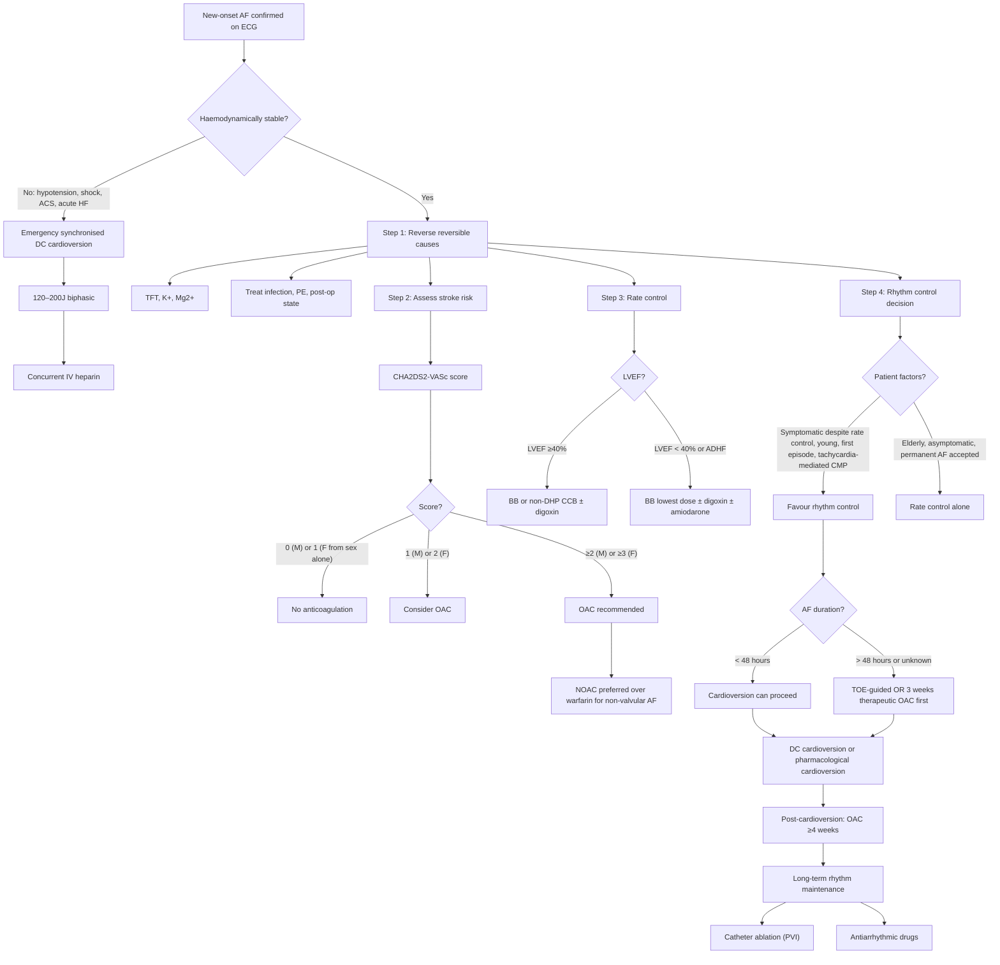
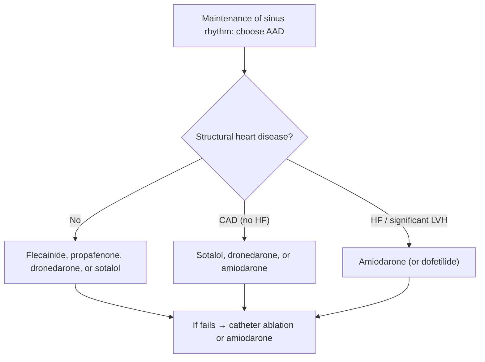

## Management Algorithm and Treatment Modalities for Atrial Fibrillation

The management of AF rests on **four pillars**, and understanding why each exists comes directly from the pathophysiology we have already covered:

| Pillar | Why It Exists |
|---|---|
| **1. Identify and treat reversible causes** | Some AF is entirely driven by a reversible trigger (thyrotoxicosis, PE, sepsis) — fix the trigger and AF may resolve |
| **2. Rate control** | Even if AF persists, controlling the ventricular rate prevents haemodynamic compromise and tachycardia-mediated cardiomyopathy |
| **3. Rhythm control (cardioversion ± maintenance)** | Restoring sinus rhythm restores atrial kick, improves symptoms, and may improve outcomes if done early |
| **4. Anticoagulation (stroke prevention)** | AF causes LA stasis → thrombus → stroke. Anticoagulation is the single most important intervention to prevent the most devastating complication |

> The mnemonic **"ABC"** pathway (ESC 2020) captures this neatly:
> - **A** = **A**nticoagulation / Avoid stroke
> - **B** = **B**etter symptom control (rate and rhythm control)
> - **C** = **C**omorbidity and cardiovascular risk factor management

---

### A. Overall Management Algorithm

---

### B. Pillar 1 — Reverse Reversible Causes

***Reverse reversible causes: hyperthyroidism, acute PE, myopericarditis, pneumonia, post-cardiac surgery*** [1].

This is always Step 1. If the underlying trigger is corrected, AF may terminate spontaneously without need for cardioversion or long-term treatment. However, anticoagulation decisions should still be made based on CHA₂DS₂-VASc during the acute episode.

| Reversible Cause | How to Treat | AF Resolution |
|---|---|---|
| **Thyrotoxicosis** | Antithyroid drugs (carbimazole/PTU) + β-blocker for symptom control | AF often reverts to SR once euthyroid. If not, cardioversion after 4–6 months of euthyroidism |
| **Acute PE** | Anticoagulation ± thrombolysis if massive | AF usually resolves once RV strain resolves |
| **Sepsis / pneumonia** | Antibiotics, source control, supportive care | AF often resolves once infection controlled |
| **Post-cardiac surgery** | Usually self-limiting within 6 weeks. Amiodarone prophylaxis ↓incidence. Rate control if symptomatic | 90% revert to SR by 6–8 weeks |
| **Electrolyte imbalance** | Correct K⁺ (target > 4.0 mmol/L) and Mg²⁺ (target > 0.8 mmol/L) | May revert or facilitate cardioversion |
| **Acute alcohol excess** | Stop alcohol, supportive care | "Holiday heart" often self-terminates |

---

### C. Pillar 2 — Rate Control

**Why rate control?** Even if you cannot restore sinus rhythm, controlling the ventricular rate prevents:
- Haemodynamic compromise (↓diastolic filling time → ↓CO)
- Symptoms (palpitations, dyspnoea, fatigue)
- Tachycardia-mediated cardiomyopathy (sustained rates > 100 bpm → progressive LV dilatation and systolic dysfunction — **reversible** with rate control)

***Rate control: usually started before any attempt at rhythm control*** [1].

#### Rate Control Targets

| Strategy | Target | When to Use |
|---|---|---|
| **Lenient** | Resting HR < 110 bpm | Initial target for most patients (RACE II trial showed non-inferior to strict control) |
| **Strict** | Resting HR < 80 bpm | If symptoms persist despite lenient control, or if ↓LVEF |

#### Acute Rate Control

***Acute rate control approach (ESC 2020)*** [1]:

***LVEF ≥40%: BB or non-dipine CCB ± digoxin (if unsatisfactory)*** [1]

***LVEF < 40% or signs of ADHF: prefer lowest dose of BB ± digoxin ± amiodarone (if haemodynamic instability or severely reduced LVEF)*** [1]

| Drug | Loading/Bolus | Maintenance | Mechanism | Key Points |
|---|---|---|---|---|
| ***Diltiazem (Herbesser)*** [1] | ***0.25 mg/kg over 2 min (15 mg bolus in 60 kg)*** [1] | ***100 mg in 100 mL NS at 5–15 mL/h*** [1]. ***Oral: 120–360 mg daily (ER form)*** [1] | Non-dihydropyridine CCB → blocks L-type Ca²⁺ channels in AV node → slows AV conduction → ↓ventricular rate | **Contraindicated in LVEF < 40%** (negative inotrope) and in pre-excited AF. Avoid with BB (risk of severe bradycardia/hypotension) |
| ***Verapamil*** [1] | ***0.075–0.15 mg/kg over 2 min (± 10 mg after 30 min if no response)*** [1] | ***0.005 mg/kg/min infusion*** [1]. ***Oral: 180–480 mg daily (ER form)*** [1] | Same as diltiazem | Same contraindications as diltiazem. Causes constipation. ***Myocardial depression, hypotension, bradycardia, constipation*** [1] |
| ***Metoprolol (Betaloc)*** [1] | ***2.5–5 mg bolus over 2 min (up to 3 doses)*** [1] | ***Oral: 25–100 mg BD*** [1] | β₁-selective blocker → ↓AV conduction + ↓SA node automaticity | Preferred if coexisting CAD. Can be used cautiously in stable HFrEF (use bisoprolol, carvedilol, or nebivolol for chronic HF). Avoid in acute decompensated HF, severe asthma |
| ***Digoxin*** [1] | ***0.25 mg in 10 mL NS then Q8H × 3 (max up to 1.5 mg in 24 h)*** [1] | ***0.125–0.25 mg daily*** [1] | Cardiac glycoside → ↑vagal tone on AV node → ↓AV conduction. Also mild +ve inotrope | ***Good for LVEF < 40% and HF*** [1]. Does NOT control rate during exercise (vagal withdrawal during exercise overcomes its effect). Narrow therapeutic index → toxicity risk (check levels, watch for hypokalaemia which ↑toxicity). NOT first-line monotherapy |
| ***Amiodarone*** [1] | ***150 mg in 100 mL D5 Q30 min (can load up to 2×)*** [1] | ***600 mg in 500 mL D5 Q24H; or 150 mg in 100 mL D5 at 17 mL/h*** [1]. ***Oral: 100–200 mg daily*** [1] | Class III antiarrhythmic (multiple mechanisms: Na⁺, K⁺, Ca²⁺ channel blockade + β-blocking) → slows AV conduction + some rate control | Reserved for ***LVEF < 40% with haemodynamic instability*** [1] where BB and digoxin fail. Has rhythm control properties too. Long-term use has significant toxicity (thyroid, pulmonary fibrosis, hepatotoxicity, corneal deposits, photosensitivity) |

<Callout title="Why Non-DHP CCBs and Not Amlodipine?">
The term "non-dipine CCB" means **non-dihydropyridine** calcium channel blockers — specifically **diltiazem** and **verapamil**. These preferentially block L-type Ca²⁺ channels in the AV node, slowing conduction. Dihydropyridine CCBs (amlodipine, nifedipine) preferentially act on vascular smooth muscle → vasodilation without significant AV node effects → they do NOT control ventricular rate in AF and should not be used for this purpose.
</Callout>

***Caution: risk of paradoxical ↑ventricular response in pre-excitation syndromes ('pre-excited AF')*** [1]:
- ***AV nodal blockers (CCB, BB, digoxin) → impair conduction via AVN-His bundle system without affecting conduction through the accessory pathway*** [1]
- ***Therefore, anterograde conduction is favoured in the accessory pathway → very rapid (> 300 bpm) atrial impulses transmitted without the 'filtration' of the AVN → dangerous paradoxical ventricular tachycardia leading to haemodynamic collapse*** [1]
- ***Drugs to avoid include adenosine, CCB, BB, digoxin and amiodarone*** [1]
- ***Options: DCCV if unstable, procainamide if stable*** [1]

<Callout title="Pre-excited AF — Critical Safety Point" type="error">
In AF with WPW, the atrial rate is 350–600 bpm. Normally, the AV node filters this to ~120–160 bpm. If you block the AV node, all impulses go down the accessory pathway — which has no built-in rate-limiting refractory period — and the ventricle can be driven at 300+ bpm → VF → death. **Always ask: could this be pre-excited AF?** Clues: very fast rate, wide QRS, varying QRS morphology, known WPW, young patient.
</Callout>

#### Long-Term Rate Control

For chronic rate control, the same drug classes are used orally:

| Setting | First-Line | Add-on | Notes |
|---|---|---|---|
| **LVEF ≥40%** | BB or non-DHP CCB (monotherapy) | Add digoxin if inadequate | Do NOT combine BB + non-DHP CCB (risk of profound bradycardia and AV block) |
| **LVEF < 40%** | BB (bisoprolol, carvedilol, nebivolol — these have HF mortality benefit) | Add digoxin | Non-DHP CCBs are contraindicated (negative inotrope worsens HF) |
| **Sedentary / elderly** | Digoxin may be acceptable as monotherapy | — | Controls rate at rest but not during exercise |

---

### D. Pillar 3 — Rhythm Control (Cardioversion + Maintenance)

**Why rhythm control?** Restoring sinus rhythm offers:
- Better haemodynamics (restored atrial kick → ↑CO)
- Symptom relief (especially in younger, symptomatic patients)
- Potential long-term outcome benefit if initiated early (EAST-AFNET 4 trial, 2020)
- Reversal of tachycardia-mediated cardiomyopathy

***Cardioversion: should be performed at least once in most patients with new-onset AF*** [1].

#### D1. Who Should Get Rhythm Control?

| Favour Rhythm Control | Favour Rate Control Alone |
|---|---|
| Symptomatic despite adequate rate control | Asymptomatic or minimal symptoms |
| Young patient | Elderly (> 75–80) |
| First episode or recent-onset AF | Long-standing persistent or permanent AF |
| Tachycardia-mediated cardiomyopathy | Significant LA dilatation (↓success of SR maintenance) |
| AF secondary to reversible cause (once treated) | Multiple prior failed cardioversions |
| Heart failure where atrial kick is critical (e.g., HCMP, diastolic dysfunction) | Patient preference for rate control |

#### D2. DC Cardioversion (DCCV)

***Cardioversion: synchronized shock with QRS complex → avoid R-on-T phenomenon (torsades then VF)*** [14]

***Mechanism: delivery of a current over a very short interval → depolarize the entire heart → abolish all prevailing abnormal rhythm → hope that the SAN will take the lead again as pacemaker*** [14]

| Aspect | Details |
|---|---|
| **Indications** | ***Unstable tachyarrhythmia with a pulse: fast AF, fast AFL, pSVT, VT with pulse*** [14]. Also for elective rhythm control in stable persistent AF |
| **Energy** | ***For AF (irregular narrow complex): 120–200J biphasic and increase stepwise*** [14]. Start at 120–150J biphasic for first attempt |
| **Sedation** | ***Requires consent with sedation (midazolam) + analgesics (morphine) as it is quite painful*** [14] |
| **Absolute C/I** | ***Sinus tachycardia (only absolute C/I)*** [14] — cardioversion would be treating a physiological response, not an arrhythmia |
| **Pre-cardioversion anticoagulation** | If AF > 48h or unknown duration → TOE to exclude thrombus OR ≥3 weeks therapeutic anticoagulation |
| **Post-cardioversion** | Continue OAC for ≥4 weeks (atrial stunning). Long-term anticoagulation decision still based on CHA₂DS₂-VASc (even if in SR) |
| **Success rate** | ~90% for DC cardioversion. Recurrence is common (50% at 1 year without maintenance antiarrhythmic) |

***Timing: immediate if unstable, delayed if stable (69% spontaneously reverts < 48h)*** [1]. This means for haemodynamically stable patients with recent-onset AF (< 48h), a "wait-and-see" approach for 24–48 hours is reasonable — many will spontaneously revert.

#### D3. Pharmacological Cardioversion

Used when DCCV is not immediately available or as an alternative in selected patients. Less effective than DCCV but can be attempted.

| Drug | Class | Indication | How It Works | Key Points |
|---|---|---|---|---|
| **Flecainide** | IC | AF < 48h, **no structural heart disease** | Potent Na⁺ channel blocker → slows conduction velocity → terminates re-entrant circuits | "Pill-in-the-pocket" approach: patient takes single loading dose (200–300 mg PO) at onset of pAF. ***C/I in structural heart disease (↑mortality in post-MI patients — CAST trial)*** |
| **Propafenone** | IC | AF < 48h, **no structural heart disease** | Similar to flecainide + weak β-blocking activity | Same contraindications as flecainide. Also "pill-in-the-pocket" option |
| **Amiodarone** | III | AF with structural heart disease, HF | Broad-spectrum: Na⁺, K⁺, Ca²⁺ channel + β-blocking | Slower onset (hours). Safe in structural heart disease. Used when flecainide/propafenone C/I |
| **Vernakalant** | III (atrial-selective) | Recent-onset AF (≤7 days), non-HF | Atrial-selective K⁺ and Na⁺ channel blocker | IV administration. Not available everywhere. Rapid onset (~10 min). C/I in severe HF, hypotension, severe AS |
| **Ibutilide** | III | AF or AFL | Prolongs atrial action potential duration → terminates re-entry | Risk of torsades de pointes (must monitor QTc for 4–6 hours post-infusion) |

<Callout title="Pill-in-the-Pocket: A Smart Strategy for Paroxysmal AF" type="idea">
For patients with infrequent, well-tolerated paroxysmal AF and **no structural heart disease**, flecainide or propafenone can be prescribed as a single oral loading dose to take at home at symptom onset. The patient takes the dose when AF starts, lies down, and most episodes convert within 2–6 hours. This avoids the need for emergency department visits. However, the first attempt should always be supervised in hospital to ensure safety.
</Callout>

#### D4. Maintenance of Sinus Rhythm

After successful cardioversion, AF recurs in ~50% at 1 year without maintenance therapy. Options include:

##### Antiarrhythmic Drugs (AADs)

| Drug | When to Use | Key Side Effects / Contraindications |
|---|---|---|
| **Flecainide / Propafenone** | No structural heart disease (first-line in this setting) | ***C/I in CAD, HF, significant LVH*** (proarrhythmic in diseased myocardium) |
| **Dronedarone** | Mild or no structural heart disease, non-permanent AF | C/I in NYHA III–IV HF (↑mortality — ANDROMEDA trial), permanent AF (↑CV events — PALLAS trial), liver toxicity |
| **Sotalol** | CAD (combines β-blocking + class III effect) | QT prolongation → torsades de pointes risk. Requires QTc monitoring. C/I if QTc > 500 ms, ↓K⁺/Mg²⁺, severe HF |
| ***Amiodarone*** [1] | ***Most effective*** AAD; reserved for structural heart disease, HF, or when other AADs fail | Long-term toxicity: thyroid (hypo/hyper), pulmonary fibrosis, hepatotoxicity, corneal microdeposits, photosensitivity, peripheral neuropathy. Monitor TFT, LFT, CXR, PFTs every 6–12 months. ***Oral: 100–200 mg daily*** [1] |
| **Dofetilide** | HF (safe in this population) | QT prolongation → requires in-hospital initiation with telemetry for 3 days. Renal dose adjustment |

> The choice of AAD is guided primarily by **the presence or absence of structural heart disease**:

##### Catheter Ablation (Pulmonary Vein Isolation — PVI)

***Catheter ablation*** [1]:
- ***Indication: usually reserved for those who are symptomatic despite or intolerant of ≥1 AAD*** [1]. Increasingly used as first-line rhythm control in selected patients (paroxysmal AF, young, structurally normal heart) based on EARLY-AF and STOP-AF First trials
- **Procedure**: ***Creation of circumferential lesions around the pulmonary vein ostia to electrically isolate them from the LA*** [1] — this eliminates the dominant triggers
  - **Radiofrequency ablation (RFA)**: point-by-point thermal lesions. More time-consuming but highly effective
  - **Cryoballoon ablation**: cold destruction of tissue using a balloon catheter positioned at each PV ostium. Faster but less flexible for non-PV targets
- **Efficacy**: ~70–80% freedom from AF at 1 year after single procedure (↑ with repeat procedures). Better outcomes in paroxysmal AF than persistent AF (less atrial remodelling)
- **Complications**: ***Inadvertent AV node ablation → complete heart block requiring pacemaker, cardiac tamponade due to perforation*** [1]. Also: PV stenosis, phrenic nerve injury (especially with cryoballoon on right superior PV), oesophageal injury/fistula (rare but fatal), stroke/TIA

***Surgical ablation*** [1]:
- ***Indication: usually reserved for those with concomitant open cardiac surgery*** [1] (e.g., mitral valve surgery + Maze procedure)
- ***Procedure: creation of linear scars by incision/ablation on atrial wall → ↓formation of re-entrant circuits (maze procedure)*** [1]
- ***Efficacy: usually high rate of success*** [1]

<Callout title="When to Go Straight to Ablation?">
Current ESC 2024 and ACC/AHA 2023 guidelines now support catheter ablation as **first-line rhythm control** (before AADs) in selected patients with paroxysmal AF who are symptomatic, particularly if young, with structurally normal hearts, or with HFrEF (where AF ablation has been shown to improve mortality — CASTLE-AF trial). This is a significant shift from older guidelines that required AAD failure first.
</Callout>

---

### E. Pillar 4 — Anticoagulation (Stroke Prevention)

This is the most impactful intervention in AF management. AF-related strokes are larger, more disabling, and more fatal than non-AF strokes. Anticoagulation reduces stroke risk by ~60–70%.

***Anticoagulation: based on CHA₂DS₂-VASc score*** [1].

#### E1. CHA₂DS₂-VASc Scoring and Indications

| Score | Males | Females | Recommendation |
|---|---|---|---|
| 0 | 0 | 1 (sex alone) | No anticoagulation |
| 1 | 1 | 2 | Consider OAC (shared decision-making) |
| ≥2 | ≥2 | ≥3 | OAC recommended |

> **Anticoagulation is recommended even if the patient is in sinus rhythm after cardioversion or ablation**, as long as the CHA₂DS₂-VASc score warrants it. The risk of stroke from subclinical AF recurrence persists.

#### E2. Choice of Anticoagulant

| Agent | Mechanism | Dosing | Monitoring | Key Points |
|---|---|---|---|---|
| **Warfarin** | ***Inhibits vitamin K epoxide reductase → ↓regeneration of reduced vitamin K → ↓production of vitamin K-dependent factors (II, VII, IX, X)*** [16] | ***Target INR 2.0–3.0*** (3.0–3.5 for mechanical valves) | ***INR monitoring*** (keep in therapeutic range > 65–70% of the time = TTR) | Required for **valvular AF** (moderate-severe MS, mechanical heart valves). Slow onset (***requires overlap with heparin as takes time for depletion of factors*** [16]). Multiple food/drug interactions. Teratogenic |
| **Dabigatran (Pradaxa)** | Direct thrombin (factor IIa) inhibitor ("dabiga-THROMBIN") | 150 mg BD (110 mg BD if age ≥80, concurrent verapamil, or high bleeding risk) | No routine monitoring (predictable PK). Can check dilute thrombin time if needed | Specific reversal agent: **idarucizumab** (Praxbind). RE-LY trial. GI upset common. Renal clearance (80%) → contraindicated if CrCl < 30 mL/min |
| **Rivaroxaban (Xarelto)** | Direct factor Xa inhibitor ("ri-Xa-rOXaban") | 20 mg OD with food (15 mg OD if CrCl 15–49) | No routine monitoring | ROCKET-AF trial. Once-daily dosing. Avoid if CrCl < 15. No specific reversal agent but andexanet alfa available |
| **Apixaban (Eliquis)** | Direct factor Xa inhibitor ("a-piXa-ban") | 5 mg BD (2.5 mg BD if ≥2 of: age ≥80, weight ≤60 kg, Cr ≥133 μmol/L) | No routine monitoring | ARISTOTLE trial. **Lowest bleeding rates** among NOACs. Preferred in elderly and CKD. Avoid if CrCl < 15 |
| **Edoxaban (Lixiana)** | Direct factor Xa inhibitor | 60 mg OD (30 mg OD if CrCl 15–50, weight ≤60 kg, or concurrent potent P-gp inhibitor) | No routine monitoring | ENGAGE AF-TIMI 48 trial. Once daily. Avoid if CrCl < 15 or > 95 (↓efficacy at high CrCl) |

> **NOACs** (also called DOACs — Direct Oral Anticoagulants) are **preferred over warfarin** for non-valvular AF based on multiple landmark RCTs showing non-inferior or superior efficacy with significantly lower intracranial haemorrhage rates.

**When warfarin is still required (NOAC contraindicated):**
- **Moderate-to-severe mitral stenosis** (no NOAC data)
- **Mechanical heart valves** (RE-ALIGN trial showed ↑thromboembolism with dabigatran)
- **Severe CKD** (CrCl < 15 mL/min) — warfarin can still be used; NOACs are generally avoided
- **Antiphospholipid syndrome** — warfarin preferred (TRAPS trial showed ↑thrombosis with rivaroxaban)

<Callout title="NOAC vs Warfarin — Summary of Key Trials" type="idea">
- **RE-LY** (dabigatran): 150 mg BD superior for stroke prevention, 110 mg BD non-inferior with less bleeding
- **ROCKET-AF** (rivaroxaban): non-inferior to warfarin
- **ARISTOTLE** (apixaban): superior for stroke prevention AND less major bleeding AND lower mortality
- **ENGAGE AF** (edoxaban): non-inferior, less bleeding

All NOACs showed significantly **lower intracranial haemorrhage** (the most feared bleeding complication of anticoagulation). Apixaban has the best overall safety profile.
</Callout>

#### E3. Anticoagulation in Specific Settings

| Scenario | Approach |
|---|---|
| ***Post-cardiac surgery AF*** [1] | Usually transient. Anticoagulate if AF persists > 48h. Most revert by 6–8 weeks → reassess need for OAC |
| **Peri-cardioversion** | If AF > 48h: 3 weeks OAC pre-cardioversion + ≥4 weeks post. If AF < 48h: can cardiovert with heparin cover then OAC ≥4 weeks |
| **Post-ablation** | OAC for ≥2–3 months post-ablation regardless of rhythm. Long-term OAC based on CHA₂DS₂-VASc (not rhythm) |
| **Acute ischaemic stroke** | Delay starting OAC by 4–14 days depending on infarct size (ESC 2020 "1-3-6-12 day" rule: TIA = day 1, small stroke = day 3, moderate = day 6, large = day 12–14). Exclude haemorrhagic transformation on repeat imaging first |
| **ACS with AF** | Triple therapy (OAC + DAPT) for shortest possible duration (1 week to 1 month), then step down to OAC + single antiplatelet (clopidogrel preferred) for up to 12 months, then OAC alone |
| ***Perioperative AF on warfarin*** [17] | ***Stop warfarin 5 days before if INR 2–3. Check INR day before surgery (aim < 1.5). Bridging with LMWH if high thrombotic risk (CHA₂DS₂-VASc ≥5, prior stroke/TIA in 3 months, mechanical valve)*** [17]. Restart warfarin 12–48h post-op depending on bleeding risk |

#### E4. Left Atrial Appendage (LAA) Occlusion

For patients who **cannot tolerate any anticoagulation** (e.g., recurrent life-threatening GI bleeding, ICH):
- **Percutaneous LAA occlusion** (e.g., Watchman device): a nitinol-based plug deployed into the LAA ostium via transseptal catheterisation → seals off the LAA → prevents thrombus from embolising
- Rationale: ~90% of LA thrombi in non-valvular AF arise from the LAA
- Post-procedure: short course of DAPT, then aspirin alone
- **Surgical LAA ligation/excision**: performed during concomitant cardiac surgery

#### E5. Antiplatelets: What About Aspirin?

Aspirin is **no longer recommended** for stroke prevention in AF (ESC 2020, ACC/AHA 2023). The AVERROES trial showed apixaban was far superior to aspirin for stroke prevention with comparable bleeding. Aspirin provides only ~20% stroke risk reduction (vs ~60–70% with OAC) and still carries significant bleeding risk.

<Callout title="No Role for Aspirin in AF Stroke Prevention" type="error">
A common outdated practice is to prescribe aspirin for AF patients with low CHA₂DS₂-VASc scores or as a "safer alternative" to OAC. This is wrong. Aspirin is not recommended for stroke prevention in AF by any current major guideline. If the CHA₂DS₂-VASc score warrants anticoagulation → use OAC. If it doesn't → no antithrombotic at all.
</Callout>

---

### F. Pillar 5 — Comorbidity and Risk Factor Management (the "C" of ABC)

This is increasingly recognised as crucial for AF management:

| Target | Intervention | Rationale |
|---|---|---|
| **Hypertension** | Treat to < 130/80 mmHg | ↓LA pressure → ↓LA dilatation → ↓AF substrate |
| **Obesity** | Weight loss (≥10% body weight if BMI ≥ 27) | LEGACY trial: ≥10% weight loss → 6× ↑ likelihood of AF-free survival |
| **Obstructive sleep apnoea** | CPAP therapy | ↓nocturnal sympathetic surges → ↓AF recurrence post-ablation |
| **Diabetes** | Glycaemic control (HbA1c < 7%) + SGLT2 inhibitors | SGLT2i may have antiarrhythmic properties (↓atrial remodelling) |
| **Alcohol** | Reduction or abstinence | ALCOHOL-AF trial: abstinence ↓AF recurrence by 50% |
| **Exercise** | Regular moderate exercise (avoid extreme endurance) | Improves CV fitness, ↓weight, ↓sympathetic tone |
| **Smoking** | Cessation | ↓oxidative stress, ↓inflammation |

---

### G. Summary: Drug Dosing Quick Reference

| Drug | IV Loading | IV Maintenance | Oral Maintenance |
|---|---|---|---|
| ***Diltiazem*** [1] | 0.25 mg/kg over 2 min | 100 mg in 100 mL NS at 5–15 mL/h | 120–360 mg daily (ER) |
| ***Verapamil*** [1] | 0.075–0.15 mg/kg over 2 min | 0.005 mg/kg/min | 180–480 mg daily (ER) |
| ***Metoprolol*** [1] | 2.5–5 mg over 2 min × 3 | — | 25–100 mg BD |
| ***Amiodarone*** [1] | 150 mg in D5 Q30 min (up to 2×) | 600 mg in 500 mL D5 Q24H | 100–200 mg daily |
| ***Digoxin*** [1] | 0.25 mg then Q8H × 3 (max 1.5 mg/24h) | — | 0.125–0.25 mg daily |

---

<Callout title="High Yield Summary">

1. **Four pillars**: (A) Reverse reversible causes, (B) Rate control, (C) Rhythm control (cardioversion + maintenance), (D) Anticoagulation.
2. **ESC ABC pathway**: A = Anticoagulation, B = Better symptom control, C = Comorbidity management.
3. **Rate control first-line**: BB or non-DHP CCB for LVEF ≥40%; BB ± digoxin for LVEF < 40%. Non-DHP CCBs contraindicated in HF. Target HR < 110 bpm (lenient) or < 80 bpm (strict).
4. **Pre-excited AF** is a deadly trap: NEVER give AV nodal blockers (CCB, BB, digoxin, adenosine, amiodarone). Use DCCV or IV procainamide.
5. **Cardioversion**: DCCV 120–200J biphasic for AF. Immediate if unstable; delayed if stable (69% revert < 48h). If AF > 48h → TOE or 3 weeks OAC first. Continue OAC ≥4 weeks post-cardioversion.
6. **AAD choice by structure**: No structural disease → flecainide/propafenone. CAD → sotalol/dronedarone. HF → amiodarone.
7. **Catheter ablation (PVI)**: increasingly first-line for paroxysmal AF, HFrEF with AF, or after AAD failure. ~70–80% success.
8. **Anticoagulation**: CHA₂DS₂-VASc guides decision. NOACs preferred over warfarin for non-valvular AF. Warfarin for MS and mechanical valves. Aspirin has NO role in AF stroke prevention.
9. **Apixaban** has the best safety profile (ARISTOTLE: superior efficacy + less bleeding + lower mortality).
10. **Weight loss ≥10%** is as effective as some drug interventions for AF recurrence reduction.

</Callout>

---

<ActiveRecallQuiz
  title="Active Recall - AF Management"
  items={[
    {
      question: "A patient with AF and LVEF 35% needs acute rate control. Which drugs are first-line and which are contraindicated?",
      markscheme: "First-line: lowest-dose beta-blocker (e.g. metoprolol or bisoprolol) plus or minus digoxin. Amiodarone if haemodynamic instability or severely reduced LVEF. Contraindicated: non-dihydropyridine CCBs (diltiazem, verapamil) because they are negative inotropes and will worsen heart failure."
    },
    {
      question: "Name four drugs that are contraindicated in pre-excited AF and explain why.",
      markscheme: "Adenosine, beta-blockers, non-DHP CCBs (verapamil, diltiazem), digoxin, and amiodarone. These block AV nodal conduction but not the accessory pathway. With the AV node blocked, all atrial impulses conduct via the unblocked accessory pathway at very high rates (>300 bpm), which can degenerate into VF and cardiac arrest. Treat with DC cardioversion (if unstable) or IV procainamide (if stable)."
    },
    {
      question: "A 72-year-old man with hypertension, diabetes, and prior TIA has persistent AF. Calculate his CHA2DS2-VASc score and state the anticoagulation recommendation.",
      markscheme: "H (HTN) = 1, D (DM) = 1, A (age 65-74) = 1, S2 (prior TIA) = 2. Total = 5. Score >=2 in males: oral anticoagulation recommended. Prefer NOAC over warfarin (assuming non-valvular AF). Apixaban or other NOAC at appropriate dose."
    },
    {
      question: "When choosing an antiarrhythmic drug for long-term maintenance of sinus rhythm, what determines the drug choice? Give the first-line AAD for each category.",
      markscheme: "The presence and type of structural heart disease determines choice: (1) No structural heart disease: flecainide or propafenone (class IC). (2) CAD without HF: sotalol or dronedarone. (3) Heart failure or significant LVH: amiodarone (only AAD safe in HF, though dofetilide is an alternative). Class IC drugs are contraindicated in structural heart disease due to proarrhythmic risk (CAST trial)."
    },
    {
      question: "What energy level and mode of cardioversion is used for AF, and what is the only absolute contraindication to electrical cardioversion?",
      markscheme: "Synchronised DC cardioversion at 120-200J biphasic, increasing stepwise if unsuccessful. Synchronisation with QRS complex is essential to avoid R-on-T phenomenon which can trigger VF. The only absolute contraindication is sinus tachycardia (which is a physiological response, not a primary arrhythmia)."
    },
    {
      question: "List three situations where warfarin is still preferred over NOACs for anticoagulation in AF.",
      markscheme: "(1) Moderate-to-severe mitral stenosis (no NOAC trial data). (2) Mechanical heart valves (RE-ALIGN trial showed increased thromboembolism with dabigatran). (3) Antiphospholipid syndrome (TRAPS trial showed increased thrombosis with rivaroxaban). Also accept severe CKD with CrCl <15 mL/min."
    }
  ]}
/>

## References

[1] Lecture slides / Senior notes: Ryan Ho Cardiology.pdf (pages 92–97, 113, 139 — AF mechanism, causes, classification, evaluation, approach, rate control drugs with dosing, rhythm control, catheter/surgical ablation, antiarrhythmic drug table)
[2] Senior notes: Ryan Ho Fundamentals.pdf (pages 206, 467–468 — ECG interpretation of AF, SVT classification, carotid sinus pressure effects)
[14] Senior notes / Lecture slides: Ryan Ho Critical Care.pdf (pages 39–40 — Tachyarrhythmia management algorithm, cardioversion mechanism, energy levels, indications, contraindications)
[16] Senior notes: Ryan Ho Haemtology.pdf (pages 131–133 — Anticoagulant mechanisms: UFH, LMWH, warfarin, monitoring, reversal)
[17] Senior notes: Maksim SURGERY notes.pdf (page 26 — Perioperative warfarin management, bridging with LMWH, NOAC management, antiplatelet perioperative care)
[7] Senior notes: Ryan Ho Neurology.pdf (pages 79, 83 — Stroke secondary prevention with anticoagulation for cardioembolic stroke, timing of anticoagulation post-stroke)
[1a] Senior notes: Ryan Ho Cardiology.pdf (page 106 — Adenosine mechanism, catheter ablation indications, WPW management)
