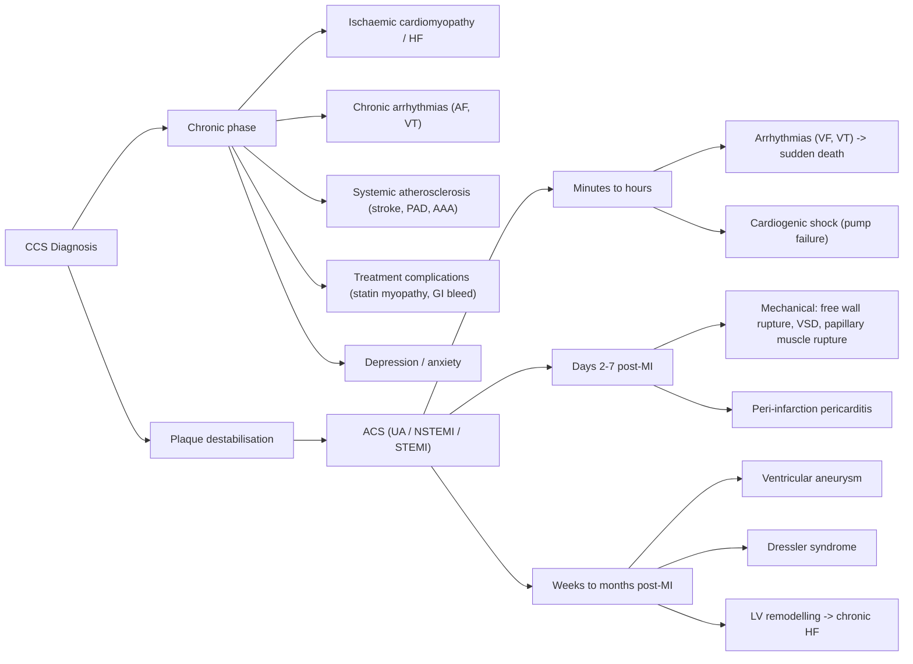

## Complications of Chronic Coronary Syndrome

### Conceptual Framework — Why Does CCS Have Complications?

CCS is not a benign, static condition. The underlying coronary atherosclerosis is a **dynamic process** that can progress silently or catastrophically. Complications arise from two fundamental mechanisms:

1. **Plaque progression/destabilisation** → The stable plaque can evolve: fibrous cap thins, inflammatory activity increases, and eventually the plaque ruptures or erodes → **ACS** (the most feared complication of CCS)
2. **Chronic myocardial ischaemia** → Repeated or sustained ischaemia damages myocardium over time → **heart failure, arrhythmias, ischaemic cardiomyopathy**

Think of CCS as a ticking time bomb: the patient may feel fine between episodes of angina, but the atherosclerotic disease is relentless, and without optimal management, complications are inevitable.

---

### 1. Progression to Acute Coronary Syndrome (ACS)

This is the **single most important complication** of CCS. The transition from stable to unstable represents the moment a previously stable plaque becomes complicated.

***Most common aetiology of acute coronary syndrome is the slow development of atherosclerotic coronary artery plaque, which presents acutely by thrombus formation on fissured plaque*** [6]

***Patient may note abrupt change in pattern and severity of symptoms, often symptomatic at rest*** [6]

#### Mechanism: From Stable Plaque to ACS

The stable plaque in CCS has a **thick fibrous cap** protecting a lipid core. Complications arise when:

1. **Plaque rupture** (~60–70% of ACS): inflammatory cells (macrophages) within the plaque secrete **matrix metalloproteinases (MMPs)** that digest the collagen in the fibrous cap → cap becomes thin and mechanically weak → ruptures → exposes the highly thrombogenic lipid core and collagen to circulating blood → platelet adhesion → coagulation cascade activation → **thrombus formation**
2. **Plaque erosion** (~30–40%): superficial endothelial denudation without frank rupture → thrombus forms on the eroded surface. More common in younger patients and women.
3. **Calcified nodule** (rare): a calcified protrusion through the fibrous cap → endothelial disruption → thrombosis

***Acute thrombus formed on fissured plaque → ischaemia → ECG signs of ischaemic myocardium (ST-segment depression, T-wave inversion) → peripheral embolisation of thrombus → injury → damaged myocytes release CK and CK-MB, as well as contractile proteins troponins T and I*** [6]

#### Clinical Spectrum of ACS

***The clinical spectrum of ACS ranges from oligo/asymptomatic → increasing chest pain/symptoms → persistent chest pain/symptoms → cardiogenic shock/acute heart failure → cardiac arrest*** [17]

| Entity | Pathology | ECG | Troponin | Mechanism |
|---|---|---|---|---|
| ***Unstable angina (UA)*** | ***Severe ischaemia at rest without infarction*** [2] | ST depression or T-wave inversion or normal | **Normal** | Partial/transient thrombus → critical stenosis without necrosis |
| ***NSTEMI*** | ***Partial occlusion → some myocardial necrosis but not transmural*** [2] | ***ST-segment depression*** [17] | ***Rise and fall*** [17] | Partial/non-occlusive thrombus → subendocardial necrosis |
| ***STEMI*** | ***Complete occlusion → transmural myocardial necrosis*** [2] | ***ST-segment elevation*** [17] | ***Rise and fall*** (higher peak) [17] | Complete thrombotic occlusion → transmural infarction |

***Acute myocardial infarction: myocardial cell death due to prolonged myocardial ischaemia. Mortality: 40% overall in 4 weeks (half ≤ 2h due to VF), 6–7% in 30 days for those surviving to hospital*** [2]

<Callout title="The Key Teaching Point">
CCS and ACS are on a **continuum**. Every patient with CCS is at risk of ACS. This is why prognostic therapy (aspirin, statin, ACEI/ARB) is prescribed to ALL CCS patients — the goal is to prevent plaque destabilisation and thrombosis, not just to relieve angina symptoms.
</Callout>

#### Risk Factors for Progression from CCS to ACS

- Uncontrolled risk factors (persistent smoking, uncontrolled DM, poorly treated dyslipidaemia)
- Non-adherence to antiplatelet/statin therapy
- Highly inflamed plaques (high-risk plaque features on imaging: thin-cap fibroatheroma, large lipid core, positive remodelling)
- Concurrent triggers: heavy exertion, emotional stress, surgical procedures, infections (e.g. pneumonia), circadian variation (peak 6am–12pm) [2]

---

### 2. Ischaemic Cardiomyopathy and Heart Failure

#### Mechanism

Chronic, repeated episodes of myocardial ischaemia → progressive myocyte death (apoptosis and necrosis) → replacement fibrosis → **left ventricular remodelling** (dilatation, wall thinning, shape change from elliptical to spherical) → progressive decline in **systolic function** → **heart failure with reduced ejection fraction (HFrEF)**.

This is called **ischaemic cardiomyopathy** and is the **most common cause of HFrEF worldwide**.

Additionally, even without overt infarction:
- **Chronic subendocardial ischaemia** → diastolic dysfunction (impaired relaxation) → **HFpEF** (heart failure with preserved ejection fraction)
- **Myocardial hibernation:** Viable but chronically under-perfused myocardium "downregulates" its contractile function as a protective mechanism. This myocardium is **viable but dysfunctional** — it can recover function if revascularised. This is why ***determining viability of myocardium (→ decides whether to perform PCI or CABG)*** [7] is so important.
- **Myocardial stunning:** After a severe ischaemic episode that is resolved (e.g. successful PCI for ACS), the myocardium may remain temporarily dysfunctional for hours to weeks despite restored blood flow. Unlike hibernation (chronic), stunning is a post-ischaemic phenomenon that recovers spontaneously.

#### Clinical Features

- Progressive exertional dyspnoea (pulmonary congestion)
- Orthopnoea and PND (paroxysmal nocturnal dyspnoea)
- Peripheral oedema, elevated JVP, hepatomegaly (right heart failure)
- ***Signs to assess: jugular venous distention, S₃, S₄, displaced point of maximal impulse, hepatomegaly, pulmonary/peripheral oedema*** [6]

#### Why LVEF Matters So Much in CCS

***LVEF is the strongest predictor of long-term survival. LVEF < 50% is associated with markedly increased event risk regardless of severity of ischaemia*** [2]

This is because a depressed LVEF indicates:
- Extensive myocardial damage has already occurred
- The remaining myocardium is vulnerable to further ischaemic insults
- The patient is at high risk of ventricular arrhythmias (scarred myocardium is arrhythmogenic)
- HF itself creates a vicious cycle: ↓CO → ↓coronary perfusion → more ischaemia → more myocardial damage

---

### 3. Arrhythmias

Arrhythmias in CCS arise from two distinct mechanisms:

#### A. Ischaemia-Induced Arrhythmias

- **Mechanism:** During an ischaemic episode, affected myocytes become acidotic → K⁺ efflux + Ca²⁺ influx → altered membrane potential → **re-entry circuits** and **triggered activity** → ventricular arrhythmias (VT, VF)
- **Clinical significance:** This is why ***coronary artery disease accounts for 85% of cardiac arrests*** [18]. VF is the most common cause of sudden cardiac death in CAD patients.
- ***Malignant arrhythmia*** may be the first manifestation of underlying CCS — a patient with no prior cardiac history may present with out-of-hospital cardiac arrest as their "first" event [17]

#### B. Scar-Related Arrhythmias (Post-MI)

- **Mechanism:** Prior MI → myocardial scar → border zone between scar and viable myocardium creates electrical inhomogeneity → **macro re-entry circuits** → monomorphic VT
- These patients benefit from **ICD** (implantable cardioverter-defibrillator) implantation for secondary prevention of sudden cardiac death, or primary prevention if LVEF ≤ 35% with NYHA II–III symptoms [2]

#### C. Atrial Fibrillation (AF)

- **Mechanism:** Chronic ischaemia → left atrial dilatation (from ↑LVEDP) → atrial remodelling → substrate for AF
- ***Atrial fibrillation*** [6] complicates CCS and worsens prognosis by:
  - ↑HR → ↑O₂ demand + ↓diastolic filling → worsens ischaemia
  - Loss of atrial contraction → ↓CO (especially problematic in diastolic dysfunction)
  - Thromboembolic risk (stroke)

---

### 4. Mechanical Complications (Primarily Post-MI)

These are dramatic, life-threatening complications that occur when transmural infarction weakens the myocardial wall. While they classically follow acute MI, they represent the worst-case endpoint of the CCS → ACS continuum.

***AMI complications: heart failure, arrhythmias, VSD (anterior MI), mitral regurgitation complicating papillary muscle dysfunction (inferior MI), pericarditis*** [15]

| Complication | Timing Post-MI | Mechanism | Clinical Features |
|---|---|---|---|
| **Free wall rupture** | Days 3–7 (peak) | Transmural necrosis weakens wall → ↑intracavity pressure → rupture → haemopericardium → **cardiac tamponade** → PEA arrest | Sudden haemodynamic collapse, PEA, Beck's triad (hypotension, muffled heart sounds, ↑JVP). Almost universally fatal without immediate surgery |
| ***Ventricular septal defect (VSD)*** | Days 3–7 | Necrosis of interventricular septum → rupture → L→R shunt. ***VSD complicates anterior MI*** (LAD territory involves septum) [15] | New harsh pansystolic murmur at LLSB, acute biventricular failure, step-up in O₂ saturation from RA to RV on Swan-Ganz |
| ***Papillary muscle rupture/dysfunction*** | Days 2–7 (rupture); acute or chronic (dysfunction) | Ischaemia/necrosis of papillary muscle (posteromedial > anterolateral because single blood supply from PDA). ***Mitral regurgitation complicating papillary muscle dysfunction (inferior MI)*** [15] | Acute severe MR: new pansystolic murmur at apex radiating to axilla, flash pulmonary oedema, cardiogenic shock |

***Ventricular aneurysm: occurs in 8–15% with STEMI, especially for those with persistent occlusion*** [2]:
- ***70–85% located at anterior or apical walls → due to LAD total occlusion without collateral*** [2]
- ***Consequences: acute decompensated HF with angina (wasted mechanical energy to enlarge aneurysm), ventricular arrhythmia due to myocardial irritation, systemic embolisation — mural thrombus occurs in > 50%*** [2]
- ***Diagnosis: paradoxical impulse on chest wall, ECG showing persistent ST elevation and Q despite reperfusion, CXR showing unusual bulge from cardiac silhouette, echo is diagnostic*** [2]
- ***Management: oral anticoagulation if documented mural thrombus; aneurysmectomy + CABG if intractable ventricular arrhythmias or heart failure refractory to medical therapy*** [2]

---

### 5. Pericardial Complications (Post-MI)

***Peri-infarction pericarditis (PIP): common on 2nd/3rd day post-MI, occurs in 1.2% of MI patients*** [2]
- ***S/S: development of a different pain — positional, sharp pleuritic, especially at trapezius ridge. Pericardial rub (diagnostic)*** [2]
- ***ECG: new widespread ST elevation or PR depression beyond typically anatomic regional boundary*** [2]
- ***Management: paracetamol ± aspirin (650 mg Q6–8h) ± opiate-based analgesia (usually self-limited). Avoid NSAIDs/steroids 7–10 days after acute MI due to ↑risk of aneurysm/rupture*** [2]

***Post cardiac injury (Dressler) syndrome: in weeks/months post-MI, usually subsides in a few days*** [2]
- ***Mechanism: probably autoimmunity due to release of cardiac antigens into pericardial space*** [2]
- ***S/S: persistent fever, pericarditis, pleurisy with compatible history of prior cardiac injury*** [2]
- ***Investigations: often associated with ↑inflammatory markers (↑WCC, CRP/ESR) with pericardial ± pleural effusion*** [2]
- ***Management: high-dose aspirin/NSAID (e.g. indomethacin 25–50 mg TDS × 1–2 days), colchicine ± steroid*** [2]

---

### 6. Pump Failure and Cardiogenic Shock

***Mechanism: downward spiral exacerbating myocardial ischaemia*** [2]:
- ***↓Systolic function → ↓coronary perfusion → ↓supply → ischaemia*** [2]
- ***↓Diastolic function → ↑pulmonary congestion → hypoxaemia → ischaemia*** [2]

***Indicates extensive myocardial damage → poor prognosis (↑likelihood of other complications)*** [2]

This is the most lethal haemodynamic complication:
- Occurs when **≥ 40% of LV myocardium** is damaged
- Mortality > 50% even with aggressive treatment
- Management includes inotropes, IABP (intra-aortic balloon pump), and emergent revascularisation [2]

---

### 7. Peripheral and Systemic Atherosclerotic Complications

CCS is a **local manifestation of a systemic disease** — atherosclerosis. Therefore, patients with CCS are at high risk of atherosclerotic complications in other vascular beds:

| Vascular Bed | Complication | Clinical Significance |
|---|---|---|
| **Carotid arteries** | Carotid stenosis → ischaemic stroke/TIA | ***Carotid bruits*** on examination suggest coexistent disease [6] |
| **Cerebral arteries** | Ischaemic stroke | 2nd/3rd leading cause of death in HK; shares risk factors with CCS |
| **Peripheral arteries** | ***Peripheral arterial disease (PAD)*** — intermittent claudication, critical limb ischaemia | ***Peripheral pulses, peripheral skin discolouration or hair loss*** [6]; ankle-brachial index (ABI) < 0.9 confirms diagnosis |
| **Aorta** | Aortic aneurysm (AAA), aortic dissection | Shared atherosclerotic pathology; AAA screening recommended in elderly male smokers |
| **Renal arteries** | Renal artery stenosis → renovascular hypertension, ischaemic nephropathy | May worsen CKD; unilateral = HTN, bilateral = renal failure |

***> 15 mm Hg arm blood pressure disparity = increased risk for peripheral arterial disease (PAD) and cardiovascular death*** [6]

<Callout title="CCS is a Systemic Disease">
Always remember: a patient with coronary atherosclerosis very likely has atherosclerosis elsewhere. Screen for carotid disease (bruits, duplex ultrasound), PAD (peripheral pulses, ABI), and AAA (ultrasound in at-risk populations). Managing one vascular bed without addressing the systemic disease is incomplete care.
</Callout>

---

### 8. Complications of Treatment

#### A. Complications of PCI

***PCI complications (mortality < 0.5%)*** [2]:

| Category | Detail |
|---|---|
| ***Coronary artery-related*** | ***ALL can lead to myocardial ischaemia or infarction. Dissection and abrupt closure (rare now due to routine stenting). Intramural haematoma (6.7%) and perforation (0.2–0.6%). Side branch occlusion (up to 19%)*** [2] |
| ***Stent-related*** | ***Stent thrombosis (1–2%): acute event, usually presents with severe STEMI or cardiac death. Due to thrombus formation at exposed stent surface before endothelialisation. Majority occurs < 30 days. Prevention: DAPT*** [2]. ***In-stent restenosis (ISR): chronic event, usually presents with recurrent stable angina. Due to intimal proliferation at ≥ 6–9 months. Prevention: DES*** [2] |
| ***Others*** | ***Access-related: bleeding, infection, atheroembolism. Systemic: AKI (contrast, haemodynamic instability, atheroembolism), stroke, bacteraemia*** [2] |

#### B. Complications of CABG

***CABG complications*** [2]:

| Cardiac | Non-Cardiac |
|---|---|
| ***Perioperative MI (< 1–2%)*** | ***Bleeding*** |
| ***Graft occlusion (5–10% in 30 days, ~1–2%/yr for first 6 years then ~5%/yr)*** | ***Neurological: stroke, cognitive impairment — classically from aortic thrombus*** |
| ***Low cardiac output from ventricular dysfunction*** | ***Infection: wound infection with mediastinitis*** |
| ***Arrhythmia: 30% AF in 1st week*** | ***AKI*** |
| ***Pericarditis, effusion, tamponade*** | |

#### C. Drug-Related Complications

| Drug | Key Complication | Mechanism |
|---|---|---|
| **Aspirin** | GI bleeding, haemorrhagic stroke | COX-1 inhibition → ↓gastric mucosal protection; ↓platelet function |
| **Statin** | Myopathy/rhabdomyolysis, hepatotoxicity, new-onset DM | Myopathy: unclear, possibly mitochondrial dysfunction; DM: ↓insulin secretion |
| **BB** | Bradycardia, fatigue, bronchospasm, masking of hypoglycaemia | β₁ blockade → ↓HR/conduction; β₂ blockade → bronchoconstriction; ↓sympathetic hypoglycaemia awareness |
| **ACEI** | Dry cough (10–15%), hyperkalaemia, AKI, angioedema | Cough: ↑bradykinin accumulation; hyperkalaemia: ↓aldosterone; AKI: ↓efferent arteriolar tone in CKD |
| **Nitrates** | Headache, hypotension, tolerance | Vasodilation → ↓BP/↑cerebral venous pressure → headache; tolerance from sulfhydryl group depletion |

---

### 9. Psychological and Quality-of-Life Complications

Often overlooked but clinically significant:
- **Depression** (prevalence 20–30% in CAD patients): bidirectional relationship — depression worsens CAD outcomes (↑sympathetic tone, ↑inflammation, ↓medication adherence) and CAD precipitates depression (fear, functional limitation)
- **Anxiety and avoidance behaviour:** Fear of exertion → physical deconditioning → worsens functional capacity → more anxiety (a vicious cycle)
- **Sexual dysfunction:** Both from the disease (↓CO, PVD) and medications (BB → erectile dysfunction)

---

### Summary Timeline of Complications

---

<Callout title="High Yield Summary — Complications of CCS">

**1. ACS** — the most feared complication. Plaque rupture/erosion → thrombus → UA/NSTEMI/STEMI. Mortality 40% at 4 weeks for AMI. Prevention: aspirin, statin, risk factor control.

**2. Ischaemic cardiomyopathy/HF** — chronic ischaemia → myocyte loss → fibrosis → LV remodelling → HFrEF. LVEF is the strongest prognostic predictor. Hibernating myocardium is viable and may recover with revascularisation.

**3. Arrhythmias** — Ischaemia-induced (VF/VT → sudden cardiac death, accounts for 85% of cardiac arrests). Scar-related (monomorphic VT → ICD). AF from atrial remodelling.

**4. Mechanical complications** (post-MI) — Free wall rupture (tamponade), VSD (anterior MI, LAD), papillary muscle rupture → acute MR (inferior MI, PDA territory), ventricular aneurysm (anterior/apical, persistent ST elevation, mural thrombus in > 50%).

**5. Pericardial** — PIP (day 2–3, pericardial rub), Dressler syndrome (weeks later, autoimmune, fever + pericarditis + pleurisy).

**6. Pump failure** — ↓systolic + ↓diastolic function → vicious cycle of ischaemia; cardiogenic shock if ≥ 40% LV damage.

**7. Systemic atherosclerosis** — CCS = coronary manifestation of systemic disease. Screen for carotid disease, PAD, AAA.

**8. Treatment complications** — PCI: stent thrombosis (DAPT prevents), in-stent restenosis (DES prevents). CABG: graft failure, AF (30%), stroke, mediastinitis. Drugs: statin myopathy, aspirin GI bleed, ACEI cough/AKI, BB bradycardia.

</Callout>

---

<ActiveRecallQuiz
  title="Active Recall - Complications of CCS"
  items={[
    {
      question: "A patient with known stable angina presents with a new pansystolic murmur at the left lower sternal border, acute biventricular failure, and haemodynamic collapse 5 days after a large anterior STEMI. What is the most likely diagnosis and what is the mechanism?",
      markscheme: "Ventricular septal defect (VSD) — a mechanical complication of anterior MI. Mechanism: Transmural necrosis of the interventricular septum (supplied by LAD) weakens the septum, which then ruptures, creating a left-to-right shunt. This causes acute volume overload of the RV and pulmonary circulation. Diagnosed by step-up in O2 saturation from RA to RV on Swan-Ganz catheterisation; confirmed by echocardiography. Emergency surgical repair required.",
    },
    {
      question: "Explain the difference between myocardial hibernation and myocardial stunning. Why is the distinction clinically important?",
      markscheme: "Hibernation: chronic reduction in contractile function in response to chronic hypoperfusion (a protective downregulation). The myocardium is viable but dysfunctional. It can recover if revascularised (PCI or CABG). Stunning: temporary post-ischaemic contractile dysfunction after an acute ischaemic event that has been resolved. The myocardium recovers spontaneously over hours to weeks without revascularisation. Clinical importance: Hibernating myocardium is an indication for revascularisation (viability testing by MPI or cardiac MRI guides this decision). Stunned myocardium will recover on its own.",
    },
    {
      question: "A patient develops persistent fever, pleuritic chest pain, and a pericardial rub 4 weeks after a STEMI. Blood tests show elevated CRP and ESR with a small pericardial effusion on echo. What is the diagnosis, the mechanism, and the treatment?",
      markscheme: "Diagnosis: Dressler syndrome (post-cardiac injury syndrome). Mechanism: Autoimmune response triggered by release of cardiac antigens (from infarcted myocardium) into the pericardial space, provoking an inflammatory reaction. Treatment: High-dose aspirin or NSAID (e.g. indomethacin 25-50 mg TDS for 1-2 days), colchicine, and steroids if refractory. Unlike peri-infarction pericarditis (day 2-3), Dressler occurs weeks to months post-MI.",
    },
    {
      question: "Why is coronary artery disease the leading cause of cardiac arrest (85%)? Describe the mechanism linking ischaemia to ventricular fibrillation.",
      markscheme: "During myocardial ischaemia, affected myocytes become acidotic and metabolically deranged. K+ efflux from ischaemic cells and Ca2+ influx alter the membrane potential, creating electrical inhomogeneity between ischaemic and non-ischaemic zones. This produces the substrate for re-entry circuits and triggered activity, leading to ventricular tachycardia (VT) that may degenerate into ventricular fibrillation (VF). VF causes totally uncoordinated ventricular contraction with no effective cardiac output. In AMI, half of deaths occur within the first 2 hours, primarily from VF.",
    },
    {
      question: "Differentiate between stent thrombosis and in-stent restenosis following PCI in terms of mechanism, timing, clinical presentation, and prevention strategy.",
      markscheme: "Stent thrombosis: Acute event from thrombus formation on exposed stent surface before endothelialisation. Timing: majority within 30 days (acute/subacute), can be late. Presents as severe STEMI or sudden cardiac death. Prevention: DAPT (aspirin + P2Y12 inhibitor). In-stent restenosis: Chronic event from intimal (neointimal) proliferation gradually re-narrowing the stented segment. Timing: typically 6-9 months or later. Presents as recurrent stable angina. Prevention: drug-eluting stent (DES) releases antiproliferative agents (everolimus, zotarolimus) to inhibit neointimal hyperplasia.",
    },
  ]}
/>

## References

[2] Senior notes: Ryan Ho Cardiology.pdf (p124–126: PCI complications, CABG complications, stent thrombosis, in-stent restenosis; p139–142: Post-MI arrhythmias, pump failure, pericardial complications, mechanical complications, ventricular aneurysm)
[6] Lecture slides: GC 028. Accelerating chest pain_Acute coronary (1).pdf (p10: Atherosclerosis to ACS progression, plaque rupture, thrombus formation; p19: Physical examination assessing complications — CHF signs, arrhythmias, PAD)
[7] Senior notes: Ryan Ho Diagnostic Radiology.pdf (p57: MPI for viability assessment — hibernating myocardium)
[15] Lecture slides: GC 088. Sudden Severe Chest Pain.pdf (p56: AMI complications — HF, arrhythmias, VSD, MR, pericarditis)
[17] Lecture slides: GC 028. Accelerating chest pain_Acute coronary (1).pdf (p11: Clinical spectrum of ACS — ESC Guideline 2023; p45: Aims of treatment; p55: Anti-ischaemic therapy)
[18] Senior notes: Ryan Ho Critical Care.pdf (p28: Cardiac arrest causes — CAD 85%, structural 10%, others 5%)
