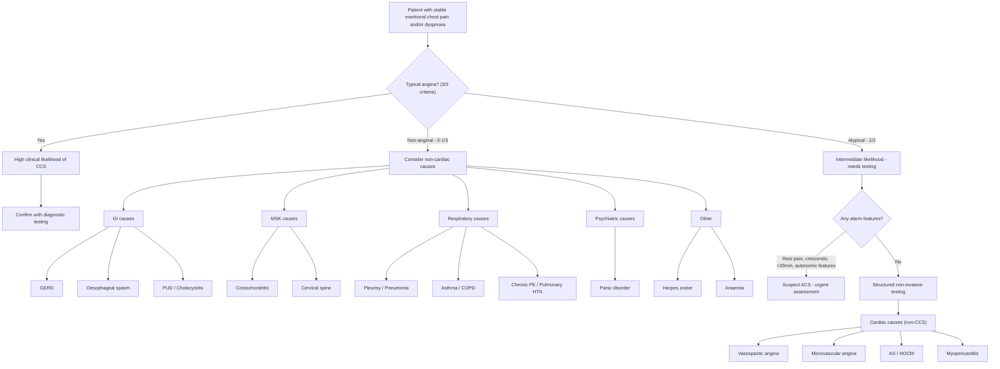

## Differential Diagnosis of Chronic Coronary Syndrome

### Conceptual Framework — Why Differential Diagnosis Matters in CCS

Before diving into the list, let's establish the clinical reasoning. A patient presents to you with **chest pain on exertion**. Your first job is to decide:

1. **Is this cardiac or non-cardiac?** (character of pain, risk factor profile)
2. **If cardiac — is this stable (CCS) or acute (ACS)?** (pattern, duration, response to rest/GTN)
3. **If stable — is there an alternative diagnosis that mimics CCS?**

The differential diagnosis of CCS is really the differential diagnosis of **stable, recurrent, exertional chest pain and/or dyspnoea**. This is distinct from the DDx of *acute* chest pain (where you worry about the "big five" emergencies: ACS, aortic dissection, PE, tension pneumothorax, oesophageal rupture) [2][8].

---

### DDx Organised by System

***The main differentials for stable chest pain are divided into potentially severe and benign*** [2][8]:

| **Potentially Severe** | **Relatively Benign** |
|---|---|
| ***Stable ischaemic heart disease*** | ***GERD and other oesophageal pathologies*** |
| ***Subacute/chronic pulmonary embolism*** | ***Musculoskeletal pain*** |
| ***Malignancy with pleural/chest wall involvement*** | ***Psychogenic chest pain*** |
| ***Pulmonary hypertension*** | ***Herpes zoster*** |

Now let's expand this comprehensively, system by system, and explain *why* each condition can mimic CCS and *how* to distinguish it.

---

### A. Cardiac Causes (Non-CCS) That Mimic Exertional Chest Pain

#### 1. Acute Coronary Syndrome (ACS) — The Most Critical DDx

***The single most important distinction you must make is CCS versus ACS.*** [2]

| Feature | CCS (Stable Angina) | ACS (Unstable Angina / MI) |
|---|---|---|
| Pattern | Predictable, at a reproducible workload | ***New-onset, crescendo, or at rest*** [9] |
| Duration | ***< 2–10 min*** [2] | ***> 20–30 min, not relieved by rest*** [2] |
| Response to GTN | ***Relieved ≤ 5 min*** [2] | Often NOT relieved |
| Troponin | Normal | Elevated in NSTEMI/STEMI |
| ECG | May be normal or have chronic changes | Dynamic ST changes, new T-wave inversion, ST elevation |
| Autonomic features | Usually absent | ***Diaphoresis, N/V may occur*** [2] |

**Why ACS can be confused with CCS:** A patient with known stable angina who develops a change in pattern (lower threshold, rest pain, prolonged episodes) is transitioning from CCS to ACS — the plaque has become unstable. This is **"accelerating angina"** and is a medical emergency [9].

***Features suggesting onset of ACS over usual stable angina: (1) Angina at rest — prolonged > 20 min, (2) New-onset angina — at least CCS II, (3) Increasing angina — previous angina with ↑frequency, ↑duration, or ↓threshold to ≥ CCS III severity, (4) Post-infarct angina — recurrent angina after recent MI*** [9]

#### 2. Aortic Valve Stenosis (AS)

- **Why it mimics CCS:** Angina is one of the classical triad of severe AS (angina, syncope, heart failure). The mechanism is ↑LV pressure → ↑LV wall stress → ↑O₂ demand **plus** ↓diastolic coronary perfusion pressure gradient, even without epicardial coronary disease [2][6].
- **How to distinguish:** Ejection systolic murmur radiating to carotids, slow-rising pulse (*pulsus parvus et tardus*), narrow pulse pressure. Echocardiography is diagnostic.

#### 3. Hypertrophic Cardiomyopathy (HCM/HOCM)

- **Why it mimics CCS:** Massive LV hypertrophy → ↑O₂ demand + ↑intramural compression of small coronary vessels → subendocardial ischaemia on exertion. Dynamic LVOT obstruction worsens with exercise (↑contractility, ↓preload from sweating) [2].
- **How to distinguish:** Young patient, family history of sudden cardiac death, harsh systolic murmur that ↑ with Valsalva (decreased preload worsens obstruction). Echo shows asymmetric septal hypertrophy ± SAM (systolic anterior motion of mitral valve).

#### 4. Coronary Vasospasm (Prinzmetal / Variant Angina)

- **Why it mimics CCS:** Recurrent episodes of chest pain, often stereotyped and responsive to nitrates.
- **How to distinguish:** Pain typically occurs **at rest** (classically in the early morning hours, not with exertion), transient **ST elevation** during pain (transmural ischaemia from complete vasospasm), more common in smokers and younger patients. Coronary angiography may be normal between attacks. Provocation testing with ergonovine or acetylcholine can confirm.

#### 5. Cardiac Syndrome X / Microvascular Angina

- **Why it mimics CCS:** Exertional chest pain with ischaemic changes on stress testing — looks exactly like CCS.
- **How to distinguish:** **Normal epicardial coronary arteries** on angiography. More common in women, especially peri-/post-menopausal. The problem is in the **coronary microvasculature** (impaired vasodilatory reserve of small vessels < 500 μm). Can be confirmed with coronary flow reserve (CFR) measurement or index of microvascular resistance (IMR).

#### 6. Myopericarditis

- ***Myopericarditis*** can cause chest pain but is typically **sharp, pleuritic** (worse with inspiration, relieved by sitting forward), and often follows a viral illness [6].
- ECG shows **diffuse concave ST elevation** (not territory-specific) + **PR depression** — very different from the regional changes of ischaemia.

#### 7. Takotsubo Syndrome (Stress Cardiomyopathy)

- ***Takotsubo syndrome*** [6] — acute chest pain and ST changes mimicking STEMI, typically in post-menopausal women after emotional/physical stress. Troponin mildly elevated, but angiography shows no obstructive CAD. Classic "apical ballooning" on echo/ventriculography. Usually recovers.

#### 8. Tachyarrhythmias

- ***Tachyarrhythmias*** (SVT, AF with rapid rate, VT) can cause chest pain because ↑HR → ↑O₂ demand + ↓diastolic filling time → ↓coronary perfusion [6]. Associated with palpitations. Diagnosed on ECG/Holter.

---

### B. Vascular Causes

#### 9. Aortic Dissection

- ***Aortic dissection*** [6][8] — classically ***sudden onset, maximal at onset, tearing pain radiating to the back*** [2]. This is a surgical emergency.
- How to distinguish from CCS: the pain is instantaneous and maximal at onset (not gradual build-up like angina), often migratory (follows the dissection), and there may be blood pressure discrepancy between arms, new aortic regurgitation murmur, or pulse deficits.
- CXR may show widened mediastinum; CT angiography is diagnostic [10].

#### 10. Chronic/Subacute Pulmonary Embolism (PE)

- ***Subacute/chronic pulmonary embolism*** [2][8] can present with exertional dyspnoea and chest discomfort that worsens progressively.
- The mechanism is ↑RV afterload → ↑RV wall stress → subendocardial ischaemia + ↓LV filling → ↓CO.
- Look for risk factors for VTE (immobilisation, malignancy, OCP), unilateral leg swelling, pleuritic component to pain, and hypoxia out of proportion to CXR findings. CT pulmonary angiography is diagnostic [11].

#### 11. Pulmonary Hypertension

- ***Pulmonary hypertension*** [2][8][12] causes exertional chest pain via ↑RV wall stress → subendocardial ischaemia of the right ventricle, plus ↓LV filling → ↓CO.
- Distinguished by progressive exertional dyspnoea as the dominant symptom (not chest pain), loud P2, signs of right heart failure (↑JVP, oedema, hepatomegaly), and RVH on ECG.

---

### C. Gastrointestinal Causes

***Gastrointestinal causes account for up to 42% of chest pain presentations in some series*** [6].

#### 12. Gastro-Oesophageal Reflux Disease (GERD)

- ***GERD and other oesophageal pathologies*** [2][8] — the most common non-cardiac mimic.
- **Why it mimics CCS:** Retrosternal burning discomfort, can be brought on by meals (and CCS can also be provoked by eating — via splanchnic blood diversion). Both may respond to some degree to nitrates (GTN relaxes oesophageal smooth muscle too!).
- **How to distinguish:** GERD pain is ***retrosternal burning*** [2] rather than pressure/constriction, typically worsened by lying down, bending, or large meals, relieved by antacids/PPIs. No relation to physical exertion per se (though post-prandial exertion may confuse). No ECG changes.

<Callout title="Pitfall — GTN Response Does NOT Confirm Cardiac Cause" type="error">
A very commonly tested point: GTN can relieve oesophageal spasm as well as angina (both involve smooth muscle relaxation). Therefore, relief with GTN does NOT confirm a cardiac origin. You need objective evidence (stress testing, coronary imaging) to distinguish. This is a classic exam trap.
</Callout>

#### 13. Oesophageal Spasm / Motility Disorders

- Diffuse oesophageal spasm can cause severe, crushing retrosternal chest pain that is indistinguishable from angina clinically. May be provoked by swallowing. Barium swallow shows "corkscrew oesophagus." Oesophageal manometry is diagnostic.

#### 14. Peptic Ulcer Disease / Gastritis

- ***Peptic ulcer, gastritis*** [6] — epigastric pain that may be perceived as lower chest discomfort. Usually related to meals (worse or better depending on ulcer location), relieved by antacids/PPIs. H. pylori testing and OGD are diagnostic.

#### 15. Biliary Disease (Cholecystitis)

- ***Cholecystitis*** [6] — right upper quadrant/epigastric pain, may radiate to right shoulder tip (phrenic nerve irritation). Tends to be colicky, associated with fatty meals, Murphy's sign positive. Ultrasound is diagnostic.

#### 16. Pancreatitis

- ***Pancreatitis*** [6] — epigastric pain radiating to the back, constant and severe, worse lying flat, better sitting forward. Associated with alcohol, gallstones. Elevated serum lipase/amylase.

---

### D. Musculoskeletal Causes

#### 17. Costochondritis (Tietze Syndrome)

- ***Musculoskeletal disorders*** [6][2] — ***chest wall syndrome accounts for ~28% of chest pain presentations*** [6].
- **Why it mimics CCS:** Anterior chest wall pain.
- **How to distinguish:** Pain is ***associated with specific movement or with palpation*** [2] — reproducible on pressing the costochondral junctions. **Not** exertional in the cardiovascular sense (though chest wall movement during exercise can provoke it). No ECG changes, no troponin rise.

#### 18. Cervical/Thoracic Spine Pathology

- ***Cervical spine pathologies*** [6] — radiculopathy can cause dermatomal chest pain. Often positional, associated with neck/arm symptoms.

---

### E. Respiratory Causes

#### 19. Asthma / COPD

- Exercise-induced bronchoconstriction can cause exertional chest tightness and dyspnoea. Distinguished by wheezing, response to bronchodilators, and spirometry showing reversible airflow obstruction [13].

#### 20. Pleurisy / Pneumonia

- ***Pleuritis*** [6] — ***sharp, stabbing pain ↑ with inspiration*** [2] (pleuritic chest pain). Associated with cough, fever, crackles. CXR shows consolidation or pleural effusion.

---

### F. Psychiatric / Other

#### 21. Panic Disorder / Anxiety

- ***Anxiety disorders*** [6] — ***psychogenic chest pain*** [2][8] is common. Pain is often atypical: ***pain after exertion*** rather than during [2], may last hours, associated with hyperventilation, paraesthesias, palpitations. Diagnosis of exclusion after cardiac causes are ruled out.

#### 22. Herpes Zoster

- ***Herpes zoster*** [2][8] — dermatomal burning/stabbing pain that precedes the rash by days. Once the vesicular rash appears in a dermatomal distribution, diagnosis is obvious. The pre-rash prodromal pain can mimic angina if in a thoracic dermatome.

#### 23. Anaemia

- ***Anaemia*** [6] — severe anaemia can cause exertional chest pain by ↓O₂ delivery to the myocardium. This is not really a "mimic" but rather a **precipitant** that unmasks subclinical CAD or causes demand ischaemia even in normal coronary arteries.

---

### Systematic DDx Diagram

---

### Master DDx Table — "How to Tell Them Apart"

| **Diagnosis** | **Character of Pain** | **Provocation** | **Duration** | **Key Distinguishing Feature** |
|---|---|---|---|---|
| **CCS (stable angina)** | Dull, constricting | Exertion, emotion | 2–10 min, relieved by rest/GTN | Predictable threshold, ECG ischaemia on stress test |
| **ACS** | Crushing, severe | Rest or minimal exertion | > 20 min, NOT relieved | ↑Troponin, dynamic ECG changes |
| **Aortic stenosis** | Exertional angina-like | Exertion | Variable | Ejection systolic murmur, slow-rising pulse |
| **HCM** | Exertional angina-like | Exertion, Valsalva | Variable | Young patient, FHx sudden death, murmur ↑ with Valsalva |
| **Vasospastic angina** | Angina-like | Rest (early AM) | Minutes | Transient ST elevation, normal coronaries |
| **Microvascular angina** | Angina-like | Exertion | May be prolonged | Normal angiogram, ↓CFR |
| **Aortic dissection** | Tearing, severe | Sudden onset at rest | Persistent | Max at onset, BP asymmetry, widened mediastinum |
| **PE** | Pleuritic or crushing | Sudden onset | Persistent | Pleuritic, dyspnoea, DVT signs, D-dimer, CTPA |
| **Pulmonary HTN** | Exertional discomfort | Exertion | Variable | Loud P2, RV heave, signs of RHF |
| **GERD** | Burning | Lying down, meals | Minutes–hours | Relieved by antacids/PPI, no ECG changes |
| **Oesophageal spasm** | Crushing | Swallowing | Minutes | May respond to GTN (pitfall!), manometry diagnostic |
| **Costochondritis** | Sharp, localised | Palpation, movement | Variable | Reproducible on palpation |
| **Panic disorder** | Atypical, diffuse | Stress, not exertion | Minutes–hours | Hyperventilation, paraesthesias, diagnosis of exclusion |
| ***Takotsubo*** | Angina-like | Emotional/physical stress | Prolonged | Post-menopausal women, apical ballooning, no CAD |

---

### Relative Frequency of Chest Pain Aetiologies

***In an emergency department cohort study, the approximate breakdown of chest pain aetiologies was*** [6]:

- ***Gastrointestinal 42%***
- ***Ischaemic heart disease 31%***
- ***Chest wall syndrome 28%***
- ***Pericarditis 4%***
- ***Pleuritis 2%***
- ***Pulmonary embolism 2%***
- ***Lung cancer 1.5%***
- ***Aortic aneurysm 1%***
- ***Aortic stenosis 1%***
- ***Herpes zoster 1%***

<Callout title="Key Exam Point" type="idea">
Nearly half of all chest pain is GI in origin! This is why a good history focusing on the character, provocation, and relief of pain is so powerful. The OPQRST framework systematically distinguishes cardiac from non-cardiac causes without requiring any investigations.
</Callout>

---

### Red Flags — When Stable Chest Pain Is Actually Something Dangerous

Always re-evaluate if a patient labelled with "stable angina" develops any of the following:

| Red Flag | Think... |
|---|---|
| Pain at rest, > 20 min, not relieved by GTN | ACS (plaque rupture/erosion) |
| Sudden onset, maximal severity immediately | Aortic dissection, PE, pneumothorax |
| Associated with syncope/presyncope | ACS with arrhythmia, massive PE, severe AS, HOCM with LVOTO |
| Haemodynamic instability (↓BP, ↑HR, cool peripheries) | Massive PE, ACS with cardiogenic shock |
| New murmur | VSD (post-MI complication), acute AR (dissection), rupture of papillary muscle |
| Unilateral leg swelling + chest pain | PE from DVT |

> ***If you suspect ACS: admit CCU, bed rest, continuous ECG monitoring, 12-lead ECG stat, serial troponins, and initiate anti-ischaemic + antithrombotic therapy while awaiting results.*** [8]

---

<Callout title="High Yield Summary — DDx of CCS">

1. **The most important distinction is CCS vs ACS** — change in pattern (rest pain, crescendo, prolonged > 20 min) = ACS until proven otherwise.

2. **Cardiac non-CCS mimics:** AS, HOCM (exertional angina from ↑O₂ demand), vasospastic angina (rest pain, ST elevation), microvascular angina (normal angiogram), myopericarditis (pleuritic, diffuse ST changes), Takotsubo (emotional trigger, apical ballooning).

3. **Vascular mimics:** Aortic dissection (tearing, sudden max onset, back), chronic PE (pleuritic + dyspnoea + VTE risk factors), pulmonary HTN (exertional dyspnoea + RHF signs).

4. **GI mimics (commonest non-cardiac cause — 42%):** GERD (burning, postural, antacid-responsive), oesophageal spasm (may respond to GTN — exam pitfall!), PUD, cholecystitis.

5. **MSK (28%):** Costochondritis — reproducible on palpation, not truly exertional.

6. **Psychiatric:** Panic disorder — diagnosis of exclusion, pain often atypical and after (not during) exertion.

7. **Don't forget precipitants:** Anaemia and thyrotoxicosis can unmask subclinical CAD or cause demand ischaemia → always check CBC and TFT.

</Callout>

---

<ActiveRecallQuiz
  title="Active Recall - Differential Diagnosis of CCS"
  items={[
    {
      question: "A 55-year-old man with known stable angina now reports chest pain at rest lasting 25 minutes, not relieved by GTN. What is the most important diagnosis to exclude and what three clinical features distinguish this from his usual stable angina?",
      markscheme: "Must exclude ACS. Three distinguishing features: (1) Pain at rest rather than only on exertion, (2) Prolonged duration >20 min (his stable angina usually <10 min), (3) Not relieved by rest or GTN. Additional features: may have diaphoresis/autonomic symptoms, dynamic ECG changes, elevated troponin.",
    },
    {
      question: "A post-menopausal woman presents with exertional chest pain, positive stress ECG with ST depression, but normal coronary angiography. What is the likely diagnosis and what is the underlying mechanism?",
      markscheme: "Microvascular angina (Cardiac Syndrome X). Mechanism: dysfunction of coronary microvasculature (<500 um) with impaired vasodilatory reserve. Epicardial arteries are normal but small vessel disease causes ischaemia during stress. Can be confirmed by measuring coronary flow reserve (CFR) or index of microvascular resistance (IMR). More common in women.",
    },
    {
      question: "Why can GTN relief of chest pain NOT be used to confirm a cardiac origin? Name the non-cardiac condition that also responds to GTN.",
      markscheme: "GTN relaxes smooth muscle generally, not just coronary smooth muscle. Oesophageal spasm also involves smooth muscle spasm and can be relieved by GTN. Therefore, GTN response is not specific for cardiac chest pain. Objective testing (stress testing, coronary imaging) is needed to confirm cardiac aetiology.",
    },
    {
      question: "List the four potentially severe differential diagnoses for stable chest pain as categorised in the senior notes.",
      markscheme: "(1) Stable ischaemic heart disease, (2) Subacute/chronic pulmonary embolism, (3) Malignancy with pleural or chest wall involvement, (4) Pulmonary hypertension.",
    },
    {
      question: "A patient presents with sudden-onset severe tearing chest pain radiating to the back, maximal at onset. The pain character is fundamentally different from angina. Name the diagnosis, explain why the onset pattern differs from angina, and name two bedside findings you would look for.",
      markscheme: "Aortic dissection. Onset is instantaneous and maximal at onset because the intimal tear occurs abruptly, unlike angina which builds up gradually as O2 demand progressively exceeds supply. Two bedside findings: (1) Blood pressure discrepancy between arms (>20 mmHg systolic), (2) New early diastolic murmur of aortic regurgitation. Others: pulse deficit, focal neurological signs.",
    },
  ]}
/>

## References

[2] Senior notes: Ryan Ho Cardiology.pdf (p54–58: Angina pectoris, OPQRST, Other causes of chest pain, Clinical approach to stable and acute chest pain)
[6] Lecture slides: GC 028. Accelerating chest pain_Acute coronary (1).pdf (p16–17: Differential diagnosis of ACS table, frequency of chest pain aetiologies)
[8] Senior notes: Ryan Ho Fundamentals.pdf (p199–203: Chest pain approach, DDx tables for stable and acute chest pain)
[9] Senior notes: Ryan Ho Cardiology.pdf (p128: Clinical features of ACS — distinguishing from stable angina)
[10] Senior notes: felixlai.md (Aortic dissection: CXR findings, CT angiography)
[11] Senior notes: Ryan Ho Haemtology.pdf (p131: VTE clinical features, DVT/PE DDx)
[12] Senior notes: Ryan Ho Respiratory.pdf (p138–139: Pulmonary hypertension classification, clinical features)
[13] Senior notes: Ryan Ho Respiratory.pdf (p98, p111: Asthma DDx, COPD DDx)
