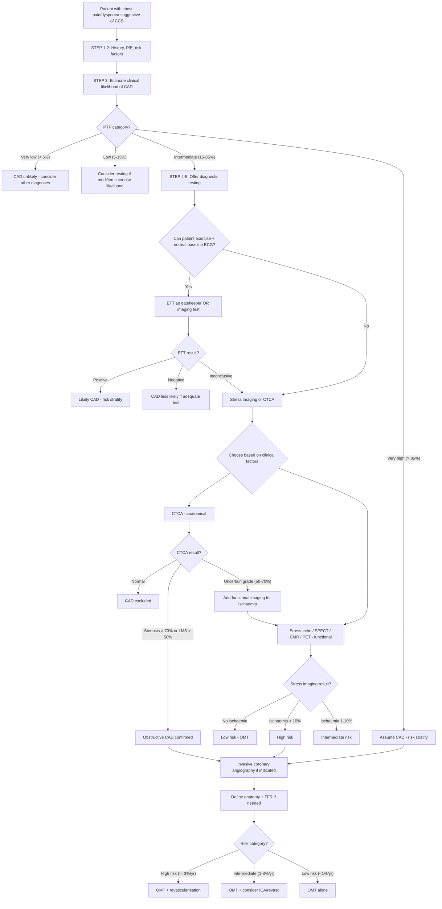

## Diagnostic Criteria, Diagnostic Algorithm, and Investigation Modalities for Chronic Coronary Syndrome

### Conceptual Framework — How Do We "Diagnose" CCS?

CCS is fundamentally different from many other conditions in medicine. There is no single diagnostic criterion or blood test that clinches the diagnosis. Instead, the diagnosis is built step-by-step through a **probabilistic approach**:

1. **Clinical assessment** → Determine *how likely* this patient's symptoms are due to obstructive CAD (clinical likelihood / pre-test probability)
2. **Baseline investigations** → Look for evidence of ischaemia, risk factors, LV function, and alternative diagnoses
3. **Diagnostic testing** → Choose the *right test for the right patient* based on PTP (anatomical vs functional)
4. **Prognostic stratification** → Once CAD is confirmed, determine *how dangerous* it is (guides revascularisation decisions)

***The roadmap to stable IHD (ESC 2013/2019): (1) Clinical assessment for clinical presentation and risk factors for IHD, (2) Baseline evaluation: basic blood tests, resting 12-lead ECG, ± echo/cardiac MRI, (3) Diagnostic evaluation: modality of choice based on pre-test probability of CAD, (4) Prognostic evaluation: risk of all-cause mortality determines the need of revascularization after institution of optimal medical therapy (OMT), (5) Management: appropriate management (medical vs revascularization) based on risk of event*** [2]

---

### STEP 1: Clinical Assessment — Establishing Clinical Likelihood of CAD

#### A. Defining Angina Type

***Diagnosis based on history alone may be difficult → generally divided into*** [2][8]:

| **Category** | **Definition** | **Criteria met** |
|---|---|---|
| ***Typical angina*** | Substernal discomfort of characteristic quality + provoked by exertion/emotion + relieved by rest or GTN ≤ 5 min | **3 of 3** |
| ***Atypical angina*** | Meets two of the three criteria above | **2 of 3** |
| ***Non-anginal chest pain*** | Meets one or none of the three criteria | **≤ 1 of 3** |

#### B. Pre-Test Probability (PTP) of Obstructive CAD

The **ESC 2019 updated PTP table** replaces the old Diamond-Forrester model (which overestimated CAD prevalence). PTP is estimated from **age, sex, and nature of symptoms** (typical, atypical, non-anginal, dyspnoea only) [1]:

***In addition to the classic Diamond and Forrester classes, patients with dyspnoea only or dyspnoea as the primary symptom are included.*** [1]

| Age | Typical angina (M/F) | Atypical angina (M/F) | Non-anginal (M/F) | Dyspnoea only (M/F) |
|---|---|---|---|---|
| 30–39 | 3% / 5% | 4% / 3% | 1% / 1% | 0% / 3% |
| 40–49 | 22% / 10% | 10% / 6% | 3% / 2% | 12% / 3% |
| 50–59 | 32% / 13% | 17% / 6% | 11% / 3% | 20% / 7% |
| 60–69 | 44% / 16% | 26% / 11% | 22% / 6% | 27% / 14% |
| 70+ | 52% / 27% | 34% / 19% | 24% / 10% | 32% / 12% |

> Shaded cells with PTP **< 5%** → CAD can generally be excluded without further testing. PTP **5–15%** → testing may be considered if clinical features favour CAD. PTP **> 15%** → offer diagnostic testing. PTP **> 85%** → CAD can be assumed; proceed to risk stratification/management.

#### C. Modifiers of Clinical Likelihood

***The PTP table alone is not enough. Clinical likelihood should be adjusted by modifiers*** [1]:

**Factors that DECREASE clinical likelihood:**
- ***Normal exercise ECG***
- ***Absence of coronary calcium (Agatston score = 0)***

**Factors that INCREASE clinical likelihood:**
- ***Risk factors for CVD (dyslipidaemia, diabetes, hypertension, smoking, family history)***
- ***Changes on resting ECG (Q-waves, ST-segment/T-wave changes)***
- ***LV dysfunction suggestive of CAD***
- ***Abnormal exercise ECG***
- ***Coronary calcium on CT***

<Callout title="Why Did ESC Move Away from Diamond-Forrester?">
The original Diamond-Forrester model (1979) was derived from populations with very high CAD prevalence and overestimated PTP by 2–3× in contemporary populations. The updated 2019 ESC table was recalibrated using pooled data from > 15,000 patients who underwent coronary angiography. This is clinically important because overestimating PTP leads to overtesting — unnecessary CT coronary angiograms, stress tests, and even invasive catheterisation.
</Callout>

---

### STEP 2: Baseline Investigations

These are done for **every patient** with suspected CCS, regardless of PTP. Their purpose is threefold: (a) detect evidence of ischaemia/prior MI, (b) assess risk factors and comorbidities, (c) evaluate LV function [2][8].

#### A. Basic Blood Tests

| Test | Purpose | Key Findings |
|---|---|---|
| ***CBC*** | Detect anaemia (↓Hb → ↓O₂ supply → exacerbates angina) | Hb < 10 g/dL may cause demand ischaemia even in mild stenosis |
| ***HbA1c*** | Screen for/monitor DM — a major risk factor and affects prognosis | ≥ 6.5% = DM; target < 7% in established CAD |
| ***Fasting lipid profile*** | Assess dyslipidaemia — drives treatment target | ***LDL-C is the key target: < 1.4 mmol/L for very high-risk patients*** (ESC 2019) |
| ***TFT*** | Detect thyrotoxicosis (↑O₂ demand) or hypothyroidism (2° dyslipidaemia) | TSH is the screening test |
| ***Renal function (Cr, eGFR)*** | CKD is an independent CVD risk factor; also impacts contrast/drug dosing | eGFR < 60 → ↑CVD risk, caution with contrast/metformin |
| ***Fasting glucose*** | Screen for DM/pre-diabetes | |

***Basic blood tests: CBC, HbA1c, lipid profile, TFT*** [2][8]

#### B. Resting 12-Lead ECG

***The baseline ECG is mandatory in every patient with suspected CCS.*** It may be normal in up to 50% of patients with CCS, but abnormalities carry diagnostic and prognostic significance [2][8]:

| Finding | Significance | Mechanism |
|---|---|---|
| ***Pathological Q waves*** | ***Evidence of previous MI*** — implies established CAD | Transmural necrosis → loss of electrical vectors → Q waves in leads facing the infarct |
| ***LBBB*** | May indicate prior extensive anterior MI (LAD territory) or cardiomyopathy; masks ischaemic ST changes | Disruption of the left bundle conduction → altered depolarisation sequence |
| ***ST-segment/T-wave changes*** | ***Evidence of ischaemia*** — ST depression/T inversion at rest suggests significant CAD | Ongoing subendocardial ischaemia at rest implies severe stenosis or microvascular disease |
| ***LVH*** | Suggests long-standing HTN → ↑O₂ demand; also reduces specificity of stress testing (false positive ST changes from repolarisation abnormality) | Increased LV mass → altered repolarisation |
| ***Pre-excitation (WPW)*** | May cause chest pain mimicking angina (SVT episodes); also invalidates stress ECG interpretation | Accessory pathway conducts abnormally → altered baseline ST/T |
| ***Arrhythmias, AF*** | AF → ↑HR → ↑demand; also a source of cardioembolism | |

> ***Baseline 12-lead ECG: evidence of ischaemia or previous MI (pathological Q, LBBB, ST/T changes); other evidence of cardiac disease (LVH, pre-excitation, arrhythmias, AF)*** [2][8]

#### C. Resting Echocardiography

***Routine baseline echocardiography is recommended (ESC 2013/2019) to evaluate for:*** [2][8]
1. **Regional wall motion abnormalities (RWMA)** — suggest prior MI or active ischaemia in that territory
2. ***LVEF → the strongest predictor of long-term survival*** [2]. ***LVEF < 50% is a/w ↑↑ event risk regardless of severity of ischaemia*** [2]
3. **Other structural cardiac conditions** — valvular heart disease (AS, AR, HOCM), pericardial disease, diastolic dysfunction

Why echo is so important: even if the patient has mild angina and a low PTP, a depressed LVEF changes their entire risk category and management. This is why it should be a **baseline** test, not reserved for selected patients.

#### D. Chest X-Ray

***CXR if likely non-cardiac in origin and suspicious of pulmonary aetiology*** [2][8]

- Not routinely diagnostic for CCS, but useful to:
  - Exclude pulmonary pathology (pneumonia, pleural effusion, lung mass)
  - Detect cardiomegaly (suggests LV dilatation/failure)
  - Look for aortic calcification or widened mediastinum (dissection)
  - Identify pulmonary congestion (suggests HF)

---

### STEP 3: Diagnostic Evaluation — Choosing the Right Test

This is where understanding the **principles of diagnostic testing** is critical. There are two broad categories of tests:

| Category | What It Detects | Examples | Advantage | Limitation |
|---|---|---|---|---|
| **Anatomical tests** | Physical narrowing of coronary arteries | CT coronary angiography (CTCA), invasive coronary angiography (ICA) | Directly visualises stenosis; excellent NPV (CTCA) | May detect anatomically significant but haemodynamically insignificant stenosis (50–70% range) |
| **Functional tests** | Haemodynamic consequence of stenosis (ischaemia) | ETT, stress echo, stress CMR, SPECT-MPI, PET | Detects physiologically significant disease; better correlation with symptoms | May miss non-obstructive disease; lower spatial resolution |

***Choice of the test based on clinical likelihood, patient characteristics and preference, availability, as well as local expertise*** [1]

#### The ESC 2019 Diagnostic Approach

***The ESC 2019 algorithm can be summarised in six steps*** [1]:

**Step 1–2:** Clinical assessment → Assess symptoms and risk factors
**Step 3:** Estimate clinical likelihood of obstructive CAD using PTP table + modifiers
**Step 4:** If very low ( < 5%) → generally no further testing needed; if very high ( > 85%) → assume CAD, consider ICA directly
***Step 5: Offer diagnostic testing →***
- ***Coronary CTA*** (preferred first-line in most patients)
- ***Testing for ischaemia (imaging testing preferred)*** — stress echo, stress CMR, SPECT, PET

***Step 6: Choose appropriate therapy based on symptoms and event risk*** [1]

> ***High clinical likelihood and symptoms inadequately responding to medical treatment, high event risk based on clinical evaluation (such as ST-segment depression, combined with symptoms at a low workload or systolic dysfunction indicating CAD), or uncertain diagnosis on non-invasive testing → invasive coronary angiography*** [1]

> ***Functional imaging for myocardial ischaemia if coronary CTA has shown CAD of uncertain grade or is non-diagnostic*** [1]

> ***Consider also angina without obstructive disease in the epicardial coronary arteries (vasospastic or microvascular angina)*** [1]

---

### STEP 3 (Detailed): Investigation Modalities

#### A. Exercise Tolerance Test (ETT) — The "Treadmill Test"

**What it is:** Patient exercises on a treadmill or bicycle ergometer following a standardised protocol (e.g. Bruce protocol) while continuous 12-lead ECG, BP, and symptoms are monitored [2].

**Principle:** Exercise → ↑HR, ↑BP, ↑contractility → ↑myocardial O₂ demand → if fixed stenosis exists, supply cannot match demand → subendocardial ischaemia → **ST depression** on ECG.

***Positive test defined as horizontal or downsloping ST depression of ≥ 0.1 mV (1 mm) 80 ms after J point during exercise*** [2]

| Aspect | Detail |
|---|---|
| **Best for** | ***Low-intermediate PTP (15–65%); normal baseline ECG; not on anti-ischaemic drugs*** [2] |
| **NOT suitable for** | ***Abnormal baseline ECG (LBBB, paced rhythm, WPW, AF, LVH, digoxin); limited exercise tolerance (unable to reach 85% max predicted HR) due to non-cardiac disease*** [2] |
| **Sensitivity** | ~68% (modest) |
| **Specificity** | ~77% (modest) |
| **Advantages** | Cheap, widely available, provides functional capacity data, prognostic information |
| **Limitations** | Cannot localise ischaemia to a territory; cannot be used if baseline ECG is abnormal; lower diagnostic accuracy than imaging tests |

**Why 85% max HR matters:** If the patient doesn't reach an adequate heart rate, the test is "non-diagnostic" (submaximal) — you haven't stressed the heart enough to unmask ischaemia. Max predicted HR ≈ 220 − age.

**Additional prognostic parameters from ETT:**
- **Exercise capacity** (in METs) — the strongest prognostic variable from ETT; poor exercise capacity ( < 5 METs) predicts poor outcome
- **BP response** — failure of BP to rise or a fall in BP during exercise suggests severe CAD (failing LV cannot augment CO)
- **Chronotropic incompetence** — failure to reach 85% max HR
- **Duke Treadmill Score** = exercise time (min) − (5 × max ST deviation in mm) − (4 × angina index). Score ≤ −11 = high risk; ≥ +5 = low risk

<Callout title="Why Can't You Use ETT with LBBB?" type="error">
In LBBB, the septum depolarises abnormally (right→left instead of left→right). This produces baseline ST-T changes that mimic ischaemia, making it impossible to interpret exercise-induced ST changes. The same applies to paced rhythms, WPW, and LVH with repolarisation abnormality. These patients need **imaging-based stress testing** instead.
</Callout>

#### B. Coronary CT Angiography (CTCA)

**What it is:** ECG-gated contrast-enhanced CT providing high-resolution 3D images of the coronary arteries [2][7][14].

**Principle:** Iodinated contrast opacifies the coronary lumen → CT detects anatomical stenosis, plaque morphology, and calcification.

| Aspect | Detail |
|---|---|
| **Best for** | ***Low-intermediate PTP (15–50%); adequate breath-holding; HR ≤ 65 bpm; Agatston calcium score < 400; younger individuals; LVH (where stress testing specificity is reduced)*** [2] |
| **NOT suitable for** | ***Severe obesity (poor image quality); CKD (contrast nephropathy risk); prior CABG (metallic clips degrade image); prior stenting (metal artefact); asymptomatic screening*** [2] |
| **Significant stenosis** | ***≥ 70% stenosis (or ≥ 50% for LMS)*** [2] |
| **Sensitivity** | 95–99% |
| **Specificity** | 64–83% (lower in heavily calcified vessels) |
| **Key strength** | ***Excellent negative predictive value (NPV) of 99–100% → especially suitable for those with low-intermediate PTP*** [2] — if CTCA is normal, you can essentially rule out obstructive CAD |
| **Key limitation** | Overestimates stenosis severity in calcified vessels; cannot tell you if a 60% stenosis is haemodynamically significant |

**CT Calcium Scoring (Agatston Score):**

***CT calcification (Agatston) score: no need for contrast. Coronary calcium content is exclusively due to coronary atherosclerosis except in renal failure patients (a/w medial calcification). Quantification: > 130 HU pixels regarded as calcium, Agatston score > 100 generally correlated with significant risk of CAD. Caveat: poor correlation with degree of luminal stenosis → zero calcium score cannot be used to rule out coronary artery stenoses in symptomatic individuals. Role: ↑Ca score a/w ↓specificity of CTA → NOT interpret CTA with Agatston > 400*** [2]

- ***Agatston score = 0 → decreases clinical likelihood of CAD*** [1] (it's a modifier, not a standalone diagnostic tool)
- Agatston > 400 → CTCA becomes unreliable (calcification artefacts) → consider functional testing or ICA instead

#### C. Stress Imaging Tests

When the patient cannot exercise, has an abnormal baseline ECG, or when you need to **localise** ischaemia to a specific territory, stress imaging is preferred. All stress imaging modalities share the same principle: **compare myocardial perfusion or function at rest vs stress** to detect ischaemia.

##### C1. Stress Echocardiography

**Principle:** Compare LV regional wall motion at rest vs peak stress. Ischaemia → regional wall motion abnormality (hypokinesis, akinesis, dyskinesis) in the affected territory.

- Stress can be induced by **exercise** (treadmill or bicycle) or **pharmacological agents** (dobutamine + atropine)
- **Dobutamine** (β₁ agonist) → ↑HR, ↑contractility → ↑O₂ demand → unmasks ischaemia
- Sensitivity ~80–85%, specificity ~80–88%
- Advantages: no radiation, portable, cheap, provides structural information
- Limitations: operator-dependent, poor acoustic windows in obese/hyperinflated patients

##### C2. Myocardial Perfusion Imaging (MPI) — SPECT or PET

***Indication: screening and diagnosis of coronary artery disease. Functional in nature → detects a haemodynamically significant anatomical endpoint (flow-limiting coronary stenosis) defined by ≥ 50% diameter stenosis*** [7]

***Main uses: (1) Determine adequacy of blood flow ± stress, (2) Determine viability of myocardium (→ decide whether to perform PCI or CABG)*** [7]

**Radiopharmaceuticals:**
- ***Thallium-201 (²⁰¹Tl)***
- ***⁹⁹ᵐTc-sestamibi*** [7]

**Principle — Coronary Steal:**
***At rest, partial coronary stenosis limits blood flow to affected myocardium. Blood flow remains substantial due to collaterals and ischaemia-induced vasodilation. With stress, vessels supplying normal myocardium also dilate. Blood siphoned to normal myocardium ('steal') → ↓↓perfusion of affected myocardium → appears as 'cold spots' in perfusion scan*** [7]

**Interpretation:**
- ***Normal → homogeneous perfusion*** [7]
- ***Ischaemia → cold spots when under stress*** (but fills in at rest — "reversible defect") [7]
- ***Infarct → cold spots when at rest + under stress*** ("fixed defect" — dead myocardium doesn't take up tracer regardless of stress) [7]

***Stress can be induced by: (1) Exercise, (2) Drugs, including vasodilators (adenosine, dipyridamole) or inotropes (dobutamine + atropine)*** [7]

**Risk stratification on MPI:**
- ***High risk = area of ischaemia > 10% (> 10% for SPECT, ≥ 3 LV segments for echo)*** [2]
- ***Intermediate risk = area of ischaemia 1–10% or any ischaemia not classified as high risk*** [2]
- ***Low risk = no ischaemia*** [2]

> ***This is important because compensatory vasodilation in response to hypoxaemia means that significant ischaemia will not set in with < 50% stenosis despite presence of structural lesions detected in anatomical imaging. This gives an advantage to MPI as a functional test over anatomical tests such as cardiac MRI, CT coronary angiography or calcium score.*** [7]

##### C3. Stress Cardiac MRI (CMR)

**Principle:** Gadolinium-based perfusion imaging at rest vs stress (usually adenosine or regadenoson). Can also assess:
- Wall motion abnormalities (like stress echo)
- **Late gadolinium enhancement (LGE)** → detects myocardial scar/fibrosis (subendocardial pattern = ischaemic; mid-wall or epicardial = non-ischaemic cardiomyopathy)
- Excellent spatial resolution — can distinguish subendocardial from transmural ischaemia

Sensitivity ~86–91%, specificity ~81–91% — among the highest of all non-invasive tests.

Limitations: expensive, limited availability, contraindicated with certain metallic implants, claustrophobia, long scan time.

##### C4. PET Perfusion Imaging

- Highest diagnostic accuracy among non-invasive functional tests (sensitivity ~90–95%, specificity ~85–90%)
- Can quantify absolute myocardial blood flow (mL/g/min) and coronary flow reserve (CFR)
- Limitation: very expensive, limited availability of PET tracers and scanners

#### D. Invasive Coronary Angiography (ICA) — The "Gold Standard"

**What it is:** Catheter-based X-ray fluoroscopy after injection of iodinated contrast directly into the coronary arteries. The "gold standard" for defining coronary anatomy.

***Invasive tests (eg. cardiac catheterisation) usually reserved for high-risk patients*** [7]

**When to proceed directly to ICA:**

***Indications for invasive coronary angiography for risk stratification:*** [2]
- ***Clinically severe angina (≥ CCS III) or high event risk especially if not responding to OMT***
- ***Inconclusive diagnosis on non-invasive testing***
- ***High clinical likelihood and symptoms inadequately responding to medical treatment***
- ***High event risk based on clinical evaluation (e.g., ST-segment depression combined with symptoms at a low workload or systolic dysfunction indicating CAD)***
- ***Uncertain diagnosis on non-invasive testing*** [1]

**Key findings:**
- **Number of diseased vessels**: ***mortality of 1VD < 2VD < 3VD < LMS disease*** [2]
- Significant stenosis = **≥ 70%** diameter narrowing (≥ 50% for LMS)
- If anatomical significance is uncertain (50–70% stenosis), **FFR (fractional flow reserve)** or **iFR (instantaneous wave-free ratio)** can be measured during catheterisation:
  - FFR < 0.80 = haemodynamically significant → revascularise
  - FFR ≥ 0.80 = safe to defer revascularisation and treat medically
  - This prevents unnecessary stenting of moderate lesions that look worrying but don't actually limit flow

**Complications of ICA:**
- Access-site haemorrhage/haematoma (~1–5%)
- Coronary artery dissection ( < 0.1%)
- Stroke (~0.1%)
- MI ( < 0.1%)
- Death ( < 0.05%)
- Contrast-induced nephropathy (risk ↑ in CKD, DM)
- Radiation exposure

---

### STEP 4: Prognostic Evaluation — Risk Stratification

Once CAD is confirmed, the next question is: **"How dangerous is this?"** This determines whether the patient needs revascularisation (PCI/CABG) in addition to medical therapy, or whether optimal medical therapy (OMT) alone is sufficient.

***Risk stratification for all-cause mortality in all diagnosed CAD patients → guide need of revascularization*** [2]:

| **Risk Category** | **Annual Mortality** | **Management** |
|---|---|---|
| ***High risk*** | ***≥ 3%/year*** | ***OMT + invasive coronary angiography ± revascularization*** |
| ***Intermediate risk*** | ***≥ 1% but < 3%/year*** | ***OMT + consider ICA based on comorbidities and patient preferences*** |
| ***Low risk*** | ***< 1%/year*** | ***Trial of OMT only*** |

***Prognostic factors*** [2]:

| Factor | Detail |
|---|---|
| ***Clinical evaluation*** | ***S/S of HF, pattern and severity of angina. Poor prognosis in recent onset or unstable, poor exercise tolerance. Clinical risk factors: CKD, PVD, prior MI, current smoking, background HTN. Baseline investigations: old infarct on ECG, diabetes, ↑total cholesterol*** |
| ***LVEF*** | ***Strongest predictor of long-term survival. LVEF < 50% a/w ↑↑ event risk regardless of severity of ischaemia. Baseline echocardiography recommended for all patients*** |
| ***Stress testing*** | ***Exercise ECG: exercise capacity, BP response, exercise-induced ischaemia, Duke score. Stress imaging: High risk = area of ischaemia > 10%; Intermediate = 1–10%; Low = no ischaemia*** |
| ***Coronary anatomy*** | ***Number of vessels: mortality 1VD < 2VD < 3VD < LMS disease*** |

---

### Master Diagnostic Algorithm — Mermaid Diagram

---

### Summary Comparison of Diagnostic Modalities

| Modality | Type | Sensitivity | Specificity | NPV | Best For | Contraindications/Limitations |
|---|---|---|---|---|---|---|
| **ETT** | Functional | ~68% | ~77% | ~85% | Low-intermediate PTP, normal ECG, able to exercise | Abnormal baseline ECG, cannot exercise |
| **CTCA** | Anatomical | 95–99% | 64–83% | ***99–100%*** | Low-intermediate PTP, rule-out | Heavy calcification, CKD, prior stents/CABG |
| **Stress Echo** | Functional | 80–85% | 80–88% | ~90% | Cannot exercise or abnormal ECG; available bedside | Poor acoustic windows, operator-dependent |
| **SPECT-MPI** | Functional | 82–88% | 70–88% | ~90% | Intermediate-high PTP, risk stratification, viability | Radiation, attenuation artefacts, balanced ischaemia may give false negative |
| **Stress CMR** | Functional | 86–91% | 81–91% | ~92% | High diagnostic accuracy, scar assessment | Expensive, limited access, metallic implants |
| **PET** | Functional | 90–95% | 85–90% | ~95% | Highest accuracy, quantitative flow | Very expensive, limited tracer availability |
| **ICA** | Anatomical (gold standard) | Reference | Reference | – | High risk, failed non-invasive, pre-revascularisation | Invasive, risks (access site, stroke, MI) |
| **ICA + FFR/iFR** | Anatomical + Functional | – | – | – | Uncertain lesion significance (50–70%) | Additional cost, adenosine may cause AV block |

<Callout title="The Key Teaching Point on Test Selection" type="idea">
**CTCA is best when you want to RULE OUT CAD** (excellent NPV in low-intermediate PTP).
**Functional imaging is best when you want to CONFIRM ISCHAEMIA** (especially to guide revascularisation decisions — an anatomical stenosis without functional significance does not benefit from stenting).
**ICA is reserved for when non-invasive testing is inconclusive, the patient is high-risk, or you are planning revascularisation.**
</Callout>

---

### Special Scenarios in Diagnosis

#### Vasospastic Angina (Prinzmetal)
- ***Diagnosis: ambulatory ECG showing transient ST changes during symptoms with subsequent resolution*** [2]
- ***Coronary angiogram: essential to rule out fixed stenosis ± provocative testing (intracoronary acetylcholine/ergonovine)*** [2]
- A positive provocative test = reproduction of symptoms + transient ST elevation + visible coronary spasm on angiography

#### MINOCA (MI with No Obstructive Coronary Atherosclerosis)
- ***Definition: evidence of MI with normal or near-normal coronary findings (≤ 50% stenosis on angiography)*** [2]
- ***Workup: echo, cardiac MRI, coronary angiography with provocative testing, endomyocardial biopsy, thrombophilia screen*** [2]
- Cardiac MRI is particularly valuable: LGE pattern distinguishes ischaemic (subendocardial) from non-ischaemic (mid-wall/epicardial) causes such as myocarditis

---

<Callout title="High Yield Summary — Diagnostic Approach to CCS">

**Step 1:** Clinical assessment — classify angina as typical/atypical/non-anginal; estimate PTP using age, sex, symptoms.

**Step 2:** Baseline investigations for ALL patients — blood tests (CBC, HbA1c, lipids, TFT, RFT), resting ECG, resting echo (LVEF is strongest prognostic predictor), ± CXR.

**Step 3:** Choose diagnostic test based on PTP:
- Very low PTP ( < 5%) → no testing, consider alternative Dx
- Low-intermediate PTP → **CTCA** (excellent rule-out, NPV 99–100%) or functional testing
- Intermediate-high PTP → **Functional imaging** (stress echo, SPECT, CMR, PET) preferred
- Very high PTP or high risk → **ICA** ± FFR

**Step 4:** Risk stratify — high risk (≥ 3%/yr) → OMT + revasc; intermediate → OMT ± ICA; low ( < 1%/yr) → OMT alone.

**Key prognostic factors:** LVEF (strongest), stress test result (area of ischaemia > 10% = high risk), coronary anatomy (1VD < 2VD < 3VD < LMS), clinical features (HF, CKD, PVD, prior MI).

**ETT:** Only if normal baseline ECG + can exercise. Positive = ≥ 1 mm ST depression. Cannot localise ischaemia.

**CTCA:** Excellent NPV. Not for calcified vessels (Agatston > 400), stents, or CABG.

**MPI (SPECT/PET):** Based on coronary steal. Reversible defect = ischaemia; fixed defect = infarct.

**ICA:** Gold standard. Reserved for high-risk, failed non-invasive, or pre-revascularisation. FFR < 0.80 = significant.

</Callout>

---

<ActiveRecallQuiz
  title="Active Recall - Diagnosis of CCS"
  items={[
    {
      question: "A 58-year-old male smoker with hypertension presents with typical angina. His resting ECG shows LBBB. Which diagnostic test should you NOT use and why? What should you use instead?",
      markscheme: "Do NOT use exercise tolerance test (ETT) because LBBB causes baseline ST-T abnormalities that make it impossible to interpret exercise-induced ST changes (false positives). Instead, use stress imaging: stress echocardiography, stress CMR, SPECT-MPI, or PET. Alternatively, CTCA can be used as an anatomical test.",
    },
    {
      question: "Explain the coronary steal phenomenon and how it is exploited in myocardial perfusion imaging. What is the difference between a reversible defect and a fixed defect?",
      markscheme: "At rest, vessels distal to stenosis are maximally vasodilated to maintain flow. Pharmacological vasodilators (adenosine, dipyridamole) dilate normal coronary vessels but cannot further dilate maximally-dilated vessels distal to stenosis. Blood is 'stolen' from ischaemic to normal territory, creating differential perfusion. Reversible defect = cold spot on stress but normal at rest (ischaemia, viable myocardium). Fixed defect = cold spot on both stress and rest (infarct/scar, non-viable myocardium).",
    },
    {
      question: "A CTCA shows a 55% stenosis in the mid-LAD. The patient has atypical angina. What is the next best step and why?",
      markscheme: "A 55% stenosis is of uncertain haemodynamic significance (borderline zone 50-70%). Next step: functional imaging for ischaemia (stress echo, SPECT, CMR, or PET) to determine whether this lesion is truly flow-limiting. Alternatively, if proceeding to ICA, measure FFR/iFR. FFR < 0.80 or iFR < 0.89 = haemodynamically significant = revascularise. If not significant, treat with OMT alone.",
    },
    {
      question: "Name the four key prognostic factors in confirmed CCS and state which is the single strongest predictor of long-term survival.",
      markscheme: "Four prognostic factors: (1) Clinical evaluation (HF symptoms, angina severity, risk factors such as CKD/PVD/prior MI), (2) LVEF - strongest predictor; LVEF < 50% = markedly increased event risk, (3) Stress testing response (area of ischaemia: > 10% = high risk, 1-10% = intermediate, 0% = low), (4) Coronary anatomy (1VD < 2VD < 3VD < LMS). LVEF is the strongest single predictor.",
    },
    {
      question: "What is the Agatston calcium score? State two clinical uses and one important caveat about a score of zero in symptomatic patients.",
      markscheme: "Non-contrast CT measuring coronary artery calcification. Pixels > 130 HU counted as calcium. Uses: (1) Modifier of clinical likelihood - score of 0 decreases PTP; (2) If score > 400, CTCA becomes unreliable due to artefact, so should not interpret CTCA. Caveat: Zero calcium score cannot rule out coronary stenosis in symptomatic patients because non-calcified (soft) plaques can still cause significant stenosis, especially in younger patients.",
    },
  ]}
/>

## References

[1] Lecture slides: GC 032. Chest pain on exertion_ischaemic heart disease; angina pectoris.pdf (ESC 2019 PTP table, clinical likelihood modifiers, diagnostic approach steps 1–6)
[2] Senior notes: Ryan Ho Cardiology.pdf (p54–58, p115–120: Roadmap to stable IHD, baseline ECG, CTCA, ETT, stress imaging interpretation, prognostic factors, risk stratification, ICA indications)
[7] Senior notes: Ryan Ho Diagnostic Radiology.pdf (p43, p57: CT angiography, MPI principle, coronary steal, radiopharmaceuticals, interpretation)
[8] Senior notes: Ryan Ho Fundamentals.pdf (p199–203: Clinical approach to chest pain, baseline investigations)
[14] Senior notes: Ryan Ho Diagnostic Radiology.pdf (p43: Cardiac CT, calcium scoring, coronary CTA)
