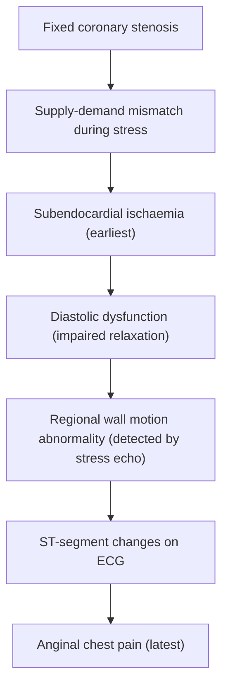

# Chronic Coronary Syndrome (CCS)

## 1. Definition

**Chronic Coronary Syndrome (CCS)** — formerly and still commonly called **Stable Ischaemic Heart Disease (SIHD)** or **Stable Angina** — is the clinical entity that arises when there is a chronic mismatch between myocardial oxygen **supply** and **demand**, most commonly due to a **fixed atherosclerotic stenosis** of one or more epicardial coronary arteries [1][2].

Let's break down the name:
- **"Chronic"** = a long-standing, stable process (as opposed to the acute plaque rupture/thrombosis of ACS)
- **"Coronary"** = relating to the coronary arteries (from Latin *corona* = crown, because these arteries encircle the heart like a crown)
- **"Syndrome"** = a collection of signs and symptoms that cluster together

The 2019 ESC Guidelines deliberately renamed "Stable CAD" to **"Chronic Coronary Syndromes"** (plural) to reflect the fact that this is not a single, static disease but rather a **dynamic continuum** of clinical scenarios that share the common pathophysiology of coronary atherosclerosis but differ in their risk profile and presentation [1].

> ***The hallmark is angina pectoris provoked by exertion or emotional stress and relieved by rest or sublingual nitrate, implying that ischaemia only occurs when myocardial oxygen demand increases beyond what the fixed stenosis can supply.*** [1][2]

<Callout title="Key Conceptual Distinction" type="idea">
Think of it this way: in **CCS**, the plaque is stable with a thick fibrous cap → the lumen is narrowed but the plaque doesn't rupture → symptoms only appear when demand rises (exercise). In **ACS**, the plaque ruptures or erodes → thrombus forms → supply drops acutely even at rest. Both sit on the same atherosclerotic spectrum.
</Callout>

### The Six Clinical Scenarios of CCS (ESC 2019)

The ESC 2019 guidelines define **six clinical scenarios** that fall under CCS [1]:

1. **Patients with suspected CAD and stable anginal symptoms and/or dyspnoea** — the "classic" presentation
2. **Patients with new onset of heart failure or LV dysfunction suspected to be due to CAD**
3. **Patients with stabilised symptoms < 1 year after an ACS or recent revascularisation**
4. **Patients > 1 year after initial diagnosis or revascularisation**
5. **Patients with angina and suspected vasospastic or microvascular disease**
6. **Asymptomatic individuals in whom CAD is detected at screening**

This is a paradigm shift from the old binary "stable vs unstable" model: a patient who had a STEMI 2 years ago and is now stable on optimal medical therapy is still classified under CCS scenario 4.

---

## 2. Epidemiology

### Global and Hong Kong Context

- **Coronary artery disease (CAD)** is the **leading cause of death worldwide** and remains one of the **top killers in Hong Kong** [2][3].
- In Hong Kong, **ischaemic heart disease** accounts for approximately **6,000–7,000 deaths per year**, representing roughly 10% of all deaths (Census and Statistics Department, HK).
- ***The prevalence of CAD increases sharply with age and is more common in males than females*** (though the gap narrows post-menopause as the protective effect of oestrogen is lost) [2].
- Among patients with known CAD, roughly **50% present initially with chronic stable angina** rather than an acute event.
- The ageing population in Hong Kong, combined with rising rates of diabetes mellitus, obesity, and sedentary lifestyles, means the burden of CCS is **increasing** [3].

### Key Epidemiological Points

| Parameter | Detail |
|---|---|
| **Prevalence of stable angina** | ~3–4% of the adult population in developed countries; higher in older age groups |
| **Male : Female ratio** | ~2:1 before age 65; approaches 1:1 after age 75 |
| **Annual mortality of stable angina** | 1–3% per year (depends on anatomy and LV function) |
| **Prognosis after diagnosis** | Much better than ACS if optimally managed; 5-year survival > 90% in low-risk patients |

---

## 3. Risk Factors

Risk factors for CCS are essentially risk factors for **atherosclerosis** — because coronary atherosclerosis is the underlying pathology in > 95% of cases.

### Non-Modifiable Risk Factors

| Factor | Mechanism / Explanation |
|---|---|
| ***Advanced age*** | Cumulative vascular endothelial injury and oxidative stress over decades; longer exposure to risk factors [2] |
| ***Male sex*** | Oestrogen is vasoprotective (promotes NO release, ↓LDL oxidation, anti-inflammatory); males lack this protection. Post-menopausal females lose this advantage |
| ***Family history of premature CVD*** (1st-degree male relative < 55y, female < 65y) | Genetic predisposition to endothelial dysfunction, lipid metabolism disorders (e.g., familial hypercholesterolaemia), prothrombotic states [2][3] |

### Modifiable Risk Factors

| Factor | Mechanism / Explanation |
|---|---|
| ***Cigarette smoking*** | Endothelial injury by free radicals, ↑LDL oxidation, ↓HDL, ↑platelet reactivity, ↑fibrinogen → accelerated atherosclerosis. Strong dose-response relationship. Risk drops significantly within 2–5 years of quitting [2][3][4] |
| ***Hypertension*** | ↑Shear stress on arterial endothelium → endothelial dysfunction → promotes entry of lipoproteins into intima → accelerates atheroma formation. Also promotes left ventricular hypertrophy (LVH) → ↑myocardial O₂ demand [2][3] |
| ***Dyslipidaemia*** (↑LDL-C, ↓HDL-C, ↑TG) | LDL particles penetrate damaged endothelium → oxidised → taken up by macrophages → foam cells → fatty streak → atheroma. HDL is protective (reverse cholesterol transport). ***Target LDL-C < 1.4 mmol/L in very high-risk patients (ESC 2019)*** [3][4] |
| ***Diabetes mellitus*** | Hyperglycaemia → advanced glycation end-products (AGEs) → endothelial dysfunction, ↑oxidative stress, ↑inflammation. Also a/w dyslipidaemia (↑TG, ↓HDL, small dense LDL particles), prothrombotic state. DM doubles the risk of CAD and is a **CHD risk equivalent** [2][3][4] |
| ***Abdominal obesity / metabolic syndrome*** | Central adiposity → release of free fatty acids + pro-inflammatory adipokines (TNF-α, IL-6) → insulin resistance → dyslipidaemia, HTN, hyperglycaemia. The metabolic syndrome is a clustering of these risk factors [3] |
| ***Physical inactivity*** | ↓AMPK activation → ↓glucose uptake, ↓fatty acid oxidation → contributes to obesity, insulin resistance, dyslipidaemia [3] |
| ***Chronic kidney disease (CKD)*** | Independent risk factor: ↑inflammatory state, uraemic toxins → endothelial dysfunction; ↑Ca × PO₄ product → medial vascular calcification; ↑prevalence of traditional risk factors [5] |

<Callout title="INTERHEART Study Mnemonic" type="idea">
The 9 modifiable risk factors for MI (from the landmark INTERHEART study) can be remembered as:
**"SHAD FACED"** — **S**moking, **H**ypertension, **A**bdominal obesity, **D**iabetes, **F**ruit/veg intake (lack of), **A**lcohol excess, **C**holesterol (ApoB/A ratio), **E**xercise (lack of), **D**epression/psychosocial factors.
These account for > 90% of the population-attributable risk of MI globally.
</Callout>

> ***Risk factors for CCS: modifiable — abdominal obesity, BP, cholesterol, cigarette smoking, diet, DM, lack of exercise. Non-modifiable — family Hx of CVD, male gender, advanced age.*** [2]

---

## 4. Anatomy and Function of the Coronary Arteries

Understanding coronary anatomy is essential because the **location of the stenosis determines which territory is ischaemic** and therefore which symptoms and ECG changes you will see.

### Coronary Arterial Supply

The heart is supplied by **two main coronary arteries** arising from the **aortic root** (specifically the sinuses of Valsalva):

| Artery | Major Branches | Territory Supplied |
|---|---|---|
| **Left Main Stem (LMS)** | Divides into **LAD** and **LCx** | Supplies ~75–80% of LV in left-dominant systems |
| **Left Anterior Descending (LAD)** | Diagonal branches, septal perforators | Anterior wall, anterior septum, apex of LV |
| **Left Circumflex (LCx)** | Obtuse marginal branches | Lateral wall, posterior wall (if left-dominant) |
| **Right Coronary Artery (RCA)** | Posterior descending artery (PDA), AV nodal branch | Inferior wall, posterior septum, RV, SA node (60%), AV node (80–90%) |

### Coronary Dominance

- **Right dominant** (~85%): PDA arises from RCA
- **Left dominant** (~8%): PDA arises from LCx
- **Co-dominant** (~7%): PDA from both

### Why LMS Disease is So Dangerous

***LMS disease is essentially equivalent to 3-vessel disease*** because occlusion cuts off supply to both LAD and LCx territories — that's ~80% of the left ventricle. This is why:
- ***Balloon dilation of LMS will result in occlusion of supply to 80% of heart and induce potentially fatal ventricular arrhythmia*** [2]
- LMS disease mandates **CABG** rather than PCI in most cases

### Coronary Physiology — The Supply-Demand Equation

This is the fundamental concept underlying all of CCS:

**Myocardial oxygen supply** is determined by:
1. **Coronary blood flow** (the dominant factor — the heart cannot increase O₂ extraction much because it already extracts ~70% of delivered O₂ at rest)
2. Oxygen-carrying capacity (Hb level, SaO₂)

**Myocardial oxygen demand** is determined by:
1. **Heart rate** (most important — ↑HR = ↑O₂ consumption + ↓diastolic filling time = ↓coronary perfusion time)
2. **Myocardial wall tension** (related to LV pressure and volume by Laplace's law; ↑afterload from HTN or AS = ↑wall stress = ↑O₂ demand)
3. **Contractility** (inotropic state)

> In CCS, the fixed stenosis means that **coronary blood flow cannot increase adequately during stress** → supply fails to meet the increased demand → ischaemia.

<Callout title="Why Does Coronary Blood Flow Occur Mainly in Diastole?">
Unlike every other organ, the heart receives most of its blood supply during **diastole**. This is because during systole, the contracting myocardium compresses the intramural coronary vessels (especially the subendocardium). This explains why:
- **Tachycardia** (shortened diastole) reduces coronary perfusion
- **Aortic stenosis** (prolonged systole, ↑LV pressure) impairs coronary flow
- The **subendocardium** is the most vulnerable to ischaemia (it gets squeezed the most and is furthest from the epicardial vessels)
</Callout>

---

## 5. Aetiology (with Hong Kong Focus) and Pathophysiology

### 5.1 Atherosclerosis — The Dominant Aetiology (> 95% of CCS)

The overwhelmingly dominant cause of CCS is **coronary atherosclerosis** [1][2][3].

#### Pathogenesis of Atherosclerosis: Step-by-Step

***The pathogenesis follows a well-characterised sequence from fatty streak → fibrous plaque → complicated plaque*** [6]:

**Step 1: Endothelial Injury/Dysfunction**
- Risk factors (smoking, HTN, hyperglycaemia, shear stress, oxidised LDL) damage the vascular endothelium
- Dysfunctional endothelium: ↓NO production, ↑adhesion molecule expression (VCAM-1, ICAM-1), ↑permeability to lipoproteins

**Step 2: Lipid Accumulation and Oxidation**
- LDL particles enter the intima through the permeable endothelium
- LDL is **oxidised** (oxLDL) in the subendothelial space → highly pro-inflammatory
- OxLDL is chemotactic for monocytes and toxic to endothelium → perpetuates the cycle

**Step 3: Inflammatory Cell Recruitment — Foam Cell Formation (Fatty Streak)**
- Monocytes adhere to endothelium → migrate into intima → differentiate into macrophages
- Macrophages engulf oxLDL via **scavenger receptors** (no negative feedback, unlike LDL receptors) → become **foam cells**
- Collection of foam cells = **fatty streak** (the earliest visible lesion, found even in teenagers)

***Fatty streak → foam cell (intracellular cholesterol) → free (extracellular) cholesterol → months-years of progression → fibrous cap → plaque formation*** [6]

**Step 4: Smooth Muscle Cell Migration and Fibrous Cap Formation**
- Growth factors (PDGF, TGF-β) from macrophages and endothelium stimulate **smooth muscle cell (SMC) migration** from media to intima
- SMCs proliferate and produce **extracellular matrix** (collagen, elastin) → forms the **fibrous cap** over the lipid core
- The mature plaque consists of: lipid/necrotic core + fibrous cap

**Step 5: Stable Plaque vs Vulnerable Plaque**

This is the critical fork in the road:

| Feature | **Stable Plaque** (→ CCS) | **Vulnerable Plaque** (→ ACS) |
|---|---|---|
| Fibrous cap | **Thick**, collagen-rich | Thin, inflammation-rich |
| Lipid core | Small | Large |
| Inflammation | Less | Abundant macrophages (degrade cap via MMPs) |
| Lumen | Progressive **fixed stenosis** | May have minimal stenosis until rupture |
| Clinical result | Effort angina (supply-demand mismatch) | Plaque rupture → thrombus → ACS |

> ***In CCS, the stable plaque causes a fixed stenosis. Ischaemia only occurs when demand increases because at rest, compensatory mechanisms (collateral circulation, coronary vasodilation) maintain adequate flow.*** [2]

**Step 6: Compensatory Remodelling (Glagov Phenomenon)**
- In early atherosclerosis, the artery undergoes **outward (positive) remodelling** — the vessel wall expands to accommodate the plaque so that the lumen size is preserved
- Symptoms don't appear until the stenosis reaches approximately **≥ 70% luminal diameter** (or ≥ 50% for LMS) — at this point, compensatory vasodilation is exhausted and flow becomes limited during stress

#### Haemodynamic Significance of Stenosis

- A stenosis of **< 50%** diameter is generally **not haemodynamically significant** — compensatory vasodilation maintains resting and stress flow [7]
- ***A haemodynamically significant stenosis is defined as ≥ 50% diameter stenosis*** (this is the threshold used in functional testing like myocardial perfusion imaging) [7]
- At **≥ 70%** diameter stenosis, resting flow is preserved but **stress flow is significantly impaired** → exercise-induced ischaemia
- At **≥ 90%** stenosis, even resting flow may be compromised → rest ischaemia possible

### 5.2 Non-Atherosclerotic Causes of CCS

While atherosclerosis dominates, always consider:

| Cause | Mechanism | Comment |
|---|---|---|
| **Coronary vasospasm (Prinzmetal/variant angina)** | Focal spasm of an epicardial coronary artery → transient severe stenosis/occlusion | Often at rest (classically early morning); a/w smoking; ST elevation during spasm |
| **Coronary microvascular disease (Syndrome X)** | Dysfunction of small coronary arteries (< 500 μm) → impaired microvascular vasodilation | More common in women; angina with ischaemic changes on stress testing but normal epicardial arteries on angiography |
| **Aortic stenosis (AS)** | ↑LV pressure → ↑wall stress → ↑O₂ demand; also ↓coronary perfusion pressure gradient | Angina is one of the cardinal symptoms of severe AS, even without coronary disease |
| **Hypertrophic cardiomyopathy (HCM/HOCM)** | ↑LV mass → ↑O₂ demand; ↑intramural pressure → ↓subendocardial perfusion; possible dynamic LVOT obstruction | Important cause of exertional chest pain in young patients |
| **Severe anaemia** | ↓O₂ carrying capacity → ↓myocardial O₂ supply | May unmask underlying subclinical CAD |
| **Thyrotoxicosis** | ↑HR + ↑contractility → ↑O₂ demand | May precipitate angina in patients with borderline coronary stenosis |

> ***Conditions that may exacerbate angina: anaemia, thyrotoxicosis*** [2]

### 5.3 Pathophysiology of Myocardial Ischaemia in CCS

The sequence is often called the **"Ischaemic Cascade"** and understanding it helps you understand why different tests detect ischaemia at different stages:

**Why the subendocardium is affected first:**
- Subendocardium has the highest wall stress (Laplace's law — greatest radius, thinnest wall)
- Subendocardial vessels are compressed most during systole
- Subendocardium has the longest diffusion distance from epicardial vessels
- Therefore: subendocardial ischaemia → ST depression (not ST elevation, which indicates transmural ischaemia)

***Pathophysiology: myocardial ischaemia → metabolite accumulation (lactate, adenosine, bradykinin, K⁺) → stimulation of cardiac sympathetic nerves → pain*** [2]

The pain of angina is **referred pain**: cardiac afferent fibres (sympathetic C fibres) enter the spinal cord at **T1–T5** alongside somatic afferents from the chest wall, arms, and jaw. The brain cannot distinguish the source → pain is perceived as coming from the chest, left arm, jaw, or shoulder.

<Callout title="Why is angina sometimes felt in the jaw or left arm?">
Cardiac sympathetic afferents and somatic afferents from the arm and jaw converge on the same dorsal horn neurons at T1–T5. This is the "convergence-projection" theory of referred pain. The brain misinterprets the signal as coming from the skin/muscle rather than the heart.
</Callout>

### 5.4 Coronary Steal Phenomenon (Relevant to Stress Testing)

***At rest, partial coronary stenosis limits blood flow to affected myocardium, but blood flow remains substantial due to collaterals and ischaemia-induced vasodilation. With stress, vessels supplying normal myocardium also dilate, blood is siphoned to normal myocardium ('steal') → ↓↓perfusion of affected myocardium → appears as 'cold spots' in perfusion scan.*** [7]

This is the physiological basis of pharmacological stress testing with **vasodilators** (adenosine, dipyridamole, regadenoson): they dilate normal coronary arteries but cannot dilate already-maximally-dilated vessels distal to stenoses → differential perfusion → detectable by SPECT or PET.

---

## 6. Classification

### 6.1 Classification of Angina (CCS Grading System)

The **Canadian Cardiovascular Society (CCS) Functional Classification** is used to grade the severity of stable angina:

| CCS Grade | Activity Triggering Angina | Example |
|---|---|---|
| **Class I** | Ordinary physical activity does NOT cause angina; angina only with **strenuous, rapid, or prolonged** exertion | Running, heavy lifting |
| **Class II** | **Slight limitation** of ordinary activity; angina with walking > 2 blocks or climbing > 1 flight of stairs at normal pace | Walking uphill, after meals, in cold, emotional stress |
| **Class III** | **Marked limitation** of ordinary activity; angina with walking 1–2 blocks or climbing 1 flight of stairs | Flat ground walking at normal pace |
| **Class IV** | **Unable to carry on any physical activity** without angina; angina may be present **at rest** | Minimal activity or rest |

> ***CCS Class III or IV = clinically severe angina → indication for invasive coronary angiography for risk stratification*** [2]

<Callout title="CCS vs NYHA" type="idea">
CCS grades angina severity. NYHA grades heart failure severity. Don't confuse them. CCS is about **chest pain**, NYHA is about **dyspnoea/fatigue**. However, both broadly indicate functional limitation.
</Callout>

### 6.2 Classification by Underlying Mechanism

| Type | Mechanism | Example |
|---|---|---|
| **Fixed epicardial stenosis** | Atherosclerotic plaque → demand-related ischaemia | Classic CCS |
| **Dynamic epicardial stenosis** | Coronary vasospasm ± atherosclerosis | Vasospastic angina (Prinzmetal) |
| **Microvascular dysfunction** | Impaired vasodilation of small coronary vessels | Microvascular angina (Syndrome X) |
| **Non-coronary supply-demand mismatch** | ↑Demand (AS, HOCM, HTN) or ↓Supply (anaemia, hypoxia) | Secondary angina |

### 6.3 ESC 2019 Clinical Scenarios of CCS (Reiterated)

As noted above, the ESC 2019 guidelines define **six clinical scenarios**. The most exam-relevant is **Scenario 1: patients with suspected CAD presenting with stable chest pain and/or dyspnoea** [1].

---

## 7. Clinical Features

### 7.1 Symptoms

#### A. Angina Pectoris — The Cardinal Symptom

***Angina pectoris: symptom complex arising from myocardial ischaemia*** [2]

The ESC defines **typical angina** as meeting all three criteria:
1. **Substernal chest discomfort** of characteristic quality and duration
2. **Provoked by exertion or emotional stress**
3. **Relieved by rest and/or sublingual nitrate within 5 minutes**

- **Atypical angina** = 2 of 3 criteria
- **Non-anginal chest pain** = ≤ 1 of 3 criteria

Let's unpack each feature using **OPQRST**:

| Feature | Typical Angina | Pathophysiological Basis |
|---|---|---|
| ***Onset / Provocation*** | ***Builds up gradually in proportion to intensity of exertion***; also provoked by emotional stress, cold exposure, heavy meals | Exertion → ↑HR, ↑BP, ↑contractility → ↑O₂ demand → demand exceeds supply at the fixed stenosis. Cold → sympathetic activation → coronary vasoconstriction + ↑afterload. Meals → ↑splanchnic blood flow → coronary steal |
| ***Quality*** | ***Typically dull, constricting, choking, 'heavy'. Described as squeezing, crushing, burning, aching or even as breathlessness. Patients often emphasise it is a discomfort not a pain. Levine's sign: characteristic gesture of a clenched fist on chest*** | Visceral pain from the heart is poorly localised and often described in vague terms; it is not sharp or stabbing (which would suggest somatic/parietal pain) |
| ***Region / Radiation*** | **Retrosternal** chest discomfort ± ***radiation to arms (especially left), shoulder, jaw, neck, epigastrium*** | Referred pain via cardiac sympathetic afferents entering spinal cord at T1–T5 (convergence-projection theory) |
| ***Severity*** | Variable, but consistently reproducible at a similar workload (the "angina threshold") | The stenosis is fixed → the workload at which demand exceeds supply is predictable |
| ***Timing / Duration*** | ***< 30 minutes*** (typically 2–10 minutes) | Stopping exertion → demand drops → supply catches up → ischaemia resolves → pain resolves. If > 30 min, think ACS |
| ***Termination*** | ***Relieved by rest or sublingual nitrate ≤ 5 minutes*** | Rest → ↓demand. GTN → coronary vasodilation + venodilation (↓preload) → ↓demand + ↑supply |

<Callout title="Important" type="error">
***Angina that is recent-onset, rapidly worsening (crescendo), or occurring at rest = UNSTABLE ANGINA → ACS until proven otherwise!*** Do not classify this as CCS. A change in pattern is an alarm sign that a previously stable plaque has become complicated.
</Callout>

#### B. Angina Equivalents

Some patients, particularly **elderly, diabetics, and women**, may not present with classic chest pain but instead with:

- **Dyspnoea on exertion** — ischaemia → diastolic dysfunction → ↑LVEDP → pulmonary congestion → SOB. ***In the ESC 2019 guidelines, dyspnoea is included alongside angina as a presenting symptom of suspected CCS*** [1]
- **Fatigue / reduced exercise tolerance** — global ischaemia → ↓CO on exertion
- **Epigastric discomfort** — inferior ischaemia may mimic GI symptoms
- **Nausea, diaphoresis** — autonomic activation from ischaemia

> ***Why do diabetics often have atypical presentations?*** Autonomic neuropathy from long-standing DM damages the cardiac sympathetic afferents → impaired pain perception → "silent ischaemia."

#### C. What Angina is NOT

Features that argue **against** angina:
- **Sharp, stabbing, knife-like** pain → pleuritic, musculoskeletal
- **Pain that is fleeting** (< 1 second) or very prolonged (hours/days without enzyme rise) → not ischaemic
- **Pain reproduced by palpation** → chest wall / musculoskeletal
- **Pain worse with inspiration** → pleuritic (PE, pneumothorax, pleurisy)
- ***Sudden onset, maximal at onset → aortic dissection, pneumothorax, massive PE*** [2]
- ***Pain after exertion → musculoskeletal, psychogenic*** [2]

### 7.2 Signs

***Physical examination in CCS is frequently unremarkable*** — and that itself is a teaching point. The stable plaque causes no detectable physical signs unless there is underlying structural heart disease, LV dysfunction, or generalised atherosclerosis [2].

However, a systematic examination may reveal:

#### A. Signs of Cardiovascular Risk Factors

| Sign | What It Tells You | Mechanism |
|---|---|---|
| **Xanthelasma** (yellowish plaques around eyes) | Dyslipidaemia (but may be non-specific in older patients) | Lipid deposition in skin |
| **Corneal arcus** (grey-white ring at corneal periphery) | Dyslipidaemia (especially if < 50 years) | Lipid deposition in corneal stroma |
| **Tendon xanthomas** (Achilles, extensor tendons of hands) | Familial hypercholesterolaemia | Cholesterol deposition in tendons — **pathognomonic for FH** |
| **Eruptive xanthomas** | Severe hypertriglyceridaemia | TG-rich lipoproteins deposited in skin |
| **Acanthosis nigricans** | Insulin resistance / metabolic syndrome | Insulin/IGF-1 stimulation of keratinocyte proliferation |
| **↑BMI / central obesity** | Metabolic syndrome | Adiposity → insulin resistance |
| **Nicotine staining of fingers** | Active smoking | Direct evidence |

#### B. Signs of Underlying Heart Disease

| Sign | What It Tells You | Mechanism |
|---|---|---|
| ***Cardiac murmurs*** | ***May be due to valvular heart disease or HOCM*** — conditions that cause secondary angina [2] | AS murmur (ejection systolic) → ↑afterload → ↑O₂ demand; AR murmur → ↓diastolic BP → ↓coronary perfusion |
| ***Dyskinetic apex beat*** | ***LV dysfunction*** — suggests previous MI with LV remodelling [2] | Scarred/thinned myocardium → paradoxical outward movement during systole |
| ***Gallop rhythm (S3 or S4)*** | ***LV dysfunction or impaired compliance*** [2] | S3 = rapid ventricular filling into dilated LV (systolic dysfunction). S4 = atrial contraction against stiff, non-compliant LV (diastolic dysfunction, LVH) |
| **Displaced apex beat** | LV dilatation from chronic ischaemic cardiomyopathy | Chronic ischaemia → myocardial fibrosis → LV remodelling/dilatation |

#### C. Signs of Generalised Atherosclerotic Disease

| Sign | What It Tells You | Mechanism |
|---|---|---|
| ***Carotid bruit*** | ***Carotid artery stenosis — indicates generalised atherosclerosis*** [2] | Turbulent flow through narrowed carotid → audible bruit. These patients have a high likelihood of concomitant CAD |
| ***Signs of peripheral vascular disease (PVD)*** | ***Generalised atherosclerosis*** [2] | Absent or diminished peripheral pulses, skin changes (hair loss, shiny skin, ulceration), intermittent claudication on history |
| **Abdominal aortic aneurysm** (pulsatile expansile mass) | Atherosclerotic aortic disease | Atherosclerosis weakens aortic wall → aneurysmal dilatation |

> ***"Presence of all peripheral pulses" should be documented*** [2] — this is both a positive finding (reassuring) and a reminder to check.

#### D. Signs of Conditions That May Exacerbate Angina

| Sign | Condition | Why It Worsens Angina |
|---|---|---|
| **Pallor, tachycardia, flow murmur** | ***Anaemia*** [2] | ↓O₂ carrying capacity → ↓myocardial O₂ supply |
| **Tremor, tachycardia, goitre, lid lag** | ***Thyrotoxicosis*** [2] | ↑metabolic rate → ↑HR → ↑contractility → ↑O₂ demand |
| **Hypertension (↑BP on measurement)** | HTN | ↑Afterload → ↑wall stress → ↑O₂ demand |

<Callout title="Clinical Pearl">
***Always check for precipitating/exacerbating factors in a patient with angina.*** If you find and treat severe anaemia or thyrotoxicosis, the angina may resolve without any coronary intervention. This is an easy win that examiners love to test.
</Callout>

### 7.3 ECG Findings in CCS

The **resting 12-lead ECG** may be:

- ***Normal in up to 50% of patients with CCS*** — a normal resting ECG does NOT exclude CAD
- **ST depression** (horizontal or downsloping) — suggests subendocardial ischaemia
- **T-wave inversion** — may indicate ischaemia or old infarction
- **Pathological Q waves** — evidence of **previous MI** (transmural necrosis → loss of electrical forces)
- **LBBB** — may mask ischaemic ECG changes; new LBBB may indicate extensive LAD disease
- **LVH** — suggests long-standing HTN → ↑O₂ demand

> ***Evidence of ischaemia or previous MI: pathological Q, LBBB, ST/T changes. Other evidence of cardiac disease: LVH, pre-excitation, arrhythmias, AF.*** [2]

### 7.4 Pre-Test Probability of CAD — The Clinical Likelihood Model (ESC 2019)

***The ESC 2019 guidelines use a clinical likelihood model*** (updated from the old Diamond-Forrester model which overestimated PTP) to estimate the probability of obstructive CAD based on: [1]

**Factors that DECREASE clinical likelihood:**
- ***Normal exercise ECG***
- ***Absence of coronary calcium (Agatston score = 0)***

**Factors that INCREASE clinical likelihood:**
- ***Risk factors for CVD (dyslipidaemia, diabetes, hypertension, smoking, family history)***
- ***Changes on resting ECG (Q-waves, ST-segment/T-wave changes)***
- ***LV dysfunction suggestive of CAD***
- ***Abnormal exercise ECG***
- ***Coronary calcium on CT***

***In addition to the classic Diamond and Forrester classes, patients with dyspnoea only or dyspnoea as the primary symptom are included.*** [1]

| Pre-Test Probability | Interpretation | Next Step |
|---|---|---|
| **< 5%** (very low) | CAD can generally be excluded | No further testing needed |
| **5–15%** (low) | Consider testing only if clinical features suggest CAD | Consider CT coronary angiography or functional testing |
| **15–85%** (intermediate) | ***Offer diagnostic testing*** | CTCA or functional ischaemia testing |
| **> 85%** (very high) | ***CAD can be assumed*** | May proceed directly to invasive coronary angiography |

---

## 8. Important Pathophysiological Concepts — Synthesis

### The "Stable Plaque" Model

```mermaid
graph LR
    A["Risk factors (smoking, HTN, DM, dyslipidaemia)"] --> B["Endothelial dysfunction"]
    B --> C["LDL entry + oxidation"]
    C --> D["Foam cell formation (fatty streak)"]
    D --> E["SMC migration + fibrous cap"]
    E --> F["Stable atheroma with thick cap"]
    F --> G["Fixed luminal stenosis (>70%)"]
    G --> H["Supply-demand mismatch on exertion"]
    H --> I["Angina pectoris"]
```

### Why Angina is Predictable in CCS

Because the stenosis is **fixed**, the workload at which demand exceeds supply is **reproducible**. Patients can often tell you "I get the pain after walking 3 blocks uphill" — this is the **angina threshold**. The threshold drops in cold weather (↑afterload from vasoconstriction), after meals (coronary steal to splanchnic circulation), and with emotional stress (↑sympathetic drive → ↑HR, ↑BP).

### Why Rest Relieves Angina

Stopping exercise → ↓HR, ↓BP, ↓contractility → ↓myocardial O₂ demand → demand falls below the supply threshold → ischaemia resolves → metabolite washout → pain stops (typically within 5 minutes).

### Why GTN Relieves Angina

Glyceryl trinitrate (GTN, sublingual nitrate):
- **Venodilation** (dominant effect at low doses) → ↓preload → ↓LVEDV → ↓wall stress → ↓O₂ demand
- **Coronary vasodilation** → ↑supply (especially to ischaemic zones via collateral recruitment)
- **Arteriolar dilation** (at higher doses) → ↓afterload → ↓O₂ demand
- Net effect: relief of ischaemia within 1–3 minutes

---

<Callout title="High Yield Summary">

**Definition:** CCS (formerly stable angina/SIHD) = chronic supply-demand mismatch, most commonly due to fixed coronary atherosclerotic stenosis. ESC 2019 recognises 6 clinical scenarios.

**Epidemiology:** Leading cause of death globally and in HK. More common in males, incidence rises with age.

**Risk Factors:** Non-modifiable (age, male sex, family Hx). Modifiable (smoking, HTN, DM, dyslipidaemia, obesity, physical inactivity). Remember INTERHEART "SHAD FACED."

**Pathophysiology:** Atherosclerosis → stable plaque with thick fibrous cap → fixed stenosis → ischaemia on exertion. Haemodynamically significant = ≥50% diameter stenosis. Symptomatic typically at ≥70%.

**Ischaemic cascade:** Subendocardial ischaemia → diastolic dysfunction → RWMA → ST changes → anginal pain (pain is the LAST thing to appear).

**Angina pectoris:** Retrosternal, dull/constricting, < 30 min, provoked by exertion/emotion, relieved by rest/GTN within 5 min. Radiation to arms/jaw/neck. Levine's sign.

**Examination:** Often normal! Look for: risk factor signs (xanthomas, arcus, obesity), cardiac disease (murmurs, gallop, displaced apex), generalised atherosclerosis (carotid bruit, PVD), and exacerbating conditions (anaemia, thyrotoxicosis).

**Clinical likelihood (ESC 2019):** Updated PTP model incorporating risk factors, resting ECG changes, coronary calcium, exercise ECG → guides whether testing is needed and which test to choose.

</Callout>

---

<ActiveRecallQuiz
  title="Active Recall - Chronic Coronary Syndrome (Definition to Clinical Features)"
  items={[
    {
      question: "Name three criteria that define typical angina pectoris according to ESC guidelines.",
      markscheme: "(1) Substernal chest discomfort of characteristic quality and duration, (2) Provoked by exertion or emotional stress, (3) Relieved by rest or sublingual nitrate within 5 minutes. Atypical angina meets 2 of 3; non-anginal meets 1 or less.",
    },
    {
      question: "Explain the ischaemic cascade in order from earliest to latest abnormality.",
      markscheme: "Subendocardial ischaemia (earliest) -> diastolic dysfunction (impaired relaxation) -> regional wall motion abnormality (detected on stress echo) -> ST-segment changes on ECG -> anginal chest pain (latest). Pain is the last manifestation.",
    },
    {
      question: "Why is the subendocardium the most vulnerable zone to ischaemia?",
      markscheme: "Three reasons: (1) Highest wall stress by Laplace law, (2) Intramural vessels compressed most during systole, (3) Longest diffusion distance from epicardial coronary arteries. This is why ischaemia manifests as ST depression (subendocardial) rather than ST elevation (transmural).",
    },
    {
      question: "A patient with stable angina is found to have severe anaemia (Hb 6 g/dL). Explain why correcting the anaemia may resolve the angina without coronary intervention.",
      markscheme: "Anaemia reduces O2-carrying capacity of blood, decreasing myocardial O2 supply. In the setting of a borderline coronary stenosis, the reduced supply tips the supply-demand balance into ischaemia. Correcting anaemia restores O2 delivery, eliminating the mismatch, and angina resolves. This is why checking for exacerbating factors (anaemia, thyrotoxicosis) is essential.",
    },
    {
      question: "Describe the coronary steal phenomenon and explain why it is used as the basis for pharmacological stress testing.",
      markscheme: "At rest, vessels distal to stenosis are maximally vasodilated. Pharmacological vasodilators (adenosine/dipyridamole) dilate normal coronary vessels but cannot further dilate already-maximally-dilated vessels distal to stenosis. Blood is therefore 'stolen' from the ischaemic territory to normally perfused territory, creating a differential perfusion defect visible as 'cold spots' on SPECT/PET imaging.",
    },
    {
      question: "List four physical examination findings you would specifically look for in a patient with suspected CCS and explain the significance of each.",
      markscheme: "Any 4 of: (1) Xanthomas/arcus - dyslipidaemia/FH (risk factor), (2) Cardiac murmur - AS or HOCM causing secondary angina, (3) Carotid bruit - generalised atherosclerosis, (4) Absent peripheral pulses / PVD signs - generalised atherosclerosis, (5) Gallop rhythm / displaced apex - LV dysfunction from prior MI, (6) Pallor/signs of anaemia - exacerbating factor, (7) Signs of thyrotoxicosis - exacerbating factor.",
    },
  ]}
/>

---

## References

[1] Lecture slides: GC 032. Chest pain on exertion_ischaemic heart disease; angina pectoris.pdf (ESC 2019 CCS Guidelines, Pre-test probability, Diagnostic approach, GDMT)
[2] Senior notes: Ryan Ho Cardiology.pdf (p54–57, p115–126: Angina pectoris, Stable IHD, Risk factors, Clinical approach, Management)
[3] Senior notes: Ryan Ho Endocrine.pdf (p77, p117, p123–131: Metabolic syndrome, Obesity, Dyslipidaemia, CVD risk assessment)
[4] Senior notes: Ryan Ho Chemical Path.pdf (p46: Lipid profile, Fredrickson classification)
[5] Senior notes: Ryan Ho Urogenital.pdf (p109: CKD as CVD risk factor)
[6] Lecture slides: GC 028. Accelerating chest pain_Acute coronary (1).pdf (p10: Atherosclerosis progression, fatty streak to thrombus)
[7] Senior notes: Ryan Ho Diagnostic Radiology.pdf (p57: Myocardial perfusion imaging, haemodynamically significant stenosis, coronary steal)
