## Management of Chronic Coronary Syndrome

### Conceptual Framework — The Three Pillars of CCS Management

Management of CCS rests on **three pillars**, and it is critical to understand *why* each pillar exists [2]:

1. **Lifestyle modification and risk factor control** → Slow/halt atherosclerotic progression (addresses the root cause)
2. **Pharmacological therapy** → Divided into:
   - **Prognostic drugs** (reduce MI and death) → antiplatelet, statin, ± ACEI/ARB
   - **Anti-anginal drugs** (relieve symptoms) → β-blockers, CCBs, nitrates, and second-line agents
3. **Revascularisation** (PCI or CABG) → Restore blood flow to ischaemic myocardium when medical therapy is insufficient

***General approach: (1) General measures to modify risk factors, (2) Pharmacological therapy: divided into prognostic and symptomatic, (3) Revascularization by PCI or CABG*** [2]

The key insight: **OMT (optimal medical therapy) is the foundation for ALL patients with CCS**, regardless of whether they undergo revascularisation. Revascularisation is **added on top of** OMT — it never replaces it.

---

### Master Management Algorithm — Mermaid Diagram

```mermaid
graph TD
    A["Confirmed CCS"] --> B["ALL patients: Lifestyle + Risk Factor Modification"]
    B --> C["ALL patients: Prognostic pharmacotherapy"]
    C --> C1["Aspirin 75-100 mg daily"]
    C --> C2["Statin - high intensity"]
    C --> C3["ACEI/ARB if HTN, DM, HF, or CKD"]
    
    B --> D["ALL symptomatic patients: Anti-anginal therapy"]
    D --> D1["Step 1: Beta-blocker OR rate-limiting CCB"]
    D1 --> D2{"Symptoms controlled?"}
    D2 -->|Yes| D3["Continue current therapy"]
    D2 -->|No| D4["Step 2: Combine BB + DHP-CCB or add long-acting nitrate"]
    D4 --> D5{"Symptoms controlled?"}
    D5 -->|Yes| D6["Continue combination"]
    D5 -->|No| D7["Step 3: Add 2nd-line agent or consider revascularisation"]
    D7 --> D8["Nicorandil / Ivabradine / Ranolazine / Trimetazidine"]
    
    A --> E["Risk Stratification"]
    E --> F{"Annual mortality risk?"}
    F -->|"High risk (>=3%/yr)"| G["OMT + ICA +/- Revascularisation"]
    F -->|"Intermediate (1-3%/yr)"| H["OMT + consider ICA"]
    F -->|"Low risk (<1%/yr)"| I["OMT alone"]
    
    G --> J{"Revascularisation decision"}
    J --> K{"Heart Team assessment"}
    K --> L["PCI favoured"]
    K --> M["CABG favoured"]
    
    L --> N["Simple anatomy: 1-2VD, no proximal LAD, high surgical risk"]
    M --> O["Complex anatomy: 3VD, LMS, DM, LVEF < 40%"]
```

***Persistent symptoms despite adequate trial of guideline-directed medical therapy (GDMT) → consider revascularisation to improve symptoms*** [1]

---

### PILLAR 1: Lifestyle Modification and Risk Factor Control

This is the unglamorous but most impactful part of management. Every patient with CCS must receive this, and you should be able to explain *why* each recommendation matters.

***General measures: lifestyle — stop smoking, regular exercise (but not beyond point of discomfort). Treat precipitating factors: thyrotoxicosis, anaemia. Manage risk factors.*** [2]

#### A. Smoking Cessation

- **Why:** Smoking is the single most modifiable risk factor. Endothelial injury from free radicals, ↑LDL oxidation, ↑platelet reactivity, ↑fibrinogen → accelerated atherosclerosis. Quitting reduces CVD risk by ~50% within 1 year and approaches that of a non-smoker by 5 years.
- **How:** Behavioural counselling + pharmacotherapy (nicotine replacement therapy, varenicline, bupropion)

#### B. Exercise and Weight Management

- **Why:** Regular aerobic exercise → ↑HDL, ↓LDL, ↓BP, ↓insulin resistance, ↑coronary collateral development, ↑endothelial NO production.
- **How:** Moderate-intensity aerobic exercise ≥ 150 min/week (e.g. brisk walking), ***but not beyond point of discomfort*** [2]. Cardiac rehabilitation programmes are beneficial post-revascularisation.
- ***BMI ≥ 35 kg/m² = obesity → consider referral to weight centre/bariatric surgery*** [1]

#### C. Blood Pressure Control

***HTN: aim < 130/80 mmHg (2017 AHA/ACC guideline); favour BB or ACEI/ARB if indicated*** [1][2]

- **Why:** ↑BP → ↑shear stress → endothelial dysfunction → accelerated atherosclerosis; also ↑afterload → ↑LV wall stress → ↑O₂ demand → worsens angina.
- BB is particularly useful because it also provides anti-anginal benefit (see below).
- ACEI/ARB preferred if concomitant DM, HF, or CKD (renoprotective + cardioprotective).

#### D. Lipid Management

***Lipids: ↓LDL to < 1.8 mmol/L with lifestyle and drug*** [2]

***Statins are recommended in all patients. The aim is to reduce LDL-C by ≥ 50% from baseline and to achieve LDL-C < 1.4 mmol/L (< 55 mg/dL) for very high-risk patients*** [1][15]

***If the LDL-C goal is not achieved after 4–6 weeks with the maximally tolerated statin dose, combination with ezetimibe is recommended*** [15]

***If the LDL-C goal is not achieved after 4–6 weeks despite maximally tolerated statin therapy and ezetimibe, the addition of a PCSK9 inhibitor is recommended*** [15]

The lipid-lowering escalation ladder:
1. **High-intensity statin** (1st line): atorvastatin 40–80 mg or rosuvastatin 20–40 mg [3]
2. **Ezetimibe** (2nd line): if LDL-C target not met → add ezetimibe 10 mg daily
3. **PCSK9 inhibitor** (3rd line): evolocumab or alirocumab SC injection if still not at target

| Statin | High Intensity (≥ 50% ↓LDL) | Moderate Intensity (30-49% ↓LDL) | Low Intensity ( < 30% ↓LDL) |
|---|---|---|---|
| Simvastatin | (80 mg — rarely used due to myopathy risk) | 20–80 mg | 10 mg |
| ***Atorvastatin*** | ***40 mg*** | 10–40 mg | — |
| ***Rosuvastatin*** | ***40 mg*** | 10–40 mg | — |

#### E. Diabetes Management

***DM: aim A1c < 7%, consider SGLT2i or GLP-1 agonist*** [2]

- **Why SGLT2i and GLP-1 agonists specifically?** These have proven **cardiovascular outcome benefits** beyond glycaemic control — they reduce MACE (major adverse cardiovascular events), HF hospitalisation, and renal progression, independent of their glucose-lowering effect [3].
- ***For patients with established ASCVD: prefer GLP-1 RA with proven CVD benefit or SGLT2i with proven CVD benefit*** [3]

#### F. Other Risk Factor Targets

***Guideline-directed medical therapy for stable ischaemic heart disease includes education and behaviour change, lipid management, blood pressure control, thrombotic risk management, blood glucose management, obesity management, and sleep apnoea screening*** [1]

- ***Consider CPAP for sleep apnoea*** [1]
- Dietary counselling: Mediterranean diet (rich in omega-3 fatty acids, fruits, vegetables, whole grains)

---

### PILLAR 2: Pharmacological Therapy

#### Part A: Prognostic Drugs (Reduce MI and Death)

These are prescribed to **all patients** with confirmed CCS regardless of symptoms.

##### 1. Antiplatelet Therapy

***Aspirin is recommended for all patients without contraindications at a dose of 75–100 mg daily*** [2][15][16]

| Drug | Mechanism | Dose | Indications | Contraindications |
|---|---|---|---|---|
| ***Aspirin*** | Irreversibly inhibits COX-1 → ↓TXA₂ → ↓platelet aggregation | ***75–100 mg daily*** (low dose) | ***All patients with CAD indefinitely*** [2] | Active GI bleeding, aspirin allergy, severe asthma (aspirin-exacerbated respiratory disease) |
| ***Clopidogrel (Plavix)*** | Irreversibly blocks P2Y₁₂ ADP receptor → ↓platelet activation | ***75 mg daily*** | ***Equally/more effective; used as alternative to aspirin if intolerant*** [2] | Active bleeding, severe hepatic impairment |

***Clopidogrel 75 mg daily when aspirin is not tolerated because of hypersensitivity or GI intolerance*** [15][16]

**Why not dual antiplatelet therapy (DAPT) in stable CCS?**
***Combination therapy: standard of care post-ACS/PCI, but not associated with benefit in stable CAD*** [2] — in stable disease, the risk of bleeding from DAPT outweighs the benefit of additional platelet inhibition because the plaque is stable and not actively thrombosing.

**Exception — Extended antithrombotic strategies:**
***Consider rivaroxaban 2.5 mg BID*** [1] in addition to aspirin in selected high-risk patients with polyvascular disease (COMPASS trial) — this "vascular dose" of rivaroxaban ↓MACE at the cost of modest ↑ bleeding.

***Consider extended treatment with P2Y₁₂ inhibitor*** [1] in patients who are beyond 12 months post-ACS if they remain at high ischaemic risk and low bleeding risk.

##### 2. Lipid-Lowering Therapy (Statins and Beyond)

***Statins: recommended in all patients*** [2]

**Mechanism of statins ("statin" from *static* = to stop [cholesterol synthesis]):**
- **Primary:** Inhibit HMG-CoA reductase → ↓intracellular cholesterol synthesis in hepatocytes → compensatory ↑LDL receptor expression on hepatocyte surface → ↑clearance of LDL-C from blood → ↓plasma LDL-C [3]
- **Pleiotropic effects:** ***plaque stabilisation, ↓inflammation, reversal of endothelial dysfunction, ↓thrombogenicity*** [3] — these effects are at least as important as the cholesterol-lowering in CCS

| Agent | Mechanism | Key Points |
|---|---|---|
| **Statin** | HMG-CoA reductase inhibitor | 1st line; high-intensity preferred; monitor LFTs, CK if myopathy symptoms |
| **Ezetimibe** | Blocks NPC1L1 cholesterol transporter in intestinal brush border → ↓cholesterol absorption | 2nd line add-on; 10 mg daily; well-tolerated |
| **PCSK9 inhibitor** (evolocumab, alirocumab) | Monoclonal antibody against PCSK9 → prevents degradation of LDL receptors → ↑LDL-C clearance | 3rd line; SC injection Q2–4 weeks; expensive; ↓LDL-C by additional ~60% |
| **Icosapent ethyl** | ***Consider icosapent ethyl*** [1] — purified EPA → ↓TG and anti-inflammatory; REDUCE-IT trial showed ↓MACE in patients on statin with persistent ↑TG ≥ 1.5 mmol/L | Add-on for residual hypertriglyceridaemia |
| **Fibrate** | PPARα agonist → ↑lipoprotein lipase → ↓TG, modest ↑HDL | Consider when TG > 5.7 mmol/L (pancreatitis prevention) [3] |

**Statin side effects:**
- ***Myopathy: ranges from myalgia, myopathy, myositis to rhabdomyolysis*** [3]
- ***Risk factors: lipophilic statins (e.g. simvastatin), hypothyroidism, CYP3A4 inhibitors*** [3]
- ***Diagnosis: clinical + biochemical (↑CK) evidence of muscle injury with compatible temporal pattern*** [3]
- ***Management: stop statin if severe; switch to pravastatin, fluvastatin, or pitavastatin if mild*** [3]
- Hepatotoxicity: transient ↑ALT (usually < 3× ULN and clinically insignificant); monitor LFTs
- New-onset DM: modest ↑ risk, but cardiovascular benefit far outweighs this

<Callout title="Statin Intolerance — Common Exam Scenario" type="error">
True statin intolerance (rhabdomyolysis, severe myositis with CK > 10× ULN) is rare ( < 1%). Many patients report subjective myalgia (nocebo effect). Approach: (1) Re-challenge with the same or different statin, (2) Try alternate-day dosing of long half-life statins (rosuvastatin, atorvastatin), (3) If truly intolerant → ezetimibe monotherapy → add PCSK9 inhibitor if needed. Never simply stop all lipid-lowering therapy.
</Callout>

##### 3. ACEI / ARB

***ACEI/ARB: evidence unclear in stable CAD alone without comorbidities*** [2]

***Indications: when comorbidities are present, e.g. DM, HTN, LV HF where otherwise indicated*** [2]

| Drug Class | Mechanism | Indications in CCS | Key Points |
|---|---|---|---|
| **ACEI** (ramipril, perindopril) | Inhibits ACE → ↓Ang II → ↓vasoconstriction, ↓aldosterone → ↓preload/afterload; also ↑bradykinin → vasodilation + anti-remodelling | ***HTN, DM, LVEF < 40%, CKD, post-MI*** | First choice; proven mortality benefit in high-risk CAD (HOPE, EUROPA trials) |
| **ARB** (valsartan, losartan) | Blocks AT1 receptor → similar haemodynamic effects to ACEI | Alternative if ACEI-intolerant (cough, angioedema) | ***Use: either one is used (combination a/w ↑adverse events without ↑benefits)*** [2] |

**Why ACEI/ARB in CCS with comorbidities?**
- ↓Afterload → ↓LV wall stress → ↓O₂ demand
- Prevent adverse LV remodelling post-MI (↓fibrosis, ↓hypertrophy)
- Anti-atherosclerotic effects: ↓endothelial dysfunction, ↓oxidative stress
- Renoprotection in DM/CKD (↓intraglomerular pressure)

**Contraindications:** Bilateral renal artery stenosis, hyperkalaemia (K⁺ > 5.5), pregnancy, history of angioedema (for ACEI)

---

#### Part B: Anti-Anginal Drugs (Relieve Symptoms)

The goal of anti-anginal therapy is to **restore the supply-demand balance** by either:
- ↓O₂ demand (↓HR, ↓contractility, ↓preload, ↓afterload), or
- ↑O₂ supply (coronary vasodilation, redistribution of flow)

##### Step 1: First-Line Anti-Anginal Agents

###### A. Beta-Blockers (BB)

**Mechanism:** Block β₁-adrenoreceptors on the heart → ↓HR + ↓contractility + ↓BP → all three determinants of O₂ demand are reduced. The ↓HR also prolongs diastole → ↑coronary filling time → ↑supply. This is why BB is uniquely effective in CCS — it attacks the problem from both sides.

***Beta-blockers unless contraindicated*** [16]

| Drug | Cardioselectivity | Key Features |
|---|---|---|
| **Metoprolol** | β₁-selective | Most commonly used; can titrate to HR 55–60 bpm |
| **Bisoprolol** | β₁-selective | Long-acting, once daily, excellent tolerability |
| **Atenolol** | β₁-selective | ***Not atenolol*** (per AHA/ACC slide) [1] — due to inferior outcomes vs other BBs in trials |
| **Carvedilol** | Non-selective (β₁ + β₂ + α₁) | Preferred in HFrEF; additional vasodilation from α₁-blockade |
| **Nebivolol** | β₁-selective + NO-mediated vasodilation | Third-generation; additional vasodilatory effect |

**Target:** Resting HR 55–60 bpm (this is where the anti-anginal effect is maximised without excessive bradycardia)

**Contraindications:**
- **Absolute:** Severe bradycardia (HR < 50), 2nd/3rd degree AV block (without pacemaker), decompensated acute HF, severe hypotension
- **Relative:** Asthma (risk of bronchospasm — β₂ blockade; can cautiously use β₁-selective agents in mild asthma/COPD), Prinzmetal angina (unopposed α-mediated coronary vasoconstriction), peripheral vascular disease with critical ischaemia

###### B. Calcium Channel Blockers (CCBs)

There are two main classes, and understanding the difference is essential:

| Subclass | Examples | Mechanism | Main Effect | Heart Rate |
|---|---|---|---|---|
| **Rate-limiting (non-DHP)** | ***Diltiazem, Verapamil*** | Block L-type Ca²⁺ channels in cardiac myocytes and SA/AV nodes | ↓HR, ↓contractility, ↓conduction, mild vasodilation | ↓ |
| **Dihydropyridine (DHP)** | Amlodipine, Nifedipine, Felodipine | Block L-type Ca²⁺ channels in vascular smooth muscle | Potent arterial vasodilation → ↓afterload + coronary vasodilation | ↑ (reflex tachycardia) |

***Calcium antagonists (diltiazem or verapamil) if contraindications to beta-blockers and no heart failure*** [16]

**When to use which CCB:**
- **Rate-limiting CCBs** (diltiazem/verapamil): alternative first-line when BB is contraindicated (e.g. asthma). **Do NOT combine** with BB — additive negative chronotropy/inotropy → risk of severe bradycardia, AV block, or HF.
- **DHP CCBs** (amlodipine): CAN be combined with BB — the reflex tachycardia from DHP is counteracted by BB's negative chronotropy, producing excellent anti-anginal synergy.

***Consider amlodipine if additional blood pressure therapy needed*** [1]

**Contraindications:**
- **Verapamil/Diltiazem:** Severe LV systolic dysfunction (HFrEF), severe bradycardia, 2nd/3rd degree AV block, concurrent BB (risk of complete heart block)
- **DHP (short-acting nifedipine):** Avoid in unstable angina/ACS — reflex tachycardia can worsen ischaemia (long-acting formulations are safe)

<Callout title="The BB + CCB Combination Rule" type="error">
**BB + DHP-CCB (e.g. bisoprolol + amlodipine) = SAFE and SYNERGISTIC** — excellent combination for refractory angina.
**BB + non-DHP CCB (e.g. bisoprolol + verapamil) = DANGEROUS** — both slow the heart → risk of severe bradycardia, heart block, cardiogenic shock. This is a classic exam pitfall.
</Callout>

##### Step 1 Summary: First-Line Choice

| Clinical Scenario | Preferred 1st Line | Why |
|---|---|---|
| **CCS, no contraindication** | BB (metoprolol/bisoprolol) | ↓HR, ↓contractility, ↓BP; post-MI mortality benefit |
| **CCS + asthma** | Rate-limiting CCB (diltiazem) or DHP-CCB (amlodipine) | BB contraindicated (bronchospasm risk) |
| **CCS + Prinzmetal angina** | DHP-CCB (amlodipine) | Need coronary vasodilation; BB may worsen vasospasm |
| **CCS + HFrEF** | BB (bisoprolol/carvedilol/metoprolol succinate) | Mortality benefit in HFrEF; avoid verapamil/diltiazem |
| **CCS + severe bradycardia** | DHP-CCB (amlodipine) | No negative chronotropic effect |

##### Step 2: Add Second Agent if Still Symptomatic

If monotherapy (BB or CCB alone) is insufficient:
- **BB + DHP-CCB** (e.g. bisoprolol + amlodipine) — the most common and effective combination
- **BB or CCB + long-acting nitrate**

###### C. Nitrates

***Nitrates (long-acting or short-acting as prn) in the presence of angina*** [16]

**Mechanism:** ***Arteriovenous dilatation by release of NO → ↑supply by (1) dilating coronary arteries (2) redistributing perfusion from epicardial to endocardial sites → ↓demand by (1) venodilation (major) → ↓preload (2) arteriodilation (modest) → ↓afterload*** [2]

| Formulation | Use | Dose | Key Points |
|---|---|---|---|
| **Sublingual GTN** | ***For ALL patients with symptomatic stable CAD — acute relief*** [2] | ***0.3–0.6 mg Q5min, max 1.2 mg within 15 min*** [2] | ***Should rest sitting while taking (standing → syncope; supine → ↑VR → ↑preload)*** [2] |
| **GTN spray** | Acute relief (acts quicker than SL tab) | ***Up to 3 sprays in 15 min*** [2] | More convenient, longer shelf-life than SL tablets |
| **SL isosorbide dinitrate** | Acute or pre-exertional prophylaxis | ***5 mg → slower onset (3–4 min) but effect lasts ~1h*** [2] | Useful before planned exertion |
| **Oral ISDN/ISMN** | ***Long-acting angina prophylaxis via regular use*** [2] | ISMN 20–60 mg BD or SR 60–120 mg OD | ***Usually 2nd line if BB/CCB ineffective (risk of worsening endothelial dysfunction with long-term use)*** [2] |
| **Transdermal GTN patches** | Prophylaxis | Applied 12h on / 12h off | Convenient but tolerance develops quickly |

**Critical concept — Nitrate Tolerance:**
***Long-acting nitrates must be used with a nitrate-free or nitrate-low interval of 8–10 hours*** [2]. Continuous nitrate exposure → depletion of intracellular sulfhydryl groups needed for NO generation → ↓effect. The overnight nitrate-free window prevents this.

**Contraindications:** Concurrent phosphodiesterase-5 inhibitors (sildenafil, tadalafil) → both ↑cGMP → profound hypotension/syncope/death. Also: severe aortic stenosis (preload-dependent), HOCM (↓preload worsens obstruction), hypotension, ↑ICP.

##### Step 3: Second-Line Anti-Anginal Agents

If dual therapy (BB + CCB or BB + nitrate) fails, consider adding:

| Drug | Mechanism | Indication | Contraindications |
|---|---|---|---|
| **Ivabradine** | Selective If ("funny") channel blocker in SA node → ↓HR **without** ↓contractility or ↓BP | CCS with resting HR > 70 bpm despite maximally tolerated BB (or if BB contraindicated); also indicated in HFrEF | Severe bradycardia, SSS, SA block, AF (ineffective — If channel not the primary pacemaker in AF), concurrent verapamil/diltiazem |
| **Nicorandil** | K⁺-ATP channel opener + nitrate-like effect → coronary vasodilation + venodilation | Add-on for refractory angina | Hypotension; rare but serious: GI/mucocutaneous ulceration (stop immediately if ulcers develop) |
| **Ranolazine** | Inhibits late Na⁺ current (INa,late) → ↓intracellular Ca²⁺ overload → ↓diastolic wall tension → ↓O₂ demand; NO effect on HR or BP | Add-on for refractory angina; particularly useful in DM (also ↓HbA1c) | QT prolongation (avoid with other QT-prolonging drugs), severe hepatic/renal impairment |
| **Trimetazidine** | Shifts myocardial metabolism from fatty acid to glucose oxidation → ↑ATP yield per O₂ molecule consumed (glucose oxidation is more oxygen-efficient) | Add-on; popular in some Asian and European centres | Parkinsonism (can worsen or induce movement disorders — must ask about tremor), severe renal impairment |

---

### PILLAR 3: Revascularisation (PCI vs CABG)

#### When to Revascularise

Revascularisation is indicated for two reasons:
1. **Prognostic benefit** — to reduce mortality/MI (high-risk anatomy)
2. **Symptomatic benefit** — ***persistent symptoms despite adequate trial of GDMT → consider revascularisation to improve symptoms*** [1]

***Risk stratification determines the need for revascularisation after institution of OMT*** [2]:

| Risk | Annual Mortality | Approach |
|---|---|---|
| ***High risk ≥ 3%/yr*** | 3VD, LMS, proximal LAD, LVEF < 35% + large ischaemia | ***OMT + invasive coronary angiography ± revascularisation*** |
| ***Intermediate 1–3%/yr*** | 1-2VD with moderate ischaemia | ***OMT + consider ICA based on comorbidities and patient preferences*** |
| ***Low risk < 1%/yr*** | Minimal/no ischaemia | ***Trial of OMT only*** |

#### PCI vs CABG — How to Choose

***Potential revascularisation procedure warranted on the basis of assessment of coexisting cardiac and non-cardiac factors and patient preferences → Heart team concludes that anatomy and clinical factors indicate revascularisation may improve symptoms → Heart team determines optimal method of revascularisation on the basis of patient preferences, anatomy, other clinical factors, and local resources and expertise*** [1]

The decision is made by a **Heart Team** (interventional cardiologist + cardiac surgeon + referring physician):

| Factor | **Favours PCI** | **Favours CABG** |
|---|---|---|
| **Anatomy** | ***Simple vascular anatomy (1VD, 2VD); no proximal disease*** [2] | ***Complex anatomy: 3VD, LMS disease*** [2]; diffuse disease; bifurcation lesions |
| **Diabetes** | Less preferred in DM with multi-vessel disease | ***Preferred in DM + multi-vessel disease*** (FREEDOM trial: CABG superior for DM + MVD) |
| **LV function** | LVEF > 40% | ***LVEF < 40%*** (CABG gives more complete revascularisation → better long-term outcomes) |
| **Surgical risk** | ***High surgical risk*** [2] — PCI preferred | Low surgical risk |
| **Complexity scores** | Low SYNTAX score ( < 22) | High SYNTAX score ( > 32) |
| **Prior surgery** | Prior CABG with graft failure → redo PCI preferred | First presentation |
| **Acuity** | ACS with single culprit → PCI | Stable + complex anatomy → CABG electively |

##### PCI (Percutaneous Coronary Intervention)

- **Procedure:** Femoral or radial artery access → guide catheter to coronary ostium → guidewire crosses stenosis → balloon angioplasty ± drug-eluting stent (DES) deployment
- **Drug-eluting stents (DES):** Coated with anti-proliferative drugs (everolimus, zotarolimus) that inhibit neointimal hyperplasia → ↓in-stent restenosis compared to bare-metal stents
- **Post-PCI DAPT:** Aspirin indefinitely + P2Y₁₂ inhibitor (clopidogrel) for **at least 6 months** after DES (can be shortened to 1–3 months in high bleeding risk, extended to > 12 months in high ischaemic risk)

***Stent implantation has risk of side-branch occlusion*** [2]

**Complications of PCI:**
- Access-site bleeding/haematoma
- Coronary artery dissection
- Side-branch occlusion
- Stent thrombosis (acute/subacute/late) — the reason for mandatory DAPT
- In-stent restenosis (neointimal hyperplasia — less with DES)
- Contrast-induced nephropathy

##### CABG (Coronary Artery Bypass Grafting)

- **Procedure:** Sternotomy → bypass grafts from aorta (or internal mammary artery) to coronary arteries distal to the stenosis
- **Conduits:**
  - **Left internal mammary artery (LIMA) to LAD** → the single most important graft; > 90% patency at 10 years (arterial grafts are superior because they are resistant to atherosclerosis)
  - **Saphenous vein grafts (SVG)** → used for other vessels; ~50% patency at 10 years (venous grafts are prone to intimal hyperplasia and accelerated atherosclerosis)
  - **Radial artery graft** → better patency than SVG, increasingly used

***Balloon dilation of LMS will result in occlusion of supply to 80% of heart and induce potentially fatal ventricular arrhythmia*** → this is why ***CABG is preferred for LMS disease*** [2]

**Indications where CABG has proven survival benefit over PCI:**
- LMS disease (especially with SYNTAX > 22)
- 3VD disease (especially with DM or LVEF < 40%)
- 3VD with proximal LAD involvement

**Complications of CABG:**
- Perioperative MI (~3%)
- Stroke (~1–2%)
- Sternal wound infection/mediastinitis
- Graft failure (early: technical; late: atherosclerosis in SVG)
- AF (most common post-operative arrhythmia, ~30%)
- Cognitive decline (pump-related — less with off-pump CABG)

---

### Post-Revascularisation Care

All patients post-revascularisation continue **lifelong OMT**:
- Aspirin indefinitely
- Statin (high-intensity)
- ACEI/ARB if indicated
- BB (especially if post-MI or LVEF < 40%)
- DAPT: duration depends on stent type and clinical scenario

---

### Summary Table: Complete CCS Pharmacotherapy

| Category | Drug | Mechanism (Brief) | Indication | Key C/I |
|---|---|---|---|---|
| **Antiplatelet** | Aspirin 75–100 mg | COX-1 inhibition → ↓TXA₂ | All CCS patients | Active bleeding, aspirin allergy |
| | Clopidogrel 75 mg | P2Y₁₂ inhibition | If aspirin-intolerant | Active bleeding |
| **Lipid-lowering** | High-intensity statin | HMG-CoA reductase inhibition | All CCS patients | Active liver disease, pregnancy, myopathy |
| | Ezetimibe 10 mg | NPC1L1 blockade | Add-on if LDL not at target | — (very well tolerated) |
| | PCSK9 inhibitor | ↓LDL-receptor degradation | 3rd line if still not at target | Cost |
| **RAAS** | ACEI/ARB | ↓Ang II / AT1 blockade | HTN, DM, HF, CKD, post-MI | Bilateral RAS, pregnancy, hyperkalaemia |
| **Anti-anginal 1st line** | BB | β₁ blockade → ↓HR, contractility | 1st line; especially post-MI | Severe bradycardia, asthma, decompensated HF |
| | Non-DHP CCB | L-type Ca²⁺ channel block (cardiac) | BB-intolerant, no HF | HFrEF, concurrent BB |
| | DHP-CCB | L-type Ca²⁺ channel block (vascular) | Combine with BB; vasospasm | Unstable angina (short-acting nifedipine) |
| **Anti-anginal 2nd line** | Long-acting nitrate | NO release → vasodilation | Refractory angina | PDE5 inhibitors, severe AS, HOCM |
| **Anti-anginal 3rd line** | Ivabradine | If channel block → ↓HR | HR > 70 despite BB; HFrEF | AF, severe bradycardia |
| | Nicorandil | K-ATP opener + NO donor | Add-on | Hypotension, GI ulceration |
| | Ranolazine | Late INa block → ↓Ca²⁺ overload | Add-on; useful in DM | QT prolongation |
| | Trimetazidine | Metabolic shift (FA → glucose) | Add-on | Parkinsonism |

---

<Callout title="High Yield Summary — Management of CCS">

**Pillar 1: Lifestyle + Risk Factor Modification** — Smoking cessation (most impactful single intervention), exercise, weight management, BP < 130/80, LDL < 1.4 mmol/L (very high risk) or < 1.8 mmol/L, HbA1c < 7% (prefer SGLT2i/GLP-1a in established ASCVD).

**Pillar 2: Pharmacotherapy** —
- *Prognostic:* Aspirin (all patients), statin (all patients, high-intensity, escalate to ezetimibe → PCSK9i), ACEI/ARB (if HTN/DM/HF/CKD).
- *Anti-anginal:* Step 1 = BB or rate-limiting CCB. Step 2 = BB + DHP-CCB or add long-acting nitrate. Step 3 = ivabradine, nicorandil, ranolazine, trimetazidine.
- SL GTN for ALL symptomatic patients for acute episodes. Long-acting nitrates need a nitrate-free interval of 8–10h.
- NEVER combine BB + verapamil/diltiazem (risk of severe bradycardia/heart block).

**Pillar 3: Revascularisation** — Only after adequate trial of OMT (or high-risk anatomy). PCI for simple anatomy, high surgical risk. CABG for 3VD, LMS, DM + MVD, low LVEF. Heart Team decision. Post-PCI: DAPT ≥ 6 months. Post-CABG: lifelong aspirin + statin.

</Callout>

---

<ActiveRecallQuiz
  title="Active Recall - Management of CCS"
  items={[
    {
      question: "A 62-year-old man with CCS on bisoprolol 10 mg has persistent angina. His resting HR is 58 bpm. You want to add a CCB. Which CCB is safe to combine with the beta-blocker and which must you avoid? Explain why.",
      markscheme: "Safe to combine: DHP-CCB (e.g. amlodipine) because its reflex tachycardia is counteracted by the BB, producing synergistic anti-anginal effect. Must avoid: non-DHP CCBs (verapamil, diltiazem) because both have negative chronotropic and inotropic effects. Combining them with a BB causes additive depression of HR and AV conduction, risking severe bradycardia, complete heart block, or cardiogenic shock.",
    },
    {
      question: "State the ESC 2019 LDL-C target for a very high-risk patient with established CCS. Describe the three-step escalation ladder if the target is not achieved.",
      markscheme: "Target: LDL-C < 1.4 mmol/L AND at least 50% reduction from baseline. Step 1: High-intensity statin (atorvastatin 40-80 mg or rosuvastatin 20-40 mg). Step 2: If not at target after 4-6 weeks, add ezetimibe 10 mg. Step 3: If still not at target after 4-6 weeks on max statin + ezetimibe, add PCSK9 inhibitor (evolocumab or alirocumab).",
    },
    {
      question: "Why must long-acting nitrates be prescribed with a nitrate-free interval? What is the recommended duration of this interval?",
      markscheme: "Continuous nitrate exposure causes nitrate tolerance due to depletion of intracellular sulfhydryl groups required for conversion of nitrate to NO, and possibly increased superoxide generation. The recommended nitrate-free or nitrate-low interval is 8-10 hours (typically overnight). This allows regeneration of sulfhydryl groups and restoration of nitrate responsiveness.",
    },
    {
      question: "A 70-year-old diabetic woman with 3-vessel disease and LVEF 35% is being considered for revascularisation. Should she have PCI or CABG? Explain three reasons for your choice.",
      markscheme: "CABG is preferred. Reasons: (1) 3VD with diabetes: FREEDOM trial showed CABG superior to PCI for DM + multivessel disease (lower MACE). (2) Reduced LVEF < 40%: CABG provides more complete revascularisation and better long-term survival. (3) Complex multivessel disease likely has a high SYNTAX score, where CABG is superior. Also, LIMA to LAD graft has excellent long-term patency.",
    },
    {
      question: "Name one clinical situation where each of these second-line anti-anginal agents is particularly useful: (a) ivabradine, (b) ranolazine, (c) trimetazidine. Also state one important contraindication or side effect for each.",
      markscheme: "(a) Ivabradine: HR still > 70 bpm despite max BB, or HFrEF with sinus rhythm. C/I: AF (If channel not the primary pacemaker in AF, so ineffective). (b) Ranolazine: CCS in diabetic patients (also lowers HbA1c). C/I: QT prolongation or concurrent QT-prolonging drugs. (c) Trimetazidine: Add-on for refractory angina. Important S/E: may worsen or induce Parkinsonism (must ask about tremor before prescribing).",
    },
    {
      question: "For a patient with stable CCS who has never had an ACS event, is dual antiplatelet therapy (aspirin + clopidogrel) routinely recommended? If not, what is the standard antiplatelet approach?",
      markscheme: "No. DAPT is NOT routinely recommended in stable CCS without prior ACS/PCI. Combination antiplatelet therapy is standard of care post-ACS/PCI but is not associated with benefit in stable CAD (increased bleeding risk outweighs marginal ischaemic benefit with a stable plaque). Standard approach: aspirin 75-100 mg monotherapy indefinitely. If aspirin-intolerant, use clopidogrel 75 mg daily as alternative. Exception: consider rivaroxaban 2.5 mg BID + aspirin in selected high-risk patients with polyvascular disease.",
    },
  ]}
/>

## References

[1] Lecture slides: GC 032. Chest pain on exertion_ischaemic heart disease; angina pectoris.pdf (ESC 2019 CCS management algorithm, GDMT for stable IHD, revascularisation decision pathway, Katz D et al. Annals Int Med 2019)
[2] Senior notes: Ryan Ho Cardiology.pdf (p120–126: Risk stratification, general measures, prognostic and anti-anginal treatment, nitrates, revascularisation PCI vs CABG)
[3] Senior notes: Ryan Ho Endocrine.pdf (p85, p97, p128–131: DM management with SGLT2i/GLP-1a, statin dosing, side effects, lipid-lowering escalation, dyslipidaemia management targets HK 2016)
[15] Lecture slides: GC 088. Sudden Severe Chest Pain.pdf (p55: ESC 2020 pharmacological long-term management recommendations — statin, ezetimibe, PCSK9i targets)
[16] Lecture slides: GC 028. Accelerating chest pain_Acute coronary (1).pdf (p54–55: Antiplatelet therapy — aspirin, clopidogrel, ticagrelor; anti-ischaemic therapy — BB, CCB, nitrates; secondary prevention)
