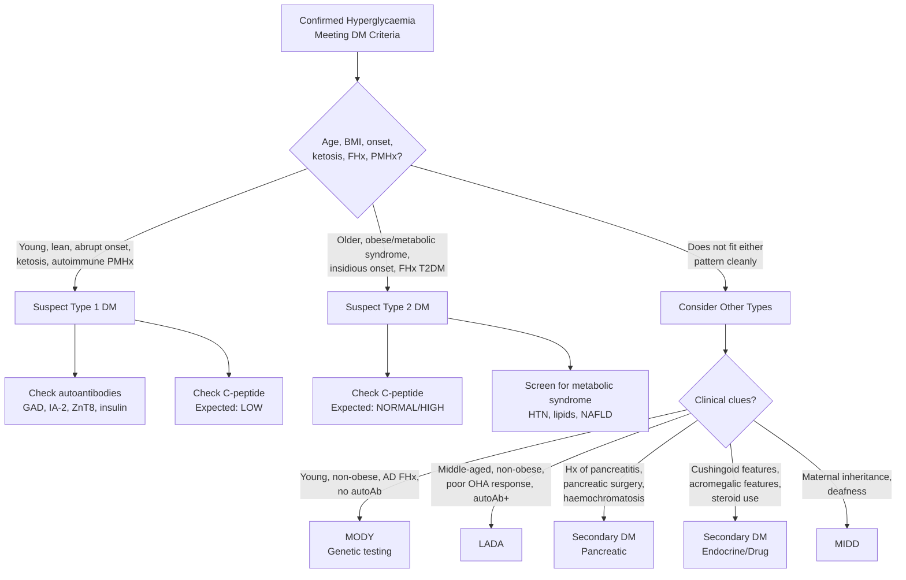

## Differential Diagnosis of Diabetes Mellitus

When a patient presents with hyperglycaemia, the clinical task is twofold:

1. **Confirm that the patient actually has diabetes** (as opposed to a transient or physiological cause of hyperglycaemia).
2. **Determine the specific type/cause of diabetes** — because the aetiology dictates the management.

Let's work through this systematically.

---

### 9.1 Differential Diagnosis of Hyperglycaemia (Is It Really DM?)

Not every raised blood glucose is diabetes. Before labelling someone, you must exclude transient and secondary causes:

| Differential | Mechanism / Why It Causes Hyperglycaemia | Key Distinguishing Features |
|---|---|---|
| ***Stress hyperglycaemia*** [1][2] | Acute illness (infection, MI, stroke, surgery, trauma) → massive counter-regulatory hormone surge (cortisol, catecholamines, glucagon, GH) → ↑ gluconeogenesis, ↑ glycogenolysis, ↑ insulin resistance. This is a physiological "fight-or-flight" response that diverts glucose to vital organs. | ***Unmasked by infections, pregnancy, steroid therapy, or stroke*** [1]. Hyperglycaemia resolves after the acute illness. However, these patients often have underlying impaired glucose tolerance — ***OGTT/HbA1c should be remeasured after the acute illness*** [2]. |
| **Drug-induced hyperglycaemia** | Various mechanisms depending on the drug — glucocorticoids (↑ gluconeogenesis, ↑ insulin resistance), thiazides (↓ insulin secretion via hypokalaemia), atypical antipsychotics (↑ insulin resistance, direct β-cell toxicity), tacrolimus/ciclosporin (direct β-cell toxicity), β-blockers (↓ insulin secretion, mask hypoglycaemia). | Temporal relationship with drug initiation. May remit on cessation. Always take a thorough drug history. ***Drugs: glucocorticoids, immunosuppressants*** [1]. |
| **Gestational hyperglycaemia** | Placental hormones (human placental lactogen, cortisol, progesterone, prolactin) → physiological insulin resistance of pregnancy. In susceptible women, β-cells cannot compensate → gestational DM. | Diagnosed during pregnancy using different criteria (IADPSG: FPG ≥ 5.1, 1h ≥ 10.0, 2h ≥ 8.5 mmol/L on 75g OGTT). Usually resolves postpartum but ↑ risk of future T2DM. |
| **Laboratory artefact / pre-analytical error** | Delayed sample processing → glycolysis by RBCs in the tube → falsely ↓ glucose. Conversely, IV dextrose infusion at time of sampling → falsely ↑ glucose. | Always confirm with a repeat sample. Use fluoride oxalate tubes to inhibit glycolysis. ***Diagnosis requires two abnormal test results from the same sample or two separate samples, unless clearly symptomatic or hyperglycaemic crisis*** [3]. |

<Callout title="Stress Hyperglycaemia — Don't Miss the Window" type="error">
A common mistake: a patient is found to have glucose of 14 mmol/L during a pneumonia admission, and everyone assumes it is "just stress." While stress hyperglycaemia is real, these patients frequently have underlying pre-diabetes or undiagnosed DM. Always recheck with fasting glucose and/or HbA1c after recovery from the acute illness. HbA1c is particularly useful here — if it is ≥ 6.5% during the acute admission, this suggests the hyperglycaemia was pre-existing and not purely stress-related.
</Callout>

---

### 9.2 Differential Diagnosis of the Presenting Symptoms

Patients do not walk in saying "I have diabetes." They present with **symptoms** — and these symptoms have broad differentials. Let's think about the common presentations:

#### 9.2.1 Polyuria and Polydipsia

***D/dx of polyuria + polydipsia:*** [4]

***Polyuria as primary defect: urine output > water intake, ↑ plasma osmolality*** [4]
- ***Diabetes mellitus: a/w other hyperglycaemic symptoms*** [4] — glucose-driven osmotic diuresis
- ***Diabetes insipidus*** [4] — "insipidus" = tasteless (the urine has no sugar, unlike DM). Due to either ↓ ADH production (cranial DI) or ↓ renal response to ADH (nephrogenic DI) → inability to concentrate urine → massive water loss
- ***Chronic kidney disease*** [4] — loss of concentrating ability as nephrons are destroyed → obligatory polyuria
- ***Diuretics*** [4] — iatrogenic cause; always check the drug chart!
- Hypercalcaemia — Ca²⁺ antagonises ADH action at the collecting duct (nephrogenic DI-like effect) + causes nephrocalcinosis
- Hypokalaemia — impairs renal concentrating ability (↓ aquaporin-2 expression)

***Excessive drinking as primary defect: water intake > urine output, ↓ plasma osmolality*** [4]
- ***Primary polydipsia: excessive drinking in patients with psychiatric disease or hypothalamic lesions*** [4] — the thirst drive is pathologically increased. Urine is appropriately dilute because the kidneys are working correctly to excrete the excess water.

> **How to distinguish these?** The key discriminator is **plasma osmolality** and the **paired urine osmolality**:
> - DM: ↑ plasma glucose, ↑ plasma osmolality, urine contains glucose
> - DI: ↑ or high-normal plasma Na/osmolality, urine is inappropriately dilute (U/P ratio < 1)
> - Primary polydipsia: ↓ plasma Na/osmolality, ↓ urine osmolality
> - CKD: ↑ urea and creatinine, isosthenuria (urine osmolality fixed ~300 mOsm/kg)

#### 9.2.2 Weight Loss

When a patient presents with unexplained weight loss, DM is one cause — but the differential is wide:

| Category | Examples | How to Distinguish from DM |
|---|---|---|
| **Malignancy** | Any cancer (especially GI, lung, lymphoma); ***new-onset DM can be an early manifestation of occult pancreatic cancer*** [5] | Constitutional symptoms (night sweats, fevers), no polyuria/polydipsia, imaging findings, tumour markers |
| **Hyperthyroidism** | Graves' disease, toxic nodular goitre | Heat intolerance, tremor, tachycardia, goitre, exophthalmos, ↑ free T4, ↓ TSH |
| **TB** | Pulmonary or extrapulmonary | ***Marked weight loss suggests more severe diabetes or presence of TB*** [1]. Chronic cough, night sweats, fever. High index of suspicion in HK. |
| **Malabsorption** | Coeliac disease, chronic pancreatitis, IBD | Diarrhoea, steatorrhoea, nutritional deficiencies |
| **Eating disorders** | Anorexia nervosa | Usually young females, distorted body image, amenorrhoea |
| **Chronic infections** | HIV, chronic hepatitis | Risk factor history, specific serology |
| **Addison's disease** | Primary adrenal insufficiency | Hypotension, hyperpigmentation, hyperkalaemia, hyponatraemia |

#### 9.2.3 Recurrent Infections

Recurrent UTIs, vulvovaginal candidiasis, or skin infections can be the presenting complaint. The differential includes:
- **Diabetes mellitus** — glycosuria + immunodeficiency
- **HIV/AIDS** — check risk factors, offer HIV testing
- **Primary immunodeficiency** — rare, usually presents in childhood
- **Structural urological abnormality** — for recurrent UTIs specifically

---

### 9.3 Differential Diagnosis WITHIN Diabetes: Determining the Type

This is arguably the most clinically important differential — once you have confirmed DM, you must determine **which type**, because management is fundamentally different.

***Note, however, that considerable overlap may occur:*** [2]
- ***T2DM can present with marked weight loss and DKA and may be present in children***
- ***T1DM can present insidiously and in an older age (i.e. LADA)***

The following algorithm is the structured approach:

#### 9.3.1 Type 1 vs Type 2 DM

***Comparison of clinical, genetic, and immunologic features of type 1 and type 2 diabetes:*** [3]

| ***Characteristic*** | ***Type 1*** | ***Type 2*** |
|---|---|---|
| ***Prevalence*** | ***Caucasians: 10–20%; Chinese: 5%*** | ***80–90%; > 95% of diabetic patients*** |
| ***Onset*** | ***Abrupt*** | ***Progressive/insidious*** |
| ***Endogenous insulin*** | ***Low to absent (check serum C-peptide)*** | ***Normal / ↑ / ↓*** |
| ***Ketosis*** | ***Common*** | ***Rare*** |
| ***Age at onset*** | ***Usually children/young adults*** | ***Mostly in adults*** |
| ***Symptoms*** | ***Severe; dramatic weight loss*** | ***May be none*** |
| ***Body mass*** | ***Usually non-obese*** | ***Obese or non-obese*** |
| ***Treatment*** | ***Insulin*** | ***Diet, oral drugs, insulin*** |
| ***Family history*** | ***10–15%*** | ***30%*** |
| ***Twin concordance*** | ***25–50%*** | ***70–90%*** |
| ***HLA*** | ***HLA-DR and DQ associations*** | ***Unrelated*** |
| ***Autoantibodies*** | ***Usually present at onset (> 85%)*** | ***Absent*** |

#### 9.3.2 LADA vs T2DM

LADA is the great mimicker — it masquerades as T2DM. Suspect LADA when:
- ***Non-obese*** patient diagnosed with "T2DM" [1]
- ***Difficult glycaemic control on oral agents*** — progressive deterioration suggesting β-cell failure [1]
- ***Other autoimmune diseases*** present (thyroid, vitiligo, coeliac) [1]
- ***Positive islet autoantibodies*** (especially anti-GAD) [1]
- Age typically 30–50 years

#### 9.3.3 MODY vs T1DM vs T2DM

***Monogenic diabetes — MODY:*** [1][2]
- ***Onset ≤ 25 years, autosomal dominant*** — strong FHx of early-onset DM across ≥ 3 generations
- **Non-obese** — unlike T2DM
- **Negative autoantibodies** — unlike T1DM
- **Detectable C-peptide** even years after diagnosis — unlike T1DM
- ***> 14 known genes; MODY 1/2/3 most common*** [1]
- ***Diagnosis: genetic testing*** [2]

Key distinguishing features:

| Feature | T1DM | T2DM | MODY |
|---|---|---|---|
| Age | Usually < 30 | Usually > 40 | Usually < 25 |
| Inheritance | Polygenic + environmental | Polygenic + environmental | ***Autosomal dominant*** |
| Autoantibodies | Positive (> 85%) | Negative | Negative |
| C-peptide | Low/absent | Normal/high (early) | Detectable (persists) |
| Obesity | Uncommon | Common | Uncommon |
| Ketosis-prone | Yes | Rarely | Rarely |
| Response to SU | No | Yes (early) | ***Excellent (MODY 1/3)*** [2] |

#### 9.3.4 Secondary Causes of DM

***Also note other causes of DM:*** [2]

| Category | Specific Causes | Clinical Clues |
|---|---|---|
| ***Monogenic DM*** | ***MODY, MIDD, Wolfram syndrome (DIDMOAD)*** | Early onset, FHx, specific syndromic features (deafness in MIDD; DI + optic atrophy in Wolfram) |
| ***Exocrine pancreatic diseases*** | ***Chronic pancreatitis, CA pancreas, pancreatectomy, haemochromatosis*** | Chronic pancreatitis: epigastric pain, steatorrhoea, pancreatic calcifications [6]. Haemochromatosis: bronze skin, hepatomegaly, arthropathy, "bronze diabetes" [7]. ***New-onset DM can be an early manifestation of occult pancreatic cancer*** [5]. |
| ***Endocrinopathies*** | ***Acromegaly, Cushing's syndrome, phaeochromocytoma, glucagonoma, somatostatinoma, hyperthyroidism*** | Each has specific features: coarsened features (acromegaly), moon face/striae (Cushing's), paroxysmal HTN (phaeochromocytoma), necrolytic migratory erythema (glucagonoma) |
| ***Drug-induced*** | ***Glucocorticoids, thyroid hormones, thiazides, α/β-agonists, phenytoin, pentamidine, nicotinic acid, pyrinuron, IFN-α*** | Temporal relationship with drug. ***May remit if underlying cause removed*** [1]. |

**Haemochromatosis deserves special mention** as a cause of secondary DM in HK exams: [7]
- ***Diabetes mellitus in 50% of patients*** — due to progressive iron accumulation in pancreatic islets → β-cell destruction
- Known as ***"bronze diabetes"*** — combination of DM + leaden-grey skin pigmentation (from excessive melanin deposition)
- ***May have ↓ insulin requirement after phlebotomy*** [7] — because removing iron reduces ongoing β-cell damage
- Also causes: hepatomegaly/cirrhosis, dilated cardiomyopathy, arthropathy (MCP joints), hypogonadism

**Chronic pancreatitis as a cause of DM:** [6]
- ***Islets of Langerhans are relatively resistant to injury → usually affected last*** [6]
- DM from chronic pancreatitis is ***also insulin-dependent (like T1DM) but α-cells are also destroyed → associated with ↑↑ risk of hypoglycaemia*** [6] — this is a critical exam point. Why? Because glucagon (from α-cells) is the primary counter-regulatory hormone for hypoglycaemia. When both insulin-secreting β-cells AND glucagon-secreting α-cells are destroyed, the patient has no safety net against hypoglycaemia.
- Classical triad of chronic pancreatitis (late stage): pancreatic calcification + steatorrhoea + DM [6]

---

### 9.4 Differential Diagnosis of Acute Diabetic Emergencies

When a known or newly diagnosed diabetic presents acutely unwell, you must differentiate between:

| Feature | DKA | HHS | Lactic Acidosis | Hypoglycaemia |
|---|---|---|---|---|
| **Typical DM type** | T1DM (rarely T2DM) | T2DM | Any DM (esp. on metformin) | Any DM on insulin/SU |
| **Glucose** | ↑↑ (usually > 14) | ↑↑↑ (usually > 33) | Variable | ↓↓ (< 4.0) |
| **Ketones** | ↑↑↑ | Minimal/absent | Absent | Absent |
| **pH** | < 7.3 (metabolic acidosis) | Usually > 7.3 | < 7.3 | Normal |
| **Osmolality** | ↑ | ↑↑↑ (> 320) | Variable | Normal |
| **Key symptoms** | Kussmaul breathing, acetone breath, abdo pain, vomiting | Profound dehydration, drowsiness, seizures, focal neurology | Hyperventilation, shock | Adrenergic (sweating, tremor, palpitations) → neuroglycopenic (confusion, seizures, coma) [8] |
| **Mechanism** | Absolute insulin lack → uncontrolled lipolysis → ketogenesis → metabolic acidosis | Enough insulin to suppress ketogenesis but not enough to control glucose → extreme hyperglycaemia → osmotic diuresis → severe dehydration | Tissue hypoperfusion / metformin accumulation → anaerobic metabolism → lactate ↑ | Excess insulin / insufficient glucose intake → brain glucose deprivation |

<Callout title="DKA in T2DM — It Happens!" type="error">
While DKA is classically associated with T1DM, it can occur in T2DM during severe physiological stress (sepsis, MI, surgery). This is sometimes called "ketosis-prone T2DM." In these patients, the stress-induced counter-regulatory hormone surge overwhelms residual insulin capacity, tipping lipolysis into overdrive. Don't dismiss DKA just because the patient "has T2DM."
</Callout>

---

### 9.5 Summary: A Systematic Approach to Differential Diagnosis

When confronted with a patient with hyperglycaemia, think in three layers:

**Layer 1: Is this truly DM?**
- Exclude stress hyperglycaemia, drug-induced hyperglycaemia, lab artefact
- Confirm with repeat testing as per diagnostic criteria

**Layer 2: If DM, what type?**
- Clinical pattern (age, BMI, onset, ketosis, FHx, PMHx) → initial classification
- ***Definitive tests when unclear:*** [2]
  - ***Autoantibodies: anti-GAD (70–80%), anti-insulin (60–75%), anti-IA-2 (65–75%), anti-ZnT8 (70–80%)***
  - ***C-peptide: ↓ in T1DM, ↑/N in T2DM***
  - ***Glucagon stimulation test: inadequate stimulation of insulin secretion in T1DM***
- If neither T1 nor T2 pattern: consider MODY (genetic testing), LADA (autoantibodies), secondary causes

**Layer 3: If secondary DM, what is the underlying cause?**
- Pancreatic: chronic pancreatitis, CA pancreas, haemochromatosis
- Endocrine: Cushing's, acromegaly, phaeochromocytoma
- Drug-induced: glucocorticoids, immunosuppressants

---

<Callout title="High Yield Summary">

**Is it really DM?** Exclude stress hyperglycaemia (resolves with acute illness), drug-induced hyperglycaemia, and lab error. Always recheck after recovery. HbA1c ≥ 6.5% during an acute illness suggests pre-existing DM.

**Polyuria/polydipsia DDx:** DM (osmotic diuresis from glycosuria), diabetes insipidus (↓ ADH or renal resistance), CKD (loss of concentrating ability), diuretics, primary polydipsia (psychiatric). Distinguish by paired plasma/urine osmolality.

**T1 vs T2 DM:** T1 = young, lean, abrupt, ketosis-prone, autoantibodies positive, ↓ C-peptide. T2 = older, obese/metabolic syndrome, insidious, rarely ketotic, autoantibodies negative, ↑/N C-peptide. BUT overlap exists — LADA looks like T2 but is autoimmune; T2 can present with DKA.

**MODY:** Young (≤ 25), autosomal dominant FHx, non-obese, autoantibody-negative, C-peptide detectable, responds well to sulfonylureas (MODY 1/3). Diagnosis by genetic testing.

**Secondary DM:** Haemochromatosis ("bronze diabetes" — iron in islets), chronic pancreatitis (both α and β cells destroyed → insulin-dependent + high hypo risk), endocrinopathies (Cushing's, acromegaly), drugs (steroids, immunosuppressants). May remit if cause removed.

**Acute emergencies DDx:** DKA (T1DM, ketosis, acidosis) vs HHS (T2DM, extreme hyperglycaemia, no ketosis, hyperosmolality) vs hypoglycaemia (low glucose, adrenergic then neuroglycopenic symptoms) vs lactic acidosis (metformin, tissue hypoperfusion).

</Callout>

---

<ActiveRecallQuiz
  title="Active Recall - Differential Diagnosis of Diabetes Mellitus"
  items={[
    {
      question: "A patient is found to have a fasting glucose of 9.2 mmol/L during a hospital admission for community-acquired pneumonia. How would you determine whether this is stress hyperglycaemia or true DM?",
      markscheme: "Check HbA1c during admission: if >= 6.5%, suggests pre-existing DM (reflects 2-3 months average). If HbA1c is normal/borderline, recheck fasting glucose and/or perform OGTT after recovery from acute illness. Stress hyperglycaemia resolves after the acute illness; true DM persists.",
    },
    {
      question: "Name three clinical clues that should make you suspect LADA rather than T2DM.",
      markscheme: "1. Non-obese patient with apparent T2DM. 2. Rapid failure of oral hypoglycaemics (progressive beta-cell destruction). 3. History of other autoimmune diseases (thyroid, vitiligo, coeliac). Additional clues: positive islet autoantibodies (especially anti-GAD), declining C-peptide over time.",
    },
    {
      question: "Why does DM secondary to chronic pancreatitis carry a particularly high risk of hypoglycaemia compared to T1DM?",
      markscheme: "In chronic pancreatitis, BOTH beta-cells (insulin) AND alpha-cells (glucagon) are destroyed. Glucagon is the primary counter-regulatory hormone that raises blood glucose during hypoglycaemia. Without glucagon, the patient has no safety net against hypoglycaemia. In T1DM, alpha-cells are initially preserved (though their function may be impaired over time).",
    },
    {
      question: "A 22-year-old non-obese woman presents with mild fasting hyperglycaemia (6.8 mmol/L). Her mother and maternal grandmother both developed diabetes before age 30. Autoantibodies are negative and C-peptide is detectable. What is the most likely diagnosis and how would you confirm it?",
      markscheme: "Most likely MODY (maturity-onset diabetes of the young). Clues: young, non-obese, autosomal dominant family history across 3 generations, negative autoantibodies, detectable C-peptide. Confirm with genetic testing. If glucokinase (MODY 2) mutation found, the mild stable fasting hyperglycaemia fits perfectly and may not require treatment.",
    },
    {
      question: "List the key differences in plasma osmolality and urine findings that distinguish DM, cranial DI, and primary polydipsia as causes of polyuria.",
      markscheme: "DM: raised plasma glucose and osmolality, urine contains glucose (glycosuria), urine osmolality may be high due to glucose. Cranial DI: high-normal plasma Na and osmolality, urine is inappropriately dilute (U/P ratio < 1), responds to exogenous DDAVP with urine concentration. Primary polydipsia: low plasma Na and osmolality (dilutional), low urine osmolality, concentrates urine appropriately after water deprivation.",
    },
  ]}
/>

## References

[1] Lecture slides: GC 078. Polyuria and polydipsia glucose metabolism, diabetes mellitus, diabetic ketoacidosis [Update 2025] (1).pdf (pp. 4, 10, 13)
[2] Senior notes: Ryan Ho Endocrine.pdf (pp. 78–80)
[3] Lecture slides: GC 078. Polyuria and polydipsia glucose metabolism, diabetes mellitus, diabetic ketoacidosis [Update 2025] (1).pdf (pp. 5, 13)
[4] Senior notes: Ryan Ho Fundamentals.pdf (p. 447)
[5] Senior notes: felixlai.md (pancreatic cancer section — new-onset DM as manifestation)
[6] Senior notes: Ryan Ho GI.pdf (pp. 347–348 — chronic pancreatitis)
[7] Senior notes: Ryan Ho GI.pdf (p. 294 — haemochromatosis)
[8] Senior notes: Ryan Ho Endocrine.pdf (p. 94 — hypoglycaemia)
