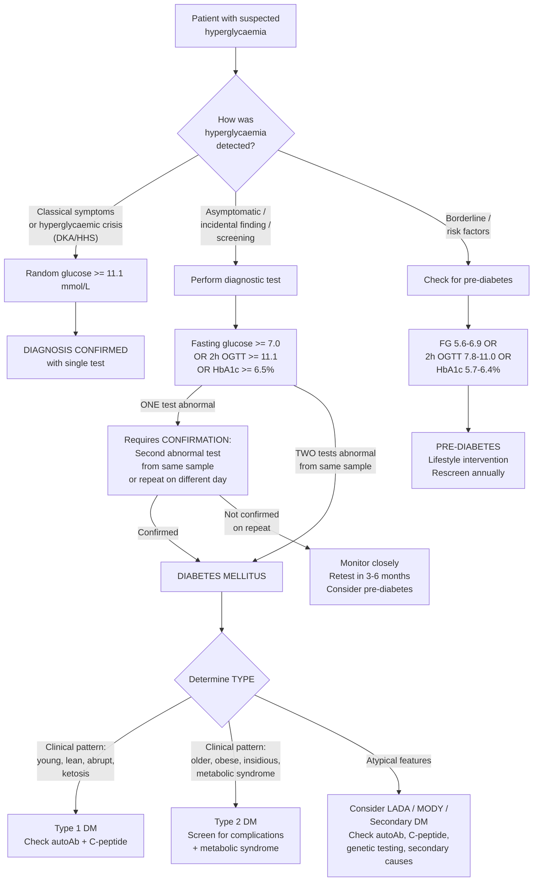

## Diagnostic Criteria, Diagnostic Algorithm, and Investigations for Diabetes Mellitus

---

### 10.1 Diagnostic Criteria

The fundamental principle here is that **blood glucose is a continuous variable** — there is no magic threshold where "normal" suddenly becomes "diabetic." ***The definition is based on a definite increase in risk of microvascular complications*** [2], particularly diabetic retinopathy. The cutoffs we use were derived from population studies showing a sharp inflection in retinopathy risk above certain glucose levels.

#### 10.1.1 Diagnostic Criteria for Diabetes Mellitus

***Diagnosis of Diabetes: WHO/IDF/ADA 2025*** [3]

***Based on Venous Plasma Glucose:*** [3]

| Test | Diagnostic Threshold | Notes |
|---|---|---|
| ***Fasting glucose*** | ***≥ 7 mmol/L (126 mg/dL)*** | ***Fasting ≥ 8 hours*** [3][5] |
| ***2-hour glucose during 75g OGTT*** | ***≥ 11.1 mmol/L (200 mg/dL)*** | 75g anhydrous glucose dissolved in water, blood drawn at 2 hours |
| ***Random plasma glucose*** | ***≥ 11.1 mmol/L*** | ***In presence of classical symptoms of diabetes or hyperglycaemic crisis*** [3] |

***Based on HbA1c:*** [3]
- ***HbA1c ≥ 6.5%***
- ***Must be based on standardised HbA1c assays with stringent quality assurance*** [3]

<Callout title="The Confirmation Rule — Crucial for Exams">

***Diagnosis of DM requires two abnormal test results from the same sample (e.g. fasting glucose and HbA1c) or in two separate test samples, unless clearly symptomatic or hyperglycaemic crisis.*** [3]

In plain language:
- **Symptomatic patient** (polyuria, polydipsia, weight loss) + random glucose ≥ 11.1 → **one test is enough** (the symptoms ARE the confirmation)
- **Hyperglycaemic crisis** (DKA/HHS) → **one test is enough** (the clinical picture speaks for itself)
- **Asymptomatic patient** → **need two abnormal results** — either two different tests on the same sample OR the same test on two different days [2][3]

Why this rule? Because a single abnormal test could be due to lab error, stress hyperglycaemia, or normal biological variation. Requiring confirmation protects against mislabelling someone with a lifelong diagnosis.
</Callout>

#### 10.1.2 Diagnostic Criteria for Pre-diabetes

***Prediabetes (ADA) / Intermediate hyperglycaemia (WHO):*** [3]

***By Glucose Criteria:*** [3]
| Category | ADA Criteria | WHO Criteria |
|---|---|---|
| ***Impaired Fasting Glucose (IFG)*** | ***Fasting glucose 5.6–6.9 mmol/L*** | ***Fasting glucose 6.1–6.9 mmol/L*** |
| ***Impaired Glucose Tolerance (IGT)*** | ***2-hour glucose ≥ 7.8 to < 11.1 mmol/L during 75g OGTT*** | Same |

***By HbA1c Criteria:*** [3]
- ***ADA: 5.7–6.4%***
- ***Canada/Europe: 6.0–6.4%***
- ***WHO: no HbA1c criteria for pre-diabetes*** [3]

***Pre-diabetes: ↑ risk of DM and macrovascular complications but no ↑ risk of microvascular complications*** [2]

> **Why does pre-diabetes matter?** Because ***IGT/IFG carry an increased risk of developing diabetes and cardiovascular diseases*** [3]. Approximately 5–10% of people with pre-diabetes progress to frank DM per year. This is the window where **lifestyle intervention** (diet, exercise, weight loss) is most effective — the Diabetes Prevention Program (DPP) showed 58% reduction in progression to DM with lifestyle changes vs 31% with metformin.

#### 10.1.3 Gestational Diabetes Mellitus (GDM)

***GDM (gestational diabetes):*** [3]
- ***14% of pregnancies globally (IDF Atlas 2022)*** [3]
- ***Transient diabetes / impaired glucose tolerance during pregnancy*** [3]
- ***Usually normal glucose tolerance after delivery*** [3]
- ***50% DM on long-term follow-up*** [3]

GDM uses **different diagnostic criteria** (IADPSG / WHO 2013 criteria based on the HAPO study):
- Diagnosed by **75g OGTT** at 24–28 weeks gestation
- ANY one of the following:
  - Fasting glucose ≥ 5.1 mmol/L
  - 1-hour glucose ≥ 10.0 mmol/L
  - 2-hour glucose ≥ 8.5 mmol/L

> Note these thresholds are **lower** than for non-pregnant DM — because hyperglycaemia during pregnancy causes fetal macrosomia, birth complications, and neonatal hypoglycaemia at lower glucose levels.

#### 10.1.4 Understanding HbA1c

HbA1c (glycated haemoglobin) reflects the **average blood glucose over the preceding 2–3 months** — because it measures the non-enzymatic glycation of haemoglobin, which is proportional to the ambient glucose concentration and the lifespan of the red blood cell (~120 days).

**Advantages of HbA1c:**
- No fasting required
- Less day-to-day variability than glucose measurements
- Not affected by acute stress
- Directly linked to complication risk

**Limitations / caveats of HbA1c:**

| Condition | Effect on HbA1c | Mechanism |
|---|---|---|
| **Haemolytic anaemia, blood loss** | Falsely ↓ | RBC lifespan shortened → less time for glycation |
| **Iron deficiency anaemia** | Falsely ↑ | RBC lifespan prolonged (and possibly ↑ glycation of older cells) |
| **Haemoglobin variants** (HbS, HbC, HbE) | Variable (↑ or ↓) | Interference with some assay methods |
| **Chronic kidney disease** | Falsely ↓ | Uraemia causes carbamylation; also ↓ RBC survival + EPO use |
| **Blood transfusion** | Unreliable | Mixture of donor and recipient HbA1c |
| **Pregnancy** | Unreliable (especially 2nd/3rd trimester) | Haemodilution, ↑ RBC turnover |
| **HIV treatment, certain drugs** | Variable | Some antiretrovirals affect RBC turnover |

<Callout title="When NOT to Use HbA1c for Diagnosis" type="error">
HbA1c is unreliable in any condition that alters RBC turnover or haemoglobin structure. In these patients, use **glucose-based criteria** (fasting glucose or OGTT) instead. A common exam scenario: a patient with sickle cell trait — HbA1c is falsely low on some assays, so a "normal" HbA1c does NOT rule out DM.
</Callout>

#### 10.1.5 Understanding OGTT

The **Oral Glucose Tolerance Test (OGTT)** is a dynamic test of how the body handles a standardised glucose load:

**Procedure:**
1. Patient fasts for ≥ 8 hours overnight
2. Fasting venous glucose is drawn
3. Patient drinks 75g anhydrous glucose dissolved in 250–300 mL water over 5 minutes
4. Venous glucose is drawn at 2 hours

**When is OGTT specifically indicated?**
- When fasting glucose and HbA1c are discordant or borderline
- Screening for GDM (24–28 weeks gestation)
- Diagnosis of IGT (cannot be diagnosed by fasting glucose alone — IGT specifically refers to the 2-hour post-load value)
- Post-transplant diabetes screening

> ***Note that arterial glucose > venous glucose (due to tissue consumption) and plasma glucose > whole blood glucose (due to low glucose within RBC)*** [2]. This is why we specifically use **venous plasma glucose** for diagnosis — standardisation is key.

#### 10.1.6 Summary Table of Diagnostic Thresholds

| Category | Fasting Glucose | 2h OGTT | HbA1c | Random Glucose |
|---|---|---|---|---|
| **Normal** | < 5.6 (ADA) / < 6.1 (WHO) | < 7.8 | < 5.7% (ADA) | — |
| **IFG** | 5.6–6.9 (ADA) / 6.1–6.9 (WHO) | — | — | — |
| **IGT** | < 7.0 | 7.8–11.0 | — | — |
| **Pre-diabetes (ADA composite)** | 5.6–6.9 | 7.8–11.0 | 5.7–6.4% | — |
| **Diabetes** | ≥ 7.0 | ≥ 11.1 | ≥ 6.5% | ≥ 11.1 + symptoms |

---

### 10.2 Diagnostic Algorithm

The approach to diagnosing DM depends on the clinical context: **symptomatic vs asymptomatic discovery**.

***Hyperglycaemia is a common laboratory finding and can be detected in the following contexts:*** [2]
1. ***Asymptomatic — 50% — incidental glycosuria or hyperglycaemia*** [1]
2. ***Classical symptoms — polyuria, polydipsia, weight loss despite increased appetite*** [1]
3. ***Presenting with complications*** [1]
4. ***Unmasked by steroid therapy, infection, pregnancy, stroke*** [1]
5. ***Others — e.g. pruritus vulvae*** [1]

#### 10.2.1 Screening for DM

***Subjects at increased risk of DM:*** [3]
1. ***Pre-diabetes*** [3]
2. ***DM in first-degree relatives*** [3]
3. ***History of gestational diabetes*** [3]
4. ***Age over 35*** [3]
5. ***Obesity, hypertension, dyslipidaemia*** [3]

***Screening: indicated in BMI ≥ 23 + ≥ 1 risk factors for DM or based on local validated scoring tools*** [2]

**ADA 2025 screening recommendations:**
- All adults ≥ 35 years: screen every 3 years
- Adults of any age with BMI ≥ 25 (≥ 23 in Asians) + ≥ 1 risk factor: screen earlier and more frequently
- Women with previous GDM: lifelong screening every 1–3 years
- Patients with pre-diabetes: retest annually

---

### 10.3 Investigations

Once DM is diagnosed (or strongly suspected), a systematic workup serves three purposes:
1. **Confirm the diagnosis** (if not already unequivocal)
2. **Determine the type/aetiology** of DM
3. **Assess baseline complications and metabolic state**

#### 10.3.1 Investigations to Confirm Diagnosis

| Investigation | What It Measures | Diagnostic Threshold | Key Interpretation Points |
|---|---|---|---|
| **Fasting plasma glucose** | Glucose after ≥ 8h fast | ≥ 7.0 mmol/L | Simple, cheap, widely available. Affected by acute stress, recent meals (if inadequate fasting). Must use venous plasma (not capillary or whole blood). |
| **75g OGTT** | Glucose handling after standardised load | 2h ≥ 11.1 mmol/L | More sensitive than fasting glucose alone (captures IGT). Cumbersome (2-hour test, patient must fast, sit quietly). Gold standard for GDM. |
| **HbA1c** | Average glycaemia over 2–3 months | ≥ 6.5% | No fasting needed, less day-to-day variability. ***Must be based on standardised assays with stringent quality assurance*** [3]. Unreliable in haemoglobinopathies, anaemia, pregnancy, recent transfusion. |
| **Random plasma glucose** | Glucose at any time | ≥ 11.1 + symptoms/crisis | Only diagnostic if accompanied by classical symptoms or hyperglycaemic crisis |
| **Urine dipstick** | Glycosuria | Positive | ***Incidental glycosuria*** [1] may be the first clue. Not diagnostic alone — renal threshold varies. Positive glucose on dipstick should always prompt blood glucose measurement. |

#### 10.3.2 Investigations to Determine the Type of DM

This is the **aetiology workup** — performed once DM is confirmed and the type is uncertain.

| Investigation | What It Tests | Expected Findings | Clinical Utility |
|---|---|---|---|
| ***C-peptide*** | Endogenous insulin secretion (C-peptide is cleaved from proinsulin 1:1 with insulin) | ***↓ in T1DM; ↑ or normal in T2DM*** [2] | **Fasting C-peptide** or **glucagon-stimulated C-peptide**: ↓ C-peptide (< 0.2 nmol/L fasting, or < 0.6 nmol/L post-glucagon) confirms absolute insulin deficiency. In early T2DM, C-peptide is typically normal or elevated (reflecting hyperinsulinaemia). |
| ***Pancreatic autoantibodies*** | Autoimmune β-cell destruction | ***> 85% positive at onset in T1DM; absent in T2DM*** [3] | ***Anti-GAD (70–80%), anti-insulin (60–75%), anti-IA-2 (65–75%), anti-ZnT8 (70–80%)*** [2]. The presence of **≥ 2 autoantibodies** is highly specific for T1DM/LADA. |
| ***Glucagon stimulation test*** | β-cell reserve | ***Inadequate stimulation of insulin secretion in T1DM*** [2] | Inject 1mg glucagon IV → measure C-peptide at 0 and 6 minutes. A stimulated C-peptide < 0.6 nmol/L confirms severe β-cell insufficiency. |
| **Genetic testing** | Monogenic mutations | MODY gene mutations (HNF1A, GCK, HNF4A, etc.) | ***Diagnosis of MODY: genetic testing*** [2]. Indicated when young (< 25), autosomal dominant FHx, autoantibody-negative, C-peptide detectable. |

> **Why is C-peptide better than measuring insulin directly?** Three reasons:
> 1. C-peptide is NOT present in exogenous insulin preparations — so it specifically reflects **endogenous** production
> 2. C-peptide has a longer half-life (~30 min vs ~5 min for insulin) — giving a more stable and reliable measurement
> 3. C-peptide is NOT cleared by the liver on first pass (unlike insulin, of which ~50% is extracted by the liver) — so peripheral C-peptide levels more accurately reflect total β-cell output

#### 10.3.3 Baseline Workup for a Newly Diagnosed Diabetic Patient

This workup assesses the metabolic state and screens for **complications that may already be present at diagnosis** — especially in T2DM where disease may have been subclinical for years.

**A. Metabolic / Cardiovascular Risk Assessment**

| Investigation | Rationale | Expected Findings in DM |
|---|---|---|
| **Lipid profile** (TC, LDL-C, HDL-C, TG) | ***Metabolic syndrome: HTN, hyperlipidaemia*** [2]. Dyslipidaemia is extremely common in T2DM and is a major driver of macrovascular complications. | Typical T2DM dyslipidaemia: ↑ TG, ↓ HDL-C, ↑ small dense LDL. In T1DM, lipids may be normal if well-controlled. |
| **Blood pressure** | HTN coexists in ~70% of T2DM; accelerates both micro- and macrovascular complications | Target < 130/80 mmHg in most diabetic patients |
| **BMI + waist circumference** | Quantify central obesity (the driver of insulin resistance) | Asian cutoffs: overweight ≥ 23 kg/m², obese ≥ 27.5 kg/m²; waist ≥ 90 cm (M), ≥ 80 cm (F) |
| **ECG** | Baseline cardiovascular assessment; screen for silent MI (autonomic neuropathy may mask angina) | May reveal LVH (HTN), ischaemic changes, arrhythmias |

***Diagnostic criteria of metabolic syndrome: presence of ≥ 3 of:*** [2]
1. ***Glucose intolerance or type 2 DM***
2. ***Hypertension***
3. ***Hypertriglyceridaemia***
4. ***↓ HDL-C***
5. ***Central obesity***

**B. Microvascular Complication Screening**

***Complication screening:*** [9]
- ***Annual microvascular screen for all T2DM and T1DM ≥ 5 years from diagnosis or ≥ 10 years or at puberty*** [9]
- ***Involves: foot examination (including monofilament test), UACR, and dilated eye exam*** [9]

| Investigation | Complication Screened | Findings & Interpretation |
|---|---|---|
| **Dilated fundoscopy / retinal photography** | Diabetic retinopathy | Microaneurysms (earliest sign), dot-and-blot haemorrhages, hard exudates, cotton-wool spots, neovascularisation. ***Classification based on ETDRS*** [10]: mild NPDR → moderate NPDR → severe NPDR (4-2-1 rule) → PDR. CSME assessed by OCT. |
| **Urine albumin-to-creatinine ratio (UACR)** | Diabetic nephropathy | Normal: < 3 mg/mmol. Moderately increased albuminuria (formerly "microalbuminuria"): 3–30 mg/mmol. Severely increased: > 30 mg/mmol. Earliest marker of diabetic kidney disease. |
| **Serum creatinine + eGFR** | Diabetic nephropathy / CKD staging | eGFR categorises CKD stage. In early DM, eGFR may actually be **elevated** (hyperfiltration — because hyperglycaemia increases glomerular pressure via afferent arteriolar dilation). This is paradoxically a bad sign. |
| **10g monofilament test + vibration sense** | Diabetic peripheral neuropathy | Loss of protective sensation at standardised foot sites. ↓ Vibration sense (128Hz tuning fork at great toe). Indicates large-fibre neuropathy — risk factor for foot ulceration. |
| **Ankle reflexes + proprioception** | Peripheral neuropathy | Absent ankle jerks are often the earliest reflex sign. Distal-to-proximal gradient (glove-and-stocking pattern). |

**C. Other Baseline Investigations**

| Investigation | Rationale | Interpretation |
|---|---|---|
| **Full blood count** | Baseline; anaemia may affect HbA1c interpretation; CKD may cause normocytic anaemia | Check for anaemia (especially if HbA1c seems discordant with fingerstick readings) |
| **Liver function tests** | NAFLD/NASH screening (hepatic manifestation of metabolic syndrome); baseline before starting medications (e.g. metformin, statins) | ↑ ALT suggests NAFLD. AST:ALT ratio usually < 1 (cf. > 2 in alcoholic liver disease). |
| **Renal function tests** | Baseline GFR; guide medication choices (e.g. metformin dose adjustment, SGLT2i eligibility) | ↑ Creatinine / ↓ eGFR may indicate established diabetic nephropathy |
| ***TFT ± anti-tTG IgA*** | ***At diagnosis for all T1DM for concomitant autoimmune diseases*** [9] | TSH for thyroid disease (Hashimoto's/Graves' — ~2–5% of T1DM). Anti-tTG IgA for coeliac disease. |
| **Serum urate** | Metabolic syndrome; gout risk (especially if starting SGLT2i — can lower urate) | ↑ Urate common in metabolic syndrome |

**D. Investigation for Secondary Causes (When Clinically Indicated)**

| Suspected Cause | Investigation | Rationale |
|---|---|---|
| **Haemochromatosis** | Serum ferritin + transferrin saturation; HFE gene testing | Iron overload → β-cell destruction. ↑ Ferritin + Tf sat > 45% is screening threshold. |
| **Chronic pancreatitis** | CT abdomen (calcifications, ductal dilation); faecal elastase (exocrine function) | Classical triad: calcification + steatorrhoea + DM. Amylase/lipase often normal (burnt-out gland). |
| **Cushing's syndrome** | Overnight 1mg dexamethasone suppression test; 24h urinary free cortisol; midnight salivary cortisol | ↑ Cortisol → ↑ gluconeogenesis + ↑ insulin resistance |
| **Acromegaly** | Serum IGF-1; OGTT with GH suppression test | ↑ GH → ↑ insulin resistance; GH normally suppresses to < 1 μg/L after glucose load |
| **Phaeochromocytoma** | 24h urinary metanephrines or plasma free metanephrines | Catecholamines → ↑ glycogenolysis + ↓ insulin secretion |
| **Pancreatic cancer** | CT pancreas; CA 19-9 | New-onset DM in an elderly patient with weight loss and back pain — high index of suspicion |

---

### 10.4 Interpreting Discordant Results

A common clinical scenario: fasting glucose is normal but HbA1c is elevated, or vice versa. How to interpret this?

| Scenario | Possible Explanations | Action |
|---|---|---|
| **FG normal, HbA1c ≥ 6.5%** | Post-prandial hyperglycaemia (missed by fasting test); falsely elevated HbA1c (IDA, splenectomy) | Perform OGTT to catch post-prandial spikes; exclude causes of falsely elevated HbA1c |
| **FG ≥ 7.0, HbA1c < 6.5%** | Recent-onset hyperglycaemia (HbA1c reflects the past 2–3 months, so a very new rise in glucose won't be captured yet); falsely low HbA1c (haemolysis, haemoglobinopathy, pregnancy, EPO therapy) | Repeat both tests; consider timing of hyperglycaemia onset; exclude causes of falsely low HbA1c |
| **FG borderline, OGTT diagnostic** | Isolated post-prandial hyperglycaemia (IGT pattern) — early β-cell failure where fasting compensatory mechanisms still work but post-load response is impaired | Diagnose DM based on OGTT result; confirms DM |

---

### 10.5 Metabolic Syndrome — Formal Diagnostic Criteria

Since metabolic syndrome is integral to the workup of T2DM, here are the formal criteria for completeness:

***Presence of ≥ 3 of the following:*** [2]

| Criterion | Threshold |
|---|---|
| ***Central obesity*** | Waist ≥ 90 cm (M) / ≥ 80 cm (F) for Asians |
| ***Hypertriglyceridaemia*** | TG ≥ 1.7 mmol/L or on Rx |
| ***Low HDL-C*** | < 1.0 (M) / < 1.3 (F) mmol/L or on Rx |
| ***Hypertension*** | ≥ 130/85 mmHg or on Rx |
| ***Glucose intolerance or T2DM*** | FPG ≥ 5.6 mmol/L or on Rx |

---

<Callout title="High Yield Summary">

**Diagnostic Criteria (WHO/IDF/ADA 2025):** Fasting glucose ≥ 7.0 mmol/L OR 2h OGTT ≥ 11.1 mmol/L OR HbA1c ≥ 6.5% OR random glucose ≥ 11.1 + symptoms/crisis.

**Confirmation Rule:** Two abnormal results needed if asymptomatic (same sample or separate days). One result sufficient if symptomatic or in hyperglycaemic crisis.

**Pre-diabetes:** IFG (FG 5.6–6.9 ADA / 6.1–6.9 WHO), IGT (2h 7.8–11.0), HbA1c 5.7–6.4% (ADA). Increased risk of DM and CVD but NOT microvascular complications.

**GDM:** Different (lower) thresholds — FG ≥ 5.1, 1h ≥ 10.0, 2h ≥ 8.5 on 75g OGTT. 50% develop DM long-term.

**HbA1c limitations:** Unreliable in haemoglobinopathies, haemolytic anaemia, IDA, CKD, pregnancy, recent transfusion — use glucose-based criteria instead.

**Determine type:** C-peptide (↓ T1DM, ↑/N T2DM) + autoantibodies (positive T1DM, negative T2DM) + genetic testing (MODY). Glucagon stimulation test for β-cell reserve.

**Baseline workup:** Lipid profile, BP, BMI/waist, ECG (cardiovascular risk); fundoscopy, UACR, eGFR, monofilament test (microvascular screening); LFTs, FBC, TFTs + anti-tTG (T1DM).

**Screening:** BMI ≥ 23 + ≥ 1 risk factor, or age ≥ 35, or prior GDM, or pre-diabetes.

**Metabolic syndrome:** ≥ 3 of: central obesity, ↑ TG, ↓ HDL, HTN, glucose intolerance.

</Callout>

---

<ActiveRecallQuiz
  title="Active Recall - Diagnostic Criteria, Algorithm, and Investigations"
  items={[
    {
      question: "An asymptomatic 55-year-old man has a fasting glucose of 7.3 mmol/L on routine bloods. Is this sufficient to diagnose DM? What should you do next?",
      markscheme: "No, a single abnormal test in an asymptomatic patient is NOT sufficient. Requires confirmation: either a second abnormal test from the same sample (e.g. HbA1c >= 6.5%) or repeat fasting glucose >= 7.0 on a different day. If symptomatic or in hyperglycaemic crisis, a single test suffices.",
    },
    {
      question: "A patient with known sickle cell trait has an HbA1c of 5.8%. Can you reliably exclude DM? Explain why or why not.",
      markscheme: "No. HbA1c is unreliable in haemoglobinopathies (HbS, HbC, HbE) because: (1) some assays have interference with variant haemoglobins, and (2) shortened RBC lifespan in sickle cell trait/disease leads to falsely low HbA1c. Should use glucose-based criteria (fasting glucose or OGTT) instead.",
    },
    {
      question: "List the five components of metabolic syndrome and their thresholds for Asian populations.",
      markscheme: "1. Central obesity: waist >= 90 cm (M), >= 80 cm (F). 2. Hypertriglyceridaemia: TG >= 1.7 mmol/L. 3. Low HDL-C: < 1.0 (M), < 1.3 (F) mmol/L. 4. Hypertension: >= 130/85 mmHg. 5. Glucose intolerance: FPG >= 5.6 mmol/L. Need >= 3 of 5 for diagnosis.",
    },
    {
      question: "Why is C-peptide a better marker of endogenous insulin secretion than measuring serum insulin directly? Give three reasons.",
      markscheme: "1. C-peptide is not present in exogenous insulin preparations, so it specifically reflects endogenous production. 2. C-peptide has a longer half-life (~30 min vs ~5 min for insulin), giving a more stable measurement. 3. C-peptide is not cleared by the liver on first pass (unlike ~50% of insulin), so peripheral levels more accurately reflect total beta-cell output.",
    },
    {
      question: "What autoimmune conditions should be screened for at diagnosis of Type 1 DM, and what investigations would you order?",
      markscheme: "Screen for: (1) Thyroid disease (Hashimoto's/Graves') - order TFTs (TSH, free T4). (2) Coeliac disease - order anti-tissue transglutaminase IgA (anti-tTG IgA). These are associated autoimmune conditions occurring in 2-5% and 1-10% of T1DM patients respectively. Annual rescreening is recommended.",
    },
    {
      question: "Explain the diagnostic thresholds for gestational diabetes and why they differ from non-pregnant DM criteria.",
      markscheme: "GDM criteria (IADPSG/WHO 2013, 75g OGTT at 24-28 weeks): Fasting >= 5.1, 1h >= 10.0, 2h >= 8.5 mmol/L. ANY one abnormal value is diagnostic. Thresholds are LOWER than non-pregnant DM because even mild hyperglycaemia during pregnancy causes adverse fetal outcomes (macrosomia, birth trauma, neonatal hypoglycaemia) at glucose levels below the standard DM thresholds.",
    },
  ]}
/>

## References

[1] Lecture slides: GC 078. Polyuria and polydipsia glucose metabolism, diabetes mellitus, diabetic ketoacidosis [Update 2025] (1).pdf (pp. 4, 12)
[2] Senior notes: Ryan Ho Endocrine.pdf (pp. 77, 79–80)
[3] Lecture slides: GC 078. Polyuria and polydipsia glucose metabolism, diabetes mellitus, diabetic ketoacidosis [Update 2025] (1).pdf (pp. 5, 6, 11)
[5] Senior notes: Ryan Ho Chemical Path.pdf (p. 35)
[9] Senior notes: Ryan Ho Endocrine.pdf (p. 94)
[10] Senior notes: Ryan Ho Opthalmology.pdf (pp. 69–70)
