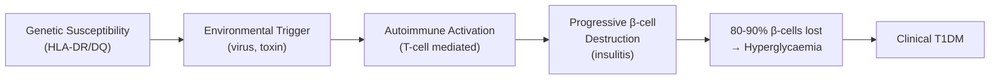
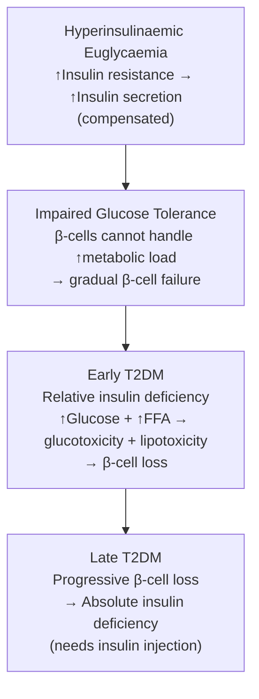

# Diabetes Mellitus

## 1. Definition

***Diabetes mellitus (DM) is a chronic disorder characterised by raised blood glucose levels, secondary to a complete or relative lack of insulin.*** [1]

Let's break down the name itself:
- **Diabetes** → from Greek *diabainein* = "to pass through" (referring to the excessive urination)
- **Mellitus** → from Latin *mel* = "honey" (referring to the sweet-tasting urine — yes, ancient physicians tasted it)

So, quite literally, "honey passing through" — a disease defined by sugar spilling into the urine because blood glucose is too high.

<Callout title="Core Concept">
DM is fundamentally a disease of **fuel metabolism**. Insulin is the master anabolic hormone — when it is absent or its action is impaired, the body cannot properly store or utilise glucose, fat, and amino acids. Everything downstream — the polyuria, the weight loss, the ketoacidosis, the chronic vascular damage — stems from this single defect.
</Callout>

---

## 2. Epidemiology

### 2.1 Global Burden

- ***Affects 10.5% of adults worldwide (2021)*** [1]
- Estimated 537 million adults living with DM globally (IDF Diabetes Atlas, 10th edition, 2021); projected to rise to 783 million by 2045
- ~90–95% of all DM is Type 2; ~5–10% is Type 1
- DM is a leading cause of blindness, end-stage renal disease, non-traumatic lower-limb amputation, and cardiovascular death worldwide

### 2.2 Hong Kong Epidemiology

- ***Affects > 10% of HK adults*** [2]
- Prevalence is rising rapidly, particularly in younger age groups — driven by westernisation of diet, sedentary lifestyles, and the genetic susceptibility of East Asian populations to β-cell dysfunction at lower BMI
- T2DM accounts for ~95% of DM in HK; T1DM accounts for ~5% in Chinese populations (vs ~10% in Caucasians) [2]
- HK Chinese have a lower threshold for developing insulin resistance — metabolic consequences appear at lower BMI compared to Caucasians (hence a lower BMI cutoff for "overweight" in Asians: ≥ 23 kg/m²)

### 2.3 Specific Epidemiology by Type

| Feature | Type 1 DM | Type 2 DM |
|---|---|---|
| **Proportion** | ~5% (in Chinese) | ~95% |
| ***Incidence*** | ***~1/10,000/year*** [2] | ***~1/200/year*** [2] |
| ***Prevalence*** | ***~1/1,000*** [2] | ***~5/100*** [2] |
| **Peak onset** | Childhood/adolescence (but can occur at any age, including LADA) | > 40–50 years (but increasingly in younger adults and adolescents) |
| **Sex** | M = F | M ≥ F |
| **Ethnic variation** | Highest in Scandinavian countries; lower in Asian populations | Highest in South Asian, Pacific Islander, Indigenous populations; very common in East Asians |

---

## 3. Risk Factors

### 3.1 Type 1 DM Risk Factors

***Genetic factors:*** [1][2]
- ***HLA-DR and HLA-DQ susceptibility haplotypes*** on chromosome 6 — these are the most important genetic determinants
  - ***20% risk in HLA-identical twins*** [1]
  - ***35% MZ twin concordance rate*** [2] (i.e., genetics is important but not sufficient — environment must play a role)
- ***Other genes, e.g. insulin gene (VNTR polymorphisms), CTLA-4, PTPN22*** [1]

***Environmental factors*** (exact nature uncertain, ***?multi-hit action***): [1]
- ***Viruses: Coxsackie B, mumps*** — proposed mechanism is molecular mimicry (viral antigens resemble β-cell antigens, triggering cross-reactive autoimmunity)
- ***Bovine serum albumin (BSA) in cow's milk in early infancy*** — ↑ risk of T1DM if cow's milk introduced early [2]
- ***Toxins: nitrosamines, coffee*** [2]

***Immunological factors:*** [1][2]
- ***Hygiene hypothesis*** — reduced exposure to infections in early life may predispose to autoimmune disease
- ***Association with other autoimmune disorders***: thyroid disease (Hashimoto's/Graves', 2–5%), ***coeliac disease, Addison's disease, pernicious anaemia, vitiligo*** [2]

### 3.2 Type 2 DM Risk Factors

***Genetics:*** [2]
- ***MZ twin concordance rate = 70–90%*** (paradoxically *higher* than T1DM — strong genetic basis)
- ***Most genes associated with altered regulation of β-cell mass*** (not just insulin resistance)
- ***First-degree relative with DM is an important risk factor*** — 75% risk if both parents affected [2]

***Modifiable risk factors:***
- ***Obesity: 10× risk if BMI > 30*** [2]
  - Central (visceral) obesity is the key driver — adipocytes release FFAs and pro-inflammatory adipokines → insulin resistance
  - In Asians, metabolic risk appears at lower BMI (overweight cutoff ≥ 23 kg/m²)
- ***Physical inactivity*** — ↓ AMPK activation → ↓ glucose uptake and ↓ FFA metabolism [2]
- ***Metabolic syndrome*** components: HTN, dyslipidaemia, PCOS, NAFLD [2]

***Other risk factors:***
- ***Previous pre-diabetes*** (IFG or IGT) [2]
- ***History of gestational diabetes*** [2]
- ***Age ≥ 45 years*** [2]
- Ethnicity (South Asian, Pacific Islander, Indigenous populations at higher risk)
- Medications: glucocorticoids, thiazides, atypical antipsychotics, immunosuppressants (e.g. tacrolimus)

---

## 4. Anatomy and Function: The Endocrine Pancreas

### 4.1 Gross Anatomy

The pancreas is a retroperitoneal organ lying posterior to the stomach, spanning from the C-loop of the duodenum (head) to the hilum of the spleen (tail). It has both exocrine (acinar cells producing digestive enzymes) and endocrine (islets of Langerhans) functions.

### 4.2 Islets of Langerhans

The islets constitute only ~1–2% of pancreatic mass but receive ~10–15% of pancreatic blood flow (reflecting their metabolic importance). Each islet contains ~3,000 endocrine cells:

| Cell Type | Location in Islet | Hormone | Function |
|---|---|---|---|
| **β-cells** | ***Core*** [2] | **Insulin** (+ C-peptide) | ↓ Blood glucose (anabolic) |
| **α-cells** | Periphery | **Glucagon** | ↑ Blood glucose (catabolic) |
| **δ-cells** | Scattered | **Somatostatin** | Inhibits insulin & glucagon secretion |
| **PP cells** | Scattered | **Pancreatic polypeptide** | ↓ Pancreatic exocrine secretion |
| **ε-cells** | Rare | **Ghrelin** | ↑ Appetite |

### 4.3 Normal Insulin Secretion

***Site: pancreatic islet β-cells (core)*** [2]

***Process:*** [2]
1. **Glucose entry**: ***↑ blood glucose → glucose enters β-cell via GLUT-2 transporters*** (GLUT-2 has a high Km — it acts as a "glucose sensor," only transporting significant glucose when blood levels are elevated)
2. **Metabolism**: ***Glucose undergoes glycolysis → ↑ ATP production***
3. **Channel closure**: ***↑ ATP → closure of ATP-sensitive K⁺ channels (K_ATP channels)***
4. **Depolarisation**: K⁺ can no longer leave the cell → membrane depolarisation
5. **Ca²⁺ influx**: Depolarisation opens voltage-gated Ca²⁺ channels → Ca²⁺ influx
6. **Exocytosis**: ***Ca²⁺ triggers exocytosis of insulin-containing granules***

***Insulin is produced by cleaving C-peptide from proinsulin.*** [2] Therefore:
- **C-peptide levels reflect endogenous insulin secretion** — this is clinically critical because exogenous insulin injections do NOT contain C-peptide
- C-peptide measurement helps distinguish T1DM (↓ C-peptide) from T2DM (normal/↑ C-peptide, at least early on) and from factitious hypoglycaemia

> **Why C-peptide and not just measure insulin?** Because in patients on insulin therapy, exogenous insulin would confound the measurement. C-peptide is released 1:1 with endogenous insulin, is not present in exogenous insulin preparations, and has a longer half-life — making it the ideal marker of residual β-cell function.

### 4.4 Normal Fuel Metabolism

***Critical to maintain normal blood levels of fuel molecules, i.e. glucose and fatty acids.*** [2]

**Fed state** (after a meal): [2]
- ***↑ glucose → ↑ insulin secretion***
  - ***↑ tissue uptake of glucose*** (especially muscle and adipose tissue via GLUT-4)
  - ***↑ hepatic uptake → glycogenesis (glucose → glycogen) and lipogenesis (glucose → fatty acids → triglycerides)***
  - ***↑ amino acid uptake → protein synthesis***
- Net effect: **anabolic** — energy is stored

**Fasting state** (between meals): [2]
- ***↓ glucose → ↓ insulin, ↑ glucagon, ↑ adrenaline***
  - ***↑ glycogenolysis*** (glycogen → glucose) in liver
  - ***↑ gluconeogenesis*** (amino acids, lactate, glycerol → glucose) in liver
  - ***↑ lipolysis*** (triglycerides → glycerol + free fatty acids)
  - ***↑ ketogenesis*** (FFAs → ketone bodies in liver)
- Net effect: **catabolic** — energy stores are mobilised

***Failure in any step of insulin secretion or action → diabetes*** [2]

<Callout title="The Fundamental Problem in DM">
In DM, the body behaves as though it is permanently in a "fasting" state — even when fed. Glucose cannot enter cells properly, so the body "thinks" it is starving and mobilises energy stores (glycogenolysis, lipolysis, proteolysis). The result: hyperglycaemia (glucose cannot be used), weight loss (stores are broken down), and in severe cases, ketoacidosis (uncontrolled lipolysis → ketone body overproduction).
</Callout>

---

## 5. Aetiology and Pathophysiology

### 5.1 Overview of Causes

***Causes of DM:*** [1][2]

| Category | Examples |
|---|---|
| ***Type 1*** | ***Immune-mediated β-cell destruction → absolute insulin insufficiency*** |
| ***Type 2*** | ***Insulin resistance → relative insulin insufficiency gradually becoming absolute*** |
| ***Monogenic diabetes*** | ***MODY*** (> 14 known genes), ***MIDD, Wolfram syndrome*** |
| ***LADA*** | ***Latent Autoimmune Diabetes in Adults*** |
| ***Secondary diabetes*** | Pancreatic diseases, endocrinopathies, drug-induced |
| ***Gestational DM*** | Diagnosed during pregnancy |

### 5.2 Type 1 Diabetes Mellitus — Pathogenesis

***Type 1 diabetes occurs as a result of islet cell destruction, immunologically mediated.*** [1]

The pathogenesis is a three-hit model: **Genetic susceptibility** + **Environmental trigger** + **Autoimmune destruction**

#### 5.2.1 Genetic Susceptibility

- HLA class II genes (chromosome 6p21) confer ~40–50% of genetic risk
  - HLA-DR3, DR4, DQ2, DQ8 are susceptibility haplotypes
  - HLA-DR2 (DQ6) is protective
- Non-HLA genes: insulin gene (VNTR polymorphisms at 11p15), CTLA-4, PTPN22, IL2RA
- The genetics explain why concordance is only ~35% in MZ twins — necessary but not sufficient

#### 5.2.2 Environmental Triggers

***Exact nature uncertain, ?multi-hit action*** [1]
- Proposed mechanisms:
  1. **Molecular mimicry**: viral antigens resemble β-cell antigens → cross-reactive T-cell response
  2. **Bystander activation**: viral infection of β-cells → local inflammation → exposure of sequestered β-cell antigens to immune system
  3. **Direct β-cell damage**: some viruses directly infect and damage β-cells

#### 5.2.3 Autoimmune Destruction

***Immunological factors — evidenced by:*** [1]
1. ***Presence of islet autoantibodies (GAD, IA-2, ZnT8, insulin) at onset*** — present in > 85% at diagnosis [2]
2. ***Cell-mediated autoimmunity vs islet cells at autopsy of new-onset patients*** (insulitis — lymphocytic infiltration of islets)
3. ***Increased remission/β-cell preservation after immunosuppressants (e.g. cyclosporine, anti-TNF-α) in clinical trials on early cases***
4. ***Immunotherapy with Teplizumab (anti-CD3 antibody targeting T-cells) delayed onset of type 1 diabetes by 2 years in asymptomatic close relatives of type 1 diabetes, aged > 8 years, having at least two diabetes-related autoantibodies and at stage of pre-diabetes (Herold KC et al, NEJM 2019): FDA-approved January 2023*** [1]

**The timeline of β-cell destruction:**

***Hyperglycaemia occurs when 80–90% of insulin-secreting ability is lost.*** [2] Before this threshold, ***remaining β-cells undergo hypersecretion*** to compensate, allowing blood glucose to be maintained for a period ("honeymoon phase"). [2]

***Hyperglycaemia itself is toxic to β-cells → further ↓ insulin secretion*** (glucotoxicity — a vicious cycle). [2]

***Result: an absolute insulin deficiency*** [2] — this is why T1DM patients are **insulin-dependent for life**.

#### 5.2.4 Autoantibodies in T1DM

***Autoantibodies (> 85% present at onset, useful in confirming diagnosis):*** [1][2]

| Autoantibody | Full Name | Sensitivity |
|---|---|---|
| ***Anti-GAD*** | ***Anti-glutamic acid decarboxylase*** | ***70–80%*** [2] |
| ***Anti-insulin*** | Anti-insulin antibody | ***60–75%*** [2] |
| ***Anti-IA-2*** | Anti-islet antigen 2 (tyrosine phosphatase) | ***65–75%*** [2] |
| ***Anti-ZnT8*** | Anti-zinc transporter 8 | ***70–80%*** [2] |
| Anti-islet cell | Anti-islet cell cytoplasmic antibodies (ICA) | Variable |

The presence of **multiple autoantibodies** (≥ 2) confers near-certain progression to clinical T1DM. This is the basis for the **staging system** of T1DM:

| Stage | Autoantibodies | Blood Glucose | Symptoms |
|---|---|---|---|
| Stage 1 | ≥ 2 autoantibodies | Normoglycaemia | None |
| Stage 2 | ≥ 2 autoantibodies | Dysglycaemia (pre-diabetes) | None |
| Stage 3 | ± autoantibodies | Hyperglycaemia | Symptomatic T1DM |

> This staging is clinically relevant because ***Teplizumab*** is now approved for Stage 2 T1DM (≥ 8 years old, ≥ 2 autoantibodies, pre-diabetes) to delay progression to Stage 3. [1]

### 5.3 Type 2 Diabetes Mellitus — Pathogenesis

***The pathophysiology of type 2 diabetes includes three main defects:*** [1]

1. ***Insulin resistance (peripheral — muscle and fat)*** → ***decreased glucose uptake***
2. ***Hepatic insulin resistance*** → ***excess glucose output*** (↑ gluconeogenesis, ↑ glycogenolysis)
3. ***Insulin deficiency (pancreas)*** → ***β-cell produces less insulin*** + ***α-cell produces excess glucagon*** [1]

This is sometimes called the **"ominous trio"** or **triumvirate**. More recently, the concept has been expanded to the **"ominous octet"** (DeFronzo), which also includes:
4. **Adipocyte dysfunction** (↑ lipolysis → ↑ FFAs → lipotoxicity)
5. **Incretin deficiency/resistance** (↓ GLP-1 effect → ↓ insulin secretion)
6. **↑ Renal glucose reabsorption** (↑ SGLT2 activity)
7. **Central (brain) insulin resistance** (↑ appetite, ↓ satiety)
8. **↑ Glucagon secretion** from α-cells

#### 5.3.1 The Metabolic Syndrome Connection

***Metabolic syndrome: a cluster of metabolic disorders due to insulin resistance*** [2]

***Cause: likely central obesity*** [2]
- ***Adipocytes release large amounts of FFA → insulin resistance*** (lipotoxicity — FFAs interfere with insulin signalling via PKC and IRS-1 serine phosphorylation)
- ***Adipocytes release adipokines → insulin resistance*** (↑ TNF-α, ↑ resistin, ↑ IL-6; ↓ adiponectin)
- ***Physical inactivity contributes: ↓ AMPK activation → ↓ glucose uptake + ↓ FFA metabolism*** [2]

***Manifestations of metabolic syndrome:*** [2]
- ***Hypertension***
- ***Dyslipidaemia: ↑ LDL-C, ↑ TG, ↓ HDL-C***
- ***Type 2 DM***
- ***Polycystic ovarian syndrome (PCOS)***
- ***Non-alcoholic fatty liver disease (NAFLD)*** — may progress to NASH and cirrhosis [3]

#### 5.3.2 The Progression of T2DM

This is absolutely critical to understand — T2DM is a **progressive** disease:

***Progression:*** [2]

**Stage 1: Hyperinsulinaemic euglycaemia** [2]
- ***↑ insulin resistance → ↑ insulin secretion*** (compensatory)
- Blood glucose remains NORMAL
- Patient may have features of metabolic syndrome, acanthosis nigricans

**Stage 2: Impaired glucose tolerance (pre-diabetes)** [2]
- ***β-cells cannot handle the ↑ metabolic load in susceptible individuals → gradual β-cell failure***
- Fasting glucose may be normal but post-prandial glucose is elevated
- This is the "window of opportunity" for intervention (lifestyle, metformin)

**Stage 3: Early T2DM** [2]
- ***Relative insulin deficiency compared to plasma glucose level → hyperglycaemia***
- ***↑ Glucose + ↑ FFA → glucotoxicity and lipotoxicity → further β-cell loss*** (vicious cycle)
- Patient may still be managed with oral hypoglycaemics

**Stage 4: Late T2DM** [2]
- ***Progressive β-cell loss → absolute insulin deficiency (needs insulin injection)***
- By this stage, the patient essentially behaves like a T1DM patient — but the underlying mechanism was different
- ~50% of β-cell function is already lost at the time of T2DM diagnosis

<Callout title="Why do we say T2DM eventually needs insulin?" type="idea">
At diagnosis, approximately 50% of β-cell mass is already lost. The UK Prospective Diabetes Study (UKPDS) showed that β-cell function continues to decline at ~4% per year regardless of treatment. This means most T2DM patients will eventually require insulin — it's a matter of when, not if.
</Callout>

### 5.4 Latent Autoimmune Diabetes in Adults (LADA)

***LADA: Latent Autoimmune Diabetes in Adults*** [1]
- ***Slow but progressive autoimmune β-cell destruction***
- ***Years of marginal insulin secretion***
- ***Presents like type 2 DM with difficult control***
- ***Associated with other autoimmune diseases***
- ***Non-obese***
- ***Positive islet autoantibodies***
- ***?Type 1 DM (under debate)*** [1]

Think of LADA as "slowly burning" T1DM in adults. The immune attack on β-cells is more indolent, so patients initially look like T2DM (middle-aged, can be managed with oral drugs initially) but are actually autoimmune. Clues:
- **Non-obese** patient with "T2DM" who rapidly fails oral therapy
- Positive autoantibodies (especially anti-GAD)
- Other autoimmune conditions
- ↓ C-peptide over time

### 5.5 Monogenic Diabetes

***Monogenic diabetes, e.g. maturity-onset diabetes of the young (MODY)*** [1][2]

- **MODY** = ***Maturity-Onset Diabetes of the Young***
  - ***Onset ≤ 25 years of age*** [1]
  - ***Autosomal dominant*** inheritance [1]
  - ***> 14 known genes; MODY 1/2/3 are most common*** [1]

| Type | Gene | Key Features |
|---|---|---|
| **MODY 1** | HNF4A | Progressive β-cell dysfunction, responds to sulfonylureas |
| **MODY 2** | Glucokinase | Mild, stable fasting hyperglycaemia (glucokinase is the "glucose sensor" — a raised set-point), rarely needs treatment |
| **MODY 3** | HNF1A | Most common MODY, progressive β-cell dysfunction, low renal threshold for glucose (glycosuria at normal glucose), responds well to sulfonylureas |

- Other monogenic causes: ***MIDD*** (maternally inherited diabetes and deafness — mitochondrial), ***Wolfram syndrome (DIDMOAD)*** = Diabetes Insipidus, Diabetes Mellitus, Optic Atrophy, Deafness [2]

### 5.6 Secondary Diabetes

***Secondary diabetes (may remit if underlying cause removed):*** [1][2]

| Category | Examples | Mechanism |
|---|---|---|
| ***Pancreatic diseases*** | ***Chronic pancreatitis, CA pancreas, pancreatectomy, haemochromatosis*** | Direct β-cell destruction (in haemochromatosis: iron deposition in islets — "bronze diabetes") [4] |
| ***Endocrinopathies*** | ***Acromegaly, Cushing's syndrome***, phaeochromocytoma, glucagonoma, somatostatinoma, hyperthyroidism | Overproduction of counter-regulatory hormones → insulin resistance |
| ***Drug-induced*** | ***Glucocorticoids, immunosuppressants***, thiazides, β-blockers, phenytoin, tacrolimus, atypical antipsychotics | Various: ↑ gluconeogenesis, ↑ insulin resistance, ↓ insulin secretion, direct β-cell toxicity |
| ***Gestational DM*** | Diagnosed during pregnancy | Placental hormones (hPL, cortisol, progesterone) → insulin resistance |

---

## 6. Classification

***Classification:*** [1]

| Type | Key Characteristics | Treatment Paradigm |
|---|---|---|
| ***Type 1*** | ***β-cell destruction, mostly autoimmune: life-long insulin dependency*** | ***Insulin*** |
| ***Type 2*** | ***Reduced insulin secretion & sensitivity: diet ± oral drugs ± insulin*** | ***Lifestyle → OHAs → ± Insulin*** |
| ***LADA*** | ***Slow progressive autoimmune β-cell destruction in adults*** | OHA initially → Insulin |
| ***Monogenic (MODY)*** | ***Autosomal dominant, onset ≤ 25y, > 14 genes*** | Sulfonylureas (MODY 1/3), none (MODY 2) |
| ***Secondary*** | ***Pancreatic, endocrine, drug-induced*** | ***May remit if underlying cause removed*** |
| ***Gestational*** | Diagnosed during pregnancy | Diet ± Insulin (metformin in some settings) |

<Callout title="Exam Pearl" type="idea">
When a young, non-obese patient presents with diabetes and does NOT have autoantibodies, think **MODY**. When a middle-aged, non-obese patient with "T2DM" fails oral therapy early and has autoantibodies, think **LADA**.
</Callout>

---

## 7. Clinical Features

### 7.1 Overview: Connecting Symptoms to Pathophysiology

All symptoms of DM can be derived from first principles if you understand two things:
1. **Hyperglycaemia** → osmotic effects + glycosuria
2. **Insulin deficiency** → inability to use/store fuel → catabolism

### 7.2 Symptoms

#### 7.2.1 Hyperglycaemic Symptoms

***Classical symptoms of hyperglycaemia include polyuria, polydipsia, and unexplained weight loss.*** [5]

| Symptom | Pathophysiological Basis |
|---|---|
| ***Polyuria*** | Blood glucose exceeds the renal threshold (~10 mmol/L) → glucose spills into urine (glycosuria) → osmotic diuresis → large volumes of dilute urine. Why? Glucose in the tubular fluid draws water with it by osmosis — the kidneys cannot reabsorb all the water when solute load is high. |
| ***Polydipsia*** | Osmotic diuresis → dehydration + ↑ plasma osmolality → stimulates hypothalamic thirst centre → compensatory ↑ water intake. Also, hyperglycaemia itself raises plasma osmolality. |
| ***Nocturia*** | Extension of polyuria — osmotic diuresis continues at night, overwhelming the bladder's capacity. |
| ***Unexplained weight loss*** | **Absolute** insulin deficiency (T1DM >> T2DM) → body is stuck in a "fasting" state → glycogenolysis, lipolysis, proteolysis → breakdown of fat and muscle stores. Additionally, glucose (calories) is lost in the urine. ***In T1DM, weight loss is usually marked*** [2] because insulin is almost absent. ***In T2DM, weight loss may be absent*** [2] because insulin levels are sufficient to suppress significant catabolism. |
| **Fatigue / malaise** | Cells cannot take up glucose efficiently → energy deficit at the cellular level. Also contributed by dehydration and electrolyte disturbance. ***Usually a long history of fatigue in T2DM*** [2]. |
| **Blurred vision** | Hyperglycaemia → osmotic shift of water into the lens → lens swelling and refractive changes. This is **reversible** with glucose correction (distinguish from diabetic retinopathy, which is chronic). |

#### 7.2.2 Symptoms of Catabolism (Predominantly T1DM)

| Symptom | Pathophysiological Basis |
|---|---|
| **Marked weight loss** | Absolute insulin deficiency → unchecked lipolysis and proteolysis. Fat stores and muscle mass are broken down to provide fuel. |
| **Muscle wasting** | Proteolysis → amino acids diverted to gluconeogenesis in the liver. |
| **Hunger (polyphagia)** | Despite hyperglycaemia, cells are "starving" (glucose cannot enter without insulin) → hypothalamic hunger centres activated. This creates the paradox: eating more but losing weight. |

#### 7.2.3 Infective / Urogenital Symptoms

***Urogenital infections/symptoms: UTI, pruritus vulvae (F), balanitis (M)*** [2]

| Symptom | Pathophysiological Basis |
|---|---|
| **Recurrent urinary tract infections** | Glycosuria provides an excellent growth medium for bacteria (glucose is food for microbes). Additionally, DM impairs neutrophil function (chemotaxis, phagocytosis, intracellular killing). |
| ***Pruritus vulvae (females)*** | Glycosuria → vulvovaginal candidiasis (Candida thrives in glucose-rich, moist environments) → intense itching. |
| ***Balanitis (males)*** | Same mechanism — Candida infection of the glans penis due to glycosuria. |
| **Skin infections** (boils, abscesses) | Impaired immune function + hyperglycaemia favours bacterial growth. |

#### 7.2.4 Other Symptoms

| Symptom | Pathophysiological Basis |
|---|---|
| **Delayed wound healing** | Hyperglycaemia impairs fibroblast function, collagen synthesis, and angiogenesis. Also impairs immune cell function → ↑ infection risk. |
| **Paraesthesiae / numbness** (tingling in hands/feet) | May be present at diagnosis in T2DM (due to years of undiagnosed hyperglycaemia causing peripheral neuropathy via polyol pathway, AGEs, and microvascular damage to vasa nervorum). |

<Callout title="T1DM vs T2DM: Presentation" type="error">
A common mistake is assuming T1DM always presents in children and T2DM always presents in the elderly. **LADA** is T1DM that presents in adults (often misdiagnosed as T2DM). **T2DM** is increasingly diagnosed in adolescents and young adults (especially in Hong Kong/Asia). The presentation pattern, not the age, is what matters: 
- **T1DM**: abrupt onset, weeks of symptoms, weight loss, DKA
- **T2DM**: insidious onset, months-years of vague symptoms, may be asymptomatic, HHS
</Callout>

### 7.3 Signs

#### 7.3.1 General Examination

| Sign | Pathophysiological Basis |
|---|---|
| ***Body habitus: non-obese (T1DM) vs obese/non-obese (T2DM)*** [2] | T1DM: insulin deficiency → catabolism → lean. T2DM: often a/w central obesity (driver of insulin resistance), but can be non-obese (especially in Asians — "metabolically obese, normal weight"). |
| **Central obesity** (↑ waist circumference) | Visceral adiposity → ↑ FFA release and ↑ pro-inflammatory adipokines → insulin resistance. Asian cutoffs: M ≥ 90 cm, F ≥ 80 cm. |
| **Dehydration** (↓ skin turgor, dry mucous membranes, tachycardia) | Osmotic diuresis → volume depletion. More prominent in DKA/HHS. |
| **Wasting of proximal muscles** | T1DM (or advanced T2DM): proteolysis due to insulin deficiency → proximal myopathy (thighs, shoulders). |

#### 7.3.2 Skin Signs

| Sign | Pathophysiological Basis |
|---|---|
| ***Acanthosis nigricans*** [2] | Dark, velvety, thickened skin in axillae, neck folds, groin. Caused by hyperinsulinaemia → insulin binding to IGF-1 receptors on keratinocytes → epidermal hyperplasia and hyperpigmentation. A marker of **insulin resistance** (T2DM, PCOS, metabolic syndrome). |
| **Diabetic dermopathy** ("shin spots") | Brown, atrophic macules on shins. Thought to be due to microangiopathy. |
| **Necrobiosis lipoidica** | Yellow-brown, waxy plaques with visible telangiectasia, typically on shins. Pathogenesis involves granulomatous inflammation and collagen degeneration — not fully understood, but associated with microangiopathy. |
| **Granuloma annulare** | Ring-shaped, skin-coloured papules, often on dorsum of hands/feet. Association with DM is debated. |
| **Xanthomata** | Lipid deposits (eruptive xanthomata in severe hypertriglyceridaemia associated with poorly controlled DM). |
| **Lipoatrophy / lipohypertrophy** | At insulin injection sites — lipohypertrophy from repeated injections at same site (insulin has local lipogenic effect); lipoatrophy from immune reaction to older insulin preparations (rare now). |

#### 7.3.3 Signs of Complications (may be present at diagnosis, especially T2DM)

| Sign | Pathophysiological Basis |
|---|---|
| **Fundoscopic changes** (microaneurysms, haemorrhages, exudates) | Diabetic retinopathy — hyperglycaemia → microvascular damage via polyol pathway, AGE accumulation, PKC activation, and oxidative stress → pericyte loss, basement membrane thickening, capillary microaneurysms. |
| **Peripheral neuropathy** (↓ vibration, ↓ proprioception, glove-and-stocking sensory loss) | Hyperglycaemia → sorbitol accumulation (polyol pathway) → osmotic damage to Schwann cells; also AGE-mediated damage to vasa nervorum → nerve ischaemia. |
| **Foot ulcers / Charcot joint** | Neuropathy (loss of protective sensation) + peripheral vascular disease + impaired wound healing → chronic, painless ulcers, often on pressure points. Charcot foot: neuropathic osteoarthropathy → joint destruction and deformity. |
| **Hypertension** | Part of metabolic syndrome; also contributed by diabetic nephropathy (↑ renin-angiotensin activation). |
| **Absent peripheral pulses** | Macrovascular disease (accelerated atherosclerosis) → peripheral arterial disease. |
| **Hepatomegaly** | NAFLD/NASH — the hepatic manifestation of metabolic syndrome. [3] |

### 7.4 Summary Comparison: T1DM vs T2DM Clinical Features

***Workup for newly diagnosed DM — distinguishing T1 from T2:*** [2]

| Feature | ***Type 1 DM*** | ***Type 2 DM*** |
|---|---|---|
| ***Age at onset*** | ***Children or young adults (< 40y)*** | ***Typically adults (> 50y) but ↑ in young*** |
| ***Onset of S/S*** | ***Abrupt (weeks)*** | ***Progressive/insidious (months–years)*** |
| ***Usual presentation*** | ***Severe hyperglycaemic S/S; DKA at presentation (classical)*** | ***Usually asymptomatic; non-specific S/S, e.g. chronic fatigue and malaise*** |
| ***Weight loss*** | ***Usually prominent*** | ***May be none*** |
| ***Body mass*** | ***Usually non-obese*** | ***May be obese or non-obese; central obesity*** |
| ***PMHx*** | ***Other autoimmune diseases (thyroid, coeliac, pernicious anaemia, MG)*** | ***Features of metabolic syndrome, acanthosis nigricans, Hx of GDM, Hx of pre-diabetes (IGT, IFG)*** |
| ***FHx*** | ***Autoimmune diseases; up to 30% if both parents affected; 64% MZ concordance*** | ***Type 2 DM; 75% if both parents affected; up to 90% MZ concordance*** |
| ***Investigations*** | ***Pancreatic autoantibodies; ↓ C-peptide at presentation*** | ***↑ or normal C-peptide at presentation; HTN, hyperlipidaemia*** |

***Note: considerable overlap may occur:*** [2]
- ***T2DM can present with marked weight loss and DKA and may be present in children***
- ***T1DM can present insidiously and in an older age (i.e. LADA)***

***Definitive tests when unclear on diagnosis by clinical picture alone:*** [2]
- ***Auto-antibodies: anti-islet cell, anti-GAD (70–80%), anti-insulin (60–75%), anti-IA-2 (65–75%), anti-ZnT8 (70–80%)***
- ***C-peptide: ↓ in T1DM, ↑/N in T2DM***
- ***Glucagon stimulation test: inadequate stimulation of insulin secretion in T1DM***

### 7.5 Acute Presentations / Emergencies

While I will cover DKA and HHS in detail in the management/complications section, it is worth mentioning the presenting features here:

| Emergency | Typically Associated With | Key Features |
|---|---|---|
| ***Diabetic Ketoacidosis (DKA)*** | ***T1DM (classical)*** | Severe hyperglycaemia, ketosis, metabolic acidosis, Kussmaul breathing, acetone breath, abdominal pain, vomiting, altered consciousness |
| ***Hyperosmolar Hyperglycaemic State (HHS)*** | ***T2DM*** | Extreme hyperglycaemia (often > 33 mmol/L), profound dehydration, hyperosmolality, NO significant ketosis (enough residual insulin to suppress lipolysis), altered consciousness/seizures |

> Why does T1DM get DKA but T2DM gets HHS? In T1DM, absolute insulin deficiency means there is NO brake on lipolysis → massive FFA release → hepatic ketogenesis → ketoacidosis. In T2DM, there is still SOME residual insulin — enough to partially suppress lipolysis (so ketosis is minimal) but NOT enough to control glucose — so glucose climbs to extreme levels, causing severe osmotic diuresis and dehydration.

---

## 8. Diagnostic Criteria (Preview)

> *Full diagnostic workup and algorithm will be covered in the next section as requested.*

For reference, ***HA diagnostic criteria (2008):*** [5]

***DM is defined as any one of the following:*** [5]
- ***Fasting venous glucose > 7.0 mmol/L, confirmed on ≥ 2 occasions*** (fasting = no caloric intake for ≥ 8h)
- ***Symptoms of hyperglycaemia + casual venous glucose > 11.1 mmol/L*** (casual = any time of day)
- ***2h venous glucose ≥ 11.1 mmol/L during an OGTT***

***ADA (2009) guidelines also include:*** [5]
- ***HbA1c ≥ 6.5%***

***Pre-diabetes is defined as any one of the following:*** [5]
- ***Impaired glucose tolerance (IGT): FPG < 7 mmol/L but 2h venous glucose 7.8–11.1 mmol/L***
- ***Impaired fasting glycaemia (IFG): FPG 5.6–6.9 mmol/L while excluding DM or IGT***

---

<Callout title="High Yield Summary">

**Definition**: DM is a chronic metabolic disorder of raised blood glucose due to absolute or relative insulin lack.

**Epidemiology (HK focus)**: > 10% of HK adults; T2DM = 95%, T1DM = 5% in Chinese; rising prevalence in young Asians due to metabolic syndrome.

**Classification**: Type 1 (autoimmune β-cell destruction) | Type 2 (insulin resistance → progressive β-cell failure) | LADA | MODY (autosomal dominant, ≤ 25y, > 14 genes) | Secondary | Gestational.

**T1DM Pathogenesis**: Genetic (HLA-DR/DQ) + Environmental triggers (Coxsackie B, mumps, cow's milk) + Autoimmune β-cell destruction (GAD, IA-2, ZnT8, insulin Ab). Hyperglycaemia when 80–90% β-cells lost. Teplizumab (anti-CD3) FDA-approved 2023 for Stage 2 T1DM.

**T2DM Pathogenesis**: Insulin resistance (central obesity → ↑ FFA, ↑ adipokines) + progressive β-cell failure + hepatic insulin resistance + excess glucagon. Metabolic syndrome is the foundation.

**T2DM Progression**: Hyperinsulinaemic euglycaemia → IGT → Early T2DM (relative deficiency) → Late T2DM (absolute deficiency needing insulin). ~50% β-cell function lost at diagnosis.

**Clinical Features T1DM**: Abrupt onset (weeks), young, non-obese, marked weight loss, DKA at presentation, positive autoantibodies, ↓ C-peptide.

**Clinical Features T2DM**: Insidious onset (months–years), older (but ↑ in young), obese/non-obese, may be asymptomatic, features of metabolic syndrome, acanthosis nigricans, ↑/N C-peptide.

**Key Signs**: Acanthosis nigricans (insulin resistance), dehydration (osmotic diuresis), central obesity (metabolic syndrome), signs of complications at diagnosis in T2DM.

**HA Diagnostic Criteria**: Fasting glucose ≥ 7.0 mmol/L (×2) OR symptoms + random glucose ≥ 11.1 OR OGTT 2h ≥ 11.1 OR HbA1c ≥ 6.5%.

</Callout>

---

<ActiveRecallQuiz
  title="Active Recall - Diabetes Mellitus: Definition to Clinical Features"
  items={[
    {
      question: "Name the three main pathophysiological defects in Type 2 DM and explain how they contribute to hyperglycaemia.",
      markscheme: "1. Peripheral insulin resistance (muscle/fat) -> decreased glucose uptake. 2. Hepatic insulin resistance -> excess glucose output (increased gluconeogenesis/glycogenolysis). 3. Beta-cell dysfunction -> decreased insulin secretion + alpha-cell excess glucagon. All three converge to cause hyperglycaemia.",
    },
    {
      question: "A 45-year-old non-obese man with 'Type 2 DM' fails metformin within 1 year and has a history of vitiligo. What is the likely diagnosis and what two investigations would you order?",
      markscheme: "LADA (Latent Autoimmune Diabetes in Adults). Investigations: 1. Islet autoantibodies (especially anti-GAD). 2. C-peptide level (expected to be low/declining). Other autoimmune disease (vitiligo) and non-obese habitus are clues.",
    },
    {
      question: "Explain why polyuria occurs in DM from first principles.",
      markscheme: "Blood glucose exceeds renal threshold (~10 mmol/L) -> glycosuria -> glucose acts as an osmotic solute in the renal tubule -> draws water into the lumen by osmosis -> large volume of dilute urine (osmotic diuresis).",
    },
    {
      question: "Why does Type 1 DM present with DKA while Type 2 DM typically presents with HHS?",
      markscheme: "T1DM: absolute insulin deficiency -> no brake on lipolysis -> massive FFA release -> hepatic ketogenesis -> ketoacidosis. T2DM: residual insulin is sufficient to partially suppress lipolysis (so minimal ketosis) but insufficient to control glucose -> extreme hyperglycaemia, severe osmotic diuresis, dehydration, hyperosmolality.",
    },
    {
      question: "What is the mechanism of acanthosis nigricans and what does it indicate?",
      markscheme: "Hyperinsulinaemia (due to insulin resistance) -> insulin binds to IGF-1 receptors on keratinocytes -> stimulates epidermal proliferation and hyperpigmentation -> dark, velvety, thickened skin in flexural areas. Indicates insulin resistance (T2DM, metabolic syndrome, PCOS).",
    },
    {
      question: "What is Teplizumab, what is its mechanism, and for whom is it approved?",
      markscheme: "Teplizumab is an anti-CD3 monoclonal antibody targeting T-cells. It delays the onset of clinical (Stage 3) Type 1 DM by approximately 2 years. FDA-approved January 2023 for asymptomatic individuals aged 8 or older with Stage 2 T1DM (at least 2 diabetes-related autoantibodies and pre-diabetes).",
    },
  ]}
/>

---

## References

[1] Lecture slides: GC 078. Polyuria and polydipsia glucose metabolism, diabetes mellitus, diabetic ketoacidosis [Update 2025] (1).pdf (pp. 2, 10, 14, 15)
[2] Senior notes: Ryan Ho Endocrine.pdf (pp. 75–80)
[3] Senior notes: Ryan Ho GI.pdf (pp. 294, 309)
[4] Senior notes: Ryan Ho GI.pdf (p. 294 — haemochromatosis / "bronze diabetes")
[5] Senior notes: Ryan Ho Chemical Path.pdf (p. 35 — diagnostic criteria for DM)
