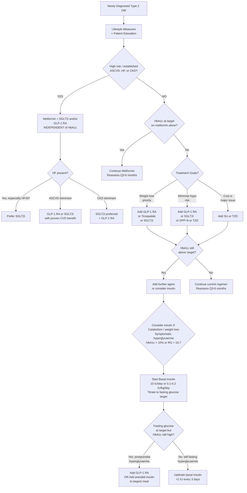

## Management of Diabetes Mellitus

---

### 11.1 Principles of Management

***Comprehensive Management of Diabetes:*** [11]
1. ***Patient education and support — healthy lifestyle, self-management; team approach*** [11]
2. ***Treatment of diabetes — diet, oral drugs, GLP-1 agonists and co-agonists; insulin*** [11]
3. ***Treatment of associated coronary risk factors — hypertension, ↑ lipids, smoking, physical inactivity, obesity*** [11]
4. ***Individualised treatment targets/choices*** [11]
5. ***Regular assessment for complications*** [11]

Think of DM management as a **four-pillar** structure:

| Pillar | Components |
|---|---|
| **Lifestyle** | Diet, exercise, weight management, smoking cessation, alcohol moderation |
| **Glycaemic control** | OHAs, GLP-1 RAs, insulin — individualised to patient |
| **Cardiovascular risk reduction** | BP control, lipid lowering, anti-platelet therapy where indicated |
| **Complication surveillance** | Annual microvascular screening, foot care, immunisations |

---

### 11.2 Glycaemic Targets

***Assessment of glycaemic control:*** [2]
- ***HbA1c: ≥ Q6 months in stable disease, ≥ Q3 months in those not meeting goals or changing Rx*** [2]
- ***Home blood sugar monitoring (HBSM): in those using intensive insulin therapy*** [2]
  - ***Timing: before meals/snacks, at bedtime, before exercise, when suspecting hypoglycaemia, and after treating hypoglycaemia until normoglycaemia, before critical tasks (e.g. driving)*** [2]
- ***Continuous glucose monitoring (CGM): especially in those suspecting nocturnal hypoglycaemia, morning hyperglycaemia due to Somogyi response or Dawn phenomenon, or postprandial hyperglycaemia*** [2]

> **Somogyi response** = nocturnal hypoglycaemia → counter-regulatory hormone surge → rebound morning hyperglycaemia (treat by ↓ evening insulin). **Dawn phenomenon** = early morning cortisol/GH surge → ↑ hepatic gluconeogenesis → morning hyperglycaemia (treat by ↑ evening basal insulin or shifting it later). CGM helps distinguish the two.

***HbA1c goals: individualised to patient profile*** [2]

| ***More Stringent (< 6.5%)*** | ***Standard (≤ 7%)*** | ***Less Stringent (< 8–9%)*** |
|---|---|---|
| ***Early DM with little comorbidities*** | ***Most adults*** | ***History of severe hypoglycaemia*** |
| ***Little ↑ risk of hypoglycaemia*** | ***Fasting glucose 4.4–7.2 mmol/L*** | ***Extremes of age (↑ risk of hypo)*** |
| ***Long life expectancy*** | ***Postprandial glucose < 10.0 mmol/L*** | ***Multiple comorbidities (e.g. cardiac patient)*** |
| ***T2DM on metformin/lifestyle only*** | | ***Limited life expectancy*** |
| ***No significant CVD*** | | ***Long-standing DM with established complications*** |

<Callout title="Why Not Just Aim for Normal HbA1c in Everyone?">
The ACCORD, ADVANCE, and VADT trials showed that **aggressive glycaemic control** (HbA1c < 6.0–6.5%) in older patients with established CVD **increased mortality** (particularly in ACCORD) — likely from hypoglycaemia-triggered arrhythmias and other adverse effects. The benefit of tight control is greatest in **younger patients, early in the disease course, without CVD**. Hence the individualised targets.
</Callout>

---

### 11.3 Treatment Algorithm Overview

***Choice of treatment:*** [2]
- ***T1DM: lifestyle measures + insulin***
- ***T2DM:***
  - ***Lifestyle measures alone in early stages (1st line)***
  - ***Lifestyle measures + oral hypoglycaemics if relative insulin insufficiency***
  - ***Lifestyle measures + insulin if absolute insulin insufficiency (advanced)***

***Management of hyperglycaemia in type 2 diabetes (ADA):*** [11]

***Healthy lifestyle + medication choice according to treatment goals:*** [11]
1. ***Reduction of cardiovascular and renal risk if high risk or established CVD/CKD: SGLT2i (especially if heart failure+), GLP-1 RA or both preferred; avoid TZD and saxagliptin if heart failure*** [11]
2. ***Achievement of weight and glycaemic goals*** [11]
   - ***Metformin: glycaemic and weight effects superior to DPP-4i and sulphonylurea*** [11]
   - ***Increasing emphasis on weight as treatment goal: for glycaemia, CVD, and steatotic liver disease reduction — SGLT2i / GLP-1 RA / tirzepatide*** [11]
   - ***Compelling need to minimise hypoglycaemia: assess need/dosage of drugs with higher risk (sulfonylureas, meglitinides, and insulin)*** [11]
   - ***Initial combination therapy should be considered if presenting with HbA1c levels 1.5–2.0% above individualised goal*** [11]
   - ***Consider accessibility and cost of medications*** [11]

---

### 11.4 Lifestyle Measures

#### 11.4.1 Dietary Management

***Dietary management: integral part of therapy for all patients with diabetes*** [11]

***General guidelines:*** [11]
- ***30 kcal/kg ideal body weight per day, with adjustments depending on lifestyle and body weight*** [11]
- ***Aim at achieving normal body weight*** [11]
- ***Composition:*** [11][2]
  - ***40–50% carbohydrates***
  - ***30% fat (< 7% saturated fat)***
  - ***20–30% protein***
  - ***Fibre intake 20–35 g per day***

***Other dietary advice:*** [2]
- ***Personalised according to individual preference and culture***
- ***Consistency of meal timing and quantity, especially if on insulin*** (to avoid hypoglycaemia and postprandial hyperglycaemia)
- ***Emphasis on ↑ fibre food, low-fat dairy products, and fresh fish***
- ***Minimise high-energy food, especially those with high glycaemic index (GI) and glycaemic load (GL)*** [2]
- ***Hypocaloric diet for obese T2DM patients*** [2]

> **Glycaemic Index (GI)** = a ranking of how quickly a carbohydrate-containing food raises blood glucose compared to pure glucose. Low-GI foods (< 55) cause a slower, steadier rise (e.g. legumes, whole grains). **Glycaemic Load (GL)** = GI × carbohydrate content per serving — a more practical measure of the actual glycaemic impact of a typical portion. [2]

#### 11.4.2 Exercise

***Exercise:*** [2]
- ***30–60 minutes moderate-intensity aerobic activity on most days of the week***
- ***Resistance training ≥ 2 times per week***
- ***Adequately but not excessively*** — especially if on insulin → risk of hypoglycaemia [2]

#### 11.4.3 Weight Management

***Weight management:*** [2]
- ***Dietician input, drug/operative treatment in severe cases***
- ***Intensive clinician-supervised caloric restriction results in 46% remission at 1 year (DiRECT trial)*** [2]
- ***Alcohol in moderation*** (alcoholic beverages often also associated with caloric intake) [2]

**Bariatric surgery** for DM: [12]
- ***Indications in Asians: failed medical treatment +*** [12]
  - ***BMI ≥ 35***
  - ***BMI ≥ 30 with T2DM***
- ***Effect on metabolic syndrome: may achieve DM remission due to change in gut hormone levels (GLP-1)*** [12]
- ***ABCD score: Age, BMI, C-peptide, Duration of DM — total score = 10; score > 6 predicts DM remission after bariatric surgery*** [12]
- ***Contraindications: reversible causes (e.g. endocrine), psychiatric disorders, active substance abuse, non-compliance to medical care*** [12]

---

### 11.5 Oral Hypoglycaemic Agents (OHAs)

***Mainly used in T2DM patients*** [2]

***General approach (based on ADA):*** [2]
- ***Metformin + lifestyle modification for majority of patients at diagnosis***
- ***Continue metformin as long as tolerated and not contraindicated***
- ***Re-evaluate Q3–6 months and adjust medication regimen if glycaemic target not reached***
- ***Prefer SGLT2i or GLP-1 RA for high risk or established ASCVD, CKD (independent of HbA1c target)***
- ***Prefer SGLT2i for established HF, especially HFrEF (independent of HbA1c target)***
- ***Consider early combination therapy for selected patients with poor glycaemic control to extend time to treatment failure***
- ***Consider early insulin therapy for patients with (1) evidence of ongoing catabolism (e.g. weight loss), (2) symptomatic hyperglycaemia, (3) severe hyperglycaemia (HbA1c > 10%, random glucose ≥ 16.7 mmol/L)*** [2]

#### 11.5.1 Drug Classes — Mechanisms, Key Points, Indications, and Contraindications

**A. Biguanides — Metformin**

| Feature | Detail |
|---|---|
| **Name breakdown** | "Met-formin" — derived from *Galega officinalis* (French lilac); a biguanide (two guanidine groups linked together) |
| **Mechanism** | ↓ Hepatic gluconeogenesis (primary effect via AMPK activation); ↑ peripheral insulin sensitivity; ↓ intestinal glucose absorption. Does NOT stimulate insulin secretion → does NOT cause hypoglycaemia as monotherapy |
| **Efficacy** | HbA1c ↓ ~1.0–1.5%; ***glycaemic and weight effects superior to DPP-4i and sulphonylurea*** [11] |
| **Weight effect** | Weight-neutral to modest weight loss |
| **Cardiovascular benefit** | UKPDS showed ↓ CV mortality in overweight T2DM. First-line for most T2DM |
| **Side effects** | GI: nausea, diarrhoea, metallic taste (dose-dependent, ↓ with slow titration / extended-release). Lactic acidosis (very rare but serious). Vitamin B12 deficiency (long-term use — ↓ ileal absorption) |
| **Contraindications** | eGFR < 30 mL/min (accumulation → lactic acidosis); dose reduction at eGFR 30–45. Acute conditions predisposing to lactic acidosis: sepsis, shock, severe dehydration, hepatic failure, acute HF, significant alcohol abuse. **Withhold before iodinated contrast** (risk of AKI → metformin accumulation) and for 48h after |
| **Key exam point** | First-line for all T2DM unless contraindicated. Does NOT cause hypoglycaemia alone |

**B. Sulfonylureas (SUs)**

| Feature | Detail |
|---|---|
| **Name breakdown** | "Sulfonyl-urea" = sulfone group + urea group. Examples: gliclazide, glimepiride, glibenclamide |
| **Mechanism** | Bind to SUR1 subunit of K_ATP channels on β-cells → channel closure → depolarisation → insulin secretion. They essentially bypass the glucose-sensing step — forcing insulin release regardless of glucose level |
| **Efficacy** | HbA1c ↓ ~1.0–1.5% |
| **Weight effect** | Weight gain (insulin is anabolic + patients eat to avoid hypoglycaemia) |
| **Side effects** | **Hypoglycaemia** (the main concern — especially with long-acting agents like glibenclamide); weight gain |
| **Contraindications** | Severe hepatic/renal impairment (↑ risk of prolonged hypoglycaemia); pregnancy; T1DM |
| **Key exam point** | ***Compelling need to minimise hypoglycaemia: assess need/dosage of SUs*** [11]. ***Choose later-generation SU with lower risk of hypoglycaemia*** [2] — gliclazide MR preferred over glibenclamide. ***MODY 1/3 patients are very sensitive to SUs*** [2] |

**C. Meglitinides (Glinides)**

| Feature | Detail |
|---|---|
| **Examples** | Repaglinide, nateglinide |
| **Mechanism** | Same as SUs (K_ATP channel closure) but bind to a different site, have rapid onset and short duration → "prandial insulin releasers" |
| **When to use** | Patients with erratic meal schedules; taken just before each meal |
| **Side effects** | Hypoglycaemia (less than SUs due to shorter action); weight gain |
| **Contraindications** | Severe hepatic impairment |

**D. Thiazolidinediones (TZDs / Glitazones)**

| Feature | Detail |
|---|---|
| **Name breakdown** | "Thiazolidine-dione" = chemical structure; "glitazone" = class suffix. Example: pioglitazone |
| **Mechanism** | PPARγ agonist → ↑ adiponectin, ↑ expression of glucose transporters, ↓ FFA levels → ↑ insulin sensitivity in adipose tissue, muscle, and liver. Takes 6–12 weeks for full effect (gene transcription changes) |
| **Efficacy** | HbA1c ↓ ~0.5–1.4% |
| **Weight effect** | Weight gain (fluid retention + adipocyte differentiation) |
| **Side effects** | Fluid retention → oedema, exacerbation of HF; bone fractures (↑ osteoclast, ↓ osteoblast via PPARγ); bladder cancer (pioglitazone — controversial) |
| **Contraindications** | ***Avoid TZD and saxagliptin if heart failure*** [11]; active liver disease; bladder cancer (pioglitazone) |
| **Key exam point** | The fluid retention/HF risk is the major limitation. Rosiglitazone was withdrawn from many markets due to CV concerns |

**E. DPP-4 Inhibitors (Gliptins)**

| Feature | Detail |
|---|---|
| **Name breakdown** | "DPP-4" = dipeptidyl peptidase-4; "gliptin" = class suffix. Examples: sitagliptin, linagliptin, saxagliptin, vildagliptin |
| **Mechanism** | DPP-4 normally degrades incretin hormones (GLP-1 and GIP). DPP-4 inhibitors → ↑ endogenous GLP-1/GIP → ↑ glucose-dependent insulin secretion, ↓ glucagon secretion. Because the effect is glucose-dependent, **low risk of hypoglycaemia** |
| **Efficacy** | HbA1c ↓ ~0.5–0.8% (modest) |
| **Weight effect** | Weight-neutral |
| **Side effects** | Generally well-tolerated. Rare: pancreatitis (debated), nasopharyngitis, urticaria. Saxagliptin: ↑ HF hospitalisation (SAVOR-TIMI 53 trial) |
| **Contraindications** | ***Avoid saxagliptin if HF*** [11]. Do NOT use with GLP-1 RA (redundant mechanism). Dose adjustment needed in renal impairment (except linagliptin — hepatic excretion) |

**F. SGLT2 Inhibitors (Gliflozins)**

| Feature | Detail |
|---|---|
| **Name breakdown** | "SGLT2" = sodium-glucose co-transporter 2 (responsible for ~90% of glucose reabsorption in the proximal tubule); "gliflozin" = class suffix. Examples: empagliflozin, dapagliflozin, canagliflozin |
| **Mechanism** | Block SGLT2 in the proximal renal tubule → ↓ glucose reabsorption → glycosuria → ↓ plasma glucose. Also causes osmotic diuresis and natriuresis → ↓ preload, ↓ BP. Additional mechanism: ↓ intraglomerular pressure (tubuloglomerular feedback — ↑ Na delivery to macula densa → afferent arteriolar vasoconstriction → ↓ hyperfiltration) |
| **Efficacy** | HbA1c ↓ ~0.5–1.0% |
| **Weight effect** | Weight loss (~2–3 kg — caloric loss through glycosuria) |
| **CV/Renal benefits** | ***SGLT2i with proven benefit in HF (especially HFrEF)*** [2][11]; ↓ MACE in ASCVD (EMPA-REG, CANVAS); ↓ CKD progression (CREDENCE, DAPA-CKD). Benefits are **independent of glycaemic effect** — hence used even in non-diabetic HF and CKD |
| **Side effects** | Genital mycotic infections (glycosuria → Candida); UTIs; volume depletion/hypotension (especially in elderly on diuretics); euglycaemic DKA (rare but important — ketogenesis from insulin reduction + FFA mobilisation despite normal glucose); Fournier's gangrene (very rare) |
| **Contraindications** | eGFR < 20 mL/min (↓ efficacy for glycaemic control; still may have cardio-renal benefits); recurrent genital mycotic infections; T1DM (unless specialist supervision — risk of euDKA) |
| **Perioperative** | ***SGLT2i: risk of perioperative euglycaemic DKA*** [12]. ***Omit 1 day before minor surgery, 2 days before major surgery. Check plasma β-OHB; if > 0.6 mmol/L, risk of euDKA*** [12] |

<Callout title="Why SGLT2i Are So Important in 2025">
SGLT2 inhibitors have fundamentally changed DM management. They are now indicated not just for glycaemic control, but for **cardio-renal protection** — even independently of glucose lowering. The ADA 2025 guidelines recommend SGLT2i (or GLP-1 RA) for ALL T2DM patients with established ASCVD, HF, or CKD **regardless of HbA1c**. In HFrEF, SGLT2i are now standard of care even in non-diabetic patients.
</Callout>

**G. GLP-1 Receptor Agonists (GLP-1 RAs)**

| Feature | Detail |
|---|---|
| **Name breakdown** | "GLP-1" = glucagon-like peptide-1 (an incretin hormone released by L-cells of the ileum after meals); "receptor agonist" = activates the GLP-1 receptor. Examples: semaglutide (Ozempic, Rybelsus), liraglutide (Victoza), dulaglutide (Trulicity), exenatide |
| **Mechanism** | Activate GLP-1 receptors → (1) ↑ glucose-dependent insulin secretion; (2) ↓ glucagon secretion; (3) ↓ gastric emptying (→ ↑ satiety, ↓ postprandial glucose); (4) central appetite suppression (hypothalamus). Glucose-dependent → low hypo risk |
| **Efficacy** | HbA1c ↓ ~1.0–1.8% (among the most potent OHAs) |
| **Weight effect** | Significant weight loss (~3–7 kg; semaglutide up to 10–15% body weight at higher doses) |
| **CV benefit** | ↓ MACE in ASCVD (LEADER, SUSTAIN-6, REWIND trials). ***GLP-1 RA with proven CVD benefit preferred for ASCVD*** [2] |
| **Side effects** | GI: nausea, vomiting, diarrhoea (dose-dependent, usually transient); pancreatitis (rare, debated); injection site reactions; medullary thyroid carcinoma (MTC) — seen in rodents, uncertain in humans (C-cell hyperplasia) |
| **Contraindications** | Personal/family history of MTC or MEN2; history of pancreatitis (relative); do not combine with DPP-4i (redundant); severe gastroparesis |
| **Route** | SC injection (weekly: semaglutide, dulaglutide; daily: liraglutide) or oral (semaglutide — Rybelsus, taken fasting with minimal water) |

**H. Dual GIP/GLP-1 Receptor Agonists (Twincretins)**

| Feature | Detail |
|---|---|
| **Example** | ***Tirzepatide*** (Mounjaro) [11] |
| **Mechanism** | Dual agonist of both GIP (glucose-dependent insulinotropic polypeptide) and GLP-1 receptors → synergistic incretin effect → potent glucose lowering + substantial weight loss |
| **Efficacy** | HbA1c ↓ ~2.0–2.5% (most potent injectable to date); weight loss up to 15–20% |
| **Key exam point** | ***Increasing emphasis on weight as treatment goal: SGLT2i / GLP-1 RA / tirzepatide*** [11]. Represents the cutting edge of T2DM pharmacotherapy as of 2025 |

**I. Alpha-Glucosidase Inhibitors**

| Feature | Detail |
|---|---|
| **Example** | Acarbose |
| **Mechanism** | Inhibits α-glucosidase enzymes in the small intestinal brush border → delays digestion/absorption of complex carbohydrates → ↓ postprandial glucose spike |
| **Efficacy** | HbA1c ↓ ~0.5–0.8% |
| **Side effects** | GI: flatulence, bloating, diarrhoea (undigested carbohydrates fermented by colonic bacteria). Limit compliance. |
| **Contraindications** | IBD, intestinal obstruction, severe renal impairment |
| **Key point** | Particularly popular in Asia (high-carbohydrate diets). If hypoglycaemia occurs while on acarbose + SU/insulin, must treat with **pure glucose** (not sucrose/complex carbs, as acarbose blocks their digestion) |

#### 11.5.2 Summary Comparison Table of OHAs

| Drug Class | HbA1c Reduction | Hypo Risk | Weight Effect | CV Benefit | Renal Benefit | Key C/I |
|---|---|---|---|---|---|---|
| **Metformin** | 1.0–1.5% | Low | Neutral/↓ | Possible (UKPDS) | — | eGFR < 30 |
| **Sulfonylureas** | 1.0–1.5% | **HIGH** | ↑ | Neutral | — | Severe renal/hepatic |
| **Meglitinides** | 0.5–1.0% | Moderate | ↑ | Neutral | — | Severe hepatic |
| **TZDs** | 0.5–1.4% | Low | ↑↑ | Neutral (pioglitazone may ↓) | — | **HF**, liver disease |
| **DPP-4i** | 0.5–0.8% | Low | Neutral | Neutral | — | Saxagliptin: HF |
| **SGLT2i** | 0.5–1.0% | Low | ↓↓ | **YES** (ASCVD, HF) | **YES** (CKD) | eGFR < 20 |
| **GLP-1 RA** | 1.0–1.8% | Low | ↓↓↓ | **YES** (ASCVD) | Moderate | MTC/MEN2 |
| **Tirzepatide** | 2.0–2.5% | Low | ↓↓↓↓ | Pending | Pending | MTC/MEN2 |
| **Acarbose** | 0.5–0.8% | Low | Neutral | — | — | IBD, obstruction |

---

### 11.6 Insulin Therapy

***Indications of insulin treatment:*** [2]
- ***T1DM: basal-bolus regimen at onset***
- ***T2DM when:***
  - ***Features of absolute insulin insufficiency, e.g. marked recent weight loss, marked ketosis***
  - ***Failed oral therapy***
  - ***Clinically ill, e.g. dehydrated, infection, MI***
  - ***Pregnancy***

#### 11.6.1 Types of Insulin

***Forms of insulin:*** [2]

| Category | Examples | Onset | Peak | Duration | Role |
|---|---|---|---|---|---|
| ***Rapid-acting analogues*** | ***Insulin Aspart (NovoRapid), Insulin Lispro (Humalog)*** | 5–15 min | 1–2h | 3–5h | **Prandial** (bolus) — covers postprandial glucose spikes |
| ***Short-acting (regular)*** | ***Actrapid, Humulin R*** | 30–60 min | 2–4h | 6–8h | **Prandial** — also used IV in DKA/HHS |
| ***Intermediate-acting*** | ***Insulin NPH (Protaphane)*** | 1–2h | 4–8h | 12–18h | **Basal** — often given BD or bedtime |
| ***Long-acting analogues*** | ***Insulin Degludec (Tresiba), Insulin Glargine (Lantus)*** | 1–2h | Peakless (flat profile) | 24–42h | **Basal** — once daily, minimal hypo risk |
| ***Pre-mixed*** | ***NovoMix 70/30, Humalog Mix 75/25*** | Variable | Biphasic | Variable | Combined basal + prandial — convenient but less flexible |

#### 11.6.2 Insulin Regimens

***Insulin regimens:*** [2]

| Regimen | Suitable For | Example |
|---|---|---|
| ***Basal insulin only*** | Fasting hyperglycaemia only | ***Protaphane 10U bedtime, Tresiba/Lantus 10U OM/bedtime*** |
| ***Daily/BD insulin*** | Daytime hyperglycaemia | ***Protaphane 10U OM; pre-mixed BD*** |
| ***Basal-bolus insulin*** | Difficult titration or T1DM | ***Tresiba 12U + NovoRapid 8/6/6*** |

***Initiation and titration (for T2DM starting basal insulin):*** [2]
- ***Start 10 IU/day or 0.1–0.2 IU/kg/day***
- ***Titration: increase 2 IU every 3 days to reach fasting glucose target without hypoglycaemia***
- ***For hypoglycaemia: determine cause; if no clear reason, lower dose by 10–20%***

***Assessing adequacy of basal insulin:*** [2]
- ***Consider clinical signals for overbasalisation and need for adjunctive therapy: basal dose > 0.5 IU/kg, elevated bedtime-to-morning or pre/postprandial differential, hypoglycaemia (aware or unaware), high variability***

> When basal insulin alone doesn't achieve target, the next step is:
> 1. ***Consider GLP-1 RA addition prior to prandial insulin*** [2] (weight benefit, lower hypo risk)
> 2. If GLP-1 RA not appropriate or already on it: add **prandial insulin** — usually one dose with the largest meal first, then stepwise additional injections
> 3. Full basal-bolus regimen as needed

#### 11.6.3 Insulin Side Effects

| Side Effect | Mechanism | Management |
|---|---|---|
| **Hypoglycaemia** | Excess insulin relative to glucose intake/production | Patient education, HBSM, dose adjustment, consistent meals |
| **Weight gain** | Insulin is anabolic (↑ lipogenesis, ↓ glycosuria) + patients eat to prevent hypos | Combine with metformin/GLP-1 RA/SGLT2i to offset |
| **Lipohypertrophy** | Repeated injection at same site → local insulin-induced lipogenesis | Rotate injection sites |
| **Lipoatrophy** | Immune reaction to insulin (rare with modern analogues) | Switch insulin type; rotate sites |
| **Injection site reactions** | Local allergy / irritation | Usually transient; switch preparation if persistent |

---

### 11.7 Cardiovascular Risk Factor Management

***Treatment of associated coronary risk factors:*** [11]

| Risk Factor | Target | Treatment |
|---|---|---|
| **Hypertension** | < 130/80 mmHg (most DM patients) | ACEI/ARB first-line (also renoprotective); add CCB or thiazide if needed. ***Nephropathy: renin-angiotensin blockade (ACE inhibitors, ARB)*** [11] |
| **Dyslipidaemia** | LDL-C < 1.8 mmol/L (very high risk: < 1.4) | High-intensity statin (atorvastatin 40–80mg / rosuvastatin 20–40mg). ***DM: aim HbA1c < 7%, consider SGLT2i or GLP-1 RA*** [13]; ***↓ LDL to < 1.8 mmol/L with lifestyle and drug*** [13] |
| **Smoking** | Cessation | Counselling, NRT, varenicline, bupropion |
| **Obesity** | BMI ≤ 23 (Asian) | Lifestyle, GLP-1 RA/tirzepatide, bariatric surgery if indicated |
| **Anti-platelet** | Low-dose aspirin for secondary prevention (or primary if ≥ 50 with additional CV risk factors) | Aspirin 75–100 mg/day. Clopidogrel if aspirin-intolerant |

---

### 11.8 Treatment of Chronic Complications — Principles

***Treatment of chronic complications — principles:*** [11]

***Overt complications (albuminuria, moderately severe retinopathy, clinical neuropathy):*** [11]

***Progression slowed by:*** [11]
- ***General: ↑ glycaemic control; risk factor management (hypertension, hyperlipidaemia, smoking)***
- ***Specific: e.g. nephropathy — renin-angiotensin blockade (ACE inhibitors, ARB); SGLT2 inhibitors; GLP-1 receptor agonists; finerenone*** [11]
- ***Symptomatic — dialysis / transplantation; pain relief***
- ***Prevention of drastic consequences — laser therapy; foot care*** [11]

> **Finerenone** is a non-steroidal mineralocorticoid receptor antagonist (MRA) — it ↓ inflammation and fibrosis in the kidney and heart. The FIDELIO-DKD and FIGARO-DKD trials showed ↓ CKD progression and ↓ CV events in T2DM with CKD. It represents a new pillar in diabetic nephropathy management alongside ACEI/ARB and SGLT2i. [11]

---

### 11.9 Perioperative Management

***Perioperative management of DM:*** [12]

***Principles:*** [12]
- ***Maintain stable circulating glucose levels (6–10 mmol/L)***
- ***Prevent hypoglycaemia: moderate hyperglycaemia is tolerated***

| Patient Category | Management |
|---|---|
| ***Diet-controlled*** | ***Monitor BG until eating*** |
| ***Oral hypoglycaemics*** | ***Omit morning dose. Monitor BG pre- and post-op until eating normally. Restart when on normal diet. Switch to DKI if BG > 10 or poorly controlled*** |
| ***DM on insulin*** | ***Omit morning dose. Monitor BG. Restart when on normal diet (± bridging with short-acting insulin). Start DKI if major surgery. If BG > 20 / ketonuria: treat as DKA!*** |

***DKI = Dextrose/Potassium/Insulin drip — Alberti regimen: 500 mL D10 + 10U short-acting insulin + 10 mmol KCl, monitor BG Q2–6h*** [12]

***SGLT2i perioperative management:*** [12]
- ***Elective surgery: omit SGLT2i 1 day before minor surgery, 2 days before major surgery***
- ***Emergency surgery: stop SGLT2i ASAP; check plasma β-OHB, H'stix, ABG***
  - ***β-OHB < 0.6: proceed with surgery***
  - ***β-OHB > 0.6: risk of euDKA — check ABG, treat any DKA, postpone OT***
- ***Re-initiation: resume if clinically well, no surgical complications, well-hydrated; suspend if bariatric surgery*** [12]

---

### 11.10 Special Populations

#### 11.10.1 Type 1 DM Management

***T1DM: lifestyle measures + insulin*** [2]
- **Basal-bolus** is standard of care (multiple daily injections or insulin pump/CSII)
- ***Glycaemic control for T1DM: education important to match prandial insulin doses to carbohydrate intake, pre-meal H'stix, and anticipated physical activity*** [2]
- Consider CGM + insulin pump (closed-loop/hybrid closed-loop "artificial pancreas" systems) for improved control
- ***TFT ± anti-tTG IgA at diagnosis for concomitant autoimmune diseases*** [9]

#### 11.10.2 Gestational DM

- **First-line**: lifestyle modifications (diet + exercise)
- **If targets not met**: insulin is the preferred pharmacological agent (does not cross placenta)
- Metformin may be used in some guidelines as second-line (crosses placenta — long-term effects on fetus uncertain)
- Sulfonylureas: glibenclamide sometimes used but falling out of favour (neonatal hypoglycaemia)
- **Postpartum**: recheck glucose at 6–12 weeks (OGTT) — high risk of future T2DM (***50% DM on long-term follow-up*** [3])

---

<Callout title="High Yield Summary">

**Treatment Algorithm for T2DM (ADA 2025):** Lifestyle + metformin first-line. If ASCVD/HF/CKD present → add SGLT2i and/or GLP-1 RA regardless of HbA1c. If no ASCVD/HF/CKD → choose second agent based on weight goals (GLP-1 RA, tirzepatide, SGLT2i), hypo avoidance (avoid SU), or cost (SU, TZD). Reassess Q3-6 months.

**Metformin:** First-line for nearly all T2DM. ↓ Hepatic gluconeogenesis. No hypo as monotherapy. C/I: eGFR < 30, lactic acidosis risk states. Withhold before contrast.

**SGLT2i:** ↓ Renal glucose reabsorption → glycosuria. Proven CV (ASCVD, HF) and renal (CKD) benefits independent of glucose lowering. Risk: genital infections, euglycaemic DKA (especially perioperative — omit 1-2 days before surgery). Preferred in HFrEF.

**GLP-1 RA:** ↑ Glucose-dependent insulin secretion, ↓ glucagon, ↓ appetite, ↓ gastric emptying. Potent weight loss. Proven ↓ MACE in ASCVD. C/I: MTC/MEN2 history.

**Tirzepatide:** Dual GIP/GLP-1 agonist. Most potent glucose lowering and weight loss of any injectable.

**Insulin:** Required in all T1DM and advanced T2DM. Basal-bolus for T1DM. Start basal insulin 10 IU or 0.1-0.2 IU/kg in T2DM; titrate +2 IU every 3 days. Consider GLP-1 RA before adding prandial insulin.

**Glycaemic targets:** HbA1c ≤ 7% for most adults (FG 4.4-7.2, PPG < 10). More stringent < 6.5% if early DM, low hypo risk, long life expectancy. Less stringent < 8-9% if elderly, multiple comorbidities, frequent hypos.

**CV risk management:** BP < 130/80 (ACEI/ARB first-line); LDL < 1.8 (high-intensity statin); aspirin for secondary prevention; smoking cessation.

**Perioperative:** Omit OHAs morning of surgery. DKI for major surgery or poor control. Omit SGLT2i 1-2 days pre-op; check β-OHB if emergency. Target BG 6-10 mmol/L.

**Bariatric surgery:** BMI ≥ 35 or ≥ 30 with T2DM in Asians. ABCD score > 6 predicts remission.

</Callout>

---

<ActiveRecallQuiz
  title="Active Recall - Management of Diabetes Mellitus"
  items={[
    {
      question: "A 58-year-old T2DM patient with established heart failure with reduced ejection fraction has an HbA1c of 6.8% on metformin alone. According to ADA 2025 guidelines, what should you add and why?",
      markscheme: "Add an SGLT2 inhibitor (e.g. empagliflozin or dapagliflozin), regardless of HbA1c level. SGLT2i have proven benefit in HFrEF (DAPA-HF, EMPEROR-Reduced trials) independent of glycaemic control. They reduce preload via natriuresis/osmotic diuresis and reduce intraglomerular pressure. Avoid TZD and saxagliptin which worsen HF.",
    },
    {
      question: "Explain the mechanism of euglycaemic DKA with SGLT2 inhibitors and outline perioperative management.",
      markscheme: "Mechanism: SGLT2i cause glycosuria which lowers blood glucose. The lower glucose leads to reduced insulin secretion and increased glucagon, promoting lipolysis and hepatic ketogenesis. Blood glucose may be normal or mildly elevated but ketones are significantly raised causing metabolic acidosis. Perioperative: omit SGLT2i 1 day before minor surgery, 2 days before major surgery. For emergency surgery: stop ASAP, check beta-OHB. If beta-OHB > 0.6, risk of euDKA - check ABG, treat DKA, consider postponing surgery.",
    },
    {
      question: "A patient with T2DM is started on basal insulin at bedtime. Their fasting glucose is at target but HbA1c remains 8.5%. What is the likely cause and what is your next step?",
      markscheme: "The likely cause is postprandial hyperglycaemia (fasting controlled but daytime glucose spikes not addressed by basal insulin alone). Next step (per ADA algorithm): consider adding a GLP-1 RA first (slows gastric emptying, suppresses glucagon, promotes weight loss, lower hypo risk than prandial insulin). If GLP-1 RA not appropriate, add prandial rapid-acting insulin with the largest meal, then stepwise to other meals if needed.",
    },
    {
      question: "Name three drug classes that should be avoided or used with caution in a T2DM patient with heart failure, and explain why for each.",
      markscheme: "1. TZDs (pioglitazone) - cause fluid retention via PPARgamma-mediated renal sodium reabsorption, worsening HF. 2. Saxagliptin (DPP-4i) - SAVOR-TIMI 53 trial showed increased HF hospitalisation (mechanism unclear). 3. Insulin at high doses - causes sodium and water retention, weight gain, potentially worsening fluid overload. Also consider avoiding long-acting sulfonylureas (hypoglycaemia can trigger arrhythmias in cardiac patients).",
    },
    {
      question: "What is the Alberti regimen and when is it used?",
      markscheme: "The Alberti regimen is a DKI (dextrose-potassium-insulin) infusion used for perioperative glycaemic control: 500 mL D10 + 10 units short-acting insulin + 10 mmol KCl, with BG monitoring every 2-6 hours. Used when diabetic patients (especially those on insulin or with poorly controlled DM) undergo major surgery and cannot eat, to maintain stable glucose levels of 6-10 mmol/L.",
    },
    {
      question: "Compare the advantages of GLP-1 receptor agonists over sulfonylureas as add-on therapy to metformin in T2DM.",
      markscheme: "GLP-1 RAs: (1) Low hypoglycaemia risk (glucose-dependent action) vs SUs (high hypo risk, glucose-independent insulin secretion). (2) Significant weight loss vs SU-associated weight gain. (3) Proven CV benefit (reduced MACE in ASCVD) vs SUs (neutral). (4) Appetite suppression and slowed gastric emptying (additional mechanisms). Disadvantages of GLP-1 RA: injection required (mostly), higher cost, GI side effects (nausea), rare pancreatitis risk.",
    },
  ]}
/>

## References

[2] Senior notes: Ryan Ho Endocrine.pdf (pp. 81–85, 90)
[3] Lecture slides: GC 078. Polyuria and polydipsia glucose metabolism, diabetes mellitus, diabetic ketoacidosis [Update 2025] (1).pdf (pp. 11, 16)
[9] Senior notes: Ryan Ho Endocrine.pdf (p. 94)
[11] Lecture slides: GC 042. Deterioration of eyesight in a diabetic patient diabetic complications [Update 2025] (1).pdf (pp. 15, 17, 35, 36)
[12] Senior notes: maxim.md (perioperative management of DM, bariatric surgery)
[13] Senior notes: Ryan Ho Cardiology.pdf (p. 120)
