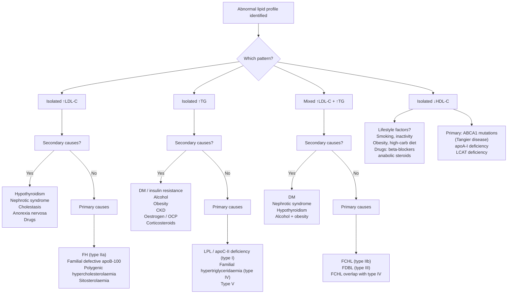

## Differential Diagnosis of Dyslipidaemia

---

### Framing the Problem

When we talk about the "differential diagnosis of dyslipidaemia," we are really asking two interlinked questions:

1. **What is the underlying cause of the abnormal lipid profile?** — i.e., primary (genetic) vs. secondary (acquired) dyslipidaemia.
2. **When a patient presents with a clinical feature suggestive of dyslipidaemia (e.g., xanthomas, premature ASCVD, pancreatitis, or an incidental deranged lipid panel), what conditions must I consider?**

This is a fundamentally different exercise from, say, the differential of "chest pain." Here, the lipid profile result is usually already in hand, so the clinical task is **pattern recognition** — identifying the biochemical pattern and then systematically working through what could be causing it.

Think of it like being a detective: the lipid panel gives you the crime scene evidence (↑LDL? ↑TG? Both? ↓HDL?), and you work backwards to the culprit.

---

### The Diagnostic Thinking Framework

---

### 1. Differential Diagnosis by Biochemical Pattern

The first step is always: **look at the numbers and decide the pattern**. This immediately narrows your differential.

#### 1A. Isolated Elevated LDL-C (Hypercholesterolaemia)

| Category | Condition | Key Distinguishing Features | Mechanism |
|----------|-----------|----------------------------|-----------|
| **Primary** | ***Familial hypercholesterolaemia (FH, type IIa)*** [6] | ***Tendon xanthomas (pathognomonic), corneal arcus < 45y, xanthelasma; LDL-C ≥4.9 mmol/L (without FHx) or ≥6.2 (with FHx); premature ASCVD; FHx of early CVD/sudden cardiac death; AD inheritance*** | ***Mutations in LDLR (~90%), apoB-100 (~5%), or PCSK9 gain-of-function (~1%) → defective LDL uptake by hepatocytes → markedly ↑circulating LDL-C*** [2, 6] |
| | Familial defective apoB-100 (FDB) | Clinically indistinguishable from heterozygous FH but milder; moderate ↑LDL-C | Mutation in apoB-100 (Arg3500Gln most common) → LDL cannot bind LDLr properly → ↓LDL clearance |
| | Polygenic hypercholesterolaemia | Most common cause of moderate ↑LDL-C in the population; no dramatic physical signs; modest FHx; LDL-C usually 3.5–5.5 mmol/L | Multiple common genetic variants (SNPs), each with small effect, combined with environmental factors (diet, obesity) → cumulative ↑LDL-C |
| | ***Autosomal recessive hypercholesterolaemia (ARH)*** [2] | ***Clinical phenotype similar to homozygous FH but AR inheritance; important d/dx when diagnosing FH*** | ***↓LDLRAP1 expression, sitosterolaemia (ABCG5/G8 deficiency), CYP7A1 deficiency*** [2] |
| **Secondary** | ***Hypothyroidism*** | Fatigue, weight gain, cold intolerance, constipation, bradycardia, delayed relaxation of reflexes; ↑TSH, ↓fT4 | ***↓Thyroid hormone → ↓LDLr gene expression → ↓hepatic LDL clearance → ↑LDL-C.*** Also ↓bile acid excretion and ↓cholesterol conversion to bile acids |
| | ***Nephrotic syndrome*** | Oedema (periorbital, pedal), proteinuria > 3.5 g/day, hypoalbuminaemia, lipiduria | Hypoalbuminaemia → liver senses ↓oncotic pressure → compensatory ↑hepatic lipoprotein synthesis (the liver upregulates protein production generally, and lipoproteins are swept up in this). Also ↓LPL activity and ↓LCAT activity → ↓HDL metabolism |
| | ***Cholestasis (obstructive jaundice)*** | Jaundice, pruritus, pale stools, dark urine; ↑conjugated bilirubin, ↑ALP, ↑GGT | Bile acid excretion blocked → bile acids accumulate → ↓bile acid-mediated cholesterol excretion → ↑intrahepatic cholesterol → ↓LDLr expression. Also formation of abnormal lipoprotein X (LP-X, rich in phospholipid and unesterified cholesterol) |
| | Anorexia nervosa | Severely underweight, amenorrhoea, lanugo hair, bradycardia | ↓Bile acid excretion + ↓LDLr activity (mechanism not fully understood; may relate to ↓thyroid hormone conversion, ↓oestrogen) |
| | ***Drugs*** | Cyclosporine, thiazides, retinoids | Variable: cyclosporine inhibits bile acid synthesis; thiazides may alter hepatic lipid metabolism |
| | ***Immunoglobulin disorder (paraproteinaemia)*** | Myeloma features: bone pain, anaemia, renal impairment; serum protein electrophoresis shows M-band | Paraproteins bind to lipoproteins or LDLr → ↓LDL clearance |

<Callout title="Exam Favourite" type="idea">
***Hypothyroidism is the single most important secondary cause to exclude in isolated hypercholesterolaemia.*** A TSH should be checked in EVERY patient with a newly discovered elevated LDL-C. Why? Because simply starting levothyroxine may normalise the lipid profile without needing a statin.
</Callout>

#### 1B. Isolated Elevated Triglycerides (Hypertriglyceridaemia)

| Category | Condition | Key Distinguishing Features | Mechanism |
|----------|-----------|----------------------------|-----------|
| **Primary** | ***Familial fasting chylomicronaemia (type I/V)*** [6] | ***AR inheritance; presents in childhood; hepatosplenomegaly, eruptive xanthomas; TG > 10 mmol/L → acute pancreatitis, lipemia retinalis, recent memory loss; lipaemic (milky) serum*** | ***LPL, apoC-II, or apoA-V deficiency → chylomicrons cannot be hydrolysed → massive chylomicronaemia*** [6] |
| | ***Familial hypertriglyceridaemia (type IV)*** [6] | ***AD inheritance; ~1% of population; moderate ↑TG (2.3–5.6); associated with metabolic syndrome (insulin resistance, obesity, ↑glucose), ↑urate*** | ***Genetically heterogeneous (LPL heterozygous, apoA-V, lipase I mutations); marked ↑TG generally only occurs with concomitant factors (acquired disease, HRT)*** [6] |
| **Secondary** | ***Type 2 DM / insulin resistance*** | Features of metabolic syndrome; ↑HbA1c, ↑fasting glucose; central obesity; acanthosis nigricans | ***Insulin resistance → ↑hepatic VLDL-TG secretion (insulin normally suppresses VLDL output) + ↓LPL activity (insulin normally stimulates LPL) → ↑TG*** [1] |
| | ***Alcohol excess*** | History of heavy drinking; ↑GGT, ↑MCV, AST:ALT > 2 | Alcohol → ↑hepatic fatty acid synthesis via ↑NADH/NAD+ ratio → ↑FFA esterification to TG → ↑VLDL-TG output |
| | ***Obesity*** | ↑BMI, central adiposity | ↑FFA delivery to liver from visceral adipose tissue → ↑VLDL-TG synthesis |
| | ***CKD / renal failure*** | ↑creatinine, ↑urea; symptoms of uraemia | ↓LPL activity + ↓hepatic lipase → ↓TG clearance; also ↑VLDL production |
| | ***Oestrogen / OCP*** | History of oral contraceptive use or HRT | Oestrogen → ↑hepatic VLDL-TG production (hepatic lipogenic effect) |
| | ***Corticosteroid excess (Cushing's / exogenous)*** [8] | ***Moon face, buffalo hump, central obesity, striae, proximal myopathy, glucose intolerance*** [8] | Cortisol → ↑lipolysis → ↑FFA → ↑hepatic VLDL-TG synthesis; also insulin resistance → same pathway as DM |
| | Glycogen storage diseases (types I, III, V, VII) | Childhood onset; hepatomegaly, hypoglycaemia | ↑hepatic glycolysis → ↑acetyl-CoA → ↑de novo lipogenesis → ↑VLDL-TG |
| | Post-prandial (physiological) | TG elevated if sample taken within 6–8 hours of eating | Normal chylomicron-TG clearance takes 6–8 hours; this is NOT pathological |

<Callout title="Clinical Pearl" type="error">
***A common trap: attributing severe hypertriglyceridaemia (TG > 10 mmol/L) to a secondary cause alone.*** While secondary causes (DM, alcohol) are common contributors, TG this high almost always has an underlying primary genetic susceptibility (e.g., heterozygous LPL mutation) unmasked by a secondary trigger. The secondary cause pushes an already vulnerable patient over the edge. Always consider BOTH.
</Callout>

#### 1C. Mixed Hyperlipidaemia (↑LDL-C + ↑TG)

| Category | Condition | Key Distinguishing Features | Mechanism |
|----------|-----------|----------------------------|-----------|
| **Primary** | ***Familial combined hyperlipidaemia (FCHL, type IIb)*** [4, 6] | ***Prevalence 0.5%; AD inheritance; ↑synthesis of apoB-100 → elevated VLDL & LDL; no distinctive clinical features; diagnosis by demonstration of multiple phenotypes in family (some members ↑LDL, some ↑TG, some both); premature CHD, xanthelasma (10%), obesity ± DM; accounts for 1/3 to 1/2 of familial CHD*** | ***↑hepatic apoB-100 + VLDL secretion → ↑VLDL (→ ↑TG) and ↑LDL (→ ↑cholesterol)*** [4, 6] |
| | ***Familial dysbetalipoproteinaemia (FDBL, type III)*** [6] | ***Rare (1 in 5,000–10,000); TC:TG ratio ≈ 2:1 during fasting; palmar xanthomas (pathognomonic); tuberoeruptive xanthomas; premature CHD and PVD*** | ***ApoE2/E2 homozygosity → apoE2 binds poorly to hepatic remnant receptors → ↓clearance of IDL and chylomicron remnants → accumulation of β-VLDL*** [6] |
| **Secondary** | ***DM, nephrotic syndrome, hypothyroidism*** [2] | Each has its own clinical features as above | Combination of mechanisms — e.g., DM causes both ↑VLDL (↑TG) and ↑small dense LDL (↑LDL-C); hypothyroidism ↓LDLr (↑LDL-C) and ↓LPL (↑TG); nephrotic syndrome ↑hepatic lipoprotein production generally |
| | ***Immunoglobulin disorders*** [2] | Paraproteinaemia features | Paraprotein-lipoprotein complexes → ↓clearance |

#### 1D. Isolated Low HDL-C

| Category | Condition | Key Features | Mechanism |
|----------|-----------|-------------|-----------|
| **Lifestyle/Acquired** | Smoking | Pack-year history | ↑CETP activity → ↑cholesterol ester transfer from HDL to VLDL/LDL → ↓HDL-C |
| | Physical inactivity | Sedentary lifestyle | ↓LPL activity → ↓VLDL lipolysis → ↓surface material transfer to nascent HDL |
| | Obesity / insulin resistance | Central adiposity, metabolic syndrome | ↑hepatic lipase activity → ↑HDL catabolism; ↑CETP activity |
| | Very high-carb diet | Dietary history | ↑VLDL production → ↑CETP-mediated exchange → ↓HDL-C |
| | Drugs | β-blockers, anabolic steroids, progestins, protease inhibitors | Variable: β-blockers ↑hepatic lipase; anabolic steroids ↓hepatic apoA-I production |
| **Primary (rare)** | Tangier disease | Orange tonsils (!), hepatosplenomegaly, peripheral neuropathy; near-absent HDL | Homozygous ABCA1 mutation → cannot efflux cholesterol from macrophages to nascent HDL → cholesterol accumulates in reticuloendothelial system |
| | ApoA-I deficiency | Very low HDL, premature ASCVD | No functional apoA-I → cannot form HDL particles |
| | LCAT deficiency (Fish-eye disease) | Corneal opacities, renal impairment, haemolytic anaemia | Cannot esterify cholesterol on HDL → HDL remains immature → rapidly catabolised |

---

### 2. Differential Diagnosis by Clinical Presentation

Sometimes the patient does not come with a lipid panel in hand. Instead, they present with a clinical scenario that should prompt you to think about dyslipidaemia.

#### 2A. Patient with Xanthomas

| Xanthoma Type | Differential Diagnosis | How to Differentiate |
|--------------|----------------------|---------------------|
| ***Tendon xanthomas*** | ***FH (type IIa)*** — most common and characteristic [6]; also cerebrotendinous xanthomatosis (CTX — very rare, AR, a/w neurological features and cataracts due to CYP27A1 deficiency) | FH: grossly ↑LDL-C, AD FHx, premature ASCVD. CTX: normal cholesterol but ↑cholestanol, neurological features |
| ***Eruptive xanthomas*** | ***Severe hypertriglyceridaemia*** from any cause (type I, IV, V; or secondary: uncontrolled DM, alcohol) [6] | Appear acutely in crops; TG > 10 mmol/L; may have lipaemic serum; resolve when TG controlled |
| ***Palmar xanthomas*** | ***Type III (FDBL) — pathognomonic*** [6] | TC:TG ≈ 2:1; lipoprotein electrophoresis shows broad beta band; apoE genotyping shows E2/E2 |
| ***Xanthelasma*** | FH, FCHL, polygenic hypercholesterolaemia, ***BUT ~50% of patients with xanthelasma have normal lipids*** | Always check lipid profile; if normal, this is a cosmetic issue, not a metabolic one |
| Tuberous / tuberoeruptive xanthomas | FH (type IIa), FCHL (type IIb), ***FDBL (type III)*** [6] | Pressure points (elbows, knees); check lipid pattern + lipoprotein electrophoresis |

#### 2B. Patient with Premature ASCVD

"Premature" = ***MI/angina/stroke/PAD before age 55 in men or 65 in women*** [5].

| Differential | Key Features |
|-------------|-------------|
| ***FH (type IIa)*** | Markedly ↑LDL-C, tendon xanthomas, strong FHx [6] |
| ***FCHL (type IIb)*** | ***No distinctive clinical features; demonstration of multiple lipid phenotypes in family; accounts for 1/3–1/2 of familial CHD*** [4, 6] |
| ***FDBL (type III)*** | Palmar xanthomas, mixed lipids, TC:TG ≈ 2:1 [6] |
| Elevated Lp(a) | Often no other lipid abnormality; Lp(a) > 50 mg/dL is an independent risk factor; genetically determined, not responsive to statins |
| Other conventional risk factors | DM, smoking, HTN, family history — may coexist with or mimic familial dyslipidaemia |

#### 2C. Patient with Acute Pancreatitis and Very High TG

| Differential | Key Features |
|-------------|-------------|
| ***LPL / apoC-II deficiency (type I)*** [6] | Childhood onset, AR, hepatosplenomegaly, eruptive xanthomas, TG > 10 |
| ***Type V*** | Combination of ↑chylomicrons + ↑VLDL; may present later in life |
| Secondary severe hypertriglyceridaemia | Uncontrolled DM (especially new-onset T1DM or severe T2DM with DKA/HHS), heavy alcohol binge, pregnancy, drugs (oestrogen, retinoids, atypical antipsychotics) unmasking underlying genetic susceptibility |

#### 2D. Patient with Incidental ↑TC on Routine Blood Tests

This is the most common real-world scenario. The differential is essentially:

1. **Lifestyle / diet**: High saturated fat intake, obesity, sedentary → most common cause of moderate ↑TC
2. **Secondary causes**: Hypothyroidism, nephrotic syndrome, cholestasis, drugs, pregnancy (physiological ↑ in pregnancy)
3. **Primary genetic causes**: Polygenic hypercholesterolaemia (most likely if moderate ↑LDL-C without dramatic features), FH (if severe ↑LDL-C or clinical stigmata)

---

### 3. Distinguishing Primary from Secondary — A Practical Approach

The following investigations form the **secondary cause screen** — they should be done in every patient with newly diagnosed dyslipidaemia before attributing it to a primary cause [5]:

| Investigation | What It Excludes | Rationale |
|--------------|-----------------|-----------|
| ***TSH (± fT4)*** | Hypothyroidism | ↓T4 → ↓LDLr → ↑LDL-C |
| ***Fasting glucose / HbA1c*** | Diabetes mellitus | Insulin resistance → ↑TG, ↓HDL-C, ↑small dense LDL |
| ***RFT (creatinine, eGFR)*** | CKD | ↓LPL → ↑TG; also ↑CVD risk |
| ***LFT*** | Cholestasis, hepatic disease | ↑ALP/GGT with jaundice → cholestasis; also baseline before starting statin [9] |
| ***Urine protein (dipstick ± ACR)*** | Nephrotic syndrome | Proteinuria > 3.5 g/day → compensatory ↑hepatic lipoprotein synthesis |
| ***Drug history*** | Drug-induced | Thiazides, β-blockers, corticosteroids, OCP, cyclosporine, retinoids, protease inhibitors, atypical antipsychotics |
| ***Alcohol history*** | Alcohol-related | ↑VLDL-TG production |

***Only after secondary causes have been excluded (or treated and lipids remain abnormal) should primary causes be investigated*** [5]:
- ***Lipoprotein electrophoresis*** (to identify broad beta band in type III, or chylomicron band in type I) [5]
- ***Family/genetic studies*** (cascade screening of first-degree relatives; genetic testing for LDLR, apoB, PCSK9 mutations in suspected FH) [5]

---

### 4. Key Differentiating Features — Summary Table

| Feature | FH (IIa) | FCHL (IIb) | FDBL (III) | Familial Chylomicronaemia (I/V) | Familial HTG (IV) | Secondary |
|---------|----------|-----------|-----------|-------------------------------|-------------------|-----------|
| ***Inheritance*** | AD | AD | Variable (apoE2/E2 + trigger) | AR | AD | N/A |
| ***Main lipid abnormality*** | ↑↑LDL-C | ↑LDL + ↑TG | ↑TC + ↑TG (≈2:1) | ↑↑↑TG | ↑TG (moderate) | Variable |
| ***Distinctive signs*** | ***Tendon xanthomas*** | ***None*** [4] | ***Palmar xanthomas*** | ***Eruptive xanthomas, HSM*** | None specific | Depends on cause |
| ***Pancreatitis risk*** | Low | Low | Low | ***Very high*** | Moderate (if severe ↑TG) | Depends on TG level |
| ***ASCVD risk*** | ***Very high*** | ***High*** | ***High*** | Low (particles too large) | Moderate | Depends on pattern |
| ***Prevalence*** | ~1/500 | ~1/200 (0.5%) | ~1/5–10k | ~1/1M | ~1/100 | Very common |
| ***Diagnosis*** | ***DLCN criteria / genetic testing*** | ***Multiple phenotypes in family*** [4] | ApoE genotyping + broad beta band | LPL activity assay, genetic testing | Exclusion | Treat underlying cause |

---

### 5. Special Differentials Worth Remembering

#### 5A. ***Sitosterolaemia*** [2]

- AR condition due to ***ABCG5 or ABCG8 deficiency***
- These transporters normally pump plant sterols (sitosterol, campesterol) back into the gut lumen
- Deficiency → ***excessive absorption of plant sterols*** → deposited in tissues → mimics severe FH (tendon xanthomas, premature ASCVD)
- **Key differentiator**: Serum plant sterol levels are markedly elevated (normal cholesterol or mildly elevated); responds to ezetimibe (↓cholesterol absorption at NPC1L1) but NOT to statins

#### 5B. Cerebrotendinous Xanthomatosis (CTX)

- AR, CYP27A1 mutation → cannot convert cholesterol to bile acids properly → ↑cholestanol
- Presents with tendon xanthomas (mimics FH) BUT also cataracts, progressive neurological deterioration (ataxia, dementia), chronic diarrhoea
- Serum cholesterol is NORMAL; serum cholestanol is elevated
- Treated with chenodeoxycholic acid (CDCA) — replaces missing bile acid and suppresses cholestanol synthesis

#### 5C. Lysosomal Acid Lipase (LAL) Deficiency (Wolman Disease / CESD)

- AR; LAL enzyme breaks down cholesterol esters and TG in lysosomes
- Infantile form (Wolman disease): severe, fatal in infancy
- Late-onset form (cholesteryl ester storage disease, CESD): hepatomegaly, ↑LDL-C, ↓HDL-C, accelerated atherosclerosis — mimics FH
- Diagnosis: LAL enzyme activity assay
- Treatment: enzyme replacement therapy (sebelipase alfa)

---

<Callout title="High Yield Summary — Differential Diagnosis">

1. **Pattern first**: Identify whether it is ↑LDL-C, ↑TG, mixed, or ↓HDL-C. This narrows the differential immediately.

2. ***Always exclude secondary causes before diagnosing primary***: Check ***TFT, glucose, RFT, LFT, urine protein, drug history, alcohol history*** [5].

3. ***FH (type IIa)***: Tendon xanthomas + markedly ↑LDL-C + AD FHx + premature ASCVD → ***DLCN criteria*** [6].

4. ***FCHL (type IIb)***: ***No distinctive clinical features; diagnosed by demonstrating multiple lipid phenotypes in family; accounts for 1/3–1/2 of familial CHD*** [4, 6].

5. ***Type III (FDBL)***: ***Palmar xanthomas are pathognomonic***; TC:TG ≈ 2:1; apoE2/E2 [6].

6. ***Type I (familial chylomicronaemia)***: TG > 10 → pancreatitis risk; eruptive xanthomas + hepatosplenomegaly; LPL/apoC-II deficiency [6].

7. ***Hypothyroidism is the #1 secondary cause of ↑LDL-C to exclude.***

8. ***Severe hypertriglyceridaemia (TG > 10) almost always has a genetic predisposition unmasked by a secondary trigger (DM, alcohol, drugs).***

9. Rare mimics of FH: sitosterolaemia, CTX, LAL deficiency — differentiated by specific biochemical tests.

</Callout>

---

<ActiveRecallQuiz
  title="Active Recall - Differential Diagnosis of Dyslipidaemia"
  items={[
    {
      question: "A 40-year-old man presents with premature MI. His LDL-C is 7.2 mmol/L. He has Achilles tendon xanthomas. His father died of MI at age 48. What is the most likely diagnosis and what 3 genes could be mutated?",
      markscheme: "Familial hypercholesterolaemia (FH, Fredrickson type IIa). Genes: LDLR (most common, ~90%), APOB (apoB-100, ~5%), PCSK9 gain-of-function (~1%). All lead to defective hepatic LDL uptake."
    },
    {
      question: "Name 5 secondary causes of elevated LDL-C and for each, explain the mechanism in one sentence.",
      markscheme: "1. Hypothyroidism: decreased thyroid hormone reduces LDLr expression leading to decreased LDL clearance. 2. Nephrotic syndrome: hypoalbuminaemia triggers compensatory increased hepatic lipoprotein synthesis. 3. Cholestasis: blocked bile acid excretion leads to increased intrahepatic cholesterol and decreased LDLr expression. 4. Anorexia nervosa: decreased bile acid excretion and decreased LDLr activity. 5. Drugs (cyclosporine, thiazides): variable mechanisms including inhibition of bile acid synthesis and altered hepatic lipid metabolism."
    },
    {
      question: "A patient presents with yellowish deposits in the palmar creases. What is the eponymous xanthoma type, what condition is it pathognomonic for, and what is the underlying genetic defect?",
      markscheme: "Palmar xanthomas (xanthoma striata palmaris). Pathognomonic for familial dysbetalipoproteinaemia (type III, FDBL). Underlying defect is apoE2/E2 homozygosity, causing defective binding to hepatic remnant receptors and accumulation of IDL."
    },
    {
      question: "Why does severe hypertriglyceridaemia (TG > 10 mmol/L) cause acute pancreatitis? Explain the mechanism.",
      markscheme: "Excess chylomicrons and VLDL obstruct pancreatic capillaries. Pancreatic lipase in the pancreatic bed hydrolyses these TG-rich lipoproteins in situ, releasing massive quantities of free fatty acids locally. These free fatty acids are directly cytotoxic to pancreatic acinar cells, causing acute pancreatitis."
    },
    {
      question: "What investigations form the secondary cause screen for dyslipidaemia, and what does each exclude?",
      markscheme: "TSH: hypothyroidism. Fasting glucose/HbA1c: diabetes mellitus. RFT (creatinine, eGFR): CKD. LFT: cholestasis/hepatic disease. Urine protein (dipstick or ACR): nephrotic syndrome. Also: drug history and alcohol history."
    },
    {
      question: "How do you differentiate FCHL (type IIb) from FH (type IIa) clinically and biochemically?",
      markscheme: "FH: markedly elevated LDL-C with normal TG, tendon xanthomas (pathognomonic), corneal arcus in young, strong AD FHx with consistent phenotype across family. FCHL: mixed elevation (both LDL and TG elevated), no distinctive physical signs, different family members may have different lipid phenotypes (some with isolated elevated LDL, some with elevated TG, some mixed), prevalence 0.5%, diagnosed by demonstration of multiple phenotypes within the family."
    }
  ]}
/>

## References

[1] Senior notes: Ryan Ho Endocrine.pdf (Section: Type 2 DM, Metabolic Syndrome, p77)
[2] Senior notes: Ryan Ho Chemical Path.pdf (Section: Lipid Profile and Fredrickson Classification, p46–48)
[4] Lecture slides: Teaching Clinic - Endocrinology - Three cases of lipid disorders - by Prof KCB Tan.pdf.pdf (p4, p7)
[5] Senior notes: Ryan Ho Endocrine.pdf (Section: Clinical approach to dyslipidaemia, screening, ASCVD risk assessment, p125)
[6] Senior notes: Ryan Ho Endocrine.pdf (Section: FH, primary dyslipidaemias, p131)
[8] Senior notes: Maksim MEDICINE notes.pdf (Section: Cushing's syndrome, p99)
[9] Senior notes: Ryan Ho Cardiology.pdf (Section: Baseline evaluation of stable IHD, p116)
