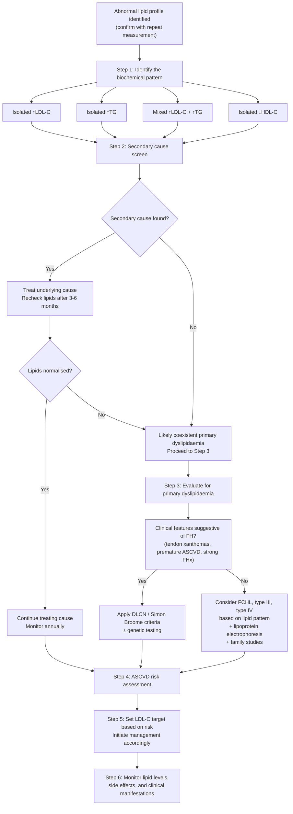

## Diagnostic Criteria, Algorithm, and Investigation Modalities for Dyslipidaemia

---

### Framing the Diagnostic Task

Diagnosing "dyslipidaemia" itself is straightforward — you measure a lipid profile and compare results to defined thresholds. The real diagnostic challenge is threefold:

1. **Confirming the lipid abnormality** — a single reading is never enough (biological variability, post-prandial effects, intercurrent illness).
2. **Identifying the underlying cause** — primary vs. secondary (the secondary cause screen).
3. **Diagnosing specific primary dyslipidaemias** — particularly ***familial hypercholesterolaemia (FH)***, which has formal diagnostic criteria and carries profound prognostic implications.

The diagnostic process also encompasses **ASCVD risk stratification**, because the reason we diagnose dyslipidaemia is to guide treatment — and treatment targets depend on overall cardiovascular risk, not just the lipid number in isolation.

---

### 1. Definition of Abnormal Lipid Levels

There is no single universal threshold that defines "dyslipidaemia" — what is considered abnormal depends on the patient's overall ASCVD risk. However, the following reference values provide a practical framework:

| Parameter | Desirable | Borderline High | High |
|-----------|-----------|----------------|------|
| **Total cholesterol** | < 5.2 mmol/L ( < 200 mg/dL) | 5.2–6.2 mmol/L (200–239 mg/dL) | ≥6.2 mmol/L ( ≥240 mg/dL) |
| **LDL-C** | < 2.6 mmol/L ( < 100 mg/dL) | 2.6–4.1 mmol/L (100–159 mg/dL) | ≥4.1 mmol/L ( ≥160 mg/dL) |
| **HDL-C** | ≥1.55 mmol/L ( ≥60 mg/dL) — protective | 1.0–1.55 mmol/L (40–59 mg/dL) | < 1.0 mmol/L ( < 40 mg/dL) — risk factor |
| **Triglycerides** | < 1.7 mmol/L ( < 150 mg/dL) | 1.7–2.3 mmol/L (150–199 mg/dL) | 2.3–5.6 = high; > 5.6 = very high; ***> 10 = pancreatitis risk*** [6] |
| **Non-HDL-C** | < 3.4 mmol/L | — | ≥4.9 mmol/L |

> **Why non-HDL-C?** Non-HDL-C = TC − HDL-C. It captures ALL atherogenic particles (LDL + VLDL + IDL + Lp(a)). It is especially useful when TG is elevated and the Friedewald equation becomes unreliable ( > 4.5 mmol/L). The 2019 ESC/EAS guidelines use non-HDL-C as a secondary target [3].

<Callout title="Exam Pearl" type="idea">
***The treatment target for LDL-C depends on ASCVD risk category, not just whether LDL-C is "high" in absolute terms*** [3]:
- Very high risk: ***< 1.4 mmol/L AND ≥50% reduction from baseline***
- High risk: ***< 1.8 mmol/L AND ≥50% reduction from baseline***
- Moderate risk: ***< 2.6 mmol/L***
- Low risk: ***< 3.0 mmol/L***
</Callout>

---

### 2. Confirming the Lipid Abnormality

***First, make an accurate diagnosis — repeat checking, never rely on a single reading*** [4].

Why? Because lipid levels exhibit:
- **Biological variability**: TC can vary by 5–10% day-to-day in the same individual; TG can vary by up to 20–30%.
- **Analytical variability**: Laboratory measurement error (usually small but additive).
- **Acute illness effect**: Any acute illness, surgery, MI, or major physiological stress can transiently alter lipid levels — typically ↓TC, ↓LDL-C for weeks after an acute event.

**Practical approach** [4]:
- ***Obtain several baseline lipid measurements (best with 2)*** — ideally 2 samples taken ≥1 week apart in a stable clinical state.
- If the patient has had a recent MI or acute illness, lipid profile taken **within 24 hours** of the event reflects baseline levels (before the acute-phase response kicks in); otherwise wait **≥6 weeks** after the acute event for a reliable baseline.

**Fasting vs. non-fasting**:
- As discussed in the prior section, non-fasting samples are acceptable for screening purposes.
- ***Fasting samples (12 hours) are required when***: TG > 5 mmol/L on non-fasting; monitoring TG treatment response; calculating LDL-C by Friedewald equation.

---

### 3. The Diagnostic Algorithm — Overview

This algorithm mirrors the ***systematic approach to treatment of primary dyslipidaemia*** from Prof Tan's teaching clinic [4]:

1. ***First, make an accurate Dx (repeat checking, never rely on a single reading)***
2. ***Identify and control other CVD risk factors***
3. ***Obtain several baseline lipid measurements (best with 2)***
4. ***Start with diet therapy — if no secondary causes or not a familial cause. Add a drug to the diet if response is inadequate***
5. ***Substitute another drug or combine drugs if necessary (3–6 months later without improvement)***
6. ***Monitor levels, side effects and clinical manifestations***

---

### 4. Step 2: The Secondary Cause Screen — Investigations and Interpretation

This is the most important diagnostic step in clinical practice. ***Always exclude secondary causes before diagnosing a primary dyslipidaemia*** [5].

| Investigation | What It Screens For | Key Findings | Interpretation / Mechanism |
|--------------|--------------------|--------------|-----------------------------|
| ***TSH (± fT4)*** | Hypothyroidism | ↑TSH, ↓fT4 | Thyroid hormone upregulates LDL receptor gene transcription. ↓T4 → ↓LDLr on hepatocyte surface → ↓LDL clearance → ↑LDL-C. Treat with levothyroxine → lipids may normalise. |
| ***Fasting glucose, HbA1c*** | Diabetes mellitus / insulin resistance | ↑FBG ≥7.0, HbA1c ≥6.5% | Insulin resistance → ↑hepatic VLDL-TG output (insulin normally suppresses VLDL secretion) + ↓LPL activity → ↑TG, ↓HDL-C, ↑small dense LDL [1] |
| ***RFT (creatinine, eGFR)*** | CKD | ↑creatinine, ↓eGFR | CKD → ↓LPL activity, ↓hepatic lipase → ↓TG clearance; also ↑VLDL production; uraemia-associated ↓HDL |
| ***LFT (ALT, AST, ALP, GGT, bilirubin)*** | Cholestasis; hepatic disease; also ***baseline before starting statin*** [9] | ↑ALP, ↑GGT, ↑conjugated bilirubin (cholestasis); ↑ALT (hepatic steatosis/NAFLD) | Cholestasis → ↓bile acid excretion → ↑intrahepatic cholesterol → ↓LDLr → ↑LDL-C. Also check LFT as baseline because statins can rarely cause hepatotoxicity. |
| ***CK*** | ***Baseline before starting statin*** [9] | Normal at baseline | Statins can rarely cause myopathy/rhabdomyolysis. Baseline CK allows comparison if patient develops muscle symptoms later. |
| ***Urine protein (dipstick, ACR, or 24h urine protein)*** | Nephrotic syndrome | Proteinuria > 3.5 g/day, ACR > 300 mg/mmol | Hypoalbuminaemia → compensatory ↑hepatic lipoprotein synthesis → ↑TC, ↑LDL-C, ↑TG [10] |
| ***Serum albumin*** | Nephrotic syndrome | ↓albumin ( < 25 g/L in nephrotic range) | Confirms nephrotic syndrome when combined with heavy proteinuria [10] |
| ***Drug history*** | Drug-induced dyslipidaemia | Identify culprit medications | Thiazides (↑LDL 5–10%), β-blockers (↑TG, ↓HDL), corticosteroids (↑TG), OCP/oestrogen (↑TG), cyclosporine (↑LDL), retinoids (↑TG), atypical antipsychotics (↑TG, ↑TC), protease inhibitors (↑TG) |
| ***Alcohol history*** | Alcohol-related hypertriglyceridaemia | Quantify intake (units/week) | Alcohol → ↑NADH:NAD⁺ → ↑hepatic fatty acid synthesis → ↑VLDL-TG production |

<Callout title="Practical Point" type="error">
***Students commonly forget to check LFT and CK as baselines before initiating statin therapy*** [9]. This is not for diagnosing dyslipidaemia per se, but it is an integral part of the diagnostic workup because you need these values before starting treatment. If a patient later develops elevated ALT or CK on a statin, you need to know what the baseline was.
</Callout>

---

### 5. Step 3: Diagnosing Specific Primary Dyslipidaemias

#### 5A. Lipid Profile — The Starting Point

***Lipid profile consists of*** [2]:
- ***Total cholesterol (TC)***
- ***HDL cholesterol (HDL-C)***
- ***Total triglyceride (TG)***
- ***LDL cholesterol (LDL-C) → usually estimated by the Friedewald equation*** [2]

**Friedewald equation**: LDL-C = TC − HDL-C − (TG ÷ 2.2) [in mmol/L]

> **When is this unreliable?** When TG > 4.5 mmol/L, because the equation assumes a fixed VLDL-C : TG ratio of 1 : 2.2 (i.e., VLDL-C = TG/2.2). In hypertriglyceridaemia, VLDL particles become TG-enriched and this ratio breaks down → LDL-C is underestimated. Use **direct LDL-C measurement** or **non-HDL-C** instead.

#### 5B. Advanced Lipoprotein Investigations

***Other than lipid profile, lipoprotein diseases can be investigated by*** [2]:
- ***Ultracentrifugation: different lipoproteins have different densities*** — gold standard for separating lipoproteins but not routine (research/specialist labs)
- ***Lipoprotein electrophoresis: different lipoproteins have different charge-to-mass ratios*** [2] — clinically useful for:
  - Detecting **broad beta band** (fusion of pre-β and β bands) → ***pathognomonic of type III (familial dysbetalipoproteinaemia)***
  - Detecting **chylomicron band** (remains at the origin because chylomicrons are too large to migrate) → type I or V

| Additional Test | Indication | What It Tells You |
|----------------|-----------|------------------|
| **ApoB** | When LDL-C may underestimate atherogenic particle burden (e.g., metabolic syndrome with ↑TG, normal/borderline LDL-C) | Each atherogenic particle (LDL, VLDL, IDL) has exactly one apoB-100. ApoB reflects total atherogenic particle number. ***ApoB ≥130 mg/dL is an ASCVD risk enhancer*** [3]. |
| **Lp(a)** | Once-in-a-lifetime measurement recommended for all; essential in unexplained premature ASCVD or FH phenotype with borderline LDL-C | Genetically determined, independent ASCVD risk factor. ***Lp(a) > 50 mg/dL or > 125 nmol/L is an ASCVD risk enhancer*** [3]. Not significantly lowered by statins. |
| **Non-HDL-C** | Calculated (TC − HDL-C); used when TG elevated and Friedewald unreliable | Captures all atherogenic lipoproteins. Secondary target in 2019 ESC/EAS guidelines. |
| **ApoE genotyping** | Suspected type III dyslipidaemia | ApoE2/E2 homozygosity confirms diagnosis of FDBL |
| **LPL activity assay / apoC-II level** | Suspected familial chylomicronaemia syndrome | Confirms LPL or apoC-II deficiency as cause of severe hypertriglyceridaemia |
| **Serum plant sterols (sitosterol, campesterol)** | Suspected sitosterolaemia | Markedly elevated → confirms ABCG5/G8 deficiency |
| **Genetic testing** | Suspected FH; cascade screening of family | Identifies causative mutations in LDLR, APOB, PCSK9 genes; gold standard for FH diagnosis |

#### 5C. ***Diagnostic Criteria for Familial Hypercholesterolaemia (FH)***

FH is the most important primary dyslipidaemia to diagnose because:
- It is **common** (~1 in 250–500)
- It is **treatable** — early statin therapy dramatically reduces ASCVD events
- It is **transmissible** — cascade screening of first-degree relatives can identify affected family members before they develop ASCVD

***Diagnosis is based on genetic testing, or if not available, clinical criteria*** [6].

##### ***Dutch Lipid Clinic Network (DLCN) Criteria*** [6]

This is the most widely used scoring system internationally. It integrates family history, clinical history, physical examination, LDL-C level, and (optionally) genetic testing.

| Category | Criterion | Score |
|----------|-----------|-------|
| **Family history** | 1st-degree relative with known premature CVD (M < 55y, F < 60y) OR 1st-degree relative with known LDL-C > 95th percentile | 1 |
| | 1st-degree relative with tendon xanthomas and/or corneal arcus OR child < 18y with LDL-C > 95th percentile | 2 |
| **Clinical history** | Patient with premature CAD (M < 55y, F < 60y) | 2 |
| | Patient with premature cerebral or peripheral vascular disease (M < 55y, F < 60y) | 1 |
| **Physical examination** | Tendon xanthomas | 6 |
| | Corneal arcus before age 45 | 4 |
| **LDL-C level (untreated)** | ≥8.5 mmol/L (≥330 mg/dL) | 8 |
| | 6.5–8.4 mmol/L (250–329 mg/dL) | 5 |
| | 5.0–6.4 mmol/L (190–249 mg/dL) | 3 |
| | 4.0–4.9 mmol/L (155–189 mg/dL) | 1 |
| **Genetic testing** | Functional mutation in LDLR, APOB, or PCSK9 identified | 8 |

***Interpretation*** [6]:
| Total Score | Diagnosis |
|------------|-----------|
| ***> 8*** | ***Definite FH*** |
| ***6–8*** | ***Probable FH*** |
| ***3–5*** | ***Possible FH*** |
| < 3 | Unlikely FH |

> **Use only the highest-scoring item in each category** (do not sum within a category). Then sum across all categories.

##### ***Simon Broome Diagnostic Criteria (UK)*** [6]

| Criterion | Description |
|-----------|-------------|
| **Criterion 1 (lipid level)** | TC > 7.5 mmol/L (adults) or > 6.7 mmol/L (children < 16y); OR LDL-C > 4.9 mmol/L (adults) or > 4.0 mmol/L (children) |
| **Criterion 2 (physical signs)** | Tendon xanthomas in patient OR first/second-degree relative |
| **Criterion 3 (genetic)** | DNA-based evidence of LDLr, apoB-100, or PCSK9 mutation |
| **Criterion 4 (family history)** | FHx of MI < 50y in 2nd-degree relative OR < 60y in 1st-degree relative |
| **Criterion 5 (family lipid)** | FHx of ↑TC > 7.5 mmol/L in 1st/2nd-degree relative; OR > 6.7 mmol/L in child < 16y |

***Interpretation*** [6]:
- ***Definite FH***: Criterion 1 + 2, OR Criterion 1 + 3
- ***Probable FH***: Criterion 1 + 4, OR Criterion 1 + 5

<Callout title="Key Difference Between DLCN and Simon Broome">
The DLCN criteria are quantitative (scoring system) and more nuanced — they can grade the probability of FH. The Simon Broome criteria are more categorical (definite vs. probable). Both are clinically acceptable. In Hong Kong, the DLCN criteria are generally preferred for clinical and research purposes. ***Genetic testing is the gold standard but not always available or affordable***, particularly in Hong Kong public hospitals where it may not be routinely offered [6].
</Callout>

---

### 6. Step 4: ASCVD Risk Assessment

After diagnosing dyslipidaemia and characterising it (primary vs. secondary, specific subtype), you must determine the patient's overall cardiovascular risk, because **treatment targets depend on risk category, not just LDL-C level** [3, 5].

#### 6A. ***When to Perform Formal ASCVD Risk Assessment*** [5]

- ***Formal assessment if ≥40y + ≥1 ASCVD risk factor (HK consensus 2016)*** [5]
- ***Not needed if*** [5]: Patient has overt ASCVD, DM, or ≥1 major risk factor (e.g., moderate/severe HT, severely ↑lipid) → ***automatically meets threshold for treatment***

#### 6B. ***Risk Assessment Tools*** [5]

***Generally consider: age, gender, smoking, systolic BP, TC/HDL-C, FHx, ± BMI*** [5]:

| Tool | Notes |
|------|-------|
| ***Chinese Multiprovincial Cohort Study (CMCS, 2005)*** | Chinese-specific; limited validation |
| ***Framingham risk assessment (2008)*** | Well-established; may overestimate in Asian populations |
| ***ACC/AHA ASCVD risk calculator (2013)*** | Pooled Cohort Equation; 10-year ASCVD risk; includes stroke |
| ***SCORE risk charts (2016)*** | Used in ESC guidelines; 10-year risk of fatal CVD events |
| ***JBS3 risk calculator (2014)*** | Estimates lifetime risk; useful for younger patients |

#### 6C. ***2019 ESC/EAS Risk Categories and LDL-C Targets*** [3]

| ***Risk Category*** | ***Who Qualifies*** | ***LDL-C Target*** |
|---|---|---|
| ***Very High*** | ***Documented ASCVD (clinical or imaging: ACS, angina, revascularisation, stroke/TIA, PAD, significant plaque on coronary angiography or CT scan or carotid ultrasound); SCORE ≥10%; FH with ASCVD or with another major risk factor; severe CKD (eGFR < 30); DM with target organ damage or ≥3 major risk factors or early-onset T1DM of long duration (> 20y)*** [3] | ***< 1.4 mmol/L AND ≥50% reduction from baseline*** |
| ***High*** | ***Markedly elevated single risk factors: TC > 8 mmol/L, LDL-C > 4.9 mmol/L, or BP ≥180/110 mmHg; FH without other major risk factors; moderate CKD (eGFR 30–59); DM without target organ damage, with DM duration ≥10y or other additional risk factor; SCORE ≥5% and < 10%*** [3] | ***< 1.8 mmol/L AND ≥50% reduction*** |
| ***Moderate*** | ***Young patients (T1DM < 35y, T2DM < 50y) with DM duration < 10y without other risk factors; SCORE ≥1% and < 5%*** [3] | ***< 2.6 mmol/L*** |
| ***Low*** | ***SCORE < 1%*** [3] | ***< 3.0 mmol/L*** |

#### 6D. ***ASCVD Risk Enhancers (2018 ACC/AHA)*** [3]

When the calculated 10-year risk is borderline or intermediate and you are unsure whether to start a statin, look for ***risk enhancers*** [3]:

- ***Family history of premature ASCVD***
- ***Persistently elevated LDL-C ≥4.1 mmol/L (≥160 mg/dL)***
- ***Chronic kidney disease***
- ***Metabolic syndrome***
- ***Conditions specific to women (preeclampsia, premature menopause)***
- ***Inflammatory diseases (RA, psoriasis, HIV)***
- ***Ethnicity (South Asian ancestry)***
- ***Persistently elevated TG ≥2.0 mmol/L (≥175 mg/dL)***
- ***If measured: hs-CRP ≥2.0 mg/L, Lp(a) > 50 mg/dL or > 125 nmol/L, apoB ≥130 mg/dL, ABI < 0.9*** [3]

#### 6E. ***Coronary Artery Calcium (CAC) Score*** [3]

***If risk decision is uncertain***, consider measuring CAC in selected adults [3]:
- ***CAC = zero → lowers risk; consider no statin, unless diabetes, family history of premature CHD, or cigarette smoking are present***
- ***CAC = 1–99 → favours statin (especially after age 55)***
- ***CAC ≥100 → favours statin***

> **Why CAC?** CAC directly visualises coronary atherosclerosis. A score of zero means very low risk of an ASCVD event in the next 10 years (NPV > 95%), which can reclassify a patient from "intermediate" to "low" risk and potentially avoid lifelong statin therapy. Conversely, a high CAC confirms subclinical atherosclerosis and tips the decision towards treatment.

---

### 7. Comprehensive Investigation Summary

The table below consolidates **all investigations relevant to the diagnosis and workup of dyslipidaemia**, categorised by purpose.

| Purpose | Investigation | Key Findings / Interpretation |
|---------|--------------|-------------------------------|
| **Confirm dyslipidaemia** | ***Fasting lipid profile (TC, LDL-C, HDL-C, TG)*** — at least 2 readings [4] | Pattern identification: ↑LDL, ↑TG, mixed, ↓HDL |
| | ***Non-HDL-C*** (calculated: TC − HDL-C) | Secondary target; useful when TG > 4.5 and Friedewald unreliable |
| **Secondary cause screen** | ***TSH*** | ↑TSH → hypothyroidism → ↑LDL-C |
| | ***Fasting glucose / HbA1c*** | ↑ → DM → ↑TG, ↓HDL-C |
| | ***RFT (creatinine, eGFR)*** | ↑creatinine / ↓eGFR → CKD → ↑TG |
| | ***LFT*** | Cholestasis pattern (↑ALP, ↑GGT, ↑bilirubin) → ↑LDL-C; also ***baseline before statin*** [9] |
| | ***CK*** | ***Baseline before statin*** [9] |
| | ***Urine protein (dipstick / ACR)*** | Proteinuria → nephrotic syndrome → ↑LDL-C, ↑TC [10] |
| | ***Serum albumin*** | ↓albumin → nephrotic syndrome [10] |
| | Drug + alcohol history | Identify iatrogenic/lifestyle causes |
| **Primary dyslipidaemia workup** | ***Lipoprotein electrophoresis*** [2] | Broad beta band → type III; chylomicron band at origin → type I/V |
| | ApoE genotyping | E2/E2 → type III (FDBL) |
| | Genetic testing (LDLR, APOB, PCSK9) | Identifies FH-causing mutations; gold standard for FH |
| | LPL activity assay / apoC-II level | Confirms familial chylomicronaemia syndrome |
| | Serum plant sterols | ↑↑sitosterol → sitosterolaemia |
| **Atherogenic particle burden** | ApoB | ≥130 mg/dL → risk enhancer [3] |
| | ***Lp(a)*** | ***> 50 mg/dL or > 125 nmol/L → independent risk factor*** [3] |
| | hs-CRP | ***≥2.0 mg/L → risk enhancer*** [3] |
| **Subclinical atherosclerosis** | ***CAC score (CT)*** | ***0 = very low risk; 1–99 = favours statin if age > 55; ≥100 = favours statin*** [3] |
| | Carotid intima-media thickness (CIMT) / carotid ultrasound | ***Significant plaque = very high risk per 2019 ESC/EAS*** [3] |
| | ABI (ankle-brachial index) | ***< 0.9 → PAD → risk enhancer / very high risk*** [3] |
| **ASCVD risk assessment** | Risk calculators (Framingham, SCORE, ACC/AHA PCE) | 10-year risk → guides risk category → determines LDL-C target |
| **Organ damage assessment (in high-risk patients)** | ECG | Evidence of prior MI (pathological Q waves), LVH |
| | Echocardiography | LVEF, regional wall motion abnormalities [9] |
| | Fundoscopy | Retinal atherosclerotic changes; also relevant in DM patients for diabetic retinopathy screening |

---

### 8. Special Diagnostic Scenarios

#### 8A. Diagnosing Dyslipidaemia in the Context of Acute MI

When a patient presents with ACS, lipid profile should be taken ***within 24 hours*** [11] of admission because:
- After an acute MI, acute-phase response → ↓TC, ↓LDL-C starting from ~24–48 hours → nadir at ~7 days → may take 6–8 weeks to return to baseline
- A lipid profile taken within 24h is therefore the most reliable estimate of baseline levels
- ***Early statin should be initiated regardless*** — do not wait for the lipid result to start treatment in ACS [11]

#### 8B. Diagnosing Dyslipidaemia as Part of Metabolic Syndrome

***Lipid profile is a mandatory part of the metabolic workup*** — it is one of the 5 components of metabolic syndrome [1]:
- **↑TG ≥1.7 mmol/L** (or on treatment)
- **↓HDL-C < 1.0 mmol/L (M) or < 1.3 mmol/L (F)** (or on treatment)

In the context of metabolic syndrome, also perform:
- Waist circumference (≥90 cm M, ≥80 cm F for Asians)
- BP measurement
- Fasting glucose / HbA1c

#### 8C. Diagnosing Dyslipidaemia in NAFLD

***NAFLD is associated with metabolic syndrome (↑BMI, central obesity, T2DM, dyslipidaemia, HT)*** [8, 12].

***Metabolic workup for NAFLD includes: FBG, lipid profile, BP, RFT*** [8].

The dyslipidaemia pattern in NAFLD is typically: ↑TG, ↓HDL-C, ↑small dense LDL — the classic "atherogenic dyslipidaemia" of insulin resistance.

---

### 9. The "Cream Test" — A Classical Bedside Investigation

Worth mentioning because it is occasionally tested:

If serum appears **lipaemic (milky)**, you can perform the refrigerator test:
- Leave serum sample in the refrigerator overnight
- **Chylomicrons** (density < water) will float to the top as a creamy layer
- **VLDL** remains diffusely turbid throughout

| Appearance | Interpretation |
|-----------|---------------|
| Creamy supernatant, clear infranatant | Predominant chylomicronaemia (type I) |
| No supernatant, diffusely turbid | Predominant ↑VLDL (type IV) |
| Creamy supernatant AND turbid infranatant | Both ↑chylomicrons + ↑VLDL (type V) |
| Clear serum | Normal TG (or ↑LDL-C only — LDL does not cause turbidity because it carries cholesterol, not TG) |

---

### 10. Cascade Screening for FH

Once an index case of FH is identified, ***family screening*** is essential [4]:

- **Screen all first-degree relatives** (parents, siblings, children) with a fasting lipid profile ± genetic testing
- **If genetic mutation is known in the index case**, genotype-based cascade screening is most efficient (test for the specific mutation)
- **If genetic testing unavailable**, phenotypic screening (lipid profile + clinical criteria) is acceptable
- ***Children of an FH parent should be screened from age 2 years (by some guidelines) or by age 10 years at the latest***
- ***Statins are contraindicated for children younger than 8 years*** [2]
- ***Primary prevention (未雨綢繆) — with mainly statins, can reduce CHD, stroke; secondary prevention (亡羊補牢); (family screening)*** [4]

<Callout title="High Yield Summary — Diagnosis">

1. ***Never rely on a single lipid reading — repeat checking, best with 2 baseline measurements*** [4].

2. ***The secondary cause screen is mandatory***: TSH, glucose/HbA1c, RFT, LFT (+ baseline before statin), CK (baseline before statin), urine protein, drug and alcohol history [5, 9].

3. ***LDL-C is usually estimated by the Friedewald equation; unreliable when TG > 4.5 mmol/L*** [2].

4. ***Lipoprotein electrophoresis: broad beta band = type III; chylomicron band at origin = type I/V*** [2].

5. ***FH diagnostic criteria*** [6]:
   - ***DLCN: > 8 = definite, 6–8 = probable, 3–5 = possible***
   - ***Simon Broome: Criterion 1 + 2 or 3 = definite; Criterion 1 + 4 or 5 = probable***
   - ***Tendon xanthomas score 6 points in DLCN — this single finding almost clinches the diagnosis***

6. ***ASCVD risk assessment determines LDL-C target***: Very high risk → < 1.4; High → < 1.8; Moderate → < 2.6; Low → < 3.0 (all mmol/L) [3].

7. ***CAC score = 0 means very low risk and can reclassify a patient out of statin therapy (unless DM, FHx premature CHD, or smoking)*** [3].

8. ***Cascade screening of first-degree relatives is essential after diagnosing an FH index case*** [4].

9. ***In ACS: take lipid profile within 24 hours*** (before acute-phase response lowers values) [11].

</Callout>

---

<ActiveRecallQuiz
  title="Active Recall - Diagnostic Criteria, Algorithm, and Investigations for Dyslipidaemia"
  items={[
    {
      question: "What are the components of the DLCN criteria for diagnosing FH, and what score constitutes 'definite FH'?",
      markscheme: "DLCN integrates: (1) Family history (1-2 points), (2) Clinical history of premature CVD (1-2 points), (3) Physical examination — tendon xanthomas (6 points), corneal arcus < 45y (4 points), (4) LDL-C level (1-8 points based on severity), (5) Genetic testing (8 points if mutation found). Use highest-scoring item in each category, then sum. Score > 8 = definite FH, 6-8 = probable FH, 3-5 = possible FH."
    },
    {
      question: "The Friedewald equation estimates LDL-C. Write the equation, state when it is unreliable, and explain why.",
      markscheme: "LDL-C = TC - HDL-C - (TG / 2.2) in mmol/L. Unreliable when TG > 4.5 mmol/L because the equation assumes a fixed VLDL-C to TG ratio of 1:2.2. In hypertriglyceridaemia, VLDL particles become more TG-enriched, so this ratio breaks down and LDL-C is underestimated. Use direct LDL-C measurement or non-HDL-C instead."
    },
    {
      question: "List the 6 investigations that constitute the secondary cause screen for dyslipidaemia and state what each excludes.",
      markscheme: "1. TSH: hypothyroidism. 2. Fasting glucose/HbA1c: diabetes mellitus. 3. RFT (creatinine, eGFR): CKD. 4. LFT: cholestasis/hepatic disease (also baseline before statin). 5. Urine protein (dipstick/ACR): nephrotic syndrome. 6. Drug and alcohol history: iatrogenic/lifestyle causes. (Also CK as baseline before statin.)"
    },
    {
      question: "According to 2019 ESC/EAS guidelines, what is the LDL-C target for a patient classified as 'very high risk', and give 3 examples of who qualifies for this category.",
      markscheme: "Target: LDL-C < 1.4 mmol/L AND at least 50% reduction from baseline. Very high risk examples: (1) Documented ASCVD (clinical or imaging). (2) DM with target organ damage or 3 or more major risk factors. (3) FH with ASCVD or another major risk factor. (4) SCORE 10% or more. (5) Severe CKD with eGFR < 30."
    },
    {
      question: "What is a CAC score and how does it help in decision-making about statin therapy?",
      markscheme: "Coronary artery calcium (CAC) score is measured by non-contrast CT of the chest. It quantifies calcified atherosclerotic plaque in coronary arteries. CAC = 0 means very low short-term ASCVD risk (negative predictive value > 95%), allowing reclassification of borderline/intermediate-risk patients to low risk and potentially deferring statin therapy (unless DM, FHx premature CHD, or current smoking). CAC 1-99 favours statin especially after age 55. CAC 100 or more strongly favours statin."
    },
    {
      question: "On lipoprotein electrophoresis, what pattern is pathognomonic of type III dyslipidaemia (familial dysbetalipoproteinaemia)?",
      markscheme: "A 'broad beta band' — this represents fusion of the pre-beta (VLDL) and beta (LDL) bands because IDL (beta-VLDL) accumulates and migrates between these two positions. This occurs because apoE2/E2 homozygosity leads to defective clearance of IDL and chylomicron remnants by hepatic remnant receptors."
    }
  ]}
/>

## References

[1] Senior notes: Ryan Ho Endocrine.pdf (Section: Type 2 DM, Metabolic Syndrome, p77)
[2] Senior notes: Ryan Ho Chemical Path.pdf (Section: Lipid Profile and Fredrickson Classification, p46–48)
[3] Lecture slides: three cases of lipid disorder.pdf (p33, p38, p90 — 2019 ESC/EAS Guidelines, ACC/AHA risk categories and risk enhancers)
[4] Lecture slides: Teaching Clinic - Endocrinology - Three cases of lipid disorders - by Prof KCB Tan.pdf.pdf (p4, p7 — systematic approach, dietary recommendations, prevention, family screening)
[5] Senior notes: Ryan Ho Endocrine.pdf (Section: Clinical approach to dyslipidaemia, screening, ASCVD risk assessment, p125)
[6] Senior notes: Ryan Ho Endocrine.pdf (Section: FH, primary dyslipidaemias, diagnostic criteria, p131)
[8] Senior notes: Maksim MEDICINE notes.pdf (Section: NAFLD, p148)
[9] Senior notes: Ryan Ho Cardiology.pdf (Section: Baseline evaluation of stable IHD, p116)
[10] Senior notes: Ryan Ho Urogenital.pdf (Section: Nephrotic syndrome investigations, p55)
[11] Senior notes: Ryan Ho Fundamentals.pdf (Section: Approach to acute chest pain — lipid profile within 24h, p203)
[12] Senior notes: Ryan Ho GI.pdf (Section: NAFLD, p309–310)
