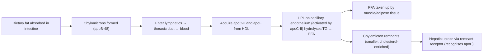
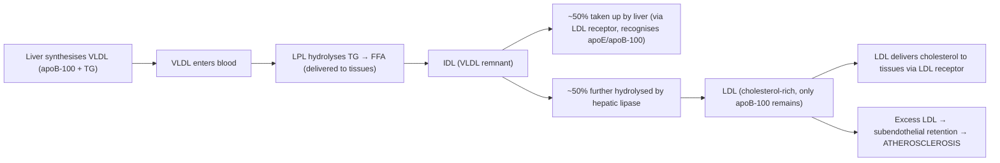
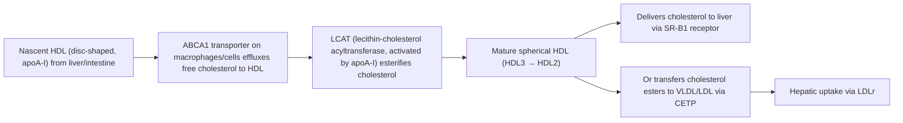

# Dyslipidaemia — Definition, Epidemiology, Risk Factors, Anatomy & Function, Etiology, Pathophysiology, Classification, and Clinical Features

---

## 1. Definition

Dyslipidaemia (dys- = abnormal, lip- = fat, -aemia = in the blood) refers to any quantitative or qualitative abnormality in circulating lipids or lipoproteins. This encompasses [1, 2]:

- **Elevated total cholesterol (TC)**
- **Elevated low-density lipoprotein cholesterol (LDL-C)**
- **Elevated triglycerides (TG)**
- **Reduced high-density lipoprotein cholesterol (HDL-C)**
- Any combination of the above

It is one of the most important **modifiable risk factors for atherosclerotic cardiovascular disease (ASCVD)** — including coronary heart disease (CHD), ischaemic stroke, and peripheral arterial disease (PAD) [3, 4].

> The term "hyperlipidaemia" technically means elevated lipids, whereas "dyslipidaemia" is the broader, preferred term because it also captures low HDL-C, which is equally important clinically.

<Callout title="Key Concept">
Dyslipidaemia is not a disease in isolation — it is a metabolic abnormality that dramatically accelerates atherogenesis. We treat it because of what it causes (MI, stroke, PAD, pancreatitis), not because of the number itself.
</Callout>

---

## 2. Epidemiology

### 2.1 Global Burden
- **Elevated TC** is estimated to cause ~4.4 million deaths/year globally (WHO 2021).
- Over one-third of adults worldwide have dyslipidaemia; prevalence varies by ethnicity, diet, and socioeconomic development.
- **Raised LDL-C is the single greatest contributor to population-attributable ASCVD risk** — more so than smoking or hypertension when considered lifetime exposure ("cholesterol-years").

### 2.2 Hong Kong Context
- ***Prevalence of hypercholesterolaemia in Hong Kong adults ~50%*** (Population Health Survey 2014/15). This is extremely high [5].
- Hong Kong's ageing population + Westernised dietary patterns → rising prevalence.
- CHD remains a leading cause of death. ***Ischaemic heart disease and cerebrovascular disease together account for >20% of all deaths in Hong Kong*** [5].
- ***Familial hypercholesterolaemia (FH) heterozygous prevalence ~1 in 500*** (some studies suggest even 1 in 250 globally) [2, 6].
- Homozygous FH: ~1 in 300,000 [2, 6].

### 2.3 Demographics
- **Age**: Lipid levels rise with age. In men, TC/LDL-C plateaus around 50–60 years. In women, levels rise sharply after menopause (loss of oestrogen's protective effect on LDL receptor expression and HDL metabolism).
- **Sex**: Pre-menopausal women generally have higher HDL-C and lower LDL-C than age-matched men. Post-menopause, the gap narrows or reverses.
- **Ethnicity**: South Asians have a particularly atherogenic lipid profile (↑TG, ↓HDL-C, small dense LDL) even at relatively normal TC.

---

## 3. Risk Factors for Dyslipidaemia

| Category | Risk Factors |
|----------|-------------|
| ***Non-modifiable*** | Age (↑ with age), male sex, family history of premature CHD (M < 55y, F < 65y), genetic predisposition (FH, FCHL, etc.) [3, 4] |
| ***Modifiable — Lifestyle*** | High saturated/trans-fat diet, physical inactivity, obesity (especially central/abdominal obesity), excessive alcohol intake, smoking [3, 4] |
| ***Modifiable — Medical*** | Type 2 DM (insulin resistance → ↑TG, ↓HDL-C, small dense LDL), hypothyroidism (↓LDL receptor activity), nephrotic syndrome (↑hepatic lipoprotein synthesis), CKD, cholestasis, drugs (thiazides, β-blockers, corticosteroids, OCP, protease inhibitors) [2, 4] |

<Callout title="High Yield" type="idea">
***Major risk factors for ASCVD (from ATP III and 2019 ESC/EAS, frequently tested)*** [3, 4]:
- Age: M ≥45y, F ≥55y
- Premature CHD in first-degree relative: M < 55y, F < 65y
- Cigarette smoking
- ***Hypertension ≥140/90 mmHg or on medication***
- ***Low HDL-C < 1.0 mmol/L***
- ***High HDL-C > 1.55 mmol/L is protective*** (negative risk factor — subtract one risk factor)
- ***Diabetes mellitus***
</Callout>

---

## 4. Anatomy and Physiology of Lipid Metabolism

Understanding dyslipidaemia from first principles requires knowing how lipids are transported, metabolised, and cleared. This section is critical — it underpins every drug mechanism and every clinical feature.

### 4.1 Why Do We Need Lipoproteins?

Lipids (cholesterol, triglycerides, phospholipids) are **hydrophobic** — they cannot dissolve in plasma. Therefore, they must be packaged into **lipoproteins** — spherical particles with:
- **Hydrophobic core**: cholesterol esters + triglycerides
- **Hydrophilic shell**: phospholipids + free cholesterol + apolipoproteins (apo)

The **apolipoproteins** on the surface serve as:
1. **Structural scaffolding** (e.g., apoB-48, apoB-100)
2. **Enzyme cofactors** (e.g., apoC-II activates lipoprotein lipase)
3. **Receptor ligands** (e.g., apoB-100 and apoE bind to hepatic LDL receptors)

### 4.2 Major Lipoprotein Classes

| Lipoprotein | Size | Density | Main Lipid | Key Apolipoprotein | Origin | Atherogenic? |
|------------|------|---------|------------|-------------------|--------|-------------|
| **Chylomicron** | Largest | Lowest | Dietary TG | apoB-48, apoC-II, apoE | Intestine | No (too large to cross endothelium) |
| **VLDL** | Large | Very low | Endogenous TG | apoB-100, apoC-II, apoE | Liver | Yes (via remnants and conversion to LDL) |
| **IDL** (VLDL remnant) | Medium | Intermediate | TG + cholesterol | apoB-100, apoE | Intravascular (from VLDL) | Yes |
| **LDL** | Small | Low | Cholesterol esters | apoB-100 | Intravascular (from IDL) | ***Yes — most atherogenic*** |
| **HDL** | Smallest | Highest | Cholesterol esters + phospholipids | apoA-I, apoA-II | Liver, intestine, intravascular | ***No — anti-atherogenic*** |
| **Lp(a)** | Similar to LDL | Low | Cholesterol | apoB-100 + apo(a) | Liver | ***Yes — independent risk factor*** |

> **Memory aid**: Think "Bigger = more TG, Smaller = more cholesterol." Chylomicrons are TG-rich behemoths; LDL are small cholesterol-rich particles.

### 4.3 The Three Lipid Pathways

#### 4.3.1 Exogenous Pathway (Dietary Fat → Peripheral Tissues)

- **Key enzyme**: Lipoprotein lipase (LPL) — sits on endothelial surface, hydrolyses TG
- **Key cofactor**: apoC-II (activates LPL)
- **Clinical relevance**: Deficiency of LPL or apoC-II → massive chylomicronaemia → TG > 10 mmol/L → acute pancreatitis

#### 4.3.2 Endogenous Pathway (Hepatic Lipid → Peripheral Tissues)

- **Key concept**: Each VLDL particle produces exactly one LDL particle (because there is one apoB-100 per particle that is never transferred).
- **LDL receptor (LDLr)**: Expressed predominantly on hepatocytes. Binds apoB-100 → receptor-mediated endocytosis → intracellular cholesterol released → suppresses HMG-CoA reductase (rate-limiting enzyme of cholesterol synthesis) and LDLr expression via SREBP-2 negative feedback.
- ***This is why statins work***: by inhibiting HMG-CoA reductase → ↓intracellular cholesterol → ↑LDLr expression → ↑LDL clearance from blood → ↓plasma LDL-C [7].

#### 4.3.3 Reverse Cholesterol Transport (Peripheral Tissues → Liver)

- **HDL is anti-atherogenic** because it removes cholesterol from peripheral tissues (including arterial wall macrophages) and returns it to the liver for excretion as bile acids — this is "reverse cholesterol transport."
- ***CETP (cholesteryl ester transfer protein)***: Transfers cholesterol esters from HDL to VLDL/LDL in exchange for TG. High CETP activity → ↓HDL-C, ↑LDL-C (pro-atherogenic).

### 4.4 Intracellular Cholesterol Homeostasis

The hepatocyte is the master regulator:

1. **HMG-CoA reductase**: Rate-limiting enzyme of cholesterol synthesis (mevalonate pathway)
2. **LDL receptor**: Takes up circulating LDL
3. **PCSK9 (proprotein convertase subtilisin/kexin type 9)**: Binds LDLr on cell surface → targets it for lysosomal degradation → ↓LDLr recycling → ↑plasma LDL-C
   - ***PCSK9 inhibitors (e.g., evolocumab, alirocumab)***: Monoclonal antibodies that block PCSK9 → ↑LDLr on hepatocyte surface → ↑LDL clearance → ↓LDL-C by 50–60% [6]
4. **NPC1L1 (Niemann-Pick C1-Like 1)**: Intestinal cholesterol transporter — absorbs dietary and biliary cholesterol
   - ***Ezetimibe*** blocks NPC1L1 → ↓cholesterol absorption → ↓intracellular cholesterol → ↑LDLr expression → further ↓LDL-C [7]
5. **ABCG5/G8**: ATP-binding cassette transporters on enterocyte apical membrane → pump absorbed plant sterols (sitosterol) and excess cholesterol back into gut lumen
   - Deficiency → **sitosterolaemia** (excessive absorption of plant sterols → severe hypercholesterolaemia) [2]

<Callout title="Exam Pearl" type="idea">
***Every major lipid-lowering drug works by manipulating one of these pathways***:
- **Statins** → ↓HMG-CoA reductase → ↓synthesis → ↑LDLr
- **Ezetimibe** → ↓NPC1L1 → ↓absorption → ↑LDLr
- **PCSK9 inhibitors** → ↓LDLr degradation → ↑LDLr
- **Bile acid sequestrants** → ↓bile acid reabsorption → ↑bile acid synthesis from cholesterol → ↓intracellular cholesterol → ↑LDLr
- **Fibrates** → PPARα agonist → ↑LPL → ↓TG
- **Bempedoic acid** → ↓ATP citrate lyase (upstream of HMG-CoA reductase) → same principle as statins but without muscle side effects
</Callout>

---

## 5. Etiology of Dyslipidaemia

Dyslipidaemia is classified as **primary (genetic)** or **secondary (acquired)**. ***Always exclude secondary causes before diagnosing a primary dyslipidaemia*** [4, 7].

### 5.1 Secondary Causes (Must Exclude First)

***This is crucial clinically because treating the underlying cause may normalise lipids without needing lipid-lowering drugs*** [4, 7].

| Biochemical Pattern | Secondary Causes | Mechanism |
|-------------------|-----------------|-----------|
| ***↑LDL-C*** | ***Hypothyroidism*** | ↓thyroid hormone → ↓LDLr expression → ↓LDL clearance |
| | ***Nephrotic syndrome*** | ↓albumin → compensatory ↑hepatic lipoprotein synthesis (liver "sees" low oncotic pressure and ramps up protein/lipoprotein production) |
| | ***Cholestasis*** (obstructive jaundice) | Bile acid excretion blocked → ↑intrahepatic cholesterol → ↓LDLr expression; also formation of lipoprotein X |
| | ***Anorexia nervosa*** | ↓bile acid excretion + ↓LDLr activity |
| | Immunoglobulin disorders (myeloma) | Paraproteins bind lipoproteins → ↓clearance |
| | Drugs: cyclosporine, thiazides | Variable mechanisms |
| ***↑TG*** | ***Diabetes mellitus*** (T2DM) | Insulin resistance → ↑hepatic VLDL-TG secretion + ↓LPL activity |
| | ***Alcohol excess*** | ↑hepatic FFA flux → ↑VLDL-TG synthesis |
| | ***Obesity*** | ↑FFA delivery to liver → ↑VLDL production |
| | ***CKD/renal failure*** | ↓LPL activity + ↑VLDL production |
| | ***Oestrogen/OCP*** | ↑hepatic VLDL production |
| | ***Corticosteroid excess*** (Cushing's / exogenous) | ↑lipolysis → ↑FFA → ↑hepatic VLDL |
| | Post-prandial (physiological) | Normal chylomicron-TG clearance takes 6–8 hours |
| | Glycogen storage diseases | ↑hepatic TG synthesis |
| ***Mixed (↑LDL + ↑TG)*** | ***DM, nephrotic syndrome, hypothyroidism*** | Combination of mechanisms above |
| ***↓HDL-C*** | Smoking, physical inactivity, very high-carb diet, obesity, T2DM, anabolic steroids, β-blockers | Various: ↑CETP activity (DM), ↑HDL catabolism, ↓apoA-I synthesis |

[Adapted from 2, 4]

<Callout title="Clinical Pearl" type="error">
***A common exam mistake: diagnosing "familial hypercholesterolaemia" before checking TFT.*** A patient with TC 9 mmol/L may simply have untreated hypothyroidism. Always check ***TFT, fasting glucose/HbA1c, LFT, RFT, urine protein*** as a secondary screen before attributing dyslipidaemia to a primary cause [4, 7].
</Callout>

### 5.2 Primary (Genetic) Causes

These are inherited disorders of lipoprotein metabolism. ***The Fredrickson classification is purely a biochemically descriptive classification — it provides no information about aetiology and does NOT affect treatment or management*** [2].

#### 5.2.1 Fredrickson Classification

| Type | Elevated Lipoprotein | Lipid Abnormality | Clinical Example | Atherogenic? |
|------|---------------------|-------------------|-----------------|-------------|
| I | Chylomicrons | ↑↑TG | ***Familial fasting chylomicronaemia (LPL/apoC-II deficiency)*** | No (pancreatitis risk) |
| IIa | LDL | ↑TC, ↑LDL-C | ***Familial hypercholesterolaemia (FH)*** | ***Yes — very high*** |
| IIb | LDL + VLDL | ↑TC + ↑TG | ***Familial combined hyperlipidaemia (FCHL)*** | Yes |
| III | IDL (β-VLDL) | ↑TC + ↑TG (ratio ≈ 2:1) | ***Familial dysbetalipoproteinaemia (apoE mutation)*** | Yes |
| IV | VLDL | ↑TG | ***Familial hypertriglyceridaemia*** | Moderate |
| V | Chylomicrons + VLDL | ↑↑TG | Mixed | No (pancreatitis risk) |

[2, 4, 7]

#### 5.2.2 Major Primary Dyslipidaemias in Detail

##### A. ***Familial Hypercholesterolaemia (FH) — Fredrickson Type IIa***

- ***Epidemiology: heterozygous ~1 in 500 (AD), homozygous ~1 in 300,000 (AR)*** [2, 6]
- ***Cause: functional mutation of LDL receptor (LDLR, ~90%), apoB-100 (FDB, ~5%), or PCSK9 gain-of-function (~1%)*** [2, 6]
  - All three mutations converge on the same pathology: **defective LDL uptake by hepatocytes** → extreme ↑LDL-C with propensity for early-onset ASCVD
- **Pathophysiology**:
  - LDLR mutation → fewer functional LDL receptors on hepatocyte surface → ↓LDL clearance → ↑circulating LDL → ↑subendothelial LDL retention → accelerated atherosclerosis
  - PCSK9 gain-of-function → excessive LDLr degradation → same effect
  - ApoB-100 mutation → LDL cannot bind LDLr properly → same effect
- ***Clinical features***:
  - **Heterozygous FH**: ***early (< 23y) coronary artery calcification, premature (< 60y) severe ASCVD/fatal MI*** [6]
  - **Homozygous FH**: ***most develop severe ASCVD or death before 20y*** [6]
  - ***Signs of hypercholesterolaemia***: ***xanthelasma (yellowish deposits around eyelids), corneal arcus (arcus senilis if < 45y), tendon xanthomas (pathognomonic — especially Achilles tendon and extensor tendons of hands)*** [6]
- ***Investigations: grossly elevated LDL-C (generally ≥4.9 mmol/L without FHx, ≥6.2 mmol/L with FHx before treatment)*** [6]
- ***Diagnosis*** [6]:
  - ***Dutch Lipid Clinic Network (DLCN) criteria***: scoring system incorporating FHx, personal Hx of premature CVD, physical signs, LDL-C level, and genetic testing
    - ***> 8 = definite FH, 6–8 = probable FH, 3–5 = possible FH***
  - ***Simon Broome diagnostic criteria (UK)***
- ***Note that phenotype depends on environmental factors — penetrance of LDLR can reach > 90% in heterozygous genotype living a Western lifestyle, but Mainland China individuals with heterozygous FH do not have a markedly elevated LDL*** [2]
- ***Note that statins are relatively ineffective in homozygous FH as their efficacy depends on upregulation of functional LDLr in liver*** [2]
- ***Treatment of homozygous FH***: ***LDL apheresis every 1–4 weeks, pre-emptive liver transplant to replace dysfunctional hepatic LDLr before onset of significant coronary artery disease*** [2, 6]

##### B. ***Autosomal Recessive Hypercholesterolaemia (ARH)***

- ***Clinical phenotype similar to classical homozygous FH but autosomal recessive inheritance*** [2]
- ***Important d/dx when diagnosing FH*** [2]
- Causes [2]:
  - ***↓expression of LDL accessory protein 1 (LDLRAP1)*** — facilitates association of LDLr with clathrin for receptor-mediated endocytosis
  - ***Sitosterolaemia*** due to ***ABCG5 or ABCG8 deficiency*** — ↑absorption of plant sterols
  - ***Deficiency of cholesterol 7-α hydroxylase (CYP7A1)*** — enzyme in 1st step of bile acid synthesis; deficiency → ↑intrahepatic cholesterol + ↓surface LDLr expression

##### C. ***Familial Combined Hyperlipidaemia (FCHL) — Fredrickson Type IIb***

- ***Epidemiology: 1–2% of population, accounts for 1/3 to 1/2 of familial CHD*** [6, 7]
- ***Cause: genetically heterogeneous, associated with ↑VLDL + apoB-100 secretion (AD inheritance)*** [6, 7]
- ***Prevalence 0.5%, ↑synthesis of apoB-100, elevated VLDL & LDL*** [7]
- ***Phenotypes: type IIb, occasionally IIa & IV*** — ***different family members may have different phenotypes*** [6, 7]
- ***No distinctive clinical features*** [7]
- ***Diagnosis: demonstration of multiple phenotypes in family*** [7]
- ***↑risk of atherosclerosis, pancreatitis, etc.*** [7]
- ***Clinical features: premature CHD, xanthelasma (10%), obesity ± DM*** [6]
- ***Treatment***: ***anion exchange resin + fibrate/nicotinic acid, or HMG-CoA reductase inhibitor (statin) + fibrate*** [7]
- ***Statin as 1st line (regardless of TG level → can ↓apoB levels) ± ezetimibe*** [6]

##### D. ***Familial Dysbetalipoproteinaemia (FDBL) — Fredrickson Type III***

- ***Epidemiology: rare with prevalence ~1 in 5,000–10,000*** [6]
- ***Cause: apoE mutations with variable penetrance*** [6] — most commonly apoE2/E2 homozygosity
  - ApoE2 binds poorly to hepatic remnant receptors → ↓clearance of IDL and chylomicron remnants → accumulation of β-VLDL (IDL)
- ***Clinical features: mixed ↑LDL-C and ↑TG (with TC:TG ≈ 2:1 during fasting)*** [6]
  - ***Palmar xanthoma (pathognomonic)*** — yellowish creases in palms [6]
  - ***Tuberoeruptive xanthoma*** — over elbows and knees [6]
  - Premature CHD and peripheral vascular disease
- ***Treatment: statin + fibrate as mainstay ± PCSK9 inhibitors*** [6]

##### E. ***Familial Fasting Chylomicronaemia — Fredrickson Type I/V***

- ***Epidemiology: 1–2 per million (AR inheritance)*** [6]
- ***Cause: LPL, apoC-II, or apoA-V deficiency*** [6]
  - Without LPL activity → chylomicrons cannot be hydrolysed → massive chylomicronaemia
- ***Clinical features: hepatosplenomegaly, eruptive xanthomas*** [6]
  - ***↑↑TG > 10 mmol/L → acute pancreatitis, lipemia retinalis, recent memory loss*** [6]
  - Lipaemic serum (plasma looks milky — the "cream test": refrigerate overnight → chylomicrons float to top)
- ***Treatment: dietary fat restriction, fibrates, ± fish oil*** [6]

##### F. ***Familial Hypertriglyceridaemia — Fredrickson Type IV***

- ***Epidemiology: ~1% of population (AD inheritance)*** [6]
- ***Cause: genetically heterogeneous, associated with LPL (heterozygous), apoA-V, and lipase I mutations*** [6]
- ***Clinical features: moderate ↑TG (2.3–5.6 mmol/L), metabolic syndrome (insulin resistance, obesity, ↑glucose), ↑urate*** [6]
- ***Marked ↑TG generally only occurs with concomitant factors (e.g., acquired disease, HRT)*** [6]

---

## 6. Pathophysiology of Atherogenesis — How Dyslipidaemia Causes Disease

This is the central question: **Why does elevated LDL-C cause heart attacks and strokes?**

### 6.1 The "Response-to-Retention" Hypothesis

1. **Subendothelial retention of LDL**: Small, apoB-containing lipoproteins (especially LDL) cross the endothelium and become trapped in the arterial intima by binding to proteoglycans in the extracellular matrix. ***The higher the circulating LDL-C, the more LDL is retained*** — this is why LDL-C is the primary therapeutic target.

2. **Oxidative modification**: Retained LDL undergoes oxidation by reactive oxygen species (ROS) → forms oxidised LDL (oxLDL). OxLDL is:
   - Chemotactic (attracts monocytes)
   - Pro-inflammatory (activates endothelial cells to express adhesion molecules: VCAM-1, ICAM-1)
   - Cytotoxic to endothelium

3. **Monocyte recruitment and foam cell formation**: Monocytes adhere to activated endothelium → migrate into intima → differentiate into macrophages → express scavenger receptors (SR-A, CD36) → engulf oxLDL in an unregulated manner (no negative feedback, unlike LDLr) → become **foam cells** (lipid-laden macrophages). The collection of foam cells beneath the endothelium = **fatty streak** (earliest visible lesion).

4. **Inflammation and smooth muscle proliferation**: Foam cells and activated macrophages release cytokines (TNF-α, IL-1, IL-6) and growth factors (PDGF) → recruit smooth muscle cells (SMCs) from media → SMCs migrate to intima, proliferate, and produce collagen/extracellular matrix → forms a **fibrous cap** over the lipid core.

5. **Advanced plaque**: The lesion now has a **necrotic lipid core** (dead foam cells, cholesterol crystals, cellular debris) covered by a **fibrous cap** (collagen + SMCs). This is the **atherosclerotic plaque**.

6. **Plaque complications**:
   - **Stable plaque**: Thick fibrous cap, small lipid core → causes **stable angina** from fixed stenosis
   - **Vulnerable (unstable) plaque**: Thin fibrous cap, large lipid core, heavy macrophage infiltration → prone to **rupture** → exposure of thrombogenic core to blood → **thrombus formation** → **acute coronary syndrome (ACS)** or **ischaemic stroke**

### 6.2 Role of TG and HDL-C

- **↑TG**: TG-rich lipoproteins (VLDL, remnants) are atherogenic. Hypertriglyceridaemia also promotes formation of **small dense LDL** (more atherogenic because it penetrates the endothelium more easily and is more prone to oxidation) and ↓HDL-C (via CETP-mediated exchange).
- **↓HDL-C**: Impaired reverse cholesterol transport → less cholesterol removal from arterial wall → accelerated plaque progression.
- ***Atherogenic dyslipidaemia of metabolic syndrome/T2DM***: ***↑TG, ↓HDL-C, ↑small dense LDL*** — this triad is particularly dangerous even when total LDL-C appears "normal" [1, 5].

### 6.3 Severe Hypertriglyceridaemia and Pancreatitis

When ***TG > 10 mmol/L*** (> 885 mg/dL), chylomicrons and VLDL are so abundant that they **obstruct pancreatic capillaries** → pancreatic lipase within the pancreatic bed hydrolyses TG in situ → releases massive amounts of **free fatty acids** → direct toxic injury to acinar cells → **acute pancreatitis** [6]. This is a medical emergency.

---

## 7. Classification of Dyslipidaemia

### 7.1 By Biochemical Pattern

| Pattern | TC | LDL-C | TG | HDL-C | Clinical Significance |
|---------|-----|-------|-----|-------|---------------------|
| **Isolated hypercholesterolaemia** | ↑ | ↑ | Normal | Normal | ASCVD risk (commonest pattern in FH) |
| **Isolated hypertriglyceridaemia** | Normal/↑ | Normal/↓ | ↑ | ↓ | Pancreatitis if severe; ASCVD if moderate |
| **Mixed hyperlipidaemia** | ↑ | ↑ | ↑ | ↓ | High ASCVD risk |
| **Isolated low HDL-C** | Normal | Normal | Normal | ↓ | ASCVD risk |

### 7.2 By Etiology

| Category | Examples |
|----------|---------|
| Primary (genetic) | FH, FCHL, FDBL, familial hypertriglyceridaemia, familial chylomicronaemia |
| Secondary (acquired) | Hypothyroidism, DM, nephrotic syndrome, CKD, drugs, alcohol, obesity |

### 7.3 Fredrickson Classification (Phenotypic)

As detailed in Section 5.2.1 above. ***Remember: this is purely descriptive and does NOT guide management*** [2].

### 7.4 ***2019 ESC/EAS Cardiovascular Risk Categories*** [3]

This is the clinically important classification — it determines **treatment targets**:

| ***Risk Category*** | ***Definition*** | ***LDL-C Target*** |
|-------------------|----------------|-------------------|
| ***Low*** | SCORE < 1% | ***< 3.0 mmol/L (116 mg/dL)*** |
| ***Moderate*** | ***SCORE ≥1% and < 5%; young patients (T1DM < 35y, T2DM < 50y) with DM duration < 10y without other risk factors*** | ***< 2.6 mmol/L (100 mg/dL)*** |
| ***High*** | ***Markedly elevated single risk factors: TC > 8 mmol/L, LDL-C > 4.9 mmol/L, or BP ≥180/110 mmHg; FH without other major risk factors; moderate CKD (eGFR 30–59 mL/min); DM without target organ damage, with DM duration ≥10y or other additional risk factor; SCORE ≥5% and < 10%*** | ***< 1.8 mmol/L (70 mg/dL) AND ≥50% reduction from baseline*** |
| ***Very High*** | ***ASCVD (clinical or imaging); SCORE ≥10%; FH with ASCVD or with another major risk factor; severe CKD (eGFR < 30 mL/min); DM with target organ damage: ≥3 major risk factors; or early onset of T1DM of long duration (> 20y)*** | ***< 1.4 mmol/L (55 mg/dL) AND ≥50% reduction from baseline*** |

[3]

<Callout title="Updated 2019 ESC/EAS Targets" type="idea">
The 2019 ESC/EAS guidelines pushed LDL-C targets ***lower than ever before*** — for very high-risk patients, the target is now ***< 1.4 mmol/L***. This reflects the "lower is better" paradigm supported by trials like IMPROVE-IT, FOURIER, and ODYSSEY OUTCOMES. There is ***no lower threshold below which LDL-C reduction ceases to be beneficial***.
</Callout>

---

## 8. Clinical Features

### 8.1 Symptoms

Dyslipidaemia itself is **almost always asymptomatic**. It is a **"silent" metabolic risk factor** — patients have no symptoms until complications develop. This is why screening is so important.

However, certain clinical presentations may point to dyslipidaemia:

| Symptom | Pathophysiological Basis |
|---------|------------------------|
| **Asymptomatic** (most common) | Lipid deposition in arteries is a slow, decades-long process. No nerve endings are stimulated until ischaemia or plaque rupture occurs. |
| **Chest pain / angina** | Advanced coronary atherosclerosis → fixed stenosis → myocardial O₂ supply-demand mismatch → ischaemic chest pain on exertion. If plaque ruptures → ACS. |
| **Claudication / rest pain in legs** | Peripheral arterial disease from atherosclerosis of iliac/femoral/popliteal arteries → ↓blood flow to exercising muscles → ischaemic pain |
| **TIA / stroke symptoms** | Carotid / cerebral atherosclerosis → thromboembolism or haemodynamic insufficiency → focal neurological deficit |
| **Recurrent abdominal pain / epigastric pain** | ***Severe hypertriglyceridaemia (TG > 10 mmol/L) → acute pancreatitis*** — epigastric pain radiating to back, worse after fatty meals |
| **Visual disturbance** | ***Lipemia retinalis*** (milky retinal vessels in severe hypertriglyceridaemia); also ASCVD-related amaurosis fugax from carotid disease |
| ***Recent memory loss*** | ***Associated with severe hypertriglyceridaemia*** (mechanism uncertain, possibly microvascular or hyperviscosity-related) [6] |

### 8.2 Signs

Physical signs of dyslipidaemia represent **tissue deposition of lipid** (xanthomas, xanthelasma, arcus) or **consequences of atherosclerosis**.

#### 8.2.1 Cutaneous / Soft Tissue Signs of Lipid Deposition

| Sign | Description | Associated Pattern | Pathophysiological Basis |
|------|-------------|-------------------|------------------------|
| ***Tendon xanthomas*** | Firm, non-tender nodules within tendons (Achilles, extensor tendons of hands, patellar tendon) | ***FH (type IIa) — virtually pathognomonic*** | Cholesterol deposition in tendons due to extremely high LDL-C. Macrophages engulf LDL → foam cells within tendon sheaths. |
| ***Xanthelasma*** | Yellowish, flat or slightly raised plaques on/around the eyelids | Hypercholesterolaemia (FH, FCHL), but also seen in normolipaemic individuals (~50%) | Lipid-laden macrophage deposits in the dermis. In normolipidaemic individuals, may reflect local tissue factors promoting cholesterol deposition. |
| ***Corneal arcus (arcus senilis)*** | White-grey opaque ring at the periphery of the cornea, separated from the limbus by a clear zone (lucid interval of Vogt) | Significant if ***< 45 years*** — suggests FH | Cholesterol and phospholipid deposition in the corneal stroma. In the elderly (> 60y), this is a normal age-related finding and not necessarily related to dyslipidaemia. |
| ***Eruptive xanthomas*** | Small (1–4 mm), yellow-red papules with an erythematous base, appearing in crops on buttocks, shoulders, extensor surfaces | ***Severe hypertriglyceridaemia (TG > 10 mmol/L)*** — types I, IV, V | TG-laden macrophages deposited in the skin. These appear rapidly when TG rises acutely and regress when TG is controlled. |
| ***Palmar xanthomas (xanthoma striata palmaris)*** | Yellowish deposits in palmar creases | ***Pathognomonic of type III (familial dysbetalipoproteinaemia)*** [6] | Cholesterol-laden IDL/β-VLDL deposits in palmar creases. |
| ***Tuberoeruptive xanthomas*** | Larger nodular lesions over pressure points (elbows, knees) | ***Type III (familial dysbetalipoproteinaemia)*** | Similar mechanism to other xanthomas; IDL/β-VLDL remnant deposition. |
| ***Tuberous xanthomas*** | Large, lobulated, yellowish nodules over joints (elbows, knees, knuckles) | FH, FCHL (types IIa, IIb, III) | Cholesterol deposition in subcutaneous tissues. |

#### 8.2.2 Ocular Signs

| Sign | Description | Pathophysiological Basis |
|------|-------------|------------------------|
| ***Lipemia retinalis*** | Retinal blood vessels appear milky/creamy white | ***TG > 10 mmol/L*** — plasma is so lipaemic that vessels appear white on fundoscopy |
| ***Corneal arcus*** | As above | As above |
| ***Xanthelasma*** | As above | As above |

#### 8.2.3 Signs of ASCVD Complications

| Sign | Description | Pathophysiological Basis |
|------|-------------|------------------------|
| Absent peripheral pulses | PAD from atherosclerosis | Stenosis/occlusion of peripheral arteries |
| ***Carotid bruit*** | Turbulent flow through stenosed carotid artery | Atherosclerotic plaque in carotid → ↓lumen → turbulence |
| Signs of heart failure | If chronic IHD → LV dysfunction | Post-MI remodelling → ↓LVEF |
| Abdominal aortic aneurysm | Pulsatile abdominal mass | Atherosclerotic weakening of aortic wall |
| ***Hepatosplenomegaly*** | Seen in ***familial chylomicronaemia (type I/V)*** | Reticuloendothelial uptake of excess chylomicrons by liver and spleen [6] |

#### 8.2.4 Associated Metabolic Features

Because dyslipidaemia frequently coexists with metabolic syndrome, always look for:
- ***Obesity (especially central/abdominal)***
- ***Hypertension***
- ***Acanthosis nigricans*** (a marker of insulin resistance — velvety hyperpigmented patches in skin folds: axillae, neck, groin)
- Signs of T2DM

<Callout title="Clinical Approach: What to Look for on Examination">
When you see a patient with dyslipidaemia, systematically examine:
1. **Hands**: tendon xanthomas (extensor tendons), tuberous xanthomas (knuckles)
2. **Eyes**: xanthelasma, corneal arcus
3. **Skin**: eruptive xanthomas (buttocks, extensor surfaces), palmar xanthomas
4. **Cardiovascular**: BP, peripheral pulses (absent = PAD?), carotid bruits, cardiac murmurs (aortic stenosis? → calcific aortic disease and hypercholesterolaemia share risk factors)
5. **Abdomen**: hepatosplenomegaly (chylomicronaemia), abdominal aortic aneurysm
6. **General**: BMI, waist circumference, acanthosis nigricans
</Callout>

---

## 9. ***Screening and Clinical Approach*** [4, 5, 7]

### 9.1 Who to Screen

***Screening is controversial*** [5]:

- ***Paediatric***: To screen for familial dyslipidaemia — ***some recommend lipid profile in ALL individuals vs only in high-risk groups*** [5]
- ***Adult***: To screen for primary dyslipidaemia as part of CVD risk assessment
  - ***Indication: patient with existing CVD, DM, or FHx/clinical evidence of familial hyperlipidaemia*** (DH 2013) [5]
  - HK consensus 2016: ***formal ASCVD risk assessment if ≥40y + ≥1 ASCVD risk factor*** [5]

### 9.2 ***Clinical Approach to Dyslipidaemia*** [5]

***Step-by-step*** [5]:

1. ***Identify the pattern: ↑cholesterol, ↑TG, or both?***
2. ***Look for secondary causes: TFT, L/RFT, glucose, urine protein***
3. ***Look for primary causes if clinically likely: lipoprotein electrophoresis, family/genetic studies***
4. ***Look for other CVD risk factors: DM, HT, obesity, smoking, pre-existing cardiovascular disease***
5. ***Manage accordingly***

### 9.3 ***Systematic Approach to Treatment of Primary Dyslipidaemia*** [7]

1. ***First, make an accurate diagnosis (repeat checking, never rely on a single reading)***
2. ***Identify and control other CVD risk factors***
3. ***Obtain several baseline lipid measurements (best with 2)***
4. ***Start with diet therapy — if no secondary causes or not a familial cause. Add a drug to the diet if response is inadequate***
5. ***Substitute another drug or combine drugs if necessary (3–6 months later without improvement)***
6. ***Monitor levels, side effects and clinical manifestations***

### 9.4 ***Lipid-Lowering Dietary Recommendations*** [7]

| Component | Recommendation |
|-----------|---------------|
| ***CHO*** | ***60%*** — substrate for energy, will be used up, no accumulation |
| ***Protein*** | ***12%*** — maintain muscle mass |
| ***Saturated fat*** | ***10%*** |
| ***Mono-unsaturated fat*** | ***10%*** |
| ***Poly-unsaturated fat*** | ***10%*** — ***30% total fat at 1/3 each → essential fatty acid*** |

### 9.5 ***ASCVD Risk Assessment*** [5]

***Indication: formal assessment if ≥40y + ≥1 ASCVD risk factor (HK consensus 2016)*** [5]

***Not needed if:*** overt ASCVD, DM, or ≥1 major risk factor (e.g., moderate/severe HT, severely ↑lipid) → ***automatically meet threshold for treatment*** [5]

***Tools*** (generally considers age, gender, smoking, sysBP, TC/HDL-C, FHx, ± BMI) [5]:
- Chinese Multiprovincial Cohort Study (CMCS) (2005)
- Joint British Societies (JBS2) risk charts (2005)
- Framingham risk assessment (2008)
- ACC/AHA ASCVD risk calculator (2013)
- Joint British Societies (JBS3) risk calculator (2014)
- SCORE risk charts (2016)

***Importance: guides necessity and goal of lipid-lowering therapy*** [5]

***Coronary heart disease risk equivalents*** [5]:
- Clinical coronary heart disease
- Symptomatic carotid artery disease
- Peripheral arterial disease
- Abdominal aortic aneurysm
- Diabetes mellitus

### 9.6 ***ASCVD Risk Enhancers (2018 ACC/AHA)*** [3]

***The ACC/AHA 2018 guidelines introduced "risk enhancers" — factors that increase ASCVD risk beyond what standard calculators predict*** [3]:

- ***Family history of premature ASCVD***
- ***Persistently elevated LDL-C ≥4.1 mmol/L (≥160 mg/dL)***
- ***Chronic kidney disease***
- ***Metabolic syndrome***
- ***Conditions specific to women (e.g., preeclampsia, premature menopause)***
- ***Inflammatory diseases (especially rheumatoid arthritis, psoriasis, HIV)***
- ***Ethnicity (e.g., South Asian ancestry)***
- ***Persistently elevated triglycerides ≥2.0 mmol/L (≥175 mg/dL)***
- ***In selected individuals: hs-CRP ≥2.0 mg/L, Lp(a) > 50 mg/dL or > 125 nmol/L, apoB ≥130 mg/dL, ABI < 0.9***

### 9.7 ***CHD Death Rate Relationship to Cholesterol Level*** [7]

***The relationship between cholesterol level and CHD death rate is not linear — it is exponential at the upper end*** [7]:
- ***At borderline cholesterol levels → borderline excess risk***
- ***At high cholesterol levels → markedly excess risk***
- This means that the benefit of treatment is greatest in those with the highest baseline levels.

### 9.8 ***Major Risk Factors for CHD*** [7]

| ***Modifiable*** | ***Non-modifiable*** |
|-----------------|---------------------|
| ***Smoking*** | ***Male sex*** |
| ***Hypertension*** | ***Familial tendency*** |
| ***Diabetes mellitus*** | ***Increasing age*** |
| ***↑LDL, ↓HDL, ↑IDL*** | |
| ***? ↓VLDL*** | |
| ***? Obesity*** | |
| ***Alcohol*** | |
| ***Diet*** | |
| ***Exercise*** | |

### 9.9 ***Prevention*** [7]

- ***Primary prevention***: 未雨綢繆 — ***with mainly statins, can reduce CHD, stroke*** [7]
- ***Secondary prevention***: 亡羊補牢 — ***in those with established ASCVD*** [7]
- ***(Family screening)*** [7]

---

## 10. Measurement of Lipid Profile

### 10.1 ***Lipid Profile Components*** [2]

- ***Total cholesterol (TC)***
- ***HDL cholesterol (HDL-C)***
- ***Total triglyceride (TG)***
- ***LDL cholesterol (LDL-C) → usually estimated by the Friedewald equation*** [2]

**Friedewald equation**:
> **LDL-C = TC − HDL-C − (TG/2.2)** (in mmol/L)

This equation is **inaccurate when TG > 4.5 mmol/L** (because it assumes a fixed VLDL-C/TG ratio, which breaks down in hypertriglyceridaemia). In such cases, direct LDL-C measurement is needed.

### 10.2 Other Investigations [2]

- ***Ultracentrifugation***: separates lipoproteins by density
- ***Lipoprotein electrophoresis***: separates lipoproteins by charge-to-mass ratio — useful for detecting β-VLDL (type III) or broad beta band
- **ApoB measurement**: Each LDL and VLDL particle has one apoB-100. ApoB reflects the total number of atherogenic particles (may be more informative than LDL-C alone, especially in patients with small dense LDL where LDL-C underestimates atherogenic particle burden).
- **Lp(a)**: Independent risk factor; genetically determined, not affected by statins. Measured once in a lifetime.
- **Non-HDL-C** = TC − HDL-C: Captures all atherogenic lipoproteins (LDL + VLDL + IDL + Lp(a)). Useful when TG is elevated and LDL-C calculation is unreliable.

### 10.3 Fasting vs Non-fasting

- Traditional practice was **12-hour fasting sample** because TG is elevated post-prandially (chylomicrons).
- **Current trend (EAS/EFLM 2016, NLA 2015)**: Non-fasting lipid profile is acceptable for screening because:
  - TC, LDL-C, HDL-C are minimally affected by food
  - TG rises modestly post-prandially (typically by 0.3 mmol/L)
  - Non-fasting TG may actually better predict CVD risk (as it reflects "real-life" lipoprotein exposure)
- **Fasting should be performed if**: TG > 5 mmol/L on non-fasting sample, monitoring TG response to treatment, calculating LDL-C by Friedewald equation.

---

## 11. Metabolic Syndrome — The Broader Context

***Dyslipidaemia rarely occurs in isolation. It is a key component of the metabolic syndrome*** [1, 5]:

### 11.1 Definition (IDF 2005 / Harmonised 2009)

Requires **≥3 of 5** criteria:
1. **Central obesity**: Waist circumference ≥90 cm (M) or ≥80 cm (F) for Asian populations
2. **↑TG**: ≥1.7 mmol/L (or on treatment)
3. **↓HDL-C**: < 1.0 mmol/L (M) or < 1.3 mmol/L (F) (or on treatment)
4. **↑BP**: ≥130/85 mmHg (or on treatment)
5. **↑Fasting glucose**: ≥5.6 mmol/L (or diagnosed T2DM)

### 11.2 Pathophysiology [1, 5]

***Central obesity is the driver*** [1]:
- ***Adipocytes release large amounts of FFA → insulin resistance*** [1]
- ***Adipocytes release adipokines (e.g., TNF-α, IL-6, resistin) → insulin resistance*** [1]
- ***Physical inactivity contributes: ↓AMPK activation → ↓glucose uptake + ↓FFA metabolism*** [1]
- Insulin resistance → ↑hepatic VLDL-TG production → ↑TG
- Insulin resistance → ↑CETP activity → ↓HDL-C, ↑small dense LDL
- Insulin resistance → ↓LPL activity → ↓TG clearance

***Dyslipidaemia of metabolic syndrome***: ***↑LDL-C, ↑TG, ↓HDL-C*** [1]

***Manifestations of metabolic syndrome*** [1]:
- ***Hypertension***
- ***Dyslipidaemia (↑LDL-C, TG, ↓HDL-C)***
- ***Type 2 DM***
- ***Polycystic ovarian syndrome (PCOS)***
- ***Non-alcoholic fatty liver disease (NAFLD)***

---

<Callout title="High Yield Summary">

**Key Points for Exams:**

1. **Dyslipidaemia is usually asymptomatic** — it is found on screening or when complications (MI, stroke, pancreatitis) develop.

2. **Always exclude secondary causes** before diagnosing primary: check ***TFT, fasting glucose, RFT, LFT, urine protein***.

3. **Fredrickson classification** is purely biochemical/descriptive — ***does NOT guide management***.

4. ***Familial hypercholesterolaemia (FH)***: AD, 1 in 500 heterozygous; mutations in LDLR (90%), apoB-100, or PCSK9; ***tendon xanthomas are virtually pathognomonic***; diagnose with ***DLCN criteria (>8 = definite)***.

5. ***Palmar xanthomas are pathognomonic of type III (familial dysbetalipoproteinaemia)***.

6. ***Eruptive xanthomas + lipaemic serum + hepatosplenomegaly = severe hypertriglyceridaemia → risk of pancreatitis when TG > 10 mmol/L***.

7. **Statins work** by inhibiting HMG-CoA reductase → ↓intracellular cholesterol → ↑LDLr expression → ↑LDL clearance.

8. ***2019 ESC/EAS targets***: Very high risk → LDL-C < 1.4 mmol/L AND ≥50% reduction from baseline.

9. ***Clinical approach***: Pattern → secondary causes → primary causes → CVD risk factors → manage accordingly.

10. ***Metabolic syndrome = central obesity + ↑TG + ↓HDL-C + ↑BP + ↑glucose*** — insulin resistance is the driver.

11. ***Statins are relatively ineffective in homozygous FH*** because their efficacy depends on upregulation of functional LDLr.

12. ***Corneal arcus in a patient < 45 years is significant and suggests FH***; in the elderly it is a normal finding.

</Callout>

---

<ActiveRecallQuiz
  title="Active Recall - Dyslipidaemia: Definition, Epidemiology, Risk Factors, Etiology, Pathophysiology, Classification, and Clinical Features"
  items={[
    {
      question: "Name 3 genetic mutations that cause familial hypercholesterolaemia and explain their common pathological mechanism.",
      markscheme: "LDLR mutation (90%), apoB-100 mutation (familial defective apoB), PCSK9 gain-of-function mutation. All converge on defective hepatic LDL uptake leading to markedly elevated circulating LDL-C and accelerated atherosclerosis."
    },
    {
      question: "A 35-year-old presents with TG of 15 mmol/L, eruptive xanthomas on buttocks, and hepatosplenomegaly. What is the likely diagnosis, what is the most dangerous acute complication, and what is its mechanism?",
      markscheme: "Familial chylomicronaemia (Fredrickson type I or V) due to LPL or apoC-II deficiency. Most dangerous complication is acute pancreatitis. Mechanism: chylomicrons obstruct pancreatic capillaries, local pancreatic lipase hydrolyses TG releasing massive free fatty acids causing direct acinar cell toxicity."
    },
    {
      question: "Why are statins relatively ineffective in homozygous FH?",
      markscheme: "Statins work by inhibiting HMG-CoA reductase, which reduces intracellular cholesterol synthesis and triggers upregulation of LDL receptors on hepatocytes. In homozygous FH, both alleles of the LDLR gene are mutated, so there are no functional LDL receptors to upregulate. Therefore, the statin mechanism of enhancing LDL clearance cannot work."
    },
    {
      question: "List the 5 criteria for metabolic syndrome and explain why central obesity is considered the driver.",
      markscheme: "Criteria (3 of 5 needed): central obesity (waist >=90 M / >=80 F cm in Asians), TG >=1.7, HDL-C < 1.0 M / 1.3 F, BP >=130/85, fasting glucose >=5.6. Central obesity drives insulin resistance because adipocytes release excess FFAs and pro-inflammatory adipokines (TNF-alpha, IL-6, resistin), and physical inactivity reduces AMPK activation, all promoting insulin resistance which underlies the other metabolic derangements."
    },
    {
      question: "What is the Friedewald equation? When is it inaccurate and why?",
      markscheme: "LDL-C = TC - HDL-C - (TG/2.2) in mmol/L. Inaccurate when TG > 4.5 mmol/L because the equation assumes a fixed VLDL-C to TG ratio of 1:2.2, which breaks down in hypertriglyceridaemia when VLDL composition changes. Direct LDL-C measurement is needed instead."
    },
    {
      question: "Which xanthoma type is pathognomonic of familial dysbetalipoproteinaemia (type III) and what is the underlying genetic defect?",
      markscheme: "Palmar xanthomas (xanthoma striata palmaris) are pathognomonic of type III. The underlying defect is apoE mutation (most commonly apoE2/E2 homozygosity), which leads to defective binding of IDL and chylomicron remnants to hepatic remnant receptors, causing accumulation of beta-VLDL (IDL)."
    }
  ]}
/>

---

## References

[1] Senior notes: Ryan Ho Endocrine.pdf (Section: Type 2 DM, Metabolic Syndrome, p77)
[2] Senior notes: Ryan Ho Chemical Path.pdf (Section: Lipid Profile and Fredrickson Classification, p46–48)
[3] Lecture slides: three cases of lipid disorder.pdf (p33, p38, p90 — 2019 ESC/EAS Guidelines, ACC/AHA risk categories)
[4] Lecture slides: Teaching Clinic - Endocrinology - Three cases of lipid disorders - by Prof KCB Tan.pdf.pdf (p4, p7 — FCHL, risk factors, systematic approach to treatment, dietary recommendations)
[5] Senior notes: Ryan Ho Endocrine.pdf (Section: Clinical approach to dyslipidaemia, screening, ASCVD risk assessment, p125)
[6] Senior notes: Ryan Ho Endocrine.pdf (Section: FH, primary dyslipidaemias, p131)
[7] Lecture slides: Teaching Clinic - Endocrinology - Three cases of lipid disorders - by Prof KCB Tan.pdf.pdf (p7 — systematic approach, dietary recommendations, lipid-lowering drugs)
