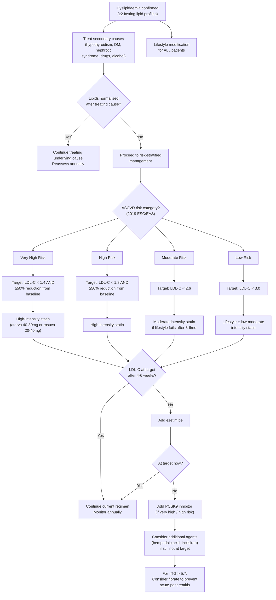

## Management of Dyslipidaemia — Algorithm, Treatment Modalities, Indications, and Contraindications

---

### Framing the Management Philosophy

The management of dyslipidaemia is not about treating a number on a lab report. It is about **reducing lifetime ASCVD events** — MI, stroke, PAD, cardiovascular death. Every decision (lifestyle vs. drug, which drug, how aggressive a target) flows from one question: ***What is this patient's overall cardiovascular risk?***

Think of it in three layers:
1. **Lifestyle modification** — the foundation for everyone, regardless of risk
2. **Treat the underlying cause** — if secondary dyslipidaemia
3. **Pharmacological therapy** — guided by ASCVD risk category and LDL-C target

---

### 1. Management Algorithm — Overview

This stepwise approach mirrors the ***systematic approach to treatment of primary dyslipidaemia*** taught by Prof Tan [4]:

1. ***First, make an accurate Dx (repeat checking, never rely on a single reading)***
2. ***Identify and control other CVD risk factors***
3. ***Obtain several baseline lipid measurements (best with 2)***
4. ***Start with diet therapy — if no secondary causes or not a familial cause. Add a drug to the diet if response is inadequate***
5. ***Substitute another drug or combine drugs if necessary (3–6 months later without improvement)***
6. ***Monitor levels, side effects and clinical manifestations***

---

### 2. Lifestyle Modification — The Foundation

Lifestyle measures are indicated for **ALL** patients with dyslipidaemia, regardless of risk category. They form the **non-pharmacological backbone** of management.

#### 2A. ***Lipid-Lowering Dietary Recommendations*** [4]

| Component | Recommendation | Rationale |
|-----------|---------------|-----------|
| ***CHO*** | ***60%*** | ***Substrate for energy — will be used up, no accumulation*** [4] |
| ***Protein*** | ***12%*** | ***Maintain muscle mass*** [4] |
| ***Saturated fat*** | ***10%*** | Replace saturated with unsaturated fats → ↓LDL-C by 10–15% |
| ***Mono-unsaturated fat*** | ***10%*** | Olive oil, avocado — ↓LDL-C without ↓HDL-C |
| ***Poly-unsaturated fat*** | ***10%*** | ***30% total fat at 1/3 each → essential fatty acid*** [4]; omega-3 (EPA/DHA) may ↓TG |

Additional dietary advice:
- **Reduce trans fats** (partially hydrogenated vegetable oils, fried food, baked goods) — trans fats ↑LDL-C AND ↓HDL-C (worst of both worlds)
- **Increase dietary fibre** (soluble fibre: oats, barley, legumes) — binds bile acids in gut → ↑faecal bile acid excretion → ↓intrahepatic cholesterol → ↑LDLr expression
- **Plant stanols/sterols** (2 g/day in fortified foods) — compete with cholesterol for NPC1L1-mediated absorption → ↓cholesterol absorption by ~30–50% → ↓LDL-C by ~10%
- **Limit alcohol** — small amounts may ↑HDL-C but excess ↑TG via ↑VLDL production

#### 2B. Other Lifestyle Measures

| Measure | Lipid Effect | Mechanism |
|---------|-------------|-----------|
| ***Regular exercise*** (≥150 min/week moderate-intensity aerobic) | ↓TG 10–20%, ↑HDL-C 5–10%, modest ↓LDL-C | ↑LPL activity → ↑TG clearance; ↑AMPK → ↑fatty acid oxidation [1] |
| ***Weight loss*** (5–10% of body weight if overweight/obese) | ↓TG 20%, ↑HDL-C 5–10%, ↓LDL-C 5–10% | ↓visceral adiposity → ↓FFA flux to liver → ↓VLDL production; ↓insulin resistance |
| ***Smoking cessation*** | ↑HDL-C 5–10% (within weeks) | Smoking ↑CETP activity → ↑cholesterol ester transfer from HDL to VLDL → ↓HDL-C; cessation reverses this |
| ***Limit alcohol*** | ↓TG if excessive; modest ↑HDL if moderate | Alcohol → ↑hepatic NADH:NAD⁺ → ↑FFA esterification → ↑VLDL-TG |

<Callout title="Key Concept">
***Drug therapy is warranted if dietary and lifestyle measures fail*** [4, 13]. In very high-risk and high-risk patients, pharmacotherapy should be started **simultaneously** with lifestyle measures (do not wait 3–6 months). In low/moderate-risk patients, lifestyle should be trialled first for ***3–6 months*** before adding drugs [5].
</Callout>

---

### 3. Indications for Pharmacological Treatment

***Indications for drug therapy*** [4, 5, 13]:

| Setting | When to Start Drug Therapy | Notes |
|---------|---------------------------|-------|
| ***Secondary prevention (existing ASCVD)*** | ***Always indicated*** — start simultaneously with lifestyle [5, 13] | ***Aim for LDL-C < 1.4 mmol/L (very high risk)***; statins started within 24h of ACS regardless of lipid level |
| ***Primary prevention — very high or high risk*** | Immediately alongside lifestyle [3] | DM with target organ damage, FH with additional risk factors, SCORE ≥5%, etc. |
| ***Primary prevention — moderate risk*** | ***If not meeting target after lifestyle for 3–6 months*** [5] | |
| ***Primary prevention — low risk*** | ***If LDL-C persistently ≥4.9 mmol/L despite lifestyle*** | Per 2019 ESC/EAS — "markedly elevated single risk factors" automatically become high risk [3] |
| ***↑TG > 5.7 mmol/L*** | ***Consider fibrates to prevent acute pancreatitis*** [5] | Regardless of overall ASCVD risk category — this is about preventing pancreatitis, not ASCVD |

***Priorities for CHD prevention*** [13]:
1. ***Patients with established disease***
2. ***Asymptomatic high-risk patients***
3. ***First-degree relatives of the above***
4. ***Others***

***If with secondary prevention, aim for LDL < 2.6 mmol/L (older guideline threshold). If with primary prevention, start drug with LDL > 4.5 mmol/L (older guideline). NB: only cost-effective with secondary prevention*** [13]. (Note: 2019 ESC/EAS targets are more aggressive than these older thresholds — use the more recent targets in practice.)

---

### 4. Pharmacological Therapy — Drug-by-Drug

#### 4A. ***HMG-CoA Reductase Inhibitors (Statins)*** — First-Line for Hypercholesterolaemia

Statins (from "stat-" = HMG-CoA reductase inhibitor) are the cornerstone of lipid management.

##### Mechanism of Action [5, 14]

***Statins inhibit HMG-CoA reductase*** (3-hydroxy-3-methylglutaryl coenzyme A reductase) — the rate-limiting enzyme of the mevalonate pathway (cholesterol biosynthesis) in hepatocytes.

The cascade:
1. ↓Intracellular cholesterol synthesis
2. Hepatocyte senses ↓cholesterol → activates SREBP-2 transcription factor
3. SREBP-2 upregulates LDL receptor gene expression → ↑LDLr on hepatocyte surface
4. ↑LDLr → ↑clearance of circulating LDL → ↓plasma LDL-C

***Protective effect vs ASCVD is not solely dependent on improving lipid profile*** [5]:
- ***Plaque stabilisation*** (↑fibrous cap thickness, ↓lipid core, ↓macrophage infiltration)
- ***↓Inflammation*** (↓hs-CRP, ↓NF-κB)
- ***Reversal of endothelial dysfunction*** (↑NO bioavailability)
- ***↓Thrombogenicity*** (↓tissue factor expression, ↓platelet aggregation)

These **pleiotropic effects** are why ***statins are indicated for all ischaemic stroke due to thrombosis, regardless of LDL level*** [15].

##### Lipid Effects [3, 14]

***Reduce LDL-C 18–55% & TG 7–30%. Raise HDL-C 5–15%*** [3].

##### Dosing and Intensity [5]

***Generally more conservative in Asians (higher plasma concentration with same dose)*** [5].

| Intensity | LDL-C Reduction | ***Simvastatin (Zocor)*** | ***Atorvastatin (Lipitor)*** | ***Rosuvastatin (Crestor)*** |
|-----------|----------------|----------------------|------------------------|-----------------------|
| ***High intensity (≥50% ↓LDL-C)*** | ≥50% | ***(80mg)*** [5] | ***40mg*** | ***40mg*** |
| ***Moderate intensity (30–49% ↓LDL-C)*** | 30–49% | ***20–80mg*** | ***10–40mg*** | ***10–40mg*** |
| ***Low intensity ( < 30% ↓LDL-C)*** | < 30% | ***10mg*** | — | — |

> **"Rule of 6"**: ***Doubling the statin dose results in only an additional 6% reduction in LDL-C, but increased risk of LFT derangement*** [14]. This is why adding a second agent (ezetimibe) is preferred over pushing the statin to maximum dose — you get more LDL-C lowering with fewer side effects.

***Individual statin characteristics*** [14]:
- ***Simvastatin (Zocor)***: CYP3A4 metabolite; ***SLCO1B1 variant associated with ↑risk of myopathy*** [14]; numerous drug interactions
- ***Atorvastatin (Lipitor)***: CYP3A4 metabolite; ***long half-life; no renal adjustment*** [14]; most commonly used worldwide
- ***Rosuvastatin (Crestor)***: CYP2C9 metabolite; ***long half-life; renal adjustment if GFR < 60*** [14]; most potent at equivalent dose

***Administered at night time*** (for short half-life statins like simvastatin, because hepatic cholesterol synthesis peaks overnight; atorvastatin and rosuvastatin have long half-lives so timing is less critical), ***and avoid grapefruit juice within 4 hours*** (grapefruit inhibits CYP3A4 → ↑statin levels → ↑risk of myopathy) [14].

##### Side Effects [3, 5, 14]

***Generally very well-tolerated (serious side effects < 2%)*** [5].

| Side Effect | Detail | Mechanism / Management |
|------------|--------|----------------------|
| ***Myopathy*** [5, 14] | ***Ranges from myalgia, myopathy, myositis to rhabdomyolysis*** | Spectrum: **Myalgia** (muscle pain, CK normal) → **Myopathy** (muscle weakness ± ↑CK) → **Myositis** (muscle inflammation, CK ↑ > 10× ULN) → **Rhabdomyolysis** (CK ↑ > 40× ULN, myoglobinuria, AKI) — rhabdo is rare (~1/10,000 patient-years) |
| | ***Risk factors: lipophilic statins (e.g., simvastatin), hypothyroidism, CYP3A4 inhibitors*** [5] | Lipophilic statins penetrate skeletal muscle more readily; hypothyroidism ↓drug clearance; CYP3A4 inhibitors (macrolides, azole antifungals, HIV PIs, grapefruit) ↑statin plasma levels |
| | ***S/S: proximal symmetric muscle weakness and/or soreness ± tenderness*** [5] | |
| | ***Dx: clinical + biochemical (↑CK) evidence of muscle injury with compatible temporal pattern*** [5] | |
| | ***Mx: stop statin if severe; switch to pravastatin, fluvastatin, or pitavastatin if mild*** [5] | These are hydrophilic statins with lower myopathy risk. ***Stop if CK > 10× ULN or CK > 3× ULN + symptomatic*** [14] |
| ***Deranged LFT (dose-related)*** | ***↑transaminases (ALT, AST)*** | ***Stop if ALT > 3× ULN*** [14]. Usually reversible. Check ***LFT before initiating*** statin [9, 14]. |
| ***Headache, dyspepsia*** | Non-specific | Symptomatic management |
| ***New-onset DM*** | Small ↑risk (OR ~1.1) | Statins may impair insulin secretion and insulin sensitivity. Risk is dose-dependent. Benefit of ASCVD reduction far outweighs small DM risk in most patients. |

##### Contraindications [3, 14]

***Absolute: severe liver disease*** [3].

***Relative: use with certain drugs*** (CYP3A4 inhibitors) [3].

Additional contraindications [14]:
- ***Pregnancy / breastfeeding*** — cholesterol is essential for foetal development; statins are teratogenic (FDA category X)
- ***Hypothyroidism (untreated)*** — ***↑myopathy risk*** [14]; always ***check TSH before initiating*** statin [14]

<Callout title="Must-Know: Check Before Starting a Statin" type="error">
***Before initiating statin therapy, check*** [9, 14]:
1. ***LFT*** — baseline; C/I if severe liver disease
2. ***CK*** — baseline for future comparison
3. ***TSH*** — untreated hypothyroidism ↑myopathy risk AND is itself a treatable secondary cause of hypercholesterolaemia
4. ***RFT*** — rosuvastatin requires dose adjustment if eGFR < 60
</Callout>

---

#### 4B. ***Ezetimibe*** — Second-Line Add-on

***Ezetimibe*** (ez-ET-ih-mibe): "eze-" relates to its selective mechanism on the intestinal epithelium.

##### Mechanism [14]

***NPC1L1 inhibitor → ↓cholesterol absorption in small intestine*** [14]. When less cholesterol is absorbed, the hepatocyte receives less dietary/biliary cholesterol → ↓intracellular cholesterol → ↑LDLr expression → ↑LDL clearance.

This is **complementary to statins**: statins block synthesis, ezetimibe blocks absorption → together they attack cholesterol from both sides.

##### Lipid Effects [3]

***Lower LDL-C up to 20%. No change in TG. Raise HDL-C 2–3%*** [3].

When added to a statin, provides an additional ~15–20% LDL-C reduction.

##### Indication

***Add-on to statin on max tolerated dose (not typically used alone)*** [14]. Used when statin alone does not achieve target LDL-C. Can be used as monotherapy in statin-intolerant patients.

Landmark trial: **IMPROVE-IT** — adding ezetimibe to simvastatin in ACS patients achieved further ↓LDL-C (1.8 → 1.4 mmol/L) and a significant 6.4% relative reduction in MACE.

##### Side Effects [3]

***Headache, abdominal pain, diarrhoea*** [3]. ***Elevated LFT, muscle pain*** [14] — generally milder than statins.

##### Contraindications [3]

***Moderate or severe hepatic insufficiency*** [3].

---

#### 4C. ***PCSK9 Inhibitors*** — Third-Line for High/Very High Risk

***PCSK9 inhibitors*** — "PCSK9" = proprotein convertase subtilisin/kexin type 9.

##### Mechanism

PCSK9 is a circulating protein that binds to LDL receptors on the hepatocyte surface → directs them for lysosomal degradation → ↓LDLr recycling → ↑plasma LDL-C.

PCSK9 inhibitors are **monoclonal antibodies** (e.g., ***evolocumab*** [Repatha], ***alirocumab*** [Praluent]) that bind and neutralise circulating PCSK9 → LDLr is recycled back to the hepatocyte surface instead of being degraded → ↑LDLr → ↑LDL clearance → dramatic ↓LDL-C.

##### Lipid Effects [14]

***↓↓LDL-C ~60–70%*** [14] (on top of statin). Also modest ↓TG and ↑HDL-C.

##### Indications [5, 6]

- ***Very high-risk patients not at LDL-C target despite maximum tolerated statin + ezetimibe***
- ***Heterozygous FH not at target on maximum statin + ezetimibe*** [6]
- ***Statin intolerance*** (patients who cannot tolerate any statin dose)

Landmark trials: **FOURIER** (evolocumab) and **ODYSSEY OUTCOMES** (alirocumab) — both showed significant reduction in MACE in patients with established ASCVD already on maximised statin therapy.

##### Administration

- Subcutaneous injection, every 2 weeks or monthly depending on agent
- Expensive (~US$5,000–6,000/year before discount), limiting widespread use

##### Side Effects

- Injection site reactions (most common)
- Nasopharyngitis, influenza-like symptoms
- Generally very well tolerated; no significant hepatic or muscle toxicity

##### Contraindications

- Hypersensitivity to the drug
- No absolute hepatic or renal contraindications

---

#### 4D. ***Fibrates (Fibric Acids)*** — First-Line for Severe Hypertriglyceridaemia

***Fibrates*** — examples: gemfibrozil (Lopid), fenofibrate, bezafibrate.

##### Mechanism

PPARα (peroxisome proliferator-activated receptor alpha) agonists:
1. ↑LPL expression → ↑TG hydrolysis → ↓plasma TG
2. ↑apoA-I and apoA-II expression → ↑HDL production
3. ↓apoC-III expression (apoC-III inhibits LPL) → further ↑TG clearance
4. ↑hepatic fatty acid β-oxidation → ↓hepatic VLDL-TG secretion

##### Lipid Effects [3]

***Lower TG 20–50%. Raise HDL-C 10–20%. Lower LDL-C 5–20% (with normal TG). May raise LDL-C (with high TG)*** [3].

> **Why might fibrates raise LDL-C in severe hypertriglyceridaemia?** When you enhance TG clearance from VLDL, the VLDL particles shrink and get converted more efficiently into IDL and then LDL. If the LDLr capacity is already saturated, this surge of newly formed LDL accumulates → paradoxical ↑LDL-C. This is why **combining fibrate + statin** is sometimes needed in mixed hyperlipidaemia.

##### Indications [5, 13]

- ***↑TG > 5.7 mmol/L → consider fibrates to prevent acute pancreatitis*** [5]
- Mixed hyperlipidaemia (in combination with statin)
- ***Fibrates have a major effect on TG-rich lipoproteins and raise HDL*** [13]

##### Side Effects [3]

***Dyspepsia, gallstones, myopathy*** [3].
- **Gallstones**: Fibrates ↑biliary cholesterol secretion → ↑cholesterol saturation of bile → lithogenic
- **Myopathy**: Risk markedly ↑ when combined with statins — especially gemfibrozil (competes for glucuronidation pathway → ↑statin levels); **fenofibrate is the preferred fibrate for statin combination** because it does not share this interaction

##### Contraindications [3]

***Severe renal or hepatic disease*** [3].

---

#### 4E. ***Bile Acid Sequestrants (Anion Exchange Resins)***

Examples: cholestyramine, colestipol, colesevelam.

##### Mechanism

These are non-absorbable resins that bind bile acids in the intestinal lumen → prevent bile acid reabsorption in the ileum → ↑faecal bile acid excretion → hepatocyte must synthesise more bile acids from cholesterol → ↓intracellular cholesterol → ↑LDLr expression → ↑LDL clearance → ↓LDL-C.

##### Lipid Effects [3]

***Reduce LDL-C 15–30%. Raise HDL-C 3–5%. May increase TG*** [3].

> **Why may they increase TG?** The ↓intrahepatic cholesterol also triggers compensatory ↑VLDL-TG synthesis (the liver ramps up VLDL production as part of its response to ↓cholesterol stores). This is why they are contraindicated in patients with already elevated TG.

##### Side Effects [3]

***GI distress / constipation*** [3] — these are bulky resins that cause bloating, flatulence, and constipation.

***Decreased absorption of other drugs*** [3] — bile acid sequestrants bind many medications (warfarin, thyroxine, thiazides, digoxin, statins) → must be taken ≥1 hour before or ≥4 hours after other medications.

##### Contraindications [3]

***Dysbetalipoproteinaemia (type III)*** [3] — worsens remnant accumulation.

***Raised TG (especially > 400 mg/dL, i.e., > 4.5 mmol/L)*** [3] — will further ↑TG.

---

#### 4F. ***Nicotinic Acid (Niacin, Vitamin B3)***

##### Mechanism

The exact mechanism is complex and not fully understood:
- ↓Hepatic VLDL-TG synthesis (via inhibiting hormone-sensitive lipase in adipose tissue → ↓FFA flux to liver)
- ↓Hepatic apoB secretion → ↓LDL production
- ↑ApoA-I production → ↑HDL

It is the most effective drug for raising HDL-C.

##### Lipid Effects [3]

***Lowers LDL-C 5–25%. Lowers TG 20–50%. Raises HDL-C 15–35%*** [3].

##### Side Effects [3]

***Flushing, hyperglycaemia, hyperuricaemia, upper GI distress, hepatotoxicity*** [3].
- **Flushing**: Prostaglandin D2-mediated cutaneous vasodilation — the most common reason patients stop niacin; can be mitigated by aspirin pre-dosing or extended-release formulation
- **Hyperglycaemia**: ↑insulin resistance — problematic in DM patients
- **Hyperuricaemia**: Competes with uric acid for renal excretion → may precipitate gout

##### Contraindications [3]

***Liver disease, severe gout, peptic ulcer*** [3].

##### Current Status

**Largely fallen out of favour.** The AIM-HIGH and HPS2-THRIVE trials showed that adding niacin to statin therapy provided **no additional ASCVD benefit** despite improving lipid numbers, and increased adverse events. Most guidelines no longer recommend routine use.

***Acipimox*** — ***fewer side effects but less effective in its lipid-lowering effect*** [3].

---

#### 4G. Newer Agents

| Agent | Mechanism | Lipid Effect | Indications | Key Points |
|-------|-----------|-------------|-------------|------------|
| **Bempedoic acid** (Nexletol) | Inhibits ATP citrate lyase (ACL) — upstream of HMG-CoA reductase in the cholesterol synthesis pathway; **only active in hepatocytes** (requires activation by hepatic ACSVL1 enzyme, which is absent in muscle) | ↓LDL-C ~18% (monotherapy), ~15% added to statin | Statin-intolerant patients; add-on when statin + ezetimibe not sufficient | No myopathy (because inactive in muscle cells); may ↑uric acid → gout risk |
| **Inclisiran** (Leqvio) | siRNA (small interfering RNA) targeting PCSK9 mRNA in hepatocytes → ↓PCSK9 protein synthesis → ↑LDLr | ↓LDL-C ~50% | Same as PCSK9 inhibitors; advantage: given only twice yearly (SC injection) | ORION trials; long dosing interval improves adherence |
| **Icosapent ethyl** (Vascepa) | Purified EPA (omega-3 fatty acid); mechanism beyond TG lowering — ↓inflammation, ↓oxidative stress, membrane stabilisation | ↓TG ~20%; ↓ASCVD events | Statin-treated patients with TG 1.5–5.6 AND established ASCVD or DM + ≥1 RF | REDUCE-IT trial: 25% relative risk reduction in MACE |
| **Volanesorsen** | Antisense oligonucleotide targeting apoC-III mRNA → ↓apoC-III → ↑LPL activity | ↓TG ~70% | Familial chylomicronaemia syndrome (severe TG > 10) | Approved in EU; risk of thrombocytopenia |
| ***LDL apheresis*** [6] | Extracorporeal removal of LDL from blood using immunoadsorption or precipitation | ↓LDL-C ~60% per session | ***Homozygous FH; severe heterozygous FH not responding to maximal therapy*** [6] | ***Every 1–4 weeks*** [6]; expensive, time-consuming |
| ***Liver transplantation*** [6] | Replaces dysfunctional hepatic LDLr with normal LDLr | Normalises LDL-C | ***Pre-emptive liver transplant in homozygous FH to replace dysfunctional hepatic LDLr before onset of significant coronary artery disease*** [6] | Significant operative risk + long-term immunosuppression |

---

### 5. Management by Clinical Scenario

#### 5A. Primary Hypercholesterolaemia (↑LDL-C as Main Problem)

***↑Cholesterol: statin (1st line) → ezetimibe (2nd line) → bile acid sequestrants / PCSK9 inhibitor*** [5].

**Stepwise approach**:
1. **Lifestyle** (diet, exercise, weight loss, smoking cessation)
2. **Statin** — high-intensity for very high/high risk; moderate-intensity for moderate risk
3. If not at target after 4–6 weeks: **Add ezetimibe**
4. If still not at target: **Add PCSK9 inhibitor** (for very high/high risk patients)
5. If still not at target or statin-intolerant: Consider **bempedoic acid, inclisiran**, or **bile acid sequestrants**

For ***FH specifically*** [6]:
- ***Statin: 1st line, prefer atorvastatin or rosuvastatin*** [6]
- ***2nd line: majority will not achieve LDL-C target → add ezetimibe or PCSK9 inhibitor*** [6]
- ***3rd line: consider investigational Tx, e.g., LDL apheresis, liver transplantation, partial ileal bypass surgery*** [6]

#### 5B. Primary Hypertriglyceridaemia (↑TG as Main Problem)

**Approach depends on severity**:

| TG Level | Action | Rationale |
|----------|--------|-----------|
| ***1.7–5.6 mmol/L*** | Lifestyle (especially diet, exercise, weight loss, limit alcohol); optimise glycaemic control if DM | Moderate ↑TG contributes to ASCVD risk but pancreatitis risk is low |
| ***> 5.7 mmol/L*** | ***Consider fibrates to prevent acute pancreatitis*** [5] + aggressive lifestyle; may need to hold/reduce oestrogen, retinoids, or other TG-raising drugs | Pancreatitis risk becomes significant |
| ***> 10 mmol/L*** | ***Urgent fibrate ± dietary fat restriction; consider hospitalisation if symptomatic*** | Imminent pancreatitis risk; ***dietary restriction, fibrates, ± fish oil*** [6] |
| **After TG controlled** | Reassess ASCVD risk and LDL-C — may need statin for residual ASCVD risk | ↓TG alone may not adequately address LDL-C-driven atherosclerosis |

#### 5C. Mixed Hyperlipidaemia (↑LDL-C + ↑TG)

***For combined hyperlipidaemia*** [4, 6]:
- ***Anion exchange resin + fibrate / nicotinic acid*** [4]
- ***HMG-CoA reductase inhibitor (statin) + fibrate*** [4]
- ***Statin as 1st line (regardless of TG level → can ↓apoB levels) ± ezetimibe*** [6]
- ***Role of addition of fibrate and niacin for ↑TG controversial as benefit on ↓ASCVD events doubtful in RCTs*** [6]

**Practical approach**: Start statin (targets LDL-C and ↓apoB), then add fibrate (fenofibrate preferred over gemfibrozil for safety in combination) if TG remains > 2.3 mmol/L. Do NOT combine gemfibrozil + statin due to ↑↑rhabdomyolysis risk.

#### 5D. ***Dyslipidaemia in DM*** [14, 16]

***DM is classified as "high risk" under risk stratification for CHD → intensive statin therapy*** [14].

Management targets for diabetic patients [14]:
- ***BP < 130/80***
- ***LDL ≤ 1.8*** (high risk) or ***< 1.4*** (very high risk with target organ damage)
- ***Smoking cessation***
- ***Consider SGLT2i or GLP-1 agonist*** [9] — cardiorenal benefits beyond glucose lowering

#### 5E. Dyslipidaemia in CKD [17]

***Statin: indication similar to non-CKD patients*** [17].
- KDIGO 2013 recommends statin or statin/ezetimibe combination in CKD patients ≥50 years, or those with known ASCVD, DM, or estimated 10-year ASCVD risk > 10%
- In dialysis patients, **do NOT initiate** statin (AURORA and 4D trials showed no benefit in haemodialysis patients) — but if already on a statin before starting dialysis, it can be continued

#### 5F. Dyslipidaemia in Nephrotic Syndrome [17, 18]

***Lipid-lowering drugs by statins (drug of choice)*** [17, 18].
- ***Should be considered if hyperlipidaemia persists after treatment of underlying disorder (by immunosuppressive Tx) and/or ACEI/ARB*** [17, 18]
- ***ACEI/ARB is also likely to ↓hepatic lipoprotein production by reducing albumin loss in urine*** [17, 18]

#### 5G. Dyslipidaemia in Stroke [15]

***Statins for all ischaemic stroke due to thrombosis, regardless of LDL level*** [15].
- ***Role: plaque stabilisation, corrects endothelial dysfunction (not limited to ↓LDL)*** [15]

#### 5H. PAD [16]

***Statin regardless of lipid level for overall CVS protection*** [16].

---

### 6. ***Lipid-Lowering Drugs — Comprehensive Summary Table*** [3, 4]

| Drug Class | ***LDL-C*** | ***TG*** | ***HDL-C*** | Major Side Effects | Contraindications | Primary Role |
|-----------|-----------|--------|-----------|-------------------|-------------------|-------------|
| ***Statins*** | ***↓18–55%*** | ***↓7–30%*** | ***↑5–15%*** | ***Myopathy, ↑liver enzymes*** | ***Severe liver disease; pregnancy; untreated hypothyroidism*** | ***1st line for ↑LDL-C*** |
| ***Ezetimibe*** | ***↓up to 20%*** | ***No change*** | ***↑2–3%*** | ***Headache, abdominal pain, diarrhoea*** | ***Moderate/severe hepatic insufficiency*** | ***2nd line add-on to statin*** |
| ***PCSK9 inhibitors*** | ↓60–70% | Modest ↓ | Modest ↑ | Injection site reactions | Hypersensitivity | 3rd line for very high/high risk |
| ***Fibrates*** | ***↓5–20%*** | ***↓20–50%*** | ***↑10–20%*** | ***Dyspepsia, gallstones, myopathy*** | ***Severe renal or hepatic disease*** | ***1st line for severe ↑TG*** |
| ***Bile acid sequestrants*** | ***↓15–30%*** | ***May ↑TG*** | ***↑3–5%*** | ***GI distress, constipation, ↓drug absorption*** | ***Type III dyslipoproteinaemia; ↑TG (> 400 mg/dL)*** | Adjunct for ↑LDL-C |
| ***Nicotinic acid*** | ***↓5–25%*** | ***↓20–50%*** | ***↑15–35%*** | ***Flushing, hyperglycaemia, hyperuricaemia, hepatotoxicity*** | ***Liver disease, severe gout, peptic ulcer*** | Largely abandoned |
| ***Bempedoic acid*** | ↓15–18% | Minimal | Minimal | ↑Uric acid, tendon rupture | Hypersensitivity | Statin-intolerant patients |
| ***Icosapent ethyl*** | Minimal | ↓~20% | Minimal | AF, bleeding | Hypersensitivity to fish/shellfish | ASCVD risk reduction with ↑TG on statin |

---

### 7. Monitoring on Treatment

***Monitor levels, side effects, and clinical manifestations*** [4].

| Parameter | Frequency | Action |
|-----------|-----------|--------|
| **Fasting lipid profile** | 4–6 weeks after starting/changing therapy; then every 6–12 months once stable | Assess if LDL-C target achieved |
| **LFT (ALT)** | Before starting statin; 8–12 weeks after starting; annually thereafter | ***Stop statin if ALT > 3× ULN*** [14] |
| **CK** | At baseline; only recheck if symptoms of myalgia/weakness develop | ***Stop if CK > 10× ULN, or CK > 3× ULN + symptomatic*** [14] |
| **Fasting glucose / HbA1c** | Annually (patients on high-dose statin) | Screen for new-onset DM |
| **Symptoms** | Every visit | Ask about muscle pain, weakness, GI symptoms |
| **Clinical ASCVD events** | Ongoing | Adjust risk category if new events occur |

---

### 8. ***Prevention Framework*** [4]

***Primary prevention (未雨綢繆)***: ***With mainly statins, can reduce CHD, stroke*** [4].

***Secondary prevention (亡羊補牢)***: Treatment after established ASCVD [4].

***(Family screening)***: Cascade screening of first-degree relatives — especially for FH [4].

<Callout title="High Yield Summary — Management">

1. ***Lifestyle modification is the foundation for ALL patients***: diet (60% CHO, 12% protein, 30% fat as 1/3 each of saturated/mono-/polyunsaturated), exercise ≥150 min/week, weight loss, smoking cessation [4].

2. ***Statins are first-line for hypercholesterolaemia*** — mechanism: ↓HMG-CoA reductase → ↓intracellular cholesterol → ↑LDLr → ↑LDL clearance. Also have pleiotropic benefits (plaque stabilisation, ↓inflammation) [5].

3. ***Check LFT, CK, TSH before starting a statin*** [9, 14].

4. ***Rule of 6: doubling the statin dose only gives an additional 6% LDL-C reduction*** → add ezetimibe rather than push dose [14].

5. ***Stepwise escalation***: Statin → + ezetimibe → + PCSK9 inhibitor (for very high/high risk not at target) [5, 6].

6. ***Fibrates are first-line when TG > 5.7 mmol/L to prevent pancreatitis*** [5].

7. ***Bile acid sequestrants are contraindicated in type III dyslipidaemia and ↑TG*** [3].

8. ***Nicotinic acid raises HDL-C the most (15–35%) but has largely fallen out of favour*** due to lack of ASCVD benefit in trials and significant side effects [3].

9. ***In homozygous FH, statins are relatively ineffective → LDL apheresis ± liver transplantation*** [6].

10. ***Secondary prevention: statin always indicated in established ASCVD, stroke, PAD — regardless of LDL level*** [13, 15, 16].

11. ***2019 ESC/EAS targets***: Very high risk < 1.4 mmol/L AND ≥50% reduction; high risk < 1.8 AND ≥50%; moderate < 2.6; low < 3.0 [3].

</Callout>

---

<ActiveRecallQuiz
  title="Active Recall - Management of Dyslipidaemia"
  items={[
    {
      question: "Describe the stepwise approach to pharmacological management of hypercholesterolaemia in a very high-risk patient not at LDL-C target.",
      markscheme: "Step 1: High-intensity statin (atorvastatin 40-80mg or rosuvastatin 20-40mg). Step 2: If not at target (LDL-C < 1.4 mmol/L AND >=50% reduction) after 4-6 weeks, add ezetimibe. Step 3: If still not at target, add PCSK9 inhibitor (evolocumab or alirocumab). Step 4: Consider bempedoic acid or inclisiran if still not at target. Lifestyle modification throughout."
    },
    {
      question: "What is the 'Rule of 6' for statins, and what is its clinical implication?",
      markscheme: "Doubling the statin dose results in only an additional 6% reduction in LDL-C, but increases risk of side effects including LFT derangement. Clinical implication: rather than pushing statin to maximum dose, it is more effective and safer to add a second agent (ezetimibe) for additional LDL-C lowering."
    },
    {
      question: "Why are bile acid sequestrants contraindicated in hypertriglyceridaemia and type III dyslipidaemia?",
      markscheme: "In hypertriglyceridaemia: bile acid sequestrants decrease intrahepatic cholesterol, which triggers compensatory increased VLDL-TG synthesis by the liver, further raising TG levels. In type III (familial dysbetalipoproteinaemia): there is already impaired clearance of IDL/remnant particles; bile acid sequestrants worsen remnant accumulation by increasing VLDL production."
    },
    {
      question: "A patient with familial chylomicronaemia has TG of 15 mmol/L. Why are statins relatively unhelpful here, and what is the first-line treatment?",
      markscheme: "Statins work by upregulating LDL receptors to clear LDL-C, but the problem in familial chylomicronaemia is deficiency of LPL or apoC-II leading to inability to hydrolyse TG-rich chylomicrons. LDL-C is not the primary abnormality. First-line treatment is strict dietary fat restriction (to reduce chylomicron production) plus fibrates (PPARalpha agonist which increases residual LPL activity and decreases hepatic VLDL output) plus or minus fish oil."
    },
    {
      question: "List 4 things to check before initiating statin therapy and explain why each is important.",
      markscheme: "1. LFT (ALT): baseline before potential statin hepatotoxicity; also contraindicated in severe liver disease. 2. CK: baseline for comparison if patient develops myopathy symptoms later. 3. TSH: untreated hypothyroidism increases myopathy risk and is itself a treatable secondary cause of hypercholesterolaemia. 4. RFT (creatinine, eGFR): rosuvastatin requires dose adjustment if eGFR < 60."
    },
    {
      question: "Compare fenofibrate and gemfibrozil in terms of safety when combined with a statin. Which is preferred and why?",
      markscheme: "Fenofibrate is preferred over gemfibrozil for combination with statins. Gemfibrozil competes with statins for glucuronidation (UGT1A3 pathway), markedly increasing statin plasma levels and dramatically increasing the risk of rhabdomyolysis. Fenofibrate does not share this metabolic interaction, making it much safer in combination."
    }
  ]}
/>

## References

[1] Senior notes: Ryan Ho Endocrine.pdf (Section: Type 2 DM, Metabolic Syndrome, p77)
[3] Lecture slides: three cases of lipid disorder.pdf (p33, p38, p52, p58, p62, p65, p72 — 2019 ESC/EAS Guidelines, drug classes)
[4] Lecture slides: Teaching Clinic - Endocrinology - Three cases of lipid disorders - by Prof KCB Tan.pdf.pdf (p4, p7, p8 — systematic approach, dietary recommendations, drug treatment, prevention priorities)
[5] Senior notes: Ryan Ho Endocrine.pdf (Section: Management of dyslipidaemia, statins, p125, p128)
[6] Senior notes: Ryan Ho Endocrine.pdf (Section: FH management, familial chylomicronaemia management, p131)
[9] Senior notes: Ryan Ho Cardiology.pdf (Section: Baseline evaluation of stable IHD — LFT, CK before statin, p116)
[13] Lecture slides: Teaching Clinic - Endocrinology - Three cases of lipid disorders - by Prof KCB Tan.pdf.pdf (p8 — indications for drug therapy, priorities for CHD prevention)
[14] Senior notes: Maksim MEDICINE notes.pdf (Section: Drugs for hyperlipidaemia, p63)
[15] Senior notes: Ryan Ho Neurology.pdf (Section: Secondary prevention of stroke — statins, p83)
[16] Senior notes: Maksim SURGERY notes.pdf (Section: PAD management — statin regardless of lipid level, p167)
[17] Senior notes: Ryan Ho Urogenital.pdf (Section: CKD cardiovascular risk factor management, p109; Nephrotic syndrome management, p76)
[18] Senior notes: Ryan Ho Fundamentals.pdf (Section: Glomerulonephropathy management — statins, p368)
