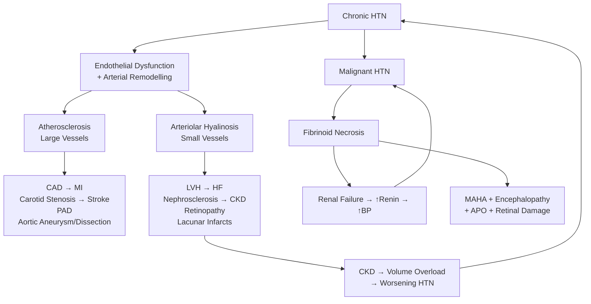

## Complications of Hypertension

---

### Organising Framework

The complications of hypertension flow directly from the fundamental pathophysiology established in Part 1: chronic elevation in blood pressure exerts **mechanical shear stress** on the arterial wall and promotes **neurohormonal activation** (RAAS, SNS, endothelin) → these dual insults cause:

1. **Large artery disease** (accelerated atherosclerosis, aneurysmal degeneration, dissection)
2. **Small artery/arteriolar disease** (hyaline arteriosclerosis, lipohyalinosis, fibrinoid necrosis)
3. **Target organ damage** through ischaemia, pressure overload, and vascular remodelling

***Consequences: leads to target organ damage (TOD) → clinical events → death*** [2]

I will systematically cover complications organ by organ, explaining the "why" from first principles, then address the special catastrophic complications (malignant HTN, hypertensive crisis).

---

### 1. Cardiac Complications

The heart is simultaneously exposed to **pressure overload** (↑afterload from ↑SVR) and **coronary atherosclerosis** (from endothelial dysfunction and lipid deposition).

#### 1.1 Left Ventricular Hypertrophy (LVH)

***Pathology: chronic pressure overload → ventricular remodelling*** [7]

**Why does LVH develop?** According to Laplace's Law:

$$
\text{Wall Stress} = \frac{\text{Pressure} \times \text{Radius}}{2 \times \text{Wall Thickness}}
$$

When pressure (afterload) chronically increases, wall stress rises. The myocardium compensates by thickening — **concentric hypertrophy** — to normalise wall stress. This is initially adaptive but eventually maladaptive:

- **Adaptive phase**: Thicker walls reduce wall stress → preserved systolic function
- **Maladaptive phase**: Hypertrophied myocytes become fibrotic, have ↓capillary density (relative ischaemia), and develop impaired relaxation

**Consequences of LVH:**
- **Diastolic dysfunction** → the stiff LV fills poorly → ↑LV filling pressures → pulmonary congestion → exertional dyspnoea → **HFpEF** (Heart Failure with preserved Ejection Fraction)
- **Arrhythmias** — disorganised myocardial fibres + fibrosis create re-entrant circuits → **atrial fibrillation** (from LA dilatation due to ↑filling pressures) and ventricular arrhythmias → sudden cardiac death
- **Subendocardial ischaemia** — ↑myocardial O₂ demand (↑muscle mass) but ↓supply (↓capillary density, ↑diastolic wall tension compresses intramural coronaries) → "LV strain" pattern on ECG (ST depression + T inversion in lateral leads)

> LVH is an **independent predictor of cardiovascular events** — even after correcting for BP level. This is why echocardographic LVH assessment matters.

#### 1.2 Heart Failure

***Cardiac complications: ventricles → LVH, HFpEF*** [7]

The progression:
1. **Concentric LVH** → diastolic dysfunction → **HFpEF** (most common initial pattern in HTN)
2. Progressive myocyte death and fibrosis → eccentric dilatation → **HFrEF**
3. In malignant HTN: acute ↑afterload overwhelms compensatory mechanisms → ***acute LV failure*** [2]

#### 1.3 Coronary Artery Disease (CAD)

***Others: AF, coronary artery disease*** [7]

HTN accelerates atherosclerosis through:
- ↑Endothelial shear stress → endothelial injury → ↑LDL entry into vessel wall → foam cell formation → plaque
- ↑Smooth muscle proliferation → plaque growth
- ↑Inflammatory mediators (Ang II is pro-inflammatory) → plaque instability → rupture → ACS

Combined with LVH-induced ↑O₂ demand, this creates a devastating supply-demand mismatch → **angina, MI, ischaemic cardiomyopathy**.

#### 1.4 Atrial Fibrillation

- LVH → diastolic dysfunction → ↑LA pressure → **LA dilatation** → structural substrate for AF
- AF then → loss of atrial "kick" (contributes 20-30% of CO) → further haemodynamic compromise
- AF + HTN → ↑stroke risk (CHA₂DS₂-VASc scoring)

<Callout title="Cardiac Complications — Summary">

***Cardiac*** [7]:
- **LVH** → diastolic dysfunction → HFpEF → eventually HFrEF
- **Coronary artery disease** → angina, MI
- **Atrial fibrillation** → thromboembolic stroke
- **Acute LV failure** (in malignant HTN / hypertensive emergency)

These are the **leading cause of death** in hypertensive patients.
</Callout>

---

### 2. Cerebrovascular Complications

***Nervous system: cerebrovascular accident*** [3]

Stroke is the **most devastating complication of HTN in the Chinese/HK population** — it is more common than IHD as the first presentation of HTN-related vascular disease in Asians.

#### 2.1 Ischaemic Stroke

***Ischaemic stroke (75-80% of all strokes)*** [16]

HTN promotes ischaemic stroke via multiple mechanisms:
- **Large artery atherosclerosis**: HTN accelerates atheroma in carotid bifurcation, vertebrobasilar system, intracranial arteries → artery-to-artery embolism or in-situ thrombosis
- ***Small vessel disease: hypertensive lipohyalinosis (commonest cause of small vessel disease)*** [16] → occlusion of perforating arteries → **lacunar infarcts** (small deep infarcts in basal ganglia, thalamus, internal capsule, pons)
- **Cardioembolism**: HTN → AF (see above) → thrombus in LA appendage → cerebral embolism

**Lacunar syndromes** (classic small vessel/HTN-related strokes):
- Pure motor hemiparesis (posterior limb of internal capsule)
- Pure sensory stroke (thalamus)
- Ataxic hemiparesis (pons/internal capsule)
- Dysarthria-clumsy hand syndrome (pons)

#### 2.2 Haemorrhagic Stroke (Intracerebral Haemorrhage — ICH)

***Haemorrhagic stroke: mostly related to hypertension*** [11]

This is the hallmark "hypertensive complication" — and a leading cause of stroke-related death.

**Pathophysiology:**
- Chronic HTN → **lipohyalinosis** of small perforating arteries (lenticulostriate, thalamoperforating, paramedian pontine arteries) → weakened vessel walls → formation of **Charcot-Bouchard microaneurysms** → rupture under acute ↑BP → ICH

***Aetiology of ICH (in order of prevalence)*** [15]:
- ***Hypertensive arteriopathy (rupture of capillary microaneurysms): deep ICH — more central***
- ***Common sites: pons, cerebellum, putamen, thalamus*** [11][15]
- ***Cerebral amyloid angiopathy (CAA): lobar ICH — more peripheral*** [15]
- ***Others: coagulopathy, structural vascular lesions (Berry aneurysms, AVM), drugs (cocaine)*** [15]

***Appearance on CT*** [11]:
- ***Acute: hyperdense*** (fresh blood is radiodense due to haemoglobin)
- ***Subacute: isodense*** (haemoglobin degradation)
- ***Chronic: hypodense*** (liquefaction)

The location tells you the cause:
| Location | Likely Cause |
|---|---|
| **Putamen** (most common) | Hypertensive arteriopathy (lenticulostriate arteries) |
| **Thalamus** | Hypertensive arteriopathy (thalamoperforating arteries) |
| **Pons** | Hypertensive arteriopathy (paramedian pontine branches) |
| **Cerebellum** | Hypertensive arteriopathy (cerebellar branches of PICA/SCA) |
| **Lobar** (cortical/subcortical) | Cerebral amyloid angiopathy, AVM, tumour |

#### 2.3 Hypertensive Encephalopathy

***HTN encephalopathy: cerebral oedema → insidious onset of headache, N/V followed by non-localising neurological symptoms (confusion, restlessness), visual disturbances, transient paralysis, seizure, coma*** [2]

**Why does it happen?** Normal cerebral autoregulation maintains constant cerebral blood flow (CBF) across a MAP range of ~60–150 mmHg by adjusting arteriolar tone. When BP exceeds the upper autoregulatory limit:
- Arterioles can no longer vasoconstrict sufficiently → **forced dilatation** → breakthrough hyperperfusion
- Blood-brain barrier breakdown → vasogenic cerebral oedema
- This is often most pronounced posteriorly (posterior reversible encephalopathy syndrome = PRES) → visual symptoms

It is **reversible** with controlled BP reduction — this is why it's called "reversible encephalopathy." However, if untreated, it can progress to herniation and death.

#### 2.4 Transient Ischaemic Attack (TIA)

- Same pathophysiology as ischaemic stroke but symptoms resolve within 24 hours
- TIA is a **warning sign** — 90-day stroke risk is 10-20% without treatment

<Callout title="Cerebrovascular Complications — Key Points">

- HTN is the **single most important modifiable risk factor** for both ischaemic AND haemorrhagic stroke
- In HK/Chinese populations, stroke (especially haemorrhagic) is relatively more common as the presenting complication of HTN compared to Western populations
- ***Common sites of hypertensive ICH: pons, cerebellum, putamen, thalamus*** [11][15] — all deep structures supplied by perforating arteries prone to lipohyalinosis
- Hypertensive encephalopathy = breakthrough cerebral hyperperfusion → vasogenic oedema → reversible with BP control
</Callout>

---

### 3. Renal Complications

The kidney is both a **cause and a victim** of hypertension — a vicious cycle.

#### 3.1 Hypertensive Nephrosclerosis

***Renal: impaired renal function*** [3]

**Pathophysiology:**
- Chronic HTN → **hyaline arteriosclerosis** of the afferent arterioles → narrowed lumen → ↓glomerular perfusion → **glomerular ischaemia** → progressive nephron loss → **CKD**
- Additionally: ↑intraglomerular pressure (if afferent arteriosclerosis is not uniform) → glomerular hyperfiltration → glomerulosclerosis → further nephron loss
- The remaining nephrons compensate by hyperfiltration → further damage → progressive GFR decline

This creates a **vicious cycle**: CKD → impaired Na⁺ excretion → volume overload → worsening HTN → further renal damage.

Two forms:
- **Benign nephrosclerosis**: slow progression over years/decades; most common cause of ESRD attributed to HTN
- **Malignant nephrosclerosis**: in malignant HTN → **fibrinoid necrosis** of arterioles → rapid ↓GFR → ***acute RF with oliguria, proteinuria*** [2]

#### 3.2 CKD and Its Downstream Complications

***CKD is an independent risk factor for cardiovascular disease*** [17]:
- ***↑Prevalence of traditional risk factors: HTN, smoking, DM, dyslipidaemia***
- ***Medial vascular calcification due to ↑Ca balance + ↑PO₄***
- ***↑Atherosclerosis due to ↑inflammatory state, ↑cytokines, uraemia***

Once CKD develops from hypertensive nephrosclerosis, the patient faces the full spectrum of CKD complications:
- **Volume overload** → oedema, pulmonary oedema [17]
- **Hyperkalaemia** [17]
- **Metabolic acidosis**
- **Anaemia** (↓EPO production)
- **Renal osteodystrophy** (↓vitamin D activation, ↑PO₄, secondary hyperparathyroidism)
- **Uraemic bleeding** (platelet dysfunction from uraemic toxins) [17]
- **Uraemic pericarditis**
- Eventually **ESRD** requiring RRT (dialysis or transplant)

#### 3.3 Proteinuria and Microalbuminuria

- Early sign of hypertensive renal damage — appears before GFR decline
- ***Microalbuminuria or eGFR < 60 mL/min*** is itself a CVD risk factor [1]
- Represents endothelial dysfunction in glomerular capillaries — a "window" into systemic endothelial health

---

### 4. Retinal Complications (Hypertensive Retinopathy)

***Eyes: retinal exudates and haemorrhages, papilloedema*** [3]

***Hypertensive retinopathy: majority asymptomatic ± blurring of vision associated with headache*** [2]

#### 4.1 Pathophysiology of Hypertensive Retinopathy

The retina provides a **direct window** into the microvascular effects of HTN. The pathological process follows a predictable sequence [18]:

**Phase 1 — Arteriosclerosis (chronic HTN):**
- ***Prolonged ↑BP → ↑shear stress → arterial sclerosis and hyalinisation*** [18]
- ***Vessel wall sclerosis → light reflex becomes more diffuse → copper wiring (red-brown appearance) → further involvement → silver wiring (silvery vessels with no blood column seen)*** [18]
- ***Vasospasm occurs in prolonged ↑BP → focal/diffuse narrowing of arterioles*** [18]
- ***AV nipping: arteriolar thickening → venous compression at AV junction → "hour-glass" venous constrictions*** [18]

**Phase 2 — Fibrinoid necrosis (acute severe HTN / malignant HTN):**
- ***Acute ↑↑BP → endothelial damage → arteriolar smooth muscle degeneration → endothelial stretching → breakdown of blood-retinal barrier*** [18]
- ***→ Leakage of transudate and macromolecules → flame/dot-and-blot haemorrhage and hard exudates*** [18]
- ***Endothelial dysfunction → plasma clotting → retinal ischaemia → fluffy cotton wool spots*** [18]
- ***Leakage + ischaemia at optic disc → papilloedema + disc haemorrhage*** [18]

#### 4.2 Classification

***Fundoscopy: classification based on Modified Scheie classification*** [18]:

| | Malignant Hypertension | Chronic Arteriosclerotic Changes |
|---|---|---|
| ***Grade 1*** | ***Barely detectable arterial narrowing*** | ***Stage 1: Widening of arteriole reflex*** |
| ***Grade 2*** | ***Obvious arterial narrowing with focal irregularities*** | ***Stage 2: Arteriovenous crossing sign*** |
| ***Grade 3*** | ***G2 + retinal haemorrhages, exudates, cotton wool spots, or retinal oedema*** | ***Stage 3: Copper-wire arteries*** |
| ***Grade 4*** | ***G3 + papilloedema*** | ***Stage 4: Silver-wire arteries*** |

#### 4.3 Further Retinal Complications

***Complications of hypertensive retinopathy*** [18]:
- ***Retinal vascular disease: CRAO/BRAO, CRVO/BRVO, retinal arterial macroaneurysms***
- ***Retinal ischaemia: neovascularisation (vitreous haemorrhage, rhegmatogenous retinal detachment), epiretinal membrane***
- ***↑Progression of DM retinopathy*** (HTN is a major accelerating factor!)
- ***Chronic papilloedema: optic nerve atrophy*** → permanent visual loss

***CRVO: acute sudden onset painless blurring of vision*** [2] — caused by thrombus in the central retinal vein at the lamina cribrosa, where the artery and vein share a common adventitial sheath. HTN-induced arteriosclerosis compresses the vein → stasis → thrombosis.

---

### 5. Vascular Complications

***Vessels: macrovascular atherosclerosis + microvascular hyaline arteriosclerosis*** [7]

#### 5.1 Aortic Aneurysm

- HTN → ↑wall stress on the aorta → medial degeneration (↓elastin, ↑collagen) → aneurysmal dilatation
- Abdominal aortic aneurysm (AAA) — infrarenal is most common site
- Risk of rupture increases with size: ***Aneurysm < 5 cm = 20% rupture at 5 years; > 5 cm = 50%*** [19]

#### 5.2 Aortic Dissection

***HTN is the most important risk factor for aortic dissection*** [19]:

**Pathophysiology:**
- ***Tear in aortic intima → blood passes into aortic media → creates a false lumen separating intima from media/adventitia*** [19]
- ***False lumen dilation depends on BP, size of entry tear, depth of dissection plane*** [19]
- HTN → chronically weakened media (cystic medial degeneration) → prone to tearing under acute ↑BP stress

**Complications of dissection** [19]:
- ***Type A:***
  - ***Dissection into aortic valvular annulus → Aortic regurgitation***
  - ***Dissection into pericardium → Cardiac tamponade***
  - ***Dissection into coronary artery ostia → Myocardial infarction***
  - ***Focal neurological deficits from cerebrovascular ischaemia***
- ***Type B:***
  - ***Dissection into abdominal aortic branches → Coeliac / Renal / Lower limb ischaemia***
  - ***Focal neurological deficits from spinal ischaemia***

#### 5.3 Peripheral Arterial Disease (PAD)

- HTN accelerates atherosclerosis in the lower limb arteries → intermittent claudication → critical limb ischaemia
- Also carotid artery stenosis → ↑stroke risk; mesenteric atherosclerosis → chronic mesenteric ischaemia

#### 5.4 Carotid Artery Stenosis

- Accelerated atherosclerosis at the carotid bifurcation
- Significance: major source of artery-to-artery embolism causing ischaemic stroke

---

### 6. Complications of Malignant Hypertension

***Malignant hypertension: defined as BP ≥ 220/120 + Grade 3–4 fundal changes*** [2]

This represents a **catastrophic, self-perpetuating vascular emergency**. The pathophysiology is a vicious cycle:

1. Severe ↑BP → **fibrinoid necrosis** of arterioles → endothelial damage → platelet aggregation → **intravascular thrombosis** [2]
2. Renal arteriolar damage → ↓renal perfusion → ↑renin → ↑Ang II → **further ↑BP**
3. Red cells shear through damaged microcirculation → **microangiopathic haemolytic anaemia (MAHA)** with schistocytes
4. Cycle escalates rapidly unless interrupted

***Clinical presentation: ↑BP + rapidly progressive TOD*** [2]:
- ***Retina: papilloedema, retinal haemorrhages and exudates***
- ***HTN encephalopathy: severe headache, vomiting, visual disturbances, transient paralyses, convulsions, stupor and coma***
- ***Heart: acute LV failure***
- ***Kidneys: acute RF with oliguria, proteinuria***

***Rare but lethal: < 1% of HTN population, 25–50% 5-year mortality*** if untreated [2]

> ***Malignant HT is defined as elevated BP with encephalopathy or nephropathy or papilloedema ± microangiopathic haemolytic anaemia*** [13]

---

### 7. Complications Summary — By Organ System

| Target Organ | Complication | Pathophysiology |
|---|---|---|
| ***Heart*** | ***LVH → HFpEF → HFrEF*** | Pressure overload → concentric hypertrophy → fibrosis → dysfunction |
| | ***CAD → Angina, MI*** | Accelerated atherosclerosis + ↑O₂ demand from LVH |
| | ***AF*** | LA dilatation from diastolic dysfunction → re-entry substrate |
| | ***Acute LV failure*** | Acute ↑afterload overwhelms myocardium (malignant HTN) |
| ***Brain*** | ***Ischaemic stroke (lacunar, large vessel, cardioembolic)*** | Lipohyalinosis → lacunar; atherosclerosis → large vessel; AF → embolic |
| | ***Haemorrhagic stroke (ICH)*** | Charcot-Bouchard microaneurysm rupture in perforating arteries |
| | ***HTN encephalopathy*** | Breakthrough hyperperfusion → vasogenic oedema |
| | ***TIA*** | Same as ischaemic stroke but transient |
| | ***Vascular dementia*** | Chronic small vessel disease → lacunar infarcts → cognitive decline |
| ***Kidneys*** | ***Hypertensive nephrosclerosis → CKD → ESRD*** | Afferent arteriolar hyalinosis → glomerular ischaemia → nephron loss |
| | ***Malignant nephrosclerosis*** | Fibrinoid necrosis → acute renal failure |
| | ***Proteinuria / Microalbuminuria*** | Glomerular endothelial dysfunction → ↑permeability |
| ***Eyes*** | ***Hypertensive retinopathy (Grade 1–4)*** | Arteriosclerosis → fibrinoid necrosis → haemorrhage/exudates/papilloedema |
| | ***CRAO / BRAO / CRVO / BRVO*** | Atherothrombosis / compressive occlusion at AV crossing |
| | ***Optic nerve atrophy*** | Chronic papilloedema → axonal damage |
| ***Vessels*** | ***Aortic aneurysm (AAA/TAA)*** | Medial degeneration from chronic ↑wall stress |
| | ***Aortic dissection*** | Intimal tear → false lumen propagation |
| | ***PAD*** | Accelerated atherosclerosis in lower limb arteries |
| | ***Carotid stenosis*** | Atherosclerosis at carotid bifurcation → embolic stroke risk |

---

### 8. The Vicious Cycles of Hypertensive Complications

---

### 9. How Complications Interact With Treatment Decisions

Understanding complications feeds directly into management:

| Complication | Treatment Implication |
|---|---|
| LVH / HFpEF / HFrEF | ACEI/ARB (↓remodelling), BB (↓HR, ↓remodelling), MRA (↓fibrosis) |
| Post-MI | ACEI/ARB + BB — proven mortality benefit |
| AF | Rate control (BB or non-DHP CCB), anticoagulation (CHA₂DS₂-VASc) |
| CKD with proteinuria | ACEI/ARB (↓intraglomerular pressure, ↓proteinuria), SGLT2i (renal + CV benefit) |
| Post-stroke | Long-term BP control (A + D particularly evidence-based — PROGRESS trial) |
| Aortic dissection | Immediate SBP < 110–120 + ↓HR (BB + nitroprusside) |
| Malignant HTN | ICU admission, controlled IV BP reduction (≤25% in 1st hour) |

---

<Callout title="High Yield Summary — Complications of Hypertension">

**Cardiac (leading cause of death):** LVH → diastolic dysfunction → HFpEF → HFrEF. CAD → MI. AF → thromboembolic stroke.

**Cerebrovascular (leading cause of disability):** Ischaemic stroke (lacunar from lipohyalinosis; large vessel from atherosclerosis; embolic from AF). Haemorrhagic stroke (Charcot-Bouchard microaneurysm rupture; common sites: putamen, thalamus, pons, cerebellum). HTN encephalopathy (breakthrough hyperperfusion → vasogenic oedema → reversible with treatment).

**Renal:** Hypertensive nephrosclerosis (afferent arteriolar hyalinosis → glomerular ischaemia → CKD). Malignant nephrosclerosis (fibrinoid necrosis → AKI). CKD creates a vicious cycle (↓Na excretion → volume overload → ↑BP).

**Retinal:** Graded by Modified Scheie (Grade 1–4). Grade 3–4 defines malignant HTN. Complications include CRAO/CRVO, neovascularisation, optic atrophy.

**Vascular:** AAA/TAA, aortic dissection (HTN is #1 risk factor), PAD, carotid stenosis.

**Malignant HTN:** BP ≥ 220/120 + Grade 3–4 retinopathy. Fibrinoid necrosis + intravascular thrombosis → MAHA + encephalopathy + AKI + APO. Self-perpetuating vicious cycle. 25–50% 5-year mortality untreated.

**Key concept:** Stroke is the predominant presenting complication in Chinese/HK populations (more so than IHD in Western populations).
</Callout>

---

<ActiveRecallQuiz
  title="Active Recall - Complications of Hypertension"
  items={[
    {
      question: "Explain the pathophysiology of why chronic hypertension leads to LVH, and describe the progression from adaptive compensation to heart failure.",
      markscheme: "Chronic ↑afterload → ↑wall stress (Laplace: stress = Pressure x Radius / 2 x Wall Thickness). The myocardium responds with concentric hypertrophy to normalise wall stress (adaptive phase: preserved systolic function). Over time, hypertrophied myocytes become fibrotic with ↓capillary density → impaired relaxation → diastolic dysfunction → HFpEF. Eventually progressive fibrosis and myocyte death → eccentric dilatation → systolic dysfunction → HFrEF. LVH also predisposes to arrhythmias (AF, VT) and subendocardial ischaemia."
    },
    {
      question: "Name the four classic locations for hypertensive intracerebral haemorrhage and explain why these sites are vulnerable.",
      markscheme: "Putamen (most common), thalamus, pons, and cerebellum. These sites are vulnerable because they are supplied by small perforating arteries (lenticulostriate, thalamoperforating, paramedian pontine, cerebellar branches) which undergo lipohyalinosis from chronic hypertension → formation of Charcot-Bouchard microaneurysms → rupture under acute BP elevation. These are end-arteries with minimal collateral supply, making them particularly susceptible to hypertensive damage."
    },
    {
      question: "What is the pathophysiological mechanism of hypertensive encephalopathy, and why does it typically affect the posterior brain?",
      markscheme: "Cerebral autoregulation normally maintains constant cerebral blood flow across MAP 60-150 mmHg. When BP exceeds the upper autoregulatory limit, arterioles can no longer vasoconstrict → forced dilatation → breakthrough hyperperfusion → blood-brain barrier breakdown → vasogenic cerebral oedema. Posterior predominance (PRES) is because the posterior cerebral circulation has less sympathetic innervation than the anterior circulation, making it more vulnerable to failed autoregulation. It is reversible with controlled BP reduction."
    },
    {
      question: "Describe the vicious cycle of malignant hypertension and list the four key organ manifestations.",
      markscheme: "Vicious cycle: Severe ↑BP → fibrinoid necrosis of arterioles → renal arteriolar damage → ↓renal perfusion → ↑renin → ↑Ang II → further ↑BP → more vascular damage. Additionally, RBCs shearing through damaged microcirculation cause MAHA (schistocytes). Four key manifestations: (1) Retina: papilloedema, retinal haemorrhages and exudates (Grade 3-4). (2) CNS: HTN encephalopathy (headache, vomiting, confusion, seizures, coma). (3) Heart: acute LV failure (flash pulmonary oedema). (4) Kidneys: acute renal failure with oliguria, proteinuria."
    },
    {
      question: "How does hypertensive nephrosclerosis create a self-perpetuating cycle of worsening hypertension, and what are the CKD complications that follow?",
      markscheme: "Chronic HTN → hyaline arteriosclerosis of afferent arterioles → ↓glomerular perfusion → glomerular ischaemia → progressive nephron loss → CKD. Remaining nephrons hyperfiltrate (compensatory) → further glomerulosclerosis. CKD → impaired sodium excretion → volume overload → worsening HTN (vicious cycle). CKD also → ↑RAAS activation from renal ischaemia → further ↑BP. CKD complications: volume overload (oedema, pulmonary oedema), hyperkalaemia, metabolic acidosis, anaemia (↓EPO), renal osteodystrophy, uraemic bleeding, uraemic pericarditis, and ↑cardiovascular mortality (independent of traditional risk factors)."
    },
    {
      question: "List the complications of hypertensive retinopathy beyond the retinopathy itself, and explain the mechanism of CRVO in a hypertensive patient.",
      markscheme: "Complications beyond retinopathy: (1) Retinal vascular occlusions - CRAO/BRAO, CRVO/BRVO, retinal arterial macroaneurysms. (2) Retinal ischaemia leading to neovascularisation → vitreous haemorrhage, retinal detachment. (3) Epiretinal membrane. (4) Accelerated progression of diabetic retinopathy. (5) Chronic papilloedema leading to optic nerve atrophy → permanent vision loss. CRVO mechanism: At the lamina cribrosa, the central retinal artery and vein share a common adventitial sheath. HTN-induced arteriosclerosis of the artery causes it to thicken and compress the adjacent vein → venous stasis → thrombosis → sudden painless visual loss with classic 'blood and thunder' fundus."
    }
  ]}
/>

## References

[1] Lecture slides: GC 058. High Blood Pressure.pdf (p29 — CVD risk factors)
[2] Senior notes: Ryan Ho Cardiology.pdf (p179, p182 — TOD, malignant HTN)
[3] Lecture slides: GC 058. High Blood Pressure.pdf (p49 — Risk factors for adverse prognosis, end-organ damage)
[7] Senior notes: Ryan Ho Cardiology.pdf (p178 — TOD table)
[11] Senior notes: Ryan Ho Diagnostic Radiology.pdf (p41 — Haemorrhagic stroke)
[13] Lecture slides: GC 058. High Blood Pressure.pdf (p80 — Malignant HT definition)
[15] Senior notes: maxim.md (ICH aetiology and management)
[16] Senior notes: Ryan Ho Neurology.pdf (p74 — Cerebrovascular diseases, aetiology)
[17] Senior notes: Ryan Ho Urogenital.pdf (p105, p109 — CKD complications, CV risk)
[18] Senior notes: Ryan Ho Opthalmology.pdf (p72–73 — Hypertensive retinopathy pathophysiology and classification)
[19] Senior notes: felixlai.md (Aortic dissection pathogenesis and complications)
