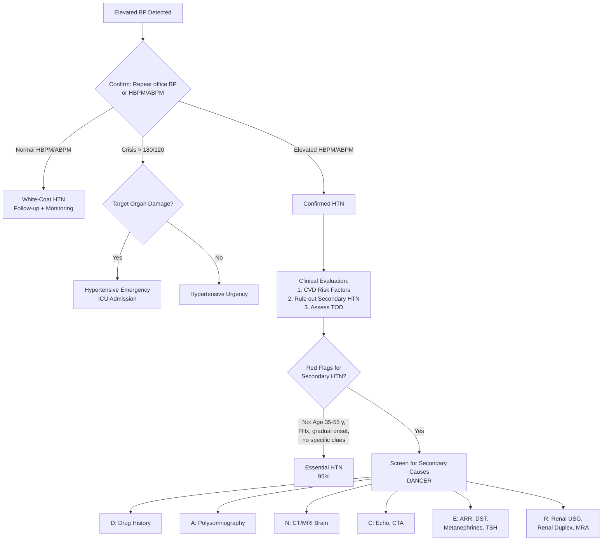

## Differential Diagnosis of Hypertension

### Framing the Problem

When you encounter a patient with elevated blood pressure, the clinical question is never simply "does this patient have hypertension?" — it is a multi-layered diagnostic challenge:

1. **Is the BP truly elevated?** (Rule out pseudohypertension, white-coat effect, measurement artefact)
2. **Is this essential (primary) or secondary hypertension?** (95% vs. 5%)
3. **If secondary, what is the specific cause?** (Each has distinct pathophysiology, clinical clues, and management)
4. **What is the clinical context?** (Chronic stable HTN vs. hypertensive crisis — and if crisis, is there TOD?)

The "differential diagnosis of hypertension" therefore operates at **two levels**: distinguishing essential from secondary HTN, and then differentiating among the specific secondary causes. Let me walk through both systematically.

---

### Level 1: Essential vs. Secondary Hypertension

***Essential hypertension (95%)*** is a diagnosis of exclusion — you diagnose it when there is no identifiable secondary cause in a patient whose age, sex, risk factor profile, and clinical course are consistent with primary HTN [2].

***Secondary hypertension (5%): distinct, identifiable cause*** [2]. Though only 5% overall, the prevalence is **much higher in specific subgroups**: up to 10–30% of patients with ***resistant hypertension*** [7].

<Callout title="When to Think Secondary" type="idea">
***Indications to look for causes of secondary HTN (ACC/AHA 2017)*** [2]:

**General clues:**
- ***Age of onset: < 30 y or diastolic HTN for ≥ 65 y*** — essential HTN typically develops between 35–55 y. Outside this window, your suspicion for secondary causes should rise.
- ***Severity: accelerated or malignant HTN, disproportionate TOD for degree of HTN***
- ***Course: abrupt onset, drug-resistant or exacerbation of previously controlled HTN***

**Specific clues:**
- ***Unprovoked or excessive hypokalaemia*** (but note use of thiazide diuretics!)
- ***Renal HTN: palpable kidney, renal bruit, abnormal urinalysis***
- ***Endocrine: S/S of phaeochromocytoma, unexplained hypokalaemia, signs of Cushing's syndrome***
- ***Coarctation: radiofemoral delay***
</Callout>

---

### Level 2: Differential Diagnosis of Secondary Hypertension

The mnemonic **DANCER** [2] organises the secondary causes. Below is a comprehensive table integrating the senior notes [2][7] and lecture material, with prevalence, clinical clues, pathophysiological reasoning, and screening approach for each.

#### Master Table: Secondary Causes of Hypertension

| Cause | Prevalence among HTN | Key Clinical Clues | Pathophysiology (Why does it cause ↑BP?) | Screening Test |
|---|---|---|---|---|
| **D — Drugs** | Very common if you look for it | Temporal relationship with drug initiation; resolves with drug cessation | Varies by drug class (see below) | Detailed drug/supplement history |
| **A — Apnoea (OSA)** | ***25–50%*** of resistant HTN [7] | ***Resistant HTN, snoring, restless sleep, daytime sleepiness, obesity*** [7] | Intermittent hypoxia + arousal → ↑SNS, ↑endothelin-1, ↑oxidative stress, ↓NO → sustained daytime ↑SVR even after apnoea ceases | ***Clinical evaluation → Polysomnography*** [7] |
| **N — Neurological** | Uncommon | ***↑ICP*** signs (headache worse supine, vomiting, papilloedema), acute stress | Cushing reflex: ↑ICP → brainstem ischaemia → massive ↑SNS → ↑BP to maintain CPP. Chronic stress/anxiety → sustained ↑SNS | Clinical context, CT/MRI brain |
| **C — Coarctation of aorta** | ***0.1%*** [7] | ***Young HTN < 30 y, UL > LL BP, radiofemoral delay, continuous murmur at back/chest/abdomen*** [7] | Mechanical obstruction distal to left subclavian → ↑BP proximal to narrowing; renal hypoperfusion → ↑RAAS | ***Echocardiogram → CTA/MRA thorax*** [7] |
| **E — Endocrine** | | | | |
| *Primary aldosteronism* | ***8–20%*** [7] | ***Resistant HTN, hypokalaemia + alkalosis, muscle cramps, LL weakness, adrenal incidentaloma, arrhythmias (esp AF) with hypoK, FHx of early onset HT or stroke < 40 y*** [7] | ↑Aldosterone → ↑Na⁺ reabsorption (via ENaC) → volume expansion → ↑CO; also direct vascular inflammation and fibrosis | ***Plasma aldosterone-to-renin ratio (ARR) → Salt loading test*** [7] |
| *Cushing's syndrome* | ***< 0.1%*** [7] | ***Rapid weight gain esp central obesity, Cushingoid features, proximal myopathy, hyperglycaemia*** [7] | Cortisol excess → (1) mineralocorticoid action (overwhelms 11β-HSD2 → Na⁺ retention), (2) ↑SNS sensitivity, (3) ↑angiotensinogen production from liver, (4) ↓NO-mediated vasodilation | ***Overnight 1mg dexamethasone suppression test*** [7] |
| *Phaeochromocytoma / Paraganglioma* | ***0.1–0.6%*** [7] | ***Resistant HTN, paroxysmal HTN or HTN crisis, spells of BP lability, headache, sweating, palpitations, pallor, adrenal incidentaloma, neurofibromatosis skin stigmata*** [7] | Catecholamine excess → α₁-mediated vasoconstriction (↑SVR) + β₁-mediated ↑HR/contractility (↑CO) | ***24h urine fractionated metanephrines → Plasma metanephrines*** [7] |
| *Hyperthyroidism* | Uncommon | Heat intolerance, weight loss, tremor, tachycardia, goitre, lid lag | ↑T₃/T₄ → ↑β-adrenergic receptor expression → ↑HR, ↑contractility (↑CO) → ***systolic HTN*** [2] | TSH, free T₄ |
| *Hypothyroidism* | Uncommon | Cold intolerance, weight gain, constipation, bradycardia, dry skin | ***↑SVR (mechanism not fully understood — likely ↑endothelin-1, ↓NO) → diastolic HTN*** [2] | TSH, free T₄ |
| *Hyperparathyroidism* | Uncommon | Stones, bones, abdominal groans, psychic moans | ***Hypercalcaemia → vasoconstriction + ↑vascular smooth muscle reactivity*** [2] | Serum Ca²⁺, PTH |
| *Acromegaly* | Rare | Coarsening of facial features, large hands/feet, prognathism, macroglossia, ***HTN (40%), LVH, cardiomyopathy*** [8] | GH/IGF-1 excess → ↑Na⁺ retention (direct renal effect), ↑SVR, cardiomyopathy | IGF-1, OGTT for GH suppression |
| **R — Renal** | | | | |
| *Renal artery stenosis (RAS)* | ***5–34%*** [7] (in resistant HTN populations) | ***Resistant HTN, abrupt onset or worsening, flash pulmonary oedema, early onset HTN esp in women, renal bruit*** [7]; ↑creatinine > 30% after starting ACEI/ARB | ↓Renal perfusion → ↑renin secretion from JG cells → ↑Ang II → vasoconstriction + aldosterone → Na⁺/H₂O retention. In unilateral RAS: contralateral kidney undergoes pressure natriuresis so volume may be near-normal initially (renin-dependent HTN). In bilateral RAS: volume-dependent HTN (can't natriurese) | ***Renal duplex USG → MRA → CT abdomen*** [7] |
| *Renal parenchymal disease* | ***1–2%*** [7] | ***Haematuria, proteinuria, recurrent UTI, frequency, nocturia, FHx of polycystic kidney disease, other features of renal disease*** [7] | ↓Nephron mass → impaired Na⁺ excretion → volume overload; also ↑RAAS from renal ischaemia; ↑endothelin, ↓NO from damaged endothelium | ***Renal USG → Renal biopsy*** [7] |

<Callout title="Screening Tests — What Is Routinely Done?" type="idea">
From the senior notes [7], the asterisked tests are ***usually done routinely when screening for secondary hypertension***:
- ***Plasma aldosterone-to-renin ratio (ARR)***
- ***Renal duplex USG***
- ***24h urine fractionated metanephrines***
- ***Overnight 1mg dexamethasone suppression test***
</Callout>

---

### Drug-Induced Hypertension — A Closer Look

***Drug causes of secondary HTN*** [2] deserve special attention because they are **the most common "secondary" cause** in clinical practice and are completely reversible:

| Category | Examples | Mechanism |
|---|---|---|
| ***SNS-related*** | ***Caffeine, amphetamines, levodopa, MAOI, antidepressants, decongestants*** [2] | ↑Catecholamine release or ↓reuptake → ↑HR, ↑SVR |
| ***Fluid retention*** | ***OCP, anabolic steroids, mineralocorticoids, corticosteroids*** [2] | Na⁺/H₂O retention → volume expansion → ↑CO |
| ***Immunosuppressants*** | ***Cyclosporine*** [2], tacrolimus | Renal afferent arteriolar vasoconstriction → ↓GFR → Na⁺ retention; also ↑endothelin, ↑TGF-β |
| ***NSAIDs, COX-2 inhibitors*** | Ibuprofen, naproxen, celecoxib [2] | Inhibit renal vasodilatory prostaglandins (PGI₂, PGE₂) → afferent arteriolar constriction → Na⁺/H₂O retention; also blunt the effect of antihypertensives |
| ***Recreational/social*** | ***Alcohol, nicotine*** [2] | Alcohol: ↑SNS, ↑cortisol, direct vascular toxicity. Nicotine: acute ↑SNS (↑HR, ↑SVR), chronic endothelial damage |
| ***Anti-cancer agents*** | ***Chemotherapy, angiogenesis inhibitors, TKIs*** [2] (e.g., bevacizumab, sunitinib, sorafenib) | Anti-VEGF agents → ↓NO production → endothelial dysfunction → ↑SVR. This is a class effect — HTN occurs in up to 30-80% of patients on anti-VEGF therapy |
| Others | Liquorice, carbenoxolone | Inhibit 11β-HSD2 → cortisol acts on mineralocorticoid receptors → apparent mineralocorticoid excess → Na⁺ retention, hypoK |
| | Erythropoietin (EPO) | ↑RBC mass → ↑blood viscosity → ↑SVR; also direct vasoconstriction via ↑endothelin |
| | Herbal medicines (common in HK!) | May contain undeclared steroids, sympathomimetics, or liquorice |

<Callout title="Hong Kong Clinical Pearl" type="error">
Always ask about **herbal medicines and over-the-counter remedies** in HK patients. Some "arthritis" remedies from traditional medicine shops contain undeclared corticosteroids, which cause iatrogenic Cushing's and secondary HTN. Similarly, some "slimming teas" contain liquorice which inhibits 11β-HSD2 → apparent mineralocorticoid excess.
</Callout>

---

### Differentiating Primary Aldosteronism Subtypes

Within ***primary hyperaldosteronism (8–20% of HTN patients)*** [7], it is critical to distinguish between the two main subtypes because management differs completely [4][5]:

| Feature | ***Aldosterone-producing adenoma (Conn's, 30-40%)*** [4] | ***Bilateral idiopathic adrenal hyperplasia (BIAH, 60-70%)*** [4] |
|---|---|---|
| Laterality | Unilateral | Bilateral |
| Aldosterone driver | ***ACTH-dependent*** [4] | ***Angiotensin-dependent*** [4] |
| Biochemical severity | ***↑Significant biochemical disturbance*** [4] | ***↓Significant biochemical disturbance*** [4] |
| Plasma K | Very low to normal | Low to normal |
| Basal aldosterone | High to very high | High-normal to high |
| Basal PRA | Low | Low to low-normal |
| ***Salt-loading test*** | Failure/inadequate suppression | Failure/inadequate suppression |
| ***Postural test*** | ***↓Aldosterone in 70-90%*** (due to ↓ACTH drive at noon) [4][5] | ***↑Aldosterone in 90%*** (exaggerated response to ↑Ang in erect posture) [4][5] |
| Adrenal venous sampling | ↑ ipsilaterally, ↓ contralaterally | ↑ bilaterally |
| CT/MRI | Unilateral tumour | Normal or slightly enlarged bilaterally |
| Treatment | ***Unilateral laparoscopic adrenalectomy*** (4 weeks pre-op spironolactone to correct hypoK) [5] | ***Medical treatment: aldosterone antagonist (spironolactone/eplerenone), amiloride*** [4][5] |

> ***Differentiated by salt-loaded balance study (9am supine + 1pm erect)*** [5]:
> - ***Aldosterone-producing adenoma: paradoxical ↓aldosterone*** (ACTH-dependent production — aldosterone follows ACTH's diurnal rhythm, which drops by noon)
> - ***BIAH: ↑aldosterone*** (sensitive to postural change via angiotensin)

---

### Differentiating Phaeochromocytoma from Other Causes of Paroxysmal Symptoms

***D/dx of episodic sweating and/or flushing*** [8]:
- ***Oestrogen/testosterone deficiency (e.g., menopause, castration)***
- ***Carcinoid syndrome (flushing, diarrhoea, wheeze)***
- ***Phaeochromocytoma (sweat but do not flush)*** — this is a key distinguishing feature: phaeochromocytoma causes **pallor** (α₁-mediated vasoconstriction), not flushing
- ***Thyrotoxicosis (not usually episodic)***
- ***Systemic mastocytosis (histamine release)***
- ***Allergy***

The ***5 P's of phaeochromocytoma*** [5][8]:
1. ***Pressure (HTN)***
2. ***Pain (headache, chest pain)***
3. ***Palpitation (tachycardia, tremor, LOW, fever)***
4. ***Perspiration***
5. ***Pallor (due to vasoconstrictive spells)***

---

### Pseudohypertension and Measurement-Related Differentials

Before attributing hypertension to any cause, consider whether the BP is **truly elevated**:

| Condition | Mechanism | How to Identify |
|---|---|---|
| **White-coat HTN** | Alerting/anxiety response in clinical setting → ↑SNS → transiently ↑BP | ***↑Office BP but normal ABPM/HBPM*** [2] |
| **Pseudohypertension (Osler's manoeuvre)** | Heavily calcified, non-compressible arteries (common in elderly, CKD, diabetics) → cuff over-reads because it needs more pressure to compress the rigid artery | Osler's sign: radial artery still palpable when cuff inflated above systolic BP. Confirm with intra-arterial measurement |
| **Cuff too small** | Undercuffing → cuff doesn't fully compress the artery → falsely ↑ reading | Use appropriate cuff size (bladder encircles ≥ 80% of arm circumference) |
| **"Office-only" anxiety** | Situational anxiety, pain, full bladder | Repeat after rest, empty bladder, comfortable setting |

---

### Diagnostic Algorithm — Approaching the Hypertensive Patient

---

### Special Scenario: Resistant Hypertension — Differential Diagnosis

***Resistant HTN*** is defined as BP above goal despite optimal doses of ≥ 3 antihypertensive drugs from different classes (one of which should be a diuretic). The approach [2]:

> ***AT-Home-GOAL*** [2]:
> 1. **Exclude pseudoresistance:**
>    - ***Adherence*** — most common reason! Non-compliance is rampant.
>    - ***Timing of drugs*** — are they taken at the right time?
>    - ***Home and ambulatory BP*** — rule out white-coat effect
> 2. **Medical Rx adjustments:**
>    - ***Greater dose of Rx***
>    - ***Other classes: diuretics, aldosterone blocker***
>    - ***Alternative Rx: combination with different MoA, loop diuretics if renal disease ± potent vasodilator***
> 3. **Look for contributing factors:** ***diet, obesity, drugs***
> 4. **Reconsider secondary hypertension** — the prevalence of secondary causes is **much higher** (up to 20-30%) in the resistant HTN population
> 5. **Referral** to a specialist HTN centre

---

### Hypertensive Crisis — Differential of the Specific Emergency

When a patient presents with ***BP > 180/120***, the critical distinction is [2]:

| | ***Hypertensive Emergency*** | ***Hypertensive Urgency*** |
|---|---|---|
| Definition | ***BP > 180/120 + worsening/new TOD*** [2] | ***Severe ↑BP without new/worsening TOD*** [2] |
| Examples of TOD | ***ICH, APO, HTN encephalopathy*** [2] | — |
| Compelling indications for acute BP control | ***Aortic dissection, phaeochromocytoma crisis, eclampsia or severe pre-eclampsia*** [2] | — |
| Examples of urgency | — | ***Malignant HTN without acute TOD; HT associated with bleeding (post-op, severe epistaxis, retinal haemorrhage, CVA); severe HT + pregnancy/AMI/unstable angina; catecholamine excess or sympathomimetic overdose (rebound after withdrawal of clonidine or methyldopa, LSD, cocaine OD, interactions with MAOI)*** [2] |

The differential for **what is causing the crisis** includes:
- Uncontrolled/non-compliant essential HTN (most common)
- Phaeochromocytoma crisis
- Renal artery stenosis (acute worsening)
- Pre-eclampsia/eclampsia
- Sympathomimetic drugs (cocaine, amphetamines)
- Rebound HTN (clonidine or methyldopa withdrawal)
- Acute glomerulonephritis
- Scleroderma renal crisis

---

### Related Differentials in Specific Clinical Contexts

#### Hypertension + Hypokalaemia

This combination narrows the differential significantly:

| Condition | Renin | Aldosterone | Key Distinguishing Feature |
|---|---|---|---|
| ***Primary hyperaldosteronism*** | Low | High | ***ARR elevated; failure to suppress on salt loading*** [7] |
| Renovascular HTN (RAS) | High | High | Renal bruit, ↑Cr with ACEI, flash APO |
| Cushing's syndrome | Low-normal | Normal | Cushingoid features, cortisol elevated |
| Liquorice/carbenoxolone ingestion | Low | Low | History! Apparent mineralocorticoid excess (cortisol acting on MR) |
| Liddle syndrome | Low | Low | Young patient, AD family history, responds to amiloride not spironolactone |
| Diuretic use | High | High | Medication history |
| Chronic vomiting/diarrhoea | High | High | History, metabolic alkalosis (vomiting) or acidosis (diarrhoea) |

#### Hypertension in a Young Patient (< 30 years)

| Cause | Typical Patient | Key Clue |
|---|---|---|
| **Coarctation** | Male, young, known congenital heart disease | ***Radiofemoral delay, UL > LL BP*** [7] |
| **Fibromuscular dysplasia** | Young female | Renal bruit, abrupt onset HTN |
| **Phaeochromocytoma** (familial syndromes) | Family history of MEN2, VHL, NF1 | Paroxysmal symptoms, syndromic features |
| **Renal parenchymal disease** (GN, reflux nephropathy) | Childhood UTI history, haematuria | Abnormal urinalysis, small kidneys on USG |
| **Primary aldosteronism (FH type I)** | Strong FH of young HTN + stroke | ***Dexamethasone-suppressible*** (aldosterone from fasciculata under ACTH control) |

<Callout title="Exam Pearl — The Clinical Approach to the Lecture Slide Triad" type="idea">
The lecture slides [1] structure the clinical evaluation as three concentric circles:

***Hypertension → CVS Risk Factors → Secondary Causes → Target Organ Damage → Prognosis*** [1]

This is the systematic framework for every HTN patient:
1. Confirm HTN
2. Assess global CVD risk (risk factors + 10-year CVD risk)
3. Rule out secondary causes (DANCER)
4. Evaluate TOD (heart, brain, kidney, eyes, vessels)
5. Determine prognosis (risk stratification guides treatment intensity)
</Callout>

---

<Callout title="High Yield Summary — Differential Diagnosis of Hypertension">

**Level 1:** Essential (95%) vs. Secondary (5%) — suspect secondary if onset < 30 y or diastolic HTN ≥ 65 y, resistant/malignant HTN, abrupt onset, hypokalaemia, or specific clinical clues.

**Level 2 — Secondary causes (DANCER):**
- **D** — Drugs (NSAIDs, OCP, steroids, sympathomimetics, anti-VEGF agents, herbal medicines)
- **A** — Apnoea (OSA, 25–50% of resistant HTN)
- **N** — Neurological (↑ICP, stress)
- **C** — Coarctation (young HTN, radiofemoral delay, UL > LL BP)
- **E** — Endocrine: primary aldosteronism (8–20%, ARR screen), Cushing's (DST), phaeochromocytoma (urine metanephrines), thyroid disease, hyperparathyroidism, acromegaly
- **R** — Renal: RAS (duplex USG), renal parenchymal disease (urinalysis, renal USG)

**Primary aldosteronism subtypes:** Adenoma (30-40%) vs. BIAH (60-70%) — differentiated by postural test: adenoma = paradoxical ↓aldo; BIAH = ↑aldo.

**Phaeochromocytoma 5 P's:** Pressure, Pain, Palpitation, Perspiration, Pallor.

**Resistant HTN:** Exclude pseudoresistance first (adherence, white-coat effect), then screen for secondary causes (AT-Home-GOAL).

**Hypertensive crisis:** Emergency (TOD present) vs. Urgency (no TOD) — different management timelines.

**Always consider:** Drug history (including herbals in HK), measurement artefact, white-coat HTN.
</Callout>

---

<ActiveRecallQuiz
  title="Active Recall - Differential Diagnosis of Hypertension"
  items={[
    {
      question: "A 28-year-old male presents with newly diagnosed HTN. His upper limb BP is 180/100 but lower limb BP is 120/70. There is a continuous murmur heard over his back. What is the most likely secondary cause, and what is the pathophysiological explanation for the inter-limb BP difference?",
      markscheme: "Coarctation of the aorta. The narrowing (usually just distal to the left subclavian artery) causes mechanical obstruction to aortic flow. BP is elevated proximal to the coarctation (upper limbs) and reduced distally (lower limbs). The continuous murmur is from collateral flow. Additionally, renal hypoperfusion activates RAAS, further raising BP."
    },
    {
      question: "List the DANCER mnemonic for secondary causes of hypertension and give the most common screening test for the endocrine causes.",
      markscheme: "D = Drugs (history), A = Apnoea/OSA (polysomnography), N = Neurological (clinical/CT), C = Coarctation (echo/CTA), E = Endocrine (primary aldosteronism: plasma ARR; Cushing's: overnight 1mg DST; phaeochromocytoma: 24h urine fractionated metanephrines; thyroid: TSH), R = Renal (renal duplex USG, urinalysis, renal biopsy)."
    },
    {
      question: "A patient with resistant hypertension is found to have hypokalaemia and low renin. The ARR is elevated. How do you differentiate an aldosterone-producing adenoma from bilateral adrenal hyperplasia, and why does the postural test help?",
      markscheme: "Postural test (9am supine + 1pm erect): In adenoma, aldosterone is ACTH-dependent so it falls at noon (following ACTH diurnal rhythm) giving a paradoxical decrease. In BIAH, aldosterone is angiotensin-dependent so it rises with upright posture (renin increases with standing). Confirmed by adrenal venous sampling (lateralisation in adenoma, bilateral elevation in BIAH) and CT/MRI. Treatment differs: adenoma = surgery; BIAH = medical (spironolactone/eplerenone)."
    },
    {
      question: "Why does phaeochromocytoma cause pallor rather than flushing, and what is the differential diagnosis of episodic sweating?",
      markscheme: "Phaeochromocytoma secretes predominantly noradrenaline which acts on alpha-1 receptors causing vasoconstriction, hence pallor not flushing. Differential of episodic sweating/flushing: (1) Oestrogen/testosterone deficiency (menopause), (2) Carcinoid syndrome (flushing + diarrhoea + wheeze), (3) Phaeochromocytoma (sweats but does NOT flush), (4) Thyrotoxicosis (usually not episodic), (5) Systemic mastocytosis, (6) Allergy."
    },
    {
      question: "Outline the approach to resistant hypertension using the AT-Home-GOAL mnemonic.",
      markscheme: "A = Adherence (most common cause of pseudoresistance), T = Timing of drugs, Home = Home and ambulatory BP (rule out white-coat), G = Greater dose of Rx, O = Other classes (diuretics, aldosterone blocker), A = Alternative Rx (combination with different MoA, loop diuretics if renal disease), L = Look for contributing factors (diet, obesity, drugs), then Reconsider secondary HTN, and Refer if still uncontrolled."
    }
  ]}
/>

## References

[1] Lecture slides: GC 058. High Blood Pressure.pdf (p33, p44, p50)
[2] Senior notes: Ryan Ho Cardiology.pdf (p175–182)
[4] Senior notes: Ryan Ho Endocrine.pdf (p57–59)
[5] Senior notes: maxim.md (Conn's syndrome, Phaeochromocytoma sections)
[7] Senior notes: Ryan Ho Cardiology.pdf (p178 — Secondary HTN screening table)
[8] Senior notes: Ryan Ho Endocrine.pdf (p66, p111 — Phaeochromocytoma, Acromegaly)
