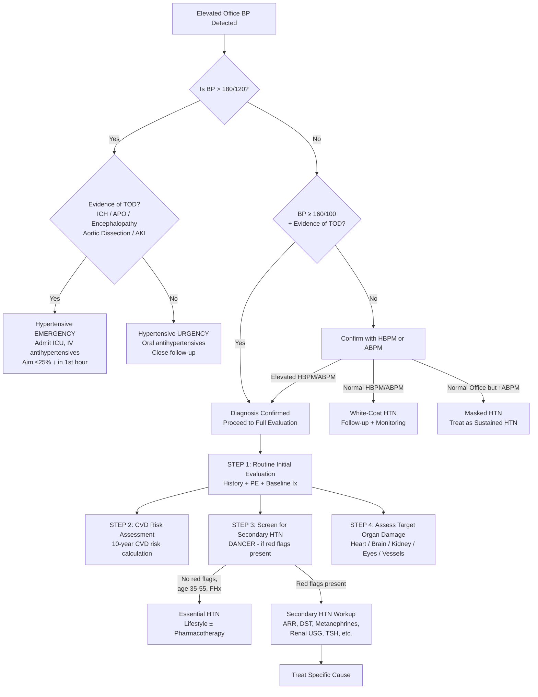
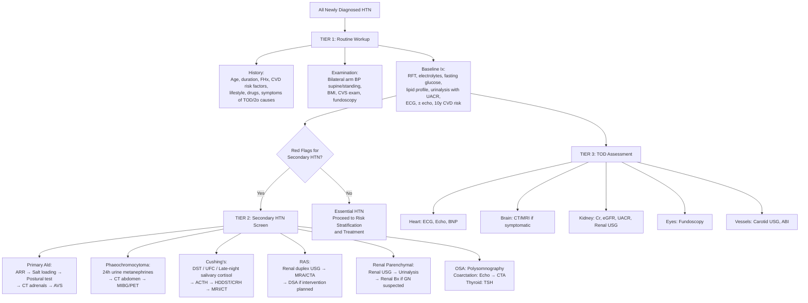

## Diagnostic Criteria, Diagnostic Algorithm, and Investigation Modalities for Hypertension

---

### 1. Diagnostic Criteria — When Do We Call It "Hypertension"?

#### 1.1 Blood Pressure Thresholds

***Definition of HTN (ACC/AHA 2017)*** [2]:

| Category | SBP (mmHg) | | DBP (mmHg) |
|---|---|---|---|
| **Normal** | < 120 | and | < 80 |
| **Elevated BP** | 120–129 | and | < 80 |
| ***Stage 1 HTN*** | 130–139 | or | 80–89 |
| ***Stage 2 HTN*** | ≥ 140 | or | ≥ 90 |
| ***Hypertensive Crisis*** | > 180 | and/or | > 120 |

The ESC/ESH 2018 (still widely used in HK/European settings) retains **≥ 140/90** as the office-BP threshold for diagnosing hypertension in uncomplicated patients, while acknowledging 130–139/80–89 as "high-normal." In practice for HKUMed exams, know both frameworks. The key point is the same: **the diagnosis must be confirmed by repeated measurements** — a single elevated reading is not enough.

#### 1.2 Thresholds by Measurement Method

Because out-of-office measurements remove the alerting ("white-coat") response, their thresholds are set lower [2]:

| Measurement Method | HTN Threshold |
|---|---|
| ***Office BP*** | ≥ 140/90 (ESC) or ≥ 130/80 (ACC/AHA) |
| ***HBPM (Home)*** | ≥ 135/85 |
| ***ABPM — Daytime mean*** | ≥ 135/85 |
| ***ABPM — Night-time mean*** | ≥ 120/70 |
| ***ABPM — 24-hour mean*** | ≥ 130/80 |

Why different numbers? Office BP is measured in an environment that naturally raises sympathetic tone. ABPM integrates hundreds of readings over 24 hours in the patient's real environment — it better reflects the true haemodynamic burden on target organs. This is why ***ABPM is considered the gold standard*** [2].

#### 1.3 When Is the Diagnosis of HTN Made?

***Diagnosis is made*** [2] when:

1. ***Hypertensive crisis, i.e. > 180/120*** — diagnosed immediately (no need for confirmation)
2. ***Evidence of TOD + ↑↑BP (≥ 160/100)*** — diagnosed immediately because TOD proves the BP has been chronically or severely elevated
3. ***Otherwise, high office BP (≥ 130/80 or ≥ 140/90) should be confirmed by HBPM/ABPM*** — this step is essential to rule out white-coat HTN

<Callout title="Why Confirm with Out-of-Office BP?">
***Only relying on office BP risks missing out on white-coat and masked HTN*** [2]:

- ***White-coat hypertension: ↑office BP but normal ABPM/HBPM*** — prevalence 15–30%, especially in elderly and pregnant women. Risk is lower than sustained HTN but may be a precursor → follow-up and monitoring [2].
- ***Masked hypertension: normal office BP but ↑ABPM/HBPM*** — ***↑risk > patients with known but uncontrolled HTN*** [2]. Missed if you only do office measurements. Common in smokers, alcohol users, those with workplace stress, and OSA patients.
</Callout>

#### 1.4 Prevalence by Setting

***Prevalence of different types of hypertension*** [9]:

| Diagnosis | General Population (%) | Specialty Clinic (%) |
|---|---|---|
| ***Essential hypertension*** | ***92–94*** | ***65–85*** |
| ***Renal parenchymal*** | ***2–3*** | ***4–5*** |
| ***Renovascular*** | ***1–2*** | ***4–16*** |
| ***Endocrine hypertension*** | ***0.3–0.4*** | ***0.5–12*** |

This table is critical — it shows that the proportion of secondary HTN rises dramatically in specialty clinic populations (where patients have been referred for resistant or atypical HTN). This is why secondary HTN screening is especially important in these settings.

---

### 2. The Diagnostic Algorithm — Step-by-Step Approach

The evaluation of a hypertensive patient has ***three aims*** [2]:
1. ***Screen for CVD risk factors***
2. ***Rule out secondary hypertension***
3. ***Evaluate target organ damage***

Let me lay out the complete diagnostic algorithm as a mermaid flowchart, then explain each step:

---

### 3. Investigation Modalities — Comprehensive Breakdown

I will organise investigations into three tiers:
1. **Tier 1: Routine initial evaluation** (done for ALL hypertensive patients)
2. **Tier 2: Secondary HTN screening** (done when red flags present)
3. **Tier 3: Target organ damage assessment** (done to guide treatment intensity)

---

#### Tier 1: Routine Initial Evaluation

***Routine initial evaluation*** — done for every patient diagnosed with HTN [2]:

##### A. History

| Domain | What to Ask | Why |
|---|---|---|
| ***Age*** | ***Consider secondary HTN < 35 y or > 55 y*** [2] | Essential HTN develops 35–55 y; outside this = ↑suspicion for secondary cause |
| ***Duration and previous BP levels*** | How long has BP been elevated? Previous recordings? [1] | Helps determine chronicity and trajectory |
| ***Family history of HTN*** | Essential HTN has a strong genetic basis [1] | Positive FHx supports essential HTN |
| ***Other CVD risk factors*** | ***Smoking, DM, lipid disorders, FHx of early CVD deaths*** [1] | Determines overall cardiovascular risk profile |
| ***Lifestyle*** | ***Diet, physical activity, family status, work*** [1] | Identifies modifiable risk factors; high salt intake particularly important in HK |
| Drug history | Prescription drugs, OTC, herbal medicines, supplements | Rule out drug-induced HTN (especially NSAIDs, steroids, herbal remedies in HK) |
| Symptoms of TOD | Headache, visual changes, chest pain, dyspnoea, neurological symptoms | Guides urgency of workup |
| Symptoms of secondary causes | Paroxysmal headache/sweating/palpitations, snoring, weight gain/striae | Directs specific secondary screening |

##### B. Physical Examination

| Examination | What to Look For | Interpretation |
|---|---|---|
| ***BP/Pulse: bilateral arms, supine and standing*** [2] | Inter-arm difference > 20/10 → coarctation or subclavian stenosis. Orthostatic drop → autonomic dysfunction, phaeochromocytoma, over-treatment | Fundamental for diagnosis and for detecting coarctation |
| ***BMI and waist circumference*** [2] | Obesity (BMI > 30), central obesity (waist ≥ 90 cm male, ≥ 80 cm female in Asians) | Key modifiable risk factor; component of metabolic syndrome |
| ***CVS: standard + palpation/auscultation of all peripheral arteries*** [2] | Displaced/sustained apex → LVH. S4 → diastolic dysfunction. Renal bruit → RAS. Radiofemoral delay → coarctation. Carotid bruit → carotid stenosis | Screens for both TOD and secondary causes simultaneously |
| ***Fundoscopy*** [2] | Keith-Wagener-Barker grading (Grade 1–4) | Only place you can directly visualise arterioles; Grade 3–4 = malignant HTN |

##### C. Baseline Investigations

| Investigation | What It Tests | Key Findings / Interpretation |
|---|---|---|
| ***RFT and electrolytes*** [2] | Baseline renal function; screen for renal parenchymal disease; ***r/o hyperaldosteronism and hyperparathyroidism*** [2] | ↑Creatinine/↓eGFR → renal cause. HypoK + alkalosis → primary aldosteronism. Hypercalcaemia → ***hyperparathyroidism (a secondary cause of HTN)*** [2] |
| ***Lipid profile*** [2] | Dyslipidaemia | Part of CVD risk assessment; component of metabolic syndrome |
| ***Serum fasting glucose*** [2] | ***R/o DM*** [2] | DM is a major CVD risk factor; also component of metabolic syndrome |
| ***± Serum urate*** [2] | Baseline for hyperuricaemia | Hyperuricaemia associated with CVD; also relevant before starting thiazide diuretics (which raise urate) |
| ***± Urinalysis*** [2] | ***Haematuria (r/o renal disease), UACR (albuminuria)*** [2] | Haematuria + proteinuria → glomerulonephritis. Albuminuria → early renal TOD or diabetic nephropathy. ***Microalbuminuria or eGFR < 60 mL/min*** is a CVD risk factor [1] |
| ***ECG*** [2] | ***LVH, MI, cardiac failure, heart block*** [2] | LVH on ECG (Sokolow-Lyon: SV1 + RV5/V6 ≥ 35 mm; Cornell: RaVL + SV3 > 28 mm male, > 20 mm female) → evidence of cardiac TOD. Ischaemic changes → concomitant CAD |
| ***± Echocardiogram*** [2] | ***For LVH*** [2] | More sensitive than ECG for LVH detection. Also assesses diastolic function (E/A ratio, E/e'), EF, and wall motion abnormalities |
| ***Calculation of 10-year CVD risk*** [2] | Global risk assessment | Guides treatment threshold and intensity. Tools: ACC/AHA Pooled Cohort Equations, Framingham, SCORE2 |

<Callout title="Exam Pearl — The Logic Behind Routine Bloods" type="idea">
Every single routine blood test serves a dual purpose — it both **risk-stratifies** and **screens for secondary causes**:
- RFT: Is the kidney the victim (TOD) or the perpetrator (secondary cause)?
- Electrolytes: HypoK → Conn's? Hypercalcaemia → hyperPTH?
- Glucose: DM → both a risk factor and associated with metabolic syndrome
- Lipids: Dyslipidaemia → CVD risk and metabolic syndrome
- Urate: Baseline before thiazide; also an independent CVD risk marker
</Callout>

---

#### Tier 2: Secondary Hypertension Screening

Only done when ***red flags are present*** [2]. The table below integrates the senior notes screening table [7] with interpretation guidance:

##### A. Primary Hyperaldosteronism

***Investigations of Conn's Syndrome — diagnosis includes biochemical tests as well as radiological images. Interpretation of biochemical tests can be difficult.*** [9]

**Step 1: Initial Screen — Plasma Aldosterone-to-Renin Ratio (ARR)** [4][7]

| Parameter | Value | Interpretation |
|---|---|---|
| ***Basal PRA*** | ***< 1*** | Suppressed renin (volume expansion suppresses JG cells) |
| ***Basal aldosterone*** | ***≥ 10 ng/dL*** | Elevated despite suppressed renin |
| ***ARR*** | ***> 30*** | ***90% sensitivity, 90% specificity*** [4] |
| Secondary hyperaldosteronism | ↑PRA, ↑Ald, ***ARR < 10*** | Both elevated because RAAS is appropriately activated |
| Non-aldosterone mineralocorticoid excess | ***↓PRA, ↓aldosterone*** | e.g., Cushing's, liquorice — mineralocorticoid effect but NOT from aldosterone |

***Precautions before testing*** [4]:
- ***Exclude other causes of hypoK*** (diuretics, GI loss, RTA)
- ***Ensure reasonable Na intake*** (↓Na intake protects against hypoK by ↓tubular Na available for exchange → misleading results)
- ***Stop antihypertensives for ≥ 2 weeks before dynamic testing (MRA for ≥ 6 weeks)*** [4] — most drugs affect renin and aldosterone:
  - Stop: diuretics (↑renin), BB/clonidine/methyldopa (↓renin), ACEI (↓ald), MRA (↓ald action → ↑renin), CCB (variable)
  - ***Exception: α-blockers do not significantly affect results*** [4]

**Step 2: Confirmatory — Salt Loading Test** [4][7]

- ***Exception: spontaneous hypoK with aldosterone ≥ 20 → practically diagnostic*** (no need for confirmatory test) [4]
- Method: ***IV NS 1 litre/hour × 4 hours in sitting/recumbent position → load Na⁺ and volume*** [4]
- ***Monitor BP/pulse and watch for signs of fluid overload (especially if underlying HF)*** [4]
- Findings: measure renin + aldosterone post-salt loading
  - Normal: suppression of both renin and aldosterone
  - ***Primary hyperaldosteronism: failure or inadequate suppression (aldosterone still > 10)*** [4]

**Step 3: Subtype Differentiation — Postural (Balance) Test** [4]

- Process: PRA and aldosterone measured at ***early morning supine (8am after 8h recumbence)*** → ↑ACTH drive, ↓angiotensin drive; and ***lunchtime erect (12 noon after 4h ambulation)*** → ↓ACTH drive, ↑angiotensin drive [4]
- ***Adenoma (ACTH-dependent): higher aldosterone in the morning → paradoxical ↓ at noon*** [4]
- ***Hyperplasia (RAAS-dependent): higher aldosterone at noon → ↑ with upright posture*** [4]
- ***Caveat: considered not reliable enough alone*** [4] → also need:

**Step 4: Imaging + Adrenal Venous Sampling** [4]

| Modality | Adenoma | Hyperplasia |
|---|---|---|
| CT/MRI adrenals | Unilateral tumour | Normal or bilateral enlargement |
| ***Adrenal venous sampling (AVS)*** | ↑ ipsilaterally, ↓ contralaterally | ↑ bilaterally |

> AVS is the **gold standard** for lateralisation — CT alone can miss small adenomas or pick up non-functioning incidentalomas. Always perform AVS before considering surgery.

##### B. Phaeochromocytoma

***Screening tests*** [7][8]:
- ***24h urine fractionated metanephrines: Sensitivity 98%, Specificity 98%*** [8] — this is the preferred initial test
- ***Plasma fractionated metanephrines: Sensitivity 96–100%, Specificity 85–89%*** [8] — higher sensitivity but lower specificity (more false positives)
- Why metanephrines and not catecholamines? Catecholamines are released episodically (paroxysmal tumours may have normal levels between attacks), but metanephrines are produced **continuously** by catechol-O-methyltransferase (COMT) within the tumour → more reliable
- ***24h urine for VMA: now superseded as less accurate*** [8]

***Precaution: stop drugs affecting catecholamine secretion before testing*** (TCAs, levodopa, α-agonists, amphetamines) [8]

**Localisation (after biochemical confirmation):**
- CT abdomen/pelvis (most phaeochromocytomas are adrenal)
- ¹²³I-MIBG scintigraphy (metaiodobenzylguanidine — taken up by chromaffin tissue) — useful for extra-adrenal paragangliomas or metastatic disease
- ⁶⁸Ga-DOTATATE PET/CT — increasingly used, superior to MIBG for detecting extra-adrenal and metastatic disease

##### C. Cushing's Syndrome

***Initial testing based on three main modalities*** [10]:
1. ***24-hour urinary free cortisol (UFC) × 2*** [10]
2. ***Late-night salivary cortisol × 2*** [10]
3. ***1 mg overnight dexamethasone suppression test (DST)*** [7][10]

The logic: Cushing's syndrome features **loss of circadian rhythm** and **loss of normal negative feedback**. Each test exploits a different aspect:
- UFC: integrates cortisol exposure over 24h → detects excess production
- Late-night salivary cortisol: cortisol should be at its nadir late at night → if elevated, circadian rhythm is lost
- 1 mg DST: dexamethasone should suppress ACTH → cortisol should fall → if it doesn't suppress (***cortisol > 50 nmol/L*** [5]), the HPA axis is autonomous

**If positive screening → ACTH-dependent vs. independent:**

| Parameter | Cushing's Disease | Ectopic ACTH | Adrenal Tumour | Iatrogenic |
|---|---|---|---|---|
| Cortisol | ↑ | ↑ | ↑ | ↓ (endogenous) |
| ACTH | Normal–high | High | ***Almost invariably undetectable*** [8] | Low |
| LDDST | No suppression | No suppression | No suppression | — |
| ***HDDST*** | ***Usually suppressed*** [8] | ***Usually no suppression*** [8] | No suppression | — |
| ***CRH test*** | ***Exaggerated rise*** [8] | ***No significant rise*** [8] | — | — |

##### D. Renal Artery Stenosis

***Screening: Renal duplex USG*** [7] — first-line non-invasive test
- Findings: ↑peak systolic velocity (PSV) > 200 cm/s at the stenosis; renal-to-aortic ratio > 3.5; tardus-parvus waveform in intra-renal arteries (delayed systolic upstroke, low amplitude)
- Sensitivity ~85%, specificity ~92% for significant stenosis (> 60%)
- Limitation: operator-dependent, poor views in obese patients or with bowel gas

***Further imaging*** [7][11]:
- ***MRA*** — non-invasive, no radiation, no iodinated contrast; sensitivity/specificity > 90%. Avoid in severe CKD (gadolinium risk of nephrogenic systemic fibrosis if eGFR < 30)
- ***CT angiography*** [11] — excellent spatial resolution; ***can assess renal artery stenosis*** [11]. Requires iodinated contrast (nephrotoxicity risk)
- Conventional angiography (DSA) — gold standard but invasive; reserved for planned intervention (angioplasty/stenting)

##### E. Renal Parenchymal Disease

***Renal USG*** [7] — assesses kidney size, cortical thickness, corticomedullary differentiation, obstruction, cysts
- Small kidneys (< 9 cm) with thin cortex → chronic parenchymal disease
- Large bilateral kidneys with multiple cysts → ADPKD
- Asymmetric kidney size → unilateral RAS or reflux nephropathy

***Urinalysis*** → haematuria + proteinuria → glomerular disease; sterile pyuria → TIN [7]
***Renal biopsy*** → generally required for diagnosis of GN [7]

##### F. Obstructive Sleep Apnoea

***Clinical evaluation → Polysomnography*** [7]
- Screening tools: STOP-BANG questionnaire, Epworth Sleepiness Scale
- Polysomnography: gold standard — measures AHI (apnoea-hypopnoea index)
  - Mild OSA: AHI 5–15/hour
  - Moderate: AHI 15–30/hour
  - Severe: AHI > 30/hour

##### G. Coarctation of Aorta

***Echocardiogram → CTA/MRA thorax*** [7]
- Echo: can visualise the narrowing in the descending aorta, measure gradient across coarctation, assess for associated bicuspid aortic valve (present in ~50%)
- CTA/MRA: definitive imaging for anatomical delineation and surgical planning

##### H. Thyroid Disease

- **TSH** is the single best screening test (most sensitive)
- If TSH abnormal → free T₃/T₄
- Hyperthyroidism (***systolic HTN*** [2]) vs. hypothyroidism (***diastolic HTN*** [2])

---

#### Tier 3: Target Organ Damage Assessment

| Target Organ | Investigation | Key Findings | Clinical Significance |
|---|---|---|---|
| **Heart** | ***ECG*** [2] | ***LVH*** (Sokolow-Lyon: SV₁ + RV₅ ≥ 35 mm), ***ischaemia, MI, heart block*** [2] | Cardiac TOD; LVH is an independent predictor of cardiovascular events |
| | ***Echocardiogram*** [2] | LV mass index (↑ = LVH), diastolic dysfunction (E/e' ratio), EF, wall motion | ***More sensitive than ECG for LVH*** [2]. Diastolic dysfunction precedes systolic; E/e' > 14 suggests elevated filling pressures |
| | BNP/NT-proBNP | ↑ levels | Suggests heart failure (both HFpEF from diastolic dysfunction and HFrEF) |
| **Brain** | CT brain (non-contrast) | ***Haemorrhagic stroke: acute = hyperdense, subacute = isodense, chronic = hypodense*** [11]. Common hypertensive haemorrhage sites: ***basal ganglia, cerebellum, brainstem*** [11] | Haemorrhagic stroke is a major HTN complication, especially in Chinese populations |
| | MRI brain | White matter hyperintensities, lacunar infarcts | Chronic small vessel disease from longstanding HTN |
| **Kidneys** | Serum creatinine, eGFR | ↑Cr, ↓eGFR | Hypertensive nephrosclerosis → CKD |
| | ***UACR*** [2] | Microalbuminuria (UACR 3–30 mg/mmol) or macroalbuminuria (> 30 mg/mmol) | Earliest marker of hypertensive renal damage; also powerful independent CVD risk predictor |
| | Renal USG | Small kidneys, thin cortex | Chronic hypertensive nephrosclerosis |
| **Eyes** | ***Fundoscopy*** [2] | Keith-Wagener-Barker grading (see Section 1 notes) | Grade 1–2: chronic arteriosclerotic changes. Grade 3–4: malignant HTN requiring urgent treatment |
| **Vessels** | Carotid duplex USG | Intima-media thickness (IMT) > 0.9 mm, plaques, stenosis | Subclinical atherosclerosis; ↑IMT is independent CVD predictor |
| | ***ABI*** [12] | ***Normal 0.9–1.3; Claudication 0.4–0.9; Severe < 0.4; Calcified > 1.3*** [12] | Screens for PAD; ABI < 0.9 is diagnostic of arterial occlusive disease. > 1.3 = calcified (common in DM/ESRD → use toe-brachial index instead) |
| | CTA/MRA aorta | Aortic dilatation, dissection | If suspected aortic complications |
| | Pulse wave velocity | ↑PWV | Arterial stiffness — emerging marker, especially relevant in ISH |

---

### 4. Special Investigations — Interpreting Key Findings

#### 4.1 ECG in Hypertension — What to Look For

| Finding | Criteria | Significance |
|---|---|---|
| **LVH — Voltage criteria** | Sokolow-Lyon: SV₁ + RV₅ or RV₆ ≥ 35 mm. Cornell: RaVL + SV₃ > 28 mm (M) or > 20 mm (F) | Concentric LVH from chronic pressure overload. Independent predictor of CV events. Regression with treatment is a good prognostic sign |
| **LV strain pattern** | ST depression + T-wave inversion in lateral leads (V5, V6, I, aVL) | Indicates subendocardial ischaemia from LVH — the hypertrophied myocardium outstrips its blood supply |
| **Left atrial enlargement** | P-wave duration > 120 ms; notched P in lead II; biphasic P in V₁ with terminal negative component > 1 mm deep × > 40 ms wide | Consequence of ↑LV filling pressures (diastolic dysfunction → LA has to push against a stiff LV) |
| **AF** | Irregularly irregular rhythm, absent P waves | Common in HTN (LA dilatation from diastolic dysfunction → substrate for AF) |
| **Ischaemic changes** | ST-segment changes, pathological Q waves | Concomitant CAD from accelerated atherosclerosis |

#### 4.2 Echocardiographic Assessment

| Parameter | Normal | Abnormal in HTN | Interpretation |
|---|---|---|---|
| **LV mass index** | < 95 g/m² (F), < 115 g/m² (M) | Elevated | Confirms LVH. Echo is more sensitive and specific than ECG |
| **Relative wall thickness** | < 0.42 | ≥ 0.42 with ↑mass → concentric LVH; < 0.42 with ↑mass → eccentric LVH | Concentric LVH = classic pressure-overload pattern in HTN. Eccentric suggests volume overload component |
| **E/A ratio** | > 1 (young adults) | < 1 (impaired relaxation) | Early diastolic dysfunction — the stiff LV relaxes poorly |
| **E/e' ratio** | < 8 normal | > 14 elevated | Estimates LV filling pressure; > 14 suggests elevated LVEDP → symptomatic diastolic dysfunction |
| **LA volume index** | < 34 mL/m² | Elevated | Integrates chronic diastolic dysfunction over time ("LA is the HbA1c of diastolic function") |
| **LVEF** | ≥ 55% | ↓ in late-stage | Preserved until late (HFpEF → HFrEF progression) |

#### 4.3 ABPM — Key Parameters and Interpretation

| Parameter | Normal | Significance |
|---|---|---|
| 24h mean BP | < 130/80 | Threshold for diagnosing HTN by ABPM |
| Daytime mean | < 135/85 | Correlates with office BP |
| Night-time mean | < 120/70 | Normally BP dips 10–20% at night ("dipping") |
| **Dipping pattern** | 10–20% nocturnal ↓ | |
| **Non-dipping** (< 10% drop) or **Reverse dipping** (BP rises at night) | Abnormal | Associated with ↑TOD, ↑CV events. Seen in OSA, CKD, autonomic dysfunction, Cushing's syndrome, Conn's syndrome |
| **Extreme dipping** (> 20% drop) | Abnormal | ↑Risk of nocturnal ischaemic stroke |
| **Morning BP surge** | Exaggerated | ↑Risk of morning cardiac events (MI, stroke) — explains why CVD events peak 6–10 AM |

***Indications for ABPM*** [2]:
- ***Office BP considerably variable or different from home BP***
- ***Resistant HTN***
- ***Suspected hypotensive episodes in elderly/DM***
- ***↑Office BP in pregnant women → suspect pre-eclampsia***

---

### 5. Integrated Diagnostic Workup Algorithm — Summary Flow

---

### 6. Key Diagnostic Pitfalls

<Callout title="Common Diagnostic Errors" type="error">

1. **Using a single office reading to diagnose HTN** → Always confirm with repeat measurements on different occasions or HBPM/ABPM (unless crisis or obvious TOD).

2. **Wrong cuff size** → Too small cuff → falsely ↑ readings. Always ensure bladder encircles ≥ 80% of arm circumference.

3. **Forgetting to check standing BP** → Misses orthostatic hypotension (especially in elderly, diabetics, and those on multiple antihypertensives) and postural ↑BP in phaeochromocytoma.

4. **Ignoring hypokalaemia** → "Oh, they're on a thiazide" — yes, but even thiazide-induced hypoK should not be severe (K < 3.0). ***Unprovoked or excessive hypokalaemia*** [2] mandates screening for primary aldosteronism.

5. **Not checking both arms** → Misses coarctation and subclavian stenosis.

6. **Interpreting ARR without proper drug washout** → Most antihypertensives affect renin and aldosterone levels. ***Stop medications for ≥ 2 weeks (MRA for ≥ 6 weeks)*** [4] and ensure adequate Na intake before testing.

7. **Relying on CT alone for Conn's lateralisation** → Non-functioning adrenal incidentalomas are common (up to 4% of the population). ***AVS is the gold standard for lateralisation*** before adrenalectomy.

8. **Forgetting ABI in calcified vessels** → ABI > 1.3 in DM/ESRD patients is falsely reassuring (calcified, non-compressible arteries). ***Use toe-brachial index (TBI)*** instead [12].
</Callout>

---

<Callout title="High Yield Summary — Diagnosis of Hypertension">

**Diagnostic Thresholds:** Office ≥ 140/90 (ESC) or ≥ 130/80 (ACC/AHA). HBPM ≥ 135/85. ABPM 24h ≥ 130/80. Confirm office readings with HBPM/ABPM unless crisis (> 180/120) or obvious TOD.

**Three Aims of Evaluation:** (1) CVD risk factors, (2) Rule out secondary HTN, (3) Assess TOD.

**Tier 1 — Routine for ALL:** History (age, FHx, drugs, lifestyle), bilateral arm BP supine/standing, BMI, fundoscopy, CVS exam. Bloods: RFT + electrolytes, fasting glucose, lipid profile. Urinalysis + UACR. ECG ± echo. 10-year CVD risk.

**Tier 2 — Secondary Screening (if red flags):**
- Conn's: ARR → salt loading test → postural test → CT + AVS. Precaution: drug washout ≥ 2 weeks.
- Phaeochromocytoma: 24h urine fractionated metanephrines (98% Sens/Spec) → CT → MIBG/PET.
- Cushing's: DST / UFC / late-night salivary cortisol → ACTH level → HDDST/CRH → imaging.
- RAS: Renal duplex USG → MRA → CTA → DSA.
- Renal parenchymal: Renal USG + urinalysis → biopsy.
- OSA: Polysomnography. Coarctation: Echo + CTA. Thyroid: TSH.

**Tier 3 — TOD Assessment:** Heart (ECG: LVH/strain; echo: mass, diastolic function), Brain (CT/MRI), Kidney (eGFR, UACR), Eyes (fundoscopy), Vessels (ABI, carotid USG).

**ABPM patterns:** Non-dipping/reverse dipping = ↑TOD risk. Morning surge = ↑AM cardiac events.

**Prevalence in specialty clinics:** Essential 65–85%, renal parenchymal 4–5%, renovascular 4–16%, endocrine 0.5–12%.
</Callout>

---

<ActiveRecallQuiz
  title="Active Recall - Diagnostic Criteria, Algorithm, and Investigations for Hypertension"
  items={[
    {
      question: "What are the three situations in which hypertension can be diagnosed immediately without requiring confirmation by HBPM/ABPM?",
      markscheme: "(1) Hypertensive crisis with BP > 180/120. (2) Evidence of target organ damage with BP >= 160/100. (3) These two situations allow immediate diagnosis. Otherwise, high office BP must be confirmed by HBPM or ABPM to rule out white-coat hypertension."
    },
    {
      question: "A patient being screened for primary hyperaldosteronism has an ARR of 45, basal PRA < 1, and basal aldosterone of 15. What is the next step, and what precaution must be observed before testing?",
      markscheme: "The ARR > 30 with PRA < 1 and aldosterone >= 10 is consistent with primary hyperaldosteronism. Next step: Confirmatory salt loading test (IV NS 1L/hour x 4 hours, measure post-loading aldosterone - failure to suppress below 10 confirms diagnosis). Exception: if spontaneous hypoK with aldo >= 20, confirmatory test not needed. Precaution: Must stop interfering antihypertensives >= 2 weeks before (MRA >= 6 weeks). Alpha-blockers can be continued as they do not significantly affect results."
    },
    {
      question: "Why is 24-hour urine fractionated metanephrines preferred over plasma catecholamines for screening phaeochromocytoma?",
      markscheme: "Catecholamines are released episodically (paroxysmal tumours may have normal levels between attacks). Metanephrines are produced continuously by COMT within the tumour regardless of secretory activity, making them a more reliable and sensitive marker. 24h urine fractionated metanephrines have 98% sensitivity and 98% specificity. Plasma metanephrines have higher sensitivity (96-100%) but lower specificity (85-89%) due to more false positives."
    },
    {
      question: "What ABPM dipping pattern is associated with increased target organ damage, and name three clinical conditions associated with non-dipping?",
      markscheme: "Non-dipping (less than 10% nocturnal BP fall) or reverse dipping (BP rises at night) is associated with increased TOD and cardiovascular events. Conditions: (1) Obstructive sleep apnoea, (2) Chronic kidney disease, (3) Autonomic dysfunction. Also: Cushing's syndrome, primary aldosteronism, secondary HTN in general."
    },
    {
      question: "An ABI of 1.45 is measured in a diabetic patient with suspected PAD. Is this reassuring? What should you do next?",
      markscheme: "No, this is NOT reassuring. ABI > 1.3 indicates calcified, non-compressible arteries (common in DM and ESRD), producing a falsely elevated value that masks underlying PAD. Should use toe-brachial index (TBI) instead, as small digital vessels are less frequently calcified and provide a more reliable indicator of limb perfusion."
    },
    {
      question: "List the three initial screening modalities for Cushing's syndrome and explain the physiological principle each test exploits.",
      markscheme: "(1) 24h urinary free cortisol x2: integrates total cortisol production over 24 hours, detects excess production. (2) Late-night salivary cortisol x2: cortisol should be at its nadir late at night due to circadian rhythm; if elevated, circadian rhythm is lost. (3) 1mg overnight DST: dexamethasone is a potent synthetic glucocorticoid that should suppress ACTH via negative feedback, causing cortisol to fall; failure to suppress (cortisol > 50 nmol/L) indicates autonomous HPA axis activity."
    }
  ]}
/>

## References

[1] Lecture slides: GC 058. High Blood Pressure.pdf (p29, p30)
[2] Senior notes: Ryan Ho Cardiology.pdf (p175–176)
[4] Senior notes: Ryan Ho Endocrine.pdf (p58)
[5] Senior notes: maxim.md (Cushing syndrome, Conn's syndrome sections)
[7] Senior notes: Ryan Ho Cardiology.pdf (p178 — Secondary HTN screening table)
[8] Senior notes: Ryan Ho Endocrine.pdf (p63, p66 — Cushing's summary, Phaeochromocytoma diagnosis)
[9] Lecture slides: GC 066. I have fluctuating BP (1).pdf (p2, p15)
[10] Senior notes: Ryan Ho Chemical Path.pdf (p29 — Diagnosis of Cushing Syndrome)
[11] Senior notes: Ryan Ho Diagnostic Radiology.pdf (p41, p43)
[12] Senior notes: maxim.md (ABI section); Ryan Ho Cardiology.pdf (p214)
