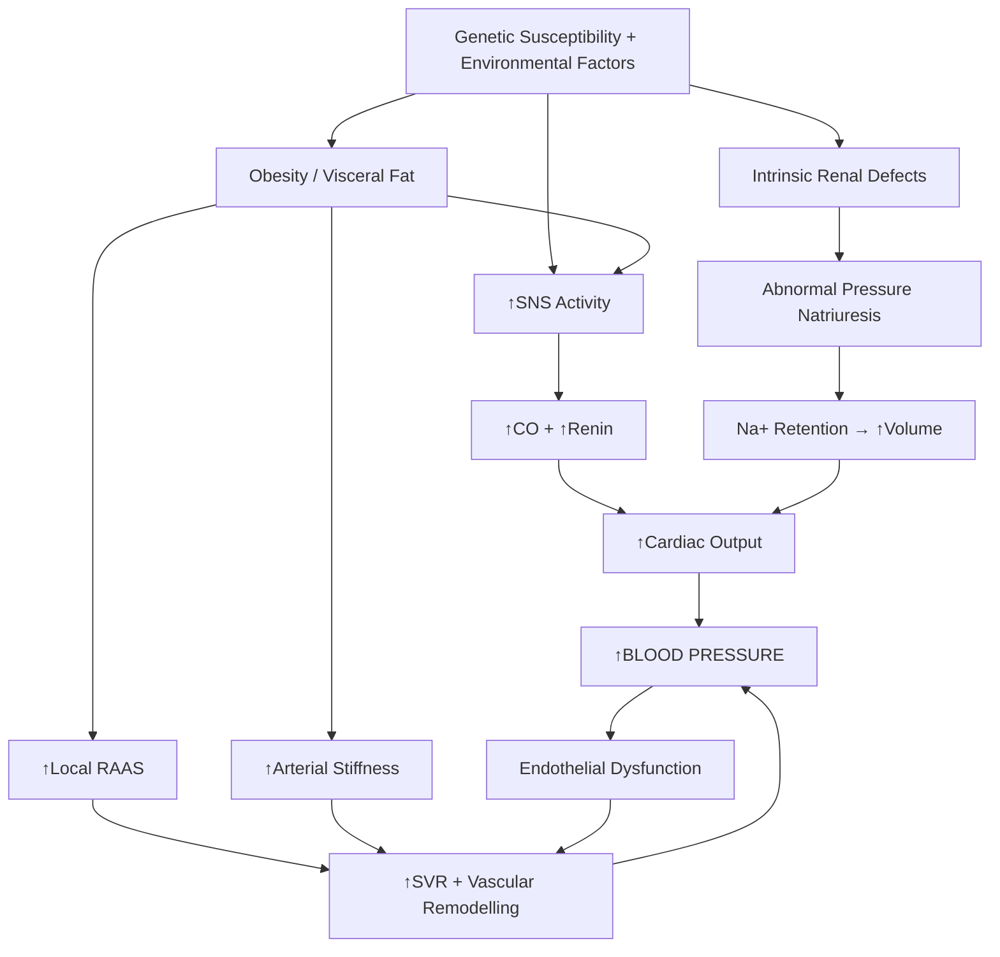
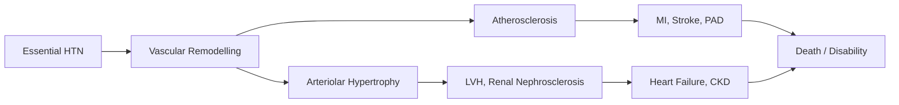

# Hypertension — Definition, Epidemiology, Risk Factors, Anatomy & Function, Etiology, Pathophysiology, Classification, and Clinical Features

---

## 1. Definition

Hypertension (HTN) literally breaks down as **"hyper"** (Greek: excessive) + **"tension"** (Latin: pressure/stretching) — it is the presence of **abnormally elevated arterial blood pressure** [1][2].

Why does it matter? ***HTN itself is often asymptomatic. It is only treated because of its associated risks of target organ damage (TOD) and clinical events*** [2]. Think of HTN as a silent, cumulative mechanical and biochemical insult to the vasculature — over years, the excessive force against arterial walls causes endothelial injury, smooth muscle hypertrophy, atherosclerosis, and end-organ ischaemia.

<Callout title="Core Concept">
Hypertension is not a disease in itself — it is a **risk factor** and a **haemodynamic state** that, left unchecked, drives cardiovascular, cerebrovascular, and renal morbidity and mortality. The entire rationale for treatment is reducing downstream complications.
</Callout>

### Haemodynamic Basis

Blood pressure is governed by a simple relationship:

$$
\text{BP} = \text{Cardiac Output (CO)} \times \text{Systemic Vascular Resistance (SVR)}
$$

$$
\text{CO} = \text{Heart Rate (HR)} \times \text{Stroke Volume (SV)}
$$

Therefore, any process that raises CO (e.g., volume overload, sympathetic drive) or SVR (e.g., arteriolar vasoconstriction, arterial stiffness) — or both — will raise BP. Every single cause and mechanism of hypertension can be traced back to this equation.

---

## 2. Epidemiology

### Global Burden

- ***~1 billion people worldwide have hypertension*** [2].
- HTN is the **single largest contributor to global mortality**, responsible for ~10.4 million deaths/year (mostly via ischaemic heart disease and stroke) [3].
- Prevalence has been rising in low- and middle-income countries due to urbanisation, dietary shifts (processed food, high salt), and ageing populations.

### Hong Kong Context

- ***Prevalence ~20% in Hong Kong*** [2], though community surveys suggest up to 27–30% of adults ≥ 15 years when including undiagnosed cases [1].
- Among those with HTN in HK, roughly **half are unaware** of their diagnosis — reinforcing the "silent killer" concept.
- HK's ageing population, high dietary sodium intake (average ~9–10 g salt/day, well above WHO recommendation of < 5 g/day), and increasing obesity rates are driving the epidemic.
- Leading cause of cardiovascular events (stroke, MI) in HK, with stroke being the 4th leading cause of death and IHD the 3rd.

### Age and Sex

- Prevalence increases steeply with age: ~10% in 20–30 year olds, > 60% in those ≥ 60 years.
- ***Age: ≥45 years (male) or ≥55 years (female)*** is considered a CVD risk factor [1][2].
- Before menopause, women have lower prevalence than men (oestrogen has a mild vasodilatory and anti-atherogenic effect). After menopause, prevalence equalises or exceeds males.
- **Isolated systolic hypertension (ISH)** is the dominant pattern in the elderly (due to large artery stiffness), while younger hypertensives more often have combined systolic and diastolic elevation.

### Ethnic Variation

- ***Black race*** is a risk factor for adverse prognosis in hypertension [3] — higher prevalence, earlier onset, more severe TOD, and higher rates of salt-sensitive HTN.
- In the HK/Chinese population, stroke (both ischaemic and haemorrhagic) is the predominant HTN-related complication, more so than coronary artery disease (compared with Western populations).

---

## 3. Risk Factors

### 3.1 Non-Modifiable Risk Factors

| Factor | Explanation |
|---|---|
| **Age** | Arterial wall collagen increases, elastin degrades → large artery stiffness → ↑SVR → ISH. Progressive nephron loss → impaired sodium excretion |
| **Sex** | Males > females before menopause (oestrogen-mediated vasodilation via NO). Post-menopausal risk equalises |
| **Family history** | Polygenic inheritance. ***Family history of HT → essential HT*** [1]. First-degree relative with premature CVD (***men < 55 y, women < 65 y***) [2] |
| **Ethnicity** | ***Black race*** associated with worse prognosis [3] |

### 3.2 Modifiable / Environmental Risk Factors

These are essentially the **CVD risk factors** and overlap heavily with the metabolic syndrome:

| Factor | Mechanism | Notes |
|---|---|---|
| ***High-sodium diet*** | Na⁺ retention → ↑intravascular volume → ↑CO; also activates local RAAS and causes endothelial dysfunction [1] | Average HK intake ~9-10 g salt/day |
| ***High-calorie diet / Obesity (BMI > 30)*** | Visceral adipose tissue → ↑sympathetic nervous system (SNS) activity, ↑RAAS, hyperinsulinaemia → Na⁺ retention, endothelial dysfunction [1][2] | ***Component of metabolic syndrome*** [1] |
| ***Physical inactivity*** | ↓Endothelium-dependent vasodilation (↓NO), ↑sympathetic tone, ↑insulin resistance [1] | ***CVD risk factor*** [1] |
| ***Cigarette smoking*** | Acute sympathetic activation → ↑HR, ↑SVR; chronic endothelial damage → accelerated atherosclerosis [1] | Major independent CVD risk factor |
| ***Excess alcohol intake*** | Dose-dependent ↑BP via ↑SNS, ↑cortisol, direct vascular toxicity; also ↑caloric intake → obesity [3] | > 2 standard drinks/day in men |
| ***Dyslipidaemia*** | ↑LDL → endothelial dysfunction → arterial stiffness; ***component of metabolic syndrome*** [1] | |
| ***Diabetes mellitus*** | Insulin resistance → ↑SNS, ↑RAAS, ↑Na⁺ retention; hyperglycaemia → advanced glycation end-products (AGEs) → arterial stiffness [1] | ***Component of metabolic syndrome*** [1] |
| ***Microalbuminuria or eGFR < 60 mL/min*** | Indicates subclinical renal damage — both a consequence and a perpetuator of HTN [1] | |
| ***IUGR (intrauterine growth restriction)*** | "Barker hypothesis" — foetal programming leads to fewer nephrons → impaired sodium handling in adulthood [2] | |

<Callout title="CVD Risk Factors (Lecture Slide)" type="idea">
***CVD Risk Factors*** [1]:
- ***Hypertension***
- ***Cigarette smoking***
- ***Obesity (BMI > 30 kg/m²)***
- ***Physical inactivity***
- ***Dyslipidaemia***
- ***Diabetes mellitus***
- ***Microalbuminuria or estimated GFR < 60 mL/min***
- ***Age (older than 55 for men, 65 for women)***
- ***Family history of premature CVD (men under age 55 or women under age 65)***

Components marked with * are ***components of the metabolic syndrome*** [1].
</Callout>

### 3.3 Risk Factors for Adverse Prognosis in HTN

Once HTN is established, certain factors predict worse outcomes [3]:

> ***Risk Factors for an Adverse Prognosis in Hypertension*** [3]:
> - ***Black race***
> - ***Youth*** (younger onset → longer exposure → more cumulative TOD)
> - ***Male sex***
> - ***Persistent diastolic pressure > 115 mmHg***
> - ***Smoking***
> - ***Diabetes mellitus***
> - ***Hypercholesterolaemia***
> - ***Obesity***
> - ***Excess alcohol intake***
> - ***Evidence of end-organ damage*** (cardiac enlargement, ECG ischaemia/LV strain, MI, CCF, retinal exudates/haemorrhages, papilloedema, impaired renal function, cerebrovascular accident) [3]

---

## 4. Relevant Anatomy and Physiology

To understand hypertension from first principles, you need to understand the systems that regulate BP.

### 4.1 The Arterial System

- **Large conduit arteries** (aorta, carotids, iliacs): contain a high proportion of **elastin** in the tunica media → "Windkessel function" — they expand during systole to absorb kinetic energy, then recoil during diastole to maintain flow. This is why diastolic pressure exists at all.
  - With ageing: ***large conduit arteries become less compliant*** [1] — elastin fragments, collagen is deposited, medial calcification occurs → ↑pulse wave velocity → ↑systolic BP, ↓diastolic BP → widened pulse pressure → isolated systolic hypertension.
- **Small resistance arterioles**: the major determinant of SVR. Their tone is regulated by:
  - **Sympathetic nervous system** (α₁ receptors → vasoconstriction)
  - **RAAS** (angiotensin II → vasoconstriction)
  - **Endothelium-derived factors** (NO → vasodilation; endothelin-1 → vasoconstriction)
  - **Local metabolites** (adenosine, K⁺, CO₂)

### 4.2 The Kidney — The Master Regulator

The kidney is the **long-term regulator** of BP via control of sodium and water balance — this is the "pressure natriuresis" concept:

- When BP rises → renal perfusion pressure rises → kidney excretes more Na⁺ and water → blood volume decreases → BP normalises.
- ***Abnormal pressure natriuresis and sodium retention*** is a central defect in essential HTN [1] — the curve is "reset" rightward, so a higher BP is needed to achieve the same level of sodium excretion.
- ***Intrinsic renal factors (genetic and prenatal) regulate sodium excretion*** [1].

### 4.3 The Sympathetic Nervous System (SNS)

- Baroreceptors (carotid sinus and aortic arch) sense arterial stretch → signal via CN IX and X to the nucleus tractus solitarius in the medulla → modulate sympathetic outflow.
- ***Increased sympathetic nervous system activity*** is a key early feature in essential HTN [1] — this drives ↑HR, ↑contractility (↑CO), renal Na⁺ retention, and arteriolar vasoconstriction (↑SVR).
- The SNS also stimulates renin release from the juxtaglomerular apparatus (via β₁ receptors).

### 4.4 The Renin-Angiotensin-Aldosterone System (RAAS)

This is the dominant neurohormonal axis in BP regulation:

1. **Renin** released from juxtaglomerular cells (stimulated by ↓renal perfusion, ↓Na⁺ at macula densa, ↑sympathetic β₁ stimulation) [4]
2. Renin cleaves angiotensinogen (from liver) → **Angiotensin I**
3. ACE (in pulmonary endothelium) converts Ang I → **Angiotensin II**
4. Angiotensin II effects:
   - Potent arteriolar vasoconstriction (↑SVR)
   - Stimulates **aldosterone** secretion from zona glomerulosa → ***Na⁺/K⁺ ATPase at distal tubule*** → Na⁺ retention, K⁺ secretion, H⁺ secretion [4]
   - Stimulates ADH release → water retention
   - Stimulates thirst
   - Promotes vascular smooth muscle hypertrophy and fibrosis
   - ***High sodium level activates local angiotensin II in heart and arteries*** [1] — this is the tissue RAAS, which contributes to cardiac and vascular remodelling independent of circulating levels.

### 4.5 Endothelial Function

- Healthy endothelium produces **nitric oxide (NO)** via endothelial NO synthase (eNOS) → vasodilation, anti-platelet, anti-inflammatory, anti-proliferative.
- ***Endothelial-cell dysfunction in small resistance vessels*** is both a cause and a consequence of HTN [1] — ↓NO bioavailability, ↑endothelin-1, ↑reactive oxygen species → sustained vasoconstriction and vascular remodelling.

### 4.6 Other Systems

- **Natriuretic peptides** (ANP from atria, BNP from ventricles): released in response to myocardial stretch → vasodilation, natriuresis, inhibit RAAS → serve as a counter-regulatory "brake" on BP.
- **Prostaglandins** (PGI₂, PGE₂): vasodilatory prostaglandins in the kidney promote natriuresis — this is why **NSAIDs** (which inhibit COX) can raise BP.
- **Dopamine**: low-dose dopamine promotes renal vasodilation and natriuresis.

---

## 5. Etiology (with Focus on Hong Kong)

### 5.1 Essential (Primary) Hypertension — 95%

***Essential hypertension accounts for ~95% of cases*** [2]. "Essential" is a historical misnomer (once thought to be "essential" for organ perfusion); it really means **idiopathic/primary** — no single identifiable cause, but rather a **complex interplay of genetic susceptibility and environmental factors**.

#### 5.1.1 Environmental Factors

- ***High-sodium, high-calorie diet*** [1]
- ***Heavy alcohol consumption*** [2]
- ***Obesity*** [2]
- ***Lack of exercise*** [2]
- ***IUGR*** (intrauterine growth restriction) — the "Barker/developmental origins" hypothesis [2]

#### 5.1.2 Genetic Factors

- Polygenic inheritance — genome-wide association studies have identified > 1000 loci, each with small effect sizes.
- **Monogenic forms** are rare but instructive (e.g., Liddle syndrome — gain-of-function ENaC mutation → constitutive Na⁺ reabsorption; glucocorticoid-remediable aldosteronism).
- ***Genetics*** plays a significant role [1][2] — family history of HTN is one of the strongest risk factors.

#### 5.1.3 Pathogenesis of Essential HTN — An Integrated Model

The lecture slide [1] provides an excellent integrated diagram of the pathogenesis. Let me walk through it systematically:

> ***Pathogenesis of Essential Hypertension (from NEJM 2010, Sacks FM et al.)*** [1]:
>
> 1. ***Increased sympathetic nervous system activity*** → ↑CO and ↑SVR
> 2. ***Intrinsic renal factors (genetic and prenatal) regulate sodium excretion*** → abnormal pressure natriuresis → Na⁺ retention
> 3. ***High sodium level activates local angiotensin II in heart and arteries*** → cardiac and vascular remodelling
> 4. ***Increased tissue angiotensin II in kidneys and adrenal glands*** → Na⁺ retention, vasoconstriction
> 5. ***Large conduit arteries become less compliant*** → ↑systolic BP, widened pulse pressure
> 6. ***Smooth-muscle cell proliferation and rearrangement*** → arteriolar wall thickening → ↑SVR
> 7. ***Endothelial-cell dysfunction in small resistance vessels*** → impaired vasodilation → ↑peripheral resistance
> 8. ***Abnormal pressure natriuresis and sodium retention*** — the kidney cannot excrete Na⁺ adequately at normal BP
> 9. ***Abdominal fat further increases conduit artery stiffness, sympathetic nervous system activity, and angiotensin II levels*** [1] — this is why obesity is such a potent driver
> 10. Result: ***Increased cardiac output*** + ***Increased peripheral resistance*** → ***Increased blood pressure*** [1]

The key conceptual framework:

**Age-dependent mechanism** [2]:
- ***Young patients: predominantly ↑SNS and ↑RAAS activities → ↑SVR, ↑CO***
- ***Elderly patients: predominantly arterial degeneration → ↑SVR***

This is why younger hypertensives often have a hyperdynamic circulation (↑HR, ↑CO) and respond well to beta-blockers, whereas elderly patients have stiff arteries with wide pulse pressures and respond better to CCBs and diuretics.

### 5.2 Secondary Hypertension — 5%

***Secondary hypertension: distinct, identifiable cause*** [2]. The mnemonic from the senior notes is **DANCER** [2]:

| Letter | Category | Specific Causes | Mechanism |
|---|---|---|---|
| **D** | ***Drugs*** | ***SNS-related: caffeine, amphetamines, levodopa, MAOI, antidepressants, decongestants*** [2] | ↑Sympathetic tone → ↑CO, ↑SVR |
| | | ***Fluid retention: OCP, anabolic steroids, mineralocorticoids, corticosteroids*** [2] | Na⁺/H₂O retention → ↑volume |
| | | ***Immunosuppressants (cyclosporine)*** [2] | Renal vasoconstriction, ↑endothelin |
| | | ***NSAIDs, COX-2 inhibitors*** [2] | Inhibit renal vasodilatory prostaglandins → Na⁺ retention + renal vasoconstriction |
| | | ***Alcohol, nicotine*** [2] | ↑SNS, direct vasotoxicity |
| | | ***Anti-cancer: chemotherapy, angiogenesis inhibitors, TKIs*** [2] | ↓VEGF → ↓NO → endothelial dysfunction |
| **A** | ***Apnoea*** | Obstructive sleep apnoea (OSA) | Intermittent hypoxia → ↑SNS, ↑endothelin, ↑oxidative stress → sustained ↑SVR even during daytime |
| **N** | ***Neurological*** | ***↑ICP, stress, others*** [2] | Cushing reflex (↑ICP → ↑SNS → ↑BP to maintain CPP); chronic stress → sustained ↑SNS |
| **C** | ***Coarctation of aorta*** | Congenital narrowing of aorta (usually just distal to left subclavian) | Mechanical obstruction → ↑BP proximal to coarctation, ↓BP distal; also ↑RAAS (renal hypoperfusion) |
| **E** | ***Endocrine*** | ***Thyroid: hyperthyroidism, hypothyroidism*** [2] | Hyperthyroid → ↑CO (↑HR, ↑contractility) → ***systolic HTN***. Hypothyroid → ↑SVR → ***diastolic HTN*** [2] |
| | | ***Adrenals: Cushing's, Conn's, phaeochromocytoma*** [2] | Cushing's: cortisol excess → mineralocorticoid activity + ↑SNS. Conn's: aldosterone → Na⁺ retention. Phaeochromocytoma: catecholamine excess |
| | | ***Parathyroid: hyperparathyroidism*** [2] | Hypercalcaemia → vasoconstriction, ↑vascular reactivity |
| | | ***Others: pre-eclampsia, acromegaly*** [2] | Pre-eclampsia: placental ischaemia → anti-angiogenic factors → endothelial dysfunction. Acromegaly: GH excess → ↑Na⁺ retention, ↑SVR |
| **R** | ***Renal*** | ***Renal vascular: renal artery stenosis (RAS)*** [2] | ↓Renal perfusion → ↑renin → ↑RAAS |
| | | ***Renal parenchymal: GN, polycystic kidney, kidney failure*** [2] | ↓Nephron mass → impaired Na⁺ excretion → volume overload; also ↑RAAS |

<Callout title="Indications to Look for Secondary HTN" type="idea">
***Indications to look for causes of secondary HTN (ACC/AHA 2017)*** [2]:

**General:**
- ***Age of onset: < 30 y or diastolic HTN for ≥ 65 y***
- ***Severity: accelerated or malignant HTN, disproportionate TOD for degree of HTN***
- ***Course: abrupt onset, drug-resistant or exacerbation of previously controlled HTN***

**Specific:**
- ***Unprovoked or excessive hypokalaemia*** (but note thiazide use!)
- ***Renal HTN: palpable kidney, renal bruit, abnormal urinalysis***
- ***Endocrine: S/S of phaeochromocytoma, unexplained hypokalaemia, signs of Cushing's syndrome***
- ***Coarctation: radiofemoral delay***
</Callout>

#### Key Secondary Causes — Elaboration on Pathophysiology

**Phaeochromocytoma** (from senior notes [5]):
- Catecholamine-secreting tumour from chromaffin cells of adrenal medulla.
- ***5 P's: Pressure (HT), Pain (headache/chest), Palpitation, Perspiration, Pallor (vasoconstriction)*** [5]
- ***Classic triad: paroxysmal headache, sweating, palpitations*** [5]
- ***10% rule: 10% familial, 10% bilateral, 10% extra-adrenal, 10% malignant, 10% secrete adrenaline/dopamine (c.f. 90% noradrenaline), 10% children, 10% not associated with HT, 10% recurrence*** [5]
- ***Young-onset paroxysmal HT + postural hypotension*** (because adrenaline at moderate levels causes β₂-mediated vasodilation → orthostatic drop) [5]

**Conn's Syndrome (Primary Hyperaldosteronism)** [4][5]:
- ***↓Renin, ↑aldosterone*** (negative feedback on renin from volume expansion)
- ***Aldosterone-producing adenoma (30-40%)*** vs. ***bilateral idiopathic adrenal hyperplasia (60-70%)*** [4]
- Clinical: HTN + hypokalaemia + metabolic alkalosis (aldosterone → ↑Na⁺ reabsorption, ↑K⁺ secretion → ↑H⁺ secretion via K⁺/H⁺ exchanger) [4]

**Renal Artery Stenosis:**
- Causes: atherosclerosis (older males, ostial lesion) vs. fibromuscular dysplasia (young females, mid-vessel "string of beads")
- ↓Renal perfusion → JG cells sense ↓pressure → ↑renin → ↑Ang II → ↑aldosterone → ↑BP
- Clue: flash pulmonary oedema, ↑creatinine with ACEI/ARB initiation, renal bruit

---

## 6. Classification

### 6.1 By Office Blood Pressure

***Definition of HTN (ACC/AHA 2017)*** [2]:

| Category | SBP (mmHg) | | DBP (mmHg) |
|---|---|---|---|
| **Normal** | < 120 | and | < 80 |
| **Elevated** | 120–129 | and | < 80 |
| **Stage 1 HTN** | 130–139 | or | 80–89 |
| **Stage 2 HTN** | ≥ 140 | or | ≥ 90 |
| **Hypertensive Crisis** | > 180 | and/or | > 120 |

> Note: The ACC/AHA 2017 guidelines lowered the threshold for Stage 1 HTN to 130/80, which is more aggressive than the previous JNC 8 (140/90) or the ESC/ESH 2018 guidelines (which still define HTN as ≥ 140/90 but acknowledge 130/80 as "high-normal"). In HK clinical practice, many clinicians still use **140/90** as the treatment threshold for uncomplicated patients, and **130/80** for high-risk groups (DM, CKD, established CVD). Know both for exams.

### 6.2 By Measurement Type

The thresholds differ depending on how BP is measured [2]:

| Measurement | HTN Threshold |
|---|---|
| Office BP | ≥ 140/90 (or ≥ 130/80 by ACC/AHA) |
| HBPM (Home) | ≥ 135/85 |
| ABPM — Daytime mean | ≥ 135/85 |
| ABPM — Night-time mean | ≥ 120/70 |
| ABPM — 24-hour mean | ≥ 130/80 |

Why are out-of-office thresholds lower? Because office BP is subject to the alerting response and tends to be higher than "true" resting BP.

### 6.3 White-Coat and Masked HTN

***White-coat hypertension*** [2]:
- ***↑Office BP but normal ABPM/HBPM***
- ***Prevalence: 15–30%, especially elderly and pregnant***
- ***↑Risk < that of sustained HTN → reassurance***
- ***?Precursor to HTN → offer follow-up and monitoring***

***Masked hypertension*** [2]:
- ***Normal office BP but ↑ABPM/HBPM***
- ***↑Risk > patients with known but uncontrolled HTN*** — this is particularly dangerous because it goes undetected. Common in smokers, heavy alcohol users, high workplace stress, and OSA.

### 6.4 By Etiology

- **Essential (Primary)** — 95% [2]
- **Secondary** — 5% [2]

### 6.5 By Severity / Urgency

| Category | Definition |
|---|---|
| ***Malignant hypertension*** | ***BP ≥ 220/120 + Grade 3–4 fundal changes*** (flame haemorrhages, cotton-wool spots, papilloedema) [2] |
| ***Hypertensive emergency*** | ***BP > 180/120 + worsening/new TOD*** (e.g., ICH, APO, HTN encephalopathy, aortic dissection) [2] |
| ***Hypertensive urgency*** | ***Severe ↑BP without new/worsening TOD*** [2] |

### 6.6 Isolated Systolic Hypertension (ISH)

- SBP ≥ 140 with DBP < 90
- Predominant form in elderly (> 60 years) — due to ***large artery stiffness*** [1]
- Associated with widened pulse pressure — an independent predictor of cardiovascular events

---

## 7. Clinical Features

### Guiding Principle

***Hypertensive patients may present with*** [2]:
1. ***Asymptomatic (incidental finding)*** — **most common presentation**
2. ***Symptoms of ↑BP itself***
3. ***Symptoms of HTN vascular disease (target organ damage)***
4. ***Symptoms/signs of a secondary cause***

### 7.1 Symptoms

#### A. Symptoms Directly from ↑BP

Most patients are asymptomatic. When symptoms do occur:

| Symptom | Pathophysiological Basis |
|---|---|
| ***Headache*** | Severe ↑BP → ↑intracranial pressure from impaired cerebral autoregulation; also ↑pulsatile stretch of meningeal vessels activating nociceptors. Classically **occipital**, **worse in the morning** (BP tends to peak in early morning), improves as the day goes on |
| ***Dizziness*** | ↑BP → impaired cerebrovascular autoregulation → cerebral hyperperfusion or relative ischaemia in watershed zones |
| ***Palpitations*** | ↑Sympathetic drive (in early/essential HTN) → ↑HR; also LVH → arrhythmias (esp. AF) |
| ***Easy fatigability*** | ↑Afterload → ↑myocardial O₂ demand → reduced exercise tolerance; also impaired peripheral perfusion from ↑SVR |
| ***Impotence / Erectile dysfunction*** | Endothelial dysfunction in penile vasculature → impaired NO-mediated vasodilation → poor corpus cavernosum filling |

#### B. Symptoms of Target Organ Damage (HTN Vascular Disease)

| Symptom | Target Organ | Pathophysiological Basis |
|---|---|---|
| ***Epistaxis*** | Vascular | ↑Pressure in nasal mucosal arterioles (Kiesselbach's plexus) → vessel rupture. Often an early presenting feature in HK |
| ***Haematuria*** | Renal | Hypertensive nephrosclerosis → glomerular capillary damage → RBC leak into urine |
| ***Blurring of vision*** | Retina | Hypertensive retinopathy → arteriolar narrowing, cotton-wool spots (retinal ischaemia), macular oedema, papilloedema |
| ***Episodes of weakness/dizziness*** | CNS | TIA/stroke from hypertensive vascular disease — lipohyalinosis of perforating arteries → lacunar infarcts; or ↑risk of atherothrombotic/embolic stroke |
| ***Angina / Chest pain*** | Heart | LVH → ↑myocardial O₂ demand + coronary microvascular disease → supply-demand mismatch. Also accelerated coronary atherosclerosis |
| ***Dyspnoea*** | Heart | LVH → diastolic dysfunction (stiff, non-compliant LV) → ↑LV filling pressures → pulmonary congestion → dyspnoea. If progresses → systolic dysfunction (HFrEF) → overt heart failure |
| ***Nocturia*** | Renal | Impaired renal concentrating ability from chronic hypertensive nephropathy; also at night, recumbent position → ↑venous return → ↑renal perfusion → ↑urine output |

#### C. Symptoms Suggesting Secondary Causes

| Symptom | Suspected Cause |
|---|---|
| ***Paroxysmal headache, sweating, palpitations, pallor*** | Phaeochromocytoma [5] |
| Muscle weakness, polyuria, polydipsia | Conn's syndrome (hypokalaemia) |
| Weight gain, striae, easy bruising | Cushing's syndrome |
| Loud snoring, daytime somnolence, morning headache | OSA |
| Heat intolerance, tremor, weight loss, diarrhoea | Hyperthyroidism |

### 7.2 Signs

#### A. Blood Pressure Measurement

***Physical examination*** [2]:
- ***BP/Pulse: bilateral arms, supine and standing***
  - Why bilateral? To detect coarctation of aorta (inter-arm difference > 20/10 mmHg) or subclavian stenosis.
  - Why supine and standing? To detect **orthostatic hypotension** (common in elderly, diabetics, and autonomic neuropathy; also suggests phaeochromocytoma if paroxysmal HTN + postural drop).

#### B. General Examination

| Sign | What It Tells You | Mechanism |
|---|---|---|
| ***BMI and waist circumference*** [2] | Obesity — major modifiable risk factor; central obesity particularly correlates with metabolic syndrome | Visceral fat → ↑SNS, ↑RAAS, ↑insulin resistance |
| Cushingoid features (moon face, truncal obesity, striae, buffalo hump) | Cushing's syndrome | Cortisol excess → glucocorticoid + mineralocorticoid effects |
| Café-au-lait spots, neurofibromas | NF1 — associated with phaeochromocytoma | Familial phaeochromocytoma syndromes |

#### C. Cardiovascular Examination

| Sign | Significance | Mechanism |
|---|---|---|
| ***Palpation/auscultation of all peripheral arteries*** [2] | Screen for PVD (absent pulses, bruits); renal bruit (renal artery stenosis) | Atherosclerosis accelerated by chronic HTN |
| **Displaced, sustained, heaving apex beat** | Left ventricular hypertrophy (LVH) — the heart hypertrophies concentrically to normalise wall stress (Laplace's law: Wall stress = Pressure × Radius / 2 × Wall thickness) | Chronic pressure overload → concentric hypertrophy |
| **Loud A₂** (aortic component of S2) | ↑Aortic diastolic pressure → forceful aortic valve closure | ↑Afterload |
| **S4 gallop** (atrial gallop) | Stiff, non-compliant LV from hypertrophy → atrial contraction into a stiff ventricle produces audible S4 | Diastolic dysfunction |
| **Radiofemoral delay** | ***Coarctation of aorta*** [2] | Blood reaches femoral arteries via collaterals → delayed pulse |
| **Abdominal bruit** (epigastric, renal angles) | Renal artery stenosis | Turbulent flow through stenosed renal artery |
| **Radio-radial delay or inter-arm BP difference** | Coarctation, subclavian stenosis | Unilateral obstruction to upper limb flow |

#### D. Fundoscopy (Keith-Wagener-Barker Classification)

Fundoscopy is a critical bedside examination — the retina is the **only place you can directly visualise arterioles**:

| Grade | Finding | Pathophysiology |
|---|---|---|
| **Grade 1** | Arteriolar narrowing (silver/copper wiring) | Chronic ↑intraluminal pressure → arteriolar smooth muscle hypertrophy → narrowed lumen. "Silver wiring" = fibrotic wall reflecting more light |
| **Grade 2** | AV nipping (arteriovenous crossing changes) | Thickened arteriole compresses the underlying venule at crossing points |
| **Grade 3** | ***Retinal haemorrhages and exudates*** [3] | Flame haemorrhages: rupture of retinal arterioles. Hard exudates: lipid and protein leakage from damaged capillaries. Cotton-wool spots: retinal nerve fibre layer micro-infarcts (ischaemia) |
| **Grade 4** | ***Papilloedema*** [3] | Severe ↑BP → impaired optic nerve head perfusion + ↑intracranial pressure → optic disc swelling. **Defines malignant hypertension** |

> ***Malignant hypertension is defined as BP ≥ 220/120 + Grade 3–4 fundal changes*** [2]. This represents a vicious cycle: severe HTN → fibrinoid necrosis of arterioles → renal ischaemia → ↑renin → further ↑BP → more vascular damage.

#### E. Other Organ Systems

| Sign | Organ | Significance |
|---|---|---|
| Pulmonary crepitations, elevated JVP, peripheral oedema | Heart | Hypertensive heart failure (initially diastolic, then systolic dysfunction) |
| ***Palpable kidney*** [2] | Renal | Polycystic kidney disease → renal cause of HTN |
| Enlarged thyroid, tremor, lid lag, tachycardia | Endocrine | Hyperthyroidism → ↑CO → systolic HTN |

### 7.3 Target Organ Damage — Summary

***Evidence of end-organ damage*** [3]:

| Target Organ | Manifestation | Why? |
|---|---|---|
| **Heart** | ***Cardiac enlargement (LVH), ECG ischaemia/LV strain, MI, CHF*** [3] | Pressure overload → LVH → diastolic dysfunction → heart failure. Accelerated atherosclerosis → coronary events |
| **Eyes** | ***Retinal exudates, haemorrhages, papilloedema*** [3] | Arteriolar damage → leakage and ischaemia; severe: optic nerve head oedema |
| **Kidneys** | ***Impaired renal function*** [3], proteinuria, ↑creatinine | Hypertensive nephrosclerosis: afferent arteriolar hyalinosis → glomerular ischaemia → nephron loss → CKD |
| **Brain/CNS** | ***Cerebrovascular accident*** [3] | Haemorrhagic stroke (rupture of Charcot-Bouchard microaneurysms in perforating arteries); ischaemic stroke (accelerated atherosclerosis, lacunar infarcts) |
| **Peripheral arteries** | PAD, aortic aneurysm/dissection | Atherosclerosis + medial degeneration → aneurysm formation |

<Callout title="Target Organ Damage — What to Assess">

***Cardiac***: ECG (LVH, ischaemia), Echocardiography (LV mass, EF, diastolic function)

***Eyes***: Fundoscopy (Keith-Wagener-Barker grading)

***Renal***: RFT (creatinine, eGFR), urinalysis (haematuria, UACR for albuminuria) [2]

***Cerebrovascular***: Clinical history (TIA/stroke), CT/MRI brain if indicated

***Peripheral vascular***: Peripheral pulse examination, ABI
</Callout>

---

## 8. Investigations at Initial Evaluation

***Routine initial evaluation*** [2]:

### History
- ***Age: consider secondary HTN < 35 y or > 55 y*** [1][2]
- ***Duration of HTN and previous BP levels*** [1]
- ***Family history of HT: essential HT*** [1]
- ***Other risk factors: cigarette smoking, diabetes mellitus, lipid disorders, family history of early CVD deaths*** [1]
- ***Lifestyle: diet, physical activity, family status, work*** [1]

### Physical Examination
- ***BP/Pulse: bilateral arms, supine and standing*** [2]
- ***BMI and waist circumference*** [2]
- ***CVS: standard + palpation/auscultation of all peripheral arteries*** [2]
- ***Fundus*** [2]

### Investigations
- ***Blood*** [2]:
  - ***RFT and electrolytes***: baseline renal function, r/o renal parenchymal disease, hyperaldosteronism and hyperparathyroidism. Why? ***Hypercalcaemia can be a secondary cause of hypertension*** [2]
  - ***Lipid profile*** for dyslipidaemia
  - ***Serum fasting glucose***: r/o DM
  - ***± Serum urate***: baseline and look for hyperuricaemia (associated with CVD risk; also relevant if considering thiazide diuretics)
- ***± Urinalysis***: haematuria (r/o renal disease), ***UACR (albuminuria)*** [2]
- ***ECG***: LVH, MI, cardiac failure, heart block [2]
- ***± Echocardiogram***: for LVH (more sensitive than ECG) [2]
- ***Calculation of 10-year CVD risk*** [2]

---

## 9. Consequences and Natural History

***Consequences: leads to target organ damage (TOD) → clinical events → death*** [2]

The natural history of untreated hypertension:

***Malignant hypertension*** [2]: **rare but lethal** — ***< 1% of HTN population, 25–50% 5-year mortality*** without treatment.
- ***Mechanism: accelerated microvascular damage including fibrinoid necrosis in small vessel walls and intravascular thrombosis*** [2].
- ***Clinical presentation: ↑BP + rapidly progressive TOD*** [2]:
  - ***Retina: papilloedema, retinal haemorrhages and exudates***
  - ***HTN encephalopathy: severe headache, vomiting, visual disturbances, transient paralyses, convulsions, stupor and coma***
  - ***Heart: acute LV failure***
  - ***Kidneys: acute RF with oliguria, proteinuria***

---

## 10. The Metabolic Syndrome Connection

Many HTN patients do not exist in isolation — they cluster with other metabolic derangements. This is the **metabolic syndrome**:

***Metabolic syndrome*** [4][6]: a cluster of metabolic disorders driven by **insulin resistance** (often from central obesity):
- ***Hypertension***
- ***Dyslipidaemia (↑LDL-C, ↑TG, ↓HDL-C)***
- ***Type 2 DM***
- ***PCOS***
- ***NAFLD***

Why does insulin resistance cause HTN?
1. Hyperinsulinaemia → ↑renal Na⁺ reabsorption (insulin stimulates ENaC and Na⁺/K⁺-ATPase in collecting duct)
2. Hyperinsulinaemia → ↑SNS activity
3. Insulin normally causes vasodilation via NO → insulin resistance → ↓NO → endothelial dysfunction
4. ***Adipocytes release large amounts of FFA → insulin resistance***; ***adipocytes release adipokines → insulin resistance*** [6]
5. ***Abdominal fat further increases conduit artery stiffness, sympathetic nervous system activity, and angiotensin II levels*** [1]

---

<Callout title="High Yield Summary">

**Definition**: HTN = abnormally ↑BP. Treated because of TOD risk, not symptoms.

**Epidemiology**: ~1 billion worldwide; ~20% prevalence in HK. Most common cause of CVD globally. Stroke is the predominant complication in Chinese populations.

**BP = CO × SVR** — every cause of HTN acts through one or both.

**Essential HTN (95%)**: Polygenic + environmental (salt, obesity, alcohol, sedentary). Pathogenesis: ↑SNS + abnormal renal Na⁺ handling + ↑RAAS + endothelial dysfunction + arterial stiffness. Young = ↑SNS/RAAS; Elderly = arterial degeneration.

**Secondary HTN (5%)**: **DANCER** — Drugs, Apnoea, Neurological, Coarctation, Endocrine, Renal. Suspect if < 30 y onset, resistant HTN, abrupt onset, hypokalaemia, or specific clinical clues.

**Classification**: ACC/AHA 2017: Stage 1 ≥ 130/80, Stage 2 ≥ 140/90, Crisis > 180/120. White-coat HTN: ↑office, normal ABPM. Masked HTN: normal office, ↑ABPM (higher risk!).

**Clinical Features**: Usually asymptomatic. Symptoms when present: headache (occipital, morning), dizziness, palpitations, fatigue. TOD symptoms: epistaxis, visual changes, angina, dyspnoea, stroke symptoms. Signs: displaced apex (LVH), S4, loud A₂, fundoscopic changes (KWB grading), renal bruit.

**Target Organ Damage**: Heart (LVH → HF), Brain (stroke), Kidneys (nephrosclerosis → CKD), Eyes (retinopathy), Peripheral arteries (PAD, aneurysm).

**Malignant HTN**: BP ≥ 220/120 + Grade 3–4 fundoscopy. Fibrinoid necrosis. Lethal without treatment.

**Metabolic Syndrome**: Central obesity → insulin resistance → HTN + dyslipidaemia + DM + NAFLD + PCOS.
</Callout>

---

<ActiveRecallQuiz
  title="Active Recall - Hypertension: Definition, Epidemiology, Risk Factors, Etiology, Pathophysiology, Classification, and Clinical Features"
  items={[
    {
      question: "What is the fundamental haemodynamic equation governing blood pressure, and how does the predominant mechanism of essential HTN differ between young and elderly patients?",
      markscheme: "BP = CO x SVR. Young patients: predominantly increased SNS and RAAS activity leading to increased CO and SVR. Elderly patients: predominantly arterial degeneration and stiffness leading to increased SVR (isolated systolic HTN with widened pulse pressure)."
    },
    {
      question: "What is the mnemonic for secondary causes of hypertension, and list at least one example for each letter?",
      markscheme: "DANCER: D = Drugs (NSAIDs, OCP, steroids), A = Apnoea (OSA), N = Neurological (raised ICP), C = Coarctation of aorta, E = Endocrine (Conn's, Cushing's, phaeochromocytoma, thyroid disease), R = Renal (RAS, GN, PKD, CKD)."
    },
    {
      question: "Define white-coat hypertension and masked hypertension. Which carries a greater cardiovascular risk?",
      markscheme: "White-coat HTN: elevated office BP but normal ABPM/HBPM (prevalence 15-30%, especially elderly and pregnant; risk less than sustained HTN). Masked HTN: normal office BP but elevated ABPM/HBPM. Masked HTN carries greater risk - even greater than known uncontrolled HTN - because it goes undetected and untreated."
    },
    {
      question: "Describe the pathophysiological basis for an S4 gallop and a displaced, sustained apex beat in a hypertensive patient.",
      markscheme: "S4 gallop: chronic pressure overload causes concentric LVH leading to a stiff, non-compliant LV. Atrial contraction against this stiff ventricle produces an audible S4 (diastolic dysfunction). Displaced, sustained apex beat: LVH from chronic afterload increase. The heart hypertrophies (Laplace's law: wall stress = pressure x radius / 2 x wall thickness) to normalise wall stress, producing a sustained heaving apex."
    },
    {
      question: "What defines malignant hypertension, what is the underlying vascular pathology, and what is its untreated 5-year mortality?",
      markscheme: "Definition: BP at least 220/120 with Grade 3-4 fundal changes (retinal haemorrhages, exudates, papilloedema). Pathology: accelerated microvascular damage with fibrinoid necrosis of small vessel walls and intravascular thrombosis creating a vicious cycle (vessel damage causes renal ischaemia, further activating RAAS, raising BP further). Untreated 5-year mortality: 25-50%."
    },
    {
      question: "List at least 5 indications that should prompt investigation for secondary hypertension.",
      markscheme: "Any 5 of: (1) Age of onset less than 30 years, (2) Diastolic HTN in patients 65 years or older, (3) Accelerated or malignant HTN, (4) Disproportionate TOD for degree of HTN, (5) Abrupt onset, (6) Drug-resistant HTN, (7) Exacerbation of previously controlled HTN, (8) Unprovoked or excessive hypokalaemia, (9) Specific clinical clues such as renal bruit, Cushingoid features, radiofemoral delay, or signs of phaeochromocytoma."
    }
  ]}
/>

## References

[1] Lecture slides: GC 058. High Blood Pressure.pdf (p9, p29, p30, p49, p50)
[2] Senior notes: Ryan Ho Cardiology.pdf (p175–182)
[3] Lecture slides: GC 058. High Blood Pressure.pdf (p49 — Harrison's 2005 Risk Factors for Adverse Prognosis)
[4] Senior notes: Ryan Ho Endocrine.pdf (p57 — Mineralocorticoid Disorders)
[5] Senior notes: maxim.md (Phaeochromocytoma section)
[6] Senior notes: Ryan Ho Endocrine.pdf (p77, p117 — T2DM, Metabolic Syndrome, Obesity)
