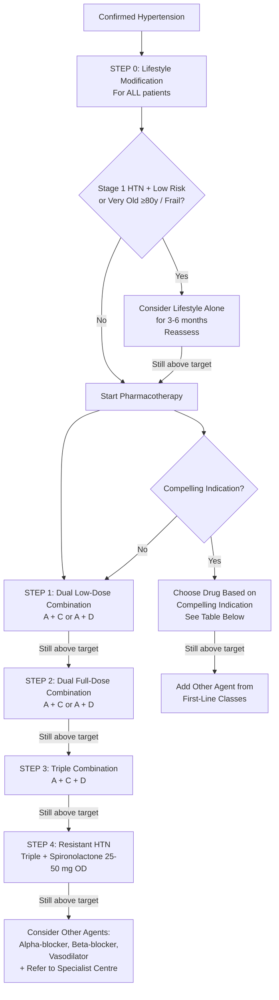
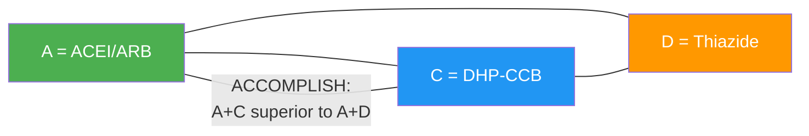
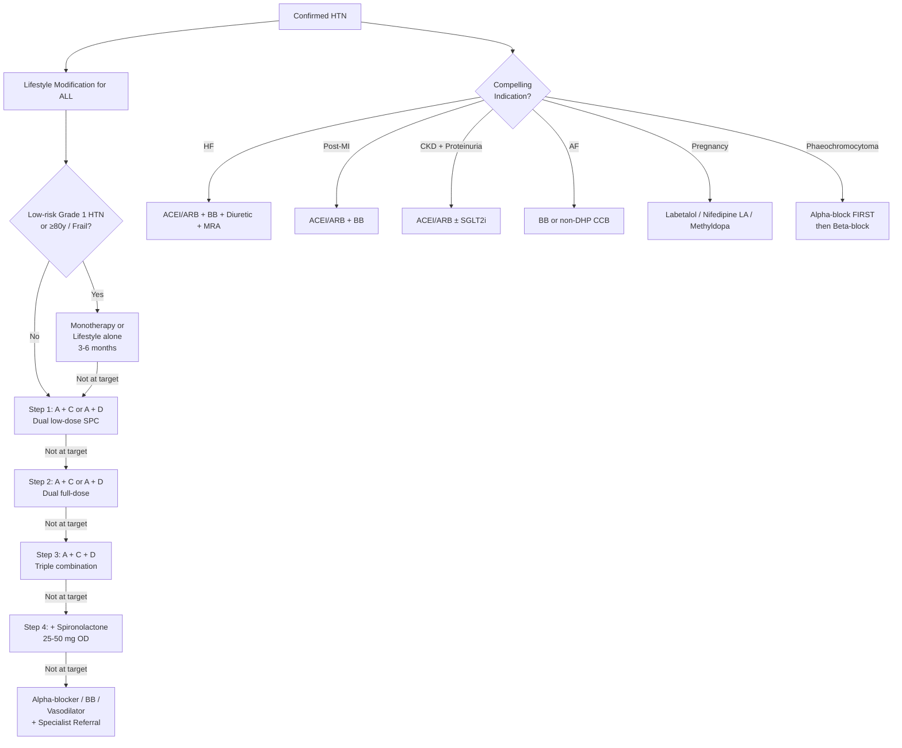

## Management of Hypertension — Algorithm, Treatment Modalities, Indications, and Contraindications

---

### 1. Overarching Principles of Management

Before diving into specific drugs, understand *why* and *when* we treat:

***HTN itself is harmless. It is only treated because of its associated risks of TOD and clinical events. If there is ↑CVD risk or evidence of TOD, it is reasonable to start Tx early.*** [2]

***Prognosis is mainly dependent on*** [2]:
- ***Concomitant CVS risk factors, especially DM (several × risk of CVD and CKD in HTN+DM patients)***
- ***Target organ damage***

Therefore, treatment decisions are **risk-stratified** — the higher the global cardiovascular risk, the lower the threshold to start pharmacotherapy and the more aggressive the target.

---

### 2. Treatment Goals

***Treatment goals depend on risk profile (ACC/AHA 2017)*** [2]:

| Risk Category | BP Target |
|---|---|
| ***10-year ASCVD risk ≥ 10%*** or ***pre-existing cardiovascular disease*** (including stable IHD, HF, CKD, stroke, DM) | ***≤ 130/80 mmHg*** |
| ***10-year ASCVD risk < 10%*** | ***≤ 140/90 mmHg*** |

From the lecture slides [13]:

> ***Target: < 150/90 or < 140/80 for young (< 65), DM and renal diseases*** [13]

The **ESC 2018** and **ISH 2020** guidelines nuance this further:
- First target for all: get below 140/90 within 3 months
- If tolerated in < 65 years: aim for SBP 120–130 mmHg
- In ≥ 65 years: aim SBP 130–139 mmHg (avoid < 120 due to falls/hypoperfusion risk)
- DM and CKD: < 130/80 if tolerated

<Callout title="Monitoring and Follow-up" type="idea">
***Monitoring*** [14]:
- ***Reduce BP by at least 20/10 mmHg, ideally to < 140/90 mmHg***
- ***Individualise for elderly based on frailty***
- ***BP control — achieve target within 3 months***
- ***Adverse effects***
- ***Long-term adherence***
- ***If BP still uncontrolled, or other issue, refer to care provider with hypertension expertise***
</Callout>

---

### 3. The Management Algorithm

This algorithm synthesises the ***ESC 2018*** [13], ***ISH 2020*** [14], and senior notes [2] approaches. Let me explain each step.

---

### 4. Lifestyle Modification — The Foundation for ALL Patients

***Lifestyle measures*** [2]:
- ***Role: as initial therapy before starting medications; as adjunct to or facilitate step-down of medications***

| Intervention | Recommendation | Expected BP Reduction | Mechanism |
|---|---|---|---|
| ***Weight reduction*** | If overweight or obese; aim BMI 20–25 kg/m² | 5–20 mmHg per 10 kg lost | ↓SNS activity, ↓insulin resistance, ↓RAAS activation, ↓arterial stiffness |
| ***Diet*** | ***↓Na/fat, ↑fruit/vegetables, ↑K, DASH diet*** [2] | 8–14 mmHg | ↓Na → ↓volume; ↑K → vasodilation (endothelium-dependent NO release); DASH = ***Dietary Approaches to Stop Hypertension*** [2] |
| ***Salt restriction*** | < 5–6 g NaCl/day (< 2.4 g Na/day) | 2–8 mmHg | Directly ↓intravascular volume; also ↓tissue RAAS activation |
| ***Exercise*** | ***30 min/day, most days in a week*** [2] | 4–9 mmHg | ↑Endothelial NO production, ↓SNS tone, ↓insulin resistance, ↓body weight |
| ***Alcohol moderation*** | ***≤ 2 (M) or ≤ 1 (F) drinks/day*** [2] | 2–4 mmHg | ↓Direct vasotoxicity, ↓SNS activation, ↓caloric intake |
| Smoking cessation | Strongly advised | Minimal direct BP effect but huge CVD risk reduction | Major independent CVD risk factor; accelerates atherosclerosis |

> ***DASH diet*** [2] is particularly effective: rich in fruits, vegetables, whole grains, low-fat dairy; low in saturated fat, cholesterol, and refined sugars. Combined with Na restriction, it can lower BP as much as a single drug.

---

### 5. First-Line Antihypertensive Drug Classes — The "A, C, D" System

***Medical therapy*** [2]:
- ***First line: ACEI/ARB, CCB, thiazide diuretics (± BB)***
- ***Any first-line drug should achieve ~10–15 mmHg ↓SBP***

> ***Note: Many recent studies suggest that β-blockers are less effective than the other three (A, C, D)*** [2]. Beta-blockers are therefore not considered first-line for uncomplicated HTN but are included when there is a ***specific indication for their use, e.g., heart failure, angina, post-MI, atrial fibrillation, or younger women with, or planning pregnancy*** [13][14].

---

#### 5.1 "A" — ACE Inhibitors and ARBs

**ACE Inhibitors** (e.g., enalapril, ramipril, perindopril, lisinopril)
- *Name breakdown*: "ACE" = Angiotensin-Converting Enzyme; "inhibitor" = blocks the enzyme
- **Mechanism**: Blocks ACE → ↓conversion of Ang I → Ang II → ↓vasoconstriction, ↓aldosterone, ↓cardiac remodelling. Also ↓degradation of bradykinin → ↑vasodilation (but this also causes cough).
- **Benefits beyond BP**: Renal protection (↓intraglomerular pressure by dilating efferent > afferent arteriole), cardioprotection (↓LVH, ↓post-MI remodelling), slows CKD progression

**ARBs** (e.g., losartan, valsartan, irbesartan, candesartan)
- *Name breakdown*: "ARB" = Angiotensin II Receptor Blocker; blocks the AT₁ receptor directly
- **Mechanism**: Blocks Ang II at the AT₁ receptor → same downstream effects as ACEI but without bradykinin accumulation → no cough
- **Preferred when**: ACEI-intolerant (cough in ~10–15%, especially in Chinese/Asian populations)

| | Indications | Contraindications |
|---|---|---|
| **ACEI** | HF, post-MI, DM nephropathy, CKD with proteinuria, LVH, metabolic syndrome | ***Pregnancy*** [13], ***previous angioneurotic oedema*** [13], ***hyperkalaemia (K > 5.5)*** [13], ***bilateral renal artery stenosis*** [13] |
| **ARB** | Same as ACEI; ACEI-intolerant (cough) | ***Pregnancy*** [13], ***hyperkalaemia (K > 5.5)*** [13], ***bilateral renal artery stenosis*** [13] |

Possible contraindication [13]: ***Women of child-bearing potential without reliable contraception***

<Callout title="Why Bilateral RAS Is a Contraindication" type="error">
In bilateral RAS (or RAS in a single functioning kidney), GFR is maintained by Ang II constricting the efferent arteriole. ACEI/ARB removes this compensatory mechanism → efferent arteriole dilates → ↓intraglomerular pressure → ↓GFR → acute kidney injury. In unilateral RAS with a normal contralateral kidney, ACEI/ARB can usually be used (the normal kidney compensates) — but monitor creatinine closely. A rise > 30% mandates stopping the drug and investigating for RAS.
</Callout>

<Callout title="Never Combine ACEI + ARB" type="error">
Dual RAAS blockade (ACEI + ARB, or either + direct renin inhibitor) causes more harm than benefit — ↑hyperkalaemia, ↑AKI, ↑hypotension — without additional cardiovascular protection (ONTARGET trial). This is a common exam trap.
</Callout>

---

#### 5.2 "C" — Calcium Channel Blockers

Two major subtypes:

| | Dihydropyridines (DHP-CCBs) | Non-DHP-CCBs |
|---|---|---|
| Examples | ***Amlodipine, felodipine, nifedipine (long-acting), isradipine, nicardipine*** | ***Verapamil, diltiazem*** |
| Primary site of action | Vascular smooth muscle L-type Ca²⁺ channels | Cardiac + vascular L-type Ca²⁺ channels |
| Main effect | Arteriolar vasodilation → ↓SVR | ↓Heart rate + ↓contractility + mild vasodilation |
| Reflex tachycardia | Yes (compensatory ↑SNS) | No (suppresses cardiac conduction) |
| Use in HTN | ***First-line, especially in elderly (arterial stiffness) and black patients*** [14] | Alternative if DHP not tolerated or if rate control needed (e.g., AF) |

**Contraindications** [13]:

| Drug | Compelling Contraindication | Possible Contraindication |
|---|---|---|
| ***DHP-CCBs*** | ***Tachyarrhythmia; Heart failure (HFrEF, class III or IV)*** [13] | ***Pre-existing severe leg oedema*** [13] |
| ***Verapamil / Diltiazem*** | ***Any high-grade sino-atrial or AV block; Bradycardia (HR < 60/min); Severe LV dysfunction (LVEF < 40%)*** [13] | ***Constipation*** (especially verapamil) [13] |

Why does amlodipine cause leg oedema? It preferentially dilates arterioles but NOT venules → ↑capillary hydrostatic pressure → transudation of fluid into interstitium → pedal oedema. This is NOT fluid overload — diuretics do not help. Adding ACEI/ARB can partially offset this (they also dilate venules, reducing the arteriolar-venular pressure gradient).

> ***Note: sublingual nifedipine may precipitate ischaemic insult due to rapid ↓BP*** [2] — this is a classic exam point. Short-acting nifedipine causes precipitous BP drops → reflex tachycardia → myocardial ischaemia. It should NEVER be used for hypertensive urgency/emergency. Only long-acting preparations are appropriate.

---

#### 5.3 "D" — Thiazide / Thiazide-like Diuretics

Examples: hydrochlorothiazide (HCTZ), chlorthalidone, indapamide

- *Name breakdown*: "Thiazide" refers to the benzothiadiazine chemical structure; "diuretic" = promotes urine production
- **Mechanism**: Inhibits Na⁺/Cl⁻ co-transporter (NCC) in the **distal convoluted tubule** → ↑Na⁺ and water excretion → ↓plasma volume → ↓CO. Long-term: also direct arteriolar vasodilation (mechanism not fully understood, possibly via ↓intracellular Na⁺ → ↓Ca²⁺ entry → relaxation).
- Chlorthalidone and indapamide are "thiazide-like" — longer half-life, more potent, and more evidence for CVD outcome reduction than HCTZ.

**Contraindications** [13]:

| Compelling | Possible |
|---|---|
| ***Gout*** (thiazides ↓uric acid excretion → precipitate gout) [13] | ***Metabolic syndrome; Glucose intolerance; Pregnancy; Hypercalcaemia; Hypokalaemia*** [13] |

Why metabolic syndrome is a concern: thiazides worsen insulin resistance (↓K⁺ → impairs insulin secretion from β-cells), raise LDL, and raise uric acid — all detrimental in metabolic syndrome. In such patients, ACEI/ARB or CCB may be preferred.

> ***Use thiazide diuretics if thiazide-like diuretics are not available*** [14]. Current evidence favours chlorthalidone or indapamide over HCTZ for outcomes.

---

#### 5.4 "B" — Beta-Blockers

Examples: metoprolol (cardioselective β₁), bisoprolol (cardioselective β₁), atenolol, carvedilol (α₁ + β₁/β₂), labetalol (α + β), nebivolol (β₁ + NO-mediated vasodilation)

- **Mechanism**: Block β₁ receptors → ↓HR, ↓contractility (↓CO), ↓renin secretion from JG cells. Some (carvedilol, labetalol) also block α₁ → additional vasodilation.

***Consider beta-blockers at any treatment step, when there is a specific indication for their use, e.g., heart failure, angina, post-MI, atrial fibrillation, or younger women with, or planning pregnancy*** [13][14].

**Contraindications** [13]:

| Compelling | Possible |
|---|---|
| ***Asthma*** (β₂ blockade → bronchospasm) [13] | ***Metabolic syndrome; Glucose intolerance*** [13] |
| ***Any high-grade sino-atrial or AV block*** [13] | ***Athletes and physically active patients*** (impairs exercise capacity via ↓CO) [13] |
| ***Bradycardia (HR < 60/min)*** [13] | |

<Callout title="Why Beta-Blockers Are No Longer First-Line for Uncomplicated HTN">
The LIFE trial (losartan vs. atenolol) and meta-analyses showed that atenolol-based regimens had **inferior cardiovascular protection** compared with other first-line classes, particularly for stroke prevention, despite similar BP reduction. Possible reasons: (1) BB ↑central aortic pressure despite ↓brachial BP (poor pulse wave amplification); (2) metabolic side effects (weight gain, dyslipidaemia, glucose intolerance); (3) ↓exercise tolerance → reduced adherence to lifestyle measures. However, **newer vasodilatory BBs** (carvedilol, nebivolol) may not share these disadvantages.
</Callout>

---

### 6. Combination Therapy — The Modern Approach

***Use combination early on if ≥ Stage 2 HTN + 20/10 mmHg above BP goal*** [2].

***Choice of combination therapy: synergistic effect, different mechanisms, counteracting adverse effects*** [2]:
- ***Usually A + C or A + D → A + C + D*** [2][13][14]
- ***A + C combination was demonstrated to be superior in terms of cardiovascular outcome to A + D in the ACCOMPLISH trial*** [2]

The ISH 2020 step-up approach [14]:

| Step | Regimen | Notes |
|---|---|---|
| ***Step 1*** | ***A + C or A + D (dual low-dose)*** | ***Consider monotherapy only in low-risk Grade 1 HTN or very old (≥ 80 y) or frailer patients*** [13][14] |
| ***Step 2*** | ***A + C or A + D (dual full-dose)*** | Uptitrate to maximum tolerated doses |
| ***Step 3*** | ***A + C + D (triple combination)*** | If still above target on dual therapy |
| ***Step 4 (Resistant HTN)*** | ***Add spironolactone 25–50 mg OD*** | ***Caution with spironolactone or other K-sparing diuretics when eGFR < 45 or K > 4.5 mmol/L*** [14] |
| Beyond Step 4 | ***Alpha-blocker, beta-blocker, vasodilator*** | ***Consider referral to specialist centre for further investigation*** [13][14] |

**Abbreviation key** [14]:
- ***A = ACE-Inhibitor or ARB***
- ***C = DHP-CCB (Dihydropyridine Calcium Channel Blocker)***
- ***D = Thiazide/thiazide-like diuretic***

> ***Consider A + D in post-stroke, very elderly, incipient HF, or CCB intolerance*** [14]
> ***Consider A + C or C + D in black patients*** [14]

Why these combinations work synergistically:
- **A + C**: ACEI/ARB blocks RAAS; CCB vasodilates. ACEI/ARB also counteracts the reflex ↑RAAS from CCB-induced vasodilation. ACEI/ARB dilates venules → offsets CCB-induced ankle oedema.
- **A + D**: Thiazide causes mild volume depletion → activates RAAS → would limit BP lowering. Adding ACEI/ARB blocks this compensatory RAAS activation → synergy. Thiazide causes hypoK; ACEI/ARB retains K → counteracts.
- **A + C + D**: Triple combination leverages all three mechanisms.

> ***DO NOT combine ACEI + ARB*** — dual RAAS blockade causes harm without benefit (ONTARGET).
> ***DO NOT combine non-DHP CCB (verapamil/diltiazem) + beta-blocker*** — both suppress cardiac conduction → severe bradycardia, AV block, or heart failure.

---

### 7. Second-Line Agents

***2nd line Tx: considered if thiazide diuretics have been added*** [2]:
- ***Alpha-blocker*** (e.g., doxazosin) — α₁ blockade → arteriolar vasodilation. Useful in BPH + HTN. Avoid as monotherapy (ALLHAT trial: ↑HF risk).
- ***Aldosterone antagonist*** (spironolactone, eplerenone) — particularly effective in resistant HTN (PATHWAY-2 trial). S/E: hyperkalaemia, gynaecomastia (spironolactone).
- ***Vasodilator*** (hydralazine, minoxidil) — direct arteriolar smooth muscle relaxation. Potent but causes reflex tachycardia and fluid retention → always combine with BB + diuretic.

---

### 8. Other Adjuvant Drug Therapy

***Other adjuvant drug therapy*** [2]:
- ***Aspirin: ↓CVD risk but ↑risk of bleeding → generally not used in absence of CVD in Asians*** [2]
- ***Statins: treat concomitant hyperlipidaemia*** [2]

---

### 9. Compelling Indications — Drug Choice by Comorbidity

***Co-morbidities → compelling indications or contraindications*** [2]:

| Comorbidity | Preferred Drug(s) | Why |
|---|---|---|
| **Heart failure (HFrEF)** | ACEI/ARB + BB + diuretic + MRA (+ ARNI if tolerated) | RAAS blockade ↓afterload + ↓remodelling; BB ↓HR + ↓remodelling; diuretic ↓congestion; MRA ↓aldosterone-mediated fibrosis |
| **Post-MI** | ACEI/ARB + BB (± MRA) | ↓Post-MI remodelling, ↓recurrent events, ↓mortality |
| **Stable angina / CAD** | BB + CCB (DHP) ± ACEI | BB ↓myocardial O₂ demand; DHP-CCB ↓SVR ↓afterload; ACEI ↓remodelling + anti-atherogenic |
| **Atrial fibrillation (rate control)** | BB or non-DHP CCB (verapamil/diltiazem) | Both slow AV node conduction → ↓ventricular rate |
| **CKD with proteinuria** | ACEI/ARB | ↓Intraglomerular pressure (efferent > afferent dilation) → ↓proteinuria → slows progression |
| **Diabetic nephropathy** | ACEI/ARB; consider SGLT2i (empagliflozin, dapagliflozin) | ACEI/ARB: renal protection. SGLT2i: additional renal + CV benefits (DAPA-CKD, CREDENCE trials) |
| **Stroke prevention** | ACEI/ARB + thiazide (or CCB) | A + D combination is particularly well-supported in post-stroke patients (PROGRESS trial) |
| **Elderly / ISH** | CCB or thiazide | Target arterial stiffness; both reduce SBP effectively |
| **Pregnancy** | Labetalol, nifedipine (long-acting), methyldopa | ***ACEI/ARB absolutely contraindicated in pregnancy*** [13] (teratogenic: renal agenesis, oligohydramnios) |
| **Black patients** | ***A + C or C + D*** [14] | Black patients tend to have low-renin HTN → less responsive to ACEI/ARB monotherapy; CCB and diuretics more effective |
| **OSA-related HTN** | CPAP + standard antihypertensives | CPAP treats root cause (intermittent hypoxia → ↓SNS); add drugs as per usual algorithm |
| **Phaeochromocytoma** | ***α-blockade FIRST (phenoxybenzamine) → then β-blockade (propranolol)*** [8] | ***β-blockade alone causes unopposed α-adrenergic activity → exacerbates HTN. ALWAYS initiate α-blockade before β-blockade → adequate α-blockade indicated by postural BP drop*** [8]. Alternative: ***DHP-CCB, metyrosine (inhibits catecholamine synthesis)*** [8] |
| **Conn's syndrome (adenoma)** | ***Laparoscopic adrenalectomy (4 weeks pre-op spironolactone to correct hypoK)*** [5][4] | Surgical cure; ***HTN can remain in 40–65% due to irreversible microcirculatory damage*** [4] |
| **Conn's syndrome (BIAH)** | ***Aldosterone antagonist (spironolactone/eplerenone), K-sparing diuretics (amiloride)*** [4] | Bilateral adrenalectomy would cause adrenal crisis; medical Rx is lifelong |

---

### 10. Adherence — The Elephant in the Room

***Recommendations for adherence to antihypertensive therapy*** [14]:
- ***Evaluate adherence at each visit and prior to escalation of treatment***
- Strategies to improve adherence:
  - ***Reducing polypharmacy — use of single pill combinations (SPCs)***
  - ***Once-daily dosing over multiple times per day***
  - ***Linking adherence behaviour with daily habits***
  - ***Providing adherence feedback to patients***
  - ***Home BP monitoring***
  - ***Reminder packaging of medications***
  - ***Empowerment-based counselling for self-management***
  - ***Electronic adherence aids (mobile phones, SMS)***
  - ***Multidisciplinary healthcare team approach (pharmacists)***
- ***Objective indirect methods (pharmacy records, pill counting, electronic monitoring) and direct methods (witnessed intake, biochemical detection in urine/blood) are generally preferred over subjective methods to diagnose non-adherence*** [14]

---

### 11. Resistant Hypertension — The AT-Home-GOAL Approach

***Approach to Tx-resistant HTN: AT-Home-GOAL*** [2]:

| Step | Component | Detail |
|---|---|---|
| **Exclude pseudoresistance** | ***Adherence*** | Most common cause! Check pill counts, pharmacy records |
| | ***Timing of drugs*** | Are they being taken at the correct time? |
| | ***Home and ambulatory BP*** | Rule out white-coat effect |
| **Medical Rx** | ***Greater dose of Rx*** | Uptitrate before adding new agents |
| | ***Other classes: diuretics, Ald blocker*** | ***Add spironolactone*** (PATHWAY-2 trial: most effective add-on in resistant HTN) |
| | ***Alternative Rx: Combination with different MoA; Loop diuretics if renal disease ± potent vasodilator*** | In CKD with eGFR < 30, thiazides are less effective → switch to loop diuretics |
| **Contributing factors** | ***Diet, obesity, drugs*** | Including NSAIDs, herbal medicines |
| **Reconsider** | ***Secondary hypertension*** | Prevalence of secondary causes is 20–30% in resistant HTN |
| **Refer** | Specialist HTN centre | ***Consider referral to specialist centre for further investigation*** [13] |

---

### 12. Management of Hypertensive Crisis

#### 12.1 Classification and Targets

***Indications for immediate or early treatment for hypertension*** [13]:

| | ***Hypertensive Emergency (immediate Rx — within 1 hour)*** | ***Hypertensive Urgency (early Rx — within 24 hours)*** |
|---|---|---|
| Definition | ***BP > 180/120 + worsening/new TOD*** [2] | ***Severe ↑BP without new/worsening TOD*** [2] |
| Examples | ***Malignant HT (elevated BP with encephalopathy or nephropathy or papilloedema ± microangiopathic haemolytic anaemia)***, ***HT encephalopathy, acute heart failure, unstable angina/MI, dissecting aortic aneurysm, cerebral haemorrhage, renal failure, severe pre-eclampsia, adrenergic crisis*** [13] | ***HT with Grade III or IV retinal changes; severe preoperative or perioperative HT*** [13] |
| Setting | ***Admit to ICU/CCU with intra-arterial BP monitoring*** [2] | Monitor frequently, oral agents |

***Principle of antihypertensive therapy: controlled reduction as rapid ↓ may precipitate CVA or MI*** [2]:
- ***Aim ≤ 25% ↓BP in 1st hour, then to 160/110 in next 2–6h, then cautiously to normal during next 24–48h*** [2]
- ***Aim SBP < 140 in 1st hour and < 120 in aortic dissection for those with compelling indications for acute BP control*** [2]
- ***Aim 170–180/100 in chronic HTN, elderly, acute CVA*** [2]
- ***Aim 140/80 in previously normotensive, post-cardiac or vascular surgery*** [2]
- ***Aim SBP 100–120 in acute aortic dissection*** [2]

#### 12.2 Drug Choices by Type of Emergency

***Treatment of Hypertensive Emergencies*** [13]:

| ***Type of Emergency*** | ***Timeline, Target BP*** | ***First-Line Therapy*** | ***Alternative*** |
|---|---|---|---|
| ***HTN crisis with retinopathy, microangiopathy, or acute renal insufficiency*** | ***Several hours, MAP −20% to −25%*** | ***Labetalol*** | ***Nitroprusside, Nicardipine*** |
| ***Hypertensive encephalopathy*** | ***Immediate, MAP −20% to −25%*** | ***Labetalol*** | ***Nicardipine, Nitroprusside*** |
| ***Acute aortic dissection*** | ***Immediate, SBP < 110 mmHg*** | ***Nitroprusside + metoprolol*** | ***Labetalol*** |
| ***Acute pulmonary oedema*** | ***Immediate, MAP 60–100 mmHg*** | ***Nitroprusside with loop diuretic*** | ***Nitroglycerin*** |
| ***Acute coronary syndrome*** | ***Immediate, MAP 60–100 mmHg*** | ***Nitroglycerin*** | ***Labetalol*** |
| ***Acute ischaemic stroke, BP > 220/120*** | ***1 hour, MAP −15%*** | ***Labetalol*** | ***Nicardipine, Nitroprusside*** |
| ***Cerebral haemorrhage, SBP > 180 or MAP > 130*** | ***1 hour, SBP < 180, MAP < 130*** | ***Labetalol*** | ***Nicardipine, Nitroprusside*** |
| ***Acute ischaemic stroke with indication for thrombolysis, BP > 185/110*** | ***1 hour, MAP < −15%*** | ***Labetalol*** | ***Nicardipine, Nitroprusside*** |
| ***Cocaine/XTC intoxication*** | ***Several hours, SBP < 140*** | ***Phentolamine (after benzodiazepines)*** | ***Nitroprusside*** |
| ***Phaeochromocytoma crisis*** | ***Immediate*** | ***Phentolamine*** | ***Nitroprusside*** |
| ***Perioperative HTN during/after CABG*** | ***Immediate*** | ***Nicardipine*** | ***Nitroglycerin*** |
| ***During or after craniotomy*** | ***Immediate*** | ***Nicardipine*** | ***Labetalol*** |
| ***Severe pre-eclampsia/eclampsia*** | ***Immediate, BP < 160/105*** | ***Labetalol (+ MgSO₄ + oral antihypertensives)*** | ***Nicardipine*** |

#### 12.3 Key Emergency Drugs — Expanded Details

| Drug | Mechanism | Dosing | Key Points |
|---|---|---|---|
| ***Labetalol*** | Combined α₁ + β₁/β₂ blockade → ↓SVR + ↓HR/contractility | ***20 mg IV over 2 min → repeat 40 mg IV bolus if uncontrolled by 15 min → then 0.5–2 mg/min infusion (300 mg/d) → followed by 100–400 mg PO BD*** [2] | Most versatile emergency drug; safe in most scenarios including stroke and pre-eclampsia |
| ***Sodium nitroprusside*** | Direct NO donor → vasodilates both arterioles AND venules → ↓preload + ↓afterload | ***0.25–10 μg/kg/min IV infusion*** [2] | ***Especially good for acute LV failure, rapid onset of action*** [2]. ***Check BP Q2 min till stable, then Q30 min. Protect from light by wrapping, discard after every 12h. Do NOT give in pregnancy or for > 48h (risk of thiocyanide intoxication)*** [2] |
| ***Hydralazine*** | Direct arteriolar vasodilator (opens K⁺ channels → smooth muscle hyperpolarisation) | ***5–10 mg slow IV over 20 min, repeat Q30 min*** [2] | ***Avoid in MI, aortic dissection*** [2] (causes reflex tachycardia → ↑myocardial O₂ demand + ↑aortic shear stress). Safe in pregnancy |
| ***Phentolamine*** | Non-selective α-blocker → vasodilation | ***5–10 mg IV bolus, repeat 10–20 min PRN*** [2] | ***For catecholamine crisis*** [2] (phaeochromocytoma, cocaine/amphetamine toxicity) |
| ***Nicardipine*** | IV DHP-CCB → arteriolar vasodilation | 5–15 mg/h IV infusion | Smooth onset, no bolus needed, predictable dose-response. Good for neurosurgical and perioperative settings |
| ***Nitroglycerin*** | Primarily venodilator (also some arteriolar) → ↓preload | 5–200 μg/min IV | Preferred in ACS (coronary vasodilation) and APO (↓preload). Less potent arteriolar dilator than nitroprusside |

#### 12.4 Hypertensive Urgency Management

***Aim to ↓BP to 160/110 over several hours*** [2]:
- ***Use oral route and monitor BP/P Q15 min for 60 min*** [2]
- ***If patient is already on antihypertensives, reinstitute previous Rx*** [2]
- If no previous Rx or failure of control:
  - ***β-blocker: metoprolol 50–200 mg BD or labetalol 200 mg PO stat then 200 mg TDS*** [2]
  - ***ACEI/ARB: captopril 12.5–25 mg PO stat, then TDS PO*** [2]
  - ***CCB: long-acting CCB, e.g., isradipine 5 mg, felodipine 5 mg*** [2]
  - ***Diuretics: if not volume depleted, furosemide 20 mg or higher in renal insufficiency*** [2]

---

### 13. Management of Specific Secondary Causes

| Secondary Cause | Definitive Treatment | Bridging/Adjunct Medical Therapy |
|---|---|---|
| **Conn's adenoma** | ***Laparoscopic adrenalectomy*** [4][5] | ***Spironolactone pre-op for ~4 weeks to correct hypoK and electrolyte balance*** [5]. Post-op: monitor K (rebound hyperK), monitor Ald (test of cure), continue anti-HTN Rx as needed [4] |
| **BIAH** | Medical lifelong | ***Aldosterone antagonist 1st line (spironolactone, eplerenone); K-sparing diuretic 2nd line (amiloride)*** [4]. ***Bilateral adrenalectomy would lead to adrenal crisis*** [5] |
| **Phaeochromocytoma** | ***Surgical removal (laparoscopic/robotic)*** [8] | ***Pre-op: α-blockade (phenoxybenzamine) → β-blockade (propranolol) for ≥ 7–14 days; ↑Na diet (> 5 g/d) and fluids to reverse catecholamine-induced volume contraction*** [8]. Post-op: ***monitor BP, HR, H'stix (risk of HTN crisis, hypotension, rebound hypoglycaemia)*** [8] |
| **Cushing's syndrome** | Treat underlying cause (transsphenoidal surgery, adrenalectomy, treat ectopic source) [5] | Anti-HTN Rx as needed; peri-op steroid cover |
| **RAS (atherosclerotic)** | Medical therapy preferred in most; angioplasty/stenting if: flash APO, resistant HTN, progressive CKD | ACEI/ARB (if unilateral with normal contralateral kidney — monitor Cr), CCB, diuretics |
| **RAS (fibromuscular dysplasia)** | ***Percutaneous transluminal angioplasty (PTAS)*** [11] — high cure rates in FMD | — |
| **CKD** | BP control + proteinuria control → slow progression | ACEI/ARB (↓proteinuria), salt restriction, loop diuretics if eGFR < 30, avoid nephrotoxins |
| **OSA** | ***CPAP (most consistently effective treatment)*** [15] + weight loss + sleep hygiene | Standard antihypertensives as adjunct |
| **Coarctation** | Surgical repair or balloon angioplasty/stenting | Anti-HTN Rx peri-operatively; monitor for re-coarctation |

---

### 14. Summary Algorithm — Visual Overview

---

<Callout title="High Yield Summary — Management of Hypertension">

**Targets:** < 130/80 if high risk (DM, CKD, CVD, ASCVD risk ≥ 10%); < 140/90 if low risk. Achieve within 3 months.

**Lifestyle:** Salt restriction (< 5-6 g/day), DASH diet, weight loss, exercise 30 min/day, alcohol moderation. Applies to ALL patients.

**First-line drugs (A, C, D):** ACEI/ARB, DHP-CCB, Thiazide. BB only if specific indication (HF, post-MI, angina, AF, pregnancy).

**Combination strategy (ISH 2020):** Step 1: A+C or A+D (dual low-dose SPC) → Step 2: full-dose → Step 3: A+C+D → Step 4: +Spironolactone → Beyond: alpha-blocker/BB/vasodilator + specialist referral.

**Key contraindications:** ACEI/ARB: pregnancy, bilateral RAS, K > 5.5, angioedema. DHP-CCB: HFrEF III-IV, tachyarrhythmia. Non-DHP CCB: AV block, bradycardia, LVEF < 40%. Thiazide: gout. BB: asthma, high-grade AV block.

**Never combine:** ACEI + ARB. Non-DHP CCB + BB.

**Resistant HTN (AT-Home-GOAL):** Exclude pseudoresistance (adherence, white-coat) → uptitrate → add spironolactone → reconsider secondary causes → refer.

**Hypertensive emergency:** ICU, IABP. Aim ≤ 25% ↓ in 1st hour → 160/110 over 2-6h → normalise over 24-48h. Key drugs: labetalol, nitroprusside, nicardipine. Aortic dissection: SBP < 110-120 immediately. Sublingual nifedipine is CONTRAINDICATED.

**Phaeochromocytoma:** Alpha-block FIRST (phenoxybenzamine) → then beta-block. Never beta-block alone (unopposed alpha → ↑BP crisis).

**Adherence:** Single pill combinations, once-daily dosing, patient empowerment, HBPM, multidisciplinary team.
</Callout>

---

<ActiveRecallQuiz
  title="Active Recall - Management of Hypertension"
  items={[
    {
      question: "What is the stepwise combination therapy approach for hypertension according to ISH 2020/ESC 2018, and what is the evidence that A+C is superior to A+D?",
      markscheme: "Step 1: A+C or A+D dual low-dose combination (single pill preferred). Step 2: Same but full-dose. Step 3: A+C+D triple. Step 4: Add spironolactone 25-50 mg for resistant HTN. Beyond: alpha-blocker, BB, vasodilator + specialist referral. A = ACEI/ARB, C = DHP-CCB, D = thiazide. The ACCOMPLISH trial demonstrated A+C was superior to A+D for cardiovascular outcomes. Consider monotherapy only in low-risk grade 1 HTN or very old/frail patients."
    },
    {
      question: "A 35-year-old pregnant woman has BP 170/110. Which antihypertensives are safe, and which are absolutely contraindicated? Explain why.",
      markscheme: "Safe: labetalol (combined alpha/beta blocker), long-acting nifedipine (DHP-CCB), methyldopa (central alpha-2 agonist). Absolutely contraindicated: ACEI and ARB - they are teratogenic, causing renal agenesis, oligohydramnios, pulmonary hypoplasia, and neonatal renal failure/death. Also avoid: nitroprusside (cyanide toxicity to fetus), thiazides (volume depletion, electrolyte disturbance)."
    },
    {
      question: "In a hypertensive emergency with acute aortic dissection, what is the BP target, the timeline, and the first-line drug regimen? Explain the rationale.",
      markscheme: "Target: SBP < 110-120 mmHg immediately (within first hour). Drug: nitroprusside + IV beta-blocker (metoprolol), or labetalol alone. Rationale: Must reduce both BP and dP/dt (rate of rise of aortic pressure) to limit propagation of the dissection flap. Beta-blocker MUST be given BEFORE or WITH vasodilators - vasodilator alone causes reflex tachycardia which increases aortic shear stress and worsens dissection."
    },
    {
      question: "Why must alpha-blockade be initiated BEFORE beta-blockade in phaeochromocytoma, and what indicates adequate alpha-blockade?",
      markscheme: "Beta-blockade alone removes beta-2 mediated vasodilation while leaving alpha-1 mediated vasoconstriction unopposed, which paradoxically worsens hypertension and can precipitate a hypertensive crisis. Alpha-blockade first (phenoxybenzamine for at least 7-14 days pre-op) blocks vasoconstriction. Adequate alpha-blockade is indicated by postural BP drop (orthostatic hypotension). Then beta-blockade is added to control reflex tachycardia from alpha-blockade."
    },
    {
      question: "List the compelling and possible contraindications for thiazide diuretics in hypertension, and explain the mechanism for each.",
      markscheme: "Compelling: Gout (thiazides compete with uric acid for secretion in the proximal tubule via OAT, reducing uric acid excretion and precipitating gout). Possible: (1) Metabolic syndrome and glucose intolerance (thiazide-induced hypoK impairs insulin secretion from pancreatic beta-cells), (2) Pregnancy (volume depletion risk, electrolyte disturbance), (3) Hypercalcaemia (thiazides increase calcium reabsorption in DCT), (4) Hypokalaemia (inhibiting NCC increases Na delivery to collecting duct where ENaC exchanges Na for K)."
    },
    {
      question: "What is the AT-Home-GOAL approach to resistant hypertension?",
      markscheme: "Exclude pseudoresistance: A = Adherence (most common cause), T = Timing of drugs, Home = Home/ambulatory BP (rule out white-coat). Medical Rx: G = Greater dose, O = Other classes (diuretics, aldosterone blocker - spironolactone is first choice based on PATHWAY-2 trial), A = Alternative Rx (combination with different MoA, loop diuretics if renal disease, potent vasodilator). L = Look for contributing factors (diet, obesity, interfering drugs). Then: Reconsider secondary hypertension (prevalence 20-30% in resistant HTN). Referral to specialist centre."
    }
  ]}
/>

## References

[2] Senior notes: Ryan Ho Cardiology.pdf (p175–183)
[4] Senior notes: Ryan Ho Endocrine.pdf (p59)
[5] Senior notes: maxim.md (Conn's syndrome, Phaeochromocytoma, Cushing syndrome sections)
[8] Senior notes: Ryan Ho Endocrine.pdf (p67 — Phaeochromocytoma management)
[11] Senior notes: Ryan Ho Diagnostic Radiology.pdf (p84 — PTAS)
[13] Lecture slides: GC 058. High Blood Pressure.pdf (p67, p69, p73, p80, p81, p83)
[14] Lecture slides: GC 058. High Blood Pressure.pdf (p86, p87 — ISH 2020)
[15] Senior notes: Ryan Ho Respiratory.pdf (p161 — OSA management)
