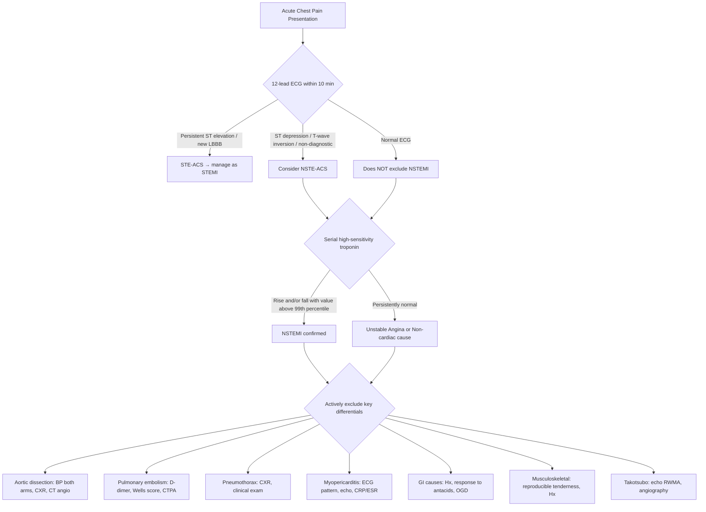

## Differential Diagnosis of NSTEMI

When a patient presents with acute chest pain and you are considering NSTEMI, your brain must simultaneously run through a structured differential diagnosis. The reason is twofold: (1) some of these mimics are equally or more lethal than NSTEMI and require entirely different treatments (e.g., giving anticoagulation for presumed NSTEMI when the patient actually has aortic dissection is catastrophic); and (2) some conditions cause troponin elevation *without* coronary plaque events (Type 2 MI, myocarditis, Takotsubo) and managing them as Type 1 MI leads to inappropriate invasive strategy.

### Organising Framework

The best way to think about the differential is by organ system and then by acuity/severity. The lecture slides provide an excellent table that we will use as our backbone [1][3].

***Differential diagnoses of acute coronary syndromes in the setting of acute chest pain*** [1]:

| ***Cardiac*** | ***Pulmonary*** | ***Vascular*** | ***Gastrointestinal*** | ***Orthopaedic*** | ***Other*** |
|---|---|---|---|---|---|
| ***Myopericarditis*** | ***Pulmonary embolism*** | ***Aortic dissection*** | ***Oesophagitis, reflux, or spasm*** | ***Musculoskeletal disorders*** | ***Anxiety disorders*** |
| ***Cardiomyopathies*** | ***(Tension) pneumothorax*** | ***Symptomatic aortic aneurysm*** | ***Peptic ulcer, gastritis*** | ***Chest trauma*** | ***Herpes zoster*** |
| ***Tachyarrhythmias*** | ***Bronchitis, pneumonia*** | ***Stroke*** | ***Pancreatitis*** | ***Muscle injury/inflammation*** | ***Anaemia*** |
| ***Acute heart failure*** | ***Pleuritis*** | | ***Cholecystitis*** | ***Costochondritis*** | |
| ***Hypertensive emergencies*** | | | | ***Cervical spine pathologies*** | |
| ***Aortic valve stenosis*** | | | | | |
| ***Takotsubo syndrome*** | | | | | |

***Relative frequency from the landmark Fruergaard et al. (1996) study, also cited on lecture slides*** [1]:
- ***Gastrointestinal 42%***
- ***Ischaemic heart disease 31%***
- ***Chest wall syndrome 28%***
- ***Pericarditis 4%***
- ***Pleuritis 2%***
- ***Pulmonary embolism 2%***
- ***Lung cancer 1.5%***
- ***Aortic aneurysm 1%***
- ***Aortic stenosis 1%***
- ***Herpes zoster 1%***

<Callout title="Exam Pearl">
In clinical practice and exams, the most important differentials to actively exclude are the "**Big 5 Killers**" of acute chest pain: **ACS (STEMI/NSTEMI), aortic dissection, pulmonary embolism, tension pneumothorax, and oesophageal rupture (Boerhaave syndrome)**. These are all life-threatening, and each requires a completely different management pathway. Missing one is potentially fatal.
</Callout>

---

### Diagnostic Approach Flow — Mermaid Diagram



---

### Detailed Differential Diagnosis — Condition by Condition

#### A. Life-Threatening Cardiovascular Differentials

##### 1. STEMI

The most important immediate distinction is STEMI vs NSTEMI, because STEMI requires **emergent reperfusion** (primary PCI or fibrinolysis) whereas NSTEMI requires risk-stratified timing [1][2][3].

| Feature | NSTEMI | STEMI |
|---|---|---|
| ECG | ***ST depression, T-wave inversion, or normal*** | ***Persistent ST elevation with reciprocal ST depression ± pathological Q waves*** [2] |
| Occlusion | Partial / non-occlusive | Complete / persistent |
| Troponin | Elevated (rise and/or fall) | Elevated (usually higher peak) |
| Urgency | Risk-stratified invasive strategy | Emergent reperfusion < 120 min (PCI) or < 12h (fibrinolysis) |

***Note that STEMI is NOT the only cause of ST elevation*** — the lecture slides specifically highlight these ***ECG pitfalls / false positives*** [3]:
- ***Benign early repolarization***
- ***LBBB***
- ***Pre-excitation***
- ***Brugada syndrome***
- ***Peri-/myocarditis***
- ***Pulmonary embolism***
- ***Subarachnoid haemorrhage***
- ***Metabolic disturbances such as hyperkalaemia***
- ***Failure to recognize normal limits for J-point displacement***
- ***Lead transposition or use of modified leads configuration***
- ***Cholecystitis***

***ECG false negatives for MI*** [3]:
- ***Prior Q waves and/or persistent ST elevation***
- ***Paced rhythm***
- ***LBBB***

<Callout title="LBBB Pitfall" type="error">
LBBB appears on both the false-positive AND false-negative lists. A new LBBB in the context of acute chest pain should be treated as STEMI-equivalent until proven otherwise, but a pre-existing LBBB makes ECG diagnosis of acute MI very difficult. Use the **Sgarbossa criteria** to help: concordant ST elevation ≥ 1 mm is most specific [2].
</Callout>

##### 2. Aortic Dissection

This is the differential you **must not miss** because giving anticoagulation + antiplatelet therapy (the standard NSTEMI treatment) to a patient with aortic dissection is potentially fatal (promotes haemorrhage into the false lumen).

| Feature | NSTEMI | Aortic Dissection |
|---|---|---|
| Pain onset | Gradual (over minutes) | ***Sudden onset, maximal at onset*** [2][6] |
| Pain quality | Crushing, squeezing | ***Tearing, ripping, "knife-like"*** [3][7] |
| Pain radiation | Arms, jaw | ***Through to back (interscapular)*** [3][7] |
| BP | Variable | ***Unequal BP between arms (> 20 mmHg)***; may be hypertensive or hypotensive |
| Pulse | Usually present | ***May have absent/unequal pulses*** (if dissection flap obstructs branch vessels) |
| CXR | Usually normal | ***Widened mediastinum, irregular/wavy aortic outline, widening of aortic silhouette*** [7] |
| ECG | ST depression / T inversion | Usually normal; ***may show STEMI if dissection involves coronary ostium*** (especially RCA → inferior ST elevation) — this is a treacherous mimic |
| Troponin | Elevated | Usually normal unless coronary involvement |
| Definitive Ix | Coronary angiography | ***CT angiography (CTA): identification of true and false lumens; compressed true lumen is the key finding; true lumen is usually smaller, false lumen is usually larger*** [7] |

Why can aortic dissection mimic NSTEMI? Because:
1. The dissection flap can extend to involve the **coronary ostia** (usually the RCA because it arises from the anterior/right aortic sinus, which is most often affected by Type A dissection) → genuine coronary malperfusion → myocardial ischaemia with troponin rise
2. The pain itself can be severe and central, mimicking angina

##### 3. Pulmonary Embolism (PE)

***PE causes acute chest pain ± dyspnoea ± haemoptysis*** [3][8]. It can mimic NSTEMI because:
- Both cause troponin elevation (PE raises troponin via RV strain/ischaemia from acute pressure overload)
- Both cause ST-T changes on ECG
- Both can present with chest pain + dyspnoea + haemodynamic compromise

| Feature | NSTEMI | PE |
|---|---|---|
| Pain quality | Crushing, central | ***Pleuritic (sharp, worse with inspiration)*** unless massive (then central/crushing) [3] |
| Associated symptoms | Diaphoresis, nausea | ***Dyspnoea (usually predominant), haemoptysis (late, with infarction)*** [8], unilateral leg swelling (DVT) |
| ECG | ST depression, T inversion | ***Sinus tachycardia (most common); right heart strain pattern: S1Q3T3, RBBB, T inversion V1–V4, RAD*** [5] |
| Troponin | Elevated (Type 1 MI) | May be mildly elevated (RV strain — this is a Type 2 mechanism) |
| D-dimer | Non-specific | Elevated (sensitive but not specific) |
| Risk factors | CAD risk factors | ***Virchow's triad: stasis, endothelial injury, hypercoagulability*** (recent surgery, immobilization, malignancy, OCP, prior VTE) |
| Definitive Ix | Coronary angiography | CTPA |

Why does PE cause troponin elevation? Acute massive PE → sudden ↑RV afterload → RV dilatation and wall stress → RV subendocardial ischaemia (the RV coronary perfusion is compromised when RV wall tension exceeds coronary perfusion pressure) → troponin leak. This is a Type 2 MI mechanism and does NOT warrant antiplatelet/anticoagulant therapy as for ACS — it requires PE-specific treatment (therapeutic anticoagulation, ± thrombolysis if massive).

##### 4. Tension Pneumothorax

Typically presents with ***sudden onset*** pleuritic chest pain + dyspnoea. In tension pneumothorax, there is progressive cardiovascular collapse (tachycardia, hypotension, ↑JVP, tracheal deviation). The key distinguishing feature is **unilateral absent breath sounds + hyperresonance** — these are absent in NSTEMI. CXR confirms.

---

#### B. Cardiac Non-ACS Differentials

##### 5. Myopericarditis

***Acute pericarditis*** is a classic mimic of ACS [1][3].

| Feature | NSTEMI | Acute Pericarditis |
|---|---|---|
| Pain quality | Crushing, pressure | ***Sharp, knife-like*** [3] |
| Positional change | Unrelated to position | ***Worse lying flat, better sitting forward/leaning forward*** |
| Respiratory variation | Minimal | ***Aggravated by respiratory movement*** [3] |
| Radiation | Arms, jaw | ***Trapezius ridge (characteristic and almost pathognomonic for pericardial pain)*** [3] |
| P/E | ± S3/S4 | ***Pericardial friction rub*** (scratchy, 3-component, best heard with patient leaning forward) |
| ECG | ST depression, T inversion | ***Diffuse concave ST elevation (saddle-shaped), PR depression (> 0.5–0.8 mm), never reciprocal ST depression in opposite leads, never in aVR, J/T > 25% in V6, shorter QTc*** [2] |
| Troponin | Elevated | May be mildly elevated if myocarditis component (myopericarditis); but troponin rise is usually modest |
| Inflammatory markers | Usually normal | ↑CRP, ↑ESR |

Why does pericarditis cause ST elevation? The inflamed pericardium (visceral layer, which is actually epicardium) creates an injury current across the entire epicardial surface → diffuse (not territorial) ST elevation. Because it is diffuse and concave ("smiley face"), it differs from the convex, territorial ST elevation of STEMI.

##### 6. Takotsubo Syndrome (Stress Cardiomyopathy)

***Takotsubo syndrome*** is specifically listed as a cardiac differential [1]. It mimics NSTEMI closely:
- Chest pain + troponin elevation + ECG changes (may show ST elevation, T-wave inversion, or QT prolongation)
- Regional wall motion abnormalities on echo (classically apical ballooning with basal hyperkinesis)
- But **coronary angiography shows no obstructive CAD**

Why does it happen? Catecholamine surge (from emotional or physical stress) → direct catecholamine toxicity to myocytes (especially apical, which has highest density of β-adrenergic receptors) + microvascular spasm → transient stunning. Typically in postmenopausal women.

##### 7. Tachyarrhythmias

***Tachyarrhythmias*** (e.g., SVT, AF with rapid ventricular rate, VT) can cause chest pain and troponin elevation (Type 2 MI) via increased O₂ demand and decreased diastolic filling time (↓coronary perfusion) [1]. The key is that the arrhythmia is the primary event — treating the arrhythmia resolves the ischaemia.

##### 8. Acute Heart Failure / Hypertensive Emergency

***Acute heart failure*** and ***hypertensive emergencies*** can cause troponin elevation through supply-demand mismatch (↑wall stress → ↑O₂ demand; ↓coronary perfusion from ↑LVEDP) [1]. Again, this is Type 2 MI. Flash pulmonary oedema with severely elevated BP points toward hypertensive emergency rather than primary ACS, although the two can coexist.

##### 9. Aortic Valve Stenosis

***Aortic valve stenosis*** causes anginal chest pain because LVH from chronic pressure overload → ↑O₂ demand + ↓coronary flow reserve (subendocardial compression) [1][2]. Troponin may be mildly elevated. The key is the classic murmur: harsh crescendo-decrescendo systolic murmur at right upper sternal border radiating to carotids.

---

#### C. Pulmonary Differentials

##### 10. Pneumonia / Bronchitis / Pleuritis

***Pneumonia*** and ***pleuritis*** cause pleuritic chest pain (sharp, worse with inspiration/cough) + respiratory symptoms (productive cough, fever, dyspnoea) [1][2][6]. CXR shows consolidation. There is no troponin elevation (unless pneumonia triggers Type 2 MI via sepsis/tachycardia/hypoxia).

---

#### D. Gastrointestinal Differentials

***Gastrointestinal causes are actually the most common cause of chest pain overall (42% in the Fruergaard study)*** [1].

##### 11. Oesophageal Causes (GERD, Oesophageal Spasm)

***Oesophagitis, reflux, or oesophageal spasm*** is the most common GI mimic of angina [1][2][6]. Why is it so confusing?
- The oesophagus lies immediately posterior to the heart — both share visceral afferents entering the same spinal cord segments (T1–T5)
- Oesophageal spasm can cause retrosternal squeezing pain that even **responds to GTN** (GTN relaxes oesophageal smooth muscle too!)
- Key distinguishing features: relationship to meals, postural component (worse lying down), burning quality, response to antacids/PPIs, absence of ECG changes

##### 12. Peptic Ulcer / Gastritis

***Peptic ulcer and gastritis*** — epigastric pain that may be confused with inferior MI (which can present as epigastric discomfort). Look for relationship to meals, NSAID/alcohol use, Helicobacter pylori history.

##### 13. Pancreatitis

***Pancreatitis*** causes severe epigastric pain radiating to the back — can mimic inferior MI. Key: ↑↑amylase/lipase, risk factors (gallstones, alcohol).

##### 14. Cholecystitis

***Cholecystitis*** — RUQ pain radiating to right shoulder (diaphragmatic irritation), Murphy's sign positive. Interestingly, ***cholecystitis can cause ST-T changes on ECG*** (via vagal reflexes or shared splanchnic innervation), which is why it appears on the false-positive list for ST elevation [3].

---

#### E. Musculoskeletal Differentials

##### 15. Musculoskeletal Chest Wall Pain / Costochondritis

***Musculoskeletal disorders, chest trauma, muscle injury/inflammation, costochondritis*** [1][2][6]. The hallmark is **reproducible tenderness on palpation**. Pain is often sharp, worsened by movement or palpation, and localized (can point to it with one finger). ***Pain typically occurs after exertion, not during*** (unlike angina which occurs during exertion) [2]. ECG and troponin are normal.

**Costochondritis** (Tietze syndrome if with swelling) — inflammation of the costochondral junctions, typically at 2nd–5th costochondral joints. Tender on palpation.

---

#### F. Other Differentials

##### 16. Herpes Zoster

***Herpes zoster*** — dermatomal pain (burning, sharp) that may precede the rash by 48–72 hours. If thoracic dermatome T1–T6, can mimic cardiac pain. Once the vesicular rash appears, diagnosis is clear [1].

##### 17. Anxiety / Panic Attack

***Anxiety disorders*** — chest tightness, palpitations, hyperventilation, paraesthesias, sense of doom. Diagnosis of exclusion in the acute setting — **never dismiss chest pain as anxiety without first excluding life-threatening causes**. Young patient without risk factors, normal ECG, normal troponin, with clear psychological stressor.

##### 18. Anaemia

***Anaemia*** listed as "Other" on the differential table [1]. Severe anaemia (↓O₂ carrying capacity) can cause chest pain via supply-demand mismatch, especially in patients with underlying CAD. This is a Type 2 MI mechanism. Check Hb — conjunctival pallor, tachycardia, flow murmur on auscultation.

---

### Troponin Elevation Without ACS — Important Concept

Not all troponin elevations mean ACS. The following conditions cause troponin rise through non-ACS mechanisms:

| Condition | Mechanism of Troponin Rise |
|---|---|
| Myocarditis | Direct myocyte injury from inflammation |
| Takotsubo | Catecholamine-mediated myocyte injury |
| PE (massive) | RV strain → subendocardial ischaemia |
| Aortic dissection (with coronary involvement) | Coronary malperfusion |
| Sepsis / Critical illness | Supply-demand mismatch, direct myocyte injury |
| Renal failure | ↓Clearance of troponin + chronic myocardial injury |
| Tachyarrhythmias | ↑O₂ demand, ↓diastolic perfusion time |
| Heart failure (acute/chronic) | ↑Wall stress → subendocardial ischaemia |
| Cardiac contusion (trauma) | Direct mechanical myocyte damage |
| Post-cardiac procedures (PCI, CABG, ablation) | Iatrogenic myocyte injury (Type 4/5 MI) |

<Callout title="Clinical Decision Point" type="idea">
When you see elevated troponin, always ask: **Is this a Type 1 MI (plaque event) or something else?** The answer determines everything — Type 1 MI needs DAPT + anticoagulation + invasive strategy. Type 2 MI needs treatment of the underlying cause. Non-ischaemic troponin elevation (myocarditis, Takotsubo, CKD) needs specific management. The clinical context, ECG pattern, and echo findings help you differentiate.
</Callout>

---

### Summary Table: Key Distinguishing Features

| Condition | Pain Character | ECG | Troponin | Key Distinguishing Feature |
|---|---|---|---|---|
| **NSTEMI** | Crushing, central, > 20 min | ST depression / T inversion / normal | Elevated (rise/fall) | Risk factors, typical anginal features |
| **STEMI** | Similar but often more severe | ***Persistent ST elevation + reciprocal changes*** | Elevated (higher peak) | ECG is definitive |
| **Aortic dissection** | ***Tearing, maximal at onset, radiates to back*** | Usually normal (or inferior STEMI if RCA involved) | Usually normal | ***Unequal arm BP, widened mediastinum on CXR*** |
| **PE** | Pleuritic ± central if massive | ***Sinus tachycardia, S1Q3T3, RBBB, T inv V1–4*** | Mild elevation (RV strain) | Dyspnoea predominant, DVT signs, D-dimer, CTPA |
| **Pericarditis** | ***Sharp, positional, ↑inspiration, → trapezius*** | ***Diffuse concave ST elevation + PR depression*** | ± mild elevation | Pericardial rub, ↑CRP/ESR |
| **Takotsubo** | Anginal, post-stress | ST elevation/T inversion/QTc prolongation | Elevated (modest) | Apical ballooning on echo, normal coronaries |
| **GERD/oesophageal spasm** | Burning, retrosternal, postprandial | Normal | Normal | Response to PPI/antacids, relation to meals |
| **Musculoskeletal** | Sharp, localized, reproducible on palpation | Normal | Normal | Tender on palpation, worsened by movement |
| **Pneumothorax** | Sudden, pleuritic, unilateral | May show low voltage | Normal | Absent breath sounds, hyperresonance, CXR |

---

### Working Through the Differential — The Clinical Thought Process

***The lecture slides present a systematic framework for working diagnosis at admission*** [3]:

```
Admission → Working Suspicion of ACS → ECG:
  - Persistent ST elevation → STEMI
  - ST/T abnormalities + Troponin positive → NSTEMI
  - ST/T abnormalities + Troponin negative → Unstable Angina
  - Normal / undetermined ECG → need serial troponin and clinical reassessment
```

***The key triage algorithm from the hs-troponin slides*** [1]:
- ***Stable patients: 12-lead ECG → if no ST elevation → blood sampling at 0h and 1h***
- ***0h hs-cTn very low and no chest pain → Rule-out MI → consider differential diagnosis → possible outpatient management***
- ***0h hs-cTn low and no 1h change → Rule-out → observation***
- ***Relevant 1h change or high 0h value → Rule-in → CCU + angiography***
- ***All others → observe → 3h hs-cTn + echocardiography***

<Callout title="High Yield Summary — Differential Diagnosis of NSTEMI">

**Must-exclude life-threatening mimics**: Aortic dissection (tearing, back, unequal BP), PE (pleuritic, dyspnoea, D-dimer/CTPA), tension pneumothorax (absent breath sounds), oesophageal rupture.

**Must-exclude cardiac mimics**: STEMI (persistent ST elevation), pericarditis (sharp, positional, diffuse concave ST elevation + PR depression, rub), Takotsubo (post-stress, apical ballooning, normal coronaries).

**Common non-cardiac causes**: GERD (most common overall), musculoskeletal (reproducible tenderness), anxiety.

**Always distinguish Type 1 MI from Type 2 MI**: Type 1 = plaque event → DAPT + anticoagulation + invasive. Type 2 = supply-demand mismatch → treat the cause.

**Troponin is not ACS-specific**: myocarditis, PE, Takotsubo, sepsis, CKD, tachyarrhythmias all raise troponin without coronary plaque events.

</Callout>

---

<ActiveRecallQuiz
  title="Active Recall - Differential Diagnosis of NSTEMI"
  items={[
    {
      question: "Name the 'Big 5' life-threatening causes of acute chest pain that must be excluded in every patient presenting with suspected ACS.",
      markscheme: "ACS (STEMI/NSTEMI), aortic dissection, pulmonary embolism, tension pneumothorax, oesophageal rupture (Boerhaave syndrome). Each requires a completely different management pathway.",
    },
    {
      question: "A patient presents with sudden-onset tearing chest pain radiating to the back with unequal arm blood pressures. You suspect aortic dissection. Why is it critical to diagnose this before initiating standard NSTEMI treatment?",
      markscheme: "Standard NSTEMI treatment includes dual antiplatelet therapy and anticoagulation (heparin). In aortic dissection, these promote haemorrhage into the false lumen and can cause fatal aortic rupture or extension of the dissection. Also, aortic dissection involving the RCA ostium can cause inferior STEMI, making it a treacherous mimic. Definitive diagnosis is by CT angiography showing true and false lumens.",
    },
    {
      question: "How does the ECG pattern of acute pericarditis differ from STEMI?",
      markscheme: "Pericarditis: diffuse concave (saddle-shaped) ST elevation, PR depression, no reciprocal ST depression, J/T ratio greater than 25% in V6, shorter QTc. STEMI: localized convex ST elevation in a coronary territory with reciprocal ST depression in opposite leads, and progressive evolution (hyperacute T waves then ST elevation then Q waves then T inversion).",
    },
    {
      question: "List four non-ACS conditions that can cause troponin elevation and explain the mechanism for one of them.",
      markscheme: "Myocarditis (direct inflammatory myocyte injury), PE (RV strain causing subendocardial ischaemia from elevated RV wall tension exceeding coronary perfusion pressure), Takotsubo (catecholamine-mediated myocyte toxicity), renal failure (decreased clearance plus chronic low-grade myocardial injury), sepsis (supply-demand mismatch plus direct cytokine-mediated injury), tachyarrhythmias (increased O2 demand plus decreased diastolic filling). Any four with one mechanism explained.",
    },
    {
      question: "Why can oesophageal spasm mimic angina so convincingly, and how do you distinguish them?",
      markscheme: "Oesophagus lies immediately posterior to the heart; both share visceral afferents entering spinal cord segments T1-T5, so referred pain patterns overlap. Oesophageal spasm can even respond to GTN (which relaxes oesophageal smooth muscle). Distinguish by: relationship to meals, postural worsening (lying down), burning quality, response to antacids/PPI, absence of ECG changes, and normal troponin.",
    },
    {
      question: "A patient is admitted with chest pain. The 12-lead ECG shows sinus tachycardia with S1Q3T3 pattern and T-wave inversion in V1-V4. Troponin is mildly elevated. What is the most likely diagnosis and why is the troponin elevated?",
      markscheme: "Most likely pulmonary embolism. ECG shows right heart strain pattern. Troponin is elevated because acute massive PE causes sudden increase in RV afterload, leading to RV dilatation and increased wall stress. When RV wall tension exceeds coronary perfusion pressure, the RV subendocardium becomes ischaemic, causing troponin leak. This is a Type 2 MI mechanism. Treatment is therapeutic anticoagulation for PE, not DAPT.",
    },
  ]}
/>

## References

[1] Lecture slides: GC 028. Accelerating chest pain_Acute coronary (1).pdf (pp. 15–17, 27)
[2] Senior notes: Ryan Ho Cardiology.pdf (Sections 2.1, 3.2.2 ACS, pp. 54, 128–129)
[3] Lecture slides: GC 088. Sudden Severe Chest Pain.pdf (pp. 13, 26, 30, 57)
[5] Senior notes: Ryan Ho Critical Care.pdf (p. 17)
[6] Senior notes: Ryan Ho Fundamentals.pdf (pp. 199, 203)
[7] Senior notes: felixlai.md (Section on Aortic Dissection differential diagnosis and CTA findings)
[8] Senior notes: Ryan Ho Haemtology.pdf (p. 131, VTE spectrum)
