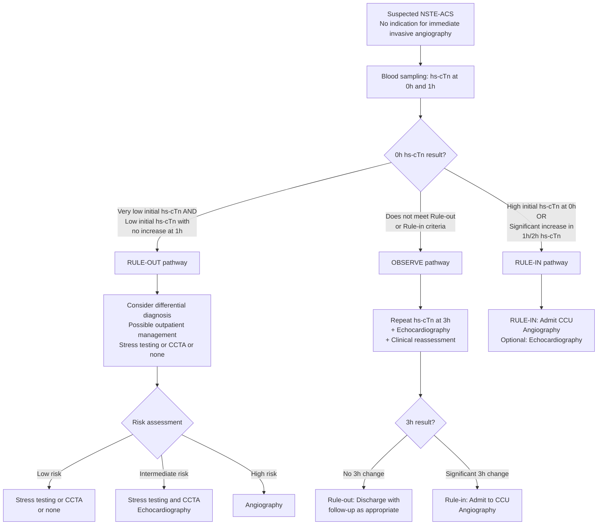

## Diagnostic Criteria for NSTEMI

### The 4th Universal Definition of Myocardial Infarction (2018 ESC/ACC/AHA/WHF)

The diagnosis of NSTEMI rests on a precise set of criteria. Let's build this from first principles — you need **evidence of myocardial necrosis** (troponin) in the **context of myocardial ischaemia** (clinical, ECG, or imaging evidence), and critically, the ECG must **not** show persistent ST elevation (which would make it STEMI instead).

***Detection of a rise and/or fall of cardiac biomarker values (preferably cardiac troponin, cTn) with at least one value above the 99th percentile upper reference limit (URL)*** [2][3]:

**Plus at least one of:**

| Criterion | What It Means | Why It's Needed |
|---|---|---|
| ***1. Symptoms of ischaemia*** | Chest pain/discomfort with typical anginal features, or anginal equivalents (dyspnoea in diabetics/elderly) | Clinical evidence that the troponin rise is ischaemic in origin, not from another cause (e.g., sepsis, PE) |
| ***2. New or presumed new significant ST-T changes or new LBBB*** | ST depression ≥ 0.5 mm, T-wave inversion ≥ 1 mm in ≥ 2 contiguous leads, or new LBBB | ECG evidence of ischaemia/injury; for NSTEMI specifically, there must NOT be persistent ST elevation |
| ***3. Development of pathological Q waves*** | Q wave ≥ 30 ms wide and ≥ 1 mm deep in ≥ 2 contiguous leads (or QS in V2–V3) | Indicates established necrosis (usually appears later — implies completed infarction) |
| ***4. Imaging evidence of new loss of viable myocardium or new regional wall motion abnormality (RWMA)*** | New akinesis/hypokinesis on echo or cardiac MRI in a coronary territory distribution | Structural evidence that myocardium has been damaged |
| ***5. Identification of an intracoronary thrombus by angiography or post-mortem*** | Direct visualization of thrombus at coronary angiography or autopsy | Pathological confirmation of the mechanism (plaque event + thrombosis) |

<Callout title="The Key Distinguishing Point: NSTEMI vs STEMI">
Both NSTEMI and STEMI satisfy the universal definition of MI. The distinction is made on ECG: **STEMI has persistent ST elevation** (or new LBBB) meeting specific voltage criteria, while **NSTEMI does not**. This distinction is made at the point of first ECG because it determines the urgency of reperfusion — STEMI needs emergent PCI/fibrinolysis, NSTEMI needs risk-stratified timing.
</Callout>

### The Troponin Criterion — Understanding "Rise and/or Fall"

This is crucial and often misunderstood. A single elevated troponin is **not sufficient** to diagnose acute MI — you need a **dynamic pattern** (rise and/or fall), because:

- **Chronic troponin elevation** (e.g., in CKD, stable HF) is usually stable — no dynamic change → this represents chronic myocardial injury, NOT acute MI
- **Acute MI** causes sudden myocyte death → troponin is released acutely → the value rises from baseline, peaks, then falls as troponin is cleared

***The lecture slides illustrate the timing of biomarker release*** [1]:
- ***Rising cTn values from below to > 99th percentile*** → acute MI
- ***Detectable cTn values > 99th percentile with a delta (change)*** → acute MI
- ***cTn values > 99th percentile but declining delta or no significant change*** → chronic myocardial injury (e.g., CKD, stable HF)

### MI Type Classification (Recap — Applied to Diagnosis)

***The 3rd/4th Universal Definition classifies MI into types that guide the diagnostic workup and management*** [2]:

| Type | Description | Diagnostic Criteria |
|---|---|---|
| ***Type 1*** | ***Spontaneous MI due to primary coronary event (plaque erosion/rupture, fissuring, or dissection)*** | Standard criteria above |
| ***Type 2*** | ***MI secondary to ischaemia due to imbalance between O₂ demand and supply (coronary spasm, anaemia, hypotension)*** | Standard criteria above, but the clinical context identifies a precipitant other than plaque rupture |
| ***Type 3*** | ***Sudden cardiac death*** | ***Symptoms of ischaemia + new ischaemic ECG changes or LBBB; but death occurring before blood samples could be obtained or before appearance of biomarkers in blood*** |
| ***Type 4a*** | ***MI associated with PCI*** | ***↑cTn > 5 × 99th URL (if normal baseline); or ↑cTn > 20% (if baseline elevated and stable)*** + symptoms/ECG/angiographic/imaging criteria |
| ***Type 4b*** | ***MI associated with verified stent thrombosis*** | ***Verified stent thrombosis in coronary angiography or autopsy + rise/fall of cTn with ≥ 1 value above 99th URL*** |
| ***Type 5*** | ***MI associated with CABG*** | ***↑cTn > 10 × 99th URL (if normal baseline cTn)*** + new pathological Q/LBBB or angiographic new graft/native artery occlusion or imaging evidence |

***Criteria for prior (old) MI*** [3]:
- ***Development of new pathological Q waves with or without symptoms***
- ***Imaging evidence of a region of loss of viable myocardium that is thinned and fails to contract, in the absence of a non-ischaemic cause***
- ***Pathological findings post-mortem of a healed or healing myocardial infarction***

---

## Diagnostic Algorithm

### The ESC 0h/1h (or 0h/2h) High-Sensitivity Troponin Algorithm

This is the cornerstone of modern NSTEMI diagnosis and was heavily emphasised on the lecture slides [1]. The algorithm uses **high-sensitivity cardiac troponin (hs-cTn)** — assays that can detect troponin concentrations 10–100× lower than conventional assays — to rapidly triage patients into three pathways.

***The algorithm applies to patients presenting with suspected NSTE-ACS who do NOT have an indication for immediate invasive angiography*** [1].

***Key thresholds for the 0h/1h algorithm (assay-specific — values differ between manufacturers)*** [1]:

| Pathway | hs-cTnT (Roche Elecsys) | hs-cTnI (Abbott ARCHITECT) | What to Do |
|---|---|---|---|
| ***Rule-out*** | ***0h < 5 ng/L AND no significant 1h change*** | ***0h < 2 ng/L AND 1h delta < 2 ng/L*** | ***Consider differential diagnosis; possible outpatient management*** |
| ***Observe*** | Does not meet either | Does not meet either | ***Repeat at 3h + echo + clinical reassessment*** |
| ***Rule-in*** | ***0h ≥ 52 ng/L OR 1h delta ≥ 5 ng/L*** | ***0h ≥ 64 ng/L OR 1h delta ≥ 6 ng/L*** | ***Admit CCU + angiography*** |

<Callout title="Why 0h/1h and Not Just One Measurement?">
A single troponin at presentation may be falsely low if the patient presents very early (troponin has not had time to rise) or may be chronically elevated (CKD, HF). The **delta** (change between 0h and 1h/2h) captures the dynamic rise that indicates acute myocyte death. A patient with hs-cTnT of 20 ng/L at 0h and 45 ng/L at 1h has a significant rise — this is acute MI. A patient with 20 ng/L at both time points likely has chronic elevation — this is NOT acute MI.
</Callout>

<Callout title="Exam High Yield: Very Low hs-cTn at 0h" type="idea">
If the 0h hs-cTn is very low (below the limit of detection or assay-specific cut-off) AND the patient has been symptomatic for > 3 hours, the NPV for MI is > 99%. These patients can often be safely discharged with outpatient follow-up. But if symptom onset was < 1–2 hours ago, a very low 0h value does NOT rule out MI — you must wait for the 1h sample.
</Callout>

### Immediate Invasive Strategy — When the Algorithm Doesn't Apply

***Certain patients bypass the troponin algorithm entirely and go straight to the cath lab (< 2 hours)*** [1][9]:

***Very high risk criteria (immediate invasive strategy)*** [1][9]:
- ***Haemodynamic instability or cardiogenic shock***
- ***Acute heart failure presumed secondary to ongoing myocardial ischaemia***
- ***Life-threatening arrhythmias or cardiac arrest after presentation***
- ***Mechanical complications***
- ***Recurrent dynamic ECG changes suggestive of ischaemia***

### Risk Stratification: GRACE Score

***After NSTEMI is confirmed, the GRACE risk score determines the timing of the invasive strategy*** [1][9]:

***Risk Calculator for 6-Month Post-discharge Mortality*** [1]:

| Variable | Points |
|---|---|
| ***Age*** | 0 (< 30) to 100 (≥ 90) |
| ***Resting heart rate*** | 0 (< 50) to 46 (≥ 200) |
| ***Systolic blood pressure*** | 0 (≥ 200) to 58 (< 80) — note inverse relationship |
| ***Serum creatinine*** | 1 (0–0.39) to 28 (≥ 4) |
| ***History of CHF*** | 24 |
| ***History of MI*** | 12 |
| ***Elevated cardiac biomarkers*** | 15 |
| ***No in-hospital PCI*** | 14 |
| ***ST-segment depression*** | 11 |
| ***Killip class*** | Included in scoring |

***Timing of invasive strategy based on GRACE score*** [1][9]:

| Risk | GRACE Score | Strategy |
|---|---|---|
| ***Very high risk*** | Clinical criteria above | ***Immediate (< 2h)*** |
| ***High risk*** | ***> 140 or confirmed NSTEMI diagnosis based on ESC algorithms, or transient ST elevation, or dynamic ST/T changes*** | ***Early/inpatient transfer (< 24h)*** |
| ***Intermediate*** | 109–140 | ***Invasive within 72h*** |
| ***Low risk*** | ***Patients without very-high or high-risk features and a low index of suspicion for unstable angina*** | ***Selective invasive: determine (if required) risk and therapeutic strategy*** |

---

## Investigation Modalities — Detailed Interpretation

### A. Electrocardiography (ECG)

***Perform 12-lead ECG as soon as possible*** — ideally ***within 10 minutes of first medical contact*** [1][2][6].

#### Why ECG First?
The ECG is the single most important initial investigation because it immediately dichotomises the patient into STE-ACS vs NSTE-ACS, which determines the entire management pathway. It is cheap, fast, non-invasive, and available everywhere.

#### ECG Findings in NSTEMI

***NSTE-ACS ECG features*** [2]:
- ***ST depression***
- ***T-wave changes (inversion or flattening)***
- ***± some loss of R waves (if infarcted)***

Let's understand each finding from first principles:

| ECG Finding | Pathophysiological Basis | Specifics |
|---|---|---|
| ***ST depression*** | Subendocardial injury current directed from epicardium toward endocardium (away from surface electrode) → negative deflection in the ST segment | ≥ 0.5 mm (0.05 mV) in ≥ 2 contiguous leads is significant; horizontal or downsloping is more specific than upsloping |
| ***T-wave inversion*** | Altered repolarization sequence from ischaemic myocardium — ischaemic cells repolarize earlier (shortened APD) → repolarization wave reverses direction | ≥ 1 mm in ≥ 2 contiguous leads with prominent R wave |
| ***Normal ECG*** | Small area of ischaemia, or territory poorly represented on standard 12-lead (e.g., posterior wall/LCx) | ***Up to 30–40% of NSTEMI patients may have a non-diagnostic initial ECG*** — this is why serial ECGs are essential |
| ***Transient ST elevation*** | Intermittent complete occlusion that self-resolves (e.g., cyclic thrombus formation and lysis, or vasospasm on top of partial occlusion) | If captured, indicates very high risk — treat as immediate invasive |

***Special ECG patterns to recognise*** [2]:

- ***Wellens syndrome: deeply inverted or biphasic T waves in V2–V3 → highly specific for critical LAD stenosis → extremely high risk for extensive anterior wall MI in the subsequent days/weeks*** [2]
- ***ST elevation in aVR with widespread ST depression (most prominent in leads I, II, V4–6): usually indicates left main stem occlusion*** [2]
- ***Pseudonormalization of T wave: transient normalization of T wave from an inverted form → indicates transient recanalization of coronary artery → prone to restenosis*** [2]

***ECG pitfalls — false positives for ST elevation (i.e., NOT STEMI)*** [3]:
- ***Benign early repolarization, LBBB, pre-excitation, Brugada syndrome, peri-/myocarditis, pulmonary embolism, subarachnoid haemorrhage, hyperkalaemia, cholecystitis, lead transposition***

***ECG pitfalls — false negatives (may miss MI)*** [3]:
- ***Prior Q waves and/or persistent ST elevation, paced rhythm, LBBB***

***Serial ECGs: 12-lead ECG stat and repeat at least daily × 3 days (more frequently in severe cases)*** [2][6]. The rationale is that the initial ECG may be normal or non-diagnostic, and ischaemic changes may evolve over hours.

#### Additional Leads

When standard 12-lead ECG is non-diagnostic but clinical suspicion remains high:
- **Posterior leads (V7–V9)**: for posterior wall MI (LCx or RCA territory) — ST elevation ≥ 0.5 mm
- **Right-sided leads (V3R–V6R)**: for RV infarction complicating inferior MI — ST elevation ≥ 1 mm in V4R

### B. Cardiac Biomarkers

#### High-Sensitivity Cardiac Troponin (hs-cTn) — The Gold Standard

***Cardiac enzymes: cTnT, cTnI, CK-MB*** [7] — but in modern practice, **hs-cTn has replaced CK-MB** as the primary biomarker.

| Biomarker | Rises | Peaks | Normalises | Key Points |
|---|---|---|---|---|
| **hs-cTnT / hs-cTnI** | 1–3 hours | 12–24 hours | 5–14 days | ***Gold standard***; most sensitive and specific for myocardial necrosis; enables 0h/1h rule-in/rule-out algorithm |
| **CK-MB** | 3–4 hours | 12–24 hours | 48–72 hours | Less sensitive/specific than troponin; historically used but now mainly for detecting **reinfarction** (because it normalises faster — a second rise indicates new event) |
| **Myoglobin** | 1–2 hours | 6–8 hours | 24 hours | Very early marker but NOT cardiac-specific (also from skeletal muscle); now largely obsolete |

Why is troponin so specific for myocardial injury?
- Troponin I and T are structural proteins of the cardiac sarcomere (part of the thin filament regulatory complex)
- The cardiac isoforms (cTnI and cTnT) have unique amino acid sequences not found in skeletal muscle
- When myocytes undergo necrosis, the cell membrane ruptures and troponin leaks into the bloodstream
- hs-cTn assays can detect concentrations as low as a few ng/L, enabling very early diagnosis

***Cardiac enzymes daily × 3 days (repeat troponin 6–12h later if 1st Tn is normal)*** [2][6] — this catches late presenters and slow-rising troponin curves.

#### Causes of Troponin Elevation Other Than Type 1 MI

This is critical for interpretation — an elevated troponin does NOT automatically mean "send to cath lab":

| Category | Examples |
|---|---|
| **Type 2 MI** | Tachyarrhythmia, hypotension, anaemia, respiratory failure, sepsis |
| **Acute non-ischaemic myocardial injury** | Myocarditis, Takotsubo, cardiac contusion, cardioversion, ablation, cardiotoxic drugs |
| **Chronic myocardial injury** | CKD (most common cause of chronically elevated troponin), HF, infiltrative cardiomyopathy, amyloidosis |
| **Extracardiac** | PE (RV strain), severe sepsis, burns, stroke/SAH, extreme exercise |

The key distinguishing factor is the **clinical context** + **dynamic pattern** (rise/fall vs stable).

### C. Baseline Blood Tests

***Basic bloods: CBC, L/RFT, lipid profile (≤ 24h), aPTT/INR (as baseline for heparin)*** [2][6]

| Test | Why | What to Look For |
|---|---|---|
| **CBC** | R/o anaemia (Type 2 MI trigger), assess platelet count (baseline for antiplatelet/anticoagulant safety), WBC (infection/inflammation as precipitant) | ↓Hb, ↓PLT, ↑WCC |
| **RFT (U&E, Creatinine)** | Renal function affects drug dosing (enoxaparin, fondaparinux need renal adjustment), creatinine is a GRACE score variable, CKD independently worsens prognosis | ***↑U/Cr (shock-induced AKI)*** [5]; eGFR for drug dosing |
| **LFT** | Baseline before statin; hepatic congestion from HF (↑ALT/AST); ***shock liver*** [5] | ↑transaminases |
| **Lipid profile (within 24h)** | Must be taken within 24h of admission because lipid levels fall after acute MI (acute phase response ↓LDL) and remain low for weeks; early measurement reflects true baseline | ↑LDL, ↓HDL guide secondary prevention |
| **Fasting glucose / HbA1c** | Screen for DM (a major modifiable risk factor); hyperglycaemia at presentation is an independent predictor of worse outcome even in non-diabetics | ↑glucose, ↑HbA1c |
| **aPTT / INR** | Baseline before initiating heparin; also screens for pre-existing coagulopathy | Needed for monitoring UFH therapy |
| ***ABG / VBG + lactate*** | Assess oxygenation, acid-base status; ***lactic acidosis indicates poor tissue perfusion*** [5] | ↓PaO₂, metabolic acidosis, ↑lactate (cardiogenic shock) |
| **BNP / NT-proBNP** | Assess degree of myocardial wall stress / heart failure; prognostic marker in ACS (higher BNP → worse outcome) | ↑BNP correlates with LV dysfunction severity |

### D. Chest X-Ray (CXR)

***CXR: usually non-diagnostic in ACS; look for other causes (e.g., aortic dissection, PE, pneumonia or pneumothorax)*** [2][6]

| Finding | Significance |
|---|---|
| **Normal** | Does NOT exclude NSTEMI (the heart and lungs are often normal-appearing) |
| **Pulmonary oedema** (upper lobe diversion, Kerley B lines, bilateral fluffy opacities, bat-wing pattern) | Indicates LV failure complicating MI → Killip class II–III |
| **Cardiomegaly** (CTR > 0.5) | Pre-existing cardiomyopathy, chronic HF, pericardial effusion |
| ***Widened mediastinum, irregular aortic outline*** | ***Aortic dissection*** [7] — must be actively excluded |
| Focal consolidation | Pneumonia (may be the precipitant for Type 2 MI, or an alternative diagnosis) |
| Absent lung markings with visible pleural line | Pneumothorax |

### E. Echocardiography

Echocardiography is ***the key bedside imaging tool*** in NSTEMI. It is recommended:
- At presentation if diagnosis is uncertain (RWMA supports ischaemic aetiology)
- In all patients to assess LV function (LVEF is the ***strongest predictor of long-term survival*** [2])
- To detect mechanical complications

| Finding | Significance |
|---|---|
| ***Regional wall motion abnormality (RWMA)*** — hypokinesis, akinesis, or dyskinesis in a coronary territory distribution | Supports diagnosis of MI; territory identifies culprit vessel (e.g., anterior akinesis → LAD) |
| ***LVEF assessment*** | ***LVEF < 50% associated with significantly increased event risk regardless of severity of ischaemia*** [2]; guides need for HF therapy and ICD consideration |
| **Valvular assessment** | New MR (papillary muscle dysfunction/rupture), assess pre-existing AS/AR |
| **Mechanical complications** | VSD (colour Doppler shows shunt), free wall rupture (pericardial effusion/tamponade), LV aneurysm/pseudoaneurysm |
| **RV function** | RV infarction (RV dilatation, ↓TAPSE) in inferior MI |
| **Pericardial effusion** | May indicate post-MI pericarditis, LV free wall rupture, or aortic dissection (if root involved) [7] |
| **Normal echo** | Does NOT exclude NSTEMI (small subendocardial infarcts may not produce detectable RWMA) |

***Echocardiography is also mentioned in the hs-cTn algorithm observation pathway: 3h hs-cTn + echocardiography*** [1].

### F. Coronary Angiography (Invasive)

***Coronary angiography is the definitive investigation*** — it directly visualises the coronary anatomy and identifies the culprit lesion [1][2].

***In patients with NSTE-ACS, the lecture slides presented a meta-analysis of early vs delayed invasive strategy*** [1]:
- ***Meta-analysis of 17 randomised trials showed no significant difference in all-cause mortality (OR 0.90, 0.78–1.04), but trends toward benefit in high-risk subgroups***
- ***This is why risk stratification (GRACE score) determines timing rather than a blanket "all patients get immediate angiography"***

***Findings at angiography*** [1]:

| Finding | Interpretation |
|---|---|
| ***Significant stenosis (≥ 70%, or ≥ 50% for LMS)*** | Culprit lesion identified; revascularization considered |
| ***Ambiguous/hazy lesion, calcification, tortuosity/eccentricity*** | ***May require further intravascular imaging*** |
| Normal or near-normal coronaries (≤ 50% stenosis) | ***MINOCA (MI with no obstructive coronary atherosclerosis)*** — 1–14% of all MIs [2] |

***Adjunctive intravascular imaging*** [1]:
- ***IVUS (intravascular ultrasound) or OCT (optical coherence tomography) imaging findings***
- ***Can differentiate: Erosion vs Nodule vs Rupture*** — this is important because plaque erosion may be managed differently from plaque rupture
- Helps when the angiographic appearance is ambiguous

***Vessel disease burden guides management*** [2]:
- 1VD: usually PCI
- 2VD or 3VD: Heart Team discussion (PCI vs CABG)
- LMS disease: usually CABG (highest mortality if untreated)

### G. Non-Invasive Cardiac Imaging (Before or After Angiography)

These are used either for risk stratification in lower-risk patients ruled out for acute MI, or for further workup of MINOCA.

#### Coronary CT Angiography (CCTA)

***Referenced in the hs-cTn algorithm for low-intermediate risk patients in the rule-out pathway*** [1].

| Feature | Details |
|---|---|
| Role | Non-invasive alternative to invasive coronary angiography; excellent ***NPV (99–100%)*** for excluding significant CAD [2] |
| Best for | ***Low-intermediate pre-test probability (PTP 15–50%)*** [2]; younger patients |
| Significant stenosis | ***≥ 70% stenosis (≥ 50% for LMS)*** [2] |
| Limitations | ***Severe obesity, CKD (contrast nephropathy), prior CABG, prior stenting (metal artefact), Agatston calcium score > 400 (↓specificity)*** [2] |
| Calcium scoring | ***Agatston score > 100 generally correlated with significant risk of CAD; zero calcium score cannot rule out stenosis in symptomatic individuals*** [2] |

#### Stress Testing (Functional Imaging)

Used for patients in whom acute MI has been ruled out but CAD is still suspected, or for risk stratification post-NSTEMI before discharge.

| Modality | Principle | Best For |
|---|---|---|
| ***Exercise tolerance test (ETT)*** | Exercise → ↑HR → ↑myocardial O₂ demand → unmask ischaemia on ECG; ***+ve test = horizontal or downsloping ST depression ≥ 0.1 mV (1 mm) 80 ms after J point*** [2] | ***Low-intermediate PTP, normal baseline ECG, not on anti-ischaemic drugs*** [2] |
| **Stress echocardiography** | Exercise or dobutamine stress → new RWMA indicates inducible ischaemia | When ETT is non-diagnostic or baseline ECG abnormal |
| ***Myocardial perfusion imaging (MPI / SPECT)*** | ***Coronary steal phenomenon: with stress, vessels supplying normal myocardium dilate → blood siphoned away from stenosed territory → appears as "cold spots"*** [10]; ***ischaemia = cold spots with stress only; infarct = cold spots at rest + stress*** | When ETT is non-diagnostic; also assesses myocardial viability |
| **Cardiac MRI** | Assess RWMA, oedema (T2-weighted), late gadolinium enhancement (fibrosis/scar vs viable myocardium) | ***MINOCA workup*** (distinguishes MI from myocarditis/Takotsubo); viability assessment |

***Stress testing or CCTA is recommended for the rule-out pathway in the hs-cTn algorithm for low and intermediate risk patients*** [1].

### H. Summary Table of Investigations in NSTEMI

| Investigation | Timing | Purpose | Key Findings |
|---|---|---|---|
| **12-lead ECG** | ***Within 10 min*** | Triage STE vs NSTE-ACS | ST depression, T inversion, normal, Wellens, de Winter |
| **hs-cTn** | ***0h, 1h (±3h)*** | Confirm/exclude MI | Rise and/or fall > 99th URL |
| **CBC** | Admission | Exclude anaemia, baseline PLT | ↓Hb, ↓PLT |
| **RFT** | Admission | Drug dosing, GRACE score, AKI | ↑Cr, ↓eGFR |
| **Lipid profile** | ***Within 24h*** | Baseline for secondary prevention | ↑LDL |
| **Glucose / HbA1c** | Admission | Screen DM, prognostic | ↑glucose |
| **aPTT / INR** | Admission | Baseline for anticoagulation | |
| **BNP / NT-proBNP** | Admission | Prognostic, HF assessment | ↑ = worse prognosis |
| **CXR** | Admission | Exclude mimics, assess HF | Pulmonary oedema, widened mediastinum |
| **Echocardiography** | ***Early (within 24h)*** | LVEF, RWMA, complications | Hypo/akinesis, ↓LVEF, new MR, VSD |
| **Coronary angiography** | ***Risk-stratified timing*** | Identify culprit, guide revascularization | Stenosis, thrombus, vessel disease burden |
| **CCTA** | Post-rule-out (if indicated) | Exclude significant CAD non-invasively | NPV > 99% |
| **Stress testing** | Post-stabilization or post-rule-out | Functional significance, risk stratification | Inducible ischaemia |

---

***The clinical spectrum, working diagnosis, and final diagnosis framework from the lecture slides*** [1][3]:

***Clinical presentation ranges from oligo/asymptomatic → increasing chest pain → persistent chest pain → cardiogenic shock/acute HF → cardiac arrest*** [1].

***Working diagnosis is made by combining:*** [3]
- ***ECG: persistent ST/T abnormalities vs normal/undetermined***
- ***Biochemistry: troponin positive vs troponin negative***

***Final diagnosis*** [3]:
- ***Persistent ST elevation + troponin positive → STEMI***
- ***ST/T abnormalities + troponin positive → NSTEMI***
- ***ST/T abnormalities or normal ECG + troponin negative → Unstable Angina***

<Callout title="High Yield Summary — Diagnosis of NSTEMI">

**Diagnostic Criteria (4th Universal Definition)**: Rise and/or fall of hs-cTn with ≥ 1 value above 99th percentile URL PLUS ≥ 1 of: ischaemic symptoms, new ST-T changes or LBBB, pathological Q waves, imaging evidence of new RWMA/loss of viable myocardium, or intracoronary thrombus on angiography. Must NOT have persistent ST elevation.

**Algorithm**: ESC 0h/1h hs-cTn algorithm — Rule-out (very low/low hs-cTn with no delta), Observe (intermediate), Rule-in (high or significant delta). Very high risk patients bypass algorithm → immediate angiography < 2h.

**Risk Stratification**: GRACE score determines timing of invasive strategy — immediate (< 2h), early (< 24h), or within 72h.

**Key Investigations**: ECG (within 10 min), hs-cTn (0h/1h/±3h), baseline bloods (CBC, RFT, lipids within 24h, glucose, coagulation), CXR (exclude mimics), echo (LVEF + RWMA + complications), coronary angiography (definitive, risk-stratified timing).

**Troponin Pitfalls**: Single elevated value is insufficient — need rise/fall pattern. Chronic elevation (CKD, HF) is NOT acute MI. Many non-ACS causes of troponin elevation exist.

**LVEF is the strongest predictor of long-term survival in CAD patients.**

</Callout>

---

<ActiveRecallQuiz
  title="Active Recall - NSTEMI Diagnosis and Investigations"
  items={[
    {
      question: "State the diagnostic criteria for acute myocardial infarction according to the 4th Universal Definition, and explain how NSTEMI is distinguished from STEMI.",
      markscheme: "Rise and/or fall of cardiac troponin with at least one value above the 99th percentile URL, PLUS at least one of: (1) ischaemic symptoms, (2) new ST-T changes or new LBBB, (3) pathological Q waves, (4) imaging evidence of new loss of viable myocardium or new RWMA, (5) intracoronary thrombus on angiography or autopsy. NSTEMI is distinguished from STEMI by the ABSENCE of persistent ST elevation on ECG. NSTEMI shows ST depression, T-wave inversion, or may even have a normal ECG.",
    },
    {
      question: "Describe the ESC 0h/1h high-sensitivity troponin algorithm. What are the three pathways and their management implications?",
      markscheme: "Blood taken at 0h and 1h. Three pathways: (1) Rule-out: very low initial hs-cTn or low initial with no significant 1h delta - consider differential diagnosis, possible outpatient management. (2) Observe: does not meet rule-out or rule-in criteria - repeat at 3h with echo and clinical reassessment. (3) Rule-in: high initial hs-cTn or significant 1h delta - admit CCU and proceed to angiography. Patients with very high risk features bypass this algorithm entirely for immediate invasive strategy.",
    },
    {
      question: "Why does a single elevated troponin value NOT confirm acute myocardial infarction? What pattern is required and why?",
      markscheme: "A single elevated value may represent chronic myocardial injury (e.g., CKD, stable HF) rather than acute necrosis. The definition requires a rise AND/OR fall pattern (dynamic change) because acute MI causes sudden myocyte death with acute troponin release that rises from baseline, peaks, then falls. A stable chronically elevated value without significant delta indicates chronic injury, not acute MI.",
    },
    {
      question: "List the GRACE score variables and explain why this score determines the timing of invasive strategy in NSTEMI rather than sending all patients immediately to the cath lab.",
      markscheme: "GRACE variables: age, heart rate, systolic BP, serum creatinine, history of CHF, history of MI, elevated cardiac biomarkers, ST-segment depression, Killip class, and in-hospital PCI status. Meta-analyses of 17 RCTs showed no significant mortality benefit of early vs delayed invasive strategy across all NSTEMI patients. Therefore risk stratification identifies those who benefit most from earlier angiography (high risk features: GRACE greater than 140, confirmed NSTEMI, dynamic ECG changes) while lower-risk patients can safely undergo delayed or selective invasive assessment.",
    },
    {
      question: "A patient ruled out for acute MI by the 0h/1h algorithm is classified as low-to-intermediate risk. What non-invasive investigations can be performed before discharge, and what is the principle behind myocardial perfusion imaging?",
      markscheme: "Options: stress testing (ETT, stress echo, MPI/SPECT, stress MRI) or coronary CT angiography. MPI principle: at rest, partial stenosis allows adequate flow via collaterals and compensatory vasodilation. With stress (exercise or pharmacological), normal vessels dilate further, siphoning blood away from the stenosed territory (coronary steal phenomenon). The under-perfused territory appears as a cold spot. Ischaemia shows cold spots with stress only; infarction shows cold spots at both rest and stress.",
    },
    {
      question: "Name three high-risk ECG patterns in NSTE-ACS that you must recognise, and explain the clinical significance of each.",
      markscheme: "(1) Wellens syndrome: deep T-wave inversion or biphasic T waves in V2-V3, highly specific for critical proximal LAD stenosis, very high risk for anterior wall MI in days to weeks. (2) ST elevation in aVR with widespread ST depression especially in I, II, V4-6: suggests left main stem or severe proximal LAD occlusion. (3) Dynamic/recurrent ST changes: indicates ongoing unstable ischaemia, classifies patient as very high risk requiring immediate invasive strategy within 2 hours.",
    },
  ]}
/>

## References

[1] Lecture slides: GC 028. Accelerating chest pain_Acute coronary (1).pdf (pp. 11, 26, 33, 50)
[2] Senior notes: Ryan Ho Cardiology.pdf (pp. 116–117, 127–129, 142)
[3] Lecture slides: GC 088. Sudden Severe Chest Pain.pdf (pp. 26, 30, 35, 48, 57)
[5] Senior notes: Ryan Ho Critical Care.pdf (pp. 17, 22)
[6] Senior notes: Ryan Ho Fundamentals.pdf (p. 203)
[7] Senior notes: felixlai.md (Diagnosis section — cardiac enzymes, CXR, ECG, echocardiogram, CTA)
[9] Lecture slides: GC 088. Sudden Severe Chest Pain.pdf (p. 48)
[10] Senior notes: Ryan Ho Diagnostic Radiology.pdf (pp. 43, 57)
