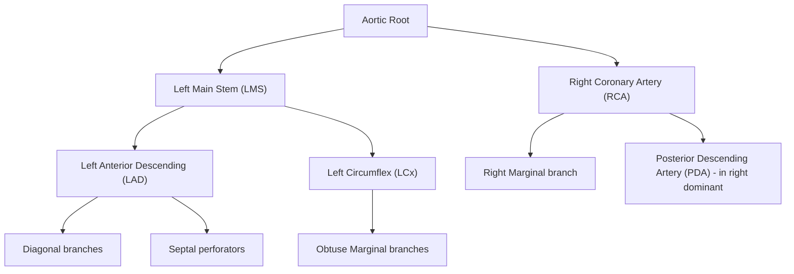
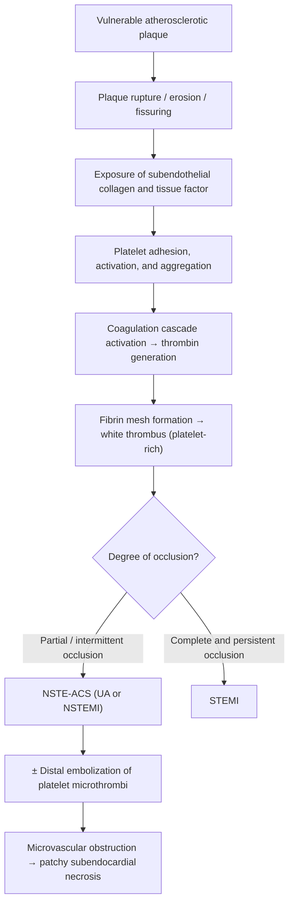
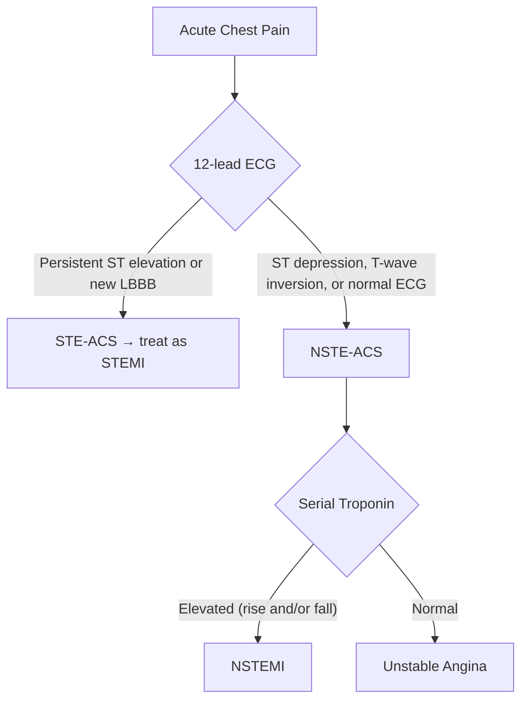

## Definition and Terminology

NSTEMI stands for **Non-ST-Elevation Myocardial Infarction**. Let's break the name down:
- **Non-ST-Elevation** = the ST segment on ECG is *not* persistently elevated (distinguishing it from STEMI)
- **Myocardial** (myo = muscle, cardial = heart) = heart muscle
- **Infarction** (Latin *infarcire* = to stuff/plug) = tissue death due to ischaemia

NSTEMI is one entity within the spectrum of **Acute Coronary Syndrome (ACS)**, which encompasses three conditions unified by a common pathophysiology — acute disruption of coronary blood flow [1][2]:

| Entity | Occlusion | Necrosis | Troponin | ST Elevation |
|---|---|---|---|---|
| ***Unstable Angina (UA)*** | Partial/transient | None | Normal | No |
| ***NSTEMI*** | ***Partial occlusion (usually due to critical narrowing) → some myocardial necrosis but not transmural*** | Subendocardial (partial thickness) | ***Elevated*** | No |
| ***STEMI*** | ***Complete occlusion (usually due to acute plaque disruption leading to complete thrombosis) → transmural myocardial necrosis*** | Transmural (full thickness) | Elevated | Yes (persistent) |

***UA and NSTEMI are classified together under NSTE-ACS*** because they share the same initial management pathway and are distinguished only by the presence or absence of elevated cardiac biomarkers (troponin) [1][2].

<Callout title="Key Conceptual Point">
The fundamental difference between NSTEMI and STEMI is the degree of coronary occlusion and the resulting depth of myocardial necrosis. In NSTEMI, the artery is not completely occluded — there is still some residual flow — so the infarction is typically subendocardial (the inner wall, which is most vulnerable to ischaemia because it is furthest from the epicardial blood supply and is most compressed during systole). In STEMI, complete occlusion causes transmural (full-thickness) necrosis.
</Callout>

### Universal Definition of Myocardial Infarction (4th Universal Definition, 2018)

***Acute myocardial infarction (AMI)*** is defined as ***myocardial cell death due to prolonged myocardial ischaemia*** [2]. The 4th Universal Definition requires:

1. **Rise and/or fall of cardiac troponin** (cTn) with at least one value above the **99th percentile upper reference limit (URL)**
2. **Plus** at least one of:
   - Symptoms of acute myocardial ischaemia
   - New ischaemic ECG changes
   - Development of pathological Q waves
   - Imaging evidence of new loss of viable myocardium or new regional wall motion abnormality (RWMA) in a pattern consistent with an ischaemic aetiology
   - Identification of a coronary thrombus by angiography or autopsy

### MI Classification (Types 1–5)

| Type | Mechanism | Relevance to NSTEMI |
|---|---|---|
| **Type 1** | Spontaneous MI due to atherosclerotic plaque disruption (rupture, erosion, fissuring) with intraluminal thrombus | Most common cause of NSTEMI |
| **Type 2** | MI secondary to supply-demand mismatch *without* acute plaque event (e.g., anaemia, tachyarrhythmia, hypotension, coronary spasm, coronary embolism) | Common cause; very important to recognize as management differs |
| **Type 3** | MI resulting in death when biomarkers unavailable | — |
| **Type 4a/b** | MI related to PCI / stent thrombosis | Iatrogenic |
| **Type 5** | MI related to CABG | Iatrogenic |

<Callout title="Type 2 MI — A Common Exam Pitfall" type="error">
Not every troponin rise with ischaemic symptoms is a Type 1 MI. A septic patient with tachycardia and hypotension who develops troponin elevation has a Type 2 MI — the coronary arteries may be entirely normal. The treatment here is to fix the underlying cause (treat sepsis), NOT to rush to the cath lab. Always ask: "Is this plaque rupture, or supply-demand mismatch?"
</Callout>

---

## Epidemiology

***NSTEMI is the most common form of ACS***, accounting for approximately 60–75% of all ACS presentations in developed countries [1][3].

### Global Trends
- The incidence of NSTE-ACS has been **increasing** relative to STEMI over the past two decades, largely due to:
  - Improved sensitivity of troponin assays (high-sensitivity troponin, hs-cTn) — cases previously classified as UA are now reclassified as NSTEMI
  - Better primary and secondary prevention reducing rates of large STEMI
  - Ageing population with more comorbidities predisposing to Type 2 MI
- In-hospital mortality for NSTEMI is lower than STEMI (~3–5% vs ~6–7%), but **6-month and long-term mortality are comparable or even higher** for NSTEMI — because NSTEMI patients tend to be older with more comorbidities [1][3]

### Hong Kong Context
- Coronary heart disease is one of the leading causes of death in HK (3rd cause after cancer and pneumonia)
- HK has high prevalence of traditional risk factors: hypertension (~27%), diabetes (~10%), dyslipidaemia, and increasing obesity
- ***Mortality of AMI: 40% overall in 4 weeks (half ≤ 2h due to VF), 6–7% in 30 days for those surviving to hospital*** [2]
- The Chinese population has a somewhat different risk factor profile: relatively lower rates of familial hypercholesterolaemia but higher rates of smoking in males and diabetes-related CAD

<Callout title="High Yield Epidemiology Point">
NSTEMI patients are typically older, more often female, and have more comorbidities (DM, CKD, prior PCI/CABG) compared to STEMI patients. This is why despite lower acute mortality, their long-term outcomes can be worse.
</Callout>

---

## Risk Factors for Coronary Artery Disease

Since NSTEMI arises from coronary atherosclerosis (in the vast majority of Type 1 cases), its risk factors are those of **atherosclerotic cardiovascular disease (ASCVD)** [2][4]:

### Modifiable Risk Factors
| Risk Factor | Mechanism of Atherogenesis |
|---|---|
| ***Cigarette smoking*** | Endothelial injury, ↑oxidative stress, ↑platelet activation, ↑LDL oxidation, ↓HDL |
| ***Hypertension*** | Mechanical shear stress → endothelial dysfunction → accelerated atherosclerosis |
| ***Dyslipidaemia (↑LDL-C, ↓HDL-C, ↑TG)*** | LDL penetrates and accumulates in subendothelial space → oxidized → foam cells → atheroma |
| ***Diabetes mellitus*** | Hyperglycaemia → endothelial dysfunction + ↑inflammation + prothrombotic state; insulin resistance → dyslipidaemia |
| ***Abdominal obesity / Metabolic syndrome*** | Central adiposity → ↑FFA + adipokines → insulin resistance → dyslipidaemia, HTN, pro-inflammatory and prothrombotic state [4] |
| ***Physical inactivity*** | ↓AMPK activation → ↓glucose uptake + ↓FFA metabolism → worsens metabolic syndrome [4] |
| ***Unhealthy diet*** | High saturated fat, trans-fat, sodium → ↑LDL, ↑BP |

### Non-Modifiable Risk Factors
| Risk Factor | Details |
|---|---|
| ***Age*** | ***M ≥ 45y, F ≥ 55y*** — age is the strongest risk factor; atherosclerosis is a cumulative process [4] |
| ***Male gender*** | Oestrogen is protective pre-menopause (↑HDL, ↓LDL, vasodilatory); risk equalizes post-menopause |
| ***Family history of premature CVD*** | ***1st degree relative: M < 55y, F < 65y*** [4] — implies genetic predisposition (e.g., familial hypercholesterolaemia, polygenic risk) |

### ASCVD Risk Assessment
- ***Formal assessment recommended if ≥ 40y + ≥ 1 ASCVD risk factor (HK consensus 2016)*** [4]
- ***Not needed if patient has overt ASCVD, DM, or ≥ 1 major risk factor → automatically meets threshold for treatment*** [4]
- Tools include: Framingham Risk Score, ACC/AHA ASCVD Risk Calculator, SCORE risk charts, and regionally validated tools like the ***Chinese Multiprovincial Cohort Study (CMCS)*** [4]

---

## Anatomy and Function of the Coronary Arteries

Understanding coronary anatomy is essential because the territory of ischaemia in NSTEMI determines the ECG changes, wall motion abnormalities, and potential complications.

### Coronary Arterial Supply

| Artery | Territory Supplied | ECG Leads |
|---|---|---|
| **LAD** | Anterior wall, anterior septum, LV apex | V1–V4 (anterior), V5–V6/I/aVL (anterolateral if diagonal branches involved) |
| **LCx** | Lateral wall, posterior wall (if left dominant) | I, aVL, V5–V6 (lateral); may also cause posterior changes |
| **RCA** | Inferior wall, RV, posterior wall (if right dominant), AV node (in ~90%), SA node (in ~60%) | II, III, aVF (inferior); V3R–V4R (RV); reciprocal V1–V3 for posterior |

### Coronary Dominance
- **Right dominant (~85%)**: PDA arises from RCA → RCA supplies inferior wall + posterior wall
- **Left dominant (~8%)**: PDA arises from LCx
- **Codominant (~7%)**: both contribute

### Why the Subendocardium Is Most Vulnerable
The subendocardium (inner third of the myocardial wall) is the watershed zone of coronary perfusion:
1. **Compressed during systole**: intramural pressure is highest here, so perfusion occurs mainly during diastole
2. **End-artery territory**: coronary arteries penetrate from epicardium → endocardium; the subendocardium is the most distal territory
3. **Highest O₂ demand**: the subendocardial fibres have the highest wall stress

This is why **partial coronary occlusion in NSTEMI causes subendocardial (not transmural) infarction** — there is still enough flow to keep the epicardial layers alive, but the subendocardium crosses the ischaemic threshold first.

---

## Etiology (Focus on Hong Kong)

### A. Type 1 NSTEMI — Atherosclerotic Plaque Disruption

This is the classical and most common cause. The sequence is:

#### ***Pathophysiology of Plaque Disruption → Thrombosis → NSTEMI*** [1][2][3]

***Key concept: In NSTEMI, the thrombus is usually non-occlusive (partial) or transiently occlusive. This allows some residual antegrade flow, and collateral flow may also contribute. However, distal embolization of platelet aggregates can cause microvascular obstruction, leading to patchy myocardial necrosis*** [1][3].

#### The "Vulnerable Plaque"
Not all atherosclerotic plaques are equal. The plaques most likely to rupture have:
- **Large lipid-rich necrotic core** (> 40% of plaque volume)
- **Thin fibrous cap** (< 65 μm) — this is the protective layer of smooth muscle cells and collagen that separates the thrombogenic core from the bloodstream
- **Heavy inflammatory infiltrate** — macrophages secrete matrix metalloproteinases (MMPs) that digest collagen → thin the cap
- **Few smooth muscle cells** (which make collagen to strengthen the cap)
- **Positive (outward) remodelling** — the plaque grows outward, so angiography may not show significant stenosis until it ruptures

<Callout title="Why Doesn't the Plaque Need to Be Severely Stenotic?">
This is a crucial concept. Many NSTEMI events arise from plaques that cause only 30–50% stenosis. These plaques are NOT flow-limiting at baseline (so no exertional angina beforehand), but they are vulnerable to rupture because of their thin cap and large lipid core. This is why some patients present with NSTEMI as their very first manifestation of CAD, without any prior angina. It also explains why stress testing cannot detect all "at-risk" plaques.
</Callout>

#### Why the Thrombus Is Partial in NSTEMI (vs. Complete in STEMI)
Several factors determine whether the thrombus becomes occlusive:
1. **Plaque erosion** (rather than rupture) tends to produce a smaller, more platelet-rich, non-occlusive thrombus → more common in NSTEMI
2. **Endogenous fibrinolysis** may partially dissolve a completely occlusive thrombus, restoring some flow
3. **Collateral circulation** may be better developed in patients with chronic stenosis
4. **Thrombus composition**: NSTEMI thrombi are more "white" (platelet-rich) while STEMI thrombi are more "red" (fibrin and red cell-rich, more organized and resistant to lysis)

### B. Type 2 NSTEMI — Supply-Demand Mismatch

Any condition that causes myocardial oxygen supply < demand in the setting of underlying (but stable) CAD or even normal coronaries can cause Type 2 MI:

| Mechanism | Examples |
|---|---|
| **↓ O₂ supply** | Anaemia, hypoxia (pneumonia, ARDS, PE), hypotension/shock, coronary vasospasm (Prinzmetal's), coronary embolism (AF, endocarditis), coronary dissection |
| **↑ O₂ demand** | Tachyarrhythmia (AF with RVR, SVT), severe hypertension (hypertensive crisis), aortic stenosis, HOCM, thyrotoxicosis, phaeochromocytoma, severe sepsis, cocaine/amphetamine use |

### C. Other Causes of NSTEMI (Less Common)

| Cause | Mechanism |
|---|---|
| **Coronary vasospasm (Prinzmetal/variant angina)** | Intense focal vasospasm of a coronary artery → transient ischaemia; if prolonged, can cause infarction. Often in young patients, smokers, cocaine users. May have normal angiography between episodes |
| **Spontaneous coronary artery dissection (SCAD)** | Tear in the coronary artery wall → intramural haematoma → luminal compression. Classically in young women, peripartum, fibromuscular dysplasia |
| **Coronary embolism** | From AF, prosthetic valves, endocarditis, paradoxical embolism (PFO), aortic atheroma |
| **Takotsubo cardiomyopathy** | Catecholamine-mediated myocardial stunning; can mimic NSTEMI with troponin rise and RWMA but coronaries are normal. Classically in postmenopausal women after emotional/physical stress |
| **Myocarditis** | Can mimic NSTEMI biochemically (troponin rise) and clinically. Viral (Coxsackie, COVID-19) or autoimmune |
| **Cocaine/methamphetamine** | Coronary vasospasm + accelerated atherosclerosis + ↑myocardial O₂ demand (tachycardia, hypertension) |

### Hong Kong-Specific Considerations
- **High smoking prevalence** in males (~20% in adult males) — a major modifiable risk factor
- **High prevalence of Type 2 DM** (~10%) — diabetic patients often have **silent ischaemia** (autonomic neuropathy blunts anginal symptoms)
- **Rising obesity and metabolic syndrome** — sedentary lifestyle, dietary westernization
- **Hypertension** very common (~27% of adults)
- **Apical HCM** is relatively more prevalent in HK/East Asian populations (***25–30% of HCMP in Japan and HK***) and can present with chest pain mimicking ACS [2]

---

## Classification

### A. By ACS Spectrum (Clinical Classification at Presentation)

### B. By MI Type (Universal Classification)
As described above (Types 1–5).

### C. By Risk Stratification (GRACE Score — Determines Urgency of Invasive Strategy)

Risk stratification is paramount in NSTEMI because, unlike STEMI (which always requires emergent reperfusion), the timing of invasive management in NSTEMI depends on risk [1][3]:

| Risk Category | GRACE Score | In-hospital Mortality | Management Timing |
|---|---|---|---|
| ***Very high risk*** | Clinical criteria (see below) | — | ***Immediate invasive (< 2h)*** |
| ***High risk*** | > 140 | > 3% | ***Early invasive (< 24h)*** |
| ***Intermediate risk*** | 109–140 | 1–3% | ***Invasive (< 72h)*** |
| ***Low risk*** | ≤ 108 | < 1% | ***Selective invasive / conservative*** |

***GRACE (Global Registry of Acute Coronary Events) score variables***: age, heart rate, systolic BP, creatinine, cardiac arrest at admission, ST-segment deviation, elevated cardiac enzymes, Killip class [1][3].

***Very high risk criteria (requiring immediate invasive strategy < 2h, like STEMI)*** [1][3]:
- ***Haemodynamic instability or cardiogenic shock***
- ***Recurrent or ongoing chest pain refractory to medical treatment***
- ***Life-threatening arrhythmias (VT, VF, cardiac arrest)***
- ***Mechanical complications of MI***
- ***Acute heart failure clearly related to NSTE-ACS***
- ***Recurrent dynamic ST-T wave changes (particularly intermittent ST elevation)***

### D. Killip Classification (Assessment of Heart Failure Severity in AMI)

| Class | Clinical Findings | Approximate Mortality |
|---|---|---|
| I | No signs of heart failure | 6% |
| II | Crackles in lower lung fields, S3, ↑JVP | 17% |
| III | Frank pulmonary oedema | 38% |
| IV | Cardiogenic shock | 81% |

---

## Pathophysiology — A Detailed First-Principles Explanation

### Step 1: Atherosclerosis Development (The Foundation)

Atherosclerosis is a chronic inflammatory disease of medium and large arteries:

1. **Endothelial injury/dysfunction**: Risk factors (smoking, HTN, DM, dyslipidaemia) damage the endothelium → ↑permeability to lipoproteins, ↓NO production (NO is vasodilatory and anti-thrombotic)
2. **LDL infiltration**: LDL particles cross the damaged endothelium into the intima → become oxidized (oxLDL)
3. **Inflammatory response**: oxLDL attracts monocytes → enter intima → differentiate into macrophages → engulf oxLDL → become **foam cells** → fatty streak formation
4. **Smooth muscle cell migration**: SMCs migrate from media to intima, proliferate, and secrete collagen/elastin → forms a **fibrous cap** over the lipid core
5. **Plaque maturation**: The necrotic core grows (dead foam cells release lipids), the fibrous cap may thin, and the plaque may calcify
6. **Plaque vulnerability**: Inflammatory cells (macrophages, T-cells) release MMPs and cytokines → degrade collagen → thin fibrous cap → **vulnerable plaque**

### Step 2: Acute Plaque Event (The Trigger)

The acute event in Type 1 NSTEMI is **plaque rupture or erosion**:

- **Plaque rupture** (~60–70% of ACS): The thin fibrous cap tears, exposing the highly thrombogenic lipid-rich necrotic core to flowing blood. This is the most common mechanism in STEMI but also causes NSTEMI.
- **Plaque erosion** (~30–40%): The endothelium over the plaque denudes without frank rupture of the cap. This tends to produce smaller thrombi and is more common in NSTEMI, younger patients, women, and smokers.
- **Calcified nodule** (rare, ~5%): Calcified material protrudes through the cap into the lumen.

### Step 3: Thrombus Formation (The Consequence)

Exposure of subendothelial collagen and tissue factor → two simultaneous processes:

1. **Primary haemostasis (platelet plug)**:
   - Platelet **adhesion** via vWF-GPIb/IX/V and collagen-GPVI
   - Platelet **activation**: shape change, degranulation (ADP, TXA₂, serotonin)
   - Platelet **aggregation** via GPIIb/IIIa-fibrinogen cross-links

2. **Secondary haemostasis (coagulation cascade)**:
   - Tissue factor → Factor VIIa → extrinsic pathway → thrombin generation → fibrin

This is why **dual antiplatelet therapy (DAPT)** and **anticoagulation** are both required in NSTEMI — you need to block both arms.

### Step 4: Myocardial Ischaemia and Necrosis

- **Partial occlusion** → reduced but not absent coronary flow
- **Subendocardial ischaemia first** (most vulnerable zone, as explained above)
- If ischaemia is prolonged (typically > 20 minutes of severe ischaemia), irreversible injury begins:
  - ATP depletion → failure of Na⁺/K⁺-ATPase → cell swelling → membrane disruption
  - Calcium overload → mitochondrial dysfunction → cell death
  - Release of intracellular contents: **troponin**, CK-MB, myoglobin into the bloodstream

### Step 5: Consequences of Necrosis

- **Troponin release** → detected by blood tests (this is what defines NSTEMI vs UA)
- **Regional wall motion abnormality** → detectable on echo
- **Electrical instability** → arrhythmias (ischaemic myocardium has altered conduction and repolarization)
- **Inflammatory response** → attracts neutrophils, then macrophages → scar formation over days-weeks

### ECG Changes in NSTEMI — Why No ST Elevation?

This is a critical concept:

- **ST elevation** reflects **transmural injury current** — when the full thickness of the myocardium is ischaemic, the injury current is directed toward the epicardium → ST elevation in overlying leads
- In NSTEMI, only the **subendocardium** is affected → the injury current points from epicardium *toward* the endocardium (i.e., *away* from the overlying electrode) → this manifests as:
  - ***ST depression*** (the most common ECG finding in NSTEMI)
  - ***T-wave inversion*** (repolarization abnormality from subendocardial ischaemia/injury)
  - ***Or even a normal ECG*** (if the affected territory is small or in an area poorly represented on standard 12-lead ECG, e.g., posterior wall, LCx territory)

<Callout title="ECG Pitfall in NSTEMI" type="error">
A normal ECG does NOT exclude NSTEMI. Up to 30–40% of NSTEMI patients may have a non-diagnostic initial ECG. This is why serial ECGs and troponin measurements are essential. The LCx territory is notoriously under-represented on a standard 12-lead ECG — consider posterior leads (V7–V9) if clinical suspicion is high.
</Callout>

---

## Clinical Features

### A. Symptoms (with Pathophysiological Basis)

#### 1. Chest Pain — The Cardinal Symptom

***The typical presentation of NSTEMI is acute onset retrosternal chest pain/discomfort that occurs at rest or with minimal exertion, lasting > 20 minutes, and NOT fully relieved by sublingual GTN*** [1][2][3].

| Feature | Description | Pathophysiological Basis |
|---|---|---|
| **Character** | ***Dull, constricting, crushing, squeezing, "heavy", burning, aching; often described as "discomfort" rather than "pain"*** | Visceral pain from myocardial ischaemia → stimulation of cardiac sympathetic afferents (C7–T4) → poorly localized visceral sensation |
| **Location** | ***Retrosternal (central chest)*** | Heart is a midline structure; visceral afferents enter the spinal cord bilaterally |
| **Radiation** | ***Left arm, both arms, shoulders, jaw, neck, epigastrium, interscapular region*** | Referred pain: cardiac afferents share spinal cord segments (C7–T4) with somatic dermatomes of the arm (T1–T2), jaw (trigeminal nucleus convergence), and shoulder (C3–C5 phrenic) |
| **Duration** | ***Typically > 20 minutes*** (if < 20 min and resolving, may be UA) | Prolonged ischaemia needed for irreversible necrosis; < 20 min may represent transient ischaemia only |
| **Precipitants** | May occur at rest (unlike stable angina which is exertional) | Acute plaque event → fixed supply reduction regardless of demand |
| **Response to GTN** | ***May partially relieve but typically does not fully resolve*** | GTN causes venodilation (↓preload → ↓wall stress → ↓O₂ demand) and some coronary vasodilation, but cannot overcome a mechanical obstruction from thrombus |
| ***Levine's sign*** | ***Clenched fist placed over sternum when describing pain*** | Classic gestural descriptor of anginal chest pain |

***Three recognized clinical presentations of NSTE-ACS*** [1][3]:
1. ***Prolonged (> 20 min) rest angina***
2. ***New-onset angina (de novo) — Class II or III (CCS classification)***
3. ***Crescendo angina — worsening in frequency, duration, or severity of previously stable angina (at least CCS III)***

#### 2. Autonomic Symptoms

| Symptom | Pathophysiological Basis |
|---|---|
| **Diaphoresis (sweating)** | Sympathetic activation from pain + haemodynamic stress → widespread sympathetic discharge → eccrine gland activation |
| **Nausea / Vomiting** | Vagal stimulation (especially with inferior MI — the inferior surface is rich in vagal afferents) + pain-mediated nausea |
| **Pallor** | Sympathetic vasoconstriction → diversion of blood from skin to vital organs |
| **Palpitations** | Sympathetic activation → ↑HR; may also indicate ischaemia-mediated arrhythmia |

#### 3. Symptoms of Haemodynamic Compromise

| Symptom | Pathophysiological Basis |
|---|---|
| **Dyspnoea** | LV systolic dysfunction from ischaemia/necrosis → ↑LV end-diastolic pressure → ↑LA pressure → pulmonary venous congestion → ↑pulmonary interstitial fluid → stimulates J-receptors → sensation of breathlessness |
| **Orthopnoea / PND** | Same mechanism but exacerbated by supine position (↑venous return → ↑preload → ↑pulmonary congestion) |
| **Lightheadedness / Syncope** | ↓CO from severe LV dysfunction or arrhythmia → ↓cerebral perfusion |

#### 4. "Silent" or Atypical Presentations

***This is extremely important for exams.*** Up to **30–40%** of NSTEMI patients present atypically, particularly:
- ***Elderly (> 75y)*** — may present with confusion, fatigue, or "just not feeling right"
- ***Diabetics*** — **autonomic neuropathy** damages the cardiac sensory afferents → **painless MI** (they may present with dyspnoea as an "anginal equivalent")
- ***Women*** — more likely to have atypical pain quality (sharp, pleuritic) or present with fatigue, nausea, dyspnoea
- ***Post-operative patients*** — pain may be attributed to surgery
- ***Renal failure patients*** — altered pain perception

<Callout title="Exam High Yield: Anginal Equivalents">
In patients who cannot perceive typical anginal pain (diabetics, elderly), the first symptom may be an "anginal equivalent" — most commonly **exertional dyspnoea**, but also fatigue, nausea, diaphoresis, or syncope. Always have a low threshold for ECG and troponin in these populations.
</Callout>

### B. Signs (with Pathophysiological Basis)

***Physical examination in NSTEMI is often unremarkable*** but is critical for:
1. Assessing haemodynamic status and complications
2. Identifying alternative diagnoses
3. Identifying precipitating factors

#### 1. General Inspection

| Sign | Pathophysiological Basis |
|---|---|
| **Anxiety, distress** | Pain and sympathetic activation |
| **Pallor, cool/clammy skin** | Sympathetic vasoconstriction; if severe, suggests cardiogenic shock (↓CO → ↓peripheral perfusion) |
| **Diaphoresis** | Sympathetic activation |
| **Cyanosis** (if severe) | Pulmonary oedema → impaired gas exchange → hypoxaemia |
| ***Xanthomas, xanthelasma, arcus senilis*** | Indicate underlying dyslipidaemia — a major risk factor for CAD [2][4] |

#### 2. Cardiovascular Examination

| Sign | Pathophysiological Basis |
|---|---|
| **Tachycardia** | Sympathetic activation (compensatory for ↓CO and pain); or arrhythmia |
| **Bradycardia** | Vagal stimulation (especially inferior MI → AV nodal ischaemia as RCA supplies AV node in ~90%) |
| **Hypotension** | ↓CO from extensive LV dysfunction or RV infarction or arrhythmia → cardiogenic shock |
| **Hypertension** | Pain and sympathetic activation → vasoconstriction + ↑HR; or pre-existing HTN as risk factor |
| **Irregular pulse** | Arrhythmia: AF (atrial ischaemia/stretch), VT/VF (ventricular ischaemia), heart block (conduction system ischaemia) |
| ***Displaced, dyskinetic apex beat*** | LV dilatation from prior MI or acute severe LV dysfunction; dyskinetic suggests regional wall motion abnormality [2] |
| ***S3 gallop*** | ↑LVEDP → rapid ventricular filling into a dilated, poorly compliant ventricle → turbulent flow. Indicates significant LV systolic dysfunction [2] |
| ***S4 gallop*** | ↓LV compliance from ischaemia (ischaemic myocardium becomes stiff) → atrial contraction against a stiff ventricle → S4 |
| ***New systolic murmur*** | **Critical sign!** Could indicate: (1) **Papillary muscle dysfunction/rupture** → acute MR (harsh pansystolic murmur at apex radiating to axilla); (2) **VSD** → harsh pansystolic murmur at left sternal edge with thrill; (3) **Functional MR** from LV dilatation |
| **↑JVP** | Right heart failure (from RV infarction in inferior MI, or biventricular failure); or mechanical complication (cardiac tamponade from free wall rupture → ↑↑JVP with Kussmaul's sign) |
| **Pericardial friction rub** | Pericarditis (early post-MI pericarditis occurs 1–3 days post-MI due to transmural inflammation) |

#### 3. Respiratory Examination

| Sign | Pathophysiological Basis |
|---|---|
| ***Bibasal crackles / crepitations*** | Pulmonary oedema from LV failure → ↑pulmonary capillary hydrostatic pressure → transudation of fluid into alveoli |
| **Wheeze** ("cardiac asthma") | Peribronchial oedema compresses small airways → expiratory wheezing |
| ***Pink frothy sputum*** | Severe pulmonary oedema → rupture of engorged pulmonary capillaries → blood-tinged transudate in alveoli [5] |

#### 4. Peripheral Examination

| Sign | Pathophysiological Basis |
|---|---|
| **Peripheral oedema** | Right heart failure → ↑systemic venous pressure → ↑capillary hydrostatic pressure → fluid extravasation |
| ***Signs of peripheral vascular disease*** (absent pulses, bruits, trophic changes) | Indicates widespread atherosclerosis — if present in peripheral arteries, coronary involvement is very likely [2] |
| ***Carotid bruits*** | Indicates carotid atherosclerosis → marker of generalized atherosclerotic burden [2] |
| **Delayed capillary refill (> 2 sec)** | ↓CO → peripheral vasoconstriction → poor tissue perfusion |
| **Oliguria** (from catheter) | ↓renal perfusion from ↓CO → ↓GFR → ↓urine output |

#### 5. Signs That Suggest Alternative Diagnoses or Precipitating Causes

| Sign | Possible Alternative/Precipitant |
|---|---|
| **Unequal BP between arms (> 20 mmHg difference)** | Aortic dissection (crucial to exclude before anticoagulation) |
| **Absent femoral pulses** | Aortic dissection involving descending aorta |
| **Pericardial rub with distant heart sounds** | Pericardial effusion/tamponade |
| **Unilateral absent breath sounds** | Pneumothorax |
| **Fever** | Pneumonia, myocarditis, endocarditis (as cause of coronary embolism) |
| **Conjunctival pallor** | Anaemia → Type 2 MI (supply-demand mismatch) |
| **Thyroid goitre, lid lag, tremor** | Thyrotoxicosis → Type 2 MI (↑O₂ demand) [2] |
| **Needle track marks** | IV drug use → infective endocarditis → coronary embolism |

<Callout title="Must-Do on Physical Examination in ACS" type="idea">
Always perform these in any patient with suspected ACS:
1. **BP in both arms** — to exclude aortic dissection (a mimic AND a contraindication to thrombolysis/anticoagulation)
2. **Auscultate for new murmurs** — to detect mechanical complications (papillary muscle rupture → acute MR, VSD)
3. **Assess for signs of heart failure** — Killip class determines prognosis and management intensity
4. **Check peripheral pulses** — for PVD (marker of generalized atherosclerosis) and aortic dissection
5. **Look for precipitants** — anaemia, thyrotoxicosis, tachyarrhythmia
</Callout>

---

## Summary of Key Pathophysiology–Clinical Feature Connections

| Pathophysiology | Clinical Feature | Why? |
|---|---|---|
| Myocardial ischaemia → cardiac sympathetic afferents | Chest pain (visceral, poorly localized) | Shares spinal segments C7–T4 → referred to arms, jaw |
| Sympathetic activation | Tachycardia, diaphoresis, pallor, hypertension | Compensatory catecholamine surge |
| Vagal activation (esp. inferior MI) | Bradycardia, nausea, vomiting | RCA supplies vagal-rich inferior surface |
| LV systolic dysfunction | ↓CO → hypotension, S3, displaced apex | Ischaemic myocardium loses contractility |
| ↑LVEDP → pulmonary congestion | Dyspnoea, orthopnoea, crackles | Backward failure into pulmonary circulation |
| RV infarction | ↑JVP, hypotension, clear lungs | RV cannot pump blood forward; backward congestion into systemic veins |
| Papillary muscle dysfunction | New MR murmur | Ischaemic papillary muscle can't hold mitral leaflets → regurgitation |
| Electrical instability | Arrhythmias (AF, VT, VF, heart block) | Ischaemic tissue has altered conduction and automaticity |

---

<Callout title="High Yield Summary">

**Definition**: NSTEMI = acute myocardial infarction with troponin elevation but WITHOUT persistent ST elevation on ECG. Part of the NSTE-ACS spectrum (with UA).

**Key Pathophysiology**: Atherosclerotic plaque rupture/erosion → partial coronary thrombosis → reduced (but not absent) flow → subendocardial necrosis → troponin release.

**Risk Factors**: The classic ASCVD risk factors — smoking, HTN, DM, dyslipidaemia, obesity, family history, age, male sex.

**Presentations**: (1) Prolonged rest angina > 20 min, (2) New-onset severe angina, (3) Crescendo angina. Watch for atypical presentations in elderly, diabetics, women.

**Cardinal symptom**: Retrosternal crushing/squeezing chest pain, may radiate to arms/jaw, associated with diaphoresis, nausea, dyspnoea.

**Key exam findings**: Often unremarkable. Look for haemodynamic compromise (tachycardia, hypotension, S3, crackles), new murmurs (mechanical complications), signs of precipitants (anaemia, thyrotoxicosis), and signs excluding mimics (BP both arms for dissection).

**Risk stratification**: GRACE score determines timing of invasive strategy. Very high risk criteria → immediate invasive (< 2h).

**Always remember**: Check BP in both arms, auscultate for new murmurs, assess Killip class, look for precipitating causes of Type 2 MI.

</Callout>

---

<ActiveRecallQuiz
  title="Active Recall - NSTEMI Clinical Features and Pathophysiology"
  items={[
    {
      question: "What is the fundamental difference between NSTEMI and STEMI in terms of coronary pathology and resulting myocardial injury?",
      markscheme: "NSTEMI: partial/non-occlusive coronary thrombosis causing subendocardial (non-transmural) necrosis with residual flow. STEMI: complete and persistent occlusion causing transmural (full-thickness) necrosis. Both arise from plaque disruption with thrombus formation.",
    },
    {
      question: "Why is the subendocardium the most vulnerable zone to ischaemia?",
      markscheme: "Three reasons: (1) Highest intramural compressive forces during systole reducing perfusion; (2) End-artery territory - coronary vessels penetrate epi-to-endocardium so subendocardium is most distal; (3) Highest wall stress and oxygen demand. Perfusion occurs mainly in diastole.",
    },
    {
      question: "Name three recognized clinical presentations of NSTE-ACS and explain why the ECG shows ST depression rather than ST elevation.",
      markscheme: "Presentations: (1) Prolonged rest angina over 20 min, (2) New-onset angina at least CCS II-III, (3) Crescendo angina worsening to at least CCS III. ST depression because injury is subendocardial - injury current directed from epicardium toward endocardium (away from surface electrode), producing ST depression instead of elevation.",
    },
    {
      question: "Which patient groups are most likely to present with atypical or silent NSTEMI, and why?",
      markscheme: "Elderly (altered pain perception, cognitive decline), diabetics (autonomic neuropathy damages cardiac afferents causing painless MI), women (more atypical symptoms like fatigue and nausea), CKD patients, and post-operative patients. May present with anginal equivalents such as dyspnoea, fatigue, or syncope.",
    },
    {
      question: "A new pansystolic murmur is heard in a patient 3 days post-NSTEMI. What are the two most important mechanical complications to consider, and how do you distinguish them clinically?",
      markscheme: "Acute MR from papillary muscle rupture: pansystolic murmur at apex radiating to axilla, often with pulmonary oedema. VSD: pansystolic murmur at left sternal edge with palpable thrill and step-up in oxygen saturation from RA to RV on catheterization. Both are surgical emergencies.",
    },
    {
      question: "Explain why both dual antiplatelet therapy and anticoagulation are used in NSTEMI from a pathophysiological perspective.",
      markscheme: "Plaque disruption exposes collagen and tissue factor, activating two parallel pathways: (1) Primary haemostasis - platelet adhesion, activation, aggregation via GPIIb/IIIa (targeted by aspirin blocking TXA2 and P2Y12 inhibitor blocking ADP receptor); (2) Secondary haemostasis - tissue factor triggers coagulation cascade generating thrombin and fibrin (targeted by heparin/LMWH). Both arms must be inhibited to prevent thrombus propagation.",
    },
  ]}
/>

---

## References

[1] Lecture slides: GC 028. Accelerating chest pain_Acute coronary (1).pdf
[2] Senior notes: Ryan Ho Cardiology.pdf (Section 3.2 Coronary Artery Disease, Section 3.2.2 ACS)
[3] Lecture slides: GC 088. Sudden Severe Chest Pain.pdf
[4] Senior notes: Ryan Ho Endocrine.pdf (Section on ASCVD risk assessment and metabolic syndrome)
[5] Senior notes: Ryan Ho Critical Care.pdf (Section 1.3.4 Management of Cardiogenic Shock)
