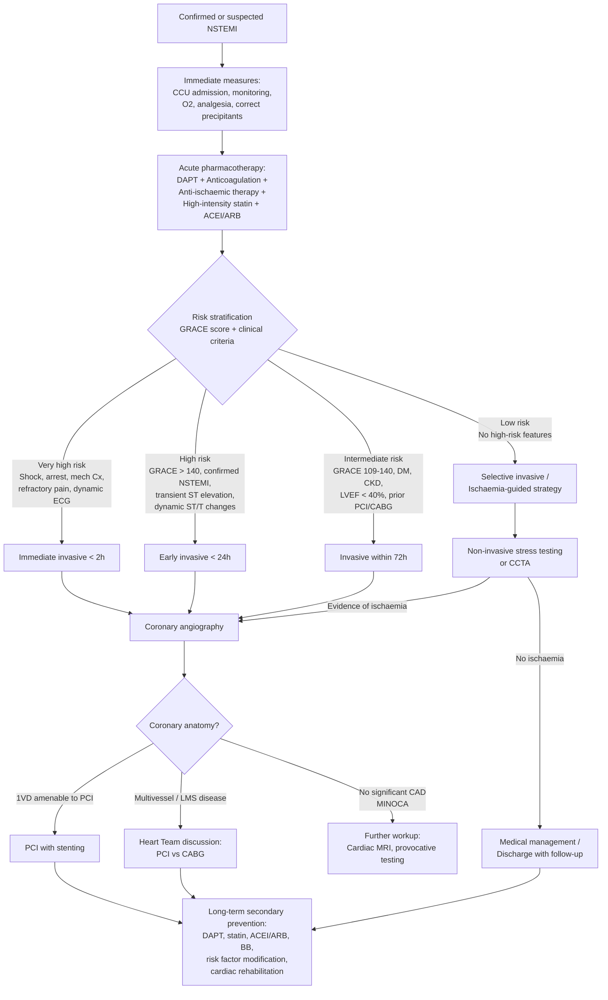

## Management of NSTEMI

The management of NSTEMI is conceptually different from STEMI. In STEMI, the artery is completely occluded and every minute counts — you rush to open it. In NSTEMI, there is still some residual flow, so you have time to stabilise the patient, risk-stratify, and then decide on the optimal timing and approach for revascularisation. ***Thrombolysis has no benefit in NSTE-ACS and may even be harmful*** [2] — this is a critical exam point.

The management framework divides neatly into:
1. **Immediate / Acute management** (first 24–48 hours)
2. **Invasive strategy** (risk-stratified timing of coronary angiography ± revascularisation)
3. **Long-term / Secondary prevention**

---

### Overall Management Algorithm

---

### 1. Immediate / Acute Management (First 24–48 Hours)

#### A. General Measures

***These are essential supportive measures that apply to ALL patients with suspected or confirmed NSTEMI*** [2][6]:

| Measure | Details | Rationale |
|---|---|---|
| ***Inform on-call cardiologist*** | Early specialist involvement | Guides decision on invasive strategy timing |
| ***Admit CCU if high-risk*** | ***High-risk = ongoing chest pain, ↓BP, APO, ventricular arrhythmia*** [2][6] | Continuous monitoring, immediate defibrillation access |
| ***Bed rest with continuous ECG monitoring*** | Telemetry for arrhythmia detection | Ischaemic myocardium is electrically unstable — VT/VF can occur without warning |
| ***Correct precipitating factors*** | ***Anaemia, hypoxia, tachyarrhythmia*** [2] | If a Type 2 MI component exists, correcting the precipitant may be more important than the cath lab |
| ***O₂ supplementation*** | ***Keep SaO₂ > 90% and PaO₂ > 60 mmHg*** [2] | Hypoxia worsens ischaemia; but routine high-flow O₂ in normoxic patients is NOT recommended (may cause vasoconstriction and is not beneficial) |
| ***Nil by mouth or soft diet + stool softener*** | ***Ileus common in patients with acute MI*** [2] | Vagal stimulation from straining (Valsalva) can cause bradycardia/arrhythmia; soft diet in case emergent PCI/CABG needed |
| ***Explain nature of disease*** | ***Allay anxiety*** [2] | Anxiety → sympathetic activation → ↑HR, ↑BP → ↑myocardial O₂ demand → worsens ischaemia |

#### B. Analgesia

***Analgesia is required if nitrates are insufficient for symptom relief*** [2].

| Drug | Dose | Mechanism | Why It Helps |
|---|---|---|---|
| ***IV morphine*** | 2.5–5 mg IV, repeat PRN | μ-opioid receptor agonist → central analgesia + anxiolysis + venodilation | ***↓Distress, ↓adrenergic drive → ↓SVR, ↓BP, ↓risk of ventricular arrhythmias*** [2]; venodilation → ↓preload → ↓myocardial O₂ demand |
| ***IV metoclopramide (Maxolon)*** | ***5–10 mg*** [2] | D₂ antagonist — antiemetic | Morphine causes nausea/vomiting (stimulates CTZ); also MI itself causes vagal-mediated nausea |
| ***± Sedation (diazepam 2–5 mg PO TDS)*** | [2] | Benzodiazepine — GABA-A agonist | Anxiolysis → ↓sympathetic drive |

<Callout title="Morphine Caution" type="error">
While morphine provides excellent symptom relief, there is observational evidence that it may delay absorption of oral P2Y12 inhibitors (by slowing gastric motility) and was associated with worse outcomes in some registries. Current guidelines (ESC 2023) recommend **cautious use** — give it when needed for pain, but do not use routinely. Always co-administer an antiemetic.
</Callout>

---

### 2. Acute Pharmacotherapy

This is the core of NSTEMI management. Think of it as four pillars: **Antiplatelet**, **Anticoagulant**, **Anti-ischaemic**, and **Disease-modifying (statin + ACEI/ARB)**. Each pillar targets a specific aspect of the pathophysiology.

#### Pillar 1: Antiplatelet Therapy

The thrombus in NSTEMI is platelet-rich ("white thrombus"). Platelet activation occurs through multiple pathways — you need to block at least two to be effective. This is why we use **dual antiplatelet therapy (DAPT) = aspirin + P2Y12 inhibitor**.

##### Aspirin

| Feature | Details |
|---|---|
| Mechanism | Irreversibly inhibits cyclooxygenase-1 (COX-1) → blocks thromboxane A₂ (TXA₂) synthesis → TXA₂ is a potent platelet activator and vasoconstrictor |
| Why irreversible matters | Platelets are anucleate — they cannot synthesize new COX-1. So one dose of aspirin disables TXA₂ production for the entire 7–10 day lifespan of that platelet |
| ***Dose*** | ***Loading: 150–300 mg (chewed for rapid buccal absorption); Maintenance: 75–100 mg daily*** [1][11] |
| ***Duration*** | ***Indefinitely (lifelong) in all patients with CAD*** [1][2][11] |
| ***Contraindications*** | True aspirin allergy (urticaria, angioedema, bronchospasm), active GI bleeding, severe bleeding diathesis |
| ***If aspirin intolerant*** | ***Clopidogrel 75 mg daily as alternative when ASA is not tolerated because of hypersensitivity or GI intolerance*** [11] |

##### P2Y12 Receptor Inhibitors

P2Y12 is an ADP receptor on platelets. ADP is released from dense granules of activated platelets → activates neighbouring platelets (amplification loop). Blocking P2Y12 breaks this amplification.

***The lecture slides present the antiplatelet algorithm for NSTEMI*** [1]:

| Drug | Mechanism | Dose | Key Points |
|---|---|---|---|
| ***Ticagrelor*** | Reversible, direct-acting P2Y12 antagonist (does NOT require metabolic activation) | ***Loading 180 mg; Maintenance 90 mg BD*** [11] | ***Recommended first-line P2Y12 inhibitor for NSTEMI*** [1][11]; can be given as pretreatment before angiography; faster onset (~30 min) and more potent than clopidogrel; Side effects: dyspnoea (adenosine reuptake inhibition), bradycardia |
| ***Prasugrel*** | Irreversible thienopyridine; requires single-step hepatic activation (faster and more predictable than clopidogrel) | Loading 60 mg; Maintenance 10 mg QD | ***Given after defining coronary anatomy (i.e., at time of PCI, not as pretreatment)*** [1]; more potent than clopidogrel; ***C/I: prior stroke/TIA (↑ICH risk), age ≥ 75y (↑bleeding without mortality benefit), body weight < 60 kg (↑bleeding — consider 5 mg maintenance)*** |
| ***Clopidogrel*** | Irreversible thienopyridine; requires two-step hepatic activation via CYP2C19/3A4 (pro-drug) | Loading 300–600 mg; Maintenance 75 mg QD | ***Used if ticagrelor and prasugrel are not available or contraindicated*** [1][11]; slowest onset (~2–6h); significant inter-individual variability (CYP2C19 polymorphisms → poor metabolizers get inadequate platelet inhibition); ***Caveat: clopidogrel interacts with PPI (inhibit CYP2C19/3A4 activation → treatment failure)*** [2] |

***Antiplatelet strategy based on the lecture slide algorithm*** [1]:

**At first medical contact (NSTEMI):**
- ***Pretreatment: Ticagrelor (preferred) OR Clopidogrel (if ticagrelor not available or contraindicated)*** [1]
- ***No established role for prasugrel pretreatment*** [1]

**If PCI is performed:**
- ***Prasugrel (after defining coronary anatomy) or ticagrelor — choice based on contraindications and precautions*** [1]
- ***Consider cangrelor in patients not pretreated*** [1] — cangrelor is an IV P2Y12 inhibitor with ultra-rapid onset and offset (half-life ~3–6 min), useful as a bridge when oral P2Y12 cannot be given
- ***Clopidogrel if prasugrel and ticagrelor are not available or contraindicated*** [1]

**If CABG is needed:**
- ***Withdraw ticagrelor for 5 days and prasugrel for 7 days*** [1] — to reduce perioperative bleeding (platelets need time to regenerate unblocked populations)
- ***Withdraw clopidogrel for 5 days*** [1]

**If no revascularisation (medical management):**
- Continue P2Y12 inhibitor as per medical management pathway

***At discharge*** [1]:
- ***If PCI performed: continue prasugrel or ticagrelor***
- ***If previously treated with clopidogrel, switch to ticagrelor*** [1]
- ***If CABG performed: resume ticagrelor or clopidogrel as soon as possible*** [1]

***Duration of DAPT*** [2][11]:
- ***DAPT maintained over 12 months unless there are contraindications or an excessive risk of bleeding*** [11]
- After 12 months, aspirin continues indefinitely; P2Y12 inhibitor may be stopped or continued based on ischaemic vs bleeding risk assessment

<Callout title="DAPT Duration — The Balancing Act" type="idea">
The 12-month DAPT duration is a compromise between ischaemic risk (stent thrombosis, recurrent MI — favouring longer DAPT) and bleeding risk (favouring shorter DAPT). In patients with high bleeding risk (HBR), DAPT may be shortened to 3–6 months. In patients with high ischaemic risk and low bleeding risk, extended DAPT beyond 12 months (or even with low-dose rivaroxaban — the COMPASS trial) may be considered.
</Callout>

##### GPIIb/IIIa Inhibitors

| Feature | Details |
|---|---|
| Examples | Abciximab (monoclonal antibody), eptifibatide (cyclic peptide), tirofiban (non-peptide) |
| Mechanism | Block the GPIIb/IIIa receptor on platelet surface — this is the final common pathway of platelet aggregation (GPIIb/IIIa cross-links platelets via fibrinogen bridges). Blocking this receptor = most potent antiplatelet effect possible |
| ***Indication*** | ***For selected patients only*** [2] — typically used peri-procedurally during PCI in high-risk situations (e.g., large thrombus burden, no-reflow) |
| Route | IV only (not oral) |
| Risk | Major bleeding, thrombocytopaenia |

#### Pillar 2: Anticoagulant Therapy

The coagulation cascade is activated alongside platelet activation at the site of plaque disruption. Thrombin generation → fibrin mesh stabilises the platelet plug. Anticoagulation prevents thrombus propagation.

***Heparin/LMWH at diagnosis*** [2][6]

| Drug | Mechanism | Dosing | Monitoring | Key Points |
|---|---|---|---|---|
| **Enoxaparin (LMWH)** | Low-molecular-weight fractionated heparin → ***more reliable pharmacokinetics*** [12]; preferentially inhibits Factor Xa (anti-Xa:anti-IIa ratio ~3:1) | 1 mg/kg SC BD (reduce to 1 mg/kg QD if eGFR < 30) | ***No routine monitoring needed*** [12] (but can check anti-Xa levels in obesity, renal impairment) | **Preferred over UFH** in most NSTEMI patients; continue until revascularisation or for duration of hospital stay (usually up to 8 days) |
| **Fondaparinux** | ***Retains active pentasaccharide sequence of heparin → only binds Factor Xa*** [12] | 2.5 mg SC QD | No monitoring | ***Can be used in heparin-induced thrombocytopaenia (HIT)*** [12]; lowest bleeding risk among parenteral anticoagulants; ESC guidelines recommend fondaparinux as preferred in NSTE-ACS if no immediate invasive strategy planned; **must add UFH bolus at time of PCI** (fondaparinux alone is insufficient for catheter-related thrombosis) |
| **Unfractionated heparin (UFH)** | ***Binds to antithrombin → ↑its affinity for thrombin and Factor Xa → inhibits both*** [12] | Weight-based: 60–70 U/kg bolus (max 5000 U) then 12–15 U/kg/h infusion | ***aPTT 1.5–2.0× control*** [12] | ***Preferred when rapid reversal may be needed (renal impairment, ↑bleeding risk, peri-procedural during PCI/CABG)*** [12]; ***reversal: protamine; half-life ~4 hours*** [12] |
| **Bivalirudin** | Direct thrombin inhibitor (DTI) — binds thrombin directly without needing antithrombin as a cofactor | 0.75 mg/kg IV bolus then 1.75 mg/kg/h infusion during PCI | ACT monitoring during PCI | Alternative to UFH + GPIIb/IIIa inhibitor during PCI; lower bleeding risk; useful in HIT |

<Callout title="Why NOT Thrombolysis in NSTEMI?">
***No benefit if done routinely in NSTE-ACS. Thrombolysis may even be harmful (not thrombotic occlusion → no benefit at all)*** [2]. The thrombus in NSTEMI is typically a non-occlusive, platelet-rich "white thrombus" adherent to the plaque surface — fibrinolytics target fibrin-rich "red thrombus" (as in STEMI). Giving fibrinolytics in NSTEMI exposes the patient to bleeding risk without addressing the platelet-rich thrombus, and may paradoxically activate the coagulation cascade.
</Callout>

#### Pillar 3: Anti-Ischaemic Therapy

These drugs reduce myocardial O₂ demand and/or increase O₂ supply, relieving ischaemia and pain.

##### Beta-Blockers (β-Blockers)

| Feature | Details |
|---|---|
| Mechanism | Block β₁-adrenergic receptors in the heart → ↓heart rate + ↓contractility + ↓BP → ↓myocardial O₂ demand; also ↑diastolic filling time (slower HR = longer diastole = more coronary perfusion time) |
| ***Indication*** | ***Beta-blockers unless contraindicated*** [11]; ***given to all stable patients if no C/I*** [2] |
| Examples | ***Metoprolol (Betaloc) 25–100 mg BD*** [2]; bisoprolol, carvedilol |
| ***Contraindications*** | ***Bradycardia, AV block, ↓BP, asthma*** [2] |
| ***NOT contraindicated in*** | ***HF (actually beneficial long-term), COPD (use cardioselective β₁), peripheral vascular disease*** [2] |
| Why first-line | The ONLY anti-anginal class with proven mortality benefit post-MI (↓arrhythmia, ↓reinfarction, ↓sudden death) |

##### Nitrates

| Feature | Details |
|---|---|
| Mechanism | ***Arteriovenous dilatation by release of NO → (1) ↑supply by dilating coronary arteries and redistributing perfusion from epicardial to endocardial sites; (2) ↓demand by venodilation (major) → ↓preload and arteriodilation (modest) → ↓afterload*** [2] |
| ***Indication*** | ***Nitrates (long-acting or short-acting as PRN) in the presence of angina*** [11] |
| Acute use | ***Sublingual GTN 0.3–0.6 mg Q5min up to max 1.2 mg in 15 min; or GTN spray (acts quicker) up to 3 sprays in 15 min*** [2]; IV GTN infusion for ongoing pain (start 5–10 μg/min, titrate to pain relief and BP) |
| ***Note*** | ***Should rest sitting while taking nitrates (standing → syncope; supine → ↑venous return → ↑preload)*** [2] |
| Contraindications | Hypotension (SBP < 90), severe aortic stenosis (dependent on preload), RV infarction (dependent on preload → nitrates ↓preload → ↓↓CO → profound hypotension), recent PDE-5 inhibitor use (sildenafil within 24h, tadalafil within 48h — synergistic hypotension) |
| Long-term | ***Long-acting nitrates for angina prophylaxis; use daily with nitrate-free interval of 8–10h*** (to prevent tolerance) [2] |

##### Calcium Channel Blockers (CCBs)

| Feature | Details |
|---|---|
| ***Indication*** | ***Calcium antagonists (diltiazem or verapamil) if contraindications to beta-blockers and no heart failure*** [11]; ***± DHP CCB (e.g., amlodipine) if persistent discomfort despite β-blocker*** [2] |
| Non-DHP (diltiazem, verapamil) | ↓HR + ↓contractility + ↓conduction (similar to β-blockers); useful when β-blockers contraindicated; ***C/I in HF (negative inotropy), combination with β-blockers (risk of profound bradycardia/heart block)*** |
| DHP (amlodipine, nifedipine) | Primarily vasodilation → ↓afterload + coronary vasodilation; can be added to β-blockers safely; avoid short-acting nifedipine (reflex tachycardia → worsens ischaemia) |

#### Pillar 4: Disease-Modifying Therapy

These drugs do not primarily relieve acute symptoms but fundamentally alter disease progression and improve long-term survival.

##### High-Intensity Statin

| Feature | Details |
|---|---|
| Mechanism | HMG-CoA reductase inhibitor → ↓hepatic cholesterol synthesis → ↑LDL receptor expression → ↑LDL clearance from blood; also pleiotropic effects: plaque stabilisation (↓inflammation, ↑fibrous cap thickness), endothelial function improvement, anti-thrombotic |
| ***Indication*** | ***High-intensity statin always (≤ 24h)*** [2]; should be started regardless of baseline cholesterol level [2] |
| Drug and dose | Atorvastatin 40–80 mg or rosuvastatin 20–40 mg (high-intensity = expected ≥ 50% LDL reduction) |
| ***LDL target*** | ***< 1.4 mmol/L AND ≥ 50% reduction from baseline*** (ESC 2019/2023 — note this is stricter than the older target of < 1.8 mmol/L in the senior notes [2]) |
| If target not achieved | Add ezetimibe (blocks intestinal cholesterol absorption via NPC1L1 transporter); if still not at target, add PCSK9 inhibitor (evolocumab or alirocumab — monoclonal antibodies that ↓PCSK9 → ↑LDL receptor recycling → ↓↓LDL) |
| ***Timing*** | ***Lipid profile should be ordered ≤ 24h of admission*** [2] (because acute phase response ↓LDL after 24h) |
| Baseline monitoring | ***LFT, CK as baseline before starting statin*** [2] |

##### ACEI / ARB

| Feature | Details |
|---|---|
| Mechanism | ACEI: blocks angiotensin-converting enzyme → ↓Angiotensin II → ↓vasoconstriction, ↓aldosterone, ↓cardiac remodelling, ↓sympathetic activation; ARB: blocks AT1 receptor directly |
| ***Indication*** | ***ACEI for patients with CHF, LV dysfunction (EF < 40%), hypertension, or diabetes*** [11]; ***β-blockers, ACEI/ARB always (≤ 24h)*** [2] |
| Examples | Ramipril 2.5–10 mg QD, perindopril 2–8 mg QD, lisinopril; ARB (e.g., valsartan, candesartan) if ACEI-intolerant (usually due to cough — ACEI ↑bradykinin → cough) |
| Why post-MI | After MI, the RAAS is activated → LV remodelling (dilatation, fibrosis) → progressive HF. ACEI/ARB block this cascade → ↓remodelling → ↓HF → ↓mortality |
| C/I | Bilateral renal artery stenosis, hyperkalaemia, pregnancy, angioedema (ACEI-specific) |

##### Mineralocorticoid Receptor Antagonist (MRA)

| Feature | Details |
|---|---|
| Drug | Spironolactone 25–50 mg QD or eplerenone 25–50 mg QD |
| ***Indication*** | ***MRA if LVEF ≤ 40% + HF/DM*** [2] |
| Mechanism | Blocks aldosterone → ↓sodium/water retention, ↓cardiac fibrosis, ↓potassium wasting |
| Monitoring | Watch for hyperkalaemia (especially with ACEI/ARB); monitor K⁺ and renal function |

---

### 3. Invasive Strategy — Coronary Angiography and Revascularisation

#### Timing of Invasive Strategy

***Two main strategies (AHA/ACC 2014)*** [2]:
- ***Invasive strategy: invasive coronary angiography in ≤ 2h (immediate), ≤ 24h (early), 25–72h (delayed)***
- ***Ischaemia-driven strategy: invasive coronary angiography only if: (1) refractory angina at risk of failing medical therapy; (2) objective evidence of ischaemia on non-invasive stress test; (3) clinical indicators of very high prognostic risk score*** [2]

***Risk stratification before discharge for ischaemia-guided strategy*** [2]:
- ***Non-invasive stress testing for low/intermediate risk patients free of ischaemia at rest or with low-level activity for ≥ 12–24h***
- ***Non-invasive imaging test to evaluate LV function in patients with definite ACS***

#### Revascularisation Options

| Option | Indication | Details |
|---|---|---|
| **PCI with stenting** | ***Simple vascular anatomy (1VD, 2VD), no proximal disease*** [2] | Drug-eluting stent (DES) preferred over bare-metal stent (BMS) — DES has polymer coating that elutes antiproliferative drug (e.g., everolimus, zotarolimus) → ↓in-stent restenosis |
| **CABG** | ***3VD, LMS disease, complex anatomy, high surgical risk features*** [2]; failed PCI; mechanical complications | Uses arterial (internal mammary artery — IMA) or venous (saphenous vein) grafts to bypass the stenosis; IMA grafts have superior long-term patency (~95% at 10 years vs ~50% for vein grafts) |
| **Heart Team discussion** | Multivessel disease, borderline anatomy | ***A Heart Team approach is recommended when care decisions are unclear*** — interventional cardiologist + cardiac surgeon + referring physician decide together based on anatomy (SYNTAX score), comorbidities, and patient preference |

***Intravascular imaging during PCI*** [1]:
- ***IVUS or OCT imaging findings can differentiate: erosion vs nodule vs rupture*** — guiding treatment strategy
- ***Used when lesion is ambiguous: hazy lesion/calcification, tortuosity/eccentricity*** [1]

---

### 4. Long-Term / Secondary Prevention

***This is arguably the most important part of NSTEMI management*** — the acute event is treated, but without secondary prevention, the patient will have another event. The lecture slides specifically identify this section [11].

#### A. Pharmacological Secondary Prevention

***Summary table of long-term drug therapy*** [2][11]:

| Drug Class | Drug and Dose | Duration | Rationale |
|---|---|---|---|
| ***Aspirin*** | ***75–100 mg daily*** [11] | ***Indefinitely*** | Anti-thrombotic: prevents recurrent arterial thrombosis |
| ***P2Y12 inhibitor*** | ***Ticagrelor 90 mg BD or clopidogrel 75 mg QD*** [11] | ***12 months (then reassess)*** | DAPT prevents stent thrombosis and recurrent plaque events |
| ***High-intensity statin*** | Atorvastatin 40–80 mg or rosuvastatin 20–40 mg | Indefinitely | Plaque stabilisation, ↓LDL, ↓ASCVD events |
| ***β-blocker*** | ***Metoprolol 25–100 mg BD*** [2] | Indefinitely (especially if LVEF < 40%) | ↓Sudden death, ↓reinfarction, ↓LV remodelling |
| ***ACEI/ARB*** | Ramipril, perindopril / valsartan | Indefinitely (especially if LVEF < 40%, DM, HTN) | ↓LV remodelling, ↓mortality |
| ***MRA*** | Spironolactone or eplerenone | Indefinitely if LVEF ≤ 40% + HF/DM | ↓Cardiac fibrosis, ↓mortality |

#### B. Risk Factor Modification

***Risk factor modulation*** [2]:

| Risk Factor | Target / Intervention | Why |
|---|---|---|
| ***Smoking*** | ***Drastic ↓MI risk after just 1 year of cessation; doubles 5-year mortality if continues*** [2] | Smoking cessation is the SINGLE most effective lifestyle intervention for secondary prevention |
| ***Hyperlipidaemia*** | ***High-dose statins for aggressive ↓lipid (regardless of serum cholesterol level) → ↓mortality*** [2]; LDL < 1.4 mmol/L | Ongoing lipid deposition drives plaque progression |
| ***Hypertension*** | Target < 130/80 mmHg | ↓Afterload → ↓myocardial O₂ demand → ↓LV remodelling |
| ***Diabetes*** | HbA1c < 7%; prefer SGLT2i or GLP-1 agonist (cardiovascular benefit) | Hyperglycaemia → endothelial dysfunction → accelerated atherosclerosis |
| ***Lifestyle*** | ***Regular exercise, maintain ideal body weight, Mediterranean diet*** [2] | ↓Insulin resistance, ↓inflammation, ↑HDL, ↓BP |
| ***Weight*** | ***Maintain ideal body weight (↓co-morbidity)*** [2] | Central obesity drives metabolic syndrome |

#### C. Mobilisation and Rehabilitation

***Takes 4–6 weeks to replace necrotic tissue by fibrotic tissue → restrict physical activities until then, offer cardiovascular rehabilitation*** [2].
- ***Usually: mobilise in 2 days, discharge in 3–5 days, resume work in 4–6 weeks*** [2]
- Cardiac rehabilitation programme: supervised exercise training + psychosocial support + education → proven ↓mortality and ↓readmission

---

### Special Considerations

#### Oral Anticoagulation Post-NSTEMI

***Warfarin only if otherwise indicated*** [2] — i.e., not routinely for NSTEMI, but indicated if the patient has:
- AF (for stroke prevention)
- LV thrombus (post-MI mural thrombus)
- Mechanical heart valves
- VTE

In patients requiring both DAPT and OAC (e.g., NSTEMI + AF), **triple therapy** (aspirin + P2Y12 + OAC) carries very high bleeding risk → current practice uses a **shortened triple therapy** period (1 week to 1 month) followed by **dual therapy** (OAC + single antiplatelet, usually clopidogrel) for up to 12 months, then OAC alone.

#### Contraindications Summary Table

| Drug | Absolute Contraindications | Relative Contraindications |
|---|---|---|
| **Aspirin** | True allergy, active GI bleed | History of peptic ulcer (cover with PPI) |
| **Ticagrelor** | Active bleeding, prior ICH, severe hepatic impairment | Concomitant strong CYP3A4 inhibitors, bradycardia-prone patients |
| **Prasugrel** | ***Prior stroke/TIA, active bleeding*** | ***Age ≥ 75y, weight < 60 kg*** |
| **Clopidogrel** | Active bleeding | ***CYP2C19 poor metabolisers (genetic testing available), concomitant PPI*** [2] |
| **β-blockers** | ***Bradycardia, AV block, hypotension, asthma*** [2] | Severe peripheral arterial disease (symptomatic), decompensated HF (start after stabilisation) |
| **Nitrates** | Hypotension (SBP < 90), RV infarction, recent PDE-5 inhibitor, severe AS | — |
| **ACEI** | Bilateral renal artery stenosis, pregnancy, angioedema, hyperkalaemia | ↓Renal function (monitor closely) |
| **Statins** | Active liver disease, pregnancy | Myopathy risk (monitor CK if symptomatic) |
| ***Thrombolysis*** | ***ABSOLUTELY CONTRAINDICATED in NSTE-ACS*** [2] | — |

---

<Callout title="High Yield Summary — Management of NSTEMI">

**Acute Management**: CCU admission (if high-risk), continuous ECG monitoring, O₂ to keep SaO₂ > 90%, analgesia (IV morphine + Maxolon if nitrates insufficient), correct precipitants.

**Four Pharmacological Pillars**:
1. **Antiplatelet**: Aspirin (loading 150–300 mg, then 75–100 mg daily indefinitely) + P2Y12 inhibitor (ticagrelor preferred, clopidogrel if CI, prasugrel after anatomy defined). DAPT for 12 months.
2. **Anticoagulant**: Enoxaparin (LMWH) or fondaparinux or UFH — NOT thrombolysis (harmful in NSTE-ACS).
3. **Anti-ischaemic**: β-blocker (first-line, proven mortality benefit), nitrates (symptom relief), CCB (if β-blocker CI and no HF).
4. **Disease-modifying**: High-intensity statin (within 24h, regardless of cholesterol), ACEI/ARB (especially if LVEF < 40%, DM, HTN), MRA (if LVEF ≤ 40% + HF/DM).

**Invasive Strategy**: Risk-stratified by GRACE score — immediate (< 2h) for very high risk, early (< 24h) for high risk, within 72h for intermediate risk, selective for low risk.

**Revascularisation**: PCI for simple anatomy (1–2VD); CABG for 3VD/LMS; Heart Team decision for complex cases.

**Secondary Prevention**: Lifelong aspirin + statin + ACEI/ARB + β-blocker; smoking cessation (most effective single intervention); DM/HTN/lipid control; cardiac rehabilitation.

**Critical Point**: Thrombolysis is CONTRAINDICATED in NSTEMI. Prasugrel is contraindicated in prior stroke/TIA. Always check contraindications before prescribing.

</Callout>

---

<ActiveRecallQuiz
  title="Active Recall - NSTEMI Management"
  items={[
    {
      question: "Why is thrombolysis contraindicated in NSTEMI despite being the standard of care in STEMI?",
      markscheme: "In NSTEMI the thrombus is typically non-occlusive and platelet-rich (white thrombus), not the fibrin-rich red thrombus seen in STEMI. Fibrinolytics target fibrin and have no benefit against platelet-rich thrombi. Giving thrombolysis in NSTEMI exposes the patient to bleeding risk without therapeutic benefit and may paradoxically activate the coagulation cascade. Trials showed no benefit and potential harm.",
    },
    {
      question: "Name the four pharmacological pillars of acute NSTEMI management and give one specific drug example with its mechanism for each.",
      markscheme: "(1) Antiplatelet: aspirin (irreversibly inhibits COX-1, blocks TXA2 synthesis) plus P2Y12 inhibitor e.g. ticagrelor (reversible direct P2Y12 antagonist blocking ADP-mediated platelet amplification). (2) Anticoagulant: enoxaparin (LMWH, preferentially inhibits Factor Xa via antithrombin). (3) Anti-ischaemic: metoprolol (beta-1 blocker, reduces HR and contractility, decreasing myocardial O2 demand). (4) Disease-modifying: atorvastatin (HMG-CoA reductase inhibitor, reduces LDL and stabilises plaque).",
    },
    {
      question: "What are the contraindications to prasugrel, and why does it differ from ticagrelor in terms of timing of administration in NSTEMI?",
      markscheme: "Prasugrel contraindications: prior stroke or TIA (increased ICH risk), active pathological bleeding. Caution in age 75 or over and body weight under 60 kg due to increased bleeding risk. Prasugrel is given only after defining coronary anatomy (at time of PCI) because it is irreversible with no antidote - if the patient needs CABG, it takes 7 days for platelet function to recover. Ticagrelor is reversible and can be given as pretreatment before angiography because it wears off faster (5-day washout before CABG).",
    },
    {
      question: "A patient with NSTEMI has a GRACE score of 155 and ongoing dynamic ST-T changes. What is the appropriate timing for invasive strategy and why?",
      markscheme: "This patient has high-risk features: GRACE score greater than 140 AND dynamic ST-T changes (which is actually a very-high-risk criterion). Dynamic ST-T changes suggestive of ischaemia warrant immediate invasive strategy within 2 hours. Even if considering GRACE score alone (greater than 140), this would mandate early invasive strategy within 24 hours. The presence of dynamic ECG changes upgrades to immediate.",
    },
    {
      question: "List the components of long-term secondary prevention after NSTEMI and explain why smoking cessation is considered the single most effective lifestyle intervention.",
      markscheme: "Components: (1) lifelong aspirin 75-100 mg, (2) P2Y12 inhibitor for 12 months, (3) high-intensity statin (LDL target less than 1.4 mmol/L), (4) beta-blocker, (5) ACEI/ARB especially if LVEF less than 40% or DM or HTN, (6) MRA if LVEF 40% or less plus HF/DM, (7) risk factor modification (smoking, DM, HTN, lipids, exercise, diet), (8) cardiac rehabilitation. Smoking cessation drastically reduces MI risk after just 1 year, and continued smoking doubles 5-year mortality. Smoking causes endothelial injury, increases oxidative stress, promotes platelet activation, increases LDL oxidation, and decreases HDL - all of which drive atherosclerosis progression.",
    },
    {
      question: "A patient with NSTEMI also has atrial fibrillation requiring oral anticoagulation. How do you manage the combination of DAPT and OAC, and why?",
      markscheme: "Triple therapy (aspirin plus P2Y12 plus OAC) carries very high bleeding risk. Current approach: shortened triple therapy for 1 week to 1 month (peri-PCI period), then step down to dual therapy (OAC plus single antiplatelet, usually clopidogrel) for up to 12 months, then OAC alone. DOAC preferred over warfarin for AF component. The strategy minimises bleeding while maintaining acceptable protection against stent thrombosis and stroke.",
    },
  ]}
/>

## References

[1] Lecture slides: GC 028. Accelerating chest pain_Acute coronary (1).pdf (pp. 40, 50, 55)
[2] Senior notes: Ryan Ho Cardiology.pdf (pp. 122, 132, 136, 138–139, 144)
[3] Lecture slides: GC 088. Sudden Severe Chest Pain.pdf (pp. 39, 48)
[5] Senior notes: Ryan Ho Critical Care.pdf (p. 22)
[6] Senior notes: Ryan Ho Fundamentals.pdf (p. 203, 217)
[11] Lecture slides: GC 028. Accelerating chest pain_Acute coronary (1).pdf (pp. 54–55)
[12] Senior notes: Ryan Ho Haemtology.pdf (pp. 132–133)
