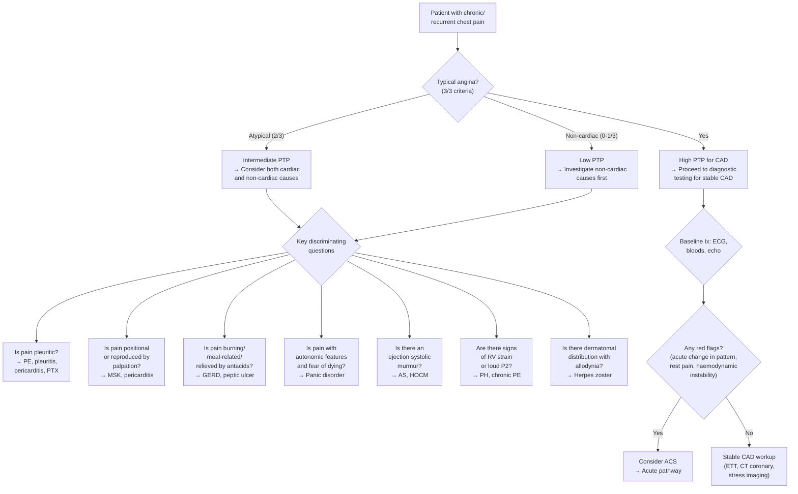

## Differential Diagnosis of Stable Angina

When a patient presents with chest pain on exertion, the primary clinical task is to determine whether this is truly stable angina (i.e., exertional myocardial ischaemia from fixed coronary stenosis) or something else mimicking it. The differential diagnosis is best approached **by system**, because chest pain has cardiac, pulmonary, vascular, gastrointestinal, musculoskeletal, and psychological aetiologies [1][2][3].

The thinking framework is straightforward: you classify the patient's pain as ***typical angina, atypical angina, or non-cardiac chest pain*** [1][2] based on the three ESC criteria (constricting quality, provoked by exertion/emotion, relieved by rest/GTN). Then you systematically consider mimics.

---

### Why Differential Diagnosis Matters in Stable Angina

Unlike ACS — where the urgency is ruling out myocardial necrosis — in stable chest pain the stakes are different. You have more time, but you must not:
1. **Miss a serious alternative** (e.g., subacute PE, aortic stenosis, pulmonary hypertension, malignancy)
2. **Misattribute a benign condition to the heart** (e.g., GERD, musculoskeletal pain), leading to unnecessary invasive testing
3. **Miss exacerbating factors** that are worsening angina in someone with known CAD (e.g., new anaemia, thyrotoxicosis)

---

### Systematic Differential Diagnosis by System

The main differentials for **stable (chronic/recurrent) chest pain** from the lecture slides and senior notes are [1][2]:

#### Potentially Severe Causes

| System | Differential | Key Distinguishing Features | Why It Mimics Stable Angina |
|---|---|---|---|
| **CVS** | ***Stable ischaemic heart disease*** | The diagnosis itself — exertional, predictable, relieved by rest/GTN ≤ 5 min [1][2] | — |
| **CVS** | ***Aortic valve stenosis (AS)*** [1][3] | Exertional chest pain + exertional syncope + exertional dyspnoea (classic triad); ejection systolic murmur radiating to carotids; slow-rising pulse | AS causes angina even with normal coronaries → ↑ afterload + LVH → ↑ O₂ demand + ↓ subendocardial perfusion. The pain is genuinely ischaemic but the primary problem is valvular, not coronary |
| **CVS** | ***Hypertrophic cardiomyopathy (HCMP/HOCM)*** [1][3] | Exertional chest pain + syncope; jerky pulse; double apex beat; systolic murmur ↑ with Valsalva; family history of sudden cardiac death | Massive LVH + dynamic LVOT obstruction → supply-demand mismatch. Pain is truly ischaemic but from myopathy, not epicardial CAD |
| **CVS** | ***Pulmonary hypertension*** [1][5] | Progressive exertional dyspnoea > chest pain; loud P2, RV heave, signs of right HF; exertional syncope | ↑ RV wall stress → subendocardial RV ischaemia; ↓ LV filling from RV failure → ↓ coronary perfusion. Pain is exertional and can be mistaken for angina |
| **Pulmonary** | ***Subacute/chronic pulmonary embolism*** [1] | Pleuritic chest pain, exertional dyspnoea, risk factors for VTE (immobilisation, OCP, malignancy); may present insidiously | Recurrent small PEs can cause chronic exertional dyspnoea and chest discomfort mimicking angina. But pain is usually pleuritic (sharp, ↑ with inspiration), not constricting |
| **Pulmonary** | ***Malignancy with pleural/chest wall involvement*** [1] | Progressive, constant or positional pain; weight loss, haemoptysis; history of smoking/malignancy | Chest wall invasion or pleural involvement causes persistent/progressive pain. Unlike angina, it is not clearly linked to exertion |

#### Relatively Benign Causes

| System | Differential | Key Distinguishing Features | Why It Mimics Stable Angina |
|---|---|---|---|
| **GI** | ***GERD and other oesophageal pathologies*** [1][2][3] | ***Retrosternal burning*** [2]; worse when lying flat, after meals; relieved by antacids/PPI; may be provoked by certain foods; no relation to physical exertion | Oesophagus shares spinal afferent innervation with the heart (T1–T5) → referred pain to the same retrosternal area. **Trap**: GERD can also respond to GTN (because GTN relaxes oesophageal smooth muscle) → false reassurance that "it's cardiac" |
| **MSK** | ***Musculoskeletal chest pain (costochondritis, Tietze syndrome)*** [1][2][3] | ***Sharp pain a/w specific movement or with palpation*** [2]; ***pain after exertion*** (not during) [2]; reproducible on chest wall palpation; localised tenderness at costochondral junctions | Pain from costal cartilage inflammation or intercostal muscle strain. Can be confusing because patients may report it "gets worse with activity" — but the timing is different (after, not during, and not relieved by rest within 5 min). The key is **reproducibility with palpation** |
| **Psych** | ***Psychogenic chest pain / Panic disorder*** [1][6] | ***Chest pain or discomfort*** is one of the DSM-5 panic attack criteria [6]; associated with palpitations, sweating, trembling, SOB, paraesthesias, fear of dying; episodes peak in minutes; history of anxiety/depression | Panic attacks cause sympathetic surge → ↑ HR, ↑ BP → ↑ myocardial O₂ demand; also hyperventilation → chest wall muscle spasm. The patient genuinely feels "cardiac" symptoms. Distinguished by: (1) unpredictable, not clearly linked to physical exertion; (2) peak within minutes then resolve; (3) associated with cognitive symptoms (depersonalisation, fear of dying) |
| **Neuro** | ***Herpes zoster*** [1][3] | Dermatomal pain (burning, sharp) that precedes vesicular rash by days; unilateral; pain persists beyond what exertion would explain | Reactivation of VZV in thoracic dorsal root ganglia → neuropathic pain in a dermatomal distribution. Before the rash appears, it is a diagnostic challenge. Look for allodynia/hyperaesthesia in a band-like distribution |

---

### Cardiac Differentials: Stable Angina vs. ACS — The Critical Distinction

This is the single most important differentiation in any patient presenting with chest pain suggestive of ischaemia [1][2][3][4]:

| Feature | ***Stable Angina*** | ***Acute Coronary Syndrome (ACS)*** |
|---|---|---|
| **Pattern** | ***Occurs only at exertion and relieved by rest or nitrates*** [2] | ***Angina at rest, new-onset (≥ CCS II), increasing angina (↑ frequency/↑ duration/↓ threshold), post-infarct angina*** [4] |
| **Duration** | ***< 5–10 min*** [2] | ***> 20–30 min*** [2] |
| **Onset** | ***Builds up gradually in proportion to intensity of exertion*** [2] | ***Typically takes minutes to develop, may occur at rest or with exertion*** [2] |
| **Response to rest/GTN** | ***Relieved ≤ 5 min*** [2] | ***No relief after resting*** [2] |
| **Autonomic features** | Typically absent | ***Diaphoresis, N/V may occur*** [2] |
| **Severity** | Usually milder | ***Typically more severe in ACS than in stable angina*** [2] |
| **ECG** | May be normal at rest; ST depression with stress | ST elevation (STEMI), ST depression/T-wave inversion (NSTEMI), or normal/non-diagnostic (UA) |
| **Troponin** | **Normal** (no myocardial necrosis) | Elevated in NSTEMI/STEMI; normal in UA |

***The spectrum of ACS*** [3][4]:

| | ***Unstable Angina*** | ***NSTEMI*** | ***STEMI*** |
|---|---|---|---|
| **Clinical** | ***New onset and severe; at rest or minimal exertion; crescendo pattern*** [3] | ***Features of UA + elevated cardiac markers (myocardial necrosis)*** [3] | ***Features of MI + ST-segment elevation on 12-lead ECG*** [3] |
| **Troponin** | Negative | Positive | Positive |
| **ECG** | Normal / ST depression / T-wave changes | ***Persistent ST/T abnormalities*** [4] | ***Persistent ST elevation*** [4] |

<Callout title="When Does Stable Angina Become Unstable?" type="error">

A patient with known stable angina should be suspected of having transitioned to ACS if any of the following develop [4]:
- **Rest angina**: pain at rest lasting > 20 min
- **New-onset angina**: ≥ CCS II severity
- **Crescendo angina**: ↑ frequency, ↑ duration, or ↓ threshold of previously stable angina (to ≥ CCS III)
- **Post-infarct angina**: recurrent angina after recent MI

This is a **medical emergency** — the plaque has likely ruptured/eroded with superimposed thrombosis.

</Callout>

---

### Other Important Differentials to Consider (from Lecture Slides)

***The ESC 2020 table of differential diagnoses*** lists comprehensive mimics that apply to chest pain in general [3]:

| ***Cardiac*** | ***Pulmonary*** | ***Vascular*** | ***Gastrointestinal*** | ***Orthopaedic*** | ***Other*** |
|---|---|---|---|---|---|
| ***Myopericarditis*** | ***Pulmonary embolism*** | ***Aortic dissection*** | ***Oesophagitis, reflux, or spasm*** | ***Musculoskeletal disorders*** | ***Anxiety disorders*** |
| ***Cardiomyopathies*** | ***(Tension) pneumothorax*** | ***Symptomatic aortic aneurysm*** | ***Peptic ulcer, gastritis*** | ***Chest trauma*** | ***Herpes zoster*** |
| ***Tachyarrhythmias*** | ***Bronchitis, pneumonia*** | ***Stroke*** | ***Pancreatitis*** | ***Muscle injury/inflammation*** | ***Anaemia*** |
| ***Acute heart failure*** | ***Pleuritis*** | | ***Cholecystitis*** | ***Costochondritis*** | |
| ***Hypertensive emergencies*** | | | | ***Cervical spine pathologies*** | |
| ***Aortic valve stenosis*** | | | | | |
| ***Takotsubo syndrome*** | | | | | |

**Prevalence data from Fruergaard et al. (Eur Heart J 1996)** cited in the lecture slides [3]:
- ***Gastrointestinal: 42%***
- ***Ischaemic heart disease: 31%***
- ***Chest wall syndrome: 28%***
- ***Pericarditis: 4%***
- ***Pleuritis: 2%***
- ***Pulmonary embolism: 2%***
- ***Lung cancer: 1.5%***
- ***Aortic aneurysm: 1%***
- ***Aortic stenosis: 1%***
- ***Herpes zoster: 1%***

> This is striking — **GI causes are actually the most common cause of chest pain** in general! But in a cardiology clinic or in a patient with risk factors, IHD is more likely. Context matters.

---

### Differentiating by Pain Characteristics — A Practical OPQRST Comparison

| Feature | Stable Angina | ***Pericarditis*** [7] | ***Aortic Dissection*** [7] | ***PE*** [7] | ***GERD*** | ***MSK*** |
|---|---|---|---|---|---|---|
| **Quality** | Dull, constricting, heavy | ***Sharp, knife-like*** [7] | ***Ripping or tearing*** [7] | Pleuritic (sharp) | Burning | Sharp, localised |
| **Provocation** | Exertion, emotion | Inspiration, lying flat | ***Sudden onset, maximal at onset*** [2] | Inspiration, cough | Meals, lying flat | Movement, palpation |
| **Radiation** | L arm, jaw, neck | ***Trapezius ridge (characteristic)*** [7] | ***Back (interscapular)*** [7] | Usually none | Throat | Along chest wall |
| **Relief** | Rest, GTN ≤ 5 min | Sitting up, leaning forward | Nothing relieves | Nothing specific | Antacids, PPI | Analgesics, rest |
| **Duration** | 2–10 min | Hours–days | Sudden, persistent | Persistent | Hours | Variable |
| **Associated** | ± dyspnoea | Pericardial rub, fever | Pulse deficit, new AR murmur, wide mediastinum | ***Haemoptysis*** [7], tachycardia, DVT signs | Regurgitation, dysphagia | Tenderness on palpation |

---

### Diagnostic Approach to Differentiating Stable Angina from Mimics

---

### Key Differentials — Detailed Pathophysiological Explanation

#### 1. GERD vs. Stable Angina

Why this is the trickiest differential:
- Both cause **retrosternal** discomfort
- Both can occur after meals (angina: ↑ cardiac output to splanchnic bed; GERD: acid reflux)
- GERD can respond to GTN (GTN relaxes lower oesophageal sphincter smooth muscle → ↓ reflux transiently → pain relief → false "positive" GTN test)
- Oesophageal spasm can cause intense, squeezing retrosternal pain that is almost indistinguishable from angina

**How to tell them apart**: GERD is rarely exertion-related, typically worse lying flat, worse with certain foods/alcohol, associated with regurgitation/waterbrash/dysphagia, and responds to PPIs over days to weeks.

#### 2. Musculoskeletal Pain vs. Stable Angina

- **Costochondritis** ("costo" = rib, "chondr" = cartilage, "itis" = inflammation) — inflammation at the costochondral or costosternal joints
- ***Tietze syndrome***: costochondritis + visible swelling at the joint
- Key differentiator: **reproducible on palpation**. Angina is NEVER reproducible by pressing on the chest wall (because the pain comes from the heart, not the chest wall)
- Timing: MSK pain is often ***after*** exertion (not during), and may persist for hours [2]

#### 3. Panic Disorder vs. Stable Angina

***Panic disorder*** (Latin: *panikos* = of the god Pan, who caused sudden terror) [6]:
- Chest pain/discomfort is one of the ***DSM-5 criteria for panic attacks*** (along with ≥ 3 of: palpitations, sweating, trembling, SOB, choking sensation, nausea, dizziness, paraesthesias, derealisation, fear of losing control, fear of dying) [6]
- ***Recurrent, unexpected*** panic attacks — at least one followed by ≥ 1 month of persistent concern about further attacks [6]
- Important: **panic disorder is a diagnosis of exclusion** — always rule out cardiac and other organic causes first, especially in patients with cardiovascular risk factors
- Young women with no risk factors who present with episodes of chest tightness + hyperventilation + tingling in hands/feet (respiratory alkalosis from hyperventilation → ↓ ionised Ca²⁺ → paraesthesias) + fear of dying → think panic disorder

#### 4. Vasospastic Angina (Prinzmetal/Variant Angina)

- This is technically angina (genuine myocardial ischaemia), but the mechanism is **coronary artery spasm** rather than fixed stenosis
- Occurs **at rest**, typically nocturnal/early morning (circadian variation in vasomotor tone)
- ECG during episode shows **ST elevation** (transmural ischaemia from complete spasm), not ST depression
- More common in **East Asian populations** (including Hong Kong) — partly due to CYP2C19 polymorphisms affecting endothelial NO metabolism
- Responds to **calcium channel blockers** and **nitrates**, NOT beta-blockers (which can worsen spasm by unopposed alpha-receptor-mediated vasoconstriction)

#### 5. Cardiac Syndrome X (Microvascular Angina)

- Typical angina + positive stress test (ST depression) + normal coronary angiogram
- Due to **coronary microvascular dysfunction** — the small intramural arterioles cannot dilate appropriately
- More common in **post-menopausal women**
- Now recognised under ESC 2019 as a specific entity requiring targeted evaluation (acetylcholine provocation testing, coronary flow reserve measurement)

---

### Summary: Differentiating Stable Angina — The "Rule-In" and "Rule-Out" Approach

**Features that RULE IN stable angina:**
- Predictable, reproducible exertional chest discomfort
- Constricting/heavy quality
- Relieved by rest/GTN within 5 minutes
- Duration 2–10 minutes
- Associated cardiovascular risk factors
- Abnormal stress test / CT coronary findings

**Features that RULE OUT stable angina (suggest alternative diagnosis):**
- ***Sudden onset, maximal at onset*** → aortic dissection, PE, pneumothorax [2]
- ***Sharp, stabbing, ↑ with inspiration*** → pleuritic (PE, pericarditis, pneumothorax) [2]
- ***Tearing pain radiating to back*** → aortic dissection [2][7]
- ***Retrosternal burning*** → GERD [2]
- ***Pain reproduced by palpation/movement*** → musculoskeletal [2]
- ***Pain after exertion*** (not during) → musculoskeletal, psychogenic [2]
- ***Radiation to trapezius ridge*** → pericarditis [7]
- ***Associated with haemoptysis*** → PE [7]
- Dermatomal vesicular rash → herpes zoster
- Panic symptoms (depersonalisation, fear of dying, tingling) → panic disorder [6]
- Pain lasting seconds → rarely cardiac; pain lasting hours → consider MSK, pericarditis, or aortic dissection

<Callout title="High Yield Summary">

**Differential diagnosis of stable angina** is organised by system:

**Cardiac**: ACS (the most critical distinction — change in pattern/rest pain = emergency), aortic stenosis, HOCM, pericarditis, cardiomyopathies, tachyarrhythmias, Takotsubo

**Pulmonary**: Chronic/subacute PE, pulmonary hypertension, pleuritis, pneumonia

**Vascular**: Aortic dissection (sudden, tearing, radiates to back)

**GI**: GERD (most common non-cardiac cause of chest pain overall — 42%), oesophageal spasm, peptic ulcer, pancreatitis, cholecystitis

**MSK**: Costochondritis, Tietze, cervical spine pathology — reproduced by palpation

**Other**: Panic disorder, herpes zoster, anaemia (exacerbating factor)

**Key discriminators**: Onset pattern, quality, provocation/relief, duration, radiation, associated features, and physical examination findings

**Most important distinction**: stable angina vs. ACS — the question is always "has this changed?" New onset, rest, crescendo, or post-infarct angina = ACS until proven otherwise.

</Callout>

---

<ActiveRecallQuiz
  title="Active Recall - Differential Diagnosis of Stable Angina"
  items={[
    {
      question: "A 55-year-old man with known stable angina now reports chest pain at rest lasting > 20 minutes, not relieved by GTN. What is the most likely new diagnosis, and what 4 clinical features distinguish ACS from stable angina?",
      markscheme: "Most likely ACS (unstable angina or MI). Distinguishing features: (1) Pain at rest or minimal exertion vs. exertion only. (2) Duration > 20-30 min vs. < 5-10 min. (3) Not relieved by rest/GTN vs. relieved within 5 min. (4) Associated autonomic features (diaphoresis, N/V) vs. typically absent. Also consider: severity (more severe in ACS), ECG changes (ST elevation/depression), troponin elevation."
    },
    {
      question: "Name the most common non-cardiac cause of chest pain in the general population. Why can GERD be particularly difficult to distinguish from angina?",
      markscheme: "Gastrointestinal causes (42% of chest pain presentations). GERD mimics angina because: (1) Both cause retrosternal discomfort. (2) Both can occur after meals. (3) GERD can respond to GTN (GTN relaxes lower oesophageal sphincter smooth muscle, giving false reassurance). (4) Oesophageal spasm can cause squeezing chest pain. Distinguishing features: GERD is rarely exertion-related, worse lying flat, associated with regurgitation/dysphagia, responds to PPIs."
    },
    {
      question: "A post-menopausal woman has typical exertional angina and a positive exercise stress test (ST depression), but her coronary angiogram shows normal epicardial coronary arteries. What is the diagnosis and the underlying mechanism?",
      markscheme: "Cardiac syndrome X, now termed microvascular angina. Mechanism: coronary microvascular dysfunction — small intramural arterioles cannot dilate appropriately during increased demand, causing genuine subendocardial ischaemia despite patent epicardial arteries. More common in post-menopausal women. ESC 2019 recognises this as a specific entity requiring acetylcholine provocation testing or coronary flow reserve measurement."
    },
    {
      question: "List 3 features in a chest pain history that would make you consider pericarditis rather than stable angina, including the characteristic radiation site.",
      markscheme: "(1) Sharp, knife-like quality (vs. dull/constricting in angina). (2) Aggravated by respiratory movement and lying flat, relieved by sitting up and leaning forward (vs. provoked by exertion, relieved by rest). (3) Radiation to the trapezius ridge (characteristic of pericardial pain — because the phrenic nerve, which innervates the pericardium, arises from C3-C5, the same dermatomes as the trapezius ridge). Also: pericardial friction rub on auscultation, diffuse ST elevation on ECG."
    },
    {
      question: "Why should you always check for anaemia and thyroid function in a patient presenting with new or worsening stable angina?",
      markscheme: "Anaemia decreases O2 carrying capacity (decreased supply), unmasking or worsening ischaemia from a previously compensated coronary stenosis. Thyrotoxicosis increases HR and contractility (increased O2 demand), similarly lowering the threshold for ischaemia. Both are treatable exacerbating factors — correcting them may relieve angina without need for revascularisation. Basic workup: CBC (for anaemia), TFT (for thyrotoxicosis)."
    }
  ]}
/>

## References

[1] Senior notes: Ryan Ho Cardiology.pdf (Section 2.1 Chest Pain, pp. 54–58; Section 3.2.1 Stable Angina, pp. 115–116)
[2] Senior notes: Ryan Ho Fundamentals.pdf (Section 3.1.1 Chest Pain, pp. 199–203)
[3] Lecture slides: GC 028. Accelerating chest pain_Acute coronary (1).pdf (pp. 15–17 — ACS presentation, differential diagnosis table, Fruergaard prevalence data)
[4] Senior notes: Ryan Ho Cardiology.pdf (Section B. Approach to ACS, p. 128 — clinical features distinguishing ACS from stable angina)
[5] Senior notes: Ryan Ho Respiratory.pdf (pp. 137–138 — Pulmonary hypertension classification and clinical features)
[6] Senior notes: Ryan Ho Psychiatry.pdf (pp. 178–179 — Panic disorder, DSM-5 criteria, differential diagnosis)
[7] Lecture slides: GC 088. Sudden Severe Chest Pain.pdf (p. 13 — Differential diagnosis of acute pericarditis, PE, aortic dissection; p. 57 — ACS spectrum)
