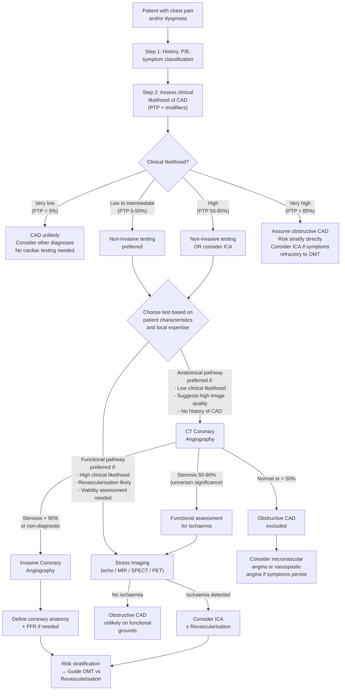

## Diagnostic Criteria for Stable Angina

Unlike ACS or MI, stable angina does **not** have a single set of "diagnostic criteria" like the universal definition of MI. Instead, the diagnosis of stable angina (and its underlying chronic coronary artery disease) rests on a **stepwise, probability-based approach** that integrates clinical assessment, baseline investigations, and targeted diagnostic testing. Let me walk you through this systematically.

### The Fundamental Diagnostic Question

The question is not simply "does this patient have angina?" (that is a clinical/symptom diagnosis). The real question is: **"Does this patient have obstructive coronary artery disease causing their symptoms?"** — because the answer determines prognosis and the need for revascularisation [1][8].

The diagnostic process therefore has two linked goals:
1. **Establish the diagnosis of CAD** — is there haemodynamically significant coronary stenosis?
2. **Risk-stratify** — what is this patient's annual mortality risk, and does it warrant revascularisation?

---

### Step 1 — Clinical Assessment and Symptom Classification

***Diagnosis based on history alone may be difficult*** [1][2] — but it is the essential starting point.

Classify the chest pain using the **three ESC criteria** (covered in prior sections):

| Classification | Criteria Met | Clinical Implication |
|---|---|---|
| ***Typical angina*** | All 3: constricting quality, provoked by exertion/emotion, relieved by rest/GTN ≤ 5 min | Highest PTP → may proceed directly to invasive angiography if very high |
| ***Atypical angina*** | 2 of 3 | Intermediate PTP → non-invasive diagnostic testing most useful |
| ***Non-cardiac chest pain*** | ≤ 1 of 3 | Low PTP → consider non-cardiac causes; testing may not be needed |

Also consider the patient's **demographic profile** (age, sex) and **cardiovascular risk factors** [1][8]:

***Determinants of clinical likelihood of CAD*** [8]:

| ***Decreases Likelihood*** | ***Increases Likelihood*** |
|---|---|
| ***Normal exercise ECG*** | ***Risk factors for CVD (dyslipidaemia, DM, HTN, smoking, family history)*** |
| ***Coronary calcium score (Agatston) = 0*** | ***Resting ECG changes (ST-segment/T-wave changes)*** |
| | ***Abnormal exercise ECG*** |
| | ***LV dysfunction suggestive of CAD*** |
| | ***Coronary calcium on CT*** |

<Callout title="Pre-Test Probability — Why It Matters">

***Different tests have different sensitivity and specificity → suitable for different groups of patients*** [1].

***The test of choice depends on the clinical pre-test probability (PTP) of CAD*** [1]:
- ***PTP < 5%***: CAD very unlikely → **defer testing** (more harm than good from false positives)
- ***PTP 5–15%***: Low probability → **consider testing only if clinical likelihood modifiers increase it**
- ***PTP 15–85%***: This is where **diagnostic testing is most useful** — both anatomical and functional tests have their greatest discriminating power here
- ***PTP > 85%***: **Assume CAD** — testing for diagnosis adds little; proceed to risk stratification (consider direct invasive coronary angiography if symptoms warrant)

***Most imaging-based testing has sensitivity and specificity of ~85%*** → ***if PTP > 85%, then assuming all to be diseased will be superior to performing testing for all individuals; if PTP < 15%, assuming all to be without disease will be superior*** [1].

</Callout>

---

### Step 2 — Baseline Evaluation

Before any diagnostic test, every patient with suspected stable angina needs a **baseline workup** [1]:

| Investigation | What to Look For | Why |
|---|---|---|
| ***Blood tests: CBC, ± TFT*** [1] | ***Anaemia and thyrotoxicosis may exacerbate IHD*** [1] | Anaemia → ↓ O₂ supply; thyrotoxicosis → ↑ O₂ demand. Treating these may resolve "angina" without needing cardiac intervention |
| ***Fasting glucose, HbA1c, ± OGTT*** [1] | Screen for T2DM | DM is a major risk factor and a "coronary equivalent"; changes management (SGLT2i, GLP-1a have cardioprotective effects) |
| ***Fasting lipid profile*** [1] | Screen for dyslipidaemia | Determines need for and intensity of statin therapy; LDL target depends on risk |
| ***RFT*** [1] | ***Baseline renal function (renal dysfunction has negative effect on prognosis of CAD)*** [1] | eGFR affects choice of investigations (contrast nephrotoxicity) and drug dosing |
| ***LFT, CK*** [1] | ***Baseline before starting statin*** [1] | Statins can cause transaminitis and myopathy; need baseline for monitoring |
| ***12-lead ECG at rest*** [1][2] | ***Evidence of previous MI or myocardial damage: pathological Q waves, ST/T changes*** [1]; ***evidence of myocardial ischaemia: reversible ST/T changes, esp. a/w symptoms*** [1]; ***other evidence of cardiac disease: LVH, pre-excitation, arrhythmias, AF*** [2] | May provide clues to CAD (old infarct, LVH from HTN), alternative diagnoses (pre-excitation → WPW), or factors that affect test choice (LBBB makes exercise ECG uninterpretable) |
| ***Resting echocardiography*** [1] | ***Determine LVEF: important prognostic factor in stable CAD*** [1]; ***Detect underlying structural heart disease, esp. VHD and HCMP*** [1]; ***Detect any RWMA as evidence of previous silent infarct*** [1] | ***LVEF is the strongest predictor of long-term survival*** [1]. RWMA at rest = prior infarct. Also identifies non-coronary causes of angina (AS, HOCM). ***Routine baseline echocardiography recommended for all patients*** [1] |
| ***Additional*** [1] | ***Resting cardiac MRI as alternative to echo*** [1]; ***Ambulatory ECG monitoring if suspicion of arrhythmia or vasospastic angina*** [1]; ***CXR if suspicious of pulmonary problems or HF*** [1][2] | Holter captures transient ST changes in vasospastic angina (nocturnal); CXR for cardiomegaly, pulmonary congestion, or non-cardiac causes |

---

### Step 3 — Diagnostic Testing

This is where the PTP guides your test choice. The ESC 2019 guidelines provide a clear framework [8]:

#### The Two Diagnostic Pathways

***There are two main diagnostic pathways*** [8]:

1. **Anatomical pathway** — visualise the coronary arteries directly
   - ***CT coronary angiography (CTCA)*** — first-line anatomical test
   - ***Invasive coronary angiography (ICA)*** — gold standard but invasive

2. **Functional pathway** — detect ischaemia (supply-demand mismatch under stress)
   - ***Exercise tolerance test (ETT / exercise ECG)***
   - ***Stress imaging***: stress echocardiography, stress cardiac MRI, stress myocardial perfusion imaging (SPECT/PET)

> The fundamental distinction: **Anatomical tests** tell you "is there a stenosis?" while **functional tests** tell you "is the stenosis causing ischaemia?" These are complementary questions — a 60% stenosis visible on CT may or may not be haemodynamically significant.

---

## The Master Diagnostic Algorithm (ESC 2019)

***The ESC 2019 diagnostic approach*** [8]:

> ***Step 1***: Assess symptoms and signs
> ***Step 2***: Assess comorbidities and quality of life
> ***Step 3***: Basic testing (ECG, blood tests, echo)
> ***Step 4***: Assess PTP and clinical likelihood
> ***Step 5***: ***Offer diagnostic testing — coronary CTA or testing for ischaemia (imaging testing preferred)*** — ***choice of test based on clinical likelihood, patient characteristics and preference, availability, as well as local expertise*** [8]
> ***Step 6***: ***Choose appropriate therapy based on symptoms and event risk*** [8]

***Two main diagnostic pathways from ESC 2019*** [8]:

| ***Coronary CTA preferentially considered if*** | ***Functional imaging preferentially considered if*** | ***Invasive coronary angiography preferentially considered if*** |
|---|---|---|
| ***Low clinical likelihood*** | ***High clinical likelihood*** | ***High clinical likelihood and severe symptoms inadequately responding to medical therapy*** |
| ***Patient characteristics suggest high image quality*** | ***Revascularisation likely*** | ***Typical angina at low level of exercise and clinical evaluation indicates high risk of events*** |
| ***Local expertise and availability*** | ***Local expertise and availability*** | ***LV dysfunction suggestive of CAD*** |
| ***No history of CAD*** | ***Viability assessment also required*** | ***Uncertain diagnosis on non-invasive testing*** |

---

## Investigation Modalities — Detailed Explanations

### A. Anatomical Tests

#### 1. CT Coronary Angiography (CTCA)

**What it is**: A contrast-enhanced, ECG-gated CT scan that produces high-resolution 3D images of the coronary arteries. "CTA" = CT Angiography — "angio" (Greek: *angeion* = vessel) + "graphy" (*graphein* = to write/image) [8][9].

**How it works**: A large IV bolus of iodinated contrast is injected, and rapid helical CT acquisition is timed to the arterial phase, with ECG gating to minimise cardiac motion artefact. Beta-blockers and GTN are often given pre-scan to slow heart rate and dilate coronaries, improving image quality.

***Often used as a screening test to evaluate coronary artery disease before catheterisation*** [9].

**What it shows**:
- Coronary artery stenoses (location, severity, length)
- Plaque characterisation (calcified vs. non-calcified/soft plaque)
- Coronary anomalies
- Bypass graft patency

**Key findings and interpretation**:

| Finding | Interpretation |
|---|---|
| No stenosis (< 50%) | Obstructive CAD effectively excluded (very high NPV ~95–99%) |
| 50–70% stenosis | Indeterminate — needs functional assessment to determine if haemodynamically significant |
| ***Stenosis > 90%*** [8] | Highly likely to be haemodynamically significant → consider ICA |
| Non-calcified ("soft") plaque | May indicate higher-risk plaque morphology (more prone to rupture) |
| Heavily calcified arteries | "Blooming artefact" may overestimate stenosis severity — limits diagnostic accuracy |

**Advantages**: Non-invasive; very high **negative predictive value (NPV)** → excellent for **ruling out** CAD in low-to-intermediate PTP patients; fast acquisition.

**Limitations**: Ionising radiation; IV contrast (nephrotoxicity, allergy); image quality degraded by: high heart rate (need beta-blockers), arrhythmias (esp. AF), heavy calcification, obesity, inability to breath-hold.

#### 2. CT Calcium Scoring (Agatston Score)

**What it is**: ***Non-contrast CT used to assess degree of calcification of coronary arteries*** [9].

**Principle**: Coronary artery calcification (CAC) is a marker of atherosclerotic plaque burden. The **Agatston score** quantifies the total calcium in the coronary tree.

**Interpretation**:

| Agatston Score | Interpretation |
|---|---|
| **0** | ***Agatston score = 0 → decreases likelihood of CAD*** [8]; very low probability of significant obstructive CAD (NPV ~95–99% for obstructive disease) |
| **1–99** | Mild atherosclerosis |
| **100–399** | Moderate atherosclerosis; increased ASCVD risk |
| **≥ 400** | Severe atherosclerosis; high probability of significant CAD |

**Use**: Primarily a **screening/risk stratification** tool rather than a diagnostic test. Most useful in asymptomatic patients for ASCVD risk reclassification. In symptomatic patients, a score of 0 effectively rules out obstructive CAD (but not vasospastic or microvascular disease).

<Callout title="Calcium Score = 0" type="idea">

A coronary calcium score of zero has excellent NPV for obstructive CAD and is one of the "decreases likelihood" modifiers in the ESC 2019 PTP framework. However, young patients can have significant non-calcified ("soft") plaque with zero calcium — so a zero score does NOT exclude ALL coronary disease, just makes significant obstructive CAD very unlikely.

</Callout>

#### 3. Invasive Coronary Angiography (ICA)

**What it is**: The **gold standard** for defining coronary anatomy. A catheter is threaded (usually via radial or femoral artery) into the coronary ostia, and contrast is injected directly under fluoroscopy.

**What it shows**: Precise luminal anatomy — location, severity (% stenosis), and extent (1-vessel, 2-vessel, 3-vessel, left main disease) of coronary stenoses.

***Indications for invasive coronary angiography for risk stratification*** [1]:
- ***Clinically severe angina (≥ CCS III) or high event risk especially if not responding to OMT*** [1]
- ***Inconclusive diagnosis on non-invasive testing*** [1]
- ***High clinical likelihood and symptoms inadequately responding to medical treatment*** [8]
- ***High event risk based on clinical evaluation (e.g., ST-segment depression combined with symptoms at a low workload or systolic dysfunction indicating CAD)*** [8]

**Key findings and interpretation**:

| Finding | Prognostic Significance |
|---|---|
| Normal coronaries | Excellent prognosis; consider microvascular/vasospastic angina |
| 1-vessel disease (1VD) | Lower risk |
| 2-vessel disease (2VD) | Intermediate risk |
| ***3-vessel disease (3VD)*** | ***High risk*** |
| ***Left main stem (LMS) disease*** | ***Highest risk*** [1] — ***mortality of 1VD < 2VD < 3VD < LMS disease*** [1] |
| Proximal LAD stenosis | Significantly worse prognosis than distal disease |

**Adjunct — Fractional Flow Reserve (FFR) / Instantaneous Wave-Free Ratio (iFR)**:
- Performed during ICA by passing a pressure wire across a stenosis
- **FFR**: ratio of pressure distal to stenosis vs. pressure proximal, measured during maximal hyperaemia (adenosine-induced)
- **FFR ≤ 0.80** = haemodynamically significant → revascularisation indicated
- **iFR ≤ 0.89** = equivalent significance (measured at rest, no adenosine needed)
- **Why this matters**: A 60% stenosis on angiography may or may not be functionally significant — FFR/iFR tells you whether it actually limits flow

**Risks**: Invasive procedure — vascular access complications (haematoma, pseudoaneurysm), contrast nephropathy, stroke, coronary dissection, MI (~0.1%), death (~0.05%).

---

### B. Functional Tests (Tests for Ischaemia)

#### 1. Exercise Tolerance Test (ETT / Exercise ECG / Treadmill Test)

**What it is**: The patient exercises on a treadmill (Bruce protocol) or bicycle ergometer with continuous 12-lead ECG monitoring, BP, and symptom assessment.

**Principle**: Exercise ↑ HR and BP → ↑ myocardial O₂ demand → if a fixed stenosis exists, it cannot augment supply → subendocardial ischaemia → **ST-segment depression** on ECG.

**Protocol (Bruce Protocol)**: Incremental stages every 3 minutes with increasing speed and gradient. Target is ≥ 85% of age-predicted maximum HR (220 − age).

**Key findings and interpretation**:

| Parameter | Positive for Ischaemia | Prognostic Significance |
|---|---|---|
| **ST-segment changes** | ≥ 1 mm horizontal or downsloping ST depression (measured 60–80 ms after J-point) | ST depression is subendocardial ischaemia; ST elevation (rare in ETT) = transmural ischaemia (severe stenosis or spasm) |
| **Exercise capacity** | ***Poor exercise tolerance*** [1] = poor prognosis | Inability to complete Stage 2 Bruce (< 6.5 METs) is associated with worse outcomes |
| **BP response** | Drop in systolic BP > 10 mmHg during exercise | Suggests severe LV dysfunction or multivessel disease — the failing heart cannot augment cardiac output |
| **Symptoms** | Reproduction of typical angina during test | Confirms symptoms are ischaemic |
| **Arrhythmias** | Exercise-induced ventricular arrhythmias | Poor prognosis |

**Duke Treadmill Score (DTS)** — integrates exercise duration, ST deviation, and angina index:
- DTS = exercise time (min) − (5 × max ST deviation in mm) − (4 × angina index)
  - Angina index: 0 = no angina, 1 = non-limiting angina, 2 = exercise-limiting angina
- **DTS ≥ +5**: low risk (annual mortality < 1%)
- **DTS −10 to +4**: intermediate risk
- **DTS ≤ −11**: high risk (annual mortality ≥ 3%)

**Advantages**: Widely available, inexpensive, no radiation, provides functional information (exercise capacity, haemodynamic response).

**Limitations**:
- Sensitivity ~68%, specificity ~77% — moderate at best
- **Cannot be interpreted** if baseline ECG is abnormal: LBBB, paced rhythm, LVH with strain, digoxin use, WPW, > 1 mm baseline ST depression
- **Cannot perform** if patient unable to exercise adequately (arthritis, peripheral vascular disease, deconditioning)
- Lower sensitivity in women (more false positives)

<Callout title="When NOT to Use Exercise ECG" type="error">

Exercise ECG is **uninterpretable** if baseline ECG has: LBBB, paced rhythm, pre-excitation (WPW), LVH with repolarisation abnormalities, digoxin effect, or > 1 mm resting ST depression. In these patients, you MUST use **stress imaging** instead.

If the patient **cannot exercise** (e.g., severe PVD, orthopaedic limitations), use **pharmacological stress** with imaging.

</Callout>

#### 2. Stress Echocardiography

**What it is**: Echocardiography performed at rest and during/after stress (exercise or pharmacological with dobutamine).

**Principle**: Ischaemic myocardium loses contractile function → new or worsening **regional wall motion abnormalities (RWMA)** appear under stress. This exploits the ischaemic cascade — wall motion abnormalities occur BEFORE ECG changes and symptoms.

**What to look for**:

| Rest | Stress | Interpretation |
|---|---|---|
| Normal wall motion | Normal wall motion | Normal — no significant ischaemia |
| Normal wall motion | New hypokinesis/akinesis | **Inducible ischaemia** — haemodynamically significant stenosis in the territory |
| Akinesis at rest | Improves with low-dose dobutamine → worsens at high dose | **Viability** — hibernating myocardium (stunned but alive) → may benefit from revascularisation |
| Akinesis at rest | Remains akinetic | **Scar/infarct** — non-viable → revascularisation unlikely to help |

***Risk stratification by stress imaging*** [1]:
- ***High risk = area of ischaemia > 10%*** (***≥ 3 LV segments for echo***) [1]
- ***Intermediate risk = area of ischaemia 1–10%***
- ***Low risk = no ischaemia*** [1]

**Advantages**: No radiation; assesses both wall motion and valve function; good for viability assessment.

**Limitations**: Operator-dependent; poor acoustic windows in obese/COPD patients; lower sensitivity for single-vessel disease; dobutamine contraindicated in severe arrhythmias.

#### 3. Stress Myocardial Perfusion Imaging (MPI) — SPECT / PET

***Indication: screening and diagnosis of coronary artery disease*** [10].

**What it is**: Nuclear imaging using radiotracers (***Thallium-201 or 99mTc-sestamibi*** [10]) that are taken up by viable myocardium in proportion to blood flow. Images are acquired at rest and after stress.

**Principle — the coronary steal phenomenon** [10]:

***At rest*** [10]:
- ***Partial coronary stenosis limits blood flow to affected myocardium***
- ***Blood flow remains substantial due to collaterals and ischaemia-induced vasodilation***

***With stress*** [10]:
- ***Vessels supplying normal myocardium also dilate***
- ***Blood siphoned to normal myocardium ("steal")***
- ***→ ↓↓ perfusion of affected myocardium → appears as "cold spots" in perfusion scan***

***Interpretation*** [10]:
- ***Normal → homogenous perfusion***
- ***Ischaemia → cold spots when under stress*** (but fills in at rest — "reversible defect")
- ***Infarct → cold spots at rest + under stress*** ("fixed defect")

***Stress can be induced by*** [10]:
- ***Exercise***
- ***Drugs, including vasodilators (e.g., adenosine, dipyridamole) or inotropes (e.g., dobutamine + atropine)***

> ***This is important because compensatory vasodilation in response to hypoxaemia means that significant ischaemia will not set in with < 50% stenosis despite presence of structural lesions detected in anatomical imaging. This gives an advantage to MPI as a functional test over anatomical tests such as cardiac MRI, CT coronary angiography or calcium score*** [10].

**Risk stratification** [1]:
- ***High risk = area of ischaemia > 10% on SPECT*** [1]

**Advantages**: Quantitative assessment of ischaemic burden; high sensitivity (~85–90%); useful in patients who cannot exercise (pharmacological stress); PET offers superior spatial resolution and attenuation correction.

**Limitations**: Ionising radiation; longer acquisition time; expensive (especially PET); lower specificity than CTCA for anatomy; attenuation artefacts (e.g., breast tissue in women, diaphragm in obese men).

#### 4. Stress Cardiac MRI (CMR)

**What it is**: Cardiac MRI with pharmacological stress (adenosine for perfusion or dobutamine for wall motion).

**Principle**: Similar to stress echo and MPI — detects either perfusion defects (adenosine stress CMR) or RWMA (dobutamine stress CMR) indicative of ischaemia.

**What it shows**:
- **First-pass perfusion**: Subendocardial hypoperfusion during stress → bright normal myocardium vs. dark ischaemic territory
- **Late gadolinium enhancement (LGE)**: Gadolinium accumulates in fibrotic/scarred tissue → bright signal = infarct scar → viability assessment (< 50% transmural LGE = viable → may benefit from revascularisation)
- **Wall motion**: Dobutamine stress CMR detects RWMA

**Advantages**: No radiation; excellent spatial resolution; multiparametric (perfusion + wall motion + viability + anatomy in one scan); best for viability assessment.

**Limitations**: Expensive; time-consuming; limited availability; claustrophobia; contraindicated in certain implants (non-MRI-conditional pacemakers, metallic devices); gadolinium contraindicated in severe CKD (nephrogenic systemic fibrosis risk).

---

### Summary Table — Comparison of Diagnostic Modalities

| Modality | What It Detects | Sensitivity | Specificity | Radiation | Best For |
|---|---|---|---|---|---|
| **Exercise ECG** | ST changes (ischaemia) | ~68% | ~77% | None | First-line if can exercise + interpretable ECG; prognostic (Duke score) |
| **CTCA** | Coronary anatomy (stenosis) | ~95–99% | ~64–83% | Yes (low) | ***Rule out CAD*** in low-intermediate PTP; very high NPV |
| **CT calcium score** | Plaque burden | N/A (screening) | N/A | Yes (very low) | Risk stratification; ***score = 0 ↓ likelihood*** |
| **Stress echo** | RWMA (ischaemia) | ~80–85% | ~80–88% | None | Good all-rounder; viability; valve assessment |
| **SPECT MPI** | Perfusion defects | ~85–90% | ~70–75% | Yes | Quantitative ischaemia burden; pharmacological stress |
| **PET MPI** | Perfusion defects | ~90–95% | ~85–90% | Yes | Best nuclear test; quantitative flow reserve; obese patients |
| **Stress CMR** | Perfusion + RWMA + scar | ~86–90% | ~82–86% | None | Viability; comprehensive assessment; good spatial resolution |
| **Invasive angiography** | Coronary anatomy (gold standard) | ~100% (for anatomy) | ~100% | Yes | Definitive anatomy; FFR for functional significance; high-risk patients |

---

### Step 4 — Risk Stratification (Prognostic Evaluation)

Once CAD is diagnosed, **every patient** must be risk-stratified to guide management (medical therapy alone vs. revascularisation) [1]:

***Risk stratification for all-cause mortality in all diagnosed CAD patients → guide need of revascularisation*** [1]:
- ***High risk: mortality ≥ 3%/year → OMT + invasive coronary angiography ± revascularisation*** [1]
- ***Intermediate risk: mortality ≥ 1% but < 3%/year → OMT + consider ICA based on comorbidities and patient preferences*** [1]
- ***Low risk: mortality < 1%/year → trial of OMT only*** [1]

***Prognostic factors*** [1]:

| Factor | Details |
|---|---|
| ***Clinical evaluation*** | ***S/S of HF, pattern and severity of angina*** [1]; ***poor prognosis in recent onset or unstable, poor exercise tolerance*** [1]; ***clinical risk factors: CKD, PVD, prior MI, current smoking, background HTN*** [1]; ***baseline investigations: old infarct on ECG, diabetes, ↑ total cholesterol*** [1] |
| ***LVEF*** | ***Strongest predictor of long-term survival*** [1]; ***LVEF < 50% a/w ↑↑ event risk regardless of severity of ischaemia*** [1]; ***baseline echocardiography recommended for all patients*** [1] |
| ***Stress testing*** | ***Exercise ECG: exercise capacity, BP response, exercise-induced ischaemia, Duke score*** [1]; ***Stress imaging: High risk = area of ischaemia > 10% (> 10% for SPECT, ≥ 3 LV segments for echo)*** [1]; ***Intermediate risk = area of ischaemia 1–10%*** [1]; ***Low risk = no ischaemia*** [1] |
| ***Coronary anatomy*** | ***Number of vessels: mortality of 1VD < 2VD < 3VD < LMS disease*** [1]; evaluated by CTCA or ICA |

---

### The Roadmap — Putting It All Together

***Roadmap to stable IHD (ESC 2013/2019)*** [1]:

1. ***Clinical assessment for clinical presentation and risk factors for IHD*** [1]
2. ***Baseline evaluation: basic blood tests, resting 12-lead ECG, ± echo/cardiac MRI*** [1]
3. ***Diagnostic evaluation: modality of choice based on pre-test probability of CAD*** [1]
   - ***Anatomical test: usually CT coronary angiography*** [1]
   - ***Functional test: exercise tolerance test (ETT), stress imaging (echo, MRI, SPECT, PET)*** [1]
   - ***Invasive coronary angiography*** [1]
4. ***Prognostic evaluation: risk of all-cause mortality determines the need of revascularisation after institution of OMT*** [1]
   - ***Basis: (1) clinical evaluation (2) LVEF (3) stress testing response (4) coronary anatomy*** [1]
5. ***Management: appropriate management (medical vs revascularisation) based on risk of event*** [1]

<Callout title="A Note on Troponin in Stable Angina" type="error">

Troponin should be **normal** in stable angina. Elevated troponin indicates myocardial **necrosis** (i.e., MI, not stable angina). If troponin is elevated in someone you thought had stable angina, reclassify as **NSTEMI** and manage as ACS. This is a critical distinction:

***The universal definition of MI requires: detection of rise and/or fall of cardiac biomarkers (preferably cTn) with ≥ 1 value above 99th percentile URL*** [1] — stable angina, by definition, does NOT meet this criterion.

</Callout>

---

<Callout title="High Yield Summary">

**Diagnostic approach to stable angina is stepwise and probability-based:**

1. **Clinical assessment**: Classify symptoms (typical / atypical / non-cardiac); assess risk factors → determine PTP
2. **Baseline investigations**: Blood tests (CBC, TFT, HbA1c, lipid, RFT, LFT/CK), resting ECG, resting echocardiography (LVEF is the strongest prognostic predictor)
3. **Diagnostic testing** (PTP 15–85%):
   - **Anatomical**: CTCA (excellent NPV for ruling out CAD in low-intermediate PTP); ICA (gold standard for anatomy + FFR)
   - **Functional**: ETT (first-line if interpretable ECG + can exercise), stress echo, stress MPI (SPECT/PET), stress CMR
   - Choice depends on PTP, patient characteristics, local expertise
4. **Risk stratification**: High risk (≥ 3%/y mortality) → OMT + ICA ± revascularisation; Intermediate (1–3%) → OMT + consider ICA; Low (< 1%) → OMT alone
5. **Key prognostic factors**: LVEF (strongest), stress test response (ischaemic burden), coronary anatomy (LMS > 3VD > 2VD > 1VD), clinical factors

**Critical points**:
- Troponin is NORMAL in stable angina (elevated = MI → reclassify)
- Exercise ECG is uninterpretable with LBBB, pacing, WPW, LVH, digoxin
- Calcium score = 0 has high NPV for obstructive CAD
- MPI uses coronary steal principle: stress causes blood to be "stolen" from diseased territory → cold spots
- FFR ≤ 0.80 during ICA = haemodynamically significant → revascularise

</Callout>

---

<ActiveRecallQuiz
  title="Active Recall - Diagnosis and Investigations for Stable Angina"
  items={[
    {
      question: "A 52-year-old man with typical angina (all 3 ESC criteria) and multiple risk factors has a PTP of ~30%. According to ESC 2019, what are the two main diagnostic pathways, and which would you prefer in this patient? Justify your choice.",
      markscheme: "Two pathways: (1) Anatomical — CT coronary angiography; (2) Functional — stress imaging (echo/MRI/SPECT/PET). For PTP ~30% (low-to-intermediate), CTCA is preferred because it has excellent NPV to rule out CAD. If CTCA shows 50-90% stenosis of uncertain significance, proceed to functional testing. Functional imaging preferred if higher PTP, if revascularisation is likely, or if viability assessment needed."
    },
    {
      question: "Explain the coronary steal phenomenon that underlies myocardial perfusion imaging. What is the key difference in MPI findings between ischaemia and infarction?",
      markscheme: "At rest, stenosed territory maintains adequate flow via collaterals and compensatory vasodilation. During pharmacological stress (adenosine/dipyridamole), normal vessels also dilate — blood is 'stolen' from diseased territory to normal myocardium, worsening the perfusion differential. Ischaemia: cold spot on stress images that fills in at rest (reversible defect). Infarction: cold spot on both stress AND rest images (fixed defect — non-viable tissue cannot take up tracer)."
    },
    {
      question: "List 4 situations in which exercise ECG is uninterpretable and state what alternative investigation you would use instead.",
      markscheme: "Exercise ECG uninterpretable with: (1) LBBB, (2) Paced rhythm, (3) Pre-excitation/WPW, (4) LVH with repolarisation abnormalities, (5) Digoxin effect, (6) More than 1 mm baseline ST depression. Alternative: stress imaging (stress echo, stress CMR, or stress MPI with SPECT/PET) — these detect RWMA or perfusion defects which are independent of baseline ECG abnormalities."
    },
    {
      question: "What is the strongest single predictor of long-term survival in stable CAD, and how is it measured? At what threshold does event risk increase significantly?",
      markscheme: "LVEF (left ventricular ejection fraction) is the strongest predictor. Measured by resting echocardiography (recommended baseline for all patients) or cardiac MRI. LVEF < 50% is associated with significantly increased event risk regardless of severity of ischaemia. This is why baseline echo is recommended for ALL patients with suspected stable CAD."
    },
    {
      question: "During invasive coronary angiography, a 65% stenosis is found in the mid-LAD. How do you determine if this stenosis is haemodynamically significant? What threshold values indicate revascularisation is warranted?",
      markscheme: "Use Fractional Flow Reserve (FFR) or instantaneous wave-free ratio (iFR). FFR: pressure wire measures ratio of distal to proximal pressure during maximal hyperaemia (adenosine). FFR 0.80 or less = haemodynamically significant = revascularisation indicated. iFR 0.89 or less (measured at rest, no adenosine needed) is equivalent. A 65% stenosis may or may not be significant — anatomy alone is insufficient; functional significance must be proven."
    },
    {
      question: "State the ESC 2019 risk stratification thresholds for annual mortality in diagnosed stable CAD and the corresponding management approach for each category.",
      markscheme: "High risk: annual mortality 3% or more — OMT plus invasive coronary angiography plus or minus revascularisation. Intermediate risk: annual mortality 1-3% — OMT plus consider ICA based on comorbidities and patient preferences. Low risk: annual mortality less than 1% — trial of OMT only. Prognostic factors: clinical evaluation, LVEF (strongest), stress testing response, coronary anatomy (1VD < 2VD < 3VD < LMS disease)."
    }
  ]}
/>

## References

[1] Senior notes: Ryan Ho Cardiology.pdf (Section 3.2.1 Stable Angina — Evaluation, pp. 115–120)
[2] Senior notes: Ryan Ho Fundamentals.pdf (Section 3.1.1 Chest Pain, pp. 199–203)
[8] Lecture slides: GC 032. Chest pain on exertion_ischaemic heart disease; angina pectoris.pdf (pp. 27, 45, 79 — Clinical likelihood of CAD, ESC 2019 diagnostic approach, diagnostic pathways)
[9] Senior notes: Ryan Ho Diagnostic Radiology.pdf (pp. 43, 57 — CT angiography, cardiac CT, myocardial perfusion imaging)
[10] Senior notes: Ryan Ho Diagnostic Radiology.pdf (p. 57 — MPI technique, coronary steal phenomenon, interpretation)
