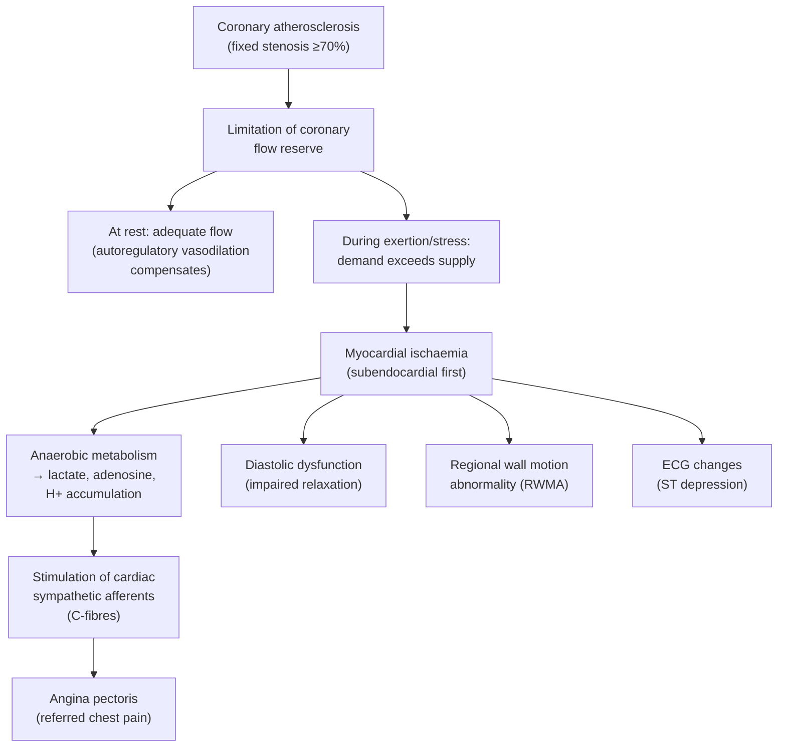
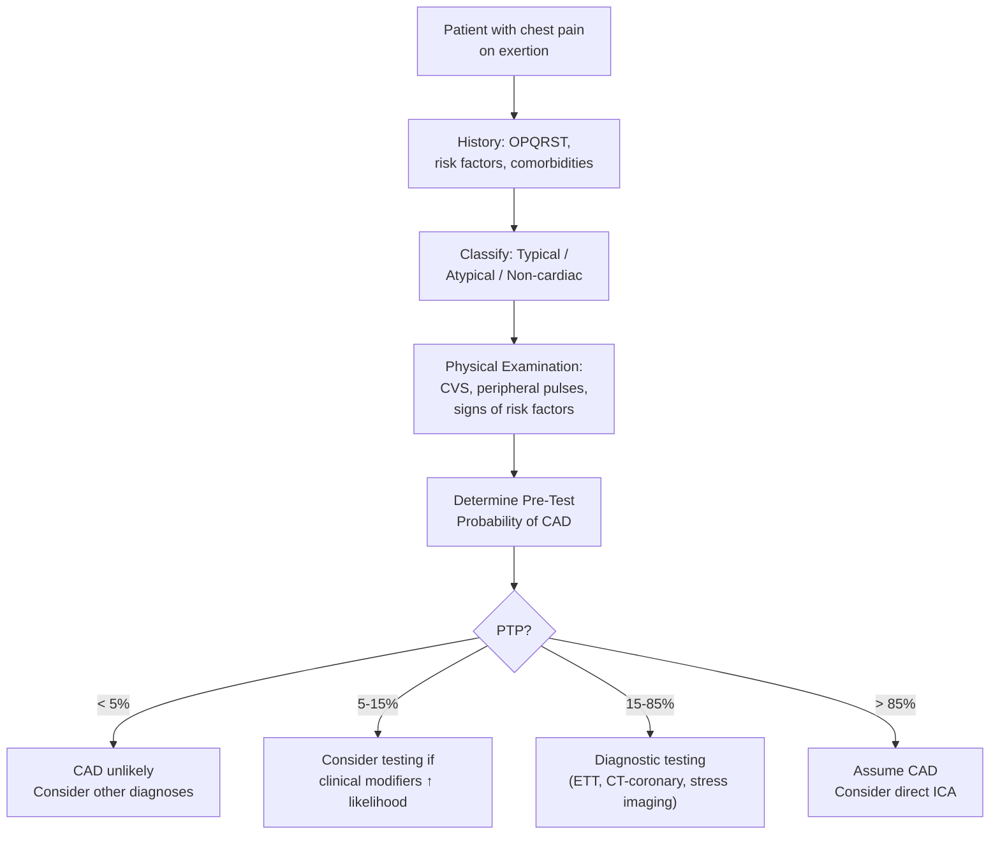

## Definition

Stable angina — or more precisely, **stable angina pectoris** — is the clinical symptom complex arising from reversible myocardial ischaemia that occurs predictably when myocardial oxygen (O₂) demand exceeds supply, typically provoked by exertion or emotional stress, and relieved by rest or sublingual nitrates [1][2].

Let's break the name down:
- **Angina** (Latin: *angere* = to squeeze/choke) — refers to the strangling, constricting quality of the chest discomfort
- **Pectoris** (Latin: *pectus* = chest) — localises it to the chest

So *angina pectoris* literally means "a choking sensation in the chest."

The word "**stable**" is critical — it distinguishes this from **acute coronary syndromes (ACS)**. In stable angina, the pattern of symptoms is reproducible and predictable over weeks to months: the same level of exertion provokes pain, and it relieves the same way each time. This implies a **fixed, flow-limiting coronary stenosis** rather than an acutely disrupted plaque [1][2].

<Callout title="Key Conceptual Distinction">
***Stable angina = angina with exertion only → implies stable coronary artery disease in which ischaemia only occurs when demand ↑*** [1][2].

***ACS (unstable angina/MI) = angina at rest → implies acute coronary event in which ischaemia occurs even when demand is not ↑*** [1][2]. This is a medical emergency.
</Callout>

The underlying condition is **chronic coronary syndromes (CCS)** — the 2019 ESC terminology that replaced the older "stable ischaemic heart disease" (SIHD) or "stable coronary artery disease" [3]. This updated terminology reflects the understanding that coronary artery disease (CAD) is a dynamic, lifelong process that may be stable for prolonged periods but can become unstable at any time due to plaque rupture or erosion.

> **Indicates: myocardial O₂ supply < demand** [1]
> - ***↓ supply due to fixed obstruction by coronary atheroma*** [1]
> - ***↑ demand due to other heart diseases (esp. AS, HCMP)*** [1]

---

## Epidemiology

### Global and Hong Kong Context

- ***Angina is most common in middle-aged and elderly men*** [3]
- ***Among persons 60–79 years of age, approximately 25% of men and 16% of women have coronary heart disease; these figures rise to 37% and 23% among men and women > 80 years of age, respectively*** [3]
- ***The incidence of coronary heart disease and angina in women after menopause is similar to that of men*** [3] — because loss of oestrogen's protective effect on the vasculature (oestrogen promotes NO-mediated vasodilation and has favourable lipid effects)
- ***Although the survival rate has steadily improved over time, IHD remains the number one cause of death in men and women (27% of deaths)*** [3]
- ***The initial manifestation of IHD is angina pectoris in ~50%, and about 50% of patients presenting to the hospital with ACS have preceding angina*** [3]
- ***In the US, the annual rate of MI in patients with symptomatic angina is 3–3.5%/year*** [3]
- ***Within 12 months of initial diagnosis, 10–20% of patients with a diagnosis of stable angina progress to MI or unstable angina*** [3]

**In Hong Kong specifically:**
- IHD is among the top 3 leading causes of death (alongside cancer and cerebrovascular disease)
- High prevalence of cardiovascular risk factors: Hong Kong has increasing rates of diabetes mellitus (~10% of the population), hypertension (~27%), and obesity, partly driven by a westernising diet and sedentary lifestyles
- Smoking prevalence in HK is relatively lower (~10%) compared to other regions but still a significant contributor
- The ageing population in HK amplifies the burden of CAD

<Callout title="High Yield Epidemiology Points" type="idea">

Key exam points:
1. IHD is the **#1 killer** globally and in HK
2. Stable angina is the **first manifestation of IHD in ~50%** of patients
3. Post-menopausal women "catch up" to men in incidence
4. 10–20% of newly diagnosed stable angina patients progress to MI/UA within 12 months — this underscores why risk stratification and optimal medical therapy are essential

</Callout>

---

## Risk Factors

Risk factors for stable angina are essentially the risk factors for **atherosclerosis** — because the pathological substrate is coronary atheroma.

### Non-Modifiable Risk Factors [1][2]

| Factor | Mechanism / Why |
|---|---|
| ***Advanced age*** | Cumulative endothelial damage + longer exposure to risk factors; arterial stiffening |
| ***Male sex*** | Earlier onset than females by ~10 years; pre-menopausal oestrogen is protective (↑NO, ↑HDL, ↓LDL) |
| ***Family history of premature CVD*** (1st degree relative: male < 55y, female < 65y) | Genetic susceptibility to dyslipidaemia, endothelial dysfunction, inflammation; familial hypercholesterolaemia (FH) is a key example [4][5] |

### Modifiable Risk Factors [1][2][3]

| Factor | Mechanism / Why |
|---|---|
| ***Cigarette smoking*** | Endothelial damage via oxidative stress; ↑platelet aggregation; ↑fibrinogen; ↓HDL; promotes a pro-inflammatory, pro-thrombotic state |
| ***Hypertension*** | Shear stress damages endothelium → promotes atheroma formation; LV hypertrophy → ↑O₂ demand; target < 130/80 mmHg per 2023 ESH guidelines |
| ***Dyslipidaemia*** (↑LDL, ↓HDL, ↑TG) | LDL oxidation in arterial wall is the initiating event of atherosclerosis; HDL performs reverse cholesterol transport (protective). Familial hypercholesterolaemia (FH) causes extremely high LDL and premature ASCVD [4][5] |
| ***Diabetes mellitus*** | Chronic hyperglycaemia → advanced glycation end-products (AGEs) → endothelial dysfunction + oxidative stress; insulin resistance → dyslipidaemia (↑TG, ↓HDL, small dense LDL) + pro-inflammatory state [6] |
| ***Obesity (esp. abdominal/central)*** | Adipocytes release FFAs → insulin resistance; adipokines promote inflammation; metabolic syndrome clustering [6] |
| ***Sedentary lifestyle / lack of exercise*** | Physical inactivity → ↓AMPK activation → ↓glucose uptake, ↓FFA oxidation → insulin resistance; exercise also ↑HDL, ↓BP, ↓weight [6] |
| ***Unhealthy diet*** | High saturated fat/trans fat → ↑LDL; high sodium → ↑BP; low fruit/vegetable → ↓antioxidants |

### Other Contributing / Exacerbating Factors

These don't cause atherosclerosis per se but can unmask or worsen stable angina:

| Factor | Why it matters |
|---|---|
| ***Anaemia*** | ↓ O₂ carrying capacity → ↓ O₂ supply to myocardium even at rest or lower exertion thresholds [1][2] |
| ***Thyrotoxicosis*** | ↑ metabolic rate → ↑ HR, ↑ contractility → ↑ myocardial O₂ demand; may precipitate angina in previously compensated patients [1][2] |
| ***Aortic stenosis (AS)*** | ↑ afterload → LV hypertrophy → ↑ O₂ demand + ↓ coronary perfusion (compressed subendocardial vessels) [1] |
| ***Hypertrophic cardiomyopathy (HCMP/HOCM)*** | Massive LV hypertrophy → ↑ O₂ demand; dynamic LVOT obstruction → ↓ coronary perfusion; abnormal intramural coronary arteries [1] |
| ***Tachyarrhythmias (esp. AF)*** | ↑ HR → ↑ O₂ demand + ↓ diastolic filling time (coronary perfusion occurs primarily in diastole) |

<Callout title="Exacerbating Factors — Why They Matter" type="error">

A common exam pitfall: Students list risk factors for atherosclerosis but forget about conditions that **exacerbate** angina without necessarily causing new atheroma. Always consider **anaemia, thyrotoxicosis, aortic stenosis, and tachyarrhythmias** as precipitating/aggravating factors in a stable angina patient — these are treatable and their correction may relieve symptoms without revascularisation.

</Callout>

---

## Anatomy and Function — Coronary Arterial Supply

Understanding coronary anatomy is essential because stable angina results from **fixed stenosis** in these vessels.

### Coronary Artery Anatomy

The heart receives its blood supply from the **left coronary artery (LCA)** and **right coronary artery (RCA)**, both arising from the **aortic root** just above the aortic valve cusps (the left and right coronary sinuses of Valsalva).

| Artery | Branches | Territory Supplied |
|---|---|---|
| **Left Main Stem (LMS)** | Divides into LAD and LCx | Very short (0.5–2 cm); stenosis here = "left main disease" → high mortality |
| **Left Anterior Descending (LAD)** | Diagonal branches, septal perforators | Anterior wall of LV, anterior 2/3 of interventricular septum, apex |
| **Left Circumflex (LCx)** | Obtuse marginal (OM) branches | Lateral wall of LV; inferior wall if left-dominant |
| **Right Coronary Artery (RCA)** | Posterior descending artery (PDA), AV nodal artery, acute marginal | Inferior wall of LV, posterior 1/3 of interventricular septum, RV, SA and AV nodes (in right-dominant circulation) |

### Dominance

- **Right dominant (~85%)**: PDA arises from RCA → RCA supplies inferior wall and AV node
- **Left dominant (~8%)**: PDA arises from LCx
- **Co-dominant (~7%)**: PDA supplied by both

> **Why dominance matters clinically**: An inferior MI from RCA occlusion may cause AV nodal ischaemia → heart block (because the AV nodal artery usually comes off the RCA).

### Coronary Physiology — The Supply-Demand Balance

This is the fundamental concept underlying stable angina:

**Myocardial O₂ Supply** depends on:
1. **Coronary blood flow** (main determinant)
   - Occurs predominantly in **diastole** (during systole, the contracting myocardium compresses intramural vessels)
   - Regulated by coronary vascular resistance → mediated by metabolic autoregulation (adenosine, NO, prostacyclin)
2. **O₂ content of blood** (Hb concentration × SaO₂)

**Myocardial O₂ Demand** depends on:
1. **Heart rate** — the single most important determinant (more beats = more O₂ consumed, and ↓ diastolic time = ↓ coronary filling)
2. **Myocardial wall tension** (= afterload, related to systolic BP)
3. **Contractility** (inotropy)
4. **Preload** (ventricular volume → wall stress via Laplace's law: Wall tension = Pressure × Radius / 2 × Wall thickness)

The **rate-pressure product** (RPP = HR × systolic BP) is a clinical surrogate for myocardial O₂ demand. In stable angina, symptoms characteristically occur at a **reproducible RPP threshold** — i.e., the same level of exertion causes the same angina every time.

<Callout title="Why Coronary Flow Reserve Matters">

At rest, coronary arteries can dilate 4–6× their baseline calibre (coronary flow reserve). A stenosis of ~50% diameter starts to impair maximal flow reserve. A stenosis of **~70% diameter** significantly limits flow during exertion. A stenosis of **~90%** may limit flow even at rest. In stable angina, the stenosis is typically **≥ 70%** (or **≥ 50% for left main**), enough to limit flow when demand increases but not at rest.

</Callout>

---

## Etiology (with Hong Kong Focus) and Pathophysiology

### Etiology

The overwhelmingly dominant cause of stable angina is **coronary atherosclerosis** — the fixed, flow-limiting atherosclerotic plaque [1][7].

However, a comprehensive list of aetiologies includes:

#### 1. Coronary Atherosclerosis (Commonest — >95%)

This is a **chronic, progressive, inflammatory disease** of the arterial wall. In stable angina, the plaque is characteristically:
- **Fixed** (not acutely ruptured)
- Has a **thick fibrous cap** (stable plaque) with a relatively small lipid core
- Causes **luminal narrowing ≥ 70%** → haemodynamically significant stenosis

**Why does atherosclerosis preferentially affect certain coronary sites?**
- Atheroma forms at **branch points and bifurcations** (e.g., LAD/LCx bifurcation, proximal LAD) due to **disturbed laminar flow** → oscillatory shear stress → endothelial dysfunction

**Hong Kong relevance:**
- The high prevalence of diabetes, hypertension, and dyslipidaemia in Hong Kong's ageing population drives atherosclerotic burden
- Dietary westernisation (more red meat, processed foods) alongside a traditionally high-sodium Chinese diet compounds risk
- Familial hypercholesterolaemia (FH), prevalence ~1/250–1/500, is significantly underdiagnosed in HK; these patients develop premature severe CAD [4][5]

#### 2. Non-Atherosclerotic Causes of Stable Angina (Rare but Important)

| Cause | Mechanism |
|---|---|
| **Coronary vasospasm (Prinzmetal/variant angina)** | Focal coronary artery spasm → transient ↓ supply; can occur at rest (typically nocturnal); more common in East Asian populations including Hong Kong (higher prevalence of CYP2C19 polymorphisms that affect endothelial NO pathways) |
| **Coronary microvascular disease (cardiac syndrome X)** | Dysfunction of small intramural coronary arterioles → impaired microvascular vasodilation; more common in women; normal epicardial coronary arteries on angiography |
| **Myocardial bridging** | A segment of epicardial coronary artery (usually mid-LAD) dips into the myocardium → systolic compression; usually benign but can cause exertional ischaemia |
| **Coronary artery anomalies** | Anomalous origin/course (e.g., interarterial course between aorta and pulmonary artery) → compression during exertion |
| **Coronary arteritis** | Takayasu, giant cell arteritis, Kawasaki disease (important in paediatrics) → coronary inflammation and stenosis |

#### 3. Non-Coronary Causes of Angina (Supply-Demand Mismatch Without Primary Coronary Disease)

| Cause | Mechanism |
|---|---|
| ***Aortic stenosis (AS)*** | ↑ afterload → LVH → ↑ O₂ demand; ↓ coronary perfusion pressure gradient |
| ***Hypertrophic cardiomyopathy (HCMP)*** | Massive LVH + LVOT obstruction → supply-demand mismatch |
| ***Severe anaemia*** | ↓ O₂ carrying capacity |
| ***Thyrotoxicosis*** | ↑ HR, contractility → ↑ demand |
| ***Severe hypertension*** | ↑ afterload → ↑ wall tension → ↑ O₂ demand |

### Pathophysiology of Stable Angina

The pathophysiology can be understood as a chain of events:

#### The Ischaemic Cascade (Critical Concept)

When myocardial ischaemia develops, events do NOT occur simultaneously — they follow a temporal sequence called the **ischaemic cascade**:

1. **Metabolic abnormalities** (↓ ATP, lactate accumulation) — earliest
2. **Diastolic dysfunction** (impaired relaxation — because active relaxation requires ATP)
3. **Systolic dysfunction** (regional wall motion abnormalities — hypokinesis/akinesis)
4. **ECG changes** (ST-segment depression in stable angina — because ischaemia is subendocardial)
5. **Angina** (chest pain/discomfort) — latest

> **Why is this important?** Because **ECG changes and wall motion abnormalities precede symptoms**. A patient may have "silent ischaemia" detectable on stress testing before they ever feel chest pain. This is particularly common in **diabetics** (autonomic neuropathy impairs pain perception) and the **elderly**.

***Pathophysiology: myocardial ischaemia → metabolite accumulation → stimulation of cardiac sympathetic nerves → pain*** [1][2]

#### Why Subendocardial Ischaemia First?

The subendocardium (innermost layer of the myocardium) is most vulnerable to ischaemia because:
1. It experiences the **highest wall tension** (highest intramyocardial pressure during systole → most compressed)
2. It has the **longest intramural vessels** → flow is most impeded
3. It receives blood **last** in the myocardial perfusion sequence

In stable angina with a fixed stenosis, ischaemia during exertion is characteristically **subendocardial** → this explains why the ECG shows **ST-segment depression** (not ST elevation, which indicates **transmural** ischaemia as in STEMI).

#### Why Does Angina Radiate to the Arm and Jaw?

The cardiac sympathetic afferent nerve fibres (C-fibres) that transmit ischaemic pain enter the spinal cord at **C8–T4** segments. These same spinal segments also receive somatic sensory input from the:
- Chest wall
- Left arm (especially medial aspect — T1 dermatome)
- Jaw (via trigeminal-spinal connections at upper cervical levels)

The brain **cannot distinguish** between cardiac and somatic pain at the same spinal level → **convergence-projection theory** → the brain "projects" the pain to the somatic territory → **referred pain**.

#### Pathophysiology of Atherosclerosis (First Principles)

Since atherosclerosis is the primary cause, understanding its pathogenesis is fundamental:

1. **Endothelial injury/dysfunction**: Risk factors (shear stress, smoking, HTN, hyperglycaemia, hyperlipidaemia) → endothelial damage → ↑ permeability, ↓ NO production
2. **Lipid infiltration**: LDL crosses damaged endothelium → becomes trapped in the subintima → oxidised (ox-LDL)
3. **Inflammatory response**: ox-LDL triggers monocyte recruitment → monocytes differentiate into macrophages → engulf ox-LDL → become **foam cells** → fatty streak
4. **Smooth muscle cell migration**: SMCs migrate from media to intima, proliferate, and produce **extracellular matrix** (collagen, proteoglycans) → formation of a **fibrous cap**
5. **Mature plaque**: Lipid core covered by fibrous cap → progressive luminal narrowing
6. **Stable vs. unstable plaque**:
   - **Stable plaque**: thick fibrous cap, small lipid core, predominantly collagen-rich → causes **fixed stenosis** → **stable angina**
   - **Unstable/vulnerable plaque**: thin fibrous cap, large lipid core, rich in macrophages/inflammatory cells → prone to **rupture** → thrombus formation → **ACS**

---

## Classification

### Classification by Symptom Severity — The CCS (Canadian Cardiovascular Society) Grading System

This is the standard classification used for grading the **severity** of stable angina [1][2]:

| ***CCS Grade*** | Description | Functional Impact |
|---|---|---|
| ***I*** | ***Angina with strenuous exertion only*** | Ordinary physical activity (walking, climbing stairs) does NOT cause angina |
| ***II*** | ***Angina with moderate exertion (slight limitation of ordinary activities)*** | Walking > 2 blocks on level ground or climbing > 1 flight of stairs at a normal pace |
| ***III*** | ***Angina with mild exertion (e.g., 100–200 m, 1 flight of stairs) — great limitation*** | Marked limitation of ordinary physical activity |
| ***IV*** | ***Angina at rest (cannot carry out any exertion)*** | Inability to perform any physical activity without discomfort; angina may be present at rest |

<Callout title="CCS Class IV vs. Unstable Angina" type="error">

CCS class IV describes angina at rest that occurs in a **predictable, chronic pattern** as part of severe stable CAD. This is different from **unstable angina** (ACS), where rest angina represents a **new or worsening** pattern due to acute plaque disruption. The distinction is about the **tempo and trajectory**: stable CCS IV = chronic and unchanging; unstable = acute change in character, frequency, or threshold.

</Callout>

### Classification by Underlying Mechanism

| Type | Mechanism | Notes |
|---|---|---|
| **Type 1: Classic exertional angina** | Fixed epicardial coronary stenosis (atherosclerosis) | Most common; demand-driven ischaemia |
| **Type 2: Vasospastic angina (Prinzmetal/variant)** | Coronary artery spasm | Rest angina, often nocturnal; ST elevation during episodes; more common in East Asians |
| **Type 3: Microvascular angina** | Coronary microvascular dysfunction | Angina with positive stress test but normal coronary angiogram; more common in women |

### ESC 2019 Clinical Scenarios of Chronic Coronary Syndromes

The ESC 2019 guidelines define six clinical scenarios under chronic coronary syndromes (CCS):

1. Patients with suspected CAD and "stable" anginal symptoms and/or dyspnoea
2. Patients with new onset of HF or LV dysfunction and suspected CAD
3. Asymptomatic and symptomatic patients with stabilised symptoms < 1 year after ACS or recent revascularisation
4. Asymptomatic and symptomatic patients > 1 year after initial diagnosis or revascularisation
5. Patients with angina and suspected vasospastic or microvascular disease
6. Asymptomatic subjects in whom CAD is detected at screening

Stable angina primarily falls under **scenarios 1 and 4**.

---

## Clinical Features

### Symptoms

The hallmark symptom is **chest discomfort** — note that patients often resist calling it "pain" and prefer terms like "discomfort," "pressure," or "tightness."

#### Character of Pain (OPQRST Framework)

| Feature | Description | Pathophysiological Basis |
|---|---|---|
| **Onset / Provocation** | ***Builds up gradually in proportion to intensity of exertion*** [1][2]; provoked by the "***4 Es***": **Eating, Exertion, Emotion, Environment (cold)** [2] | Exertion ↑ HR and BP → ↑ O₂ demand → exceeds supply from fixed stenosis. Cold weather causes coronary vasoconstriction + ↑ afterload (peripheral vasoconstriction). Heavy meals redirect blood to splanchnic circulation → "coronary steal" + ↑ cardiac workload |
| **Quality** | ***Typically dull, constricting, choking, 'heavy'***; described as ***squeezing, crushing, burning, aching or even as breathlessness*** [1][2]; ***patients often emphasise it is a discomfort not a pain*** [1][2]; ***Levine's sign: characteristic gesture of a clenched fist on chest when describing angina*** [1][2] | Visceral pain from cardiac sympathetic C-fibre activation → poorly localised, deep, visceral quality (not sharp/well-localised like somatic pain) |
| **Region and Radiation** | **Retrosternal/central chest**; ***± radiation to arms (especially left), shoulder, jaw, neck, epigastrium*** [1] | Referred pain via convergence of cardiac sympathetic afferents (C8–T4) with somatic afferents at the same spinal segments |
| **Severity** | Variable; ***typically graded by CCS classification (I–IV)*** [2]; generally less severe than ACS | Degree of ischaemia depends on severity of stenosis and extent of demand increase |
| **Timing / Duration** | ***Usually lasts 2–10 minutes*** [2]; ***relieved by rest or cessation of activity/stress, or by sublingual nitrates (relieved ≤ 5 min after rest)*** [2] | Rest → ↓ HR, BP → ↓ demand → supply meets demand again. Nitrates → venodilation → ↓ preload → ↓ wall tension → ↓ demand (+ some coronary vasodilation) |
| **Associated features** | Mild dyspnoea (angina equivalent), fatigue | Ischaemia → diastolic dysfunction → ↑ LVEDP → pulmonary congestion → dyspnoea |

<Callout title="Angina Equivalents">

***25% of patients with myocardial ischaemia may not suffer from angina (especially elderly and diabetics). They may present with angina equivalents — meaning these symptoms represent myocardial ischaemia even without classic chest pain*** [2]. These include:
- **Exertional dyspnoea** (most common equivalent)
- **Fatigue / exercise intolerance**
- **Epigastric discomfort**
- **Syncope / dizziness**

Why diabetics? Diabetic autonomic neuropathy damages cardiac sensory afferents → "silent ischaemia."

</Callout>

#### Special Patterns

- ***Angina decubitus***: ***Angina occurring when lying supine due to ↑ venous return (VR) → ↑ preload → ↑ O₂ demand*** [2]. This is a sign of more severe disease.
- **Walk-through angina**: Angina that occurs at the start of exertion but eases with continued activity → thought to be due to coronary vasodilation with sustained exercise (ischaemic preconditioning)
- **First-effort angina**: Worse with first effort of the day, then improves — related to ischaemic preconditioning
- **Post-prandial angina**: Worsened after large meals (splanchnic blood diversion)
- **Cold-weather angina**: Cold → peripheral vasoconstriction → ↑ afterload → ↑ demand; also direct coronary vasoconstriction

#### The Three Criteria for "Typical" Angina (ESC Definition)

***A chest pain is classified as*** [1][3]:

| Classification | Criteria Met |
|---|---|
| **Typical angina** | All 3 of: (1) Constricting discomfort in the chest, neck, jaw, shoulder, or arm; (2) Provoked by physical exertion or emotional stress; (3) Relieved by rest and/or GTN within 5 minutes |
| **Atypical angina** | 2 of 3 criteria |
| **Non-cardiac chest pain** | ≤ 1 criterion |

### Signs

***Physical examination is frequently unremarkable*** in stable angina [1]. However, a thorough examination may reveal:

#### Signs to Look For and Why

| Sign | What It Tells You | Pathophysiological Basis |
|---|---|---|
| ***Evidence of VHD, esp. AS, AR, HOCM*** [1] | Non-coronary cause of angina or exacerbating factor | AS: ↑ afterload + LVH → ↑ demand; AR: volume overload → LV dilatation → ↑ wall tension; HOCM: massive LVH + dynamic obstruction |
| ***Risk factors: HTN, DM*** [1] | Underlying atherosclerotic risk | Confirm modifiable risk factors for targeted management |
| ***LV dysfunction: cardiomegaly, gallop rhythm (S3/S4)*** [1] | Previous MI with LV remodelling | S4 = non-compliant, stiff LV (diastolic dysfunction from chronic ischaemia/LVH); S3 = volume overload (systolic dysfunction, HF) |
| **Xanthomas, xanthelasma, corneal arcus (< 45 y)** | Hypercholesterolaemia, possibly FH [4] | Lipid deposition in tendons (tendon xanthomas), skin (xanthelasma), cornea (arcus) — markers of severely elevated LDL |
| ***Other arterial diseases: carotid bruit, signs of PVD (presence of all peripheral pulses)*** [1] | Generalised atherosclerosis | Atherosclerosis is a **systemic** disease — if it's in the coronaries, it's likely elsewhere (carotids, aorta, lower limbs) |
| ***Conditions that may exacerbate angina: anaemia (pallor, tachycardia), thyrotoxicosis (tremor, goitre, AF)*** [1] | Treatable exacerbating factors | Anaemia → ↓ O₂ supply; thyrotoxicosis → ↑ O₂ demand |
| **Fundoscopy: hypertensive/diabetic retinopathy** | Evidence of microvascular end-organ damage | Confirms chronicity and severity of HTN/DM |
| **Nicotine staining of fingers** | Active smoking | Modifiable risk factor |
| **BMI / waist circumference** | Central obesity | Metabolic syndrome, insulin resistance |
| **Blood pressure measurement** | Hypertension | Direct risk factor; also determines afterload (O₂ demand) |

<Callout title="Why Examine Peripheral Pulses in a Cardiac Patient?">

Atherosclerosis is a **systemic arterial disease**. If a patient has coronary atherosclerosis, they likely have atherosclerosis in:
- **Carotid arteries** → bruits → stroke risk
- **Abdominal aorta** → AAA
- **Lower limb arteries** → peripheral arterial disease (PAD) → absent/reduced pulses, intermittent claudication [7]

Finding PVD in a stable angina patient **escalates their risk** category and mandates more aggressive risk factor management.

</Callout>

#### During an Acute Episode (if you catch the patient during angina)

These signs may be transiently present:
- **Tachycardia** (sympathetic activation)
- **Hypertension** (sympathetic activation)
- **S4 gallop** (atrial contraction into stiff, ischaemic LV)
- **Transient mitral regurgitation murmur** (ischaemia of papillary muscles)
- **Dyskinetic apex beat** (ischaemic segment)
- **Bibasal crackles** (acute ischaemia-induced diastolic dysfunction → ↑ LVEDP → pulmonary congestion)

All of these resolve when ischaemia resolves (after rest or GTN) — which is what makes them useful confirmatory signs.

---

## Pre-Test Probability of CAD

***The clinical likelihood of CAD is determined by demographics, symptom profile, and cardiovascular risk factors*** [3].

### Updated ESC 2019 Pre-Test Probability (PTP)

The ESC 2019 guidelines updated the classic Diamond-Forrester model, which significantly **overestimated** PTP of CAD. The new PTP table integrates:
- **Age** (30–39, 40–49, 50–59, 60–69, 70+)
- **Sex** (male vs. female)
- **Symptom type** (typical angina, atypical angina, non-anginal pain, dyspnoea only)

***Clinical Likelihood of CAD is further modified by*** [3]:

| ***Decreases Likelihood*** | ***Increases Likelihood*** |
|---|---|
| ***Normal exercise ECG*** | ***Risk factors for CVD (dyslipidaemia, DM, HTN, smoking, family history)*** |
| ***Coronary calcium score (Agatston) = 0*** | ***Resting ECG changes (ST-segment/T-wave changes)*** |
| | ***LV dysfunction on echo*** |
| | ***Abnormal exercise ECG*** |
| | ***Coronary calcium on CT (Agatston > 0)*** |

***The principle:***
- ***If PTP < 5%: CAD unlikely → defer testing*** [3]
- ***If PTP 5–15%: low probability → consider testing only if clinical likelihood modifiers increase it*** [3]
- ***PTP 15–85%: testing most useful → choose test based on patient factors*** [1]
- ***PTP > 85%: CAD can be assumed → proceed directly to invasive coronary angiography (ICA) if symptoms warrant*** [1]

---

## Linking It All Together — The Clinical Approach to Stable Angina (Pre-Diagnosis Summary)

<Callout title="High Yield Summary">

**Definition**: Stable angina = predictable, exertional chest discomfort from reversible myocardial ischaemia due to fixed coronary stenosis; relieved by rest/GTN within 5 minutes.

**Epidemiology**: IHD is #1 cause of death globally and in HK. Angina is the first manifestation of IHD in ~50%. 10–20% progress to MI/UA within 12 months.

**Risk Factors**: Modifiable (smoking, HTN, DM, dyslipidaemia, obesity, sedentary lifestyle) and non-modifiable (age, sex, family history). Exacerbating factors: anaemia, thyrotoxicosis, AS, HCMP, tachyarrhythmias.

**Pathophysiology**: Fixed coronary stenosis → ↓ coronary flow reserve → O₂ supply-demand mismatch during exertion → subendocardial ischaemia → ischaemic cascade (metabolic changes → diastolic dysfunction → RWMA → ECG changes → angina).

**Clinical Features**:
- **Symptoms**: Central, constricting chest discomfort; provoked by 4 Es (exertion, emotion, eating, environment); relieved by rest/GTN in ≤ 5 min; duration 2–10 min; Levine's sign; angina equivalents (dyspnoea, fatigue) in elderly/DM.
- **Signs**: Often unremarkable. Look for: signs of VHD (AS, HOCM), LV dysfunction (S3/S4, displaced apex), generalised atherosclerosis (carotid bruits, PVD), risk factors (HTN, xanthomas, corneal arcus), exacerbating conditions (anaemia, thyrotoxicosis).

**Classification**: CCS grading I–IV; ESC 2019 Chronic Coronary Syndromes framework.

**Pre-Test Probability**: Use ESC 2019 PTP tables + clinical likelihood modifiers to determine need/type of diagnostic testing.

</Callout>

---

<ActiveRecallQuiz
  title="Active Recall - Stable Angina (Definition, Epidemiology, Risk Factors, Anatomy, Etiology, Pathophysiology, Classification, Clinical Features)"
  items={[
    {
      question: "A 62-year-old male smoker describes retrosternal tightness when climbing stairs, relieved within 3 minutes of rest. Name the 3 criteria that make this 'typical angina' by ESC definition.",
      markscheme: "(1) Constricting discomfort in chest/neck/jaw/shoulder/arm. (2) Provoked by physical exertion or emotional stress. (3) Relieved by rest and/or GTN within 5 minutes. All 3 met = typical angina; 2 of 3 = atypical; 1 or 0 = non-cardiac."
    },
    {
      question: "Explain the 'ischaemic cascade' in stable angina — list the 5 sequential events from earliest to latest.",
      markscheme: "1. Metabolic abnormalities (ATP depletion, lactate accumulation). 2. Diastolic dysfunction (impaired relaxation). 3. Systolic dysfunction / RWMA. 4. ECG changes (ST depression). 5. Angina (chest pain). Key point: ECG changes precede symptoms — explains 'silent ischaemia' in diabetics/elderly."
    },
    {
      question: "Why is the subendocardium most vulnerable to ischaemia? Give 3 reasons.",
      markscheme: "(1) Highest intramyocardial wall tension during systole — most compressed. (2) Longest intramural vessels — flow most impeded. (3) Receives perfusion last in myocardial perfusion sequence. This is why stable angina causes ST depression (subendocardial ischaemia) rather than ST elevation (transmural ischaemia)."
    },
    {
      question: "Name 4 conditions that can exacerbate angina without causing new coronary atherosclerosis, and explain the mechanism for each.",
      markscheme: "(1) Anaemia — decreased O2 carrying capacity — decreased supply. (2) Thyrotoxicosis — increased HR and contractility — increased demand. (3) Aortic stenosis — increased afterload plus LVH — increased demand and decreased subendocardial perfusion. (4) Tachyarrhythmias (e.g., AF) — increased HR — increased demand plus decreased diastolic filling time — decreased supply."
    },
    {
      question: "What CCS class describes angina with mild exertion (e.g., 100-200m, 1 flight of stairs) with great limitation of ordinary activities? How does CCS class IV differ from unstable angina?",
      markscheme: "CCS class III. CCS IV = angina at rest but in a chronic, predictable, stable pattern. Unstable angina = new or worsening rest angina due to acute plaque disruption — this is an acute coronary syndrome and a medical emergency. The distinction is tempo and trajectory: stable CCS IV is chronic and unchanging; UA is an acute change."
    },
    {
      question: "In the ESC 2019 framework, what are the clinical likelihood modifiers that increase vs decrease the pre-test probability of CAD?",
      markscheme: "Increase: CV risk factors (dyslipidaemia, DM, HTN, smoking, family history), resting ECG changes (ST/T changes), LV dysfunction on echo, abnormal exercise ECG, coronary calcium on CT. Decrease: normal exercise ECG, coronary calcium score (Agatston) = 0."
    }
  ]}
/>

---

## References

[1] Senior notes: Ryan Ho Cardiology.pdf (Section 3.2.1 Stable Angina and Ischaemic Heart Disease, pp. 115–120)
[2] Senior notes: Ryan Ho Fundamentals.pdf (Section 3.1.1 Chest Pain / Angina Pectoris, pp. 199–203)
[3] Lecture slides: GC 032. Chest pain on exertion_ischaemic heart disease; angina pectoris.pdf (pp. 9, 27, 76)
[4] Senior notes: Ryan Ho Chemical Path.pdf (pp. 46–48 — Lipid Profile, Familial Hypercholesterolaemia)
[5] Senior notes: Ryan Ho Endocrine.pdf (pp. 125–131 — Dyslipidaemia, FH, ASCVD Risk Assessment)
[6] Senior notes: Ryan Ho Endocrine.pdf (p. 77 — Type 2 DM, Metabolic Syndrome)
[7] Senior notes: felixlai.md (Chronic Arterial Insufficiency — Atherosclerosis as commonest cause of PAD)
