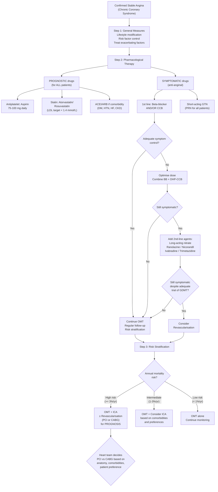
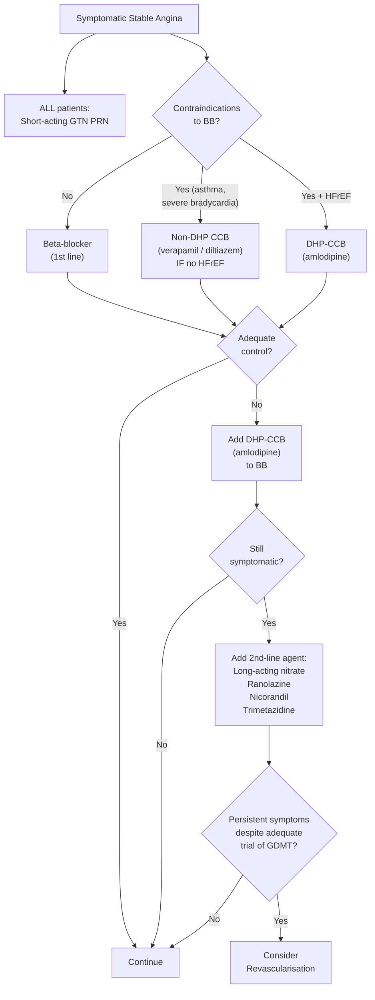

## Management of Stable Angina

The management of stable angina has **two parallel and equally important goals** [1]:

1. **Improve prognosis** → reduce the risk of MI and death (prognostic therapy)
2. **Improve symptoms** → relieve angina, improve exercise tolerance and quality of life (symptomatic therapy)

Think of it this way: even if a patient feels perfectly fine on anti-anginal drugs, they still need prognostic medications (aspirin, statin) because the underlying atherosclerosis is a **systemic, progressive disease** that can kill silently. Conversely, even if prognosis is excellent, a patient who can't walk 200 m without chest pain needs symptomatic relief.

---

## Master Management Algorithm

***The ESC 2023 framework emphasises thinking in a structured way*** [11]:

> ***Think 'A.C.S.' at initial assessment → Think antithrombotic therapy → Think revascularisation → Think secondary prevention*** [11]

For stable angina, the same secondary prevention principles apply — ***long-term Rx: antithrombotic therapy, lipid-lowering therapy, smoking cessation, cardiac rehabilitation, risk factor management, psychosocial considerations*** [11].

---

## Step 1: General Measures

These are the foundations of management — no drug or stent can substitute for lifestyle modification and risk factor control [1].

### A. Lifestyle Modification

| Measure | Detail | Why |
|---|---|---|
| ***Stop smoking*** [1] | Refer to smoking cessation programme; offer NRT, varenicline, or bupropion | ***Drastic ↓ MI risk after just 1 year of smoking cessation; smoking doubles 5-year mortality*** [1]. Smoking promotes endothelial dysfunction, ↑ platelet aggregation, ↑ fibrinogen, ↓ HDL |
| ***Regular exercise*** [1] | ***But not beyond point of discomfort*** [1]; 150 min/week moderate-intensity aerobic exercise | Exercise ↑ coronary flow reserve, ↑ HDL, ↓ BP, ↓ insulin resistance, ↑ endothelial function, promotes collateral development |
| **Healthy diet** | Mediterranean diet (high fruits/vegetables/olive oil/fish, low saturated fat/red meat/salt) | ***Mediterranean diet*** [1] reduces ASCVD events by ~30% (PREDIMED trial). ↓ Sodium → ↓ BP; ↓ saturated fat → ↓ LDL |
| ***Maintain ideal body weight*** [1] | BMI target < 25 kg/m²; waist circumference < 94 cm (M), < 80 cm (F) for Asians | Central obesity → insulin resistance → metabolic syndrome → accelerated atherosclerosis |
| **Limit alcohol** | ≤ 14 units/week, no binge drinking | Excess alcohol → HTN, cardiomyopathy, arrhythmia |

### B. Treat Exacerbating Factors

***Treat precipitating factors: thyrotoxicosis, anaemia*** [1]:

| Factor | Action | Why |
|---|---|---|
| **Anaemia** | Investigate and treat cause (iron deficiency, chronic disease, etc.) | ↓ O₂ carrying capacity → ↓ supply → angina at lower thresholds |
| **Thyrotoxicosis** | Carbimazole/propylthiouracil + beta-blocker | ↑ HR + ↑ contractility → ↑ O₂ demand; tachycardia also ↓ diastolic filling time |
| **Tachyarrhythmia** | Rate control (BB, non-DHP CCB) or rhythm control | ↑ HR → ↑ demand + ↓ diastolic coronary filling |
| **Uncontrolled HTN** | Antihypertensive therapy | ↑ Afterload → ↑ wall tension → ↑ O₂ demand |

### C. Risk Factor Management

***Manage risk factors*** [1]:

| Risk Factor | Target | Agent/Approach |
|---|---|---|
| ***DM*** | ***Aim HbA1c < 7%*** [1]; ***consider SGLT2i or GLP-1a*** [1] | SGLT2 inhibitors (empagliflozin, dapagliflozin) and GLP-1 receptor agonists (semaglutide, liraglutide) have proven cardiovascular benefit — ↓ MACE, ↓ HF hospitalisations |
| ***HTN*** | ***Aim < 140/90*** [1] (ESC 2023 recommends < 130/80 if tolerated); ***use BB if indicated*** [1] | BB achieves dual goals in stable angina: ↓ BP + anti-anginal |
| ***Lipids*** | ***↓ LDL to < 1.8 mmol/L*** [1] (ESC 2019/2023: < 1.4 mmol/L for very high risk + ≥ 50% reduction from baseline) | ***High dose statins for aggressive ↓ lipid (regardless of serum cholesterol level) → ↓ mortality*** [1]; add ezetimibe then PCSK9 inhibitor if target not met [12] |

<Callout title="LDL Targets — Know the Numbers">

***Target LDL-C*** [12]:
- ***Very high risk (established ASCVD)***: < 1.4 mmol/L (ESC 2019/2023) — previously 1.8, now lower
- ***High risk***: < 1.8 mmol/L (or ≥ 50% reduction if baseline 1.8–3.5)
- ***Low/moderate risk***: < 3.0 mmol/L

In stable angina with confirmed CAD, the patient is automatically **very high risk** → target < 1.4 mmol/L. ***Statins are recommended in all patients*** [1].

</Callout>

---

## Step 2: Pharmacological Therapy

### A. Prognostic Drugs (Disease-Modifying — Given to ALL Patients)

These drugs reduce MI and death. They treat the **underlying atherosclerotic disease process**, not the symptoms.

#### 1. Antiplatelets

***Aspirin is recommended for all patients without contraindications at dose of 75–100 mg daily*** [1][11].

| Drug | Mechanism | Dose | Notes |
|---|---|---|---|
| ***Aspirin*** | Irreversibly inhibits COX-1 → ↓ thromboxane A₂ (TXA₂) synthesis → ↓ platelet aggregation | ***75–100 mg daily*** [11] | ***Low-dose (75–325 mg daily) prescribed for all patients with CAD indefinitely*** [1]. Higher doses do not add efficacy but increase bleeding risk. The COX-1 inhibition is permanent for the platelet's 7–10 day lifespan |
| ***Clopidogrel (Plavix)*** | Irreversibly blocks P2Y₁₂ ADP receptor on platelets → ↓ ADP-mediated platelet activation | ***75 mg daily*** [11] | ***Equally/more effective, used as alternative to aspirin if intolerant (↑ cost)*** [1]. ***Clopidogrel 75 mg daily when aspirin is not tolerated because of hypersensitivity or GI intolerance*** [11] |

**Important nuance for stable angina specifically** [1]:
- ***Combination therapy (DAPT) is standard of care post-ACS/PCI, but NOT associated with benefit in stable CAD*** [1] — i.e., do NOT give DAPT routinely for stable angina without prior PCI/ACS
- ***Newer P2Y₁₂ inhibitors (prasugrel, ticagrelor): not evaluated by studies in stable CAD*** [1] — these are reserved for ACS

**Post-PCI in stable angina**: If a patient with stable angina undergoes elective PCI with stenting, DAPT (aspirin + clopidogrel) is given for a defined period (typically 6 months for drug-eluting stent), then aspirin monotherapy indefinitely.

***Caveat: clopidogrel interacts with PPI*** [1] — ***PPIs inhibit CYP2C19/3A4 activation of clopidogrel prodrug → treatment failure*** [1]. Use pantoprazole (least CYP2C19 interaction) if PPI is needed.

> **Why aspirin works in stable angina from first principles**: Atherosclerotic plaque, even when "stable," has an endothelial surface that is dysfunctional. Platelets adhere more readily, and even without frank rupture, there is ongoing low-grade platelet activation at the plaque surface. Aspirin suppresses this, reducing the risk of acute thrombosis (which would convert stable angina to ACS/MI).

**Low-dose rivaroxaban consideration** (2019 COMPASS trial) [11]: For patients with stable CAD at high ischaemic risk but acceptable bleeding risk, ***consider rivaroxaban 2.5 mg BID*** added to aspirin — this reduces MACE but increases bleeding. Not yet universally adopted but referenced in ESC 2023 guidelines.

#### 2. Statins

***Statins: recommended in all patients*** [1][12].

| Drug | Mechanism | Dose | Target |
|---|---|---|---|
| ***Atorvastatin (Lipitor)*** | Inhibits HMG-CoA reductase → ↓ hepatic cholesterol synthesis → ↑ hepatic LDL receptor expression → ↑ LDL clearance from blood | 40–80 mg (high intensity) | ***LDL < 1.4 mmol/L and/or ≥ 50% reduction*** [1][12] |
| ***Rosuvastatin (Crestor)*** | Same mechanism | 20–40 mg (high intensity) | Same |

***Statin effects beyond lipid-lowering*** ("pleiotropic effects") [12]:
- ***Plaque stabilisation*** — ↑ fibrous cap thickness, ↓ lipid core
- ***↓ Inflammation*** — ↓ CRP, ↓ macrophage activity
- ***Reversal of endothelial dysfunction*** — ↑ NO bioavailability
- ***↓ Thrombogenicity*** — ↓ tissue factor, ↓ platelet reactivity

***Side effects*** [12]:
- ***Myopathy***: ranges from ***myalgia, myopathy, myositis to rhabdomyolysis*** [12]
  - ***Risk factors: lipophilic statins (e.g., simvastatin), hypothyroidism, CYP3A4 inhibitors*** [12]
  - ***Dx: clinical + biochemical (↑ CK) evidence*** [12]
  - ***Mx: stop statin if severe; switch to pravastatin, fluvastatin, or pitavastatin if mild*** [12]
- Transaminitis (check LFT at baseline and if symptomatic)
- New-onset DM (slight increase, but cardiovascular benefit far outweighs)

***Dosing: generally more conservative in Asians (higher plasma concentration with same dose)*** [12].

**If LDL target not met with maximally tolerated statin** [12]:
1. ***Add ezetimibe*** (blocks intestinal cholesterol absorption via NPC1L1 transporter)
2. ***Add PCSK9 inhibitor*** (evolocumab or alirocumab — monoclonal antibodies that ↓ PCSK9 → ↑ hepatic LDL receptor recycling → dramatic ↓ LDL)

#### 3. ACEI / ARB

***ACEI/ARB: evidence unclear in stable CAD alone without comorbidities*** [1].

| Indication | Why |
|---|---|
| ***When comorbidities are present: DM, HTN, LV HF*** [1] | ACEI/ARBs: ↓ afterload, ↓ ventricular remodelling, ↓ proteinuria (in DM nephropathy), cardioprotective via ↓ RAAS activation |
| ***Either one is used (combination a/w ↑ adverse events w/o ↑ benefits)*** [1] | NEVER combine ACEI + ARB — ↑ hyperkalaemia, ↑ renal failure, no additional CV benefit |

> **Bottom line**: In a stable angina patient who also has DM, HTN, or HFrEF → give ACEI (e.g., ramipril, perindopril) or ARB (e.g., valsartan, losartan). If none of these comorbidities, the evidence does not strongly support routine use.

---

### B. Symptomatic Drugs (Anti-Anginal — For Symptom Relief)

These drugs reduce the frequency and severity of angina episodes. They do NOT modify the disease course or improve survival (with the possible exception of beta-blockers).

#### First-Line: Beta-Blockers and/or Calcium Channel Blockers

##### Beta-Blockers (BB)

***β-blockers: blocks β receptors → ↓ HR, ↓ contractility, ↓ AVN conduction, ↓ ectopic activity*** [1].

***Role: potential prognostic effect renders BB as the 1st-line anti-anginal Tx in patients without contraindications*** [1]:
- ***Anti-anginal: clearly effective in ↓ exercise-induced angina, ↑ exercise tolerance, limit ischaemic episodes*** [1]
- ***Prognostic Tx: definitely prognostic in post-MI, but effect unclear in patients with stable CAD only*** [1]

| Property | Detail |
|---|---|
| **Mechanism (anti-anginal)** | ↓ HR → ↓ O₂ demand (most important); ↓ contractility → ↓ O₂ demand; ↑ diastolic filling time → ↑ coronary perfusion (coronaries fill in diastole). Together, this restores the supply-demand balance |
| ***Choice*** | ***β₁-selective: metoprolol (Betaloc), bisoprolol (Zebeta); α₁β-selective: carvedilol*** [1]. β₁-selective preferred to avoid bronchospasm from β₂ blockade |
| **Dose** | ***Metoprolol (Betaloc) 25–100 mg BD*** [1]; titrate to resting HR 55–60 bpm |
| ***Side effects*** | ***Precipitates ADHF, bronchospasm, exacerbate PAD, fatigue, sexual dysfunction, hypoglycaemia, hyperkalaemia*** [1] |
| ***Contraindications*** | ***Bradycardia, AVB, ↓ BP, asthma*** [1] |
| ***NOT contraindicated in*** | ***HF (actually indicated in HFrEF), COPD (use β₁-selective cautiously), peripheral vascular disease*** [1] |

<Callout title="Beta-Blockers in Asthma vs. COPD" type="error">

BBs are **absolutely contraindicated** in asthma (β₂ blockade → unopposed bronchial smooth muscle constriction → severe bronchospasm → death). However, in COPD, cardioselective β₁-blockers (bisoprolol, metoprolol) can be used cautiously because the bronchospasm component in COPD is less β₂-dependent. This is a classic exam trap.

</Callout>

##### Calcium Channel Blockers (CCB)

***CCB: block Ca²⁺ channel → ↓ inward current during phase 2 action potential*** [1].

There are two fundamentally different subclasses, and understanding this is critical for safe prescribing:

| Property | ***Dihydropyridine (DHP)*** [1] | ***Non-DHP*** [1] |
|---|---|---|
| **Examples** | Amlodipine, nifedipine, felodipine | Diltiazem, verapamil |
| ***Main effect*** | ***Mainly vascular effects*** [1] — potent vasodilation | ***Vascular + cardiac effects*** [1] — vasodilation + ↓ HR + ↓ contractility |
| **Mechanism (anti-anginal)** | ↓ PVR → ↓ afterload → ↓ O₂ demand; coronary vasodilation → ↑ supply | ↓ HR → ↓ O₂ demand (similar to BB); ↓ afterload; coronary vasodilation |
| ***Characteristic*** | ***Little cardiac effects → safe in patients with poor cardiac function*** [1] | ***↓ HR → anti-anginal properties (similar to BB)*** [1] |
| ***Use*** | ***Usually combined with BB*** [1] (complement each other — BB covers the reflex tachycardia from DHP vasodilation) | ***As alternative to BB in those who cannot take BB*** [1]; ***NOT combined with BB → third-degree heart block*** [1] |
| ***Side effects*** | ***Flushing, oedema, headache, palpitation*** [1] (all from vasodilation) | ***Heart block, bradycardia, heart failure*** [1] |
| ***Contraindications*** | ***Severe AS, HOCM*** [1] — ↓ PVR → ↓↓ BP because ↓ SV from fixed obstruction cannot compensate; avoid short-acting nifedipine (reflex tachycardia → ↑ demand) | ***HFrEF*** [1] — negative inotropy worsens pump failure; avoid with BB (additive negative chronotropy/dromotropy → complete heart block) |

***For ACS/secondary prevention context: Calcium antagonists (diltiazem or verapamil) if contraindications to beta-blockers and no heart failure*** [11].

> **How to choose BB vs. CCB**:
> - **BB preferred** if: post-MI, HFrEF, tachyarrhythmia — offers both anti-anginal and prognostic benefit
> - **DHP-CCB + BB** combination: excellent first-line combination — BB handles HR and contractility, DHP handles afterload and coronary tone
> - **Non-DHP CCB alone**: only if BB is contraindicated AND patient does NOT have HFrEF
> - **NEVER**: Non-DHP CCB + BB together (risk of complete heart block and severe bradycardia)

##### Short-Acting Nitrates (PRN — For ALL Patients)

***Short-acting nitrates: for ALL patients with symptomatic stable CAD*** [1].

***Nitrates: mechanism is arteriovenous dilatation by release of NO*** [1]:
- ***↑ Supply by: (1) dilating coronary arteries (2) redistributing perfusion from epicardial to endocardial sites*** [1]
- ***↓ Demand by: (1) venodilation (major) → ↓ preload (2) arteriodilation (modest) → ↓ afterload*** [1]

| Formulation | Dose | Onset/Duration | Notes |
|---|---|---|---|
| ***Sublingual GTN*** | ***0.3–0.6 mg Q5min, max 1.2 mg in 15 min*** [1] | Onset 1–2 min, lasts 20–30 min | ***During acute angina episode or prophylactically before exertion*** [1] |
| ***GTN spray*** | 1–2 sprays, up to 3 sprays in 15 min | ***Acts quicker*** [1] | Preferred by many patients; longer shelf life than tablets |
| ***Sublingual isosorbide dinitrate*** | ***5 mg*** [1] | ***Slower onset (3–4 min) but effect can last ~1 hour*** [1] | Alternative |

***Important: should rest sitting while taking nitrates*** [1]:
- ***Standing → syncope*** (vasodilation + gravity → postural hypotension)
- ***Supine → ↑ VR → ↑ preload*** (defeats the purpose of ↓ preload)

> **Patient education point**: "If you get chest pain during exertion, stop, sit down, and take one GTN under the tongue. Wait 5 minutes. If pain persists, take a second. If still no relief after 3 doses in 15 minutes, call an ambulance — this may be a heart attack."

#### Second-Line Anti-Anginal Agents

***If BB + CCB combination is insufficient, add second-line agents*** [1]:

##### Long-Acting Nitrates

***Long-acting nitrates: for angina prophylaxis via regular use*** [1]:
- ***Indication: usually as 2nd line if BB/CCB are ineffective*** [1]
- ***Risk of worsening endothelial dysfunction with long-term use*** [1]

| Drug | Route | Key Point |
|---|---|---|
| ***Isosorbide mononitrate*** | Oral | ***Mononitrate has more reliable pharmacokinetics*** [1] than dinitrate (dinitrate requires hepatic conversion to active mononitrate) |
| ***Isosorbide dinitrate*** | Oral | Less predictable due to extensive first-pass metabolism |
| ***GTN patch*** | Transcutaneous | Convenient but must be removed for nitrate-free interval |

***Critical concept — Nitrate tolerance and the nitrate-free interval*** [1]:
- ***Regimen: to be used daily with nitrate-free or nitrate-low interval of 8–10 hours*** [1]
- **Why**: Continuous nitrate exposure depletes intracellular sulfhydryl groups needed to convert nitrates to NO → ↓ efficacy (tolerance). A drug-free period allows regeneration. Typically, the patch is removed at night or the evening dose is omitted.

##### Other Newer Anti-Anginal Agents

| Drug | Mechanism | Indication | Key Notes |
|---|---|---|---|
| ***Ranolazine*** | ***Inhibits late inward Na⁺ channel → ↓ Na⁺/Ca²⁺ exchange → ↓ intracellular Ca²⁺ → ↓ contractility → ↓ angina, ↓ recurrent ischaemia*** [1] | 2nd/3rd-line add-on | ***A/w ↑ QTc*** [1] — avoid with other QT-prolonging drugs; does NOT affect HR or BP (useful when BB not tolerated) |
| ***Trimetazidine (Vastarel)*** | ***↓ fatty acid oxidation → protect myocardium from ischaemic injury*** [1] — shifts energy metabolism from FFA to glucose (more O₂-efficient) | 2nd-line add-on | Popular in Asia; no haemodynamic effects |
| ***Nicorandil*** | ***Opens K⁺ channel → arteriovenous + coronary dilatation*** [1]; also has nitrate-like action (NO donor) | 2nd-line add-on | Unique dual mechanism; can cause oral/GI ulceration |
| ***Ivabradine*** | ***Blocks HCN channel → ↓ Iꜰ → ↓ HR*** [1] | ***Used if sinus rhythm ≥ 70 bpm*** [1] | ***Should be limited to HF patients as latest trials showed possible ↑ CVD death and non-fatal MI*** [1] in non-HF; only works in sinus rhythm (useless in AF) |

<Callout title="Ivabradine — A Cautionary Tale" type="error">

Ivabradine ("I-VA-BRA-dine" — think "I slow the heart rate") selectively blocks the funny current (Iꜰ) in the SA node, slowing HR without affecting contractility or BP. Sounds ideal for angina, but the **SIGNIFY trial** (2014) showed that in stable CAD patients without HF, ivabradine was associated with **increased risk of cardiovascular death and MI** in the subgroup with symptomatic angina (CCS ≥ II). It is now primarily reserved for **HFrEF with HR ≥ 70 bpm in sinus rhythm** (SHIFT trial).

</Callout>

---

### Summary of Anti-Anginal Drug Strategy

---

## Step 3: Revascularisation

Revascularisation means physically restoring blood flow to ischaemic myocardium — either by **PCI (percutaneous coronary intervention)** or **CABG (coronary artery bypass grafting)**.

### Indications for Revascularisation [1]

| Group | Purpose | Indication | Benefit |
|---|---|---|---|
| ***High-risk*** | ***Improve prognosis*** [1] | Annual mortality ≥ 3%; anatomy showing LMS disease, proximal LAD disease, 3VD (especially with LVEF < 50%), large area of ischaemia > 10% | Revascularisation ↓ mortality in these high-risk subgroups |
| **Symptomatic despite OMT** | **Improve symptoms** | ***Persistent symptoms despite adequate trial of guideline-directed medical therapy (GDMT)*** [11] | Revascularisation relieves angina and improves quality of life, even if it may not improve prognosis in lower-risk patients |

***The lecture slide framework*** [11]:
> ***Consider revascularisation to improve symptoms if: persistent symptoms despite adequate trial of GDMT*** [11]
> ***Potential revascularisation procedure warranted on the basis of assessment of coexisting cardiac and noncardiac factors and patient preferences*** [11]
> ***Perform coronary angiography → Heart team concludes that anatomy and clinical factors indicate revascularisation may improve symptoms → Heart team determines optimal method of revascularisation on the basis of patient preferences, anatomy, other clinical factors, and local resources and expertise*** [11]

### PCI vs. CABG — How to Choose

***Aim for complete revascularisation*** [11]. ***Consider adjunctive tests to guide revascularisation: intravascular imaging, intravascular physiology*** [11].

The decision is made by a **Heart Team** (interventional cardiologist + cardiac surgeon + clinical cardiologist) [11]:

| Factor | Favours PCI | Favours CABG |
|---|---|---|
| **Anatomy** | 1VD or 2VD without proximal LAD; low SYNTAX score (≤ 22) | LMS disease, 3VD, proximal LAD, high SYNTAX score ( > 32) |
| **Comorbidities** | High surgical risk, frailty, advanced age | DM (CABG has superior long-term outcomes in diabetics with multivessel disease — FREEDOM trial) |
| **LVEF** | Preserved | Reduced (CABG provides more complete revascularisation + ↓ remodelling) |
| **Patient factors** | Preference for less invasive; shorter recovery | Willing to accept surgical risk for more durable result |
| **Previous** | No prior CABG (PCI to native vessels) | Prior PCI with in-stent restenosis; prior CABG (redo CABG or PCI to grafts depending on anatomy) |

### PCI — Percutaneous Coronary Intervention

"Percutaneous" = through the skin; "coronary" = heart vessels; "intervention" = therapeutic procedure.

- **Approach**: Catheter inserted via radial (preferred — ↓ bleeding) or femoral artery → wire crosses stenosis → balloon angioplasty ± stent deployment
- **Stent types**:
  - **Bare-metal stent (BMS)**: Rarely used now; higher restenosis rate (~20–30%)
  - **Drug-eluting stent (DES)**: Coated with antiproliferative drug (everolimus, zotarolimus) → ↓ neointimal hyperplasia → ↓ restenosis (~5–10%); requires DAPT for 6 months minimum
- **Post-PCI antiplatelet**: DAPT (aspirin + clopidogrel) for 6 months (DES in stable angina), then aspirin monotherapy indefinitely. Duration may be shortened to 1–3 months if high bleeding risk.

### CABG — Coronary Artery Bypass Grafting

"Bypass" = creates a new route around the obstruction; "grafting" = using a conduit (vein or artery) to bridge the blocked segment.

- **Conduits**:
  - **Left internal mammary artery (LIMA) → LAD**: Gold standard graft; > 90% patency at 10 years (arterial conduit maintains endothelial function → ↓ atherosclerosis)
  - **Saphenous vein graft (SVG)**: Used for non-LAD targets; ~50% patency at 10 years (venous grafts are prone to intimal hyperplasia and accelerated atherosclerosis)
  - **Radial artery, right IMA (RIMA)**: Alternative arterial conduits for additional targets
- **Post-CABG medications**: Aspirin indefinitely; statins; ACEI/ARB if indicated; BB especially if reduced LVEF

---

## Comprehensive Pharmacotherapy Summary Table

| Drug Class | Specific Agents | Indication in Stable Angina | Mechanism | Key C/I | Key S/E |
|---|---|---|---|---|---|
| **Aspirin** | 75–100 mg daily | ***ALL patients, indefinitely*** [1] | Irreversible COX-1 inhibition → ↓ TXA₂ → ↓ platelet aggregation | Active GI bleeding, aspirin allergy, severe bleeding diathesis | GI bleeding, peptic ulcer, rarely bronchospasm (aspirin-sensitive asthma) |
| **Clopidogrel** | 75 mg daily | ***Alternative to aspirin if intolerant*** [1]; DAPT post-PCI | Irreversible P2Y₁₂ receptor blockade → ↓ ADP-mediated platelet activation | Active bleeding; ***interacts with PPI via CYP2C19*** [1] | Bleeding, TTP (rare), rash |
| **Statin** | Atorvastatin 40–80 mg; Rosuvastatin 20–40 mg | ***ALL patients*** [1] | HMG-CoA reductase inhibition → ↓ LDL + pleiotropic effects | Active liver disease, pregnancy | Myopathy, transaminitis, new-onset DM |
| **ACEI/ARB** | Ramipril, perindopril / Valsartan, losartan | ***If DM, HTN, HF, CKD*** [1] | ↓ RAAS → ↓ afterload, ↓ remodelling | Bilateral RAS, pregnancy, angioedema (ACEI), hyperkalaemia | Cough (ACEI), hyperkalaemia, AKI |
| **BB** | ***Metoprolol, bisoprolol, carvedilol*** [1] | ***1st-line anti-anginal*** [1] | ↓ HR, ↓ contractility → ↓ O₂ demand | ***Asthma, bradycardia, AVB, hypotension*** [1] | Fatigue, sexual dysfunction, cold extremities, masking hypoglycaemia |
| **DHP-CCB** | Amlodipine, nifedipine MR, felodipine | Combined with BB; or monotherapy if BB C/I + HFrEF | ↓ PVR → ↓ afterload; coronary vasodilation | ***Severe AS, HOCM*** [1]; avoid short-acting nifedipine | Flushing, ankle oedema, headache, palpitation |
| **Non-DHP CCB** | ***Diltiazem, verapamil*** [1][11] | ***Alternative to BB if C/I and no HF*** [1][11] | ↓ HR + ↓ afterload + coronary vasodilation | ***HFrEF*** [1]; ***NOT combined with BB*** [1] | Bradycardia, heart block, constipation (verapamil) |
| **Short-acting nitrate** | SL GTN 0.3–0.6 mg; GTN spray | ***ALL symptomatic patients, PRN*** [1] | NO → venodilation (↓ preload) + coronary dilation | Severe AS/HOCM (↓ preload → ↓↓ CO); concurrent PDE5i (sildenafil → profound hypotension) | Headache, flushing, hypotension |
| **Long-acting nitrate** | ISMN, ISDN, GTN patch | ***2nd-line if BB/CCB insufficient*** [1] | Same as above, sustained release | Same as above; ***must have 8–10 h nitrate-free interval*** [1] | Tolerance, headache |
| **Ranolazine** | 375–500 mg BD | 2nd/3rd-line add-on | ↓ Late Na⁺ current → ↓ intracellular Ca²⁺ | ***↑ QTc*** [1]; avoid with QT-prolonging drugs | QT prolongation, dizziness, nausea |
| **Nicorandil** | 10–20 mg BD | 2nd-line add-on | K⁺ channel opener + NO donor | Hypotension | Oral/GI ulceration, headache |
| **Trimetazidine** | 35 mg BD MR | 2nd-line add-on | Shifts myocardial metabolism from FFA to glucose | Parkinsonism | GI upset, rarely extrapyramidal symptoms |
| **Ivabradine** | 5–7.5 mg BD | ***If sinus rhythm ≥ 70 bpm*** [1]; ***best reserved for HF patients*** [1] | ↓ Iꜰ (funny current) → ↓ HR | AF/flutter (useless), severe bradycardia, severe HF (NYHA IV) | Visual disturbances (phosphenes), bradycardia |

---

<Callout title="High Yield Summary">

**Management of Stable Angina — The Three Pillars:**

**1. General Measures**: Smoking cessation (most impactful lifestyle change), exercise (not beyond discomfort), Mediterranean diet, weight management, treat exacerbating factors (anaemia, thyrotoxicosis)

**2. Pharmacological Therapy**:
- **Prognostic (ALL patients)**: Aspirin 75–100 mg daily (or clopidogrel if intolerant) + high-intensity statin (target LDL < 1.4 mmol/L for very high risk) + ACEI/ARB if DM/HTN/HF
- **Symptomatic**: Short-acting GTN PRN (all patients) → 1st-line BB ± DHP-CCB (or non-DHP CCB if BB C/I and no HF) → 2nd-line: long-acting nitrate, ranolazine, nicorandil, trimetazidine → If still symptomatic despite GDMT → consider revascularisation
- **Key drug rules**: Never combine non-DHP CCB + BB (→ heart block); BB absolutely C/I in asthma; nitrates need 8–10 h drug-free interval; GTN is C/I with PDE5 inhibitors; clopidogrel interacts with PPIs

**3. Revascularisation (PCI or CABG)**:
- **For prognosis**: High-risk anatomy (LMS, 3VD, proximal LAD, large ischaemic burden > 10%, LVEF < 50%)
- **For symptoms**: Persistent angina despite adequate GDMT
- **Heart team decision**: PCI favoured for simpler anatomy (1–2VD, low SYNTAX); CABG favoured for complex anatomy (3VD, LMS, DM, high SYNTAX)

</Callout>

---

<ActiveRecallQuiz
  title="Active Recall - Management of Stable Angina"
  items={[
    {
      question: "List the 3 prognostic drugs that should be prescribed to ALL patients with confirmed stable CAD, and state the mechanism of each.",
      markscheme: "(1) Aspirin 75-100 mg daily — irreversible COX-1 inhibition, decreases TXA2, decreases platelet aggregation, reduces thrombotic events. (2) High-intensity statin (atorvastatin or rosuvastatin) — inhibits HMG-CoA reductase, decreases LDL, plaque stabilisation, anti-inflammatory, target LDL < 1.4 mmol/L. (3) ACEI/ARB — only if comorbidity present (DM, HTN, HF, CKD); decreases RAAS activation, decreases afterload, decreases remodelling. Note: ACEI/ARB evidence unclear in stable CAD without comorbidities."
    },
    {
      question: "A patient with stable angina is started on metoprolol but remains symptomatic. You plan to add a CCB. What type of CCB would you choose (DHP vs non-DHP), and why? What is the critical safety concern with the alternative?",
      markscheme: "Add a DHP-CCB (e.g., amlodipine). DHP-CCBs have mainly vascular effects (vasodilation, decreased afterload) with little cardiac depression, so they complement BB safely. NON-DHP CCBs (diltiazem, verapamil) must NOT be combined with BB because both cause negative chronotropy and dromotropy — combination risks severe bradycardia and third-degree heart block. Non-DHP CCBs are only used as alternative to BB when BB is contraindicated, and NOT in HFrEF."
    },
    {
      question: "Explain why nitrate tolerance develops and how it is prevented clinically.",
      markscheme: "Nitrate tolerance occurs because continuous exposure depletes intracellular sulfhydryl groups needed to convert organic nitrates to NO (the active vasodilator). Without sulfhydryl regeneration, NO production decreases despite ongoing drug administration. Prevention: prescribe with an 8-10 hour nitrate-free or nitrate-low interval daily (e.g., remove GTN patch at night, or omit the evening dose of ISMN). This allows sulfhydryl group regeneration."
    },
    {
      question: "A 58-year-old diabetic man with stable angina undergoes coronary angiography showing 3-vessel disease with a SYNTAX score of 35. He has LVEF 40%. Should you recommend PCI or CABG? Justify with 3 reasons.",
      markscheme: "CABG preferred. Reasons: (1) 3-vessel disease with high SYNTAX score (> 32) — CABG provides more complete revascularisation. (2) Diabetes — FREEDOM trial showed CABG superior to PCI for long-term outcomes in diabetic patients with multivessel disease. (3) Reduced LVEF (40%) — CABG offers prognostic benefit with more complete revascularisation and may reduce remodelling. Heart team decision is essential."
    },
    {
      question: "State 2 absolute contraindications to beta-blockers and 2 conditions often mistakenly thought to be contraindications but are actually safe or even indicated.",
      markscheme: "Absolute contraindications: (1) Asthma (beta-2 blockade causes severe bronchospasm). (2) High-degree AV block or severe bradycardia. Commonly MISTAKEN as contraindications but actually safe/indicated: (1) Heart failure with reduced EF (HFrEF) — BB (bisoprolol, carvedilol, metoprolol succinate) are evidence-based treatments that reduce mortality in HFrEF. (2) COPD — cardioselective beta-1 blockers (bisoprolol, metoprolol) can be used cautiously as bronchospasm is less beta-2-dependent in COPD. (3) Peripheral vascular disease — previously listed as C/I but current evidence shows benefit outweighs risk."
    },
    {
      question: "What are the two main indications for revascularisation in stable angina, and what annual mortality threshold triggers prognostic revascularisation?",
      markscheme: "Two indications: (1) Improve prognosis — in high-risk patients with annual mortality >= 3% per year (high-risk anatomy: LMS disease, 3VD especially with LVEF < 50%, proximal LAD, large ischaemic burden > 10%). (2) Improve symptoms — persistent angina despite adequate trial of guideline-directed medical therapy. The annual mortality threshold for prognostic revascularisation is >= 3% per year."
    }
  ]}
/>

## References

[1] Senior notes: Ryan Ho Cardiology.pdf (Section 3.2.1 Stable Angina — Management, pp. 120–124)
[2] Senior notes: Ryan Ho Fundamentals.pdf (Section 3.1.1 Chest Pain, pp. 199–203)
[11] Lecture slides: GC 028. Accelerating chest pain_Acute coronary (1).pdf (pp. 54–55, 60 — Secondary prevention: antiplatelet, anti-ischaemic therapy, ESC 2023 ACS framework with secondary prevention)
[12] Senior notes: Ryan Ho Endocrine.pdf (pp. 128–131 — Statin therapy, LDL targets, management of dyslipidaemia)
