```mermaid
graph TD
    A["STEMI"] --> B["Arrhythmias"]
    A --> C["Pump Failure"]
    A --> D["Mechanical Complications"]
    A --> E["Pericardial Complications"]
    A --> F["Thromboembolic"]
    A --> G["Remodelling and Aneurysm"]
    A --> H["Stent Complications"]
    B --> B1["VF/VT: leading cause of pre-hospital death"]
    B --> B2["Bradycardia/AV block: especially inferior MI"]
    B --> B3["AF: sign of impending LVF"]
    C --> C1["LV failure: Killip I-IV"]
    C --> C2["RV failure: inferior MI"]
    C --> C3["Cardiogenic shock: ≥ 40% LV mass"]
    D --> D1["Acute MR: papillary muscle rupture, day 2-7"]
    D --> D2["VSD: septal rupture, anterior MI, day 1-14"]
    D --> D3["Free wall rupture: tamponade, day 1-14"]
    E --> E1["Peri-infarction pericarditis: day 2-3"]
    E --> E2["Dressler syndrome: weeks-months"]
    F --> F1["Mural thrombus → stroke/limb ischaemia"]
    F --> F2["DVT/PE from immobilisation"]
    G --> G1["Adverse LV remodelling → chronic HF"]
    G --> G2["LV aneurysm: persistent ST elevation"]
    H --> H1["Stent thrombosis: acute, catastrophic"]
    H --> H2["In-stent restenosis: chronic, gradual"]
```

## Complications of STEMI

Complications are what kill patients after the acute reperfusion window has passed. Understanding them requires knowing **what happens to necrotic myocardium over time** and **how loss of functional muscle mass affects cardiac physiology**. I'll organise them chronologically and by category, because the timing of complications maps directly onto the underlying pathology.

### Timeline of Myocardial Healing and Complication Risk

| Time Post-MI | Pathological Process | Complication Window |
|---|---|---|
| **0–24h** | Coagulative necrosis begins; neutrophil infiltration; electrically unstable tissue | **Arrhythmias** (VF/VT peak); early pump failure |
| **1–3 days** | Neutrophil-mediated enzymatic digestion of necrotic muscle; myocardium at its **weakest** structurally | Arrhythmias continue; early mechanical complications begin |
| **3–7 days** | Macrophage infiltration; granulation tissue formation begins; dead muscle is being removed but not yet replaced → **structural nadir** | ***Peak risk of mechanical complications*** (free wall rupture, VSD, papillary muscle rupture) |
| **1–3 weeks** | Granulation tissue matures; fibroblast proliferation; collagen deposition beginning | Pericarditis (early and Dressler's); embolism from mural thrombus |
| **4–6 weeks** | ***Scar formation (fibrotic tissue replaces necrotic tissue)*** [2] | LV remodelling; ventricular aneurysm formation |
| **Months–years** | Chronic remodelling; LV dilatation; neurohormonal activation | Chronic heart failure; recurrent ACS; sudden cardiac death |

---

### I. Arrhythmic Complications

Arrhythmias are the **most common complication** of STEMI and the **leading cause of pre-hospital death**. Most sudden cardiac deaths from MI occur within the first hour, before the patient reaches hospital [5].

**Why does STEMI cause arrhythmias?** Ischaemic and necrotic myocardium creates an electrically heterogeneous environment:
1. **Ischaemic cells** have depolarised resting membrane potential (↓ATP → failure of Na⁺/K⁺-ATPase → ↑intracellular K⁺ leak → ↑extracellular K⁺ around ischaemic zone) → altered conduction velocity
2. **Re-entry circuits** form at the border between healthy and ischaemic tissue (the "border zone") where conduction velocities differ
3. **Enhanced automaticity** from catecholamine surge and metabolic derangement
4. **Triggered activity** from calcium overload (delayed afterdepolarisations)

***Management of specific arrhythmias post-MI*** [2]:

| Arrhythmia | Mechanism | Timing | Management |
|---|---|---|---|
| ***Symptomatic sinus bradycardia*** | Inferior MI → ischaemia of SA node (supplied by RCA in ~60%) or Bezold-Jarisch reflex (vagal) | Early (hours) | ***Atropine 0.3–0.6 mg IV bolus; pacing if unresponsive to atropine*** [2] |
| ***AV block*** | Inferior MI → AV nodal ischaemia (AV node supplied by RCA in ~80%); anterior MI → infranodal conduction tissue necrosis | Variable | ***Conservative if 1° or Mobitz type I 2° AVB. Pacing if Mobitz type II 2° AVB or complete HB. Conservative Tx under careful monitoring as alternative if inferior MI with narrow QRS escape rhythm and adequate rate. Other indications for temporary pacing: bifascicular block + 1° AVB, alternating BBB/RBBB + alternating LAFB/LPFB (anterior infarct → ↑risk of sudden asystole)*** [2] |
| ***PSVT*** | Re-entry (AVNRT/AVRT) triggered by catecholamines and electrolyte shifts | Variable | ***Cardioversion if severe haemodynamic compromise or intractable ischaemia. ATP 10–20 mg IV bolus → verapamil 5–15 mg IV slowly (C/I if BP low or on BB)*** [2] |
| ***AF/AFlu*** | Atrial stretch from ↑LV filling pressures; atrial ischaemia; catecholamine surge; pericarditis | ***Common and frequently transient, can be a sign of impending or overt LVF*** [2] | ***Digoxin 0.25 mg IV/PO stat → loading; diltiazem 10–15 mg IV over 5–10 min; amiodarone 5 mg/kg IV over 60 min as loading*** [2] |
| ***Wide complex tachycardia*** | Re-entry in border zone; enhanced automaticity of Purkinje fibres | Early (highest risk first 24–48h) | ***Treat as VT until proven otherwise in the setting of ACS. Cardioversion if haemodynamic compromise. Stable sustained monomorphic VT: amiodarone 150 mg over 10 min (repeat if needed) → 600–1200 mg/24h infusion; lignocaine 50–100 mg IV bolus → 1–4 mg/min; procainamide 20–30 mg/min. Sustained polymorphic VT: unsynchronised cardioversion starting at 200 J*** [2] |
| ***VF*** | The most lethal arrhythmia; re-entry circuits in heterogeneous border zone tissue | ***Peak incidence first 4 hours; 80% of pre-hospital MI deaths*** | ***Prompt defibrillation with reference to ACLS algorithm*** [2][5] |
| **Reperfusion arrhythmias** | Sudden restoration of flow → washout of ischaemic metabolites (K⁺, lactate, adenosine) → transient automaticity | Immediately after PCI or fibrinolysis | Accelerated idioventricular rhythm (AIVR, "slow VT" at 60–120 bpm) — usually benign and self-limiting; observe. Only treat if haemodynamically compromising |

<Callout title="AV Block in Inferior vs Anterior STEMI — Very Different Prognoses">

- **Inferior MI** → AV nodal block (usually at the level of the AV node itself). The escape rhythm is junctional (narrow QRS, rate 40–60 bpm). Usually **transient** (resolves as ischaemia resolves), well-tolerated, and responds to atropine. Rarely needs permanent pacing.
- **Anterior MI** → Infranodal block (below the AV node, within the His-Purkinje system). The escape rhythm is ventricular (wide QRS, rate 20–40 bpm). Indicates **massive septal necrosis**, carries a very poor prognosis, and typically requires temporary ± permanent pacing.
</Callout>

---

### II. Pump Failure (Heart Failure and Cardiogenic Shock)

***Pump failure mechanism: downward spiral exacerbating myocardial ischaemia. ↓Systolic function → ↓coronary perfusion → ↓supply → ischaemia. ↓Diastolic function → ↑pulmonary congestion → hypoxaemia → ischaemia. Indicates extensive myocardial damage → poor prognosis (↑likelihood of other complications)*** [2].

This is classified by the **Killip classification** (from Part 1):

| Killip Class | Clinical Features | ~30-Day Mortality | Pathophysiology |
|---|---|---|---|
| **I** | No HF signs | ~6% | Small infarct; adequate residual LV function |
| **II** | Mild HF: S3 gallop, lung crackles < 50% of fields, ↑JVP | ~17% | Moderate LV dysfunction; ↑LVEDP → early pulmonary congestion |
| **III** | Frank pulmonary oedema | ~38% | Severe LV dysfunction; PCWP markedly elevated → alveolar flooding |
| **IV** | ***Cardiogenic shock***: SBP < 90, signs of end-organ hypoperfusion | ~80% (without intervention) | Typically > 40% of LV mass infarcted; cardiac output insufficient to maintain systemic perfusion |

***AMI Complications: Heart failure*** [1].

#### Management of Pump Failure [2]

***Management is based on clinical assessment of whether there is ↓CO or APO (bedside echo is essential)*** [2]:

**a) RV dysfunction (↓CO without APO, ~5%):**
- ***Usually occurs in inferior MI*** [2]
- ***Bedside echo should show non-compressible IVC*** [2] (indicating ↑RA pressure)
- ***Swan-Ganz catheter to monitor PCWP*** [2] → ***volume expansion with colloids/crystalloids if low or normal*** [2]
- Avoid nitrates and diuretics (↓preload in a preload-dependent ventricle → catastrophic)
- Dobutamine if fluids alone are insufficient

**b) LV dysfunction (normal/↓CO with APO, ~95%):**
- ***Vasodilators (especially ACEI) if BP stable (± PCWP monitoring)*** [2]
- ***Inotropes: preferably via central vein; start with dopamine 2.5 μg/kg/min if SBP ≤ 90 → ↑by increments of 0.5 μg/kg/min; consider dobutamine 5–15 μg/kg/min when high-dose dopamine needed*** [2]
- ***IABP with view for catheterisation ± revascularisation*** [2]
- ***Watch out for other causes, e.g., mechanical complications, arrhythmia, excessive use of anti-HTN*** [2]

> ***Shock: Large area (~40%) myocardium involved*** [13]. When ~40% or more of the LV is infarcted, the heart simply cannot generate enough forward flow. This is why cardiogenic shock carries such devastating mortality — there is not enough muscle left to pump.

---

### III. Mechanical Complications

***Acute mechanical complications from MI: Shock (large area ~40% myocardium involved), VSD (transmural infarct and rupture of muscular septum), MR (rupture of papillary head), Tamponade (free wall rupture, myocarditis, pericarditis, iatrogenic). Anyone of this is high risk for mortality*** [13].

***Mechanical complications occur in 0.3% of all MI patients, majority occurring in STEMI due to ↑myocardial damage. Associated with high in-hospital mortality (accounts for 10–15% of in-hospital deaths from AMI)*** [2].

These complications share a common pathological basis: **necrotic myocardium becomes structurally weak** during the first week as neutrophils and macrophages digest dead tissue (day 3–7 is the structural nadir). Before collagen scar has been deposited, the wall is at its most vulnerable to mechanical rupture.

#### A. Acute Mitral Regurgitation (MR)

***Causes: papillary muscle dysfunction or rupture, chordae rupture, or acute LV dilatation or aneurysm*** [2].

| Aspect | Detail |
|---|---|
| **Anatomy** | The mitral valve apparatus requires intact papillary muscles → chordae tendineae → leaflets. Two papillary muscles: **posteromedial** and **anterolateral** |
| ***Why posteromedial is most commonly affected (6–12×)*** | ***Posteromedial papillary muscle has a single blood supply by the posterior descending artery*** (from RCA in right-dominant circulation). ***Anterolateral has dual supply from LAD and LCx*** [2]. Therefore, inferior STEMI (RCA occlusion) → isolated posteromedial papillary muscle ischaemia → dysfunction or rupture |
| ***MR complicating papillary muscle dysfunction (inferior MI)*** | [1] |
| **Timing** | ***Papillary muscle rupture: occurs 2–7 days after infarct*** [2] — the structural nadir |
| **Pathophysiology** | Complete rupture → the papillary muscle head detaches → mitral leaflet flails → torrential MR into a non-compliant LA → acute ↑LA pressure → flash pulmonary oedema + ↓forward CO → cardiogenic shock |
| ***S/S*** | ***Often poorly tolerated with APO and shock (but may be silent). PSM with S3 on auscultation. Murmur may be absent if MR too severe*** [2] — why? If MR is truly massive, there is rapid equalisation of LV and LA pressures → minimal pressure gradient → barely audible murmur despite catastrophic regurgitation |
| ***Dx*** | ***By echo (to confirm papillary muscle disease)*** [2] — transoesophageal echo (TOE) is more sensitive |
| ***Mx*** | ***Observe if stable (may be transient if only dysfunction). Emergency MVR with papillary muscle repair if severe*** [2]. Bridge with IABP (↓afterload → ↓regurgitant fraction) and vasodilators while arranging surgery |

#### B. Interventricular Septal Rupture (VSD)

***AMI Complications: VSD (anterior MI)*** [1].

***IV septal rupture: occurs in ~0.1% of MI, usually occurs in ~24h from MI but may occur in up to 2 weeks*** [2].

| Aspect | Detail |
|---|---|
| ***Typical territory*** | ***Usually complicates anterior MI (LAD) especially if extensive MI with poor collateral*** [2] |
| ***Site of rupture*** | ***Rupture occurs at margin of necrotic and non-necrotic myocardium*** [2] — the junction between dead and living tissue is where mechanical stress is greatest |
| ***VSD: Transmural infarct and rupture of muscular septum*** [13] |
| **Pathophysiology** | Septal rupture → left-to-right shunt (LV → RV) → acute RV volume overload → RV failure + ↓forward LV output → cardiogenic shock |
| ***Consequence and presentation*** | ***L-to-R shunting → sudden haemodynamic deterioration + new-onset PSM (to RLSB). Usually develops RV failure*** [2] |
| **How to distinguish from acute MR** | Both present with new PSM and shock. Key differences: VSD murmur → loudest at LLSB/RLSB with thrill; RV failure predominant (↑JVP, hepatomegaly). MR murmur → loudest at apex radiating to axilla; LV failure predominant (APO) |
| ***Dx*** | ***Echo, right heart catheterisation*** [2] — echo shows septal defect with colour Doppler flow across septum; right heart cath shows "step-up" in O₂ saturation from RA to RV (oxygenated blood entering RV from LV) |
| ***Mx*** | ***Observe with delayed surgery if stable, emergency cardiac cath followed by repair if unstable. Note that surgical repair of MI-related VSD is associated with relatively high mortality*** [2] — because the surrounding tissue is necrotic and friable, sutures don't hold well. Percutaneous device closure is an emerging alternative |

#### C. LV Free Wall Rupture

***Tamponade: Free wall rupture, myocarditis, pericarditis, iatrogenic*** [13].

***LV free wall rupture: occurs in < 1% (uncommon), 50% occurs ≤ 5 days, > 90% occurs ≤ 2 weeks*** [2].

| Aspect | Detail |
|---|---|
| **Risk factors** | First MI (no prior fibrosis/scarring to reinforce wall), anterior MI, large transmural infarct, hypertension, elderly, female, delayed or no reperfusion |
| ***Complete rupture*** | ***Blood pumped into pericardial cavity → cardiac tamponade. Usually presents with sudden profound right HF + shock followed by PEA and death*** [2] |
| ***Incomplete (contained) rupture*** | ***Ventricular defect sealed by pericardial tissue and thrombus. Presents with persistent/recurrent pleuritic chest pain*** [2] — forms a "pseudoaneurysm" which may expand and rupture later |
| **Pathophysiology** | Necrotic LV wall cannot withstand systolic pressure → ruptures → blood fills pericardial space → pericardium cannot expand acutely → ↑intrapericardial pressure → compresses cardiac chambers → ↓filling (tamponade) → ↓CO → PEA → death |
| ***Dx*** | ***Should be made clinically supported by ECG/CXR/echo features of cardiac tamponade*** [2] — bedside echo shows pericardial effusion with diastolic collapse of RA/RV |
| ***Mx*** | ***Emergency percutaneous pericardiocentesis → surgical repair if blood aspirated*** [2]. This is essentially a surgical emergency — without immediate intervention, mortality approaches 100% |

<Callout title="The Three Mechanical Complications — A Quick Comparison" type="idea">

| Feature | Acute MR | VSD | Free Wall Rupture |
|---|---|---|---|
| Timing | 2–7 days | 24h to 2 weeks | 50% ≤ 5 days |
| Territory | Inferior MI (posteromedial PM) | ***Anterior MI (LAD)*** [1] | Any (anterior most common) |
| Murmur | PSM at apex ± absent if severe | PSM at LLSB with thrill | No murmur (tamponade) |
| Predominant failure | LV failure (APO) | RV failure | Tamponade → PEA |
| Dx | Echo (TOE) | Echo ± right heart cath | Bedside echo |
| Mx | MVR ± IABP bridge | Surgical repair ± device | Pericardiocentesis → surgery |
</Callout>

---

### IV. Pericardial Complications

***AMI Complications: Pericarditis*** [1].

#### A. Peri-Infarction Pericarditis (Early Pericarditis)

***Peri-infarction pericarditis (PIP): common on 2nd/3rd day post-MI, occurs in 1.2% of MI patients*** [2].

| Aspect | Detail |
|---|---|
| **Pathophysiology** | Transmural infarction → necrotic epicardium directly contacts pericardium → local inflammatory reaction → pericarditis. Only occurs in transmural (STEMI) not subendocardial (NSTEMI) infarcts |
| ***S/S*** | ***Development of a different pain: positional, sharp pleuritic, especially at trapezius ridge. Pericardial rub (diagnostic)*** [2] — the rub is a high-pitched scratchy sound, best heard with the patient sitting forward at end-expiration |
| ***ECG*** | ***New widespread ↑ST or ↓PR beyond typically anatomic regional boundary*** [2] — this is the key distinction from the territorial ST-elevation of the MI itself |
| ***Mx*** | ***Paracetamol ± aspirin (650 mg Q6–8h) ± opiate-based analgesia (usually self-limited). Avoid NSAIDs/steroids 7–10 days after acute MI due to ↑risk of aneurysm/rupture*** [2] — why? NSAIDs impair collagen deposition and scar formation in the healing infarct zone → weakened wall → ↑rupture risk |

#### B. Post-MI Pericardial Effusion

***Post-MI pericardial effusion: common, occurs in ~1/3 of acute STEMI, often minimal*** [2].

- ***Usually asymptomatic and detected incidentally*** [2]
- ***Management: none except if tamponade → drainage*** [2]
- The effusion results from pericardial inflammation (transudate/exudate) or blood leak from the infarcted epicardial surface

#### C. Post-Cardiac Injury (Dressler) Syndrome

***Post cardiac injury (Dressler) syndrome: in weeks/months post-MI, usually subsides in a few days*** [2].

"Dressler" syndrome — named after William Dressler who described it in 1956.

| Aspect | Detail |
|---|---|
| ***Mechanism*** | ***Probably autoimmunity due to release of cardiac antigens into pericardial space*** [2] — myocardial necrosis releases intracellular proteins (myosin, troponin) that are normally sequestered from the immune system → immune system recognises them as foreign → autoimmune pericarditis |
| **Timing** | 2–10 weeks post-MI (sometimes months); much less common in the reperfusion era (early reperfusion → smaller infarcts → less antigen release) |
| ***S/S*** | ***Persistent fever, pericarditis, pleurisy with compatible history of prior cardiac injury*** [2] |
| ***Ix*** | ***Often associated with ↑inflammatory markers (↑WCC, CRP/ESR) with pericardial ± pleural effusion*** [2] |
| ***Mx*** | ***High-dose aspirin/NSAID (e.g., indomethacin 25–50 mg TDS × 1–2 days), colchicine ± steroid*** [2]. Unlike early pericarditis, NSAIDs are safe here because the acute infarct has healed by this time |

---

### V. Thromboembolic Complications

#### A. Mural Thrombus and Systemic Embolism

***Most common in (1) anterior STEMI (2) LAD infarct (3) large infarct with EF < 30%*** [2].

| Aspect | Detail |
|---|---|
| **Why anterior MI?** | Anterior wall akinesis/dyskinesis → blood stasis in the LV apex → Virchow's triad (endothelial injury from necrosis + stasis + hypercoagulability from acute-phase response) → mural thrombus formation |
| ***Mechanism*** | ***Ventricular thrombus due to wall motion abnormality/aneurysm → risk of embolisation in non-coagulated documented LV thrombus is 10–15%*** [2]. ***Atrial thrombus due to AF*** [2] |
| ***Consequences*** | ***Stroke, ischaemic limb… classically occurring in 1–3 weeks after MI*** [2] |
| ***Prevention/Mx*** | ***Usually indicated to start anticoagulation to prevent systemic embolisation*** [2] |
| ***Lecture slide*** | ***Warfarin: for established venous thrombosis or embolisation. Echocardiographic evidence of LV thrombus*** [1] |
| ***Heparin*** | ***Subcutaneous heparin (5000 U Q8H) for prophylaxis against DVT; IV heparin (aPTT ratio 1.5–2) for preventing embolisation (prevention of mural thrombosis)*** [1] |

#### B. Venous Thromboembolism (DVT/PE)

- Immobilisation in CCU + acute inflammatory state → ↑VTE risk
- Prophylaxis: SC LMWH or UFH (usually already receiving anticoagulation as part of STEMI treatment)
- Early mobilisation (day 2) reduces risk

---

### VI. Ventricular Remodelling, Aneurysm, and Chronic Heart Failure

***Echocardiogram: Abnormal wall motions, ventricular function (use of ACEI), complications including VSD, PE, ventricular thrombus, RV infarct*** [1].

#### A. Adverse LV Remodelling

**Pathophysiology** — this is the chronic sequel of STEMI that leads to heart failure over months to years:

1. Acute MI → loss of functional myocardium → remaining myocardium must compensate
2. **Neurohormonal activation**: ↓CO → activation of RAAS (↑angiotensin II, ↑aldosterone) + sympathetic nervous system
3. **Angiotensin II** → myocyte hypertrophy + fibrosis; **aldosterone** → sodium/water retention + fibrosis
4. **LV dilatation** (Frank-Starling compensation initially → maladaptive dilatation later) → ↑wall stress (Laplace's law: wall stress = pressure × radius / 2 × thickness → as radius ↑, wall stress ↑)
5. ↑Wall stress → ↑O₂ demand on surviving myocardium → further ischaemia → more cell death → vicious cycle
6. End result: progressive LV dilatation + dysfunction → **chronic heart failure**

**Why ACEI/ARB and beta-blockers are critical**: They interrupt this neurohormonal cascade at multiple points — ACEI/ARB blocks RAAS, beta-blockers block sympathetic drive. MRA blocks aldosterone-mediated fibrosis. Together they ↓remodelling, ↓HF progression, ↓mortality.

#### B. Ventricular Aneurysm

***Ventricular aneurysm: occurs in 8–15% with STEMI, especially for those with persistent occlusion*** [2].

| Aspect | Detail |
|---|---|
| ***Location*** | ***70–85% located at anterior or apical walls → due to LAD total occlusion without collateral*** [2] |
| **Pathophysiology** | Transmural necrosis → scar tissue forms → thin, compliant scar bulges outward during systole (dyskinetic/paradoxical wall motion) → "true aneurysm" (wall composed of all three layers, unlike pseudoaneurysm from contained rupture) |
| ***Consequences*** | ***Acute decompensated HF with angina (wasted mechanical energy to enlarge aneurysm). Ventricular arrhythmia due to myocardial irritation. Systemic embolisation: mural thrombus occurs in > 50%*** [2] |
| ***Diagnosis*** | ***Paradoxical impulse on chest wall (outward when systole). ECG: persistent ↑ST and Q despite reperfusion. CXR: unusual bulge from cardiac silhouette. Echo: diagnostic*** [2][6] |
| ***Management*** | ***Oral anticoagulation if documented mural thrombus. Aneurysmectomy + CABG if intractable VAs or heart failure refractory to medical therapy*** [2] |

---

### VII. Post-ACS Ischaemia (Reinfarction / Recurrent Ischaemia)

***Indicated by symptoms/ECG changes + new rise in cTn > 20% or to > 5× ULN (if normal baseline)*** [2].

| Aspect | Detail |
|---|---|
| ***Cause of post-PCI MI*** | ***Side branch occlusion (60%), stent complications, microembolisation*** [2] |
| ***In thrombolysis patients*** | ***Up to 50% have post-infarct angina (because of residual stenosis)*** [2] |
| ***Mx*** | ***Should consider early (6–24h) coronary angiography/PCI in all thrombolysis patients. If can't do PCI ≤ 24h, still do coro/PCI if ischaemia before discharge*** [2]. ***High risk → prompt coro/PCI + IV GP IIb/IIIa inhibitor (if dynamic ECG changes)*** [2] |

---

### VIII. Stent-Related Complications (Post-PCI)

Since most STEMI patients undergo primary PCI with stent implantation, stent-specific complications are important [2]:

| Complication | Mechanism | Timing | Prevention/Mx |
|---|---|---|---|
| ***Stent thrombosis (1–2%)*** | ***Formation of thrombus at exposed stent surface before endothelialisation*** [2] | ***Occurs intraprocedurally, acutely ( < 24h), subacutely ( < 30d), late ( < 1y), but MAJORITY occurs < 30d*** [2] | ***Prevention: DAPT (aspirin + P2Y₁₂ inhibitor) until endothelialisation*** [2]. Presents as severe STEMI or cardiac death → emergent angiography + thrombectomy ± restenting |
| ***In-stent restenosis (ISR)*** | ***Due to intimal proliferation leading to gradual re-stenosis at stent sites*** [2] | ***Usually occur ≥ 6–9 months after stenting*** [2] | ***Prevention: drug-eluting stent (DES) to prevent intimal proliferation*** [2]. Presents as recurrent stable angina → angiography → drug-coated balloon or re-stenting |

<Callout title="Stent Thrombosis vs In-Stent Restenosis — Know the Difference" type="error">

| Feature | Stent Thrombosis | In-Stent Restenosis |
|---|---|---|
| **Mechanism** | Thrombus on exposed metal before endothelialisation | Neointimal hyperplasia (smooth muscle proliferation) |
| **Presentation** | ***Severe STEMI or cardiac death*** [2] — acute, catastrophic | Recurrent stable angina — gradual, chronic |
| **Timing** | Mostly < 30 days | ≥ 6–9 months |
| **Prevention** | DAPT (aspirin + P2Y₁₂ inhibitor) | Drug-eluting stent (DES) |
| **Cause of failure** | Premature DAPT cessation | DES failure or under-expansion |
</Callout>

---

### IX. Summary — Complications Organised by Lecture Slide

***AMI Complications*** [1]:
1. ***Heart failure*** — Killip I–IV; manage with vasodilators, inotropes, IABP, revascularisation
2. ***Arrhythmias*** — VF/VT (defibrillation/amiodarone), bradycardia/AV block (atropine/pacing), AF (rate control)
3. ***VSD (anterior MI)*** — new PSM at LLSB, RV failure, echo ± right heart cath, surgical/device repair
4. ***Mitral regurgitation complicating papillary muscle dysfunction (inferior MI)*** — PSM at apex, APO/shock, echo → MVR if severe
5. ***Pericarditis*** — sharp positional pain, pericardial rub, widespread ST/PR changes; treat with aspirin ± colchicine; avoid NSAIDs/steroids in first 7–10 days

***Post-MI management*** [1]:
- ***Risk stratification: residual ischaemia (exercise test, angiogram), electrical instability (24h ECG for VT or frequent ventricular arrhythmia)*** [1]
- ***Secondary prevention: risk factor modulation (exercise, smoking, aggressive lipid lowering with statin ± ezetimibe ± PCSK9 inhibitor); beta-blocker, aspirin, ACEI/ARB; cardiac rehabilitation and prevention (risk factor control, work, exercise, sex, alcohol, travel)*** [1]

---

---

<Callout title="High Yield Summary — Complications of STEMI">

**Arrhythmias** (most common): VF/VT (peak first 4h → defibrillation); sinus bradycardia and AV block (inferior MI → atropine/pacing); AF (sign of LVF). Treat VT as VT until proven otherwise.

**Pump Failure**: Killip I–IV. Cardiogenic shock when ≥ 40% LV mass infarcted. RV failure in inferior MI → fluids, avoid nitrates. LV failure → vasodilators, inotropes, IABP.

**Mechanical Complications** (day 3–7 structural nadir): Acute MR (posteromedial papillary muscle rupture in inferior MI → single blood supply from PDA → emergency MVR); VSD (anterior MI → new PSM at LLSB → surgical repair); Free wall rupture ( < 1% → tamponade → PEA → pericardiocentesis + surgery). All carry high mortality.

**Pericardial**: Peri-infarction pericarditis (day 2–3, avoid NSAIDs); Dressler syndrome (weeks-months, autoimmune, treat with aspirin + colchicine ± steroids).

**Thromboembolic**: Mural thrombus (anterior MI, LVEF < 30% → anticoagulation); DVT/PE (immobilisation → prophylaxis).

**Remodelling/Aneurysm**: RAAS and sympathetic activation → LV dilatation → chronic HF. LV aneurysm (8–15%, anterior wall, persistent ST-elevation + Q waves → anticoagulate if thrombus, aneurysmectomy if refractory).

**Stent**: Stent thrombosis (acute, < 30d, catastrophic STEMI → prevented by DAPT) vs in-stent restenosis (chronic, ≥ 6–9 months, stable angina → prevented by DES).
</Callout>

---

<ActiveRecallQuiz
  title="Active Recall - Complications of STEMI"
  items={[
    {
      question: "Explain why the posteromedial papillary muscle is 6-12 times more commonly ruptured than the anterolateral papillary muscle after MI. Which coronary territory is typically involved?",
      markscheme: "The posteromedial papillary muscle has a single blood supply from the posterior descending artery (branch of RCA in right-dominant circulation). The anterolateral papillary muscle has dual blood supply from both the LAD and LCx. Therefore, inferior STEMI (RCA occlusion) selectively ischaemises the posteromedial papillary muscle while the anterolateral is protected by its collateral supply. Rupture occurs at 2-7 days when the necrotic muscle is at its structural weakest.",
    },
    {
      question: "A patient 4 days post-anterior STEMI suddenly develops a new harsh pansystolic murmur at the left lower sternal border with a thrill, hypotension, and signs of right heart failure. What is the most likely diagnosis, and how would you confirm it?",
      markscheme: "Most likely diagnosis: ventricular septal rupture (post-MI VSD). Confirmation: bedside echocardiography showing septal defect with colour Doppler flow across the septum (L-to-R shunt). Right heart catheterisation shows 'step-up' in oxygen saturation from RA to RV. Key distinguishing features from acute MR: murmur loudest at LLSB not apex; RV failure predominant (JVP raised, hepatomegaly) rather than LV failure (APO). Rupture occurs at the margin of necrotic and non-necrotic myocardium. Emergency surgical repair or percutaneous device closure needed if unstable.",
    },
    {
      question: "Describe the pathophysiology of adverse LV remodelling post-STEMI and explain how ACEI, beta-blockers, and MRA each interrupt this process.",
      markscheme: "Loss of functional myocardium leads to reduced CO, triggering compensatory neurohormonal activation: RAAS (angiotensin II, aldosterone) and sympathetic nervous system. Angiotensin II causes myocyte hypertrophy and fibrosis; aldosterone causes sodium/water retention and fibrosis; sympathetic activation increases HR, contractility, and afterload. This leads to progressive LV dilatation, increased wall stress (Laplace's law), further ischaemia of remaining myocardium, and eventually chronic HF. ACEI blocks RAAS (reduces angiotensin II effects on hypertrophy/fibrosis and reduces preload/afterload). Beta-blockers block sympathetic drive (reduce HR, reduce O2 demand, increase VF threshold). MRA blocks aldosterone-mediated fibrosis and sodium retention. Together they slow remodelling and reduce mortality.",
    },
    {
      question: "Compare and contrast stent thrombosis and in-stent restenosis in terms of mechanism, timing, clinical presentation, and prevention.",
      markscheme: "Stent thrombosis: mechanism is thrombus formation on exposed stent metal before endothelialisation; timing is mostly within 30 days (can be acute, subacute, late, or very late); presents catastrophically as acute STEMI or sudden cardiac death; prevented by DAPT until endothelialisation (minimum 12 months for DES). In-stent restenosis: mechanism is neointimal hyperplasia (smooth muscle cell proliferation within the stent); timing is 6-9 months or later; presents gradually as recurrent stable angina; prevented by drug-eluting stents that release antiproliferative agents (everolimus, zotarolimus). The key clinical distinction: stent thrombosis is acute and life-threatening; ISR is chronic and not immediately dangerous.",
    },
    {
      question: "Why should NSAIDs and steroids be avoided in the first 7-10 days after acute MI, despite peri-infarction pericarditis being present?",
      markscheme: "NSAIDs and steroids impair collagen deposition and scar formation in the healing infarct zone. During the first 7-10 days, necrotic myocardium is being replaced by granulation tissue and early collagen. Inhibiting this healing process weakens the ventricular wall, increasing the risk of ventricular aneurysm formation and free wall rupture. Therefore, peri-infarction pericarditis is treated with paracetamol and aspirin (which has sufficient anti-inflammatory effect at higher doses for pericarditis without significantly impairing healing), and opiate analgesia if needed. NSAIDs and colchicine are safe to use in Dressler syndrome (weeks to months post-MI) because the acute infarct has fully healed by then.",
    },
    {
      question: "Explain why AV block in inferior STEMI has a different prognosis and management approach compared to AV block in anterior STEMI.",
      markscheme: "Inferior MI: AV block occurs at the level of the AV node (supplied by RCA in 80% of people). The escape rhythm is junctional (narrow QRS, rate 40-60 bpm), which is usually adequate. The block is typically transient (resolves as ischaemia resolves with reperfusion), responds to atropine, and rarely needs permanent pacing. Anterior MI: AV block occurs below the AV node, in the His-Purkinje system (supplied by septal perforators of the LAD). The escape rhythm is ventricular (wide QRS, rate 20-40 bpm), which is unreliable and haemodynamically insufficient. This indicates massive septal necrosis, carries a very poor prognosis (large infarct), and typically requires temporary pacing with consideration for permanent pacing.",
    },
  ]}
/>

## References

[1] Lecture slides: GC 088. Sudden Severe Chest Pain.pdf (pp. 31, 38, 48, 51, 54, 56)
[2] Senior notes: Ryan Ho Cardiology.pdf (pp. 124, 137, 139, 140, 141, 142, 144)
[5] Senior notes: Ryan Ho Critical Care.pdf (p. 28)
[6] Senior notes: Ryan Ho Fundamentals.pdf (pp. 203, 457)
[13] Lecture slides: Cardiac Surgery Tutorial_Prof. D Chan.pdf (p. 31)
