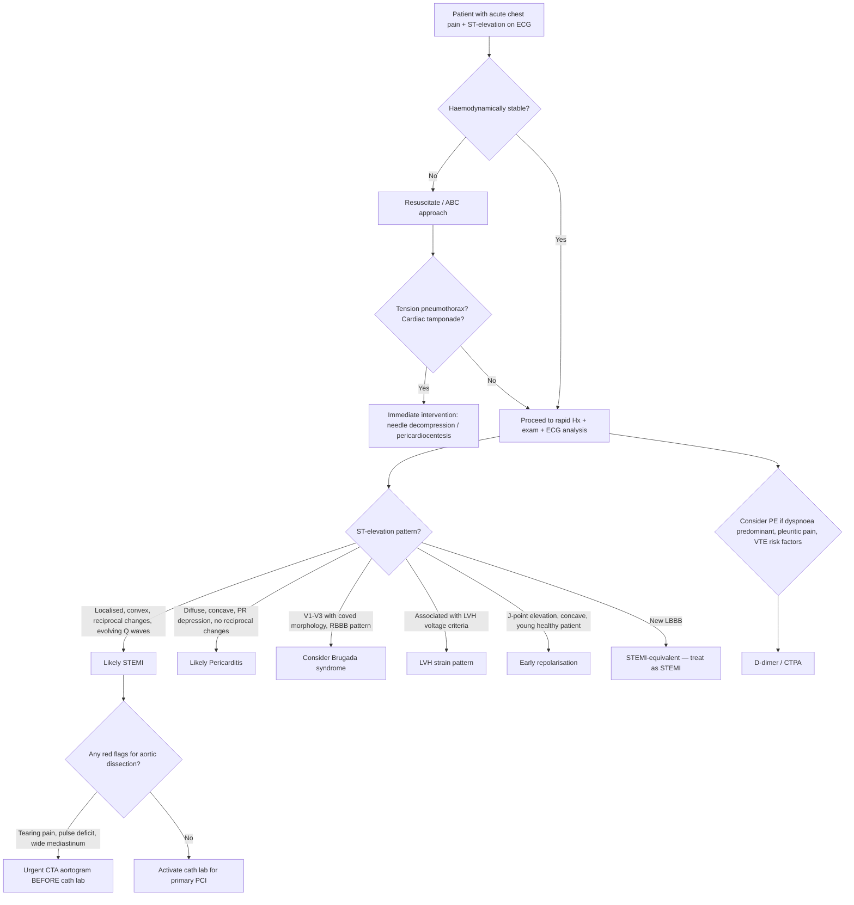

## Differential Diagnosis of STEMI

When a patient presents with acute chest pain and ST-elevation on ECG, the instinct is to activate the cath lab. But the critical first step is to consider what **else** can produce this picture — because giving dual antiplatelet therapy and anticoagulation to a patient with aortic dissection, for example, can be fatal. The differential diagnosis operates on two parallel tracks:

1. **Differential diagnosis of the clinical presentation** (acute severe chest pain)
2. **Differential diagnosis of ST-elevation on ECG** (ECG mimics of STEMI)

Both must be considered simultaneously.

---

### A. Differential Diagnosis of Acute Severe Chest Pain

***The main differential diagnoses of acute chest pain*** [1][6][7]:

| Category | Differential | Key Distinguishing Features | Why It Mimics STEMI |
|---|---|---|---|
| **Cardiac** | ***NSTEMI / Unstable Angina*** | ST depression or T-wave changes (not ST elevation); troponin may or may not rise | Same underlying pathology (ACS spectrum) but partial, not complete, occlusion |
| | ***Acute pericarditis*** | ***Sharp, knife-like, aggravated by respiratory movement; radiates to the trapezius ridge (characteristic site of pericardial pain)*** [1]; relieved by sitting forward; diffuse concave ST-elevation, PR depression | Pericardial inflammation causes widespread ST-elevation (but the morphology is different — see below) |
| | ***Myocarditis*** | Preceding viral illness; chest pain + HF symptoms; diffuse ECG changes, ↑troponin | Myocardial inflammation can cause ST-elevation and troponin rise, mimicking MI |
| | ***Takotsubo cardiomyopathy*** | Post-menopausal woman after intense emotional/physical stress; anterior ST-elevation mimicking LAD STEMI; apical ballooning on echo but clean coronaries on angiography | Catecholamine surge → apical stunning → ST-elevation + troponin rise |
| | ***Tachyarrhythmias*** | Palpitations, irregular pulse; ECG shows the arrhythmia | Rate-related demand ischaemia can cause ST changes |
| | ***Acute heart failure*** | Dyspnoea > chest pain; known cardiomyopathy; BNP markedly elevated | Acute decompensation can cause ST/T changes |
| | ***Aortic valve stenosis*** | Exertional angina + syncope + dyspnoea; ejection systolic murmur radiating to carotids; LVH on ECG | LVH strain pattern can cause ST-elevation; also, fixed obstruction causes demand ischaemia |
| | ***Hypertensive emergency*** | Markedly elevated BP (often > 180/120); evidence of end-organ damage | Severe afterload → demand ischaemia + LVH strain pattern on ECG |
| **Vascular** | ***Aortic dissection*** | ***Radiation to back, ripping or tearing sensation*** [1]; sudden onset, maximal at onset; BP differential between arms; widened mediastinum on CXR; may have pulse deficits, AR murmur | Type A dissection can extend into RCA ostium → true inferior STEMI; also, aortic dissection itself can cause ST changes via coronary malperfusion |
| | ***Symptomatic aortic aneurysm*** | Pulsatile abdominal mass (AAA) or back/chest pain; known aneurysm | Leaking aneurysm → shock → demand ischaemia |
| **Pulmonary** | ***Pulmonary embolism*** | ***Haemoptysis*** [1]; pleuritic chest pain; acute dyspnoea; DVT risk factors; sinus tachycardia, S1Q3T3 or RBBB on ECG; D-dimer elevated | Massive PE can cause right heart strain → ST-elevation in V1-V3 and inferior leads (mimics anteroseptal STEMI); also causes troponin rise from RV strain |
| | ***Tension pneumothorax*** | Sudden onset, maximal at onset; pleuritic; absent breath sounds; tracheal deviation; hypotension | Can cause ST-changes from mediastinal shift and haemodynamic compromise |
| | ***Pneumonia / pleuritis*** | Productive cough, fever, pleuritic pain worsening on inspiration; consolidation signs | Usually does not mimic STEMI on ECG but can cause chest pain confusion |
| **Gastrointestinal** | ***Oesophagitis / GERD / oesophageal spasm*** | Retrosternal burning; relationship with meals, position; relieved by antacids; no ECG changes | Oesophageal spasm can cause severe retrosternal chest pain similar to angina; may even be relieved by GTN (oesophageal smooth muscle relaxation) |
| | ***Peptic ulcer / gastritis*** | Epigastric pain; relationship to food; history of NSAID/alcohol use | Epigastric pain can be confused with inferior MI presentation |
| | ***Pancreatitis*** | Epigastric pain radiating to back; nausea/vomiting; ↑amylase/lipase | Severe epigastric pain can mimic inferior MI |
| | ***Cholecystitis*** | RUQ pain; Murphy's sign; fever; ↑WBC | Can cause referred pain and even ECG changes (rarely ST changes in inferior leads) |
| **Musculoskeletal** | ***Costochondritis / chest wall pain*** | Reproducible on palpation; sharp, localised, positional; no ECG changes | Chest wall tenderness can coexist with ACS (don't be falsely reassured!) |
| | ***Muscle injury / trauma*** | History of injury; localised tenderness | Usually obvious from history |
| **Other** | ***Herpes zoster*** | Dermatomal distribution; vesicular rash (may precede pain by days) | Pain precedes rash → can be confusing; no ECG changes |
| | ***Anxiety / panic disorder*** | Hyperventilation; tingling; young patient; situational trigger; normal ECG and troponin | Diagnosis of exclusion — never assume panic without ruling out serious causes |
| | ***Anaemia*** | Pallor; tachycardia; known chronic disease; low Hb | Severe anaemia → demand ischaemia → can precipitate Type 2 MI |

***The lecture slide from GC 028 lists the frequency of diagnoses in patients presenting with acute chest pain: Gastrointestinal 42%, Ischaemic heart disease 31%, Chest wall syndrome 28%, Pericarditis 4%, Pleuritis 2%, Pulmonary embolism 2%, Lung cancer 1.5%, Aortic aneurysm 1%, Aortic stenosis 1%, Herpes zoster 1%*** [7]. This is important — it reminds you that many patients presenting with chest pain do NOT have ACS, and GI causes are actually the most common overall.

<Callout title="The 'Big Five' Life-Threatening Differentials of Acute Chest Pain" type="error">

When a patient presents with acute severe chest pain, you must systematically exclude five potentially fatal diagnoses before settling on a benign cause:
1. ***Acute coronary syndrome (ACS — STEMI/NSTEMI)***
2. ***Aortic dissection***
3. ***Pulmonary embolism***
4. ***Tension pneumothorax***
5. ***Myopericarditis ± cardiac tamponade***

These can all present similarly with acute chest pain + haemodynamic compromise. The first 12-lead ECG, CXR, bedside echo, and focused history are your best tools to rapidly triage between them [6].
</Callout>

---

### B. Differential Diagnosis of ST-Elevation on ECG (ECG Mimics of STEMI)

This is absolutely critical for exams and clinical practice. ***Not every ST-elevation is a STEMI.*** Activating the cath lab for a patient with benign early repolarisation wastes resources and exposes the patient to unnecessary risk (arterial access, contrast, anticoagulation). Conversely, missing a true STEMI because you attributed the ST-elevation to pericarditis is deadly.

***Note that STEMI is NOT the only cause of ST elevation*** [2][9]:

| Cause of ST-Elevation | ECG Characteristics | How to Distinguish from STEMI |
|---|---|---|
| ***Acute STEMI*** | ***Localised, convex ↑ST ("tombstone"), usually III > II in inferior MI, associated with reciprocal ST depression, evolving Q waves*** [2][9] | Clinical context (acute chest pain, risk factors); reciprocal changes are virtually pathognomonic; troponin rise |
| ***Acute pericarditis*** | ***Transient PR depression ( > 0.5–0.8 mm), diffuse concave ↑ST (maximum in V5–6, II > I/III/aVF, never in aVR), J/T ratio > 25% in V6, shorter QTc*** [2][9] | Diffuse (not territorial), concave-up ("smiley face" morphology), PR depression, no reciprocal ST depression, no Q waves |
| ***LVH with strain pattern*** | ***Usually concave up, especially in V1–3, associated with other LVH features*** (Sokolow-Lyon criteria, Cornell voltage) [2][9] | LVH voltage criteria present; ST changes are "discordant" (opposite direction to QRS); no troponin rise; chronic finding |
| ***Early repolarisation ("high takeoff")*** | ***J-point elevation immediately follows S wave, concave ↑ST (highest at V2–3 up to 3 mm, rarely > 0.5 mm at V5–6, rarely > 2 mm in age > 45y, drops with tachycardia), no reciprocal ↓ST*** [2][9] | Young, healthy patient; concave ST morphology; "fish-hook" J-point notch; no reciprocal changes; no evolution over time; drops with exercise |
| ***LBBB*** | ***Can be distinguished based on Sgarbossa criteria: (1) Concordant ↑ST ≥ 1 mm in any lead → most specific for MI; (2) Concordant ↓ST ≥ 1 mm in V1–3 → specific for MI; (3) Discordant ↑ST ≥ 5 mm → less specific for MI*** [2][9] | New LBBB in setting of chest pain is treated as STEMI-equivalent (ESC/ACC guidelines); use Sgarbossa or Modified Sgarbossa (Smith) criteria to identify MI superimposed on LBBB |
| ***Ventricular aneurysm*** | ***Usually ≤ 3 mm at V1–3, may have QS pattern V1–3 if anterior, QR pattern in II/III/aVF if inferior, T wave flat or inverted → confirm by cTn negative and echo positive*** [2][9] | Persistent ST-elevation that does not evolve; troponin normal (unless new event); old Q waves; echo shows dyskinetic segment with thinned wall |
| ***Brugada syndrome*** | ***Coved ST-elevation in V1–V3 with RBBB morphology*** | No troponin rise; characteristically in young men of Southeast Asian descent; may have FHx of sudden cardiac death; provocable with ajmaline/flecainide |
| ***Pre-excitation (WPW)*** | Delta wave + short PR; can cause ST changes | Delta wave visible; history of palpitations (SVT) |
| ***Subarachnoid haemorrhage*** | ***ST-elevation due to cardiac stunting from adrenaline surge*** [2][9]; may also show widespread deep T-wave inversion, prolonged QT | Thunderclap headache; ↓consciousness; CT brain positive for SAH |
| ***Pulmonary embolism*** | Right heart strain pattern: ST-elevation in V1 (± V2–V3), inferior leads; S1Q3T3; new RBBB; sinus tachycardia | Pleuritic pain; dyspnoea > chest pain; risk factors for VTE; D-dimer elevated; CT-PA confirmatory |
| ***Hyperkalaemia*** | Peaked (tented) T waves can be confused with hyperacute T waves; severe hyperK → widened QRS → sine wave | T waves are narrow-based and peaked (vs. hyperacute T waves which are bulky and wide); QT shortened (vs. prolonged in MI); check serum K⁺ |
| ***Metabolic disturbances*** | Various ST/T changes | Clinical context; biochemistry |
| ***Cholecystitis*** | Rarely causes inferior ST changes | RUQ tenderness; ↑WBC; liver function derangement; abdominal ultrasound |

***The lecture slide explicitly lists both false positives and false negatives for ECG diagnosis of MI*** [1]:

> ***ECG False Positives for STEMI: Benign early repolarisation, LBBB, pre-excitation, Brugada syndrome, peri-/myocarditis, pulmonary embolism, subarachnoid haemorrhage, metabolic disturbances such as hyperkalaemia, failure to recognise normal limits for J-point displacement, lead transposition or use of modified lead configuration, cholecystitis*** [1]

> ***ECG False Negatives for STEMI: Prior Q waves and/or persistent ST-elevation, paced rhythm, LBBB*** [1]

<Callout title="LBBB — Both a False Positive AND a False Negative!" type="error">

***LBBB appears on BOTH lists*** [1]. Here's why:
- **False positive**: LBBB inherently causes "discordant" ST-elevation (ST segment goes in the opposite direction to the main QRS deflection), which can be mistaken for STEMI
- **False negative**: LBBB's baseline ST-elevation can **mask** the concordant ST changes of a true MI — you can't see the STEMI pattern through the LBBB

This is why ***new LBBB in the setting of ischaemic symptoms is treated as a STEMI-equivalent and warrants emergent reperfusion***. Use Sgarbossa criteria to help distinguish true MI from baseline LBBB changes [2].
</Callout>

#### Distinguishing STEMI from Key Mimics — Quick Visual Guide

The **morphology of ST-elevation** is your most important clue:

| Morphology | Shape | Think... |
|---|---|---|
| **Convex upward** ("tombstone" / "frowny face" ⌒) | Dome-shaped, ST merges with T wave | **STEMI** |
| **Concave upward** ("smiley face" ⌣) | Saddle-shaped | **Pericarditis**, early repolarisation, LVH strain |
| **Coved** (descending slope after J-point elevation) | Downsloping ST into inverted T | **Brugada syndrome** (V1–V3) |

> Quick trick: If you can imagine a "smiley face" on the ST segment (concave up) → less likely to be STEMI. If it looks like a "frown" or a "tombstone" (convex up) → think STEMI until proven otherwise.

---

### C. Distinguishing STEMI from the Three Most Important Mimics in Detail

#### 1. STEMI vs. Acute Pericarditis

| Feature | STEMI | Acute Pericarditis |
|---|---|---|
| Pain character | Crushing, heavy, constricting | ***Sharp, knife-like, aggravated by respiratory movement*** [1] |
| Pain radiation | Arms, jaw, neck | ***Trapezius ridge (characteristic)*** [1]; also back |
| Positional relief | None | Relieved by sitting forward (pericardium moves away from heart) |
| ***ST morphology*** | Convex up, localised to territory | Diffuse concave up; ***max V5–6, II > I/III/aVF, never in aVR*** [2] |
| PR segment | Normal | ***PR depression > 0.5–0.8 mm*** [2] (very specific!) |
| Reciprocal changes | Present (almost pathognomonic for STEMI) | Absent |
| Q waves | Develop in STEMI | Absent |
| Troponin | Always elevated in MI | May be mildly elevated if myocarditis component ("myopericarditis"), but much less |

**Why pericarditis causes diffuse ST-elevation**: The pericardium envelops the entire heart → inflammation is generalised → diffuse epicardial injury current → widespread ST-elevation (not confined to a single coronary territory). In contrast, STEMI occludes a single artery → ST-elevation is localised to leads overlying that territory.

**Why PR depression occurs in pericarditis**: The atrium is thin-walled and particularly susceptible to pericardial inflammation → atrial injury current → PR depression (the PR segment is generated during atrial repolarisation).

#### 2. STEMI vs. Aortic Dissection

| Feature | STEMI | Aortic Dissection |
|---|---|---|
| Pain onset | Minutes to develop | ***Sudden onset, maximal at onset*** [4][6] |
| Pain character | Crushing, heavy | ***Tearing, ripping*** [1][4] |
| Pain radiation | Arms, jaw | ***Back, interscapular, abdomen*** [4] |
| BP | ↑ or ↓ | Often ***hypertension (Type B 70%)***; may be hypotensive if tamponade/rupture [4] |
| Pulse deficits | Absent | ***Present — weak/absent carotid, brachial, or femoral*** [4] |
| New murmur | MR from papillary muscle dysfunction | ***Early diastolic decrescendo murmur (AR)*** [4] |
| CXR | Usually non-diagnostic | ***Widened mediastinum, irregular aortic outline*** [4] |
| ECG | Territorial ST-elevation | May be normal, non-specific, or show inferior STEMI (if RCA involved) |
| D-dimer | Usually normal or mildly elevated | Markedly elevated (sensitive but not specific) |
| Definitive Ix | Coronary angiography | ***CT angiography (CTA) in haemodynamically stable patients*** [4] |

**Why this distinction is life-or-death**: Aortic dissection + standard STEMI treatment (antiplatelet, anticoagulant, fibrinolytic) = catastrophic haemorrhage. Always have a high index of suspicion when pain is "maximal at onset" or "tearing" in quality, especially with a background of uncontrolled hypertension or connective tissue disease [1][4].

#### 3. STEMI vs. Massive Pulmonary Embolism

| Feature | STEMI | Massive PE |
|---|---|---|
| Pain character | Crushing, central | Pleuritic (worse on inspiration) ± central if massive; ***haemoptysis*** [1] |
| Dyspnoea | Secondary to LV failure | Primary symptom (often severe, disproportionate to pain) |
| Risk factors | ASCVD risk factors | VTE risk factors (immobilisation, surgery, malignancy, OCP, DVT) |
| Examination | LV failure signs | ***RV failure signs (↑JVP, parasternal heave)***; DVT signs; hypoxia |
| ECG | Territorial ST-elevation | Sinus tachycardia (most common), S1Q3T3, RBBB, right axis, ST-elevation in V1 ± V2–V3 |
| Troponin | Always elevated | May be mildly elevated (RV strain) |
| D-dimer | Low sensitivity for ruling in | Highly sensitive (normal D-dimer effectively rules out PE) |
| Definitive Ix | Coronary angiography | CT pulmonary angiography |

**Why massive PE can mimic anterior STEMI on ECG**: Acute RV pressure overload → RV dilatation → the RV pushes against the anterior chest wall → ST-elevation in right-sided leads (V1–V3). The S1Q3T3 pattern (S wave in lead I, Q wave and T-wave inversion in lead III) reflects the acute rightward axis shift from RV strain.

---

### D. Systematic Diagnostic Approach — Differentiating STEMI from Mimics

The practical bedside approach when you see ST-elevation:

1. **Is the patient dying right now?** → ABC, resuscitate, treat tension pneumothorax/tamponade immediately
2. **Does the clinical history fit STEMI?** → Crushing chest pain > 20 min, not relieved by GTN, risk factors, sweaty/distressed
3. **Does the ECG pattern fit STEMI?** → Localised, convex ST-elevation with reciprocal depression → strongly favours STEMI
4. **Are there red flags for an alternative diagnosis?** → Tearing pain/pulse deficits (dissection); pleuritic pain/haemoptysis (PE); positional/sharp (pericarditis); young, well, no risk factors (early repolarisation)
5. **Resolve uncertainty quickly** — serial ECGs, point-of-care troponin, bedside echo, CXR can all be done within minutes

<Callout title="When in Doubt — Treat as STEMI">

***In an ambiguous clinical scenario with ST-elevation and ischaemic symptoms, it is safer to treat as STEMI and proceed to emergent angiography*** [1][2]. The risk of missed STEMI (ongoing myocardial necrosis, arrhythmia, death) far exceeds the risk of an unnecessary cath lab activation. The only exception is when aortic dissection is strongly suspected — in that case, obtain imaging first [4].
</Callout>

---

### E. Differentiating Within the ACS Spectrum

Once you are confident the presentation is ACS (not a mimic), you must differentiate between STEMI, NSTEMI, and unstable angina, because management pathways differ:

***Important to differentiate between types of ACS to guide treatment based on: (1) Clinical presentation: severity of pain; (2) ECG: no ST changes < ↓ST < ↑ST; (3) Troponin: ↑cTn → ↑likelihood of STEMI. All features should be integrated to give a diagnosis*** [2].

| Feature | STEMI | NSTEMI | Unstable Angina |
|---|---|---|---|
| ***ECG*** | ***ST-segment elevation ± reciprocal depression → evolving Q waves*** [1][2] | ***ST depression, T-wave inversion, ± loss of R waves*** [2] | May be normal, or show ST depression / T-wave changes |
| ***Troponin*** | Always elevated (rise at 4–6h) | Elevated | Normal (by definition) |
| Pathology | Complete occlusion → transmural MI | Partial occlusion → subendocardial MI | Partial occlusion → ischaemia without necrosis |
| Reperfusion | ***Emergent (primary PCI or fibrinolysis)*** | Invasive strategy within 24–72h based on risk | Medical therapy ± elective angiography |

***The lecture slide shows the hs-troponin-based diagnostic algorithm for suspected NSTE-ACS: blood sampling at 0h → rule-out if 0h hs-cTn very low with low clinical risk → if not ruled out, repeat at 1h (or 3h depending on assay) → rule-in if significant rise or high absolute value → observe if indeterminate*** [7]. This algorithm does NOT apply to STEMI — if ST-elevation is present with ischaemic symptoms, you proceed directly to reperfusion without waiting for troponin.

***The ECG slide from GC 088 summarises: ST-segment elevation indicates full-thickness cardiac muscle injury; pathological Q-wave indicates muscle necrosis; T-wave inversion indicates muscle ischaemia*** [1].

---

<Callout title="High Yield Summary — Differential Diagnosis of STEMI">

**Three-level differential thinking:**
1. **Differential of acute chest pain** — The "Big Five" life-threatening causes: ACS, aortic dissection, PE, tension pneumothorax, myopericarditis/tamponade. Also consider GI causes (most common overall at 42%), musculoskeletal, and anxiety.
2. **Differential of ST-elevation on ECG** — Not every ST-elevation is STEMI. Key mimics: pericarditis (diffuse concave, PR depression), early repolarisation (J-point elevation, young patient), LVH strain, LBBB (use Sgarbossa), Brugada, ventricular aneurysm, PE, SAH, hyperkalaemia. ***LBBB is both a false positive and false negative*** for STEMI.
3. **Differentiating within ACS** — STEMI (ST-elevation + troponin rise → emergent reperfusion) vs NSTEMI (no ST-elevation + troponin rise → early invasive strategy) vs UA (no ST-elevation + no troponin rise → medical therapy).

**Key distinguishing clues:**
- Convex ST + reciprocal changes + evolving Q waves = STEMI
- Tearing pain, maximal at onset, pulse deficits = aortic dissection (get CTA before cath lab!)
- Diffuse concave ST + PR depression + trapezius ridge pain = pericarditis
- Pleuritic pain + haemoptysis + S1Q3T3 = PE
- New LBBB + ischaemic symptoms = STEMI-equivalent → treat as STEMI
</Callout>

---

<ActiveRecallQuiz
  title="Active Recall - Differential Diagnosis of STEMI"
  items={[
    {
      question: "List six causes of ST-elevation on ECG that are NOT acute STEMI, and for each, state one ECG feature that helps distinguish it from STEMI.",
      markscheme: "(1) Acute pericarditis: diffuse concave ST-elevation with PR depression, never in aVR. (2) Early repolarisation: J-point elevation with concave ST, no reciprocal changes, highest V2-V3. (3) LBBB: discordant ST changes; use Sgarbossa criteria. (4) LVH strain: concave up ST changes with LVH voltage criteria. (5) Ventricular aneurysm: persistent ST-elevation (usually ≤3 mm at V1-V3), no troponin rise, echo shows dyskinetic segment. (6) Brugada syndrome: coved ST-elevation in V1-V3 with RBBB morphology.",
    },
    {
      question: "A 55-year-old man presents with sudden-onset severe chest pain radiating to the back. ECG shows inferior ST-elevation. What diagnosis must you exclude before proceeding to primary PCI, and how would you distinguish it clinically and with investigations?",
      markscheme: "Must exclude aortic dissection (Type A) which can extend into the RCA ostium causing secondary inferior STEMI. Distinguish clinically by: tearing quality, maximal at onset, radiation to back, blood pressure differential between arms, pulse deficits, new AR murmur. Investigations: CXR (widened mediastinum), urgent CT aortogram or TOE. Do NOT give antiplatelet/anticoagulant/fibrinolytic therapy until dissection is excluded.",
    },
    {
      question: "Explain why LBBB appears on both the false-positive and false-negative lists for ECG diagnosis of STEMI.",
      markscheme: "False positive: LBBB causes inherent 'discordant' ST-elevation (ST segment goes in opposite direction to main QRS deflection), which can be mistaken for STEMI. False negative: LBBB's baseline ST-elevation pattern can mask the concordant ST changes of a superimposed true MI, making the STEMI invisible. Use Sgarbossa criteria to identify true MI within LBBB: concordant ST-elevation ≥1 mm (most specific), concordant ST-depression ≥1 mm in V1-V3, or discordant ST-elevation ≥5 mm.",
    },
    {
      question: "How do you differentiate the ST-elevation of acute pericarditis from that of acute STEMI based on ECG morphology alone? Name at least four distinguishing features.",
      markscheme: "(1) Distribution: pericarditis is diffuse (not following a coronary territory); STEMI is localised. (2) ST morphology: pericarditis is concave up ('smiley face'); STEMI is convex up ('tombstone'). (3) Reciprocal ST-depression: present in STEMI; absent in pericarditis. (4) PR segment: depressed (>0.5-0.8 mm) in pericarditis; normal in STEMI. (5) aVR: ST-elevation never in aVR in pericarditis but may be present in left main STEMI. (6) Q waves: develop in STEMI; absent in pericarditis.",
    },
    {
      question: "In a patient with acute chest pain and no clear ST-elevation, describe the hs-troponin-based algorithm for ruling in or ruling out NSTEMI.",
      markscheme: "Blood sampling at 0 hours. If 0h hs-cTn is very low AND clinical risk is low, rule out MI (consider differential diagnosis, possible outpatient management). If not ruled out, repeat hs-cTn at 1 hour (rapid rule-in/rule-out protocol). Rule-in if significant delta change or high absolute value. If still indeterminate, repeat at 3 hours with echocardiography and further risk stratification. This algorithm does NOT apply to STEMI — if ST-elevation present, proceed directly to reperfusion.",
    },
  ]}
/>

## References

[1] Lecture slides: GC 088. Sudden Severe Chest Pain.pdf (pp. 2, 13, 26, 30)
[2] Senior notes: Ryan Ho Cardiology.pdf (pp. 36, 54, 128, 129, 131)
[4] Senior notes: felixlai.md (Aortic Dissection section, p. 1328)
[6] Senior notes: Ryan Ho Fundamentals.pdf (pp. 199, 203, 457)
[7] Lecture slides: GC 028. Accelerating chest pain_Acute coronary (1).pdf (pp. 16, 17, 27)
[9] Senior notes: Ryan Ho Fundamentals.pdf (p. 457)
