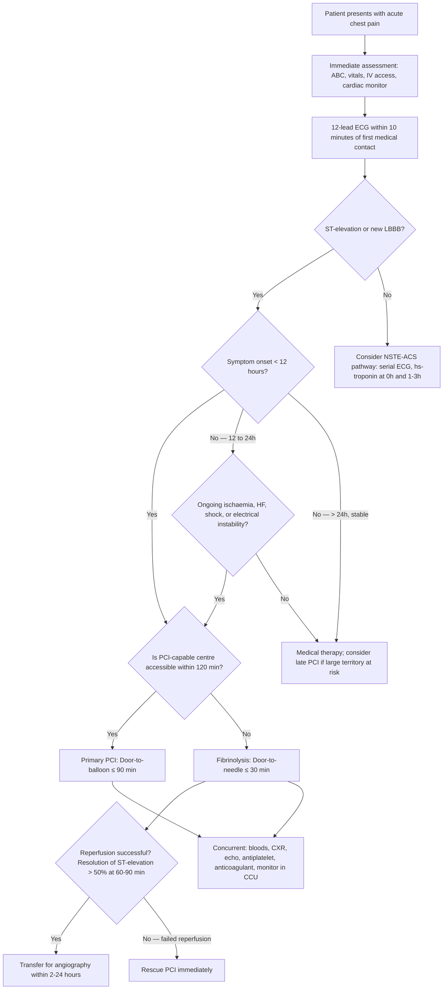
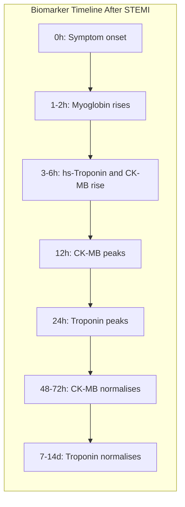
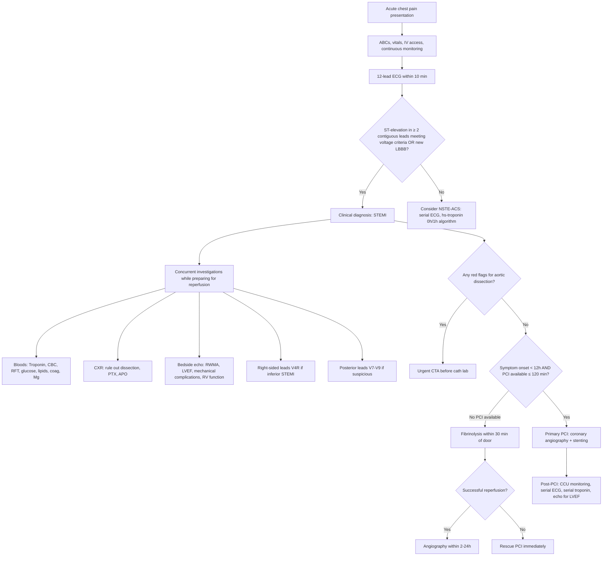

## Diagnostic Criteria for STEMI

### A. The 4th/5th Universal Definition of Myocardial Infarction (ESC/ACC/AHA/WHF 2018)

The diagnosis of MI rests on demonstrating **myocardial necrosis** (biomarker rise) in a **clinical context consistent with ischaemia**. For STEMI specifically, the ECG is the gatekeeper — you act on the ECG pattern before troponin results return.

***The formal diagnostic criteria for acute MI (Type 1 and 2)*** [1][2]:

> ***Detection of rise and/or fall of cardiac biomarkers (preferably troponin) with at least one value above the 99th percentile of the upper reference limit together with evidence of ischaemia with at least one of the following:***
> 1. ***Symptoms of ischaemia***
> 2. ***ECG changes of new ischaemia (new ST-T changes or new LBBB)***
> 3. ***Development of pathological Q waves in the ECG***
> 4. ***Imaging evidence of new loss of viable myocardium or new regional wall motion abnormality***
> 5. ***Identification of an intracoronary thrombus by angiography or post-mortem*** [1][2]

Let's unpack **why** each criterion matters from first principles:

| Criterion | Why It's Included | Pathophysiological Basis |
|---|---|---|
| **Rise and/or fall of cardiac biomarker above 99th percentile URL** | Proves myocardial **necrosis** has occurred | Myocyte membrane disruption → release of intracellular structural proteins (troponin) into the bloodstream; the "rise and/or fall" pattern distinguishes acute injury from chronic elevation (e.g., CKD) |
| **Symptoms of ischaemia** | Places the biomarker rise in clinical context | Chest pain/dyspnoea from ischaemia; without symptoms, a troponin rise alone could be from myocarditis, PE, sepsis, etc. |
| **New ST-T changes or new LBBB** | Electrochemical evidence of acute ischaemia/injury | Transmural ischaemia → injury current flows from ischaemic zone to normal zone → ST vector points toward injured territory → ST-elevation in overlying leads |
| **Pathological Q waves** | Evidence of completed transmural necrosis | Dead myocardium is electrically silent → the recording electrode "sees through" the dead tissue to the opposite wall → negative deflection (Q wave) |
| **New wall motion abnormality on imaging** | Structural proof that myocardium has stopped contracting | Necrotic/stunned muscle cannot contract → akinesis or dyskinesis on echo/MRI |
| **Intracoronary thrombus** | Direct visualisation of the culprit lesion | Angiographic confirmation of the thrombotic occlusion — the "smoking gun" |

<Callout title="Critical Nuance — STEMI Diagnosis Does NOT Wait for Troponin" type="error">

In STEMI, the diagnosis is made **clinically + ECG** and reperfusion is initiated **before** troponin results are available. Why? Because troponin takes 3–6 hours to rise above the 99th percentile (even with high-sensitivity assays, the earliest detectable rise is ~1–3 hours), but myocardium is dying from the moment of occlusion. ***The purpose of troponin in STEMI is to confirm the diagnosis retrospectively, NOT to gate the decision for reperfusion*** [1][6].
</Callout>

### B. ECG Criteria for STEMI

The ***ESC 2017/2023 guidelines*** define STEMI as new ST-elevation at the **J-point** in ≥ 2 contiguous leads meeting the following voltage thresholds:

| Lead Group | ST-Elevation Threshold |
|---|---|
| **V2–V3 in men ≥ 40 years** | ≥ 0.2 mV (2 mm) |
| **V2–V3 in men < 40 years** | ≥ 0.25 mV (2.5 mm) |
| **V2–V3 in women** | ≥ 0.15 mV (1.5 mm) |
| **All other leads (I, aVL, V4–V6, II, III, aVF)** | ≥ 0.1 mV (1 mm) |
| **V3R–V4R (right ventricular)** | ≥ 0.05 mV (0.5 mm); ≥ 0.1 mV in men < 30 yrs |
| **V7–V9 (posterior)** | ≥ 0.05 mV (0.5 mm) |

**Why are V2–V3 thresholds higher?** These leads sit directly over the thin RV free wall and septum, which are closest to the chest surface. The proximity means even normal repolarisation generates larger voltage — hence a higher threshold is needed to avoid false positives (especially early repolarisation in young men).

**Why are female thresholds lower?** Women generally have smaller hearts with less myocardial mass → smaller amplitude ECG signals → a lower voltage threshold captures the same degree of injury.

#### STEMI Equivalents (Treated as STEMI for Reperfusion Purposes)

Not all acute complete coronary occlusions produce classic ST-elevation. The following patterns warrant emergent reperfusion as STEMI-equivalents:

| Pattern | Significance |
|---|---|
| ***New LBBB*** with ischaemic symptoms | LBBB alters the entire depolarisation/repolarisation sequence → standard ST criteria cannot be applied; new LBBB in the setting of chest pain = presumed acute occlusion. Use ***Sgarbossa criteria*** to increase specificity [2][6] |
| ***Posterior MI*** (ST depression V1–V3 with tall R waves and upright T waves as reciprocal changes, or ***ST-elevation ≥ 0.5 mm in V7–V9***) [2] | Standard 12-lead ECG does not have leads directly over the posterior wall → posterior STEMI manifests as "mirror-image" changes in V1–V3 |
| ***De Winter T waves*** | Upsloping ST depression > 1 mm at the J-point in V1–V6 with tall, symmetric T waves — represents hyperacute LAD occlusion; no ST-elevation is present, but this is a STEMI-equivalent |
| ***ST-elevation in aVR with diffuse ST depression*** | Suggests ***left main stem or proximal LAD occlusion*** [2] — catastrophic territory |
| ***Hyperacute T waves*** alone with ongoing ischaemic symptoms | May represent the earliest phase of STEMI (before frank ST-elevation develops); serial ECGs ± emergent angio |

### C. Criteria for Prior (Old) MI

***Criteria for prior MI*** [1]:

> ***Development of new pathological Q waves with or without symptoms***
> ***Imaging evidence of a region of loss of viable myocardium that is thinned and fails to contract, in the absence of a non-ischaemic cause***
> ***Pathological findings post-mortem of a healed or healing myocardial infarction*** [1]

**Pathological Q waves** are defined as:
- Any Q wave in V2–V3 ≥ 0.02 s duration or QS complex
- Q wave ≥ 0.03 s duration and ≥ 0.1 mV deep (or QS complex) in any 2 contiguous leads of a lead group
- R wave ≥ 0.04 s in V1–V2 with R/S ≥ 1 (posterior MI equivalent)

Why do Q waves form? Once transmural necrosis is complete, the dead tissue is electrically inert — it neither depolarises nor repolarises. The recording electrode overlying the infarct zone effectively "looks through" the dead wall and records the electrical activity of the opposite, healthy wall moving **away** from it → inscribes a negative deflection (Q wave).

---

## Diagnostic Algorithm

The key principle: ***in STEMI, the clock starts ticking the moment the patient develops symptoms. The diagnostic pathway must be fast enough to achieve reperfusion within target times*** — **door-to-balloon ≤ 90 minutes** for primary PCI, or **door-to-needle ≤ 30 minutes** for fibrinolysis.

### Master Algorithm: From Presentation to Reperfusion Decision

***The lecture slide from GC 088 explicitly outlines the revascularisation algorithm for STEMI*** [1]:
> ***Symptom onset < 12h → PCI feasible? → Yes → Primary PCI. No → Fibrinolysis. Symptom onset ≥ 12h → Consider PCI if cardiogenic shock/heart failure, ongoing ischaemia, electrical instability, large myocardium at risk. PCI feasible within 12–24h of symptom onset if symptoms or severe ischaemia persist. Totally occluded infarct artery > 24h and asymptomatic → no routine PCI of the occluded artery*** [1].

<Callout title="Time Targets in STEMI — Memorise These">

| Metric | Target |
|---|---|
| **ECG acquisition** | ≤ 10 minutes from first medical contact |
| **Door-to-needle** (fibrinolysis) | ≤ 30 minutes |
| **Door-to-balloon** (primary PCI) | ≤ 90 minutes (≤ 60 if presenting directly to PCI centre) |
| **Total ischaemic time** (symptom onset → wire crossing) | ≤ 120 minutes (ideally) |
| **Transfer for angiography after successful fibrinolysis** | 2–24 hours |
| **Rescue PCI after failed fibrinolysis** | Immediately |

Every minute of delay = more myocardial death. The ESC considers primary PCI the preferred strategy if it can be performed within 120 minutes of STEMI diagnosis.
</Callout>

---

## Investigation Modalities — Key Findings and Interpretations

### Overview: What to Order and When

***Initial investigations for suspected ACS*** [6]:

> ***Admit CCU if high-risk (ongoing chest pain, ↓BP, APO, ventricular arrhythmia…). Bed rest with continuous ECG monitoring. 12-lead ECG stat and repeat at least daily × 3d (more frequently in severe cases). Cardiac enzymes daily × 3d (repeat troponin 6–12h later if 1st Tn is normal). Basic bloods: CBC, L/RFT, lipid profile (≤ 24h), aPTT/INR (as baseline for heparin). CXR: usually non-diagnostic in ACS, look for other causes (e.g., aortic dissection, PE, pneumonia or pneumothorax)*** [6].

### 1. Electrocardiography (ECG)

The single most important investigation in STEMI — and the fastest.

#### a. Standard 12-Lead ECG

***Perform 12-lead ECG as soon as possible*** [2] — within 10 minutes of first medical contact.

**Sequential ECG evolution in STEMI** [2]:

| Phase | Timing | ECG Finding | Pathophysiological Basis |
|---|---|---|---|
| **Hyperacute** | Minutes | ***Hyperacute T waves: bulky and wide, J point may be depressed, QT usually prolonged*** [2][6] | Earliest sign of transmural ischaemia; ↑extracellular K⁺ from ischaemic myocytes → altered repolarisation → tall, broad T waves |
| **Acute injury** | Minutes–hours | ***ST-elevation + reciprocal ST depression*** [2] | Injury current: ischaemic zone has a more negative resting potential → current of injury flows from ischaemic to normal zone during the ST segment (TQ depression = baseline shift → apparent ST-elevation) |
| **Necrosis** | Hours–days | ***Pathological Q waves (85% persist indefinitely)*** [2] | Dead myocardium is electrically silent → electrode "sees through" necrotic tissue to opposite wall → records negative deflection |
| **Resolution** | Days–weeks | ***Inverted T waves (usually ↓amplitude after acute phase)*** [2]; ST-elevation resolves | Repolarisation abnormality in recovering/scarred tissue; persistent ST-elevation after STEMI should raise suspicion for ***ventricular aneurysm*** [2] |

**How to distinguish hyperacute T waves from hyperkalaemia:**

| Feature | Hyperacute T waves (MI) | Hyperkalaemia T waves |
|---|---|---|
| Base | ***Bulky and wide*** [6] | Narrow-based, peaked ("tented") |
| QT interval | ***Prolonged*** [6] | Shortened (if QRS normal) |
| Distribution | Localised to ischaemic territory | Diffuse (all leads) |
| QRS | Normal (early) | Widens progressively |

#### b. ECG Localisation of STEMI

| Territory | ECG Leads with ST-Elevation | Culprit Artery | Special Considerations |
|---|---|---|---|
| **Anterior / Anteroseptal** | V1–V4 (± V5–V6, I, aVL) | LAD | Largest territory at risk; worst prognosis |
| **Lateral** | I, aVL, V5–V6 | LCx or diagonal | May be "electrically quiet" — fewer leads involved |
| **Inferior** | II, III, aVF | RCA (85%) or LCx (15%) | Always check V4R for RV involvement |
| ***Posterior*** | ***Reciprocal changes in V1–3 including ↓ST, R:S ≥ 1, tall upright T; ↑ST in V7–9 (typically modest)*** [2] | LCx or RCA | ***Easily missed → vigilant in inferior/lateral MI; when present, indicates extensive infarct and suggests ↑risk of death. If suspected, should place V7–9 on posterior chest wall → should show typical STEMI changes*** [2] |
| ***RV*** | ***↑ST in V1 > V2 (or ↓ST in V2); ↑ST in III > II; ↑ST in V3–6R*** [2] | RCA (proximal) | ***Easily missed → vigilant in inferior MI (complicates 40% of inferior STEMI). Very preload sensitive → C/I to nitrates and other ↓preload agents due to severe hypotension*** [2] |
| **Left Main / Proximal LAD** | ***ST-elevation in aVR with widespread ST depression*** [2] | Left main stem | Catastrophic — consider emergent CABG |

<Callout title="Don't Miss Posterior and RV MI!" type="error">

These are the two most commonly missed STEMI patterns because they are not well-seen on the standard 12-lead ECG. **Clinical rule**: In any inferior STEMI (ST-elevation in II, III, aVF), **always** obtain:
1. **Right-sided leads (V3R–V6R)** → to detect RV infarction
2. **Posterior leads (V7–V9)** → to detect posterior extension

Missing RV infarction is dangerous because these patients need **IV fluids** (preload-dependent) and **must avoid nitrates and diuretics** which can cause catastrophic hypotension [2].
</Callout>

#### c. Other Important ECG Patterns in ACS Context

| Pattern | ECG Appearance | Clinical Significance |
|---|---|---|
| ***Wellens syndrome*** | ***Deeply inverted or biphasic T waves in V2–3*** [6] | ***Highly specific for critical LAD stenosis. Extremely high risk for extensive anterior wall MI in the subsequent days/weeks*** [6] — needs urgent angiography even if troponin is normal and patient is pain-free |
| ***Pseudonormalisation of T waves*** | ***Transient normalisation of T wave from an inverted form*** [6] | ***Indicates transient recanalisation of coronary artery → prone to restenosis*** [6] |
| ***De Winter T waves*** | Upsloping ST depression at J-point in V1–V6 with tall symmetric T waves | Hyperacute LAD occlusion — STEMI equivalent despite absence of ST-elevation |

#### d. Serial ECGs

- Repeat at least **every 15–30 minutes** if initial ECG is non-diagnostic but clinical suspicion remains high
- Repeat ***at least daily × 3 days*** [6] to track evolution (development of Q waves, resolution of ST-elevation, T-wave inversion)
- More frequent monitoring if ongoing symptoms, haemodynamic instability, or arrhythmias

### 2. Serum Cardiac Biomarkers

***Primary basis of diagnosing MI*** [2]:
- ***UA: no ↑biomarkers → diagnosis based on history and ECG*** [2]
- ***MI: myocardial damage → ↑biomarkers*** [2]

#### a. Cardiac Troponin T or I (cTnT, cTnI)

| Feature | Detail | Why |
|---|---|---|
| **What it is** | Structural protein of the troponin complex (troponin C, I, T) within the cardiac sarcomere; cardiac isoforms (cTnT, cTnI) are specific to cardiac muscle | Skeletal muscle has different isoforms → cardiac troponin is highly specific for myocardial injury |
| ***Time course*** | ***Rise (4–6h) → elevated for up to 2 weeks*** [2] | Initial rise reflects release from cytoplasmic pool; prolonged elevation reflects ongoing degradation of myofibrillar-bound troponin from necrotic tissue |
| **High-sensitivity assays (hs-cTn)** | Can detect troponin at 10–100× lower concentrations than conventional assays; detectable as early as **1–3 hours** | Allows earlier rule-in/rule-out; but also detects troponin in non-ACS conditions → must interpret in clinical context |
| ***Advantages*** | ***Not normally present → ↑sensitivity, ↑specificity*** [2] | Troponin is an intracellular structural protein not found in blood under normal conditions → any elevation implies myocardial injury |
| ***Use*** | ***Detection of first infarct event*** [2] | Gold standard biomarker for diagnosing MI |
| **Rise-and-fall pattern** | The "delta" (change over serial measurements) is what distinguishes acute MI from chronic troponin elevation | Acute MI → sharp rise then fall; chronic conditions (CKD, HF) → chronically elevated without significant delta |

***Troponin can be elevated (troponin leak) in conditions other than MI*** [2]:

| Category | Examples |
|---|---|
| ***Other ischaemia*** | ***Tachycardia, coronary spasm, PCI or cardiothoracic surgery, hypoxia or hypotension*** [2] |
| ***Other myocardial injury*** | ***Myocarditis, heart failure, Takotsubo cardiomyopathy, pulmonary embolism, aortic dissection, other cardiomyopathy (e.g., infiltrative), cardiotoxins*** [2] |
| ***Systemic diseases*** | ***Renal failure, sepsis, critical illness, stroke, SAH*** [2] |

The key to interpreting troponin: **always correlate with the clinical picture and ECG**. A troponin rise in a patient with ST-elevation and crushing chest pain = STEMI. A troponin rise in a patient with sepsis and no chest pain = troponin leak from demand ischaemia or direct toxic injury.

#### b. Creatine Kinase MB Isoform (CK-MB)

| Feature | Detail | Why |
|---|---|---|
| ***Time course*** | ***Rise (4–6h) → peak (12h) → normalise (48–72h)*** [2] | Shorter window of elevation than troponin |
| ***Caveat*** | ***Not sensitive or specific (especially consider skeletal muscle damage, e.g., IM injection)*** [2] | CK-MB is also present in skeletal muscle (1–3% of total CK) → can be elevated from muscle trauma, rhabdomyolysis |
| ***Use*** | ***Mainly to detect early re-stenosis (cTn stays high for up to 10 days)*** [2] | Because CK-MB normalises within 48–72h, a new rise after initial normalisation clearly indicates a **new** ischaemic event (reinfarction). Troponin stays elevated too long to detect this reliably |

#### c. Other Biomarkers

| Marker | Features | Clinical Role |
|---|---|---|
| ***Myoglobin*** | ***First marker to rise*** [2] (1–2 hours); but very non-specific (also in skeletal muscle) | Historically used for very early detection; largely superseded by hs-troponin |
| **LDH** | Rises late (24–48h), peaks at 3–6 days, elevated for 8–14 days | Historical marker; no longer routinely used for MI diagnosis |
| **AST** | Rises at 12h, peaks at 24–48h | Non-specific (liver, muscle); no longer used for MI |
| **BNP / NT-proBNP** | Rises with myocardial wall stress (ventricular stretch) | Not diagnostic for MI per se, but prognostically useful — ↑BNP in STEMI reflects degree of LV dysfunction and predicts worse outcomes |

### 3. Basic Blood Tests

***Basic bloods: CBC, L/RFT, lipid profile (≤ 24h), aPTT/INR (as baseline for heparin)*** [6].

| Test | Rationale | Key Findings to Look For |
|---|---|---|
| **CBC** | Anaemia can cause Type 2 MI (↓O₂ delivery); WBC may be elevated from stress response/inflammation; platelets as baseline before antiplatelet therapy | ↓Hb → consider demand ischaemia; ↑WBC (leukocytosis) → stress response or infection |
| **Renal function (U&E/Cr)** | Baseline before contrast (PCI) and nephrotoxic drugs; hyperkalaemia → arrhythmia risk; AKI from cardiogenic shock | ↑Cr → CKD (risk factor + affects drug dosing); ↑K⁺ → arrhythmia risk |
| **Liver function** | "Shock liver" from cardiogenic shock; baseline before statins | ↑ALT/AST → hepatic congestion from RHF or shock liver |
| **Lipid profile** | Must be taken ***≤ 24h*** [6] of admission (acute-phase response can lower LDL after 24h, giving falsely reassuring values) | Guides long-term statin therapy targets (LDL < 1.4 mmol/L in very high risk) |
| **HbA1c / Glucose** | DM is a major risk factor; stress hyperglycaemia is common in STEMI | ↑HbA1c → undiagnosed or poorly controlled DM; hyperglycaemia in STEMI → worse prognosis |
| **aPTT / INR** | ***Baseline before heparin therapy*** [6] | Needed to guide anticoagulant dosing and monitor for over-anticoagulation |
| **ABG ± lactate** | Assess oxygenation, ventilation, acid-base status; lactate reflects tissue perfusion | Metabolic acidosis + ↑lactate → cardiogenic shock / poor perfusion |
| **Magnesium** | Hypomagnesaemia → ↑arrhythmia risk (predisposes to Torsades de Pointes) | Correct if low |

### 4. Chest X-Ray (CXR)

***CXR: usually non-diagnostic in ACS, but look for other causes (e.g., aortic dissection, PE, pneumonia or pneumothorax)*** [6].

| Finding | Significance |
|---|---|
| **Normal** | Common in STEMI — a normal CXR does not exclude MI |
| **Pulmonary oedema** (upper lobe diversion, Kerley B lines, bat-wing opacities, pleural effusions) | LV failure from extensive MI → ↑pulmonary venous pressure → Killip class II–III |
| **Cardiomegaly** | Pre-existing LV dysfunction or dilated cardiomyopathy; may also develop acutely with large infarcts |
| ***Widened mediastinum / irregular aortic outline*** | ***Raises suspicion for aortic dissection*** [4] — must exclude before giving anticoagulation/antiplatelet |
| **Pneumothorax** | Alternative diagnosis for chest pain |
| **Pneumonia/consolidation** | Alternative/concurrent diagnosis |
| **Normal cardiac silhouette with clear lung fields** | Reassuring but does not exclude MI |

### 5. Echocardiography

Echocardiography is the **most important bedside imaging modality** in STEMI. It can be done rapidly at the bedside and provides critical information:

| What It Assesses | Finding | Clinical Significance |
|---|---|---|
| **Regional wall motion abnormalities (RWMA)** | Hypokinesis/akinesis/dyskinesis in territory corresponding to culprit artery | Confirms ischaemia/infarction; correlates with ECG territory |
| **LV ejection fraction (LVEF)** | ↓LVEF | ***Strongest predictor of long-term survival*** [2]; LVEF < 40% → high risk; guides need for ACEI/ARB, BB, aldosterone antagonist, ICD consideration |
| **Mechanical complications** | New MR jet (papillary muscle rupture), VSD (septal rupture), pericardial effusion (free wall rupture/Dressler's), LV thrombus | Life-threatening — requires urgent surgical/interventional management |
| **RV function** | RV dilatation, ↓RV contractility (TAPSE < 16 mm) | Confirms RV infarction in inferior STEMI |
| **Alternative diagnoses** | Aortic dissection flap, pericardial effusion (tamponade), acute severe AR | Helps differentiate from mimics |

### 6. Coronary Angiography (Invasive)

The **definitive diagnostic and therapeutic investigation** for STEMI.

| Aspect | Detail |
|---|---|
| **Indication** | All STEMI patients undergoing primary PCI (diagnostic + therapeutic in the same session) |
| **Access** | Radial artery preferred (lower bleeding risk, earlier ambulation) vs. femoral artery |
| **Findings** | Complete thrombotic occlusion of culprit artery (TIMI 0 or 1 flow); may also identify non-culprit stenoses |
| **TIMI flow grade** | 0 = complete occlusion; 1 = penetration without perfusion; 2 = partial perfusion; 3 = normal flow (goal of PCI) |
| **Intervention** | Primary PCI = balloon angioplasty ± drug-eluting stent (DES) to the culprit lesion |
| **Additional techniques** | Thrombus aspiration (no longer routine — TOTAL trial showed no benefit); optical coherence tomography (OCT) or intravascular ultrasound (IVUS) for lesion characterisation |

### 7. Additional Investigations (Not First-Line for Acute STEMI, But Important in Specific Contexts)

| Investigation | Indication | Key Findings |
|---|---|---|
| **Cardiac MRI** | Post-STEMI for viability assessment, myocarditis vs MI differentiation, assessment of infarct size and microvascular obstruction | Late gadolinium enhancement (LGE) pattern: subendocardial/transmural in MI (follows coronary territory) vs. mid-wall/epicardial in myocarditis |
| ***CT coronary angiography*** | ***Not used acutely in STEMI*** (patient goes straight to cath lab); ***useful for stable CAD screening in low-to-intermediate pre-test probability*** [10][11] | Evaluates coronary anatomy non-invasively; excellent NPV (99–100%) for ruling out significant CAD |
| ***Myocardial perfusion imaging (MPI / SPECT)*** | ***Screening and diagnosis of CAD; determines adequacy of blood flow ± stress; determines viability of myocardium*** [11] | ***Normal → homogeneous perfusion; Ischaemia → cold spots under stress only; Infarct → cold spots at rest AND under stress*** [11] |
| **CT aortogram** | When aortic dissection is suspected (and patient is haemodynamically stable enough) | ***Identification of true and false lumens; compressed true lumen is the key radiological finding*** [4] |

---

## Putting It All Together — The Complete Diagnostic Pathway

<Callout title="High Yield Summary — Diagnosis of STEMI">

**Diagnostic Criteria (4th/5th Universal Definition):**
- Rise and/or fall of cardiac troponin above 99th percentile URL **PLUS** ≥ 1 of: ischaemic symptoms, new ST-T/LBBB, pathological Q waves, new RWMA on imaging, intracoronary thrombus on angiography/autopsy.
- **In practice, STEMI is diagnosed on ECG + clinical presentation — do NOT wait for troponin before reperfusion.**

**ECG Criteria for STEMI:**
- New ST-elevation at J-point in ≥ 2 contiguous leads: ≥ 2 mm in V2–V3 (men ≥ 40); ≥ 2.5 mm (men < 40); ≥ 1.5 mm (women); ≥ 1 mm all other leads.
- STEMI equivalents: new LBBB, posterior MI (reciprocal V1–V3 changes), De Winter T waves, ST-elevation in aVR with diffuse depression.

**Biomarkers:**
- hs-Troponin: gold standard; rises 1–6h, elevated up to 2 weeks; confirms MI but does NOT gate reperfusion decision.
- CK-MB: rises 4–6h, normalises 48–72h; useful for detecting **reinfarction**.

**Key Investigations:**
- ECG within 10 min → serial ECGs q15–30 min if non-diagnostic but suspicious
- Troponin at presentation → repeat 3–6h (or 1h with hs-assay)
- CBC, RFT, glucose, lipids ≤ 24h, coag (baseline for heparin)
- CXR: exclude mimics (dissection, PTX)
- Bedside echo: RWMA, LVEF, mechanical complications, RV function
- Coronary angiography: definitive — diagnostic + therapeutic (primary PCI)

**Time Targets:** ECG ≤ 10 min; door-to-balloon ≤ 90 min; door-to-needle ≤ 30 min.
</Callout>

---

<ActiveRecallQuiz
  title="Active Recall - STEMI Diagnostic Criteria, Algorithm, and Investigations"
  items={[
    {
      question: "State the 4th/5th Universal Definition criteria for Type 1 MI. Which component do you NOT wait for before initiating reperfusion in STEMI?",
      markscheme: "Rise and/or fall of cardiac biomarker (preferably troponin) with at least one value above the 99th percentile URL, plus at least one of: (1) symptoms of ischaemia, (2) new ST-T changes or new LBBB, (3) pathological Q waves, (4) imaging evidence of new loss of viable myocardium or RWMA, (5) intracoronary thrombus on angiography/autopsy. In STEMI, you do NOT wait for troponin results — diagnosis is made on ECG plus clinical presentation, and reperfusion is initiated immediately.",
    },
    {
      question: "What are the ECG voltage thresholds for ST-elevation at the J-point that define STEMI? Why are the thresholds different for V2-V3 compared to other leads, and different between sexes?",
      markscheme: "V2-V3 in men ≥40y: ≥ 2 mm; men < 40y: ≥ 2.5 mm; women: ≥ 1.5 mm. All other leads: ≥ 1 mm. V2-V3 thresholds are higher because these leads sit directly over the thin RV/septum, closest to the chest wall — even normal repolarisation generates larger voltages, so a higher threshold is needed to avoid false positives (especially benign early repolarisation in young men). Female thresholds are lower because smaller cardiac mass generates smaller ECG amplitudes.",
    },
    {
      question: "Describe the sequential ECG evolution in STEMI from hyperacute phase to healed MI, including the pathophysiological basis for each change.",
      markscheme: "Hyperacute: tall, broad hyperacute T waves (increased extracellular K+ from ischaemic cells alters repolarisation). Acute injury: ST-elevation with reciprocal depression (injury current from ischaemic zone to normal zone). Necrosis: pathological Q waves develop (dead tissue is electrically silent — electrode records depolarisation of opposite wall as negative deflection). Resolution: T-wave inversion (repolarisation abnormality in scarred tissue); ST resolves. Persistent ST-elevation after resolution suggests ventricular aneurysm.",
    },
    {
      question: "Why is CK-MB still clinically useful despite being inferior to troponin for initial MI diagnosis? Explain its unique advantage.",
      markscheme: "CK-MB normalises within 48-72 hours, whereas troponin remains elevated for up to 2 weeks. This shorter window means a new rise in CK-MB after initial normalisation clearly indicates reinfarction (a new ischaemic event). Troponin stays elevated too long from the index event to reliably detect a second infarct within that window. CK-MB is therefore mainly used to detect early re-stenosis or reinfarction.",
    },
    {
      question: "List four STEMI-equivalent ECG patterns that warrant emergent reperfusion despite the absence of classic ST-elevation, and explain the pathological basis of each.",
      markscheme: "(1) New LBBB with ischaemic symptoms — altered depolarisation masks ST-elevation; presumed acute occlusion. (2) Posterior MI: ST depression + tall R + upright T in V1-V3 (reciprocal/mirror changes of posterior ST-elevation); confirm with V7-V9. (3) De Winter T waves: upsloping ST depression at J-point in V1-V6 with tall symmetric T waves — represents hyperacute LAD occlusion. (4) ST-elevation in aVR with diffuse ST depression — suggests left main stem or proximal LAD occlusion causing global subendocardial ischaemia with only aVR (which faces the cavity) showing elevation.",
    },
  ]}
/>

## References

[1] Lecture slides: GC 088. Sudden Severe Chest Pain.pdf (pp. 21, 26, 30, 35, 48)
[2] Senior notes: Ryan Ho Cardiology.pdf (pp. 117, 127, 128, 131, 142)
[4] Senior notes: felixlai.md (Aortic Dissection section, p. 1328)
[5] Senior notes: Ryan Ho Critical Care.pdf (pp. 17, 22)
[6] Senior notes: Ryan Ho Fundamentals.pdf (pp. 203, 448, 457)
[10] Senior notes: Ryan Ho Diagnostic Radiology.pdf (p. 43)
[11] Senior notes: Ryan Ho Diagnostic Radiology.pdf (p. 57)
