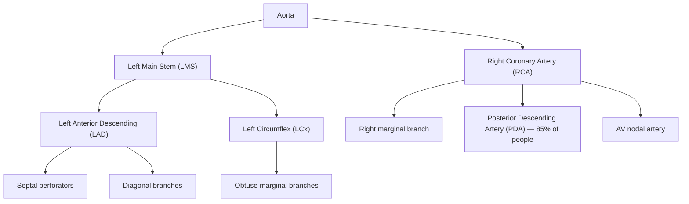
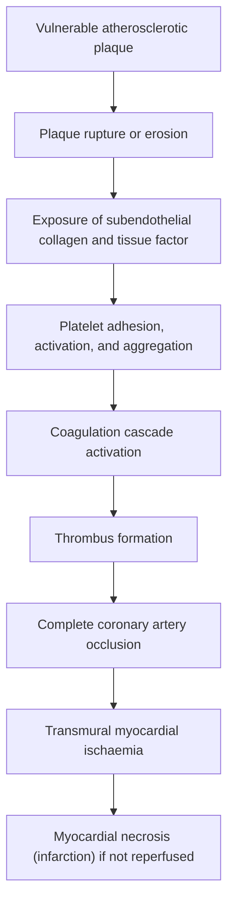
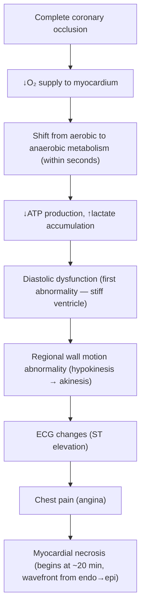
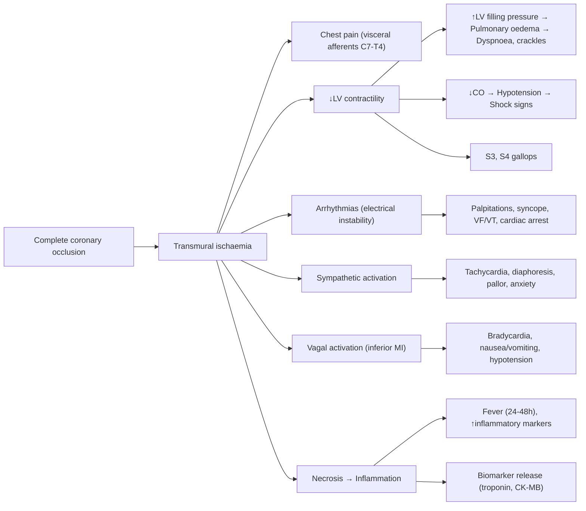

## Definition and Overview

STEMI stands for **ST-Elevation Myocardial Infarction**. Let's break the name down:
- **ST-Elevation** → refers to the characteristic ECG finding where the ST segment is raised above the baseline, indicating **transmural (full-thickness) myocardial ischaemia**
- **Myocardial** → "myo" = muscle, "cardial" = heart → heart muscle
- **Infarction** → tissue death (necrosis) due to prolonged ischaemia

***STEMI is a clinical syndrome defined by symptoms of acute myocardial ischaemia in the presence of persistent new ST-elevation on ECG, with subsequent rise of cardiac biomarkers of myocardial necrosis*** [1]. It sits within the broader spectrum of **Acute Coronary Syndrome (ACS)**, which includes:

| ACS Subtype | ST-Elevation on ECG | Troponin Rise | Underlying Pathology |
|---|---|---|---|
| **STEMI** | Yes (persistent ≥ 20 min) | Yes | Complete coronary occlusion |
| **NSTEMI** | No (may have ST depression/T-wave changes) | Yes | Partial/intermittent occlusion |
| **Unstable Angina (UA)** | No | No | Partial/intermittent occlusion without necrosis |

***The key distinction is that STEMI represents acute, complete thrombotic occlusion of a coronary artery, leading to transmural ischaemia and necrosis*** [1][2]. This is a **time-critical emergency** — "time is myocardium."

> **Terminology recap from lecture slides** [2]:
> - ***Stable angina: ischaemia due to fixed stenosis***
> - ***Unstable angina: ischaemia due to dynamic obstruction***
> - ***Myocardial infarction: myocardial necrosis due to acute occlusion***

<Callout title="Universal Classification of MI (5th Universal Definition, 2018)">

- **Type 1 MI**: Spontaneous MI due to atherosclerotic plaque rupture, erosion, fissuring, or dissection → intraluminal thrombus → this is the classic STEMI
- **Type 2 MI**: MI secondary to oxygen supply-demand mismatch (e.g., coronary spasm, anaemia, hypotension, tachyarrhythmia) — NOT due to plaque rupture
- **Type 3 MI**: MI resulting in death when biomarkers are unavailable (cardiac death with ischaemic symptoms/ECG changes but death before blood drawn)
- **Type 4a/4b/4c MI**: MI related to PCI (4a = periprocedural, 4b = stent thrombosis, 4c = restenosis)
- **Type 5 MI**: MI related to CABG

STEMI is almost always **Type 1 MI**.
</Callout>

---

## Epidemiology

### Global Epidemiology
- **Incidence**: In Western countries, the incidence of STEMI has been **declining** over the past two decades (likely due to better primary prevention, statin use, smoking cessation campaigns), while NSTEMI incidence has been relatively stable or increasing
- Annual incidence of STEMI in Europe: approximately 40–60 per 100,000 population
- In the United States: approximately 250,000 STEMI presentations per year
- **In-hospital mortality** for STEMI has dropped significantly with primary PCI, now approximately **4–6%** in centres with modern reperfusion strategies, but **30-day mortality** remains around 7–8%

### Hong Kong Epidemiology
- **Coronary artery disease (CAD) is the 3rd leading cause of death in Hong Kong** (after malignant neoplasms and pneumonia)
- ***Ischaemic heart disease accounts for approximately 12–15% of all deaths in HK*** [2]
- The Hong Kong population has a rising prevalence of metabolic risk factors (diabetes, hypertension, obesity) partially offset by declining smoking rates
- The **door-to-balloon time** in Hong Kong's public hospitals has improved significantly with the establishment of a 24/7 primary PCI service network across Hospital Authority clusters
- Mean age of presentation is typically **60–70 years**, with a **male predominance** (M:F ≈ 3:1)

### Demographics and Trends
- **Sex**: Men are affected significantly more often than women, especially before age 55. Post-menopausal women lose the protective effect of oestrogen on the endothelium and lipid profile
- **Age**: Risk increases exponentially after age 45 in men and 55 in women
- **Ethnicity**: South Asians have higher rates of premature CAD compared to East Asians, but CAD is rapidly rising in Chinese populations with Westernisation of diet and lifestyle

---

## Risk Factors

Risk factors for STEMI are essentially the risk factors for **atherosclerotic cardiovascular disease (ASCVD)**, since STEMI arises from atherosclerotic plaque rupture [2][3].

### Non-Modifiable Risk Factors
| Factor | Explanation |
|---|---|
| ***Advanced age*** | Cumulative exposure to risk factors; age-related endothelial dysfunction and arterial stiffening |
| ***Male sex*** | Oestrogen in premenopausal women is protective (↑HDL, ↓LDL, vasodilatory via NO); after menopause, female risk approaches male risk |
| ***Family history of premature CVD*** | 1st-degree male relative < 55 yrs or female relative < 65 yrs; implies genetic susceptibility to atherogenesis (e.g., familial hypercholesterolaemia, polymorphisms affecting LDL receptor, lipoprotein(a)) |
| **Previous vascular event** | Prior MI, stroke, or PVD indicates established atherosclerosis with ongoing plaque burden |

### Modifiable Risk Factors
| Factor | Mechanism of Atherogenesis |
|---|---|
| ***Cigarette smoking*** | Endothelial injury via free radicals → ↑LDL oxidation, ↓NO bioavailability, ↑platelet activation, ↑fibrinogen → prothrombotic state |
| ***Hypertension*** | Mechanical shear stress on endothelium → endothelial dysfunction → facilitates lipid infiltration and plaque growth; also promotes LVH (↑O₂ demand) |
| ***Dyslipidaemia*** (***↑LDL, ↓HDL***) | LDL particles infiltrate the intima and undergo oxidation → trigger macrophage uptake → foam cell formation → fatty streak → plaque. HDL performs reverse cholesterol transport (protective). Target LDL < 1.4 mmol/L in very high-risk patients (ESC 2019/2024) |
| ***Diabetes mellitus*** | Hyperglycaemia → advanced glycation end products (AGEs) → endothelial dysfunction; insulin resistance → ↑FFA → oxidative stress; DM also promotes a prothrombotic state (↑PAI-1, ↑fibrinogen). ***DM is a coronary heart disease risk equivalent*** [3] |
| ***Abdominal obesity*** | Central adiposity → ↑FFA release, ↑inflammatory adipokines (TNF-α, IL-6), ↓adiponectin → insulin resistance → metabolic syndrome [3] |
| ***Physical inactivity*** | ↓AMPK activation → ↓glucose uptake, ↓FFA metabolism → insulin resistance; ↓endothelial shear-mediated NO production |
| ***Diet*** | High saturated fat, trans fat, refined carbohydrates → dyslipidaemia; high sodium → HTN |

### Other Contributing Factors
- **Cocaine use**: Causes coronary vasospasm + ↑sympathetic drive (↑HR, ↑BP → ↑O₂ demand) + direct endothelial toxicity + prothrombotic state → can cause STEMI even in young patients with normal coronaries
- **Chronic kidney disease (CKD)**: Accelerated atherosclerosis, uraemic toxins damage endothelium, disordered calcium-phosphate metabolism → vascular calcification
- **Autoimmune/inflammatory conditions** (SLE, RA): Chronic systemic inflammation accelerates atherogenesis
- **Obstructive sleep apnoea**: Intermittent hypoxia → sympathetic activation → endothelial dysfunction
- **Oral contraceptive pills** and **HRT**: Mildly ↑thrombotic risk

<Callout title="High Yield — ASCVD Risk Assessment" type="idea">

***Formal ASCVD risk assessment is indicated if ≥40 years old with ≥1 ASCVD risk factor*** [3]. Tools include the Framingham Risk Score, SCORE2, ACC/AHA ASCVD calculator, and the Chinese Multiprovincial Cohort Study (CMCS) for the Chinese population. Risk assessment guides the intensity of primary prevention (especially statin therapy and BP targets).
</Callout>

---

## Anatomy and Function

### Coronary Artery Anatomy

Understanding coronary anatomy is crucial because **the territory of infarction and its complications are directly determined by which artery is occluded**.

The heart is supplied by two coronary arteries arising from the **aortic sinuses of Valsalva** (just above the aortic valve):

#### Left Coronary Artery (LCA)
- Arises from the **left coronary sinus**
- **Left Main Stem (LMS)**: short trunk (0.5–2 cm) that bifurcates into:
  - ***Left Anterior Descending (LAD)***: Runs in the anterior interventricular groove
    - Supplies: **anterior wall of LV**, **anterior 2/3 of interventricular septum**, **apex**
    - Branches: septal perforators (supply septum), diagonal branches (supply anterolateral wall)
    - **LAD occlusion → anterior STEMI** (the most dangerous territory — large area of myocardium at risk)
  - ***Left Circumflex (LCx)***: Runs in the left atrioventricular groove
    - Supplies: **lateral wall of LV**, **posterior wall of LV** (in left-dominant systems)
    - Branches: obtuse marginal branches
    - **LCx occlusion → lateral STEMI**

#### Right Coronary Artery (RCA)
- Arises from the **right coronary sinus**
- Runs in the right atrioventricular groove
- ***Supplies: RV, inferior wall of LV, posterior 1/3 of interventricular septum, SA node (in ~60%), AV node (in ~80% — right dominant circulation)***
- Branches: **posterior descending artery (PDA)** in right-dominant systems (85% of population), marginal branches
- **RCA occlusion → inferior STEMI** (often with RV involvement)

#### Coronary Dominance
- **Right dominant (~85%)**: PDA arises from the RCA — so the RCA supplies the inferior wall and AV node
- **Left dominant (~8%)**: PDA arises from the LCx
- **Co-dominant (~7%)**: Both contribute to the PDA

### Correlation: Occluded Artery → ECG Territory → Wall Affected

| Culprit Artery | ECG Leads with ST-Elevation | Myocardial Wall | Key Complications |
|---|---|---|---|
| **LAD** | V1–V4 (± V5–V6) | Anterior, anteroseptal, apex | LV failure, cardiogenic shock (large territory), VSD, LV aneurysm, free wall rupture |
| **LCx** | I, aVL, V5–V6 (± high lateral leads) | Lateral, posterolateral | Papillary muscle rupture (posteromedial) causing acute MR |
| **RCA** | II, III, aVF (± V3R–V4R for RV) | Inferior, RV (proximal RCA), posterior (if dominant) | Bradycardia/AV block (AV node ischaemia), RV infarction, papillary muscle rupture |
| **Left Main** | aVR elevation + widespread ST depression | Global LV ischaemia | Cardiogenic shock, cardiac arrest |

<Callout title="Clinical Pearl — RV Infarction" type="idea">

Always check **right-sided ECG leads (V3R, V4R)** in any inferior STEMI. RV infarction occurs in ~30–50% of inferior STEMIs (proximal RCA occlusion). Management differs — these patients are **preload-dependent**, so avoid nitrates and diuretics (which reduce preload and can cause catastrophic hypotension). Instead, give **IV fluids**.
</Callout>

### Myocardial Oxygen Supply and Demand

The heart is uniquely vulnerable to ischaemia because:
1. **Highest O₂ extraction rate** of any organ at rest (~70–80% of delivered O₂ is extracted) → very little reserve to increase extraction
2. Therefore, the **only way to increase O₂ supply is to increase coronary blood flow**
3. Coronary perfusion occurs predominantly in **diastole** (unlike other organs) because systolic contraction compresses intramural vessels

| O₂ Supply Factors | O₂ Demand Factors |
|---|---|
| Coronary blood flow (diastolic BP, coronary vessel calibre) | Heart rate (most important determinant) |
| O₂ content of blood (Hb, SaO₂) | Myocardial contractility |
| Coronary perfusion pressure | Wall stress (= pressure × radius / 2 × wall thickness → Laplace's law) |
| Duration of diastole | Afterload (systolic BP) |

---

## Etiology

The etiology of STEMI can be understood through the lens of **why a coronary artery suddenly becomes completely occluded**.

### Primary Etiology: Atherosclerotic Plaque Rupture / Erosion (> 90%)

***The vast majority of STEMI is caused by acute thrombotic occlusion of a coronary artery, triggered by rupture or erosion of a vulnerable atherosclerotic plaque*** [1][2].

#### The Atherosclerotic Plaque — Formation (Brief Review)
1. **Endothelial injury** (from HTN, smoking, dyslipidaemia, DM) → ↑permeability
2. **LDL infiltration** into the intima → oxidised LDL (oxLDL)
3. **Inflammatory response**: Monocytes migrate into intima → differentiate into macrophages → engulf oxLDL → become **foam cells** → **fatty streak**
4. **Smooth muscle cell (SMC) migration** from media to intima → proliferate and produce extracellular matrix → forms a **fibrous cap** over the lipid-rich necrotic core
5. Progressive growth → **atherosclerotic plaque** with a fibrous cap and a lipid/necrotic core

#### The Vulnerable Plaque
Not all plaques are equal. The plaque most likely to rupture is the **"vulnerable" or "unstable" plaque**, which has:
- **Thin fibrous cap** (< 65 μm) — due to ↓SMC content and ↑matrix metalloproteinase (MMP) activity from activated macrophages
- **Large lipid-rich necrotic core** (occupying > 40% of plaque volume)
- **↑Inflammatory infiltrate** (macrophages, T-cells) at the "shoulder" regions of the plaque
- **↑Neovascularization** within the plaque (→ more fragile, prone to intraplaque haemorrhage)

<Callout title="Why Do Mild Stenoses Cause Most STEMIs?" type="error">

Counterintuitively, most STEMIs arise from plaques causing only **mild-to-moderate stenosis** ( < 50% luminal narrowing) rather than severe stenoses. Why?
- Severe stenoses tend to have thick, stable fibrous caps (remodelled over time) and well-developed collaterals
- Mild/moderate plaques with thin caps and large lipid cores are the ones prone to sudden rupture
- This is why **stress tests and even angiography may fail to predict which plaque will cause a STEMI** — the "culprit" plaque often looks innocent on prior imaging
</Callout>

#### The Acute Event: Plaque Rupture → Thrombosis → Occlusion

***The pathophysiological sequence of STEMI*** [1]:

Step-by-step:
1. **Plaque rupture/erosion**: Physical disruption of the fibrous cap exposes the thrombogenic lipid core and subendothelial collagen to flowing blood
2. **Platelet adhesion**: vWF mediates platelet adhesion to exposed collagen via GP Ib receptors → platelet activation → release of ADP and TXA₂ → recruits more platelets
3. **Platelet aggregation**: Activated platelets express **GP IIb/IIIa receptors** which bind fibrinogen, cross-linking platelets together → platelet plug ("white thrombus")
4. **Coagulation cascade**: Exposed **tissue factor** activates the extrinsic pathway → thrombin generation → converts fibrinogen to fibrin → stabilises the platelet plug → "red thrombus" (fibrin-rich)
5. **Complete occlusion**: The thrombus completely occludes the coronary lumen → no blood flow → ischaemia of the entire downstream territory

> This is why STEMI treatment targets **every step** of this cascade: ***antiplatelets*** (aspirin blocks TXA₂; P2Y₁₂ inhibitors block ADP receptors; GP IIb/IIIa inhibitors block the final common pathway of aggregation), ***anticoagulants*** (heparin inhibits thrombin and factor Xa), and ***reperfusion*** (primary PCI mechanically reopens the vessel, or fibrinolytics dissolve the clot) [1][2].

### Secondary/Less Common Etiologies of STEMI

While > 90% of STEMI is due to atherothrombosis, the following can also cause ST-elevation MI:

| Cause | Mechanism | Clinical Scenario |
|---|---|---|
| **Coronary artery spasm (Prinzmetal/variant angina)** | Intense vasospasm → transient complete occlusion | Young patients, often smokers, may have normal coronaries; ST-elevation during spasm, resolves with nitrates |
| **Spontaneous coronary artery dissection (SCAD)** | Intimal tear or vasa vasorum haemorrhage → intramural haematoma → luminal compression | Young women, peripartum, fibromuscular dysplasia |
| **Coronary embolism** | Embolic material lodges in coronary artery | AF, IE (vegetations), prosthetic valves, paradoxical embolism (PFO) |
| **Coronary arteritis/vasculitis** | Inflammation → coronary stenosis/occlusion | Kawasaki disease (children — coronary aneurysms), Takayasu arteritis, SLE |
| **Supply-demand mismatch (Type 2 MI)** | Severe ↑demand or ↓supply without plaque rupture | Severe anaemia, hypotension, tachyarrhythmia, aortic stenosis, thyrotoxicosis — though these more commonly cause NSTEMI/demand ischaemia |
| **Cocaine/amphetamines** | Coronary vasospasm + ↑demand (↑HR, ↑BP) + prothrombotic | Young patients presenting with chest pain after drug use |
| **Aortic dissection** | Dissection flap extends into coronary ostium (usually RCA → inferior STEMI) | Tearing chest pain radiating to back, pulse deficits, wide mediastinum on CXR |
| **Takotsubo cardiomyopathy** | Catecholamine surge → apical ballooning; can mimic anterior STEMI on ECG | Post-menopausal women after intense emotional/physical stress; ST-elevation with apical akinesis but no culprit lesion on angiography |

<Callout title="Don't Miss Aortic Dissection Mimicking STEMI!" type="error">

***If a patient presents with STEMI features but also has tearing back pain, pulse deficits, or a widened mediastinum on CXR, consider aortic dissection*** [4]. Type A dissection can occlude the RCA ostium → inferior STEMI. Giving antiplatelet/anticoagulant therapy or performing PCI on an undiagnosed dissection is catastrophic. Always consider this differential — a quick CXR and bedside echo can be life-saving.
</Callout>

---

## Pathophysiology of STEMI

### The Ischaemic Cascade

Once a coronary artery is completely occluded, a predictable sequence of events unfolds in the myocardium downstream — the **ischaemic cascade**:

Key points:
1. **Diastolic dysfunction precedes systolic dysfunction** — the myocyte cannot relax properly due to ATP depletion (ATP is needed for calcium reuptake into the sarcoplasmic reticulum via SERCA)
2. **ECG changes appear before pain** — this is why silent ischaemia exists
3. **Necrosis begins in the subendocardium** and progresses outward toward the epicardium as a "wavefront" (Reimer and Jennings, 1979) — ***this is why early reperfusion salvages myocardium*** [1]

### The Wavefront Phenomenon of Necrosis

- **Subendocardium is most vulnerable** to ischaemia because:
  - It is furthest from the epicardial coronary arteries
  - It has the highest wall stress (highest intramural pressure during systole → greatest extravascular compression)
  - It has the highest metabolic demand (greatest sarcomere shortening)
- **Timeline of necrosis** (approximate):
  - **< 20 minutes**: Reversible injury — reperfusion at this point results in full recovery ("stunned myocardium")
  - **20–60 minutes**: Subendocardial necrosis begins
  - **3–6 hours**: Necrosis extends through most of the wall thickness
  - **> 6 hours**: Transmural necrosis is largely complete; reperfusion benefit diminishes significantly
  - **12–24 hours**: Essentially complete transmural infarction

> ***This is the basis for the "golden hour" and "door-to-balloon time" targets: every minute of occlusion = more myocardial death. The ESC and ACC/AHA guidelines target a door-to-balloon time of ≤ 90 minutes for primary PCI, and a door-to-needle time of ≤ 30 minutes for fibrinolysis*** [1].

### Cellular and Molecular Pathophysiology

At the cellular level:
1. **ATP depletion** → failure of Na⁺/K⁺-ATPase → cell swelling → failure of Ca²⁺ homeostasis → calcium overload → hypercontracture, mitochondrial damage
2. **Anaerobic glycolysis** → lactic acid accumulation → intracellular acidosis → further enzyme dysfunction
3. **Free radical generation** (especially upon reperfusion) → lipid peroxidation of cell membranes → cell death
4. **Irreversible injury markers**: mitochondrial swelling, amorphous matrix densities, sarcolemmal disruption → release of intracellular contents (troponin, CK-MB, myoglobin) into the bloodstream → **this is what we measure as cardiac biomarkers**

### Reperfusion Injury

Paradoxically, restoring blood flow can itself cause additional injury ("reperfusion injury"):
- **Mechanism**: Sudden re-introduction of oxygenated blood to ischaemic tissue → massive reactive oxygen species (ROS) generation → oxidative damage, calcium overload, inflammatory cell infiltration, microvascular obstruction ("no-reflow phenomenon")
- **Clinical significance**: May account for up to 50% of final infarct size
- This is an active area of research; currently no clinically proven therapy specifically prevents reperfusion injury, though **ischaemic conditioning** protocols are being studied

---

## Classification

STEMI can be classified in several clinically relevant ways:

### 1. By Anatomical Territory (Based on Culprit Artery)

| Type | Culprit Artery | ECG Leads | Notes |
|---|---|---|---|
| **Anterior STEMI** | LAD | V1–V4 (± V5–V6, I, aVL) | Largest territory; worst prognosis |
| **Anteroseptal STEMI** | LAD (septal perforators) | V1–V3 | Risk of septal rupture (VSD) |
| **Lateral STEMI** | LCx or diagonal branch | I, aVL, V5–V6 | May be electrically "silent" (fewer leads) |
| **Inferior STEMI** | RCA (or LCx if left-dominant) | II, III, aVF | Check for RV involvement (V4R) |
| **Posterior STEMI** | RCA or LCx (posterior descending) | V7–V9 (+ reciprocal changes: tall R, ST depression in V1–V3) | Often missed — must actively look |
| **Right Ventricular STEMI** | Proximal RCA | V3R–V4R (+ inferior leads) | Preload-dependent; avoid nitrates/diuretics |

### 2. By Timing (Evolution of MI)

| Phase | Timing | Pathological Features |
|---|---|---|
| **Acute/Evolving STEMI** | 0–7 days | Active ischaemia/necrosis; hyperacute T waves → ST elevation → Q wave development |
| **Recent STEMI** | 7–28 days | Organisation of necrosis; ST segment resolving; T-wave inversion developing |
| **Old/Healed MI** | > 28 days | Fibrotic scar; persistent Q waves; T-wave changes may normalise or persist |

### 3. By Universal Classification of MI

As described above (Types 1–5). STEMI is overwhelmingly **Type 1 MI**.

### 4. Killip Classification (Functional/Haemodynamic Severity at Presentation)

This is a bedside clinical classification that predicts mortality:

| Killip Class | Clinical Features | 30-day Mortality |
|---|---|---|
| **I** | No evidence of heart failure | ~6% |
| **II** | Mild HF: S3 gallop, lung crackles in lower half of lung fields, ↑JVP | ~17% |
| **III** | Overt pulmonary oedema | ~38% |
| **IV** | Cardiogenic shock (SBP < 90, signs of end-organ hypoperfusion) | ~80% (without intervention) |

### 5. TIMI Flow Grade (Angiographic Assessment of Coronary Flow)

Used during angiography to assess flow in the culprit artery:

| TIMI Grade | Description |
|---|---|
| 0 | Complete occlusion — no flow |
| 1 | Penetration without perfusion — contrast passes but doesn't fill the distal vessel |
| 2 | Partial perfusion — distal vessel fills but slowly |
| 3 | Normal flow — complete filling at normal rate |

> The goal of primary PCI is to achieve **TIMI 3 flow**.

---

## Clinical Features

### Overview

***The clinical features of STEMI encompass symptoms of acute myocardial ischaemia plus signs of its haemodynamic and autonomic consequences*** [1][2]. The presentation can range from classic crushing chest pain to atypical presentations (especially in the elderly, women, and diabetics).

---

### A. Symptoms

#### 1. ***Chest Pain*** (Cardinal Symptom)

This is the defining symptom of STEMI and its characteristics are crucial for recognition:

| OPQRST | Description | Pathophysiological Basis |
|---|---|---|
| **Onset** | ***Acute onset, typically takes minutes to develop*** [2]; may occur at rest or with exertion; often in the early morning (↑catecholamines, ↑platelet aggregability, ↑cortisol on waking) | Sudden complete coronary occlusion → immediate onset of ischaemia |
| **Provocation** | ***At rest*** (unlike stable angina which occurs with exertion) [2]; ***NOT relieved by rest or sublingual GTN*** (differentiates from stable angina where GTN works in ≤ 5 min) | Complete occlusion means there is no residual flow — reducing demand alone (rest) or vasodilation (GTN) cannot overcome complete obstruction |
| **Quality** | ***Dull, constricting, crushing, choking, squeezing, "heavy"*** [2]; patients often describe it as a "pressure" or "tightness" rather than a "sharp pain"; ***Levine's sign: clenched fist on chest*** | Visceral pain from ischaemic myocardium is poorly localised (transmitted via cardiac sympathetic afferents C7–T4 → referred pain pattern); unlike somatic pain which is sharp and well-localised |
| **Radiation** | ***Arms (especially left), shoulder, neck, jaw, epigastrium, interscapular region*** | Referred pain: cardiac afferents share spinal cord segments (C7–T4) with somatic afferents from these dermatomes → brain misinterprets the origin |
| **Severity** | Usually described as the "worst pain ever"; typically rated 8–10/10 | Transmural ischaemia stimulates a massive afferent nerve discharge |
| **Time** | ***Prolonged > 20 minutes*** (often 30 min to hours); does not wax and wane like stable angina | Unlike transient ischaemia (stable angina), complete occlusion produces sustained ischaemia until reperfusion occurs |

<Callout title="Atypical Presentations — Don't Miss These!" type="error">

Up to **30% of MIs** present **atypically**, especially in:
- **Elderly** (> 75 years): may present with dyspnoea, confusion, syncope, or just "feeling unwell" rather than chest pain
- **Women**: more likely to present with fatigue, nausea, dyspnoea, or neck/jaw pain without classical chest pain
- **Diabetics**: autonomic neuropathy → ↓pain perception → **"silent MI"** (painless); may present with unexplained heart failure, hypotension, or arrhythmia
- **Post-operative patients**: pain may be attributed to surgical wound

Always maintain a **low threshold for ECG** in these populations!
</Callout>

#### 2. Autonomic Symptoms

| Symptom | Pathophysiological Basis |
|---|---|
| **Diaphoresis** (profuse sweating) | Massive sympathetic activation in response to pain and haemodynamic compromise → activation of sweat glands (sympathetic cholinergic fibres) |
| **Nausea and vomiting** | Particularly common in **inferior STEMI** (vagal afferents from the inferior myocardium → medullary vomiting centre); also due to pain-mediated vagal stimulation (Bezold-Jarisch reflex) |
| **Anxiety / "sense of impending doom"** (angor animi) | Massive sympathetic discharge + cortical perception of life-threatening event |
| **Pallor** | Sympathetic vasoconstriction redirecting blood to vital organs (compensatory response to ↓CO) |

> The **Bezold-Jarisch reflex** is important in inferior STEMI: stimulation of vagal afferents in the inferior/posterior LV wall → paradoxical bradycardia and hypotension (vasovagal response). This is why inferior STEMI often presents with **sinus bradycardia + hypotension** → treat with atropine and IV fluids, not pressors initially.

#### 3. Dyspnoea

| Mechanism | Explanation |
|---|---|
| **LV systolic dysfunction** | Ischaemia/necrosis of myocardium → ↓contractility → ↑LV end-diastolic pressure → pulmonary venous congestion → pulmonary oedema → dyspnoea |
| **LV diastolic dysfunction** | Ischaemia impairs relaxation (ATP needed for calcium reuptake) → ↑filling pressures even before systolic failure occurs |
| **Anxiety and pain** | ↑Respiratory rate as part of sympathetic activation |

Dyspnoea may be the **predominant or sole symptom** in elderly/diabetic patients ("anginal equivalent").

#### 4. ***Syncope / Pre-syncope***

| Mechanism | Explanation |
|---|---|
| **Arrhythmia** | VT/VF (especially in anterior STEMI) → ↓CO → cerebral hypoperfusion → syncope |
| **Bradycardia** | AV block (especially inferior STEMI → AV nodal ischaemia from RCA) → ↓HR → ↓CO |
| **Cardiogenic shock** | Massive LV dysfunction → ↓CO → hypotension → syncope |
| **Vasovagal** | Bezold-Jarisch reflex in inferior MI |

#### 5. Other Symptoms

- **Palpitations**: Due to arrhythmias (sinus tachycardia, atrial fibrillation, ventricular ectopics, VT)
- **Fatigue and weakness**: ↓CO → ↓tissue perfusion → generalised weakness
- **Epigastric discomfort**: Especially in inferior MI — visceral afferents overlap with GI innervation; may be misdiagnosed as "indigestion"

---

### B. Signs

#### 1. General Appearance

| Sign | Pathophysiological Basis |
|---|---|
| **Distressed, anxious, restless** | Pain + sympathetic activation + awareness of life-threatening event |
| **Pallor, diaphoresis, clammy skin** | Sympathetic vasoconstriction (↑peripheral vascular resistance as compensation for ↓CO); cholinergic-mediated sweating |
| **Clutching chest / Levine's sign** | Characteristic gesture — clenched fist pressed over sternum |

#### 2. Vital Signs

| Sign | Pathophysiological Basis |
|---|---|
| **Tachycardia** | Sympathetic activation to compensate for ↓stroke volume; pain response; may also be pathological (AF, VT) |
| **Bradycardia** | Inferior STEMI → AV nodal ischaemia / Bezold-Jarisch vagal reflex; also in high-degree AV block |
| **Hypotension** (SBP < 90 mmHg) | ↓CO due to extensive LV dysfunction (Killip III–IV), RV infarction, arrhythmia, mechanical complication (papillary muscle rupture, VSD, free wall rupture) |
| **Hypertension** | Sympathetic activation (pain, catecholamine surge) — especially early in the presentation |
| **Low-grade fever** (37.5–38.5°C) | Myocardial necrosis → inflammatory response → release of pyrogens (IL-1, IL-6, TNF-α); typically appears at 24–48 hours and lasts several days |
| **Tachypnoea** | Pulmonary oedema from ↑LV filling pressures; pain; anxiety |

#### 3. Cardiovascular Signs

| Sign | Pathophysiological Basis |
|---|---|
| **S4 gallop** (most common auscultatory finding in STEMI) | Atrial contraction against a stiff, non-compliant LV (diastolic dysfunction from ischaemia) → audible "atrial kick" |
| **S3 gallop** | Rapid ventricular filling into a dilated, failing LV (systolic dysfunction) → signifies significant LV impairment; if both S3 + S4 → "summation gallop" |
| **Soft S1** | ↓dP/dt (rate of pressure rise) in the LV due to ↓contractility → mitral valve closes more slowly |
| **Paradoxical splitting of S2** | LBBB or severe LV dysfunction → delayed LV ejection → aortic valve (A2) closes after pulmonic valve (P2) → splitting heard on expiration (opposite of normal) |
| **Pansystolic murmur at apex** | Acute mitral regurgitation from papillary muscle dysfunction or rupture (especially posteromedial papillary muscle in inferior MI — it has a single blood supply from the PDA, unlike the anterolateral papillary muscle which has dual supply) |
| **New pansystolic murmur at LLSB with thrill** | Ventricular septal rupture → left-to-right shunt (complication, usually day 3–5 post-MI) |
| **Pericardial friction rub** | Post-MI pericarditis (Dressler syndrome if late, or early direct irritation from transmural necrosis) → inflamed pericardial surfaces rub together |
| **Elevated JVP** | RV infarction (preload-dependent → JVP rises) or LV failure with secondary pulmonary hypertension → RV failure |
| **Kussmaul's sign** (paradoxical ↑JVP on inspiration) | RV infarction → stiff, non-compliant RV cannot accommodate ↑venous return on inspiration → JVP rises |
| **Displaced apex beat** | Pre-existing LV dilatation (previous MI, DCMP) or acute LV dilatation |

#### 4. Respiratory Signs

| Sign | Pathophysiological Basis |
|---|---|
| **Bilateral basal crepitations (crackles)** | LV failure → ↑LV end-diastolic pressure → ↑pulmonary capillary wedge pressure (PCWP) → transudation of fluid into alveoli → pulmonary oedema |
| **Wheeze ("cardiac asthma")** | Peribronchial oedema from ↑pulmonary venous pressure → airway narrowing → wheeze |
| **Pink frothy sputum** | Severe pulmonary oedema → transudation of fluid + RBCs into alveoli |

#### 5. Signs of Cardiogenic Shock (Killip IV)

If extensive myocardium is infarcted (typically > 40% of LV mass), cardiogenic shock ensues:

| Sign | Mechanism |
|---|---|
| ***SBP < 90 mmHg or ≥ 30 mmHg drop from baseline*** | Massive ↓CO from extensive LV necrosis |
| **Cold, clammy, mottled extremities** | Peripheral vasoconstriction (sympathetic compensation) |
| **Oliguria** (< 0.5 mL/kg/hr) | ↓Renal perfusion → ↓GFR |
| **Altered mental status** | ↓Cerebral perfusion |
| **Elevated lactate** | Tissue hypoperfusion → anaerobic metabolism |

***Cardiogenic shock complicates ~5–8% of STEMI cases and carries a mortality of ~40–50% even with aggressive management (IABP, mechanical circulatory support, primary PCI)*** [5].

#### 6. Signs Specific to RV Infarction

| Sign | Mechanism |
|---|---|
| **Elevated JVP with clear lung fields** | RV failure → ↑systemic venous pressure → ↑JVP; but LV is not primarily affected → no pulmonary oedema |
| **Hypotension** | RV cannot pump blood forward to the LV → ↓LV preload → ↓CO |
| **Kussmaul's sign** | Non-compliant RV cannot handle increased venous return on inspiration |

> This combination of **↑JVP + clear lungs + hypotension in the setting of inferior STEMI** = **RV infarct until proven otherwise**.

---

## Summary of How Symptoms/Signs Connect to Pathophysiology

---

<Callout title="High Yield Summary">

**Definition**: STEMI = persistent ST-elevation on ECG + symptoms of myocardial ischaemia + troponin rise, caused by acute complete thrombotic occlusion of a coronary artery (almost always Type 1 MI from atherosclerotic plaque rupture).

**Epidemiology**: Declining STEMI incidence in developed countries due to primary prevention; M > F (3:1); mean age 60–70 years; CAD is the 3rd leading cause of death in HK.

**Risk Factors**: Same as ASCVD — ***modifiable: smoking, HTN, dyslipidaemia, DM, obesity, physical inactivity; non-modifiable: age, male sex, family history, prior vascular events***.

**Key Pathophysiology**: Vulnerable plaque (thin cap, large lipid core, inflammation) → rupture → platelet adhesion/aggregation + coagulation cascade → occlusive thrombus → transmural ischaemia → necrosis progressing as a wavefront from subendocardium to epicardium. ***Time is myocardium — necrosis begins at ~20 min and is largely transmural by 6–12 hours***.

**Clinical Features**:
- ***Symptoms***: Prolonged ( > 20 min) crushing chest pain not relieved by rest/GTN, radiation to arms/jaw/neck, diaphoresis, nausea/vomiting (especially inferior MI), dyspnoea, syncope, "sense of impending doom." Atypical presentations in elderly, women, diabetics.
- ***Signs***: Distressed, diaphoretic; tachycardia/bradycardia; hypotension or hypertension; S4 (most common) ± S3; new murmurs (MR, VSD); pulmonary oedema signs; signs of cardiogenic shock; RV infarct triad (↑JVP + clear lungs + hypotension in inferior STEMI).

**Coronary Anatomy — ECG Correlation**: LAD → anterior (V1–V4); RCA → inferior (II, III, aVF) ± RV (V4R); LCx → lateral (I, aVL, V5–V6); posterior → V7–V9 / reciprocal V1–V3 changes.

**Killip Classification**: I (no HF) → II (mild HF) → III (pulmonary oedema) → IV (cardiogenic shock). Predicts mortality.

**Always consider aortic dissection as a mimic** — tearing pain, pulse deficits, wide mediastinum.
</Callout>

---

<ActiveRecallQuiz
  title="Active Recall - STEMI (Definition, Epidemiology, Anatomy, Etiology, Pathophysiology, Clinical Features)"
  items={[
    {
      question: "Explain why most STEMIs arise from mild-to-moderate coronary stenoses rather than severe stenoses.",
      markscheme: "Severe stenoses tend to have thick, stable fibrous caps (remodelled over time) with well-developed collaterals. Mild/moderate plaques often have thin fibrous caps, large lipid-rich necrotic cores, and more inflammatory infiltrate — making them prone to sudden rupture. The 'culprit' plaque is often angiographically innocent prior to the event.",
    },
    {
      question: "A patient presents with inferior STEMI. What specific ECG leads should you check additionally, and why? If RV infarction is confirmed, name two drugs you must avoid and explain the mechanism.",
      markscheme: "Check right-sided leads V3R-V4R for RV infarction (occurs in 30-50% of inferior STEMIs from proximal RCA occlusion). Avoid nitrates and diuretics — both reduce preload. RV infarction makes the patient preload-dependent (stiff, failing RV cannot pump blood forward to LV without adequate filling); reducing preload causes catastrophic hypotension. Treat with IV fluids instead.",
    },
    {
      question: "Describe the wavefront phenomenon of myocardial necrosis and explain why it has critical implications for the timing of reperfusion therapy.",
      markscheme: "Necrosis begins in the subendocardium (most vulnerable due to highest wall stress, furthest from epicardial coronary supply, highest metabolic demand) and progresses outward toward epicardium. Timeline: reversible injury within first 20 min; subendocardial necrosis at 20-60 min; extensive transmural necrosis by 6-12 hours. This means early reperfusion (target door-to-balloon less than or equal to 90 min) salvages myocardium — every minute of delay results in more irreversible cell death.",
    },
    {
      question: "Explain the pathophysiological basis for each of the following signs in STEMI: (a) S4 gallop, (b) bilateral basal crepitations, (c) nausea and vomiting in inferior MI.",
      markscheme: "(a) S4: Atrial contraction against a stiff, non-compliant LV due to ischaemia-induced diastolic dysfunction (ATP depletion impairs calcium reuptake and myocardial relaxation). (b) Crepitations: LV systolic/diastolic failure leads to elevated LV end-diastolic pressure, which transmits backward to increase pulmonary capillary wedge pressure, causing transudation of fluid into alveoli (pulmonary oedema). (c) Nausea/vomiting: Inferior LV wall ischaemia stimulates vagal afferents (Bezold-Jarisch reflex) which project to the medullary vomiting centre; also pain-mediated vagal stimulation.",
    },
    {
      question: "List the steps in the pathophysiology from plaque rupture to complete coronary occlusion in STEMI, and name which pharmacological agents target each step.",
      markscheme: "1. Plaque rupture exposes subendothelial collagen and tissue factor. 2. Platelet adhesion (via vWF/GP Ib) and activation — release ADP and TXA2 (target: aspirin blocks TXA2 synthesis; P2Y12 inhibitors like clopidogrel/ticagrelor block ADP receptors). 3. Platelet aggregation via GP IIb/IIIa cross-linking with fibrinogen (target: GP IIb/IIIa inhibitors like abciximab). 4. Tissue factor activates coagulation cascade — thrombin generated converts fibrinogen to fibrin (target: heparin/LMWH inhibits thrombin and factor Xa; fibrinolytics like alteplase dissolve the fibrin clot). 5. Occlusive thrombus forms (target: mechanical reperfusion via primary PCI).",
    },
    {
      question: "A 52-year-old man presents with typical STEMI features but also has tearing interscapular pain, unequal arm blood pressures, and a widened mediastinum on CXR. What is the likely diagnosis, and why is it dangerous to proceed with standard STEMI management?",
      markscheme: "Likely diagnosis: Type A aortic dissection with extension into the RCA ostium causing secondary STEMI (usually inferior). Danger: Standard STEMI management includes dual antiplatelet therapy, anticoagulation, and primary PCI — all of which would be catastrophic in aortic dissection (worsen haemorrhage, delay surgical repair). Must obtain urgent CT aortogram or TOE and consult cardiothoracic surgery for emergent repair.",
    },
  ]}
/>

---

## References

[1] Lecture slides: GC 088. Sudden Severe Chest Pain.pdf (pp. 2, 9, 14, 22, 36)
[2] Senior notes: Ryan Ho Cardiology.pdf (pp. 57, 115, 120)
[3] Senior notes: Ryan Ho Endocrine.pdf (pp. 77, 125); Ryan Ho Chemical Path.pdf (p. 46)
[4] Senior notes: felixlai.md (Aortic Dissection section, pp. 1327–1361)
[5] Senior notes: Ryan Ho Critical Care.pdf (pp. 22, 28)
[6] Senior notes: Ryan Ho Fundamentals.pdf (pp. 199, 202–203)
[7] Lecture slides: GC 028. Accelerating chest pain_Acute coronary.pdf
[8] Lecture slides: GC 032. Chest pain on exertion_ischaemic heart disease; angina pectoris.pdf (p. 76)
