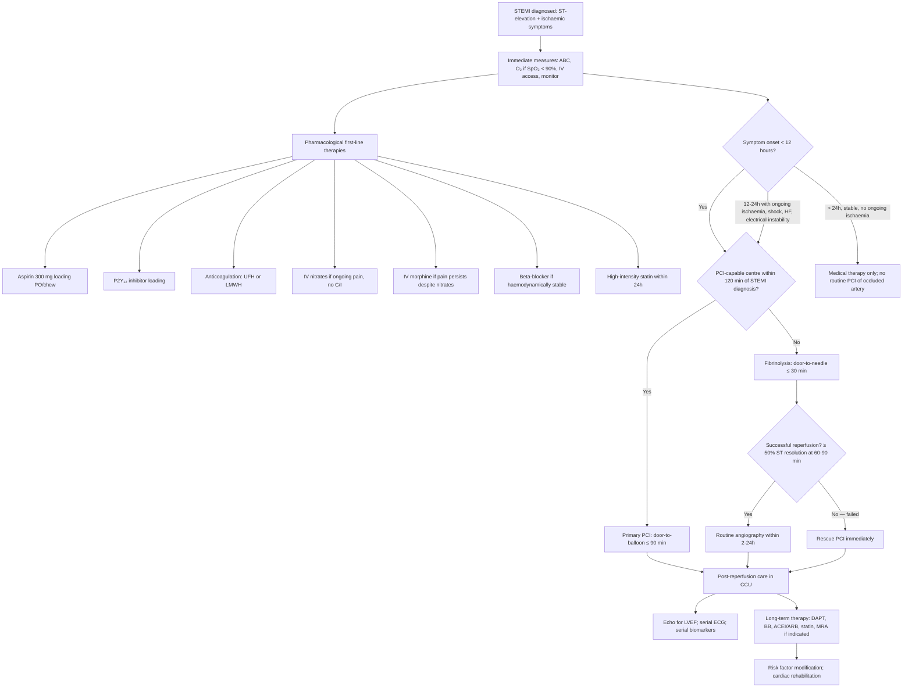

## Management of STEMI — Overview

The management of STEMI follows a time-critical, systematic framework. Think of it in three phases: **immediate/acute management** (first hours), **reperfusion therapy** (the defining intervention), and **long-term secondary prevention**. Every treatment targets a specific pathophysiological step — nothing is given "just because."

***The overall management framework*** [2]:

| Phase | Components |
|---|---|
| ***Acute ( < 24h)*** | ***Bed rest with close monitoring ± CCU; CBC, L/RFT, PT/aPTT, LP, CXR; serial ECG and cardiac enzymes; ± analgesics if required; nitrates, β-blockers always, ± DHP CCB if persistent discomfort; aspirin at/suspect dx, P2Y₁₂ blocker at dx or at PCI; heparin/LMWH at dx; reperfusion (thrombolysis if < 3h or PCI not available, PCI otherwise); β-blockers, ACEI/ARB always (≤ 24h); MRA if LVEF ≤ 40% + HF/DM; high-intensity statin always (≤ 24h)*** [2] |
| ***Long-term*** | ***Risk stratification: echo, stress test ± angiogram, ECG monitoring; risk factor modulation; mobilisation and rehabilitation; aspirin indefinitely; DAPT for ≥ 12 months if any stent used; β-blockers, ACEI/ARB always; MRA if LVEF ≤ 40% + HF/DM; high-intensity statin always*** [2] |

---

## Master Management Algorithm

***The lecture slide algorithm for revascularisation in STEMI*** [1]:
> ***Symptom onset < 12h → PCI feasible? → Yes → Primary PCI. If PCI not feasible → fibrinolysis. Symptom onset ≥ 12h → Consider PCI if cardiogenic shock or heart failure, ongoing ischaemia, heart failure, or electrical instability. Large area of myocardium at risk within 12–24h → PCI feasible? → Yes → PCI. Totally occluded infarct artery > 24h and asymptomatic → no routine PCI*** [1].

---

## Phase 1: Immediate / Acute Management

### A. General Measures

***Inform on-call cardiologist. Admit CCU for high-risk cases or STEMI (under consideration for reperfusion therapy)*** [2].

| Measure | Rationale (Why?) | Detail |
|---|---|---|
| **Bed rest with continuous ECG monitoring** | Ischaemic myocardium is electrically unstable → ventricular arrhythmias (VF/VT) can occur at any time; bed rest ↓O₂ demand | Telemetry for ≥ 24–48h minimum |
| ***Correct precipitating factors*** | Factors that ↑O₂ demand or ↓supply worsen ischaemia | ***e.g., anaemia, hypoxia, tachyarrhythmia*** [2] |
| **O₂ supplementation** | Only if hypoxic — routine O₂ in non-hypoxic STEMI patients does NOT improve outcomes and may be harmful (vasoconstriction, free radical generation) | ***Keep SpO₂ > 90% and pO₂ > 60 mmHg*** [2]. ESC 2023 recommends O₂ only if SpO₂ < 90% |
| **Nil by mouth or soft diet + stool softener** | ***Ileus common in patients with acute MI*** [2]; straining (Valsalva) → vagal stimulation → bradycardia; also ↑intrathoracic pressure → ↓venous return | Lactulose or docusate sodium |
| ***Explain nature of disease to patient → allay anxiety*** [2] | Anxiety → sympathetic activation → ↑HR, ↑BP → ↑myocardial O₂ demand | Clear, calm communication |

### B. Analgesia

***Analgesia: required if nitrates insufficient for symptom relief*** [2].

| Drug | Dose | Mechanism | Rationale | Cautions |
|---|---|---|---|---|
| ***IV morphine*** | ***IV morphine + IV Maxolon 5–10 mg ± sedation (e.g., diazepam 2–5 mg PO TDS)*** [2] | μ-opioid receptor agonist → analgesia + anxiolysis + venodilation | ***↓Distress, ↓adrenergic drive → ↓SVR, ↓BP, ↓risk of ventricular arrhythmias*** [2] | Respiratory depression; hypotension (venodilation); nausea/vomiting (give antiemetic); ↓GI motility (worsens ileus). Recent guidelines de-emphasise routine morphine — it may delay oral P2Y₁₂ inhibitor absorption |
| **IV Maxolon (metoclopramide)** | 5–10 mg IV | D₂ receptor antagonist → antiemetic + prokinetic | Prevents morphine-induced nausea/vomiting; also counteracts morphine's GI-slowing effect | Extrapyramidal side effects (rare, acute dystonia) |

<Callout title="Morphine — A Double-Edged Sword" type="idea">

Morphine reduces pain and sympathetic drive, which is beneficial. However, it also slows gastric emptying, which delays absorption of oral P2Y₁₂ inhibitors (ticagrelor, clopidogrel, prasugrel). This can result in delayed antiplatelet effect precisely when you need it most. Current ESC guidelines recommend using morphine **only when genuinely needed** for pain control, and considering IV cangrelor as a bridging antiplatelet in patients who have received morphine and may have delayed oral absorption.
</Callout>

---

## Phase 2: Pharmacological Therapies (Concurrent with Reperfusion Planning)

These are given simultaneously while preparing for reperfusion. They are divided by therapeutic target.

### C. Antiplatelet Therapy

The rationale is straightforward: the culprit lesion is an occlusive thrombus built on a platelet scaffold. You need to **prevent further platelet aggregation** and **prevent re-thrombosis** after mechanical reperfusion.

#### i. Aspirin (Acetylsalicylic acid)

"Aspirin" → "a-cetyl-salicylic" → derived from salicylic acid found in willow bark ("salix").

| Aspect | Detail |
|---|---|
| **Mechanism** | Irreversible COX-1 inhibitor → blocks thromboxane A₂ (TXA₂) synthesis in platelets. TXA₂ is a potent platelet aggregator and vasoconstrictor. Because platelets are anucleate (no new protein synthesis), the inhibition lasts the **entire platelet lifespan (~7–10 days)** |
| **Dose — Acute** | ***300 mg loading dose (chewed for faster buccal absorption)*** → then 75–100 mg daily maintenance |
| ***Dose — Long-term*** | ***Aspirin 75–100 mg daily, administered indefinitely*** [7][12] |
| ***Indication*** | ***Aspirin is recommended for all patients without contraindications*** [7] |
| **Contraindications** | Active GI bleeding; documented aspirin allergy/hypersensitivity (consider desensitisation); severe asthma with aspirin-exacerbated respiratory disease |
| **Side effects** | GI ulceration/bleeding (reduced with PPI cover); aspirin-exacerbated respiratory disease; Reye syndrome (children — irrelevant here) |

#### ii. P2Y₁₂ Receptor Inhibitors

"P2Y₁₂" → a purinergic receptor subtype on platelets. When ADP binds P2Y₁₂, it amplifies platelet activation. Blocking this receptor provides a **second, independent antiplatelet pathway** on top of aspirin.

***A P2Y₁₂ receptor inhibitor is recommended in addition to aspirin, and maintained over 12 months unless there are contraindications or an excessive risk of bleeding*** [7]:

| Drug | Class | Mechanism | Dose | Key Features |
|---|---|---|---|---|
| ***Ticagrelor*** | Direct-acting, reversible P2Y₁₂ antagonist | Binds P2Y₁₂ at a site distinct from ADP → allosteric inhibition; does NOT require hepatic activation | ***90 mg BD*** [7]; loading dose 180 mg | Faster onset (~30 min), more potent, more predictable than clopidogrel; **preferred in STEMI** (PLATO trial — ↓mortality vs clopidogrel); causes dyspnoea (↑adenosine levels due to inhibition of ENT-1 equilibrative nucleoside transporter) and ventricular pauses |
| ***Clopidogrel*** | Thienopyridine, irreversible P2Y₁₂ antagonist (prodrug) | Requires CYP2C19 activation → active metabolite irreversibly binds P2Y₁₂ | ***75 mg QD*** [7]; loading 300–600 mg | Slower onset; variable response (~15–30% are CYP2C19 poor metabolisers → ↓efficacy); ***interacts with PPI (inhibit CYP2C19/3A4 activation of clopidogrel prodrug → treatment failure)*** [2]; used ***when ticagrelor is not available or contraindicated*** [12] |
| **Prasugrel** | Thienopyridine, irreversible P2Y₁₂ antagonist (prodrug) | Requires single-step hepatic activation → more consistent than clopidogrel | 10 mg QD; loading 60 mg | More potent than clopidogrel; preferred over clopidogrel in PCI-treated STEMI (TRITON-TIMI 38 trial); **C/I: prior stroke/TIA** (↑ICH risk), age ≥ 75, weight < 60 kg (↓dose to 5 mg) |
| **Cangrelor** | IV, direct-acting, reversible P2Y₁₂ antagonist | Rapid onset (minutes), rapid offset (60 min half-life) | 30 μg/kg bolus then 4 μg/kg/min infusion | Bridge for patients unable to take oral P2Y₁₂ inhibitors (e.g., after morphine, NPO, intubated); transitions to oral agent after infusion stops |

***The lecture slide on antiplatelet therapies for ACS*** [12]:
> ***STEMI: Ticagrelor is first-line; clopidogrel if ticagrelor not available or contraindicated. If PCI performed: prasugrel or ticagrelor. If CABG needed: withdraw ticagrelor for 5 days and prasugrel for 7 days*** [12].

#### iii. GP IIb/IIIa Inhibitors

"GP IIb/IIIa" → glycoprotein IIb/IIIa is the final common pathway receptor for platelet aggregation (binds fibrinogen to cross-link platelets).

| Drug | Mechanism | Indication |
|---|---|---|
| **Abciximab** | Monoclonal antibody fragment → irreversible GP IIb/IIIa blockade | ***Selected patients only*** [2] — given in cath lab during PCI if high thrombus burden; less commonly used now with potent oral P2Y₁₂ inhibitors |
| **Eptifibatide / Tirofiban** | Small-molecule, reversible GP IIb/IIIa inhibitors | Similar indications; shorter acting |

> The role of GP IIb/IIIa inhibitors has **diminished** with the availability of potent P2Y₁₂ inhibitors (ticagrelor, prasugrel) and is now largely reserved for **bail-out** situations during PCI (e.g., large thrombus burden, no-reflow, slow flow).

#### iv. Dual Antiplatelet Therapy (DAPT) — Summary

***DAPT = aspirin + P2Y₁₂ inhibitor*** [2]:
- ***Aspirin: administered indefinitely*** [2]
- ***P2Y₁₂ blocker: administered for ≥ 12 months if any stent used (mandatory), 1–12 months even if no PCI done*** [2]
- ***Choice: clopidogrel 75 mg QD, prasugrel 10 mg QD or ticagrelor 90 mg BD*** [2]

**Why 12 months?** Drug-eluting stents (DES) take ~6–12 months for the polymer coating to allow complete endothelialisation of the strut surface. Until the stent is fully covered by endothelium, exposed metal is thrombogenic → premature DAPT cessation → stent thrombosis (catastrophic — mortality ~20–40%). After 12 months, consider de-escalation based on bleeding risk.

<Callout title="DAPT Duration — Not One-Size-Fits-All">

The 12-month standard can be modified:
- **Shortened DAPT** (3–6 months) → if high bleeding risk (PRECISE-DAPT score ≥ 25)
- **Extended DAPT** (> 12 months) → if high ischaemic risk and low bleeding risk (e.g., prior stent thrombosis, complex PCI, DM + multivessel disease)
- Always balance **ischaemic risk** (stent thrombosis, recurrent MI) vs **bleeding risk** (major GI bleed, ICH)
</Callout>

### D. Anticoagulation Therapy

The rationale: even with antiplatelet therapy, the **coagulation cascade** (thrombin generation, fibrin formation) continues. You need both antiplatelet AND anticoagulant to fully suppress thrombus propagation.

***Heparin/LMWH at diagnosis*** [2].

| Drug | Mechanism | Dose | Advantages/Disadvantages |
|---|---|---|---|
| **Unfractionated heparin (UFH)** | Binds antithrombin III → accelerates its inhibition of thrombin (IIa) and factor Xa by ~1000-fold | 60 U/kg IV bolus (max 4000 U) → 12 U/kg/h infusion; target aPTT 50–70 s | Preferred during primary PCI (short half-life, reversible with protamine, dose can be titrated with ACT in cath lab); requires aPTT monitoring |
| **Enoxaparin (LMWH)** | Preferentially inhibits factor Xa > thrombin (via antithrombin III); more predictable pharmacokinetics | 0.5 mg/kg IV bolus (if PCI) or 1 mg/kg SC BD | More predictable dose-response; does not require routine monitoring; less HIT risk; preferred if fibrinolysis is chosen |
| **Fondaparinux** | Selective factor Xa inhibitor via antithrombin III | 2.5 mg SC OD | Lowest bleeding risk; good for conservative management; but NOT used during PCI (associated with catheter thrombosis — must give supplemental UFH) |
| **Bivalirudin** | Direct thrombin inhibitor (no antithrombin III needed) | 0.75 mg/kg bolus → 1.75 mg/kg/h infusion | Alternative to UFH during PCI; lower bleeding risk; useful in HIT (does not interact with PF4 antibodies) |

### E. Anti-Ischaemic Therapy

These drugs reduce myocardial oxygen demand and/or improve supply, limiting infarct extension.

#### i. Nitrates

"Nitrate" → donates NO (nitric oxide) → activates guanylyl cyclase → ↑cGMP → smooth muscle relaxation.

| Aspect | Detail |
|---|---|
| **Mechanism** | Venodilation (↓preload → ↓wall stress → ↓O₂ demand) > arteriodilation (↓afterload); also **coronary vasodilation** (↑supply); dilates collateral vessels |
| **Acute use** | Sublingual GTN 0.4 mg q5min × 3 doses initially; then **IV GTN infusion** (10–200 μg/min, titrate to pain/BP) if pain persists |
| ***Long-term*** | ***Nitrates (long-acting or short-acting as PRN) in the presence of angina*** [7] |
| **Contraindications** | ***RV infarction*** (preload-dependent → nitrates ↓preload → catastrophic hypotension) [2]; SBP < 90 mmHg; severe aortic stenosis; concurrent PDE-5 inhibitor use (sildenafil, tadalafil — potentiates hypotension via ↑cGMP) |
| **Side effects** | Headache (meningeal vasodilation); hypotension; reflex tachycardia; tolerance with continuous use (need nitrate-free interval) |

#### ii. Beta-Blockers

"Beta" → β-adrenergic receptors; "blocker" → antagonist.

| Aspect | Detail |
|---|---|
| **Mechanism** | Block β₁ receptors in heart → ↓HR (negative chronotropy), ↓contractility (negative inotropy), ↓conduction velocity (negative dromotropy) → ↓myocardial O₂ demand; also ↓renin secretion. Anti-arrhythmic: ↑VF threshold → ↓sudden death |
| ***Indication*** | ***Beta-blockers unless contraindicated*** [7]; ***given to all stable patients if no C/I*** [2] |
| ***Examples*** | ***Usually Betaloc (metoprolol) 25–100 mg BD*** [2]; also bisoprolol, carvedilol (has additional α₁-blocking vasodilatory properties — useful in HF) |
| ***Contraindications*** | ***Bradycardia, AV block, ↓BP, asthma*** [2] |
| ***NOT contraindicated in*** | ***Heart failure (actually beneficial!), COPD (use cardioselective β₁ agents like bisoprolol), peripheral vascular disease*** [2] |
| **Timing** | Oral within 24h if haemodynamically stable; avoid IV in acute phase unless specific tachyarrhythmia |

**Why beta-blockers improve survival in STEMI**: By ↓HR, they (1) reduce O₂ demand, (2) prolong diastole → ↑coronary perfusion time, (3) ↑VF threshold → ↓sudden arrhythmic death, and (4) limit infarct extension. Long-term, they attenuate adverse LV remodelling.

#### iii. Calcium Channel Blockers (CCBs)

***Calcium antagonists (diltiazem or verapamil) if contraindications to beta-blockers and no heart failure*** [7].

| Aspect | Detail |
|---|---|
| **Mechanism** | Non-dihydropyridine CCBs (diltiazem, verapamil) block L-type Ca²⁺ channels in cardiac myocytes → ↓HR, ↓contractility, ↓AV conduction (similar to β-blockers); also coronary vasodilation |
| **Indication** | **Only** when beta-blockers are contraindicated AND patient has ongoing angina; **C/I in heart failure** (negative inotropy worsens LV dysfunction) |
| **Dihydropyridine CCBs** (amlodipine, nifedipine) | Predominantly vasodilatory (less cardiac effect); can be added to β-blocker for refractory angina, but short-acting nifedipine alone is C/I (reflex tachycardia → ↑O₂ demand) |

### F. Statin Therapy

| Aspect | Detail |
|---|---|
| **Mechanism** | HMG-CoA reductase inhibitor → ↓hepatic cholesterol synthesis → ↑LDL receptor expression → ↓circulating LDL. Pleiotropic effects: plaque stabilisation (↑fibrous cap thickness, ↓inflammation), endothelial function improvement, ↓thrombogenicity |
| ***Indication*** | ***High-intensity statin always (≤ 24h)*** [2]; regardless of baseline LDL level |
| **Drug and dose** | Atorvastatin 80 mg or rosuvastatin 20–40 mg |
| **Target** | LDL < 1.4 mmol/L AND ≥ 50% reduction from baseline (ESC 2019/2024 for very high-risk patients) |
| **Side effects** | Myalgia/myopathy (rare), ↑transaminases (monitor LFT), rhabdomyolysis (very rare, especially with drug interactions) |

### G. ACEI/ARB

"ACEI" → angiotensin-converting enzyme inhibitor; "ARB" → angiotensin II receptor blocker.

| Aspect | Detail |
|---|---|
| **Mechanism** | ACEI: blocks ACE → ↓angiotensin II → ↓aldosterone → ↓preload/afterload, ↓sodium/water retention, ↓LV remodelling; also ↑bradykinin → vasodilation. ARB: blocks AT₁ receptor → similar effects without ↑bradykinin (fewer side effects like cough) |
| ***Indication*** | ***ACEI for patients with CHF, LV dysfunction (EF < 40%), hypertension, or diabetes*** [7]; ***ACEI/ARB always (≤ 24h)*** [2] — in practice, started within 24h for ALL STEMI patients (especially anterior MI, LVEF < 40%, HF, DM) |
| **Examples** | Ramipril, perindopril, enalapril; ARB: valsartan, candesartan (if ACEI-intolerant due to cough) |
| **Contraindications** | Bilateral renal artery stenosis; ↑K⁺ > 5.5; pregnancy; angioedema history (for ACEI); SBP < 90 |
| **Side effects** | Dry cough (ACEI — from ↑bradykinin), hyperkalaemia, AKI (especially if hypovolaemic), angioedema (rare) |

**Why ACEI/ARB post-MI?** After STEMI, the necrotic zone is replaced by scar tissue. The remaining viable myocardium undergoes **adverse remodelling**: compensatory hypertrophy + chamber dilatation (mediated by the RAAS and sympathetic nervous system). ACEI/ARB blocks the RAAS axis → ↓wall stress, ↓fibrosis, ↓apoptosis → slows remodelling → ↓progression to HF → ↓mortality.

### H. Mineralocorticoid Receptor Antagonist (MRA)

| Aspect | Detail |
|---|---|
| **Mechanism** | Blocks aldosterone receptor → ↓sodium/water retention, ↓cardiac fibrosis, ↓LV remodelling |
| ***Indication*** | ***MRA if LVEF ≤ 40% + HF/DM*** [2] — specifically, post-MI patients who develop HF symptoms or have LVEF ≤ 40% (EPHESUS trial: eplerenone ↓mortality by 15%) |
| **Examples** | Eplerenone (selective — fewer side effects) or spironolactone |
| **Contraindications** | K⁺ > 5.0; significant renal impairment (eGFR < 30) |
| **Side effects** | Hyperkalaemia (monitor K⁺ closely, especially with ACEI); gynaecomastia (spironolactone — it also blocks androgen receptors) |

---

## Phase 3: Reperfusion Therapy

This is the **most critical intervention** in STEMI — the entire management pathway is designed to get the patient to reperfusion as quickly as possible.

### A. Primary Percutaneous Coronary Intervention (Primary PCI)

"PCI" → "percutaneous" = through the skin; "coronary" = coronary artery; "intervention" = therapeutic procedure.

| Aspect | Detail |
|---|---|
| **What it is** | Catheter-based approach: guide wire crosses the occlusion → balloon angioplasty opens the lumen → drug-eluting stent (DES) deployed to scaffold the artery open |
| **Preferred strategy** | ***Primary PCI is the preferred reperfusion strategy when it can be performed within 120 minutes of STEMI diagnosis*** [1] |
| **Time target** | ***Door-to-balloon ≤ 90 minutes*** (≤ 60 min if presenting directly to PCI centre); ***first medical contact to wire-crossing ≤ 120 min*** |
| **Access** | Radial artery preferred (↓bleeding, ↓vascular complications, earlier ambulation) over femoral |
| **Goal** | Restore TIMI 3 flow (complete, normal-speed perfusion) in the culprit artery |
| **Stent type** | Drug-eluting stent (DES) preferred over bare-metal stent (BMS) — ↓restenosis rate (drug coating — usually everolimus or zotarolimus — inhibits neointimal proliferation) |
| **Advantages over fibrinolysis** | Higher patency rates (~95% vs ~60–80%); lower mortality; lower re-infarction rate; lower stroke rate; lower bleeding rate; can treat residual stenosis; provides anatomical information |

#### Indications for Primary PCI

| Indication | Detail |
|---|---|
| ***Symptom onset < 12h*** and PCI feasible within 120 min | Standard indication [1] |
| ***Symptom onset 12–24h*** | ***If ongoing ischaemia, heart failure, cardiogenic shock, or electrical instability*** [1] |
| ***Cardiogenic shock or heart failure*** | Regardless of timing — PCI is life-saving in cardiogenic shock (SHOCK trial) [1] |
| **Failed fibrinolysis** | ***Rescue PCI*** immediately |
| ***Large area of myocardium at risk*** | Even if symptom onset 12–24h [1] |

#### Contraindications to PCI (Relative)

There are virtually **no absolute contraindications** to primary PCI (it is a life-saving procedure). Relative considerations include:
- Severe contrast allergy (pre-treat with steroids/antihistamines)
- Severe CKD (contrast nephropathy risk — weigh against benefit of reperfusion)
- No suitable vascular access
- Patient/family refusal

### B. Fibrinolytic (Thrombolytic) Therapy

"Fibrinolytic" → "fibrin" = the protein mesh of a clot + "lytic" = breaking down. These drugs dissolve the fibrin clot by activating plasminogen → plasmin.

***Fibrinolytic therapy indication*** [1]:

> ***AMI – Pain + ST-elevation in 2 contiguous chest leads; time of onset of pain < 12 hours; absence of contraindications – bleeding tendency*** [1]

| Drug | Mechanism | Dose | Key Features |
|---|---|---|---|
| **Alteplase (rt-PA)** | Recombinant tissue plasminogen activator; fibrin-specific (preferentially activates plasminogen bound to fibrin in the clot) | 15 mg IV bolus → 0.75 mg/kg over 30 min (max 50 mg) → 0.5 mg/kg over 60 min (max 35 mg) | Gold standard; fibrin-specific → less systemic lytic state |
| **Tenecteplase (TNK-tPA)** | Modified rt-PA with longer half-life | Single IV bolus (weight-adjusted: 30–50 mg) | Most practical: single bolus dosing; preferred in pre-hospital setting |
| **Reteplase** | Deletion mutant of rt-PA | 10 U IV bolus × 2, 30 min apart | Double-bolus regimen |
| **Streptokinase** | Bacterial protein (from Streptococcus); forms complex with plasminogen → activates other plasminogen molecules; NOT fibrin-specific | 1.5 million units IV over 60 min | Cheapest; antigenic (can cause allergic reaction; ***prior treatment within previous 6 months is an absolute C/I*** [2]); less effective than fibrin-specific agents |

#### Contraindications to Fibrinolysis

These are critical to memorise — getting them wrong can cause fatal haemorrhage.

***Absolute and relative contraindications*** [2]:

| ***Absolute Contraindications*** | ***Relative Contraindications*** |
|---|---|
| ***Previous haemorrhagic stroke at any time*** | ***Severe uncontrolled HTN on presentation (BP > 180/110 mmHg)*** |
| ***Other strokes or CVA within 3 months; except acute ischaemic stroke within 4.5 hours*** | ***History of chronic, severe, poorly controlled HTN*** |
| ***Known malignant intracranial neoplasm (primary or metastatic)*** | ***History of prior ischaemic stroke > 3 months or known intracerebral pathology not covered in absolute contraindications*** |
| ***Known structural cerebrovascular lesion (e.g., AVM)*** | ***Traumatic or prolonged ( > 10 min) CPR*** |
| ***Active bleeding or bleeding diathesis (does not include menses)*** | ***Oral anticoagulant therapy*** |
| ***Suspected aortic dissection*** | ***Major surgery < 3 weeks*** |
| ***Significant closed head or facial trauma within 3 months*** | ***Non-compressible vascular punctures*** |
| ***Intracranial or intraspinal surgery within 2 months*** | ***Recent (within 2–4 weeks) internal bleeding*** |
| ***Severe uncontrolled HTN (unresponsive to emergency therapy)*** | ***Pregnancy*** |
| ***For streptokinase, prior treatment within previous 6 months*** | ***Active peptic ulcer*** |

<Callout title="Mnemonic for Absolute C/I to Fibrinolysis — 'STAB HEAD'" type="idea">

- **S**troke — haemorrhagic (ever) or ischaemic ( < 3 months)
- **T**umour — intracranial neoplasm
- **A**ortic dissection (suspected)
- **B**leeding diathesis or active bleeding
- **H**ead/facial trauma ( < 3 months)
- **E**levated BP — severe, unresponsive to therapy
- **A**VM or structural cerebrovascular lesion
- **D**ural breach — intracranial/intraspinal surgery ( < 2 months)
</Callout>

#### Monitoring Fibrinolysis and Assessing Success

***Documentation of successful fibrinolysis*** [1][2]:

| Criterion | Detail | Why |
|---|---|---|
| ***Clinical: ↓chest pain*** [1] | Restoration of coronary flow → relief of ischaemia | |
| ***ECG: early resolution of ST-elevation ≥ 50% in worst lead at 60–90 min*** [1][2] | Reperfusion → resolution of the injury current | This is the most practical and important marker |
| ***ECG: accelerated nodal or idioventricular rhythm*** [2] | "Reperfusion arrhythmias" — transient, usually benign; indicate restoration of flow through previously ischaemic tissue | The washout of ischaemic metabolites and sudden electrolyte shifts cause transient automaticity |
| ***ECG: preservation of R wave*** [1] | Myocardial salvage — if the R wave is preserved, transmural necrosis has not been completed | |
| ***Biochemical: early peaking of CPK (11–12h vs normal 22–24h)*** [1][2] | "Washout phenomenon" — restored blood flow carries released enzymes from the reperfused zone → earlier and higher biomarker peak | |
| ***Imaging: radionuclide imaging, angiography*** [1] | Confirms vessel patency and myocardial perfusion | |

**If fibrinolysis fails** (no ≥ 50% ST resolution at 60–90 min, ongoing pain) → ***rescue PCI immediately***.

**After successful fibrinolysis** → ***routine angiography within 2–24 hours*** [1]. Why? Even with clot dissolution, the underlying atherosclerotic plaque remains → residual stenosis → risk of re-occlusion. Angiography ± PCI within 2–24h addresses this residual stenosis (pharmacoinvasive strategy).

### C. Coronary Artery Bypass Grafting (CABG)

***CABG if unsuccessful PCI or mechanical complications*** [2].

| Indication | Detail |
|---|---|
| **Failed PCI** | Cannot cross lesion or restore flow; ongoing ischaemia |
| **Left main stem disease** | LMS disease with complex anatomy not suitable for PCI |
| **Multivessel disease** | Especially with DM + reduced LVEF (SYNTAX trial, FREEDOM trial: CABG > PCI in diabetics with multivessel disease) |
| **Mechanical complications** | VSD, papillary muscle rupture, free wall rupture → require surgical repair ± concomitant CABG |
| **Timing** | Usually delayed (ideally > 3–5 days) to allow myocardial recovery; emergent if mechanical complication or cardiogenic shock not amenable to PCI |

### D. Primary PCI vs Fibrinolysis — Comparison

| Feature | Primary PCI | Fibrinolysis |
|---|---|---|
| **Patency rate** | ~95% TIMI 3 flow | ~60–80% TIMI 3 flow |
| **30-day mortality** | ~3–5% | ~6–8% |
| **Reinfarction** | Lower (~1–3%) | Higher (~5–7%) |
| **Stroke** | Lower (~0.5%) | Higher (~1–2%, mainly ICH) |
| **Bleeding** | Lower major bleeding | Higher (systemic lytic state) |
| **Time-dependency** | Less time-dependent (still effective 12–24h in select cases) | Very time-dependent (greatest benefit < 3h; diminishing benefit after 6h) |
| **Anatomical information** | Yes (diagnostic + therapeutic) | No |
| **Availability** | Requires cath lab + interventional cardiologist 24/7 | Available anywhere with trained staff |

---

## Phase 4: Long-Term Management and Secondary Prevention

### A. Risk Stratification

***For all patients with STEMI*** [2]:
- ***LVEF by echo → guide further management to ↓LV remodelling + ↓arrhythmia risk*** [2]
- ***Residual ischaemia → assess risk of future ischaemic event: stress test pre-discharge or symptom-limited stress 2–3 weeks post-MI; angiogram if positive stress test, post-infarct angina, or other high-risk clinical features*** [2]
- ***Arrhythmia during convalescent phase by 24h ECG for VT/frequent ventricular arrhythmia → indicates poor ventricular function and may herald sudden death → may benefit from EPS and cardiac defibrillators*** [2]

### B. Long-Term Drug Therapy

| Drug | Duration | Rationale |
|---|---|---|
| ***Aspirin 75–100 mg daily*** | ***Indefinitely*** [2] | Continuous antiplatelet protection |
| ***P2Y₁₂ inhibitor*** | ***≥ 12 months*** if stented [2]; consider extending if high ischaemic risk | Prevent stent thrombosis and recurrent ACS |
| ***Beta-blocker*** | Indefinitely (at least 1 year; reassess thereafter) | ↓Mortality, ↓arrhythmia, ↓remodelling |
| ***ACEI/ARB*** | Indefinitely (especially if LVEF < 40%, HF, DM, HTN) | ↓Remodelling, ↓mortality |
| ***MRA*** | ***If LVEF ≤ 40% + HF/DM*** [2] | ↓Fibrosis, ↓mortality (EPHESUS trial) |
| ***High-intensity statin*** | Indefinitely | ↓LDL, plaque stabilisation, ↓recurrent events |
| **Anticoagulation (warfarin/NOAC)** | If concurrent indication (e.g., AF, LV thrombus, mechanical valve) | Prevent systemic embolism |

### C. Risk Factor Modification

***Secondary prevention*** [2][7]:

| Target | Measure |
|---|---|
| ***Smoking*** | ***Drastic ↓MI risk after just 1 year of smoking cessation, doubles 5-year mortality*** [2] if continued |
| ***Hyperlipidaemia*** | ***High-dose statins for aggressive ↓lipid (regardless of serum cholesterol level) → ↓mortality*** [2]; target LDL < 1.4 mmol/L |
| ***Lifestyle*** | ***Regular exercise, maintain ideal body weight, Mediterranean diet*** [2] |
| ***Other comorbidities*** | ***Good control of HTN and DM*** [2]; aim HbA1c < 7%; BP < 130/80 |

### D. Mobilisation and Cardiac Rehabilitation

***Takes 4–6 weeks to replace necrotic tissue by fibrotic tissue → restrict physical activities until then, offer cardiovascular rehabilitation*** [2].
- ***Usually: mobilise in 2 days, discharge in 3–5 days, resume work in 4–6 weeks*** [2]
- Cardiac rehabilitation programme: supervised exercise training + education + psychological support → proven to ↓mortality, ↑functional capacity, ↑quality of life

---

## Special Management Scenarios

### RV Infarction

| Do | Don't (and Why) |
|---|---|
| IV fluid bolus (250–500 mL NS, repeat as needed) — RV is preload-dependent | ***C/I to nitrates and other ↓preload agents → severe hypotension*** [2] |
| Maintain AV synchrony (atrial kick critical for filling stiff RV) — pace if AV block | Avoid diuretics (↓preload) |
| Inotropic support (dobutamine) if fluids insufficient | |
| Emergent PCI to restore RCA flow | |

### Cardiogenic Shock (Killip IV)

***Management*** [5]:
- **Primary PCI** is the single most important intervention (SHOCK trial)
- ***Inotropes (e.g., IV dobutamine) if adequate filling pressure; fluid resuscitation ± vasopressors if low filling pressure*** [5]
- **Mechanical circulatory support**: Intra-aortic balloon pump (IABP), Impella device, or extracorporeal membrane oxygenation (ECMO) as bridge to recovery/transplant/decision
- ***ACLS should be activated in cases of arrhythmogenic causes*** [5]

---

<Callout title="High Yield Summary — Management of STEMI">

**Immediate measures**: O₂ only if SpO₂ < 90%; IV access; monitor; analgesia (morphine if nitrates fail — but cautious due to delayed oral P2Y₁₂ absorption).

**Antiplatelet**: Aspirin 300 mg load → 75–100 mg daily (indefinitely). P2Y₁₂ inhibitor: ticagrelor 180 mg load → 90 mg BD (preferred); clopidogrel 600 mg load → 75 mg QD if ticagrelor C/I. DAPT for ≥ 12 months.

**Anticoagulation**: UFH during PCI; enoxaparin if fibrinolysis chosen.

**Anti-ischaemic**: Nitrates (C/I in RV MI, PDE5i use, hypotension); beta-blockers (to all if no C/I); diltiazem/verapamil only if BB C/I and no HF.

**Prognostic drugs started ≤ 24h**: High-intensity statin (atorvastatin 80 mg); ACEI/ARB; MRA if LVEF ≤ 40% + HF/DM.

**Reperfusion — the core of STEMI treatment**:
- **Primary PCI** if achievable within 120 min of diagnosis (door-to-balloon ≤ 90 min) — preferred strategy.
- **Fibrinolysis** if PCI not available within 120 min (door-to-needle ≤ 30 min). Assess success at 60–90 min (≥ 50% ST resolution). If failed → rescue PCI. If successful → angiography within 2–24h.
- **CABG** for failed PCI, LMS disease, multivessel disease (especially DM), or mechanical complications.

**Long-term**: DAPT ≥ 12 months; BB, ACEI/ARB, statin indefinitely; MRA if LVEF ≤ 40%; aggressive risk factor modification; cardiac rehabilitation.

**Special scenarios**: RV MI → fluids, avoid nitrates/diuretics; cardiogenic shock → emergent PCI + inotropes ± mechanical support.
</Callout>

---

<ActiveRecallQuiz
  title="Active Recall - Management of STEMI"
  items={[
    {
      question: "A 62-year-old man with STEMI presents 2 hours after symptom onset. The nearest PCI centre is 3 hours away by ambulance. What reperfusion strategy do you choose, and what are the key time targets?",
      markscheme: "Choose fibrinolysis because PCI cannot be achieved within 120 minutes of STEMI diagnosis. Door-to-needle target is 30 minutes or less. Assess reperfusion success at 60-90 minutes (at least 50% ST-resolution in worst lead). If successful, transfer for routine angiography within 2-24 hours. If failed (no ST-resolution, ongoing pain), arrange immediate rescue PCI.",
    },
    {
      question: "List three absolute and three relative contraindications to fibrinolytic therapy in STEMI.",
      markscheme: "Absolute (any 3 of): previous haemorrhagic stroke at any time; other strokes/CVA within 3 months; known malignant intracranial neoplasm; known structural cerebrovascular lesion such as AVM; active bleeding or bleeding diathesis; suspected aortic dissection; significant closed head/facial trauma within 3 months; intracranial/intraspinal surgery within 2 months; severe uncontrolled HTN unresponsive to therapy. Relative (any 3 of): BP > 180/110 on presentation; chronic severe HTN; prior ischaemic stroke > 3 months; traumatic/prolonged CPR > 10 min; oral anticoagulant therapy; major surgery < 3 weeks; non-compressible vascular punctures; recent internal bleeding within 2-4 weeks; pregnancy; active peptic ulcer.",
    },
    {
      question: "Explain why DAPT must be continued for at least 12 months after drug-eluting stent implantation. What catastrophic event can occur if DAPT is prematurely stopped?",
      markscheme: "Drug-eluting stents take 6-12 months for the polymer coating to allow complete endothelialisation of the stent struts. Until fully covered by endothelium, exposed metal is thrombogenic. Premature DAPT cessation leads to stent thrombosis, which is a catastrophic event with mortality of 20-40%. It presents as acute re-occlusion with reinfarction. After 12 months, de-escalation can be considered based on individual bleeding versus ischaemic risk.",
    },
    {
      question: "For each of the following STEMI drugs, state the primary mechanism and one specific contraindication: (a) nitrates, (b) beta-blocker, (c) ACEI, (d) eplerenone.",
      markscheme: "(a) Nitrates: donate NO causing venodilation and reducing preload/afterload and coronary vasodilation. C/I: RV infarction (preload-dependent), SBP < 90, concurrent PDE5 inhibitor use. (b) Beta-blocker: block cardiac beta-1 receptors reducing HR, contractility, and O2 demand. C/I: bradycardia, AV block, hypotension, asthma. (c) ACEI: inhibits ACE reducing angiotensin II and aldosterone, reducing preload/afterload and LV remodelling. C/I: bilateral renal artery stenosis, hyperkalaemia > 5.5, pregnancy. (d) Eplerenone: selective mineralocorticoid receptor antagonist reducing cardiac fibrosis and remodelling. C/I: K+ > 5.0, eGFR < 30.",
    },
    {
      question: "A patient with inferior STEMI develops hypotension. Right-sided ECG shows ST-elevation in V4R. What is the diagnosis and how does the management differ from standard STEMI?",
      markscheme: "Diagnosis: RV infarction complicating inferior STEMI (proximal RCA occlusion). Management differences: (1) Give IV fluid boluses (250-500 mL NS, repeat) as the RV is preload-dependent. (2) Avoid nitrates — they reduce preload causing catastrophic hypotension. (3) Avoid diuretics for the same reason. (4) Maintain AV synchrony (temporary pacing if AV block). (5) Dobutamine if hypotension persists despite fluids. (6) Emergent primary PCI to restore RCA flow.",
    },
    {
      question: "State the four criteria used to assess successful fibrinolysis and the pathophysiological basis for early CPK peaking after successful thrombolysis.",
      markscheme: "Four criteria: (1) Clinical — decrease in chest pain. (2) ECG — resolution of ST-elevation by at least 50% in worst lead at 60-90 minutes; accelerated nodal or idioventricular rhythm (reperfusion arrhythmias); preservation of R wave. (3) Biochemical — early peaking of CPK at 11-12h instead of normal 22-24h. (4) Imaging — radionuclide imaging or angiography confirming vessel patency. Early CPK peaking ('washout phenomenon'): successful reperfusion restores blood flow through the necrotic zone, washing out intracellular enzymes that had accumulated in the ischaemic tissue and carrying them into the systemic circulation earlier and at higher concentrations.",
    },
  ]}
/>

## References

[1] Lecture slides: GC 088. Sudden Severe Chest Pain.pdf (pp. 39, 48)
[2] Senior notes: Ryan Ho Cardiology.pdf (pp. 120, 131, 132, 136, 138, 139, 144)
[5] Senior notes: Ryan Ho Critical Care.pdf (pp. 22, 36, 39)
[6] Senior notes: Ryan Ho Fundamentals.pdf (pp. 203, 217)
[7] Lecture slides: GC 028. Accelerating chest pain_Acute coronary (1).pdf (pp. 40, 54, 55)
[12] Lecture slides: GC 028. Accelerating chest pain_Acute coronary (1).pdf (p. 40)
