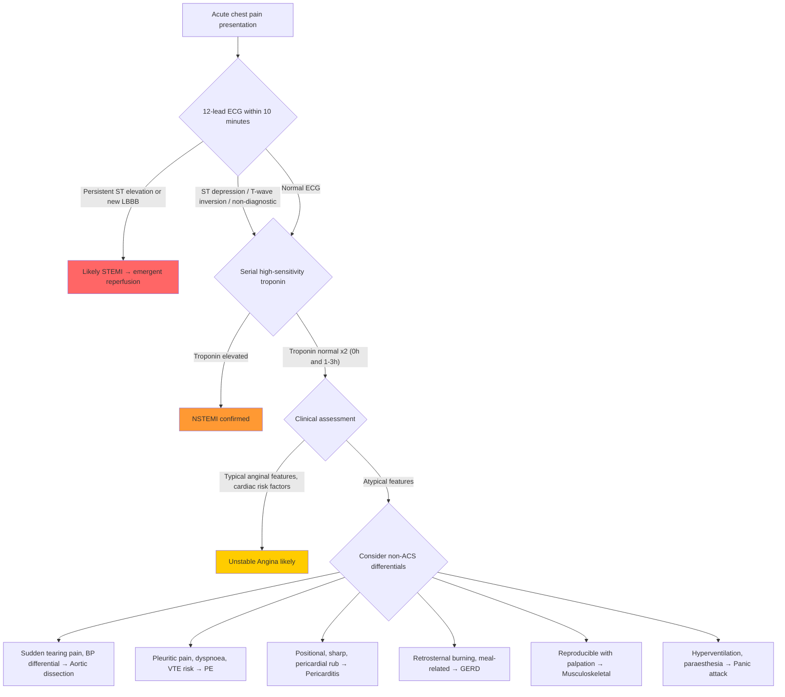

## Differential Diagnosis of Unstable Angina

### Why Differential Diagnosis Matters in UA

When a patient presents with acute chest pain suspicious for UA, you are really asking: **"Is this ACS, and if not, what life-threatening mimic must I not miss?"** The clinical features of UA (rest pain, crescendo pattern, retrosternal discomfort) overlap substantially with many cardiac and non-cardiac conditions. A structured approach is essential because the consequences of missing a true ACS — or misdiagnosing aortic dissection as ACS and giving anticoagulation — can be fatal.

***Diagnosis based on history alone may be difficult → generally divided into: typical (chest pain typical of a cardiac origin), atypical (cannot be attributed to a certain cause), and non-cardiac (typical of a non-cardiac cause)*** [2][3].

---

### The "Big Five" Life-Threatening Differentials of Acute Chest Pain

Before discussing the full differential, every clinician must first exclude these **five emergencies** that can present similarly to UA but require completely different management:

***Main differentials of acute chest pain*** [2][3]:

| ***Potentially severe or life-threatening*** | ***Relatively benign causes*** |
|---|---|
| ***Acute coronary syndrome (ACS)*** | ***Episode of stable angina*** |
| ***Acute decompensated heart failure*** | ***GERD*** |
| ***Aortic dissection*** | ***Small pneumothorax*** |
| ***Acute pulmonary embolism*** | ***Musculoskeletal pain*** |
| ***Tension or massive pneumothorax*** | ***Panic attack*** |
| ***Pneumonia*** | |
| ***Myopericarditis ± cardiac tamponade*** | |

---

### Systematic Differential Diagnosis

The lecture slides provide an excellent framework organised by organ system [1]:

***Differential diagnoses of acute coronary syndromes in the setting of acute chest pain*** [1]:

| ***Cardiac*** | ***Pulmonary*** | ***Vascular*** | ***Gastrointestinal*** | ***Orthopaedic*** | ***Other*** |
|---|---|---|---|---|---|
| ***Myopericarditis*** | ***Pulmonary embolism*** | ***Aortic dissection*** | ***Oesophagitis, reflux, or spasm*** | ***Musculoskeletal disorders*** | ***Anxiety disorders*** |
| ***Cardiomyopathies*** | ***(Tension)-pneumothorax*** | ***Symptomatic aortic aneurysm*** | ***Peptic ulcer, gastritis*** | ***Chest trauma*** | ***Herpes zoster*** |
| ***Tachyarrhythmias*** | ***Bronchitis, pneumonia*** | ***Stroke*** | ***Pancreatitis*** | ***Muscle injury/inflammation*** | ***Anaemia*** |
| ***Acute heart failure*** | ***Pleuritis*** | | ***Cholecystitis*** | ***Costochondritis*** | |
| ***Hypertensive emergencies*** | | | | ***Cervical spine pathologies*** | |
| ***Aortic valve stenosis*** | | | | | |
| ***Takotsubo syndrome*** | | | | | |

The lecture slides also show the **frequency** of diagnoses in patients presenting with acute chest pain [1]:

> - ***Gastrointestinal 42%***
> - ***Ischaemic heart disease 31%***
> - ***Chest wall syndrome 28%***
> - ***Pericarditis 4%***
> - ***Pleuritis 2%***
> - ***Pulmonary embolism 2%***
> - ***Lung cancer 1.5%***
> - ***Aortic aneurysm 1%***
> - ***Aortic stenosis 1%***
> - ***Herpes zoster 1%***

This is clinically important — GI causes are actually the **most common** cause of chest pain overall, though IHD is the most common *serious* cause. In exams, always think broadly.

---

### Detailed Differential Diagnosis with Distinguishing Features

Let me walk through each differential systematically, explaining **why** each can mimic UA and **how** to distinguish them. This is essentially how you think on a ward round.

#### A. Cardiac Differentials

##### 1. NSTEMI
- **Why it mimics UA:** Identical clinical presentation. ***NSTEMI is characterised by clinical features of unstable angina in addition to elevated cardiac markers. Cardiac markers are elevated as a result of myocardial necrosis*** [1][5].
- **How to distinguish:** You **cannot** distinguish UA from NSTEMI at the bedside — the only differentiator is **troponin**. This is why serial troponins are mandatory.
- **Key point:** UA and NSTEMI are managed identically at presentation (both are NSTE-ACS). The distinction matters for risk stratification and prognosis (NSTEMI has higher short-term event rates).

##### 2. STEMI
- **Why it mimics UA:** Same pathophysiology (plaque rupture + thrombosis), but with complete coronary occlusion.
- **How to distinguish:** ***STEMI is characterised by clinical features of myocardial infarction in addition to ST-segment elevation on a 12-lead ECG*** [1][5]. Pain is usually more severe, prolonged ( > 30 min), unrelieved by GTN, with more prominent autonomic features. **ECG shows persistent ST elevation** (or new LBBB).
- **Critical distinction:** STEMI requires **emergent reperfusion** (primary PCI or thrombolysis); UA/NSTEMI does not require immediate reperfusion.

##### 3. Myopericarditis
- **Why it mimics UA:** Central chest pain, may have ST changes on ECG.
- **How to distinguish:** ***Aggravated by respiratory movement, sharp, knife-like; radiates to the trapezius ridge (characteristic site of pericardial pain)*** [7]. Pain is typically positional (worse lying flat, better sitting forward). ECG shows **diffuse concave ST elevation** (not localised to a coronary territory), **PR depression** (pathognomonic), and **no reciprocal ST depression** (unlike STEMI). Troponin may be mildly elevated if myocarditis is present.
- **Pathophysiology:** Inflammation of pericardium → irritation of phrenic nerve (C3-5, which also supplies the trapezius ridge via the supraclavicular nerve) → explains the characteristic shoulder/trapezius pain.

<Callout title="Exam Trap" type="error">
Pericarditis can cause troponin elevation (when there is associated myocarditis), and its ST elevation can mimic STEMI. Key distinguishing ECG features: pericarditis has diffuse concave-up ST elevation, PR depression, and no reciprocal changes. STEMI has localised convex-up ST elevation WITH reciprocal depression and often pathological Q waves.
</Callout>

##### 4. Stable Angina
- **Why it mimics UA:** Same quality of pain (dull, constricting, retrosternal).
- **How to distinguish:** ***Stable angina occurs only at exertion and is relieved by rest or nitrates within ≤5 min; lasts < 5–10 min*** [2][3]. The pattern is **predictable and reproducible**. UA by definition has new/changing/rest features.
- **Clinical significance:** An episode of stable angina is a **relatively benign** presentation that does not require emergency management, whereas UA is a medical emergency.

##### 5. Aortic Valve Stenosis
- **Why it mimics UA:** Severe AS causes angina due to increased myocardial O₂ demand (LVH) with relatively decreased subendocardial perfusion.
- **How to distinguish:** Angina in AS is typically **exertional** and accompanied by the classical triad of angina, syncope, and dyspnoea. On examination: **ejection systolic murmur** radiating to carotids, slow-rising pulse (*pulsus parvus et tardus*), narrow pulse pressure.

##### 6. Takotsubo Syndrome (Stress Cardiomyopathy)
- **Why it mimics UA:** Presents with chest pain, ST elevation (can mimic STEMI), and troponin rise — triggered by emotional or physical stress.
- **How to distinguish:** Angiography shows **no obstructive coronary disease**; ventriculography/echo shows **apical ballooning** (the "tako-tsubo" = octopus pot shape). Predominantly affects **post-menopausal women** with preceding emotional stress. Mechanism: catecholamine surge → direct myocyte toxicity + microvascular spasm.

##### 7. Tachyarrhythmias / Acute Heart Failure / Hypertensive Emergencies
- These can all cause demand-type ischaemia in patients with underlying coronary stenosis (i.e. "Type 2 MI" or secondary UA). The key is identifying the **primary precipitant** — treating the arrhythmia, heart failure, or hypertension will resolve the ischaemia.

#### B. Vascular Differentials

##### 8. Aortic Dissection

- **Why it mimics UA:** Severe central chest pain; can cause coronary ostial occlusion → true STEMI.
- **How to distinguish:** ***Radiation to back, ripping or tearing sensation*** [7][8]. Pain is classically **sudden onset, maximal at onset** (unlike ACS which builds over minutes), **severe** ("worst pain of life"), and may radiate to the **interscapular region**. Look for: **blood pressure differential between arms** ( > 20 mmHg), **aortic regurgitation murmur** (proximal dissection tears aortic valve annulus), **pulse deficit**, **widened mediastinum on CXR** [8].
- **Critical safety point:** ***CXR can differentiate aortic dissection from pneumothorax; ECG can differentiate aortic dissection from AMI*** [8]. If you suspect dissection, **do NOT give anticoagulation or thrombolysis** — these will be catastrophic (worsening haemorrhage through the false lumen). CT angiography is the definitive investigation.

<Callout title="DANGER: Aortic Dissection Masquerading as ACS" type="error">
Type A aortic dissection can occlude the right coronary ostium → inferior STEMI with ST elevation in II, III, aVF. If you treat this as a primary ACS and give antiplatelets + anticoagulation + PCI, the patient may die from uncontrolled haemorrhage. Always consider dissection in any patient with acute chest pain, especially if the pain is sudden-onset, tearing, radiating to the back, or associated with a pulse/BP differential.
</Callout>

##### 9. Pulmonary Embolism (PE)
- **Why it mimics UA:** Central chest pain, dyspnoea, haemodynamic compromise, ECG changes (ST/T changes can look like NSTE-ACS).
- **How to distinguish:** ***Hemoptysis*** [7]; pleuritic chest pain (sharp, worse with inspiration) — unlike angina which is dull and not respiratory-phase-dependent. Risk factors for VTE (immobilisation, recent surgery, DVT, OCP use, malignancy). ***ECG: sinus tachycardia, S1Q3T3, right heart strain pattern*** [9]. CXR may show wedge-shaped opacity (Hampton's hump), oligaemia (Westermark sign). D-dimer elevated. CT pulmonary angiography (CTPA) is diagnostic.
- **Pathophysiology of chest pain in PE:** (a) Pleuritic pain from pulmonary infarction irritating pleura; (b) RV strain → RV ischaemia → central crushing pain (in massive PE, mimicking ACS).

<Callout title="ECG Pitfall">
***PE is a cause of false-positive ST elevation on ECG*** [10]. The right heart strain pattern (T-wave inversions V1-V4, S1Q3T3, new RBBB) can be confused with anterior ischaemia. Clinical context and risk factor assessment are key.
</Callout>

#### C. Pulmonary Differentials

##### 10. (Tension) Pneumothorax
- **Why it mimics UA:** Acute chest pain, dyspnoea.
- **How to distinguish:** ***Sudden onset, maximal at onset*** (unlike ACS which builds gradually) [2][3]. Pain is **pleuritic** (sharp, worse with breathing). Examination: **absent breath sounds**, **hyperresonant percussion** on affected side, **tracheal deviation** (away from affected side in tension PTX). CXR is diagnostic. Tension PTX is a clinical diagnosis requiring immediate needle decompression.

##### 11. Pneumonia / Pleuritis
- **Why it mimics UA:** Chest pain (pleuritic), dyspnoea.
- **How to distinguish:** Fever, productive cough, crackles on auscultation. Pain is **pleuritic** (sharp, breathing-related) — completely different quality from anginal pain. CXR shows consolidation.

#### D. Gastrointestinal Differentials

##### 12. GERD / Oesophageal Spasm
- **Why it mimics UA:** This is one of the most common mimics. ***Gastrointestinal causes account for 42% of acute chest pain presentations*** [1]. Oesophageal pain can be retrosternal, burning or constricting, and may even respond to nitrates (because GTN also relaxes oesophageal smooth muscle!).
- **How to distinguish:** Pain related to **meals** (postprandial, worse lying down), associated with **dysphagia**, **acid taste**, **waterbrash**. Relieved by antacids/PPIs. Not provoked by exertion. ECG normal.
- **Pathophysiology of overlap:** The oesophagus and heart share the same visceral afferent innervation (vagus nerve + T1-T5 sympathetic) → referred pain to the same region → indistinguishable by location alone.

<Callout title="Clinical Pearl" type="idea">
"Response to GTN" does NOT confirm cardiac origin — GTN is a smooth muscle relaxant that also relieves oesophageal spasm. Similarly, "response to antacids" does not conclusively exclude ACS (both can coexist). The ECG and troponin are the arbiters.
</Callout>

##### 13. Peptic Ulcer / Gastritis / Pancreatitis / Cholecystitis
- Epigastric pain can radiate to the chest. Pancreatitis can cause severe epigastric pain radiating to the back. Cholecystitis can cause referred pain to the right shoulder (phrenic nerve → C3-5).
- Distinguished by abdominal tenderness, raised amylase/lipase, abnormal LFTs, and abdominal imaging.

#### E. Musculoskeletal Differentials

##### 14. Costochondritis / Musculoskeletal Pain
- **Why it mimics UA:** Chest wall pain, retrosternal location.
- **How to distinguish:** Pain is **reproducible with palpation** (press on the costochondral junction → exact same pain reproduced). Typically sharp, positional, related to movement. Not associated with exertion per se (though may occur after physical activity involving the chest wall). ECG normal, troponin normal.
- ***Chest wall syndrome accounts for 28% of chest pain presentations*** [1].

##### 15. Cervical Spine Pathologies
- Radiculopathy from C5-T1 can mimic arm/shoulder radiation of angina. Distinguished by dermatome distribution, provocation by neck movement, and Spurling's test.

#### F. Other Differentials

##### 16. Panic Attack / Anxiety Disorder
- **Why it mimics UA:** Chest pain, palpitations, dyspnoea, diaphoresis, sense of doom — virtually identical to ACS symptomatically. ***Panic disorder has been historically known as "irritable heart" and "Da Costa's syndrome"*** [11] — highlighting how closely it mimics cardiac disease.
- **How to distinguish:** Symptoms peak within minutes and resolve. Associated with paraesthesias (hyperventilation → respiratory alkalosis → ↓ionised Ca²⁺), derealization, fear of dying. ECG and troponin are normal. **Importantly, panic disorder is a diagnosis of exclusion in the acute setting** — always rule out ACS first in patients with cardiac risk factors.

##### 17. Herpes Zoster
- Thoracic dermatomal pain **before** the rash appears can mimic cardiac pain. Once the vesicular rash appears in a dermatomal distribution, diagnosis is straightforward.

##### 18. Anaemia
- Severe anaemia can precipitate "secondary" or "demand" UA in patients with pre-existing coronary stenosis. The reduced O₂-carrying capacity (↓Hb → ↓CaO₂) shifts the supply-demand balance toward ischaemia. Identifying and treating the anaemia is the priority.

---

### Algorithmic Approach to Differentiating UA from Mimics

> **Key teaching point:** The algorithm emphasises that ***ECG should be performed within 10 minutes of first medical contact*** — this is the single most important first step. It immediately separates STEMI (which needs emergent reperfusion) from everything else.

---

### Approach to Working Diagnosis at Admission

The lecture slides present the diagnostic pathway clearly [6]:

***Working suspicion of ACS on admission → ECG → Biochemistry → Risk stratification → Diagnosis*** [6]:

| Finding | Persistent ST elevation | ST/T abnormalities | Normal/undetermined ECG |
|---|---|---|---|
| **Troponin** | Positive | Positive | 2× Negative |
| **Risk** | — | High risk | Low risk |
| **Diagnosis** | ***STEMI*** | ***NSTEMI*** | ***Unstable Angina*** |

---

### ***ECG Pitfalls in Diagnosis of MI*** [10]

This is highly examinable. The lecture slides explicitly list conditions that cause ***false positive*** and ***false negative*** ST changes:

***False positives (conditions that mimic STEMI on ECG)*** [10]:
- ***Benign early repolarisation***
- ***LBBB***
- ***Pre-excitation (WPW)***
- ***Brugada syndrome***
- ***Peri-/myocarditis***
- ***Pulmonary embolism***
- ***Subarachnoid haemorrhage***
- ***Metabolic disturbances such as hyperkalaemia***
- ***Failure to recognise normal limits for J-point displacement***
- ***Lead transposition or use of modified leads configuration***
- ***Cholecystitis***

***False negatives (conditions where MI is present but ECG may miss it)*** [10]:
- ***Prior Q waves and/or persistent ST-elevation***
- ***Paced rhythm***
- ***LBBB***

<Callout title="Why LBBB appears on both lists">
LBBB causes abnormal depolarisation of the LV → secondary ST-T changes that mimic ischaemia (false positive). But **new** LBBB in the context of ACS may itself indicate acute MI. Furthermore, pre-existing LBBB makes it **impossible to detect new ischaemic changes** (false negative). This is why **new LBBB is treated as STEMI-equivalent** until proven otherwise. The **Sgarbossa criteria** help distinguish true MI from LBBB-related changes [4].
</Callout>

---

### Key Distinguishing Features — Summary Table

| Condition | Quality of Pain | Onset | Duration | Radiation | Key Distinguishing Feature |
|---|---|---|---|---|---|
| **UA / NSTEMI** | Dull, constricting, heavy | Minutes, at rest or crescendo | > 20 min, may wax/wane | Arms, jaw, neck | ECG ± ST depression/T inversion; troponin differentiates UA vs NSTEMI |
| **STEMI** | Crushing, severe | Minutes, often at rest | > 30 min, unrelenting | Arms, jaw, neck | Persistent ST elevation; elevated troponin |
| **Aortic dissection** | ***Tearing, ripping*** [7] | ***Sudden, maximal at onset*** | Hours | ***Back, interscapular*** [7] | BP differential, pulse deficit, widened mediastinum |
| **PE** | Pleuritic or crushing (massive) | Sudden | Variable | — | ***Hemoptysis*** [7], pleuritic, VTE risk factors, S1Q3T3 |
| **Pericarditis** | ***Sharp, knife-like*** [7] | Hours | Hours-days | ***Trapezius ridge*** [7] | Positional (better sitting forward), pericardial rub, diffuse ST elevation |
| **Pneumothorax** | Sharp, pleuritic | Sudden | Persistent | Ipsilateral shoulder | Absent breath sounds, hyperresonance |
| **GERD / oesophageal spasm** | Burning / constricting | Postprandial | Minutes-hours | — | Meal-related, relieved by antacids, dysphagia |
| **Musculoskeletal** | Sharp, localised | Variable | Variable | — | ***Reproducible with palpation*** |
| **Panic attack** | Variable | Sudden peaks in minutes | 10-30 min | — | Hyperventilation, paraesthesias, derealization |

---

<Callout title="High Yield Summary">

1. The differential of UA is essentially the differential of **acute chest pain** — think systematically across cardiac, vascular, pulmonary, GI, musculoskeletal, and psychiatric causes.
2. **Five life-threatening mimics** not to miss: STEMI, aortic dissection, PE, tension pneumothorax, cardiac tamponade.
3. **UA vs NSTEMI**: clinically indistinguishable — only troponin differentiates them.
4. **Aortic dissection** is the most dangerous mimic — sudden-onset, tearing, radiating to back, BP differential. NEVER anticoagulate before excluding it.
5. **GERD is the most common overall cause** of chest pain (42%); it can even respond to GTN — do not assume GTN response = cardiac.
6. ***ECG pitfalls***: Know the causes of false-positive ST elevation (early repolarisation, LBBB, pericarditis, PE, SAH, hyperkalaemia, Brugada) and false negatives (paced rhythm, LBBB, prior Q waves).
7. **Panic disorder** closely mimics ACS — but is always a diagnosis of exclusion in the acute setting.
</Callout>

---

<ActiveRecallQuiz
  title="Active Recall - Differential Diagnosis of Unstable Angina"
  items={[
    {
      question: "A patient presents with sudden-onset, severe tearing chest pain radiating to the back with a 30 mmHg BP differential between arms. What is the most likely diagnosis and what treatment must you AVOID?",
      markscheme: "Aortic dissection. Must AVOID anticoagulation (heparin), antiplatelets, and thrombolysis as these worsen haemorrhage through the false lumen. Confirm with CT angiography. Manage with IV beta-blocker to reduce aortic shear stress.",
    },
    {
      question: "List four causes of false-positive ST elevation on ECG that can mimic STEMI.",
      markscheme: "Any 4 of: benign early repolarisation, LBBB, pre-excitation (WPW), Brugada syndrome, pericarditis/myocarditis, pulmonary embolism, subarachnoid haemorrhage, hyperkalaemia, cholecystitis, lead transposition.",
    },
    {
      question: "How do you distinguish unstable angina from NSTEMI at the bedside?",
      markscheme: "You cannot distinguish them clinically - they are identical in presentation. The ONLY differentiator is cardiac troponin: normal in UA, elevated in NSTEMI. Both are classified as NSTE-ACS and managed identically at presentation.",
    },
    {
      question: "Why can GTN (sublingual nitrate) response NOT be used to confirm cardiac origin of chest pain?",
      markscheme: "GTN is a smooth muscle relaxant that also relaxes oesophageal smooth muscle. Therefore, oesophageal spasm and GERD can also improve with GTN, making it unreliable for distinguishing cardiac from GI chest pain.",
    },
    {
      question: "According to the lecture slide data, what is the most common overall cause of chest pain in patients presenting acutely, and what is the most common serious cause?",
      markscheme: "Most common overall: gastrointestinal causes (42%). Most common serious cause: ischaemic heart disease (31%). Chest wall syndrome is third at 28%.",
    },
    {
      question: "Describe the ECG features that distinguish pericarditis from STEMI.",
      markscheme: "Pericarditis: diffuse concave-up (saddle-shaped) ST elevation, PR depression (pathognomonic), no reciprocal ST depression, no pathological Q waves. STEMI: localised convex-up ST elevation in a coronary territory distribution, WITH reciprocal ST depression, often followed by pathological Q waves.",
    },
  ]}
/>

---

## References

[1] Lecture slides: GC 028. Accelerating chest pain_Acute coronary (1).pdf (p15, p16, p17)
[2] Senior notes: Ryan Ho Cardiology.pdf (p54, p55, p57, p58)
[3] Senior notes: Ryan Ho Fundamentals.pdf (p199, p200, p202, p203)
[4] Senior notes: Ryan Ho Cardiology.pdf (p128, p129)
[5] Senior notes: Ryan Ho Cardiology.pdf (p115, p126)
[6] Lecture slides: GC 088. Sudden Severe Chest Pain.pdf (p57)
[7] Lecture slides: GC 088. Sudden Severe Chest Pain.pdf (p13)
[8] Senior notes: felixlai.md (p1328)
[9] Senior notes: Ryan Ho Respiratory.pdf (p135); Ryan Ho Haemtology.pdf (p131)
[10] Lecture slides: GC 088. Sudden Severe Chest Pain.pdf (p30)
[11] Senior notes: Ryan Ho Psychiatry.pdf (p178)
