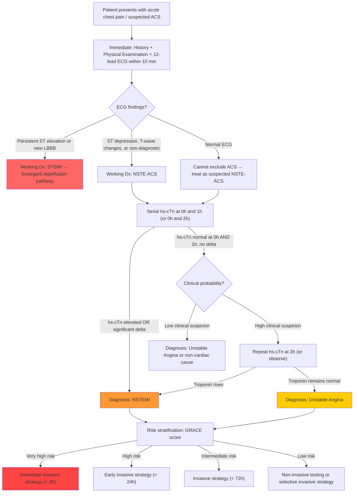

## Diagnostic Criteria for Unstable Angina

### The Core Concept: UA Is a Clinical Diagnosis of Exclusion Within ACS

Unlike NSTEMI or STEMI, **unstable angina has no single definitive biomarker or imaging finding** that confirms it. Instead, the diagnosis is reached by demonstrating:
1. A clinical presentation consistent with ACS (typical anginal symptoms with unstable features)
2. **No persistent ST elevation** on ECG (which would make it STEMI)
3. **No elevation of cardiac troponin** on serial sampling (which would make it NSTEMI)

In other words, UA is what remains after you have excluded STEMI (by ECG) and NSTEMI (by troponin). Think of it as ACS with ischaemia but without necrosis.

---

### Formal Diagnostic Criteria

#### A. Clinical Criteria (ACC/AHA / ESC)

***Unstable angina is defined as anginal pain with at least one of the following features*** [1]:
- ***Is of new onset and severe***
- ***Occurs at rest or with minimal exertion***
- ***Pain is worsening in the severity and length of each episode (i.e. occurring in a crescendo pattern)*** [1]

More specifically, the ACS clinical presentation includes [4]:
- ***Angina at rest: prolonged > 20 min angina at rest***
- ***New-onset angina: at least CCS Class II***
- ***Increasing angina: previous angina with ↑frequency, ↑duration, or ↓threshold to ≥CCS III severity***
- ***Post-infarct angina: recurrent angina after recent MI***

#### B. ECG Criteria

***NSTE-ACS ECG features*** [4]:
- ***ST depression***
- ***T wave changes***
- ***± some loss of R waves (if infarcted)***

For UA specifically, the ECG may show any of the above **or may be entirely normal**. The ECG distinguishes UA from STEMI (persistent ST elevation or new LBBB = STEMI) but **cannot** distinguish UA from NSTEMI on its own.

#### C. Biomarker Criteria — The Critical Differentiator

***Cardiac markers: Normal*** in UA [1][12].

This is the single defining laboratory feature. The 4th Universal Definition of Myocardial Infarction (2018) requires a **rise and/or fall of cardiac troponin (cTn) with at least one value above the 99th percentile of the upper reference limit (URL)** to diagnose MI [13]. If troponin remains normal on serial testing, the patient has UA rather than NSTEMI.

> ***On the diagnostic pathway: working suspicion of ACS → ECG → Biochemistry (troponin) → Risk stratification → Diagnosis*** [12]:
> - ***Persistent ST elevation → STEMI***
> - ***ST/T abnormalities + Troponin positive → NSTEMI***
> - ***Normal or undetermined ECG + Troponin 2× negative → Unstable Angina*** [12]

<Callout title="The Shrinking Diagnosis" type="error">
With **high-sensitivity cardiac troponin (hs-cTn)** assays now standard, very small amounts of myocardial necrosis are detectable. Many patients formerly classified as "UA" are now reclassified as NSTEMI because their hs-cTn crosses the 99th percentile URL. The ESC 2023 NSTE-ACS guidelines now emphasise that **true UA (genuinely negative hs-cTn on serial testing) has become uncommon**. However, it still exists and remains a valid diagnosis — particularly relevant for patients with very brief episodes of ischaemia that self-terminate before necrosis occurs.
</Callout>

---

### The 4th Universal Definition of Myocardial Infarction — Context for UA

Understanding the MI definition helps you understand precisely where UA sits:

| ***Type*** | ***Description*** | ***Criteria*** |
|---|---|---|
| ***Type 1*** | ***Spontaneous MI due to primary coronary event, e.g. plaque erosion/rupture*** | ***Detection of ↑/↓ cardiac biomarker values (preferably cTn) with ≥1 value above 99th URL; plus ≥1 of: (1) Symptoms of ischaemia; (2) New or presumed new significant ST-T changes or new LBBB; (3) Development of pathological Q waves; (4) Imaging evidence of new loss of viable myocardium or new RWMA; (5) Identification of intracoronary thrombus by angiography or post-mortem*** [13] |
| ***Type 2*** | ***MI secondary to ischaemia due to imbalance between O₂ demand and supply, e.g. coronary spasm, anaemia, hypotension*** | Same biomarker criteria as Type 1 [13] |
| ***Type 3*** | ***Sudden cardiac death*** | ***Symptoms of ischaemia + new ischaemic ECG changes or LBBB; but death before biomarkers obtained*** [13] |
| ***Type 4a*** | ***MI associated with PCI*** | ***↑cTn > 5× 99th URL*** [13] |
| ***Type 4b*** | ***MI associated with stent thrombosis*** | Verified stent thrombosis + biomarker rise [13] |
| ***Type 5*** | ***MI associated with CABG*** | ***↑cTn > 10× 99th URL*** [13] |

**UA is essentially "Type 1 MI pathophysiology WITHOUT meeting the biomarker threshold."** The plaque has ruptured, the thrombus has formed, ischaemia has occurred — but it was transient enough that myocardial cell death did not reach the detection threshold of troponin assays.

---

## Diagnostic Algorithm

### Overview of the Pathway

***The clinical spectrum of ACS*** ranges from ***oligo/asymptomatic → increasing chest pain/symptoms → persistent chest pain/symptoms → cardiogenic shock/acute heart failure → cardiac arrest*** [14]. The diagnostic workup follows a structured sequence:

---

## Investigation Modalities — Detailed

### 1. Electrocardiography (12-Lead ECG)

**The single most important first-line investigation.** Must be performed ***within 10 minutes of first medical contact*** (ESC 2023 recommendation).

#### Why ECG first?
- It is fast, cheap, universally available, non-invasive
- It immediately separates STEMI (needs emergent reperfusion) from NSTE-ACS (different pathway)
- Serial ECGs detect dynamic changes that evolving ischaemia/infarction produce

#### ECG Findings in UA/NSTE-ACS

| Finding | Description | Pathophysiological Basis |
|---|---|---|
| **ST depression** | Horizontal or downsloping ST depression ≥0.5 mm in ≥2 contiguous leads | Subendocardial ischaemia: the subendocardium is the most vulnerable zone (furthest from epicardial coronary supply, highest wall stress). Ischaemia causes delayed repolarisation of this region → net vector of repolarisation directed away from the electrode → ST depression |
| **T-wave inversion** | Symmetrical T-wave inversion ≥1 mm in ≥2 contiguous leads | Altered repolarisation sequence due to ischaemia — normally repolarisation proceeds from epicardium to endocardium; ischaemia reverses this → inverted T wave |
| ***T-wave inversions > 0.2 mV; pathological Q waves*** [1] | Deep T-wave inversion or Q waves | ***Intermediate risk*** in Braunwald classification [1] — suggests significant ischaemia or prior infarction |
| ***Angina at rest with transient ST-segment changes > 0.05 mV; new or presumed new BBB; sustained ventricular tachycardia*** [1] | Dynamic ST changes, new BBB, sustained VT | ***High risk*** in Braunwald classification [1] |
| ***Normal or unchanged ECG during an episode of chest discomfort*** [1] | No ischaemic changes during pain | ***Low risk*** in Braunwald classification [1] — but does NOT exclude UA |

#### Critical ECG Patterns to Recognise

***Wellens syndrome***: ***deeply inverted or biphasic T waves in V2-3 → highly specific for critical LAD stenosis → extremely high risk for extensive anterior wall MI in subsequent days/weeks*** [4]. This is a pattern you may see in UA patients between episodes — the ECG looks deceptively "non-urgent" but represents a ticking time bomb.

***ST elevation in aVR*** with diffuse ST depression: ***usually indicates left main stem occlusion*** [4]. This is the highest-risk pattern in NSTE-ACS and demands urgent invasive strategy.

***Pseudonormalization of T wave***: ***transient normalization of T wave from an inverted form → indicates transient recanalization of coronary artery*** [4]. If you see previously inverted T waves suddenly become upright during chest pain, this paradoxically indicates active ischaemia — the coronary artery has briefly opened then re-occluded.

> ***12-lead ECG stat and repeat at least daily ×3d (more frequently in severe cases)*** [2][3]. The rationale for serial ECGs is that ischaemia is **dynamic** in UA — the first ECG may be normal, but subsequent ECGs during recurrent symptoms may capture diagnostic changes.

<Callout title="Must-Know: Normal ECG Does NOT Exclude UA">
A single normal ECG has a sensitivity of only ~50% for ACS. Up to 6% of patients with a normal initial ECG will have NSTEMI/UA. This is why **serial ECGs** and **serial troponins** are mandatory. If the clinical suspicion is high, a normal ECG simply means "not STEMI right now" — it does NOT mean "not ACS."
</Callout>

---

### 2. Cardiac Biomarkers

#### A. High-Sensitivity Cardiac Troponin (hs-cTn)

This is the **gold standard biomarker** for differentiating UA from NSTEMI.

**What is troponin?** Troponin is a regulatory protein complex in cardiac muscle involved in calcium-mediated contraction. It has three subunits:
- **Troponin C (TnC)** — binds calcium
- **Troponin I (TnI)** — inhibits actin-myosin interaction
- **Troponin T (TnT)** — anchors complex to tropomyosin

Cardiac troponin I (cTnI) and cardiac troponin T (cTnT) have cardiac-specific isoforms not found in skeletal muscle. When cardiomyocytes undergo **necrosis** (irreversible cell death), the cell membrane loses integrity → intracellular troponin leaks into the bloodstream → detectable by assay.

**Why "high-sensitivity"?** Modern hs-cTn assays can detect concentrations ~10–100× lower than conventional assays. This means:
- Earlier detection (troponin rises within 1–3 hours of necrosis onset with hs-cTn vs 4–6 hours with conventional assays)
- Detection of very small amounts of necrosis (reclassifying many former "UA" as NSTEMI)

#### Sampling Protocol (ESC 2023 — 0h/1h Algorithm)

The **rapid rule-in/rule-out** algorithm is now standard:

| Timing | Interpretation |
|---|---|
| **0h sample** | Baseline hs-cTn at presentation |
| **1h sample** (preferred) or 2h sample | Look for **absolute change (delta)** from baseline |
| **Rule-out** | Very low 0h value AND no significant rise at 1h → ACS very unlikely (NPV > 99%) |
| **Rule-in** | High 0h value OR significant rise at 1h → NSTEMI confirmed |
| **Observe zone** | Neither rule-in nor rule-out → **repeat at 3h**, continue clinical observation |

**For UA:** Both 0h and serial troponins remain **below the 99th percentile URL** with no significant delta. ***Cardiac markers: Normal*** [1].

***Cardiac enzymes daily ×3d (repeat troponin 6–12h later if 1st Tn is normal)*** [2][3]. While the 0h/1h algorithm is now preferred for rapid triage, the principle of serial testing remains — you must demonstrate the **absence of a rise-and-fall pattern** before confidently labelling a patient as UA.

#### B. Other Cardiac Biomarkers (Historical / Supportive)

| Biomarker | Rise Time | Peak | Duration | Notes |
|---|---|---|---|---|
| **hs-cTnT / hs-cTnI** | 1–3h | 12–24h | 7–14 days | Gold standard; most sensitive and specific |
| **CK-MB** | 3–6h | 12–24h | 2–3 days | Used to detect **re-infarction** (short half-life allows detection of new rise) |
| **Myoglobin** | 1–2h | 6–8h | 12–24h | Very early but non-specific (also rises with skeletal muscle injury). Largely obsolete now |
| **BNP / NT-proBNP** | — | — | — | Not for diagnosis of MI; elevated in heart failure. Used for **prognosis** in ACS — ↑BNP correlates with ↑LV filling pressure and ↑mortality |

***Cardiac enzymes: cTnT, cTnI, CK-MB*** [8].

<Callout title="Key Principle">
In UA, **all troponin values remain below the 99th percentile URL**. If even a single value crosses this threshold with a rise-and-fall pattern, the diagnosis is reclassified to **NSTEMI**. The troponin is the diagnostic arbiter.
</Callout>

---

### 3. Baseline Blood Tests

***Basic bloods: CBC, L/RFT, lipid profile (≤24h), aPTT/INR (as baseline for heparin)*** [2][3].

| Test | Rationale | Key Findings |
|---|---|---|
| **CBC** | Identify anaemia (secondary cause of demand ischaemia); leukocytosis (infection/inflammation as precipitant); thrombocytopenia (affects antiplatelet/anticoagulant choices) | ↓Hb → demand ischaemia; ↑WCC → infection trigger |
| **Renal function (U/Cr, eGFR)** | Baseline for contrast use in angiography; renal impairment affects drug dosing (especially LMWH, P2Y12 inhibitors); CKD is an independent adverse prognostic factor | ↑Cr → dose-adjust renally cleared drugs |
| **Liver function** | Baseline for statin therapy; hepatic congestion (↑ALT/AST) may indicate right heart failure | ↑Transaminases → consider hepatic congestion or shock liver |
| **Fasting glucose / HbA1c** | Screen for DM (major risk factor); hyperglycaemia at presentation is an independent adverse prognostic marker even in non-diabetics | ↑Glucose → worse prognosis in ACS |
| **Fasting lipid profile** | Identify dyslipidaemia as modifiable risk factor; guide statin intensity. Best measured within 24h (lipids fall acutely after MI due to acute phase response) | ↑LDL-C → aggressive lipid-lowering target |
| **aPTT / INR** | Baseline before initiating anticoagulation (heparin); identify pre-existing coagulopathy | Abnormal → adjust anticoagulant dosing |
| **TFT** | Thyrotoxicosis as precipitant of demand ischaemia | ↓TSH → treat thyrotoxicosis |

---

### 4. Chest X-Ray (CXR)

***CXR: usually non-diagnostic in ACS, look for other causes (e.g. aortic dissection, PE, pneumonia or pneumothorax)*** [2][3].

| Finding | Significance |
|---|---|
| **Normal** | Does NOT exclude ACS; expected in most UA cases |
| **Pulmonary oedema** (bilateral alveolar infiltrates, upper lobe diversion, Kerley B lines, peribronchial cuffing) | Suggests significant LV dysfunction from extensive ischaemia → **high risk** |
| **Cardiomegaly** (CTR > 0.5) | Pre-existing cardiomyopathy or chronic heart failure |
| **Widened mediastinum** | Raises suspicion for **aortic dissection** — STOP anticoagulation, arrange urgent CT aortography [8] |
| **Pneumothorax** | Alternative diagnosis |
| **Consolidation** | Pneumonia — may be a precipitant of secondary UA |

---

### 5. Echocardiography

***Routine baseline echocardiography is recommended by ESC to evaluate for (1) regional wall motion abnormalities (2) LVEF → important prognostic parameter (3) other structural cardiac conditions*** [5][3].

| Finding | Interpretation |
|---|---|
| **Regional wall motion abnormality (RWMA)** | Hypokinesis/akinesis in a coronary territory → evidence of ischaemia or prior infarction; helps localise the culprit lesion. Important caveat: RWMA may be absent between ischaemic episodes in UA |
| **LVEF** | ***Strongest predictor of long-term survival; LVEF < 50% associated with ↑↑ event risk regardless of severity of ischaemia*** [5]. Guides need for ACEI/ARB, beta-blocker, and consideration for ICD |
| **Valvular disease** | May identify AS, MR (new ischaemic MR from papillary dysfunction), or HOCM as the cause of angina |
| **Pericardial effusion** | Raises suspicion for pericarditis (alternative dx) or aortic dissection with haemopericardium |
| **RV dilatation / dysfunction** | Consider PE or RV infarction |

**Timing:** Bedside echocardiography should be performed **urgently** in haemodynamically unstable patients to identify mechanical complications or alternative diagnoses (e.g. tamponade, massive PE, aortic dissection). In stable UA patients, it can be performed within the admission.

---

### 6. Risk Stratification Scores

Risk stratification is integral to the diagnostic workup because it determines the **urgency and strategy** of further investigation and treatment.

#### ***GRACE Score (Global Registry of Acute Coronary Events)*** [15]

The ESC-recommended tool for risk assessment. Variables include [15]:

| Variable | Points Basis |
|---|---|
| ***Age*** | Increasing points with age |
| ***Resting heart rate*** | Higher HR = more points |
| ***Systolic blood pressure*** | Lower BP = more points |
| ***Initial serum creatinine*** | Higher creatinine = more points |
| ***Killip class*** (degree of heart failure) | Higher class = more points |
| ***Cardiac arrest at presentation*** | Yes = high points |
| ***ST-segment deviation*** | Yes = more points |
| ***Elevated cardiac biomarkers*** | Yes = more points |
| ***History of CHF*** | Yes = more points |
| ***History of MI*** | Yes = more points |
| ***No in-hospital PCI*** | Yes = more points |

The GRACE score predicts **6-month post-discharge all-cause mortality** and guides the invasive strategy [15]:

| ***GRACE Score*** | ***Risk*** | ***Strategy*** |
|---|---|---|
| > 140 | ***High risk*** | ***Early/inpatient invasive strategy*** [15] |
| 109–140 | Intermediate risk | Invasive strategy within 72h |
| < 109 | Low risk | Non-invasive testing or selective invasive |

#### Braunwald Risk Classification

Already covered in the previous section — stratifies UA into ***high, intermediate, and low risk*** based on history, character of pain, clinical findings, ECG, and cardiac markers [1].

#### ***ESC 2023 Risk Stratification Criteria for Timing of Invasive Strategy*** [15]

***Immediate transfer/invasive strategy ( < 2h)*** — "Very high risk":
- ***Haemodynamic instability or cardiogenic shock***
- ***Acute heart failure presumed secondary to ongoing myocardial ischaemia***
- ***Life-threatening arrhythmias or cardiac arrest after presentation***
- ***Mechanical complications***
- ***Recurrent dynamic ECG changes suggestive of ischaemia***

***Early/inpatient invasive strategy ( < 24h)*** — "High risk" [15]:
- ***Elevated cardiac biomarkers***
- ***Confirmed diagnosis of NSTEMI based on ESC algorithms***
- ***GRACE risk score > 140***
- ***Transient ST-segment elevation***
- ***Dynamic ST-segment or T wave changes***

***Low risk*** — "In patients without very-high or high-risk features and a low index of suspicion for unstable angina" [15]: non-invasive assessment first.

---

### 7. Invasive Coronary Angiography (ICA)

This is the **definitive anatomical test** that visualises the coronary arteries and identifies the culprit lesion.

**Principle:** A catheter is advanced (usually via radial or femoral artery) to the coronary ostia, and radiopaque contrast is injected while fluoroscopic X-ray images are captured → real-time visualisation of coronary lumen.

| When to Perform | Rationale |
|---|---|
| **Very high risk NSTE-ACS** | Immediate ( < 2h) — to identify and treat culprit lesion emergently |
| **High risk NSTE-ACS** | Early ( < 24h) |
| **Intermediate risk** | Within 72h |
| **UA with low risk features** | May not need angiography acutely; can undergo non-invasive testing first and proceed to ICA if positive |

**Key Findings:**
- **Culprit lesion** — ruptured plaque with thrombus, typically appearing as a "hazy" filling defect or eccentric stenosis
- **Degree of stenosis** — significant = ≥70% (≥50% for left main)
- ***Number of vessels*** — ***mortality of 1VD < 2VD < 3VD < LMS disease*** [5]

***Coronary angiography findings may include ambiguous/hazy lesion, calcification, tortuosity/eccentricity — in such cases, intravascular imaging (IVUS or OCT) is used for further characterisation*** [16]:
- ***IVUS or OCT imaging findings*** can distinguish ***erosion, nodule, and rupture*** [16] — this is important because the underlying plaque pathology may influence management.

---

### 8. Non-Invasive Testing (For Stable / Low-Risk Patients After Acute Phase)

For patients diagnosed with UA who are stabilised and at low-to-intermediate risk, **non-invasive functional or anatomical testing** may be used to evaluate the extent of ischaemia and guide further management:

#### A. Exercise Tolerance Test (ETT)

***Positive test defined as horizontal or downsloping ST depression of ≥0.1 mV (1 mm) 80 ms after J point during exercise*** [5].

| Useful For | Not Useful For |
|---|---|
| ***Low-intermediate PTP (15–65%); normal baseline ECG; not on anti-ischaemic drugs*** [5] | ***Abnormal baseline ECG (LBBB, paced rhythm, WPW, AF, LVH, digoxin); limited exercise tolerance due to non-cardiac disease*** [5] |

**Why these limitations?** Pre-existing ST-T changes (from LBBB, LVH, digoxin) will obscure exercise-induced ischaemic changes → uninterpretable results. If the patient cannot reach **85% of maximum predicted heart rate (220 − age)**, the test is inadequate (insufficient stress to provoke ischaemia).

#### B. Stress Imaging (Stress Echo, Stress MRI, SPECT MPI, PET)

***Myocardial perfusion imaging (MPI)*** uses the ***coronary steal phenomenon*** [17]:
- ***At rest, partial coronary stenosis limits blood flow but remains substantial due to collaterals and ischaemia-induced vasodilation***
- ***With stress, vessels supplying normal myocardium also dilate → blood siphoned to normal myocardium ('steal') → ↓↓ perfusion of affected myocardium → appears as 'cold spots'*** [17]

**Interpretation** [17]:
- ***Normal → homogenous perfusion***
- ***Ischaemia → cold spots when under stress (but normal at rest)***
- ***Infarct → cold spots when at rest + under stress***

| Modality | Advantages | Limitations |
|---|---|---|
| **Stress echocardiography** | No radiation; evaluates wall motion + valves; relatively inexpensive | Operator-dependent; limited by body habitus |
| **SPECT MPI** | High sensitivity; well-validated | Radiation; attenuation artefacts; limited spatial resolution |
| **Cardiac MRI** | Excellent spatial resolution; no radiation; can assess viability | Contraindicated with certain implants; expensive; longer acquisition |
| **PET** | Best for viability assessment; less attenuation artefact than SPECT | Expensive; limited availability |

***High risk on stress imaging = area of ischaemia > 10%*** [5].

#### C. CT Coronary Angiography (CTCA)

***Useful for low-intermediate PTP (15–50%); excellent NPV (99–100%)*** [5].

***Significant stenosis = ≥70% stenosis*** on CTCA [5].

***Agaston calcium score > 100 generally correlated with significant risk of CAD*** [5]; ***↑Ca score associated with ↓specificity of CTA → NOT interpret CTA with Agaston > 400*** [5].

**For UA patients:** CTCA may be used in the low-risk group after the acute phase to rule out significant CAD non-invasively. If negative (no significant stenosis), the patient can be safely discharged with outpatient follow-up.

---

### Summary: Diagnostic Investigation Pathway for UA

| Phase | Investigation | Purpose | Key Finding in UA |
|---|---|---|---|
| **Immediate (< 10 min)** | 12-lead ECG | Exclude STEMI; detect ischaemic changes | ST depression, T-wave inversion, or **normal** |
| **Immediate** | Bloods: hs-cTn (0h), CBC, RFT, glucose, lipids, coagulation | Exclude NSTEMI; identify precipitants; baseline for treatment | **Troponin normal** at 0h |
| **1–3h** | Serial hs-cTn (1h or 2h recheck) | Confirm absence of troponin rise | **Troponin remains normal, no delta** |
| **Within admission** | CXR | Exclude other causes; assess for pulmonary oedema | Usually normal in UA |
| **Within admission** | Echocardiography | LVEF (prognosis); RWMA; structural disease | May be normal or show transient RWMA during ischaemia |
| **Risk-dependent** | GRACE score / Braunwald classification | Determine timing of invasive strategy | Guides urgency |
| **If high risk** | Invasive coronary angiography | Identify culprit lesion; plan revascularisation | Culprit plaque with non-occlusive thrombus; degree and number of vessels |
| **If low risk / post-stabilisation** | Non-invasive stress test or CTCA | Assess extent of ischaemia / anatomy | Inducible ischaemia or significant stenosis → proceed to ICA |

---

<Callout title="High Yield Summary">

1. **UA is a clinical diagnosis** = typical ACS presentation + no persistent ST elevation + **serial troponins normal**
2. ***ECG within 10 minutes*** of presentation → separates STEMI from NSTE-ACS
3. ***Serial hs-cTn (0h and 1h or 0h and 2h)*** → separates NSTEMI from UA. Rule-out requires low baseline AND no significant delta
4. The **4th Universal Definition of MI** requires troponin above 99th percentile URL with rise/fall pattern → UA does not meet this threshold
5. ***GRACE score*** is the ESC-recommended tool for risk stratification → determines timing of invasive strategy
6. ***Very high risk features*** (shock, acute HF, life-threatening arrhythmias, mechanical complications, recurrent dynamic ECG changes) → immediate invasive strategy < 2h
7. Know **Wellens syndrome** (critical LAD stenosis with biphasic/deeply inverted T in V2-3) and **aVR ST elevation** (LMS occlusion) — both are high-risk ECG patterns
8. ***Non-invasive testing*** (ETT, stress imaging, CTCA) is for **low-risk stabilised patients** to guide further management
9. ***Echocardiography*** for all patients: LVEF is the ***strongest predictor of long-term survival***
10. ***CXR*** is mainly to exclude alternatives (dissection, pneumothorax, pneumonia) and detect complications (pulmonary oedema)
</Callout>

---

<ActiveRecallQuiz
  title="Active Recall - Diagnosis of Unstable Angina"
  items={[
    {
      question: "What three criteria define the diagnosis of unstable angina within the ACS spectrum?",
      markscheme: "(1) Clinical presentation consistent with ACS (new-onset severe angina, rest angina, or crescendo angina); (2) No persistent ST elevation on ECG (excludes STEMI); (3) Serial cardiac troponins remain below the 99th percentile URL (excludes NSTEMI).",
    },
    {
      question: "Describe the ESC 0h/1h hs-cTn algorithm for rapid rule-in/rule-out of NSTEMI.",
      markscheme: "Measure hs-cTn at 0h and 1h. Rule-out: very low 0h value AND no significant rise at 1h (NPV >99%). Rule-in: high 0h value OR significant absolute rise at 1h. Observe zone: neither met, repeat at 3h and continue observation.",
    },
    {
      question: "What is Wellens syndrome and why is it high-yield in the context of UA?",
      markscheme: "Deeply inverted or biphasic T waves in V2-V3. Highly specific for critical proximal LAD stenosis. Patient is at extremely high risk for extensive anterior wall MI in subsequent days/weeks. Often seen between ischaemic episodes when patient is pain-free. Must NOT undergo stress testing (risk of provoking MI). Needs urgent angiography.",
    },
    {
      question: "What does the GRACE score predict and what are the key variables?",
      markscheme: "Predicts 6-month post-discharge all-cause mortality after ACS. Variables: age, resting heart rate, systolic BP, serum creatinine, Killip class, cardiac arrest at presentation, ST deviation, elevated biomarkers, history of CHF, history of MI, no in-hospital PCI. Score >140 = high risk requiring early invasive strategy.",
    },
    {
      question: "Why is a normal resting ECG insufficient to exclude unstable angina?",
      markscheme: "Single ECG sensitivity for ACS is only about 50%. Ischaemia in UA is dynamic and intermittent; the ECG may be normal between episodes. Up to 6% of patients with normal initial ECG have ACS. Serial ECGs and serial troponins are mandatory. Normal ECG only excludes STEMI at that moment, not NSTE-ACS.",
    },
    {
      question: "Explain the coronary steal phenomenon that underlies myocardial perfusion imaging.",
      markscheme: "At rest, stenosed coronary territory maintains flow via collaterals and local vasodilation. With pharmacological or exercise stress, normal coronary vessels dilate maximally, siphoning blood away from the stenosed territory (which cannot dilate further). This creates relative hypoperfusion of ischaemic territory, appearing as cold spots on stress imaging but normal at rest (reversible defect = ischaemia; fixed defect = infarct).",
    },
  ]}
/>

---

## References

[1] Lecture slides: GC 028. Accelerating chest pain_Acute coronary (1).pdf (p15, p32)
[2] Senior notes: Ryan Ho Cardiology.pdf (p54, p55, p58)
[3] Senior notes: Ryan Ho Fundamentals.pdf (p199, p200, p202, p203)
[4] Senior notes: Ryan Ho Cardiology.pdf (p128, p129)
[5] Senior notes: Ryan Ho Cardiology.pdf (p115, p116, p117, p120)
[8] Senior notes: felixlai.md (p1328)
[12] Lecture slides: GC 088. Sudden Severe Chest Pain.pdf (p57)
[13] Senior notes: Ryan Ho Cardiology.pdf (p127)
[14] Lecture slides: GC 028. Accelerating chest pain_Acute coronary (1).pdf (p11)
[15] Lecture slides: GC 028. Accelerating chest pain_Acute coronary (1).pdf (p33)
[16] Lecture slides: GC 028. Accelerating chest pain_Acute coronary (1).pdf (p50)
[17] Senior notes: Ryan Ho Diagnostic Radiology.pdf (p57)
