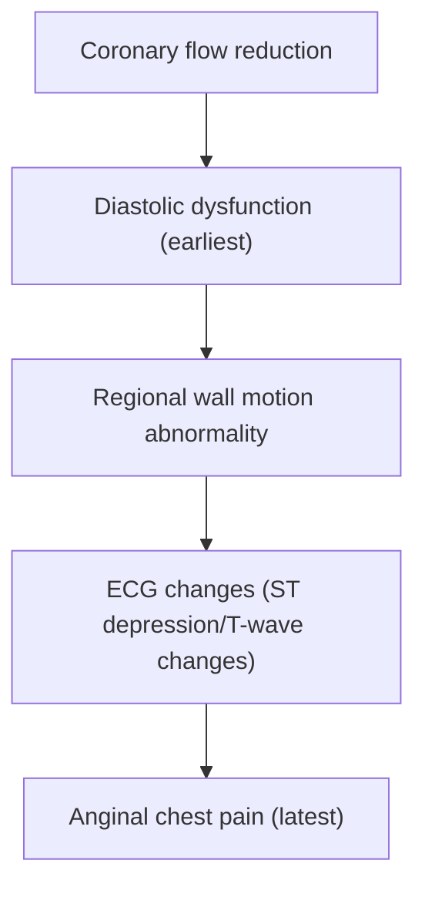
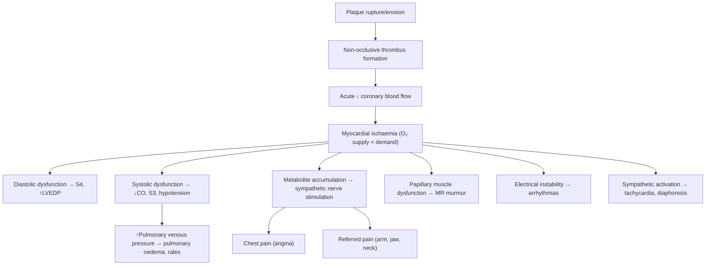

## Definition

Unstable angina (UA) is a clinical syndrome within the **acute coronary syndrome (ACS)** spectrum, defined as ***anginal pain with at least one of the following features: (1) is of new onset and severe; (2) occurs at rest or with minimal exertion; (3) pain is worsening in severity and length of each episode (i.e. occurring in a crescendo pattern)*** [1]. Crucially, UA is distinguished from NSTEMI by the **absence of elevated cardiac biomarkers** (i.e. no evidence of myocardial necrosis) and from STEMI by the **absence of persistent ST-segment elevation** on ECG.

Let's break the name down:
- **"Unstable"** — the clinical situation is not fixed or predictable; there is a dynamic, evolving obstruction that may progress to complete occlusion and infarction at any moment.
- **"Angina"** — from Latin *angere* = "to strangle/choke"; chest pain or discomfort due to myocardial ischaemia.

So the name literally tells you: *this is a strangling chest pain that is unpredictable and potentially worsening* — a medical emergency because it sits on the knife-edge between stable coronary disease and full myocardial infarction.

<Callout title="Key Concept">
UA, NSTEMI and STEMI form a continuum of the same underlying pathology — **atherosclerotic plaque disruption with superimposed thrombosis**. The difference lies in the degree and duration of coronary occlusion and whether myocardial necrosis has occurred. UA = ischaemia without necrosis; NSTEMI = partial occlusion with some necrosis; STEMI = complete occlusion with transmural necrosis [2][3].
</Callout>

***Unstable angina and NSTEMI are classified together as NSTE-ACS*** because they are clinically indistinguishable at presentation — the only differentiator is the subsequent troponin result [2].

---

## Epidemiology

### Global and Hong Kong Context

- ***Ischaemic heart disease (IHD) remains the number one cause of death in men and women (27% of deaths)*** [4].
- ***Angina is most common in middle-aged and elderly men. Among persons 60–79 years of age, approximately 25% of men and 16% of women have coronary heart disease, rising to 37% and 23% among men and women > 80 years of age, respectively*** [4].
- ***The incidence of coronary heart disease and angina in women after menopause is similar to that of men*** [4] — this is because oestrogen is cardioprotective (promotes NO-mediated vasodilation, favourable lipid profile with ↑HDL); loss of oestrogen post-menopause removes this protection.
- ***The initial manifestation of IHD is angina pectoris in 50%, and about 50% of patients presenting to hospital with ACS have preceding angina*** [4].
- ***Within 12 months of initial diagnosis, 10–20% of patients with stable angina progress to MI or unstable angina*** [4].
- In **Hong Kong**, IHD is among the top 3 causes of death. The prevalence of coronary artery disease is rising due to an ageing population and increasing prevalence of metabolic risk factors (diabetes, obesity, hypertension). Hong Kong Chinese patients tend to present with more diffuse, small-vessel disease and have a higher prevalence of diabetes mellitus as a risk factor compared with Western populations.

### With high-sensitivity troponin assays
An important modern note: with the advent of **high-sensitivity cardiac troponin (hs-cTn)** assays, many cases previously classified as UA are now reclassified as NSTEMI because even tiny amounts of myocardial necrosis are detected. This means the proportion of "true UA" (completely normal troponin) is shrinking in contemporary practice. However, UA remains a clinically important entity because it represents **ischaemia at imminent risk of progression**.

---

## Risk Factors

These are essentially the risk factors for **atherosclerotic cardiovascular disease (ASCVD)**, since the underlying pathology is coronary atherosclerosis with plaque instability.

### Non-Modifiable Risk Factors
| Risk Factor | Explanation |
|---|---|
| **Advanced age** | Cumulative endothelial damage and plaque burden over time |
| **Male sex** | Oestrogen in premenopausal women is protective (↑HDL, ↑NO, anti-inflammatory); men lack this advantage |
| **Family history of premature CVD** (male 1° relative < 55y, female 1° relative < 65y) | Genetic susceptibility to endothelial dysfunction, dyslipidaemia, thrombotic tendency |
| **Previous vascular event** (prior MI, stroke, PVD) | Indicates established atherosclerotic burden [2][5] |

### Modifiable Risk Factors
| Risk Factor | Mechanism |
|---|---|
| **Cigarette smoking** | Endothelial injury → ↑oxidative stress → ↑LDL oxidation → accelerated atherogenesis; also ↑platelet aggregation and ↑fibrinogen → pro-thrombotic |
| **Hypertension** | Haemodynamic shear stress → endothelial damage → accelerated atherosclerosis; also promotes LV hypertrophy → ↑O₂ demand |
| **Diabetes mellitus** | Hyperglycaemia → advanced glycation end-products (AGEs) → endothelial dysfunction; also promotes dyslipidaemia (↑TG, ↓HDL, small dense LDL) and pro-thrombotic state |
| **Dyslipidaemia** (esp. ↑LDL-C, ↓HDL-C) | LDL penetrates damaged endothelium → oxidised → engulfed by macrophages → foam cells → fatty streak → plaque [6] |
| **Abdominal obesity / metabolic syndrome** | Central adiposity → insulin resistance → chronic inflammation, dyslipidaemia, pro-thrombotic state |
| **Physical inactivity** | Lack of exercise → ↓HDL, ↑insulin resistance, ↑BP, ↑weight |
| **Diet** (high saturated fat, low fruit/vegetable) | Directly contributes to dyslipidaemia and oxidative stress |

### Specific Precipitating Factors for ACS/UA

***Predisposing factors*** for the acute transition from stable plaque to unstable plaque rupture and ACS include [7]:

1. ***Unusual heavy exercise***
2. ***Emotional stress***
3. ***Progression from unstable angina***
4. ***Surgical procedures***
5. ***Infection e.g. pneumonia***
6. ***Circadian periodicity — peak incidence between 0600–1200*** [7]

> The circadian pattern is explained by the morning catecholamine surge (↑sympathetic tone on waking) → ↑heart rate, ↑blood pressure, ↑platelet aggregability, and ↑coronary vasomotor tone — all combining to increase the likelihood of plaque rupture and thrombosis.

<Callout title="Hong Kong-Specific Considerations" type="idea">
In Hong Kong, particular attention should be paid to:
- **Very high prevalence of DM** (>10% of the population), often as the predominant risk factor
- **Smoking** remains common especially in males
- **Increasing obesity** in younger populations
- Lower rates of familial hypercholesterolaemia awareness compared with Western populations [6]
</Callout>

---

## Anatomy and Function: The Coronary Arterial System

Understanding UA requires understanding the coronary anatomy, because the location of the culprit lesion determines both the clinical presentation and risk.

### Coronary Artery Anatomy

The heart is supplied by two main coronary arteries arising from the **aortic root** (sinuses of Valsalva):

| Artery | Territory Supplied | Clinical Significance if Occluded |
|---|---|---|
| **Left main coronary artery (LMCA)** | Bifurcates into LAD and LCx | Occlusion = "widow maker" — supplies ~75–80% of LV; often fatal |
| **Left anterior descending (LAD)** | Anterior wall of LV, anterior 2/3 of interventricular septum, apex | Most commonly involved in ACS; anterior STEMI |
| **Left circumflex (LCx)** | Lateral wall of LV, +/- posterior wall (if left-dominant) | Lateral MI |
| **Right coronary artery (RCA)** | Inferior wall of LV, RV, SA node (60%), AV node (80–85%) | Inferior MI; may cause bradycardia/heart block due to SA/AV node ischaemia |

### Coronary Dominance
- **Right-dominant** (~85%): RCA gives rise to the posterior descending artery (PDA)
- **Left-dominant** (~8%): LCx gives rise to PDA
- **Co-dominant** (~7%): both contribute

### Why the Coronary Arteries Are Vulnerable
- Coronary arteries are **end-arteries** (limited collateral circulation in most people) — so even partial occlusion can cause ischaemia
- They fill during **diastole** (the myocardium compresses intramural vessels during systole) — this is why tachycardia (↓diastolic time) worsens ischaemia
- They are subject to **high pulsatile flow** and **bifurcation turbulence** — predisposing to endothelial injury and atherosclerosis at branch points

---

## Aetiology and Pathophysiology

### The Spectrum: Stable Plaque → Unstable Plaque → ACS

The fundamental concept: **UA is caused by an acute reduction in coronary blood flow** that is not severe or prolonged enough to cause myocardial necrosis (that would be MI), but is severe enough to cause ischaemia at rest or with minimal exertion.

***The cause is dynamic obstruction*** rather than the fixed stenosis of stable angina [2].

### Mechanisms of Unstable Angina (listed in order of frequency)

#### 1. Atherosclerotic Plaque Rupture/Erosion with Non-Occlusive Thrombosis (Most Common)

This is the **dominant mechanism** and the reason UA exists:

```
Stable atherosclerotic plaque
         ↓
Plaque becomes "vulnerable" (thin fibrous cap, large lipid core, 
inflammatory infiltrate with activated macrophages)
         ↓
Plaque rupture or endothelial erosion
         ↓
Exposure of subendothelial collagen and lipid core to blood
         ↓
Platelet adhesion → activation → aggregation
         ↓
Coagulation cascade activation → thrombin generation → fibrin deposition
         ↓
NON-OCCLUSIVE thrombus ("white thrombus", platelet-rich)
         ↓
Acute ↓ in coronary lumen → ↓ myocardial O₂ supply
         ↓
Ischaemia WITHOUT necrosis = UNSTABLE ANGINA
```

**Why does the thrombus not occlude completely?** In UA (as opposed to STEMI), the thrombus is typically:
- Platelet-rich ("white thrombus") rather than fibrin-rich ("red thrombus")
- Non-occlusive — it significantly narrows but does not completely block flow
- Dynamic — it may partially lyse and re-form, causing intermittent ischaemia
- Microemboli from the thrombus may travel distally, causing small areas of downstream ischaemia

<Callout title="Vulnerable Plaque – Why Some Plaques Rupture" type="idea">
Not all plaques are equal. The plaques most likely to rupture ("vulnerable plaques") have:
- **Thin fibrous cap** ( < 65 μm)
- **Large lipid-rich necrotic core** (> 40% of plaque volume)
- **Abundant inflammatory cells** (macrophages releasing matrix metalloproteinases [MMPs] that degrade collagen in the cap)
- **Few smooth muscle cells** (SMCs produce collagen to stabilise the cap; inflammation inhibits SMC function)
- **Neovascularisation** (fragile new vessels within the plaque → intraplaque haemorrhage)

Paradoxically, these vulnerable plaques often cause only **mild-to-moderate stenosis** (< 70%) on angiography — which is why patients with "insignificant" stenoses can still present with ACS. The degree of stenosis does NOT predict the risk of plaque rupture.
</Callout>

#### 2. Coronary Vasospasm (Prinzmetal's/Variant Angina)

- Intense focal spasm of an epicardial coronary artery → transient complete or near-complete occlusion
- Can occur in arteries with or without significant underlying atherosclerosis
- Mechanism: endothelial dysfunction → ↓NO production → unopposed smooth muscle contraction; also involves ↑endothelin-1, ↑thromboxane A₂
- Classically occurs **at rest, often early morning** (correlating with circadian ↑vascular tone)
- Triggers: smoking, cocaine, cold exposure, hyperventilation, alkalosis
- ECG may show **transient ST-elevation** during vasospasm (not true STEMI because it reverses)
- Important in the Hong Kong/Asian population: **coronary vasospasm is more prevalent in East Asian populations** compared to Caucasians

#### 3. Progressive Mechanical Obstruction

- Gradual progression of atherosclerotic plaque (without acute rupture) to critical stenosis
- Or in-stent restenosis after previous PCI
- Does not involve acute thrombotic event — rather, the plaque slowly encroaches until ischaemia occurs at rest

#### 4. Secondary/Demand Unstable Angina

- Angina precipitated by conditions that **increase myocardial oxygen demand** or **decrease supply** in the setting of pre-existing coronary stenosis
- Demand-side: fever, tachycardia, thyrotoxicosis, severe hypertension, aortic stenosis
- Supply-side: anaemia, hypoxaemia, hypotension
- Important to identify because treating the secondary cause may resolve the UA

#### 5. Inflammation and Infection

- Systemic inflammation (e.g. during pneumonia, sepsis) can destabilise plaques through:
  - ↑circulating cytokines (IL-6, TNF-α) → activate macrophages within plaque
  - ↑acute phase reactants (CRP, fibrinogen) → pro-thrombotic state
  - Endothelial activation → ↑tissue factor expression → thrombosis

### The Oxygen Supply-Demand Mismatch — First Principles

At its core, angina (including UA) occurs when **myocardial O₂ demand > supply** [2][3]:

**Myocardial O₂ Demand** is determined by:
1. **Heart rate** (most important — ↑HR = ↑demand)
2. **Contractility** (↑inotropy = ↑demand)
3. **Wall tension/stress** (= pressure × radius / wall thickness, by Laplace's law)
   - ↑Afterload (HTN, AS) → ↑wall stress → ↑demand
   - ↑Preload (volume overload) → ↑LV radius → ↑demand

**Myocardial O₂ Supply** is determined by:
1. **Coronary blood flow** (affected by stenosis, vasospasm, diastolic time)
2. **Arterial O₂ content** (affected by Hb level, SaO₂)
3. **O₂ extraction** (myocardium already extracts ~75% of delivered O₂ at rest — very little reserve, so the only way to increase supply is to increase flow)

> **Why can't the heart just extract more oxygen?** Unlike skeletal muscle, the myocardium has near-maximal O₂ extraction at baseline (~75% vs ~25% in skeletal muscle). Therefore, the myocardium is almost entirely dependent on increasing coronary blood flow to meet increased demand. This is why coronary stenosis is so dangerous.

### Pathophysiology: From Ischaemia to Symptoms

***Myocardial ischaemia → metabolite accumulation → stimulation of cardiac sympathetic nerves → pain*** [2][3]

The "ischaemic cascade" occurs in this order:



This is important because:
- **ECG changes precede symptoms** — a patient may have "silent ischaemia" with ST changes but no pain (common in diabetics due to autonomic neuropathy)
- **Diastolic dysfunction is the earliest sign** — this is why S4 gallop may be heard during ischaemia (stiff, non-compliant LV)

---

## Classification

### 1. Within the ACS Spectrum

| | Unstable Angina | NSTEMI | STEMI |
|---|---|---|---|
| **Pathology** | ***Severe ischaemia at rest without infarction*** [2] | ***Partial occlusion of coronary arteries (usually due to critical narrowing) → some myocardial necrosis but not transmural*** [2] | ***Complete occlusion of coronary arteries (usually due to acute plaque disruption leading to complete thrombosis) → transmural myocardial necrosis*** [2] |
| **Troponin** | **Normal** | **Elevated** | **Elevated** |
| **ECG** | ST depression, T-wave inversion, or normal | ST depression, T-wave inversion, or normal | ST elevation or new LBBB |
| **Thrombus type** | Non-occlusive, platelet-rich ("white") | Non-occlusive or transiently occlusive | Occlusive, fibrin-rich ("red") |

### 2. Braunwald Classification of Unstable Angina

This is a **classic and high-yield** classification for risk stratification [1]:

#### A. Severity

| Class | Description |
|---|---|
| ***Class I*** | ***New-onset or progressive CCS Class III or IV angina in the past 2 weeks*** — but no rest pain [1] |
| ***Class II*** | ***Prolonged ( > 20 min) rest angina, now resolved, with moderate or high likelihood of CAD*** — rest angina in prior month but not in past 48 hours [1] |
| ***Class III*** | ***Prolonged ongoing ( > 20 min) rest pain*** — rest angina within past 48 hours [1] |

#### B. Clinical Circumstances

| Circumstance | Description |
|---|---|
| **A — Secondary** | Precipitated by an extracardiac condition (e.g. anaemia, fever, thyrotoxicosis, hypotension) |
| **B — Primary** | Develops in the absence of an extracardiac precipitant |
| **C — Post-infarction** | Develops within 2 weeks of documented MI (highest risk) |

#### C. Treatment Context

| | Description |
|---|---|
| **1** | Absence of treatment or minimal treatment |
| **2** | Occurring despite standard anti-anginal therapy |
| **3** | Occurring despite maximal anti-anginal therapy (including IV nitroglycerin) |

### ***Braunwald Risk Stratification*** [1]

| Feature | ***High Risk*** | ***Intermediate Risk*** | ***Low Risk*** |
|---|---|---|---|
| ***History*** | ***Accelerating tempo of ischaemic symptoms in preceding 48 hrs*** | ***Prior MI, peripheral or cerebrovascular disease, CABG, or prior aspirin use*** | |
| ***Character of Pain*** | ***Prolonged ongoing ( > 20 min) rest pain*** | ***Prolonged ( > 20 min) rest angina, now resolved, with moderate or high likelihood of CAD*** | ***New-onset or progressive CCS Class III or IV angina the past 2 weeks*** |
| ***Clinical Findings*** | ***Pulmonary oedema; new or worsening MR murmur; S3 or new/worsening rales; hypotension, bradycardia, tachycardia; age > 75 years*** | ***Age > 70 years*** | |
| ***ECG*** | ***Angina at rest with transient ST-segment changes > 0.05 mV; new or presumed new BBB; sustained ventricular tachycardia*** | ***T-wave inversions > 0.2 mV; pathological Q waves*** | ***Normal or unchanged ECG during an episode of chest discomfort*** |
| ***Cardiac Markers*** | ***Elevated (TnT or TnI > 0.1 ng/mL)*** | ***Slightly elevated (TnT > 0.01 but < 0.1 ng/mL)*** | ***Normal*** |

<Callout title="Exam Pearl" type="error">
Note that by modern definition, if troponin is elevated (even slightly), the patient has NSTEMI — not UA. The Braunwald classification was developed before hs-cTn assays. In practice, the risk stratification framework remains clinically useful, but strictly speaking, "UA with elevated troponin" is now NSTEMI by the 4th Universal Definition of MI (2018).
</Callout>

### 3. Canadian Cardiovascular Society (CCS) Angina Grading

This is used for grading the **functional severity** of angina and is referenced in the Braunwald classification:

| CCS Class | Description |
|---|---|
| I | Angina only with strenuous/rapid/prolonged exertion |
| II | Slight limitation of ordinary activity (e.g. walking > 2 blocks, climbing > 1 flight) |
| III | Marked limitation of ordinary activity (e.g. walking 1–2 blocks, climbing 1 flight) |
| IV | Inability to carry out any physical activity without angina; angina may be present at rest |

---

## Clinical Features

### Symptoms

The cardinal symptom of UA is **chest pain/discomfort** with features suggesting myocardial ischaemia, but with a pattern that is new, more severe, or occurring at rest.

#### 1. Chest Pain — Character and Quality

- ***Typically dull, constricting, choking, 'heavy'*** [2][3]
- ***Described as squeezing, crushing, burning, aching or even as breathlessness*** [2][3]
- ***Patients often emphasise it is a discomfort, not a pain*** [2][3]
- ***Levine's sign: characteristic gesture of a clenched fist on chest when describing angina*** [2][3]

**Pathophysiological basis:** Myocardial ischaemia → accumulation of metabolites (adenosine, lactate, bradykinin, H⁺) → stimulation of cardiac sympathetic afferent nerve endings (unmyelinated C-fibres) → travel via cardiac sympathetic nerves → converge on the same dorsal horn neurons as somatic afferents from the chest wall, arm, and jaw → **visceral-somatic convergence** in the spinal cord → the brain "misinterprets" the visceral signal as coming from the somatic territory → this explains the dull, poorly localised, diffuse nature of cardiac pain (visceral pain is inherently poorly localised because the visceral nervous system has fewer afferent fibres and larger receptive fields).

#### 2. Chest Pain — Onset and Pattern (What Makes It "Unstable")

***ACS: typically takes minutes to develop, may occur at rest or with exertion*** [2][3]

The **unstable** pattern distinguishes UA from stable angina:

| Feature | Stable Angina | Unstable Angina |
|---|---|---|
| Onset | Predictable, with exertion | **At rest**, or with **less exertion than before**, or **new-onset severe** |
| Duration | < 5–10 min, relieved by rest/GTN | **> 10–20 min**, may not fully resolve with rest/GTN |
| Pattern | Reproducible, unchanging | ***Crescendo pattern — worsening in severity and length of each episode*** [1] |
| Frequency | Stable over weeks-months | ***Accelerating tempo of symptoms*** [1] |

**Pathophysiological basis:** In stable angina, there is a fixed stenosis — ischaemia only occurs when demand increases (exertion). In UA, the dynamic thrombus on a ruptured plaque causes variable degrees of obstruction — even at rest, blood flow may be insufficient. The crescendo pattern reflects progressive plaque instability or growing thrombus burden.

#### 3. Radiation

- ***Arms (especially left), shoulder, jaw, neck, back, epigastrium*** [2][3]
- Left arm radiation is "classic" but right arm, both arms, or jaw radiation can occur

**Pathophysiological basis:** Cardiac sympathetic afferents enter the spinal cord at T1–T5 levels. These segments also receive somatic afferents from the upper limbs (via brachial plexus — C5–T1), jaw (trigeminal nucleus connections), and shoulder. The convergence of cardiac visceral and somatic afferents at these spinal levels causes referred pain to these regions.

#### 4. Associated Symptoms

| Symptom | Pathophysiological Basis |
|---|---|
| **Dyspnoea** | Ischaemia → transient LV diastolic dysfunction (stiff, non-compliant LV) → ↑LV end-diastolic pressure → ↑pulmonary venous pressure → pulmonary congestion → breathlessness. May be an "angina equivalent" especially in elderly and diabetics |
| **Diaphoresis (sweating)** | Sympathetic nervous system activation in response to pain and haemodynamic stress → ↑catecholamines → generalised sympathetic discharge including activation of eccrine sweat glands |
| **Nausea/vomiting** | Vagal stimulation from inferior wall ischaemia (the inferior surface of the heart is richly supplied by vagal afferents); also a response to severe pain |
| **Palpitations** | Ischaemia-induced arrhythmias (ectopic beats, tachycardia) or sympathetic activation |
| **Light-headedness / pre-syncope** | ↓Cardiac output from ischaemia-induced LV dysfunction → ↓cerebral perfusion |
| **Sense of impending doom** | Massive sympatho-adrenal activation; also visceral afferent stimulation |

#### 5. Angina Equivalents

Some patients, particularly **elderly, female, and diabetic** patients, may present with "atypical" symptoms rather than classic chest pain:
- **Exertional dyspnoea** alone (most common equivalent)
- **Epigastric pain** (mimicking GERD or peptic ulcer disease)
- **Fatigue or exercise intolerance**
- **Syncope or near-syncope**

**Why diabetics have atypical presentations:** Diabetic autonomic neuropathy → damage to cardiac afferent nerves → impaired pain perception → "silent ischaemia." These patients may have ST changes on ECG without any pain.

<Callout title="Must-Know: Features That DIFFERENTIATE UA from Other Chest Pains">

Anginal chest pain:
- Dull, constricting, "heavy" (not sharp/stabbing)
- Retrosternal with typical radiation
- Lasts minutes, not seconds (fleeting pain is rarely cardiac) and not hours (unrelenting pain > 20–30 min → think MI or non-cardiac)
- Provoked by exertion/emotion in stable angina; occurs at rest/crescendo in UA
- Relieved by rest and/or sublingual GTN within 5 minutes in stable angina; ***in UA, may not be fully relieved by GTN*** [2]

NOT anginal:
- Sharp, stabbing, knife-like → pleuritic (PE, pneumothorax, pericarditis)
- Tearing pain radiating to back → aortic dissection
- Retrosternal burning worse with meals/lying down → GERD
- Reproducible with palpation → musculoskeletal
- Fleeting (seconds) → usually non-cardiac
</Callout>

### Signs (Physical Examination)

***Physical examination may be normal*** in many UA patients — this is a key teaching point. A normal exam does NOT exclude UA [2][3].

However, examination is critical to:
1. **Identify haemodynamic compromise** (suggesting extensive ischaemia)
2. **Identify precipitating/exacerbating conditions**
3. **Look for evidence of underlying cardiovascular disease**
4. **Exclude non-cardiac causes of chest pain**

#### Signs During Ischaemic Episode

| Sign | Pathophysiological Basis |
|---|---|
| **S4 gallop (atrial gallop)** | Ischaemia → impaired LV relaxation (diastolic dysfunction) → atrium contracting against a stiff ventricle → audible S4. This is the **most common auscultatory finding** during active ischaemia |
| ***S3 or new/worsening rales*** [1] | Ischaemia → LV systolic dysfunction → ↑LV end-diastolic pressure → ↑pulmonary capillary wedge pressure → transudative fluid in alveoli → rales/crackles. S3 = rapid ventricular filling against a volume-overloaded ventricle. Indicates significant LV impairment — **high risk** |
| ***New or worsening MR murmur*** [1] | Ischaemia of papillary muscle (esp. posteromedial papillary muscle — single blood supply from PDA) → transient papillary muscle dysfunction → mitral leaflet fails to coapt → functional mitral regurgitation → pansystolic murmur at apex radiating to axilla. **High risk** sign |
| ***Hypotension*** [1] | Extensive ischaemia → ↓LV contractility → ↓cardiac output → ↓BP. Indicates cardiogenic shock physiology. **High risk** |
| ***Tachycardia*** [1] | Compensatory sympathetic activation due to ↓stroke volume; also a direct effect of catecholamine release from pain/anxiety. Worsens ischaemia by ↑O₂ demand and ↓diastolic filling time |
| ***Bradycardia*** [1] | Inferior wall ischaemia → enhanced vagal tone (Bezold-Jarisch reflex); or ischaemia of SA/AV node (supplied by RCA in 60%/85%). **High risk** |
| ***Pulmonary oedema*** [1] | Severe LV dysfunction from extensive ischaemia → flash pulmonary oedema. **High risk** — indicates large territory at jeopardy |
| **Diaphoresis, pallor** | Sympathetic activation → peripheral vasoconstriction (pallor) + eccrine sweating (diaphoresis) |
| **Transient paradoxical splitting of S2** | Ischaemia → delayed LV ejection → delayed aortic valve closure → A2 falls after P2 |

#### Signs of Underlying Cardiovascular Disease / Risk Factors

| Sign | Significance |
|---|---|
| ***Evidence of VHD, especially AS, AR, HOCM*** [2] | These conditions themselves can cause angina by ↑O₂ demand (LVH in AS/HOCM) or ↓coronary perfusion pressure (↓diastolic BP in AR) |
| ***Risk factors: HTN, DM*** [2] | Hypertensive retinopathy, acanthosis nigricans (insulin resistance) |
| ***LV dysfunction: cardiomegaly, gallop rhythm*** [2] | Displaced apex beat (LV dilatation), S3/S4 |
| ***Other arterial diseases: carotid bruit, signs of PVD (presence of all peripheral pulses)*** [2] | Atherosclerosis is a systemic disease — presence of PVD or carotid disease significantly increases the pre-test probability of CAD |
| ***Conditions that may exacerbate angina: anaemia, thyrotoxicosis*** [2] | Pallor, tachycardia (anaemia); tremor, lid lag, goitre (thyrotoxicosis) — these are secondary causes of "demand ischaemia" |
| **Xanthelasma, tendon xanthomata, arcus senilis** (if < 50y) | Suggest familial hypercholesterolaemia → premature ASCVD [6] |

<Callout title="Clinical Pearl: The 'Silent' Examination" type="idea">
A completely normal physical examination in a patient with typical anginal chest pain does NOT reassure you — it is actually the norm. The diagnosis of UA is primarily clinical (history-driven) and confirmed with ECG and serial troponins. The examination is more about risk stratification (finding high-risk features like pulmonary oedema, new MR murmur, or hypotension) and excluding alternatives.
</Callout>

---

## Summary of Pathophysiology → Clinical Features Connection



---

<Callout title="High Yield Summary">

1. **Unstable angina (UA)** = anginal chest pain that is new-onset and severe, occurs at rest, or is crescendo in pattern — **WITHOUT troponin elevation** (no myocardial necrosis)
2. UA sits on the ACS spectrum between stable angina and NSTEMI/STEMI — same underlying pathology of **atherosclerotic plaque disruption with non-occlusive thrombosis**
3. The key pathological difference: UA has a **non-occlusive, platelet-rich "white" thrombus** → ischaemia but no infarction
4. ***Risk factors***: modifiable (smoking, HTN, DM, dyslipidaemia, obesity, inactivity) and non-modifiable (age, male sex, family Hx, prior CVD)
5. ***Precipitants***: heavy exercise, emotional stress, surgery, infection, circadian peak 0600–1200
6. ***Clinical features***: dull/constricting retrosternal chest discomfort ± radiation to arms/jaw/neck, occurring at rest or with ↓threshold; associated dyspnoea, diaphoresis, nausea
7. ***Examination*** may be normal — look for: S4 (diastolic dysfunction), S3/rales (systolic dysfunction), new MR murmur (papillary muscle ischaemia), hypotension, tachycardia → all indicate **high risk**
8. ***Braunwald classification*** stratifies by severity (I–III), clinical context (A–C), and treatment context (1–3)
9. With hs-cTn assays, many former "UA" cases are now reclassified as NSTEMI
10. In Hong Kong: high prevalence of DM as major risk factor; coronary vasospasm more common in East Asians
</Callout>

---

<ActiveRecallQuiz
  title="Active Recall - Unstable Angina: Definition, Epidemiology, Pathophysiology and Clinical Features"
  items={[
    {
      question: "What are the three defining features of unstable angina that distinguish it from stable angina?",
      markscheme: "(1) New-onset severe angina; (2) Rest pain or pain with minimal exertion; (3) Crescendo pattern (worsening severity and duration). Plus: troponin must be normal (no necrosis).",
    },
    {
      question: "Explain the pathophysiology of why the myocardium is uniquely vulnerable to ischaemia compared to skeletal muscle.",
      markscheme: "Myocardium extracts ~75% of O2 at rest (vs ~25% in skeletal muscle), so there is almost no extraction reserve. The only way to increase O2 supply is to increase coronary blood flow. Also, coronary arteries fill in diastole and are compressed in systole, and they are end-arteries with limited collateral circulation.",
    },
    {
      question: "What is the typical thrombus type in UA vs STEMI, and why does this matter?",
      markscheme: "UA: non-occlusive, platelet-rich 'white thrombus' causing partial obstruction. STEMI: occlusive, fibrin-rich 'red thrombus' causing complete obstruction and transmural necrosis. This explains why UA causes ischaemia without infarction while STEMI causes transmural MI.",
    },
    {
      question: "A 68-year-old man with UA develops a new pansystolic murmur at the apex during chest pain. What is the mechanism?",
      markscheme: "Ischaemia of the papillary muscle (especially posteromedial, which has single blood supply from PDA) causes transient papillary muscle dysfunction, leading to failure of mitral leaflet coaptation and functional mitral regurgitation. This is a high-risk sign in Braunwald classification.",
    },
    {
      question: "Why is there a circadian peak of ACS between 0600-1200?",
      markscheme: "Morning catecholamine surge on waking causes increased sympathetic tone, leading to increased heart rate, blood pressure, platelet aggregability, and coronary vasomotor tone, all of which increase the risk of plaque rupture and thrombosis.",
    },
    {
      question: "List three high-risk features in the Braunwald classification of unstable angina.",
      markscheme: "Any 3 of: (1) Accelerating ischaemic symptoms in preceding 48 hours; (2) Prolonged ongoing rest pain >20 min; (3) Pulmonary oedema; (4) New/worsening MR murmur; (5) S3 or new rales; (6) Hypotension, bradycardia, or tachycardia; (7) Age >75; (8) Transient ST changes >0.05 mV or new BBB or sustained VT on ECG; (9) Elevated troponin >0.1 ng/mL.",
    },
  ]}
/>

---

## References

[1] Lecture slides: GC 028. Accelerating chest pain_Acute coronary (1).pdf (p15, p32)
[2] Senior notes: Ryan Ho Cardiology.pdf (p54, p57, p58, p115, p126)
[3] Senior notes: Ryan Ho Fundamentals.pdf (p199, p203)
[4] Lecture slides: GC 032. Chest pain on exertion_ischaemic heart disease; angina pectoris.pdf (p9)
[5] Senior notes: Ryan Ho Neurology.pdf (p75) — risk factors for atherosclerotic vascular disease
[6] Senior notes: Ryan Ho Endocrine.pdf (p125, p131); Ryan Ho Chemical Path.pdf (p46, p48) — dyslipidaemia and FH
[7] Lecture slides: GC 088. Sudden Severe Chest Pain.pdf (p10)
