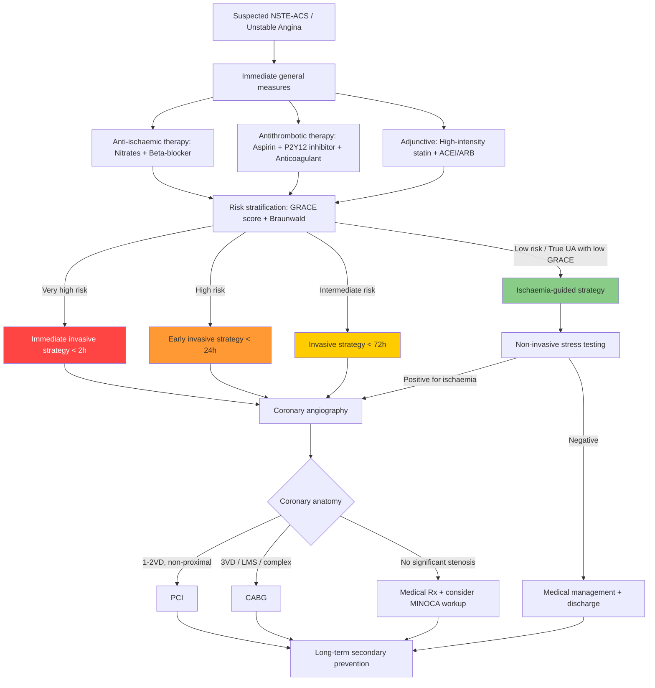

## Management of Unstable Angina

### Guiding Principles — Think From First Principles

The management of UA (and NSTE-ACS broadly) flows logically from the pathophysiology:

1. **The plaque has ruptured and a non-occlusive thrombus is present** → you need to **prevent thrombus propagation** (anticoagulants) and **prevent further platelet aggregation** (antiplatelets)
2. **Myocardial O₂ supply-demand mismatch exists** → you need to **reduce demand** (beta-blockers, nitrates) and **increase supply** (nitrates, revascularisation)
3. **The patient is at risk of progression to MI** → you need to **risk-stratify** and decide whether to pursue an **invasive strategy** (angiography ± revascularisation) or a **conservative/ischaemia-guided strategy**
4. **Long-term**: the atherosclerotic process is ongoing → you need **secondary prevention** to stabilise remaining plaques and reduce future events

---

### Management Algorithm Overview

---

### Phase 1: Acute Management ( < 24 Hours)

#### A. General Measures

***Admit CCU if high-risk (ongoing chest pain, ↓BP, APO, ventricular arrhythmia…)*** [2][3].

| Measure | Detail | Rationale |
|---|---|---|
| ***Bed rest with continuous ECG monitoring*** [2][3][18] | Cardiac monitor, telemetry | Detect arrhythmias early — ischaemic myocardium is electrically unstable (re-entry circuits, triggered activity) |
| **Inform on-call cardiologist** [18] | Early specialist involvement | Access to catheterisation lab and expert risk assessment |
| ***O₂ supplementation*** | Keep SpO₂ > 90%, PaO₂ > 60 mmHg [18] | Only if hypoxaemic — routine O₂ in normoxaemic patients may cause coronary vasoconstriction (hyperoxia → ↑ROS) |
| **Correct precipitating factors** [18] | Anaemia, hypoxia, tachyarrhythmia, thyrotoxicosis, fever | These are "demand" triggers that worsen ischaemia — correcting them may resolve secondary UA |
| **Nil by mouth or soft diet + stool softener** [18] | Ileus common post-MI; Valsalva manoeuvre during straining increases vagal tone | Avoid bearing down → avoid vagal bradycardia or haemodynamic compromise |
| **Explain disease to patient** [18] | Allay anxiety | Anxiety → ↑catecholamines → ↑HR, ↑BP → ↑O₂ demand → worsening ischaemia |

#### B. Analgesia

***Consider IV morphine if nitrates do not relieve pain completely*** [2][3].

| Drug | Dose | Mechanism | Rationale |
|---|---|---|---|
| **IV morphine** | 2–5 mg IV boluses, titrate | μ-opioid receptor agonist → analgesia + anxiolysis + **venodilation** (↓preload) | ***↓distress, ↓adrenergic drive → ↓SVR, BP, risk of ventricular arrhythmias*** [18]. Only use if nitrates insufficient — morphine may ↓absorption of oral P2Y12 inhibitors (delayed gastric emptying) |
| **IV metoclopramide** | 5–10 mg [18] | Dopamine D₂ antagonist → antiemetic + prokinetic | Counteract morphine-induced nausea/vomiting and gastroparesis |

<Callout title="Modern Caveat on Morphine" type="error">
The ESC 2023 guidelines now advise **cautious use of morphine** in NSTE-ACS. Morphine delays gastric absorption of oral P2Y12 inhibitors (ticagrelor, clopidogrel), potentially blunting their antiplatelet effect during the critical first hours. If morphine is needed, consider IV cangrelor (parenteral P2Y12 inhibitor) as a bridge, or use IV paracetamol for milder pain.
</Callout>

---

#### C. Anti-Ischaemic Therapy

The goal is to restore the O₂ supply-demand balance:

##### 1. Nitrates

***Nitrates (long-acting or short acting as prn) in the presence of angina*** [20].

| Formulation | Route / Dose | Use |
|---|---|---|
| **Sublingual GTN** | 0.3–0.6 mg Q5min up to 3 doses [5] | Acute symptom relief |
| **GTN spray** | 1–2 sprays sublingually (acts faster than tablet) | Acute relief — quicker onset |
| **IV GTN infusion** | Start 5–10 μg/min, titrate by 5–10 μg/min Q5–10 min | Ongoing/refractory pain; titrate to pain relief and BP (aim sBP > 90 mmHg) |
| **Oral ISDN/ISMN** | ISDN 10–40 mg TDS or ISMN 20–60 mg BD | Longer-term angina prophylaxis after stabilisation |

**Mechanism:** ***Arteriovenous dilatation by release of NO → (1) ↑supply by dilating coronary arteries and redistributing perfusion from epicardial to endocardial sites; (2) ↓demand by venodilation (major → ↓preload) and arteriodilation (modest → ↓afterload)*** [5].

Why predominantly venodilation? At therapeutic doses, NO preferentially relaxes venous capacitance vessels (larger cross-section, more smooth muscle) → ↓venous return → ↓LV end-diastolic volume → ↓wall stress (by Laplace's law) → ↓O₂ demand. At higher doses, arterial dilation occurs → ↓afterload.

**Contraindications:**
- Hypotension (sBP < 90 mmHg) — will worsen shock
- **Recent PDE-5 inhibitor use** (sildenafil within 24h, tadalafil within 48h) — PDE-5 inhibitors prevent breakdown of cGMP → synergistic vasodilation → profound hypotension
- Severe aortic stenosis or HOCM — preload-dependent conditions; ↓preload → ↓CO → syncope/death
- Right ventricular infarction — RV is preload-dependent; nitrates ↓preload → ↓RV output → ↓↓CO

***Note: should rest sitting while taking nitrates (standing → syncope; supine → ↑VR → ↑preload)*** [5].

**Side effects:** Headache (meningeal vasodilation), flushing, hypotension, reflex tachycardia. **Tolerance** develops with continuous use → need a **nitrate-free interval of 8–10 hours** daily [5].

##### 2. Beta-Blockers

***Beta blockers unless contraindicated*** [20].

| Drug | Dose | Selectivity |
|---|---|---|
| **Metoprolol (Betaloc)** | 25–100 mg BD [5][18] | β₁-selective |
| **Bisoprolol (Zebeta)** | 1.25–10 mg OD | β₁-selective |
| **Carvedilol** | 3.125–25 mg BD | α₁β-non-selective |

**Mechanism:** ***Blocks β receptors → ↓HR, ↓contractility, ↓AVN conduction, ↓ectopic activity*** [5].

Why is this the first-line anti-anginal? Let's think from first principles:
- **↓HR** is the most effective way to reduce myocardial O₂ demand (HR is the single largest determinant). It also **increases diastolic time** → ↑coronary filling time → ↑O₂ supply.
- **↓Contractility** → ↓work → ↓O₂ demand
- **↓Ectopic activity** → antiarrhythmic → ↓risk of VF/VT (the main cause of sudden death in ACS)

***Role: potential prognostic effect renders BB as the 1st line anti-anginal therapy in patients without contraindications*** [5]:
- ***Anti-anginal: clearly effective in ↓exercise-induced angina, ↑exercise tolerance, limit ischaemic episodes***
- ***Prognostic: definitely prognostic in post-MI***

**Contraindications:** ***Bradycardia, AVB, ↓BP, asthma*** [18].
- **NOT contraindicated in:** ***HF (once stabilised), COPD, peripheral vascular disease*** [18]. This is a common exam mistake.
- Why not asthma? β₂-blockade → bronchospasm → potentially fatal bronchospasm. Even "β₁-selective" agents are not 100% selective at higher doses.

**Side effects:** ***Precipitates ADHF, bronchospasm, exacerbates PAD, fatigue, sexual dysfunction, hypoglycaemia (masks warning signs), hyperkalaemia*** [5].

##### 3. Calcium Channel Blockers (CCBs)

***Calcium antagonists (diltiazem or verapamil) if contraindications to beta-blockers and no heart failure*** [20].

***± DHP CCB if persistent discomfort*** after nitrates + BB [18].

| Class | Examples | Main Effects | Use in UA |
|---|---|---|---|
| ***Non-DHP*** | ***Diltiazem, Verapamil*** | Cardiac + vascular: ↓HR, ↓contractility, vasodilation | ***Alternative to BB when BB contraindicated; NEVER combine with BB*** (risk of 3° heart block, severe bradycardia) [5] |
| ***DHP*** | ***Amlodipine, Nifedipine*** | Mainly vascular: vasodilation with little cardiac effect | Add-on to BB if persistent symptoms; safe to combine with BB [5]; ***C/I in severe AS, HOCM*** [5] |

**Mechanism:** ***Block Ca²⁺ channel → ↓inward current during phase 2 of action potential*** [5]. In vascular smooth muscle → vasodilation → ↓afterload + coronary dilation. In cardiac tissue (SAN/AVN) → ↓HR, ↓conduction.

<Callout title="Critical Rule" type="error">
**NEVER combine non-DHP CCB (verapamil/diltiazem) with beta-blocker** — both depress SA node automaticity and AV node conduction → risk of severe bradycardia, heart block, or asystole. DHP CCBs (amlodipine, nifedipine) are safe to combine with BB because they have minimal cardiac conduction effects.
</Callout>

---

#### D. Antithrombotic Therapy

This is the cornerstone of acute UA management — you are fighting the non-occlusive thrombus.

##### 1. Antiplatelet Therapy

###### a. Aspirin (COX-1 inhibitor)

***Aspirin is recommended for all patients without contraindications at a dose of 75–100 mg daily*** [19][20].

| Timing | Dose |
|---|---|
| **Loading dose** | 150–300 mg chewed (for rapid buccal absorption) at first suspicion of ACS |
| **Maintenance** | ***75–100 mg daily, indefinitely*** [20] |

**Mechanism:** Irreversibly acetylates cyclooxygenase-1 (COX-1) in platelets → inhibits thromboxane A₂ (TXA₂) synthesis → TXA₂ is a potent platelet aggregator and vasoconstrictor → its inhibition ↓platelet aggregation. Because platelets are anucleate (no new protein synthesis), the inhibition lasts the lifetime of the platelet (~7–10 days).

**Contraindications:** Active GI bleeding, known aspirin allergy/hypersensitivity, severe bleeding diathesis.
**Side effects:** GI bleeding (mucosal COX-1 inhibition → ↓protective prostaglandins), aspirin-exacerbated respiratory disease (in susceptible individuals: COX-1 inhibition shunts arachidonic acid to leukotriene pathway → bronchoconstriction).

###### b. P2Y12 Receptor Inhibitors

***A P2Y12 receptor inhibitor is recommended in addition to aspirin, and maintained over 12 months unless there are contraindications or an excessive risk of bleeding*** [20]:
- ***Ticagrelor 90 mg b.i.d.***
- ***Clopidogrel 75 mg/d*** [20]

***Clopidogrel 75 mg QD when aspirin is not tolerated because of hypersensitivity or GI intolerance*** [20].

| Drug | Mechanism | Onset | Reversibility | Key Points |
|---|---|---|---|---|
| ***Ticagrelor*** | Direct, reversible P2Y12 antagonist (active drug, no prodrug activation needed) | Rapid (30 min) | Reversible (offset ~3–5 days) | ***Preferred over clopidogrel*** (ESC 2023); superior efficacy in PLATO trial. S/E: dyspnoea (↑adenosine levels — ticagrelor inhibits adenosine reuptake), bradycardia |
| ***Clopidogrel*** | Irreversible P2Y12 antagonist (prodrug — requires hepatic CYP2C19 activation) | Slower (2–6h) | Irreversible (offset ~5–7 days) | ***If ticagrelor not available or contraindicated*** [19][20]. ***Caveat: clopidogrel interacts with PPI → inhibits CYP2C19/3A4 activation of clopidogrel prodrug → treatment failure*** [18]. Also ~30% of Asians are CYP2C19 poor metabolisers → clopidogrel resistance |
| ***Prasugrel*** | Irreversible P2Y12 antagonist (prodrug — faster/more reliable activation than clopidogrel) | Rapid (30 min) | Irreversible (offset ~7 days) | ***After defining coronary anatomy (at PCI)*** [19]. C/I: prior stroke/TIA, age ≥ 75, body weight < 60 kg (↑bleeding risk) |

**Mechanism of P2Y12 inhibition:** ADP released from injured vessel walls and activated platelets binds to the P2Y12 receptor on platelet surface → amplifies platelet activation and aggregation via the GPIIb/IIIa pathway. Blocking P2Y12 prevents this amplification loop → ↓platelet aggregation.

**Dual antiplatelet therapy (DAPT) = aspirin + P2Y12 inhibitor** — this combination attacks two different pathways of platelet activation simultaneously (COX-1/TXA₂ pathway + ADP/P2Y12 pathway), providing synergistic antiplatelet effect.

***The antiplatelet algorithm for NSTE-ACS*** [19]:

| Phase | Recommendation |
|---|---|
| ***First medical contact (pretreatment)*** | ***Ticagrelor*** (preferred) ***or Clopidogrel (if ticagrelor not available or contraindicated)*** [19] |
| ***If PCI performed*** | Continue ticagrelor or prasugrel. ***Prasugrel: after defining coronary anatomy*** [19]. ***Consider cangrelor in patients not pretreated*** (IV P2Y12 inhibitor — rapid onset/offset) [19] |
| ***If CABG needed*** | ***Withdraw ticagrelor for 5 days and prasugrel for 7 days*** [19] (to reduce surgical bleeding). Clopidogrel: withdraw 5 days pre-CABG |
| ***If no revascularisation*** | Continue medical management with DAPT |
| ***Discharge*** | ***Continue prasugrel or ticagrelor for 12 months. If CABG performed: resume ticagrelor as soon as possible*** [19] |

###### c. GPIIb/IIIa Inhibitors (e.g. Abciximab, Eptifibatide, Tirofiban)

***GPIIb/IIIa inhibitor for selected patients only*** [18].

**Mechanism:** GPIIb/IIIa is the **final common pathway** of platelet aggregation — it's the surface receptor that binds fibrinogen to cross-link platelets. Blocking this receptor is the most potent antiplatelet strategy available.

**Indication in NSTE-ACS:** Now very limited — primarily considered:
- During PCI if large thrombus burden or no-reflow
- In very high-risk patients with ongoing ischaemia
- As a bailout during procedural complications

**Not used routinely** — increased bleeding risk with modern potent P2Y12 inhibitors (ticagrelor/prasugrel) has made upfront GPIIb/IIIa inhibitors obsolete in most scenarios.

##### 2. Anticoagulation

***Heparin/LMWH at diagnosis*** [18][2][3].

| Drug | Dose | Mechanism | Key Points |
|---|---|---|---|
| **Enoxaparin (LMWH)** | 1 mg/kg SC BD | Binds antithrombin III → preferentially inhibits Factor Xa (and to lesser extent thrombin/IIa) | **Preferred** over UFH in NSTE-ACS (more predictable pharmacokinetics, no need for aPTT monitoring, superior efficacy in SYNERGY/ExTRACT trials). Dose-adjust in renal impairment (CrCl < 30: 1 mg/kg OD) |
| **Unfractionated heparin (UFH)** | 60 U/kg bolus (max 4000 U) then 12 U/kg/h infusion, titrate to aPTT 1.5–2.5× control | Binds antithrombin III → inhibits thrombin (IIa) and Factor Xa equally | Preferred when **PCI planned imminently** (easier to monitor/reverse with protamine) or in **severe renal failure** |
| **Fondaparinux** | 2.5 mg SC OD | Selective Factor Xa inhibitor via antithrombin III | Lowest bleeding risk; preferred if conservative strategy planned. **Need supplemental UFH bolus if patient goes to PCI** (risk of catheter thrombosis) |

**Why anticoagulation in addition to antiplatelets?** The thrombus in ACS has both a **platelet component** (white thrombus) and a **fibrin component** (coagulation cascade). Antiplatelets attack the platelet component; anticoagulants attack the coagulation cascade component. Together they provide comprehensive antithrombotic coverage.

**Duration:** Anticoagulation is maintained **during the acute hospitalisation phase** and discontinued after revascularisation or discharge (unless otherwise indicated, e.g. AF requiring long-term anticoagulation).

---

#### E. Other Acute Medications

##### 1. High-Intensity Statin

***High-intensity statin always (≤24h)*** [18].

| Drug | Dose |
|---|---|
| **Atorvastatin** | 80 mg daily |
| **Rosuvastatin** | 20–40 mg daily |

**Mechanism:** HMG-CoA reductase inhibitor → ↓hepatic cholesterol synthesis → ↑hepatic LDL receptor expression → ↑LDL clearance from blood → ↓LDL-C.

**Why start immediately, regardless of cholesterol levels?** Beyond lipid-lowering, statins have **pleiotropic effects** that are critical in ACS:
- **Plaque stabilisation:** ↓inflammation within plaque, ↓macrophage activity, ↑fibrous cap thickness
- **Anti-inflammatory:** ↓CRP, ↓cytokines
- **Endothelial function:** ↑NO bioavailability → vasodilation
- **Antithrombotic:** ↓tissue factor expression, ↓platelet reactivity
- These effects occur within hours and are independent of LDL reduction

***Aim at LDL < 1.8 mmol/L and/or > 50% reduction*** [5].

##### 2. ACEI/ARB

***ACEI for patients with CHF, LV dysfunction (EF < 40%), hypertension, or diabetes*** [20].

| Drug | Example Dose |
|---|---|
| **Ramipril** | 2.5–10 mg OD |
| **Perindopril** | 2–8 mg OD |
| **Valsartan (ARB)** | 80–320 mg OD (if ACEI-intolerant) |

**Mechanism:** ACEI inhibits angiotensin-converting enzyme → ↓angiotensin II (potent vasoconstrictor + promotes aldosterone release + promotes cardiac remodelling) and ↑bradykinin (vasodilator). Net effects: ↓afterload, ↓preload, ↓cardiac remodelling, ↓fibrosis.

**Why in ACS?** Post-MI, angiotensin II drives adverse LV remodelling (dilatation, fibrosis, hypertrophy) → heart failure. ACEI/ARB prevent this. Particular benefit when LVEF < 40% or clinical heart failure.

***β-blockers, ACEI/ARB always (≤24h)*** [18].

##### 3. Mineralocorticoid Receptor Antagonist (MRA)

***MRA if LVEF ≤40% + HF/DM*** [18].

| Drug | Dose |
|---|---|
| **Eplerenone** | 25–50 mg OD |
| **Spironolactone** | 25–50 mg OD |

**Mechanism:** Blocks aldosterone receptor → ↓Na⁺/H₂O retention, ↓K⁺ loss, and critically → **↓cardiac fibrosis** (aldosterone promotes myocardial collagen deposition). EPHESUS/RALES trials showed mortality benefit in post-MI heart failure.

---

#### F. Reperfusion / Invasive Strategy in NSTE-ACS

This is where UA management **diverges** from STEMI:

***No benefit if done routinely in NSTE-ACS. Thrombolysis may even be harmful (not thrombotic occlusion → no benefit at all)*** [18].

<Callout title="CRITICAL: No Thrombolysis in UA/NSTEMI" type="error">
Unlike STEMI where the artery is completely occluded by a fibrin-rich "red" thrombus (amenable to fibrinolysis), UA/NSTEMI has a platelet-rich "white" thrombus that is non-occlusive. Thrombolysis is ineffective against platelet-rich thrombi and may paradoxically worsen the situation by:
- Activating platelets (thrombin released during fibrinolysis is a potent platelet activator)
- Causing bleeding without therapeutic benefit

**NEVER give thrombolysis for UA or NSTEMI.**
</Callout>

##### Invasive vs Ischaemia-Guided Strategy

***Two main strategies (AHA/ACC)*** [18]:
- ***Invasive strategy: invasive coronary angiography in ≤2h (immediate), ≤24h (early), 25–72h (delayed)***
- ***Ischaemia-driven strategy: invasive coronary angiography only if refractory angina at risk of failing medical therapy; objective evidence of ischaemia on non-invasive stress test; clinical indicators of very high prognostic risk score*** [18]

The choice depends on **risk stratification** [1][15][18]:

| Risk Level | Criteria | Timing | Strategy |
|---|---|---|---|
| ***Very high risk*** | ***Haemodynamic instability/cardiogenic shock; acute HF from ongoing ischaemia; life-threatening arrhythmias/cardiac arrest; mechanical complications; recurrent dynamic ECG changes*** [15] | ***Immediate ( < 2h)*** | Invasive |
| ***High risk*** | ***Elevated biomarkers; GRACE > 140; transient ST elevation; dynamic ST/T changes*** [15] | ***Early ( < 24h)*** | Invasive |
| **Intermediate risk** | GRACE 109–140; diabetes; renal insufficiency; LVEF < 40% | < 72h | Invasive |
| **Low risk** | No high/very-high risk features; low clinical suspicion | Selective | ***Non-invasive stress testing for low/intermediate risk patients free of ischaemia*** [18]; proceed to angiography only if positive |

For **true UA** (troponin-negative, no dynamic ECG changes, low GRACE score):
- Often falls into the **low-risk** category
- **Ischaemia-guided strategy** is appropriate
- Can undergo non-invasive stress testing pre-discharge
- Angiography only if stress test positive

---

### Phase 2: Revascularisation

When angiography is performed, the choice between PCI and CABG depends on coronary anatomy:

| Anatomy | Preferred Strategy | Rationale |
|---|---|---|
| ***Simple vascular anatomy (1VD, 2VD), no proximal disease, high surgical risk*** | ***PCI*** [5] | Less invasive; faster recovery; suitable for focal lesions |
| ***3VD / LMS disease / complex anatomy*** | ***CABG*** | Survival benefit in 3VD and LMS disease (SYNTAX trial); complete revascularisation more achievable with CABG |
| **Multivessel disease with diabetes** | **CABG preferred** | FREEDOM trial showed mortality benefit of CABG over PCI in diabetics with multivessel disease |
| **No significant stenosis** | **Medical management** ± MINOCA workup | Consider coronary vasospasm, microvascular dysfunction, Takotsubo |

***PCI only for selected high-risk individuals*** in NSTE-ACS [18]. The decision should involve a **Heart Team** approach (cardiologist + cardiac surgeon).

***Coronary angiography findings may require intravascular imaging (IVUS or OCT) for ambiguous lesions*** [16].

---

### Phase 3: Long-Term Management / Secondary Prevention

***Risk factor modulation + long-term drug therapy*** [18][5][20]:

#### A. Lifestyle and Risk Factor Modification

| Measure | Detail | Evidence |
|---|---|---|
| ***Smoking cessation*** | ***Drastic ↓MI risk after just 1 year; smoking doubles 5-year mortality*** [18] | Single most effective lifestyle intervention |
| ***Regular exercise*** | Cardiac rehabilitation; 150 min/week moderate-intensity aerobic exercise | ***Stop smoking, regular exercise (but not beyond point of discomfort)*** [5] |
| ***Diet*** | Mediterranean diet; ↓saturated fat, ↑fruits/vegetables, ↑omega-3 | PREDIMED trial: 30% ↓cardiovascular events |
| ***Weight management*** | BMI target < 25 kg/m² | |
| ***HTN control*** | ***Aim < 140/90, use BB if indicated*** [5] | |
| ***DM control*** | ***Aim HbA1c < 7%, consider SGLT2i or GLP-1a*** [5] | SGLT2i/GLP-1a have CV mortality benefit independent of glucose control |
| ***Lipid control*** | ***↓LDL to < 1.8 mmol/L with lifestyle and drug*** [5] | High-intensity statin ± ezetimibe ± PCSK9 inhibitor |

#### B. Long-Term Drug Therapy

##### ***Dual Antiplatelet Therapy (DAPT) = Aspirin + P2Y12 Inhibitor*** [18]

| Drug | Duration | Dose |
|---|---|---|
| ***Aspirin*** | ***Indefinitely*** [18] | ***81–325 mg daily or Cartia 100 mg daily*** [18] |
| ***P2Y12 inhibitor*** | ***≥12 months if any stent used (mandatory); 1–12 months even if no PCI done*** [18] | ***Clopidogrel 75 mg QD, prasugrel 10 mg QD, or ticagrelor 90 mg BD*** [18] |

After 12 months, DAPT can be de-escalated to aspirin monotherapy in most patients. In selected high-risk patients (e.g. DM, recurrent events, complex PCI), extended DAPT ( > 12 months) or low-dose rivaroxaban (COMPASS trial) may be considered.

##### ***Beta-Blockers*** [18]

***Given to all stable patients if no contraindication*** [18]:
- ***Betaloc 25–100 mg BD*** [18]
- ***C/I: bradycardia, AVB, ↓BP, asthma***
- ***NOT C/I in HF, COPD, peripheral vascular disease*** [18]

##### ***ACEI/ARB*** [18]

Indicated for patients with: ***LVEF < 40%, CHF, HTN, DM*** [20].
- Use either one (***combination associated with ↑adverse events without ↑benefits***) [5]

##### ***High-Intensity Statin*** — indefinitely [18]

***High dose statins for aggressive ↓lipid (regardless of serum cholesterol level) → ↓mortality*** [18].
- If LDL target not achieved with maximally tolerated statin → add **ezetimibe** → if still not at target → add **PCSK9 inhibitor** (evolocumab, alirocumab)

##### ***MRA*** if ***LVEF ≤40% + HF/DM*** [18]

#### C. Mobilisation and Rehabilitation

***Takes 4–6 weeks to replace necrotic tissue by fibrotic tissues → restrict physical activities until then, offer cardiovascular rehabilitation. Usually: mobilize in 2 days, discharge in 3–5 days, resume work in 4–6 weeks*** [18].

For true UA (no necrosis), mobilisation and discharge are often earlier.

---

### Summary Table: The "MONA-B" Plus Framework for Acute UA/NSTE-ACS

The classic mnemonic **MONA** (Morphine, Oxygen, Nitrates, Aspirin) is a useful memory aid but outdated as a rigid protocol. The modern approach adds Beta-blockers, P2Y12 inhibitors, anticoagulation, and statin:

| Component | Agent | When |
|---|---|---|
| **M** — Morphine | IV morphine ± metoclopramide | If nitrates insufficient; use cautiously |
| **O** — Oxygen | Supplemental O₂ | Only if SpO₂ < 90% |
| **N** — Nitrates | SL GTN → IV GTN if ongoing | Immediate; first-line symptom relief |
| **A** — Aspirin | 150–300 mg chewed → 75–100 mg OD | At first suspicion; indefinitely |
| **B** — Beta-blocker | Metoprolol/bisoprolol | Within 24h if no C/I; indefinitely |
| **+** P2Y12 inhibitor | Ticagrelor (preferred) or clopidogrel | At diagnosis; 12 months |
| **+** Anticoagulant | Enoxaparin or UFH or fondaparinux | At diagnosis; during hospitalisation |
| **+** Statin | Atorvastatin 80 mg or rosuvastatin 40 mg | Within 24h; indefinitely |
| **+** ACEI/ARB | Ramipril/perindopril | Within 24h if LVEF < 40%/HF/HTN/DM |

---

<Callout title="High Yield Summary">

1. **No thrombolysis in UA/NSTEMI** — platelet-rich thrombus is not amenable to fibrinolysis; may worsen outcome
2. **Acute management = Anti-ischaemic + Antithrombotic + Adjunctive**
   - Anti-ischaemic: **Nitrates** (↓preload, coronary dilation) + **Beta-blocker** (↓HR, ↓contractility) ± **CCB**
   - Antithrombotic: **DAPT** (aspirin + ticagrelor/clopidogrel) + **anticoagulant** (enoxaparin/UFH/fondaparinux)
   - Adjunctive: **high-intensity statin** + **ACEI/ARB** (if EF < 40%/HF/HTN/DM)
3. ***Risk stratification (GRACE score) determines invasive strategy timing***: very high risk < 2h; high risk < 24h; intermediate < 72h; low risk = ischaemia-guided
4. ***Ticagrelor preferred over clopidogrel*** in NSTE-ACS; ***prasugrel after defining coronary anatomy at PCI***
5. ***Never combine non-DHP CCB with beta-blocker*** (risk of heart block)
6. ***Clopidogrel + PPI interaction*** → inhibits CYP2C19 activation → treatment failure; use pantoprazole (least interaction) if PPI needed
7. **Long-term secondary prevention**: aspirin indefinitely, P2Y12 for 12 months, beta-blocker, ACEI/ARB, high-intensity statin, risk factor modification, cardiac rehabilitation
8. ***PCI for simple anatomy (1-2VD); CABG for 3VD/LMS/complex disease***
</Callout>

---

<ActiveRecallQuiz
  title="Active Recall - Management of Unstable Angina"
  items={[
    {
      question: "Why is thrombolysis contraindicated in UA/NSTEMI but indicated in STEMI?",
      markscheme: "In STEMI, a fibrin-rich red thrombus completely occludes the artery, and fibrinolysis breaks down fibrin to restore flow. In UA/NSTEMI, the thrombus is platelet-rich (white), non-occlusive, and not amenable to fibrinolysis. Thrombolysis may paradoxically worsen the situation by releasing thrombin (which activates platelets) and causing bleeding without benefit.",
    },
    {
      question: "List the components of DAPT and explain why dual pathway inhibition is needed.",
      markscheme: "DAPT = aspirin (COX-1 inhibitor, blocks TXA2) + P2Y12 inhibitor (ticagrelor/clopidogrel/prasugrel, blocks ADP-mediated platelet activation). Dual pathway needed because platelets can be activated through multiple pathways: TXA2 pathway and ADP/P2Y12 pathway. Blocking both provides synergistic inhibition of the platelet component of the thrombus.",
    },
    {
      question: "Why is ticagrelor preferred over clopidogrel in NSTE-ACS, and what are two important clopidogrel limitations?",
      markscheme: "Ticagrelor: direct-acting, reversible, rapid onset, no prodrug activation needed, superior efficacy in PLATO trial. Clopidogrel limitations: (1) requires CYP2C19 hepatic activation (30% of Asians are poor metabolisers causing resistance); (2) interacts with PPIs which inhibit CYP2C19, reducing clopidogrel activation and causing treatment failure.",
    },
    {
      question: "A patient with suspected UA has a GRACE score of 155. What is the recommended timing for coronary angiography?",
      markscheme: "GRACE >140 = high risk. Recommended early invasive strategy with coronary angiography within 24 hours. Also requires full antithrombotic therapy (DAPT + anticoagulation) and anti-ischaemic therapy while awaiting angiography.",
    },
    {
      question: "Why should nitrates NOT be given to a patient with right ventricular infarction?",
      markscheme: "The RV is highly preload-dependent. Nitrates cause venodilation which reduces venous return (preload). In RV infarction, the dysfunctional RV cannot generate adequate output without sufficient preload. Giving nitrates would reduce preload further, causing severe hypotension and potentially cardiogenic shock. Treatment of RV infarction instead requires volume loading.",
    },
    {
      question: "Outline the five pillars of long-term secondary prevention drug therapy after UA/NSTE-ACS.",
      markscheme: "(1) Aspirin indefinitely; (2) P2Y12 inhibitor for at least 12 months; (3) Beta-blocker indefinitely if no contraindications; (4) ACEI/ARB if LVEF <40%, HF, HTN, or DM; (5) High-intensity statin indefinitely targeting LDL <1.8 mmol/L. Also: MRA if LVEF <=40% + HF/DM.",
    },
  ]}
/>

---

## References

[1] Lecture slides: GC 028. Accelerating chest pain_Acute coronary (1).pdf (p32)
[2] Senior notes: Ryan Ho Cardiology.pdf (p58)
[3] Senior notes: Ryan Ho Fundamentals.pdf (p203)
[5] Senior notes: Ryan Ho Cardiology.pdf (p115, p120, p122, p123, p126)
[15] Lecture slides: GC 028. Accelerating chest pain_Acute coronary (1).pdf (p33)
[16] Lecture slides: GC 028. Accelerating chest pain_Acute coronary (1).pdf (p50)
[18] Senior notes: Ryan Ho Cardiology.pdf (p132, p136, p138, p139, p144)
[19] Lecture slides: GC 028. Accelerating chest pain_Acute coronary (1).pdf (p40)
[20] Lecture slides: GC 028. Accelerating chest pain_Acute coronary (1).pdf (p54, p55)
