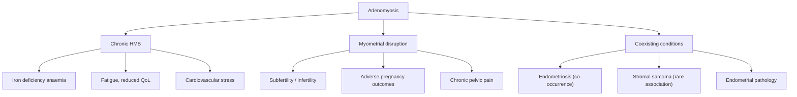

## Complications of Adenomyosis

Adenomyosis is a **benign** condition — it does not undergo malignant transformation per se. However, it causes significant morbidity through several important complications. Let's think about these systematically, categorising them by mechanism.

---

### Conceptual Framework

The complications of adenomyosis arise from three pathological processes:

1. **Chronic heavy menstrual bleeding** → haematological consequences
2. **The disease process itself** (ectopic endometrial glands in myometrium) → structural and functional uterine consequences
3. **Coexisting conditions and associations** → related pathology

---

### 1. Iron Deficiency Anaemia

**The most common complication.**

***Heavy menstrual bleeding (60%): due to increased endometrial surface area of the enlarged uterus*** [1].

**Pathophysiological chain:**

Adenomyosis → myometrial hypertrophy → diffuse uterine enlargement → increased endometrial surface area → more endometrium to shed per cycle → heavier menstrual blood loss → chronic iron loss exceeds dietary iron absorption → depleted iron stores (low ferritin) → reduced haemoglobin synthesis → **microcytic hypochromic anaemia**.

Additionally, the adenomyotic myometrium has impaired contractility (the normal "living ligature" mechanism where myometrial contraction compresses spiral arterioles after endometrial shedding is disrupted) → prolonged bleeding per cycle → further iron loss.

**Clinical consequences of anaemia:**
- **Fatigue and lethargy** — reduced oxygen-carrying capacity → tissues receive less oxygen → compensatory mechanisms (increased heart rate, increased cardiac output) are insufficient at rest.
- **Exertional dyspnoea** — exercise increases oxygen demand beyond the diminished delivery capacity.
- **Palpitations and tachycardia** — compensatory increase in cardiac output.
- **Pallor** — reduced haemoglobin in dermal and mucosal capillaries.
- **Koilonychia, glossitis, angular stomatitis** — iron deficiency affects rapidly dividing cells (nails, tongue epithelium, oral mucosa).
- **Pica** (craving non-food substances like ice, clay) — mechanism poorly understood but well-documented in iron deficiency.
- **Reduced work productivity and quality of life** — the "hidden" burden of adenomyosis.

> ***Pallor due to menorrhagia*** [14] is listed as a key finding in the evaluation of pelvic masses causing HMB. Always check conjunctival pallor and nail beds.

**Management:**
- ***Iron supplementation: oral ferrous sulphate 300 mg TDS × 6 months if Hb < 10 g/dL*** [11].
- Treat the underlying cause (reduce HMB with hormonal therapy or surgery).
- In severe anaemia (Hb < 7 g/dL or symptomatic): consider IV iron infusion or blood transfusion.

---

### 2. Subfertility and Infertility

***Infertility: controversial*** [1].

This is one of the most actively debated areas in reproductive medicine. While the association between adenomyosis and subfertility is increasingly recognised, the causal relationship is not definitively established. Let's examine the proposed mechanisms:

#### Mechanism 1: Disrupted Junctional Zone Peristalsis
- The normal junctional zone (inner myometrium) undergoes coordinated peristaltic contractions that facilitate **sperm transport** from the cervix toward the fallopian tubes.
- In adenomyosis, the JZ is thickened, infiltrated with ectopic glands, and hyperplastic → **dysperistalsis** (disorganised contractions) → impaired sperm transport → reduced fertilisation.

#### Mechanism 2: Impaired Endometrial Receptivity
- The endometrium overlying adenomyotic foci may have altered gene expression, including:
  - Reduced expression of implantation markers (e.g., HOXA10, LIF, integrin αvβ3).
  - Altered local immune milieu (increased pro-inflammatory cytokines).
  - Defective decidualisation.
- This creates a **hostile endometrial environment** for embryo implantation.

#### Mechanism 3: Chronic Inflammatory Milieu
- The ectopic endometrial glands within the myometrium undergo cyclical bleeding → chronic low-grade inflammation → release of prostaglandins, cytokines (IL-6, TNF-α), and reactive oxygen species.
- These inflammatory mediators diffuse into the endometrial cavity → impair embryo implantation and early embryo development.

#### Mechanism 4: Altered Uterine Contractility
- The hypertrophied, adenomyotic myometrium may have increased **uterine contractility** → premature expulsion of the embryo before implantation can be established.

#### Clinical Relevance
- Adenomyosis is increasingly recognised as a factor in **recurrent implantation failure** after IVF.
- Women with adenomyosis undergoing IVF have lower clinical pregnancy rates, lower live birth rates, and higher miscarriage rates compared to controls.
- **Pre-treatment with GnRH agonists** (2–3 months before IVF) to suppress adenomyotic activity and reduce uterine volume may improve IVF outcomes — this is current best practice.

---

### 3. Adverse Pregnancy Outcomes

When women with adenomyosis do conceive (spontaneously or via ART), they face increased obstetric risks. The mechanisms are directly related to the structural and functional abnormalities of the adenomyotic myometrium:

| Complication | Mechanism |
|---|---|
| **Miscarriage** (increased risk) | Impaired decidualisation of the endometrium overlying adenomyotic foci → defective trophoblast invasion → placental insufficiency → early pregnancy loss. Analogous to how ***submucosal fibroids adversely affect implantation and placentation*** [14]. |
| **Preterm labour** (increased risk) | Chronic inflammation in the myometrium → increased prostaglandin production → premature uterine contractions → preterm birth. The ectopic glands continue to respond to hormones during pregnancy, causing local irritation. |
| **Preterm premature rupture of membranes (PPROM)** | Inflammatory mediators from the adenomyotic myometrium may weaken the fetal membranes overlying affected areas. |
| **Small for gestational age (SGA) / Fetal growth restriction (FGR)** | Impaired uteroplacental blood flow through the adenomyotic myometrium → reduced nutrient and oxygen delivery to the fetus. |
| **Pre-eclampsia** (increased risk) | Defective deep trophoblast invasion into the spiral arteries (adenomyotic tissue disrupts normal spiral artery remodelling) → uteroplacental insufficiency → the shared pathway to pre-eclampsia. |
| **Placenta praevia** (increased risk) | The altered endomyometrial junction may affect normal placental implantation site selection → increased chance of low-lying placenta. |
| **Placenta accreta spectrum (PAS)** | Disrupted endomyometrial junction → absence of normal decidua basalis → abnormally deep trophoblast invasion into the myometrium. This is the same mechanism as PAS after caesarean section — the boundary between endometrium and myometrium is compromised. |
| **Postpartum haemorrhage (PPH)** | Adenomyotic myometrium has ***reduced force and coordination of uterine contractions → increased risk of uterine atony*** [14]. The infiltrating glands disrupt the smooth muscle's ability to contract uniformly around placental-site vessels after delivery. |
| **Uterine rupture** (rare but serious) | Particularly after adenomyomectomy — the surgically weakened myometrial wall may rupture during labour. Also theoretically possible in severe adenomyosis where the myometrium is extensively replaced by glandular tissue. |

<Callout title="Adenomyosis and PPH — The Mechanism" type="idea">
The mechanism is identical to why fibroids cause PPH: ***decreased force and coordination of uterine contractions → increased risk of atony*** [14]. In adenomyosis, the ectopic glandular tissue interspersed within the myometrium physically disrupts the "woven basket" of smooth muscle fibres that must contract circumferentially to compress the open blood vessels at the placental site. The result is uterine atony → PPH.
</Callout>

---

### 4. Chronic Pelvic Pain and Reduced Quality of Life

***Dysmenorrhoea (25%): due to bleeding and swelling of endometrial islands confined by myometrium*** [1].

Over time, the cyclical pain of adenomyosis can evolve into **chronic pelvic pain** through:

1. **Peripheral sensitisation** — repeated nociceptive input from monthly bleeding within the myometrium → upregulation of pain receptors in the myometrium → lower pain threshold → pain at progressively lower stimuli.
2. **Central sensitisation** — chronic nociceptive input to the spinal cord → wind-up phenomenon → the CNS amplifies pain signals → even non-painful stimuli (e.g., bladder filling, bowel distension) are perceived as painful (visceral cross-sensitisation).
3. **Psychosocial impact** — chronic pain leads to anxiety, depression, sleep disturbance, impaired sexual function, and reduced work capacity. This creates a vicious cycle where psychological distress lowers pain thresholds further.

**Clinical features of chronic pelvic pain in adenomyosis:**
- Non-cyclical dull aching pelvic pain (superimposed on cyclical dysmenorrhoea).
- May have bladder and bowel symptoms (due to visceral cross-sensitisation, not direct invasion).
- ***Generally NOT associated with dyspareunia*** [1] — but deep pelvic pain may be triggered by intercourse in some cases.

---

### 5. Association with Endometriosis

***Pathogenetically distinct from endometriosis although it commonly co-occurs with endometriosis*** [1].

- Coexistence rate: up to 70–80% of women with adenomyosis also have endometriosis.
- Shared risk factors: prolonged oestrogen exposure, retrograde menstruation, possible common stem cell origins.
- The clinical significance is that when adenomyosis is diagnosed, you should **actively look for endometriosis** (and vice versa), as coexisting endometriosis will add:
  - **Dyspareunia** (which adenomyosis alone does not typically cause).
  - **Additional infertility burden**.
  - **Ovarian endometriomas** ("chocolate cysts").
  - **Deep infiltrating endometriosis** (bowel, bladder, uterosacral ligaments).

---

### 6. Association with Uterine Sarcoma (Rare but Important)

***Stromal sarcomas can be found in association with adenomyosis and endometriosis*** [4].

- **Endometrial stromal sarcoma (ESS)** is a rare malignancy that ***arises from the stroma of the endometrium*** [4].
- It can develop within foci of adenomyosis — the ectopic endometrial stroma undergoes malignant transformation.
- ***Stromal sarcomas tend to present in a younger age group (45–50y)*** [4] — overlapping with the peak age of adenomyosis.
- ***Usually presents with AUB ± foul-smelling vaginal discharge and a uterine mass*** [4].

**Red flags that should raise suspicion for sarcoma in a woman with known adenomyosis:**
- Rapidly increasing uterine size (especially postmenopausal).
- New-onset or worsening persistent (non-cyclical) pain.
- Postmenopausal bleeding in a woman with previously stable adenomyosis.
- Heterogeneous, necrotic-appearing lesion on imaging.
- Foul-smelling vaginal discharge.

<Callout title="Adenomyosis Does NOT Undergo Malignant Transformation — But..." type="error">
Adenomyosis itself is benign and the ectopic endometrial glands do not become malignant. However, the **stromal component** of the ectopic endometrial tissue can (rarely) give rise to endometrial stromal sarcoma. This is not "transformation" of adenomyosis but rather a de novo malignancy arising in the ectopic stromal cells. The clinical implication: a rapidly changing uterus in a woman with known adenomyosis warrants re-evaluation and should not be dismissed as "just adenomyosis getting worse."
</Callout>

---

### 7. Complications of Treatment

Important to consider iatrogenic complications from the treatments used for adenomyosis:

| Treatment | Potential Complications |
|---|---|
| **LNG-IUS (Mirena)** | Expulsion (higher risk in enlarged/distorted cavity), perforation (rare), irregular bleeding (first 3–6 months), hormonal side effects (acne, mood changes), infection |
| **GnRH agonists** | ***Significant climacteric symptoms*** [11]: hot flushes, vaginal dryness, mood swings, **bone density loss** (critical if > 6 months without add-back), initial flare effect (transient worsening of symptoms in first 1–2 weeks) |
| **COCP** | ***CVS risk: increased risk of MI, stroke, thromboembolism*** [12]. Breakthrough bleeding. |
| **Hysterectomy** | Surgical risks: bleeding, infection, visceral injury (bladder, ureter, bowel), VTE, anaesthetic complications. Long-term: surgical menopause (if ovaries removed), vaginal cuff dehiscence (rare), pelvic floor changes |
| ***UAE*** | ***High rate of additional intervention for persistent or recurrent symptoms*** [1]. Post-embolisation syndrome (pain, fever). Ovarian failure (especially > 45y). Uterine necrosis/infection (rare). Non-target embolisation. |
| **Adenomyomectomy** | Uterine rupture in subsequent pregnancy (weakened wall). Incomplete excision → symptom recurrence (30–40% at 5 years). Adhesion formation. |
| ***HIFU/RFA*** | ***Investigational*** [1]. Skin burns (HIFU), thermal injury to adjacent structures, incomplete ablation, recurrence. |

---

### 8. Impact on Quality of Life

Often underestimated but arguably the most significant "complication" from the patient's perspective:

| Domain | Impact | Mechanism |
|---|---|---|
| **Physical functioning** | Fatigue, exercise intolerance | Anaemia + chronic pain |
| **Work productivity** | Absenteeism, presenteeism | Monthly debilitating pain and heavy bleeding |
| **Sexual function** | Reduced desire, avoidance of intercourse | Pain, heavy bleeding, psychological burden |
| **Mental health** | Anxiety, depression, frustration | Chronic pain, unpredictable bleeding, fertility concerns |
| **Social functioning** | Avoidance of activities, social isolation | Fear of heavy bleeding episodes, need for frequent pad changes |
| **Financial burden** | Healthcare costs, time off work | Repeated consultations, medications, potential surgery |

---

### Summary of Complications

| Category | Complication | Pathophysiological Basis |
|---|---|---|
| **Haematological** | Iron deficiency anaemia | Chronic HMB → iron depletion |
| **Reproductive** | Subfertility / infertility | JZ dysperistalsis, impaired endometrial receptivity, inflammation, altered contractility |
| | Miscarriage | Defective decidualisation and trophoblast invasion |
| | Preterm labour | Chronic myometrial inflammation → prostaglandins → premature contractions |
| | FGR / SGA | Impaired uteroplacental blood flow |
| | Pre-eclampsia | Defective spiral artery remodelling |
| | Placenta accreta spectrum | Disrupted endomyometrial junction → abnormal trophoblast invasion |
| | PPH | Impaired myometrial contractility → uterine atony |
| **Pain** | Chronic pelvic pain | Peripheral and central sensitisation from repeated nociceptive input |
| **Associations** | Coexisting endometriosis | Shared risk factors, common co-occurrence |
| | Endometrial stromal sarcoma (rare) | Malignancy arising in ectopic endometrial stroma within adenomyotic foci |
| **Iatrogenic** | Treatment complications | See table above for each modality |
| **Psychosocial** | Reduced QoL, depression, anxiety | Chronic pain + HMB + fertility concerns |

---

> **High Yield Complications Points:**
> - **Anaemia** is the most common complication — always check Hb and ferritin.
> - **Infertility** is controversial but increasingly recognised; adenomyosis is a factor in recurrent IVF implantation failure.
> - **Adverse pregnancy outcomes**: miscarriage, preterm labour, FGR, pre-eclampsia, PAS, PPH — all related to disrupted myometrial/endometrial function.
> - **Stromal sarcoma** can arise in association with adenomyosis — red flag if rapid uterine growth.
> - **Treatment complications**: GnRH agonists → bone loss; UAE → high re-intervention rate; COCP → VTE risk.

<Callout title="High Yield Summary">

**Key Complications of Adenomyosis:**

1. **Iron deficiency anaemia** — from chronic HMB due to increased endometrial surface area and impaired myometrial contractility. Treat with iron supplementation (FeSO4 300 mg TDS × 6 months if Hb < 10).

2. **Subfertility** — controversial but increasingly recognised. Mechanisms: JZ dysperistalsis, impaired endometrial receptivity, chronic inflammation, altered contractility. Consider GnRH agonist pre-treatment before IVF.

3. **Adverse pregnancy outcomes** — miscarriage, preterm labour, FGR, pre-eclampsia, placenta accreta spectrum, PPH (from uterine atony due to disrupted myometrial contraction).

4. **Chronic pelvic pain** — from peripheral and central sensitisation due to repeated cyclical bleeding within myometrium.

5. **Association with endometriosis** — co-occurs frequently; look for both when one is found.

6. **Association with stromal sarcoma** — rare but important. Red flags: rapidly growing uterus, postmenopausal bleeding, atypical symptoms.

7. **Treatment-related complications** — GnRH agonists: bone loss, menopausal symptoms. UAE: high re-intervention rate. Hysterectomy: surgical risks. Adenomyomectomy: uterine rupture risk in future pregnancy.

</Callout>

---

<ActiveRecallQuiz
  title="Active Recall - Complications of Adenomyosis"
  items={[
    {
      question: "Explain the pathophysiological chain from adenomyosis to iron deficiency anaemia.",
      markscheme: "Adenomyosis causes myometrial hypertrophy leading to diffuse uterine enlargement, which increases endometrial surface area causing heavier menstrual bleeding. Additionally, impaired myometrial contractility reduces haemostasis. Chronic blood loss exceeds dietary iron absorption, depleting iron stores (low ferritin), leading to reduced haemoglobin synthesis and microcytic hypochromic anaemia."
    },
    {
      question: "List 4 mechanisms by which adenomyosis may cause subfertility.",
      markscheme: "1. Disrupted junctional zone peristalsis impairing sperm transport. 2. Impaired endometrial receptivity with altered implantation markers. 3. Chronic inflammatory milieu (prostaglandins, cytokines, ROS) hostile to embryo implantation. 4. Altered uterine contractility causing premature embryo expulsion."
    },
    {
      question: "Name 4 adverse pregnancy outcomes associated with adenomyosis and explain the mechanism for one.",
      markscheme: "Miscarriage, preterm labour, FGR/SGA, pre-eclampsia, placenta accreta spectrum, PPH, uterine rupture (after adenomyomectomy). Example mechanism for PPH: adenomyotic myometrium has reduced force and coordination of uterine contractions due to ectopic glands disrupting smooth muscle fibres, leading to uterine atony and failure to compress placental-site vessels."
    },
    {
      question: "What rare malignancy can be found in association with adenomyosis, and what are the red flags?",
      markscheme: "Endometrial stromal sarcoma - arises from the stromal component of ectopic endometrial tissue within adenomyotic foci. Red flags: rapidly increasing uterine size (especially postmenopausal), new-onset persistent non-cyclical pain, postmenopausal bleeding, foul-smelling vaginal discharge, heterogeneous necrotic lesion on imaging."
    },
    {
      question: "Why does adenomyosis increase the risk of placenta accreta spectrum disorders?",
      markscheme: "Adenomyosis disrupts the endomyometrial junction, leading to absence or thinning of the normal decidua basalis. Without this protective barrier, trophoblast invasion extends abnormally deep into the myometrium (accreta), through the myometrium (increta), or beyond the serosa (percreta)."
    }
  ]}
/>

---

## References

[1] Senior notes: Adrian Lui Gynecology Notes.pdf (Section 2.3.3 Adenomyosis, p. 50–51)
[4] Senior notes: Adrian Lui Gynecology Notes.pdf (Section 4.3.5 Uterine Sarcoma, p. 105)
[11] Senior notes: Adrian Lui Gynecology Notes.pdf (Section on Fibroids — Medical and Surgical Treatment, p. 91–92)
[12] Senior notes: Adrian Lui Gynecology Notes.pdf (Section on AUB/COCP management, p. 15)
[14] Senior notes: Adrian Lui Gynecology Notes.pdf (Section on Pelvic Mass Evaluation and Fibroid Clinical Features, p. 70, 90)
