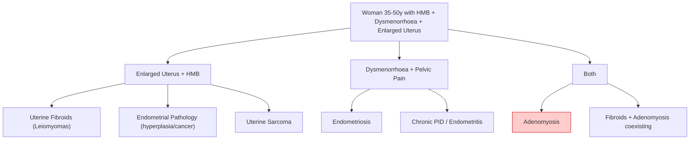
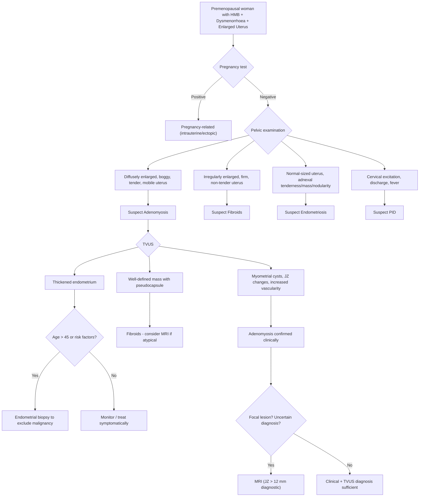

## Differential Diagnosis of Adenomyosis

When a woman aged 35–50 presents with heavy menstrual bleeding (HMB), dysmenorrhoea, and an enlarged uterus, adenomyosis is one of several diagnoses to consider. The differential is built around two cardinal presenting features — **the symptom complex** (HMB + dysmenorrhoea ± pelvic pain) and **the examination finding** (enlarged uterus). Let's work through each differential systematically, explaining *why* each condition mimics adenomyosis and *how* to distinguish them.

---

### Conceptual Framework for the Differential

The differentials can be organised by which feature of adenomyosis they share:

---

### Key Differentials — Detailed Comparison

#### 1. Uterine Fibroids (Leiomyomas)

This is the **most important differential** — fibroids and adenomyosis are the two most common causes of an enlarged uterus with HMB in premenopausal women, and they frequently coexist.

***Similarities: Heavy menstrual bleeding, enlarged uterus*** [1].

***Difference: Uterine enlargement is irregular and focal*** [1].

| Feature | Adenomyosis | Fibroids |
|---|---|---|
| **Type of enlargement** | ***Diffuse, symmetrical, globular*** [1] | ***Irregular and focal*** [1]; discrete lumps/lobules palpable |
| **Consistency** | ***Boggy/soft*** [1] — because glandular tissue infiltrating muscle is softer than dense fibrous tumour | **Firm/hard** — fibroids are composed of densely packed smooth muscle + collagen |
| **Tenderness** | ***Tender***, especially perimenstrually [1] — due to active bleeding within myometrial glands | Usually **non-tender** — fibroids are inert masses unless degenerating |
| **Size** | ***Rarely exceeds 12 weeks*** [1] | Can grow very large ( > 20 weeks); pedunculated fibroids can be enormous |
| **Dysmenorrhoea** | Prominent (25%) — ectopic glands bleed and swell within trapped myometrium | Less prominent; pressure symptoms (urinary frequency, constipation) more typical |
| **TVUS** | Ill-defined myometrial changes, no capsule, myometrial cysts, fan-shaped shadowing | Well-defined hypoechoic mass with a **pseudocapsule**, may show calcifications |
| **MRI** | JZ thickening > 12 mm, T1/T2 bright foci, no capsule | Well-circumscribed mass, low T2 signal, pseudocapsule, whorled pattern |
| **Cut section** | Crisscross/trabeculated, no plane of cleavage | Whorled, well-demarcated, can be "shelled out" (enucleated) |
| **Response to hormonal Rx** | ***Hormonal treatment generally similar to endometriosis (unlike fibroids, where they are generally ineffective)*** [2] | Hormonal treatments (OCPs, progestins) generally ineffective for fibroids; GnRH agonists temporarily shrink them |

**Why does this distinction matter clinically?**
- Fibroids can be **enucleated** (myomectomy) because they have a pseudocapsule and a clear surgical plane.
- ***Adenomyosis has no surgical plane for simple enucleation (even in adenomyoma)*** [2] — the disease is diffusely infiltrating the myometrium, so the only definitive surgical treatment is hysterectomy.

> **High Yield:** ***Focal adenomyosis (adenomyoma) is often confused with leiomyomas*** [1]. MRI is the key differentiator — adenomyoma has ill-defined borders, no capsule, and high T1 foci (blood), while fibroids have well-defined borders and a pseudocapsule.

<Callout title="The 'Boggy vs. Firm' Exam Question" type="error">
This is a classic clinical examination question. If the stem says "uniformly enlarged, soft/boggy, tender uterus" → adenomyosis. If it says "irregularly enlarged, firm, non-tender uterus with discrete lumps" → fibroids. Don't mix them up!
</Callout>

---

#### 2. Endometriosis

***Similarities: Dysmenorrhoea, infertility*** [1].

***Difference: Usually associated with dyspareunia; uterus is usually not enlarged*** [1].

| Feature | Adenomyosis | Endometriosis |
|---|---|---|
| **Location of ectopic tissue** | **Within** the myometrium (intrinsic uterine disease) | **Outside** the uterus (ovaries, peritoneum, uterosacral ligaments, pouch of Douglas) |
| **Uterine size** | ***Diffusely enlarged*** [1] | ***Usually not enlarged*** [1] — the pathology is extra-uterine |
| **Dyspareunia** | ***Generally NOT associated*** [1] — pathology is within the uterine wall, not touching pelvic peritoneum | ***Usually associated with dyspareunia*** [1] — especially deep dyspareunia from involvement of uterosacral ligaments / pouch of Douglas |
| **Dysmenorrhoea** | Present (25%) — bleeding within myometrium | Present — peritoneal irritation from ectopic endometrial bleeding |
| **Infertility** | ***Controversial*** [1] | **Well-established** — distorted anatomy, adhesions, inflammatory milieu, impaired oocyte quality |
| **Examination** | ***Bulky, globular, mildly tender uterus*** [3] | ***Cervical displacement or stenosis, adnexal mass (endometrioma), palpable tender nodules in adnexa or pouch of Douglas*** [3] |
| **HMB** | ***60%*** [1] — due to increased endometrial surface | Not a typical feature (unless coexisting adenomyosis/fibroids) |
| **Key imaging** | TVUS: myometrial changes; MRI: JZ thickening | TVUS: "chocolate cysts" (endometriomas); MRI: deep infiltrating endometriosis; **diagnostic laparoscopy** is definitive |
| **Age at presentation** | 35–50 years | 25–40 years (tends to present younger) |

**Why do they commonly coexist?**
- ***Although pathogenetically distinct, adenomyosis commonly co-occurs with endometriosis*** [1].
- Shared risk factors: prolonged oestrogen exposure, retrograde menstruation, Müllerian duct abnormalities, possible shared stem cell origins.
- If one is found, always look for the other.

**The key clinical tip:** If a woman has dysmenorrhoea + HMB + **enlarged uterus** → think adenomyosis. If she has dysmenorrhoea + **dyspareunia** + infertility + **normal-sized uterus** → think endometriosis. If she has all of the above → both may coexist.

---

#### 3. Endometrial Carcinoma / Endometrial Hyperplasia

This is the **"can't miss" diagnosis** — you must exclude malignancy, especially in older women with abnormal uterine bleeding.

***Endometrial assessment (EA) may be indicated in the case of AUB > 45 years (d/dx CA endometrium)*** [1].

| Feature | Adenomyosis | Endometrial Cancer |
|---|---|---|
| **Age** | 35–50 years | Typically postmenopausal (peak 55–65 years), but can occur in younger women with risk factors |
| **Bleeding pattern** | HMB (cyclical, predictable) | Postmenopausal bleeding (PMB), or irregular/intermenstrual bleeding in premenopausal women |
| **Pain** | Dysmenorrhoea | Pain is a late feature (advanced disease) |
| **Uterine size** | Enlarged, boggy | May be normal or enlarged (if advanced/myoinvasive) |
| **Risk factors** | Multiparity, prior surgery | Obesity, diabetes, PCOS, tamoxifen, unopposed oestrogen, nulliparity, HNPCC (Lynch syndrome) |
| **Key investigation** | TVUS + MRI | **Endometrial biopsy** (Pipelle) — the definitive diagnostic step |
| **TVUS** | Myometrial changes, JZ thickening | Thickened endometrium ( > 4 mm postmenopausal), irregular endometrial outline, increased vascularity |

**Why must we consider this?**
- Both adenomyosis and endometrial cancer cause abnormal uterine bleeding.
- A woman over 45 with AUB could have both — adenomyosis does not protect against endometrial cancer.
- ***EA is indicated for AUB > 45 years*** [1] to exclude endometrial pathology before attributing bleeding to adenomyosis alone.

<Callout title="Don't Be Complacent" type="error">
Never assume AUB in a woman over 45 is "just adenomyosis" without performing endometrial assessment. Endometrial cancer must be actively excluded. A Pipelle biopsy is simple, office-based, and potentially life-saving.
</Callout>

---

#### 4. Uterine Sarcoma

A rare but dangerous differential — ***uterine sarcomas account for 3–9% of all uterine malignancies*** [4].

| Feature | Adenomyosis | Uterine Sarcoma |
|---|---|---|
| **Growth** | Stable or slowly progressive | **Rapidly enlarging** uterine mass — this is the red flag |
| **Age** | 35–50 | Leiomyosarcoma peak 52y; carcinosarcoma median 65y [4] |
| **Consistency** | Boggy/soft | May be soft (necrotic areas) or firm |
| **Pain** | Cyclical dysmenorrhoea | **Persistent pain** (not cyclical), often severe |
| **Bleeding** | Cyclical HMB | May have PMB, foul-smelling discharge [4] |
| **Imaging** | Diffuse myometrial changes | Irregular heterogeneous mass, necrosis, rapid growth on serial imaging |
| **Definitive Dx** | Histology (hysterectomy) | Histology — often diagnosed only after myomectomy/hysterectomy for "presumed fibroids" [4] |

***Leiomyosarcoma arises from smooth muscles of myometrium but is genetically and histologically distinct from leiomyomas (progression from leiomyoma is rare)*** [4].

***Stromal sarcomas can be found in association with adenomyosis and endometriosis*** [4] — so there is a direct pathological link. This is why persistent or worsening symptoms in a woman with known adenomyosis should prompt re-evaluation.

**Red flags suggesting sarcoma over benign disease:**
- Rapidly growing "fibroid" (especially postmenopausal).
- New or worsening pain.
- Postmenopausal bleeding with an enlarging uterus.
- Abnormal imaging features (necrosis, heterogeneity).

---

#### 5. Chronic Pelvic Inflammatory Disease (PID) / Endometritis

| Feature | Adenomyosis | Chronic PID / Endometritis |
|---|---|---|
| **Pain** | Cyclical dysmenorrhoea | ***Lower abdominal pain and tenderness, deep dyspareunia*** [5] |
| **Discharge** | Normal | ***Abnormal vaginal or cervical discharge*** [5] |
| **Fever** | Absent | ***Fever > 38.3°C*** [5] (acute PID) |
| **Examination** | Boggy, enlarged uterus | ***Cervical excitation and adnexal tenderness*** [5]; uterus may be tender but not typically enlarged |
| **Causation** | Non-infectious | STI or ascending infection |
| **Imaging** | Myometrial changes | ***TVUS/MRI showing tubo-ovarian complex, thickened fluid-filled tubes ± free pelvic fluid*** [5] |
| **Lab** | Normal WBC, may have anaemia | Raised WBC, raised CRP/ESR |

Chronic endometritis (not to be confused with endometriosis) can cause HMB and pelvic pain, mimicking adenomyosis. Endometrial biopsy showing plasma cells in the stroma confirms chronic endometritis.

---

#### 6. Other Differentials (Less Common but Important)

| Condition | Key Distinguishing Features |
|---|---|
| **Pregnancy (including ectopic)** | ***ALWAYS excluded by pregnancy test*** [5]. Amenorrhoea → AUB may be confused with LMP. Must be excluded in any reproductive-age woman with pelvic pain + bleeding. |
| **Endometrial polyps** | Focal endometrial thickening on TVUS; causes intermenstrual bleeding or HMB; diagnosed by hysteroscopy. Does NOT cause uterine enlargement or dysmenorrhoea. |
| **Coagulopathy / Bleeding disorders** | e.g., von Willebrand disease. Causes HMB from menarche. Normal uterine size. No dysmenorrhoea. Family history. Investigate with coagulation screen. |
| **Ovarian cyst complications** | ***Sudden onset of severe pain*** [5] — torsion or rupture. Acute presentation, not chronic cyclical pain. Adnexal mass, not uterine enlargement. |
| **Haematometra / Cervical stenosis** | Retained menstrual blood from outflow obstruction. Cyclical pain. Enlarged uterus (blood-filled). Diagnosed by ultrasound showing distended endometrial cavity. |

---

### Diagnostic Differentiation Algorithm

---

### Summary Comparison Table — The "Big Three" Differentials

This table is the highest yield comparison for exams, taken directly from lecture material:

| | **Adenomyosis** | **Fibroids** | **Endometriosis** |
|---|---|---|---|
| **Shared feature** | — | ***HMB, enlarged uterus*** [1] | ***Dysmenorrhoea, infertility*** [1] |
| **Key difference** | Diffuse, boggy, tender | ***Irregular and focal*** [1] enlargement | ***Dyspareunia; uterus usually not enlarged*** [1] |
| **Uterine consistency** | Boggy/soft | Firm/hard | Normal |
| **Typical symptom** | HMB + dysmenorrhoea | HMB + pressure symptoms | Dysmenorrhoea + dyspareunia + infertility |
| **Hormonal Rx** | ***Effective (similar to endometriosis)*** [2] | ***Generally ineffective*** [2] | Effective |
| **Definitive surgical Rx** | Hysterectomy (no plane for enucleation) | Myomectomy or hysterectomy | Laparoscopic excision/ablation |

<Callout title="The Lecture Slide Differential — Memorise This Table">

From the lecture slides [1], the differential for adenomyosis is presented as:

| | Similarities | Difference |
|---|---|---|
| **Fibroids** | HMB, enlarged uterus | Uterine enlargement is irregular and focal |
| **Endometriosis** | Dysmenorrhoea, infertility | Usually a/w dyspareunia; uterus usually not enlarged |

This is the minimum you must know for the exam.
</Callout>

---

> **High Yield Differential Points:**
> - ***Focal adenomyoma is often confused with leiomyomas*** — MRI differentiates (JZ thickening, no capsule vs. pseudocapsule).
> - ***Hormonal treatment works for adenomyosis (like endometriosis) but NOT for fibroids*** — this is a key pharmacological distinction.
> - ***Always exclude pregnancy*** in any reproductive-age woman with pelvic pain and bleeding.
> - ***Always perform endometrial assessment in AUB > 45 years*** to exclude endometrial cancer.
> - ***Stromal sarcomas can be found in association with adenomyosis*** — keep in mind if symptoms are atypical or rapidly worsening.

---

<ActiveRecallQuiz
  title="Active Recall - Differential Diagnosis of Adenomyosis"
  items={[
    {
      question: "State the two key differentials for adenomyosis from the lecture slides and for each, name one similarity and one difference with adenomyosis.",
      markscheme: "1. Fibroids: Similarity = HMB and enlarged uterus. Difference = uterine enlargement is irregular and focal (vs diffuse and globular in adenomyosis). 2. Endometriosis: Similarity = dysmenorrhoea and infertility. Difference = usually associated with dyspareunia, uterus usually not enlarged."
    },
    {
      question: "Why does hormonal treatment work for adenomyosis but generally not for fibroids?",
      markscheme: "Adenomyosis is composed of ectopic endometrial tissue which is hormonally responsive (like normal endometrium and endometriosis). Hormonal suppression (e.g., progestins, GnRH agonists) causes atrophy of these glands. Fibroids are smooth muscle tumours that are less hormonally responsive; their growth is partly oestrogen-dependent but hormonal treatments do not significantly shrink them or reduce symptoms long-term."
    },
    {
      question: "A 48-year-old woman presents with HMB and an enlarged uterus. What must be excluded and how?",
      markscheme: "Endometrial carcinoma must be excluded. Perform endometrial assessment (EA) - Pipelle endometrial biopsy - in any woman with AUB over 45 years. TVUS to assess endometrial thickness. Do not attribute bleeding to adenomyosis without excluding malignancy."
    },
    {
      question: "On examination, how do you distinguish an adenomyotic uterus from a fibroid uterus?",
      markscheme: "Adenomyosis: diffusely enlarged, globular, boggy/soft, tender, mobile, rarely exceeds 12 weeks size. Fibroids: irregularly enlarged, firm/hard, non-tender, may have discrete palpable lumps, can be very large."
    },
    {
      question: "Why is adenomyosis generally NOT associated with dyspareunia, unlike endometriosis?",
      markscheme: "Adenomyosis is confined to the myometrium (within the uterine wall) and does not involve the pelvic peritoneum, uterosacral ligaments, or pouch of Douglas. Endometriosis involves these peritoneal structures, causing deep dyspareunia when they are displaced during intercourse."
    },
    {
      question: "Name two red flags that should make you suspect uterine sarcoma rather than adenomyosis or fibroids.",
      markscheme: "1. Rapidly enlarging uterine mass (especially postmenopausal). 2. New or worsening persistent (non-cyclical) pelvic pain. Also accept: PMB with enlarging uterus, foul-smelling discharge, necrosis/heterogeneity on imaging."
    }
  ]}
/>

---

## References

[1] Senior notes: Adrian Lui Gynecology Notes.pdf (Section 2.3.3 Adenomyosis, p. 50–51)
[2] Senior notes: Adrian Lui Gynecology Notes.pdf (Section 2.3.3 Adenomyosis – Management, p. 51)
[3] Senior notes: Adrian Lui Gynecology Notes.pdf (Section on Dysmenorrhoea – Approach and Evaluation, p. 44)
[4] Senior notes: Adrian Lui Gynecology Notes.pdf (Section 4.3.5 Uterine Sarcoma, p. 105)
[5] Senior notes: Adrian Lui Gynecology Notes.pdf (Section on PID – Diagnosis and Differential Diagnosis, p. 66)
