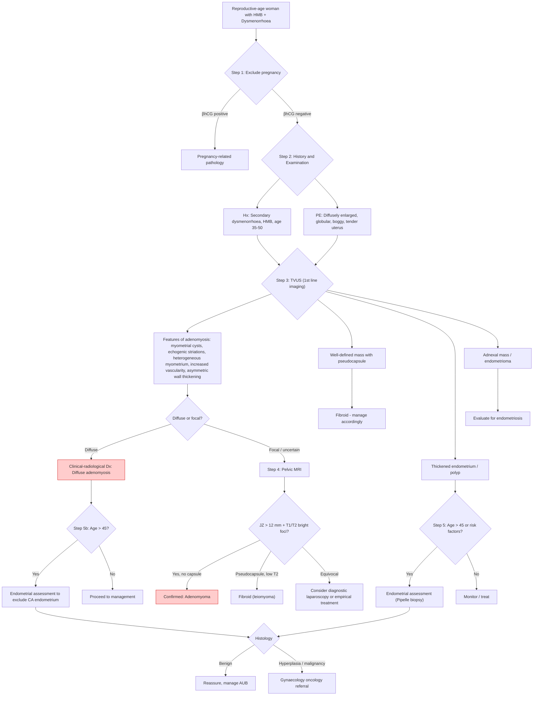

## Diagnostic Criteria, Algorithm and Investigation Modalities for Adenomyosis

### The Diagnostic Challenge — Why Adenomyosis Is Tricky

Unlike many conditions with crisp diagnostic criteria (e.g., rheumatic fever's Jones criteria), adenomyosis does not have universally accepted, codified diagnostic criteria in the way that, say, endometrial cancer does. This is because:

1. ***The diagnosis is generally histological, based on hysterectomy specimen*** [1] — i.e., the **gold standard** has historically required removing the uterus entirely.
2. You cannot biopsy the myometrium easily in a living patient (unlike the endometrium, which can be sampled with a Pipelle).
3. Therefore, clinical practice relies on a **clinical-radiological diagnosis** — a combination of suggestive history, examination findings, and imaging.

This creates a practical tension: the definitive diagnosis requires tissue you can only get by doing the definitive treatment (hysterectomy). So we work with **clinical diagnostic criteria** and **imaging criteria** for the living patient, reserving histological confirmation for when hysterectomy is performed.

---

### 1. Diagnostic Criteria

#### A. Histological Criteria (Gold Standard — Post-Hysterectomy)

The definitive histological criterion:

***Presence of endometrial glands and stroma within the myometrium ≥1 low-power field from the endomyometrial junction*** [1].

- **Why ≥1 low-power field?** The normal endomyometrial junction is not a perfectly smooth line — it has natural undulations and minor irregularities. Endometrial glands sitting right at the junction could simply reflect normal anatomy. The threshold of ≥1 low-power field (approximately 2.5 mm) ensures you are identifying genuinely ectopic tissue that has invaded into the myometrium, not just a normal junction irregularity.
- Additional histological features:
  - **Surrounding smooth muscle hypertrophy and hyperplasia** — the reactive change induced by the ectopic glands.
  - **Haemosiderin-laden macrophages** — evidence of old bleeding from cyclically active ectopic endometrial glands.
  - The ectopic glands may show proliferative, secretory, or inactive phases.

#### B. Clinical Diagnostic Criteria (Working Diagnosis)

In clinical practice, a **presumptive diagnosis** of adenomyosis is made when the following triad is present:

| Component | Criteria |
|---|---|
| **1. Suggestive symptoms** | ***HMB and dysmenorrhoea are the most characteristic*** [1]; secondary dysmenorrhoea in a woman 35–50 years |
| **2. Suggestive examination** | ***Mobile, diffusely enlarged, globular, boggy (soft) uterus (rarely exceed 12w) ± tenderness*** [1] |
| **3. Supportive imaging** | TVUS or MRI features consistent with adenomyosis (see below) |

There is no formal "scoring system" or checklist — the diagnosis is a clinical-radiological synthesis.

<Callout title="Key Lecture Point — Adenomyosis as a DDx of Secondary Dysmenorrhoea">

***If a lady has a baseline of no dysmenorrhoea, and suddenly develops dysmenorrhoea → considered secondary. Secondary dysmenorrhoea — remember to ask for associated symptoms of menorrhagia / subfertility, associated pelvic mass → think adenomyosis*** [6].

***Adenomyosis = endometrial glands growing into muscularis / myometrium of uterus. Whenever there is menstruation, the contraction of the myometrium stimulates the glands, resulting in dysmenorrhoea*** [6].

</Callout>

#### C. Imaging Diagnostic Criteria

##### i. TVUS Criteria (First-Line Imaging)

***TVUS is the 1st line imaging*** [1].

The MUSA (Morphological Uterus Sonographic Assessment) consensus criteria standardise the sonographic features. A diagnosis of adenomyosis on TVUS is supported when **≥2 of the following features** are present:

| TVUS Feature | Description | Pathological Basis |
|---|---|---|
| ***Subendometrial echogenic linear striations/nodules*** [1] | Bright lines or nodules just beneath the endometrium extending into the myometrium | Columns of ectopic endometrial glands penetrating through the junctional zone |
| ***Anechoic myometrial cysts*** [1] | Small dark (fluid-filled) areas within the myometrium, typically 1–7 mm | Dilated ectopic endometrial glands filled with old menstrual blood or secretions |
| ***Focal or diffuse myometrial bulkiness (esp. fundal and posterior wall)*** [1] | Asymmetric thickening of the myometrium | Smooth muscle hypertrophy/hyperplasia in response to ectopic endometrial tissue |
| ***Increased vascularity corresponding to adenomyosis lesions*** [1] | Colour Doppler showing increased blood flow within affected areas | Angiogenesis driven by ectopic endometrial tissue and inflammatory mediators |
| **Heterogeneous myometrial echotexture** | Loss of the normal homogeneous myometrial echo pattern | Intermixed glandular tissue, cysts, and hypertrophied muscle creating acoustic heterogeneity |
| **Fan-shaped acoustic shadowing** | Shadows radiating outward from the affected area | Difference in acoustic impedance between glandular tissue and surrounding muscle |
| **Irregular/poorly defined endometrial-myometrial border** | Blurring of the normally sharp junction between endometrium and myometrium | Direct invasion/extension of endometrial tissue into the myometrium |
| **Asymmetric myometrial wall thickening** | One wall (usually posterior) thicker than the other without a discrete mass | Preferential involvement of the posterior wall (the most common site) |

> **Sensitivity of TVUS**: Approximately 72–89% sensitive, 65–98% specific in experienced hands. Performance is highly operator-dependent.

##### ii. MRI Criteria (Second-Line — Gold Standard Imaging)

***Pelvic MRI is the most sensitive (sensitivity 78–88%, specificity 67–93%), reserved for focal adenomyosis confused with fibroids*** [1].

| MRI Feature | Criterion | Explanation |
|---|---|---|
| ***Junctional zone thickening*** | ***> 12 mm*** [1] | The JZ (inner myometrium) is normally < 8 mm on T2W. Thickening reflects smooth muscle hypertrophy driven by ectopic glands. The 12 mm threshold has high specificity. |
| **JZ thickness ratio** | JZ max / myometrial thickness > 40% | An alternative criterion that accounts for overall uterine size |
| ***Foci of increased T1W signal*** | Bright spots within the JZ/myometrium [1] | Represent **haemorrhagic foci** — blood products within ectopic endometrial glands (T1 shortening from methaemoglobin) |
| ***Foci of increased T2W signal*** | Bright spots within the thickened JZ [1] | Represent **ectopic endometrial glands and surrounding oedema** (glands are fluid-filled → high T2) |
| **Ill-defined myometrial lesion without capsule** | No pseudocapsule around area of abnormality | Distinguishes adenomyoma from leiomyoma (which has a well-defined pseudocapsule) |
| **Low T2 signal of the thickened JZ** | The bulk of the thickened JZ is dark on T2 | This is the hypertrophied smooth muscle component — smooth muscle is T2-dark |

**JZ Thickness Interpretation:**

| JZ Thickness on MRI | Interpretation |
|---|---|
| < 8 mm | **Normal** |
| 8–12 mm | **Equivocal** — correlate with symptoms and other features |
| ***> 12 mm*** [1] | **Highly suggestive of adenomyosis** |

<Callout title="MRI — When to Use It" type="idea">

MRI is NOT first-line for adenomyosis. Use it when:
1. ***Focal adenomyosis (adenomyoma) is confused with fibroids*** [1] — MRI can distinguish (no capsule, high T1 foci = adenomyoma; pseudocapsule, low T2 = fibroid).
2. TVUS is equivocal or technically limited.
3. Pre-surgical planning (mapping the extent of disease before considering conservative surgery).
4. ***HIFU treatment planning — requires contrast-enhanced MRI to assess localised adenomyotic lesion or adenomyoma < 10 cm in diameter, involving only anterior or posterior uterine wall, and not both*** [7].
</Callout>

---

### 2. Complete Diagnostic Algorithm

---

### 3. Investigation Modalities — Detailed Breakdown

#### Step 1: Exclude Pregnancy — βhCG

- **Why first?** ***Always exclude pregnancy*** in any reproductive-age woman presenting with pelvic pain and/or abnormal bleeding. A pregnancy (intrauterine or ectopic) can mimic adenomyosis with uterine enlargement, pain, and bleeding.
- **Modality**: Urine βhCG (rapid, point-of-care) or serum βhCG (quantitative, more sensitive).
- **Interpretation**: Positive → evaluate for intrauterine pregnancy, ectopic pregnancy, miscarriage. Negative → proceed with workup.

#### Step 2: Blood Tests

| Investigation | Purpose | Expected Findings in Adenomyosis |
|---|---|---|
| **Complete blood count (CBC)** | Assess for anaemia from chronic HMB | Microcytic hypochromic anaemia (low Hb, low MCV, low MCH) — iron deficiency pattern |
| **Iron studies** | Confirm iron deficiency | Low ferritin, low serum iron, high TIBC |
| **Coagulation screen** | Exclude coagulopathy as cause of HMB (especially if HMB since menarche) | Normal in adenomyosis |
| **TFT** | Hypothyroidism can cause HMB | Normal in adenomyosis (but should be checked to exclude a treatable cause) |
| **CA-125** | May be elevated in adenomyosis | Can be mildly elevated (typically < 100 U/mL); not specific — also elevated in endometriosis, ovarian cancer, PID, pregnancy. Not routinely used for diagnosis but may support clinical suspicion. |

#### Step 3: Transvaginal Ultrasound (TVUS) — First-Line Imaging

***TVUS is the 1st line imaging*** [1].

**Why TVUS first?**
- Non-invasive, widely available, no radiation, relatively inexpensive.
- Can be performed in the clinic setting.
- Experienced operators achieve high sensitivity (72–89%) and specificity (65–98%).
- Can simultaneously assess for fibroids, endometrial pathology, adnexal masses.

**Systematic approach to TVUS interpretation in suspected adenomyosis:**

| What to Assess | Normal | Adenomyosis |
|---|---|---|
| **Uterine size and shape** | Normal pear-shaped, symmetric walls | Globular enlargement, asymmetric wall thickening (posterior > anterior) |
| **Myometrial echotexture** | Homogeneous, uniform | ***Heterogeneous***, with echogenic linear striations, nodules |
| **Myometrial cysts** | Absent | ***Anechoic cysts 1–7 mm*** [1] within the myometrium |
| **Endomyometrial junction** | Sharp, well-defined | ***Irregular, blurred, ill-defined*** |
| **Subendometrial region** | Smooth interface | ***Echogenic linear striations/nodules*** [1] extending from the endometrium into the myometrium |
| **Colour Doppler** | Normal vascularity | ***Increased vascularity corresponding to adenomyosis lesions*** [1] — this distinguishes from myometrial cysts of other aetiology |
| **Shadowing** | Absent | **Fan-shaped acoustic shadowing** — characteristic of adenomyosis (cf. posterior shadowing in fibroids which is more defined) |
| **Discrete masses** | Absent | If present: adenomyoma (ill-defined, no capsule) vs. fibroid (well-defined, pseudocapsule) |

***Fibroids are generally asymmetric and irregular → if the uterus is globally enlarged symmetrically, may suggest adenomyosis instead*** [8].

<Callout title="TVUS: Adenomyosis vs. Fibroid — The Sonographic Distinction" type="error">

| Feature | Adenomyoma (focal adenomyosis) | Fibroid (leiomyoma) |
|---|---|---|
| Borders | Ill-defined, blends into myometrium | Well-defined, pseudocapsule |
| Shape | Elliptical or irregular | Round/oval |
| Echogenicity | Heterogeneous with cysts | Hypoechoic, may have calcifications |
| Shadowing | Fan-shaped, radiating outward | Edge shadowing or posterior attenuation |
| Vascularity | Vessels penetrating through the lesion | Peripheral feeding vessels ("ring sign") |
| Effect on endometrium | May distort endomyometrial junction | Displaces/compresses endometrium |

***Fibroids have a pseudo-capsule surrounding it, whereas adenomyosis does not have one → adenomyosis thus cannot be enucleated like fibroids*** [6].

</Callout>

#### Step 4: Pelvic MRI — Second-Line (When TVUS Is Equivocal)

***Pelvic MRI: most sensitive (sensitivity 78–88%, specificity 67–93%), reserved for focal adenomyosis confused with fibroids*** [1].

**When to order MRI:**
1. Focal lesion on TVUS — is it adenomyoma or fibroid?
2. Equivocal TVUS findings.
3. Pre-treatment planning (especially before HIFU or uterus-conserving surgery).
4. Young woman desiring fertility — need precise mapping of disease.

**MRI Protocol for Adenomyosis:**
- **T2-weighted (T2W)** sequences are most important:
  - The junctional zone appears as a **dark band** (low T2 signal) between the bright endometrium and intermediate-signal outer myometrium.
  - ***Thickening of the junctional zone > 12 mm*** [1] = adenomyosis.
  - High T2 foci within the dark JZ = ectopic endometrial glands (fluid-filled → bright on T2).
- **T1-weighted (T1W)** sequences:
  - ***Foci of increased T1W signal*** [1] = haemorrhagic deposits within ectopic glands (methaemoglobin shortens T1 → appears bright).
  - T1W with fat saturation helps distinguish blood (remains bright) from fat (suppressed).
- **Post-gadolinium (contrast-enhanced)** sequences:
  - Used for HIFU planning.
  - Helps delineate the extent of adenomyosis and distinguish from fibroid (fibroids enhance more uniformly).

**MRI Findings Summary:**

| Sequence | Adenomyosis Finding | Interpretation |
|---|---|---|
| T2W | JZ thickening > 12 mm, dark band with bright foci | Hypertrophied muscle (dark) with ectopic glands (bright) |
| T1W | Bright foci within myometrium | Haemorrhagic deposits in ectopic glands |
| T1W fat-sat | Bright foci persist after fat suppression | Confirms blood (not fat) |
| Post-gadolinium | Heterogeneous enhancement of thickened JZ | Active endometrial tissue with surrounding inflammation |

**MRI: Adenomyoma vs. Leiomyoma:**

| Feature | Adenomyoma | Leiomyoma |
|---|---|---|
| **Borders** | Ill-defined, no capsule | Well-defined, T2-dark pseudocapsule |
| **T2 signal** | Low signal JZ with high T2 foci (glands) | Uniformly low T2 signal (dense muscle/collagen) |
| **T1 signal** | High T1 foci (blood) | Usually isointense; no T1 bright foci unless degenerated |
| **Location** | Within thickened JZ | Any myometrial location; may be pedunculated |
| **Enhancement** | Heterogeneous, less than normal myometrium | Variable; may enhance less or more than myometrium |

#### Step 5: Endometrial Assessment (EA)

***EA may be indicated in the case of AUB > 45 years (d/dx CA endometrium)*** [1].

**Why is this important?**
- Adenomyosis causes HMB. So does endometrial cancer.
- In women over 45, you cannot simply attribute HMB to adenomyosis without first excluding malignancy.
- Even if TVUS confirms adenomyotic features, the endometrium must be assessed independently.

**Methods of Endometrial Assessment:**

| Method | Description | When to Use |
|---|---|---|
| **Pipelle endometrial biopsy** | Office-based, blind sampling of the endometrium using a thin flexible catheter | **First-line** for women > 45 with AUB or any woman with risk factors for endometrial cancer |
| **Hysteroscopy with directed biopsy** | Direct visualisation of the endometrial cavity with targeted biopsy | When Pipelle is inadequate, failed, or TVUS shows a focal endometrial lesion (e.g., polyp) |
| **Dilatation and curettage (D&C)** | Under anaesthesia, systematic scraping of the endometrial cavity | Rarely first-line now; used when hysteroscopy is unavailable or for therapeutic purposes |

> **Important:** Endometrial assessment does NOT diagnose adenomyosis (which is in the myometrium, not the endometrium). It is done to **exclude coexisting endometrial pathology**.

#### Step 6: Diagnostic Laparoscopy (Rarely Needed)

- **Not routinely indicated** for adenomyosis — the pathology is within the myometrial wall and not visible on the serosal surface.
- However, it may be performed when:
  - Coexisting endometriosis is suspected (to directly visualise peritoneal implants).
  - Persistent/progressive pain unresponsive to medical treatment — to exclude other causes.
  - As part of surgical management (e.g., laparoscopic hysterectomy).
- Adenomyosis may be suspected at laparoscopy if the uterus appears diffusely enlarged and bluish-purple discolouration is seen on the serosal surface (from subsersoal ectopic glands), but this is unreliable.

#### Additional Investigations — Special Situations

| Investigation | Indication | Relevance |
|---|---|---|
| ***USG pelvis*** [9] | ***Evaluation of amenorrhoea*** or pelvic mass | Screen for uterine and adnexal pathology |
| **Saline infusion sonography (SIS)** | Suspected endometrial polyp or submucosal fibroid | Distends the cavity with saline to delineate intracavitary lesions; not specific for adenomyosis |
| ***FSH, LH, E2, PRL, TFT, testosterone*** [9] | ***Evaluation of amenorrhoea*** | If amenorrhoea coexists — exclude hormonal causes |
| **Hysterosalpingography (HSG)** | Infertility workup | May show "spiculated" or "stippled" appearance of the endometrial cavity (contrast entering ectopic glands); largely superseded by MRI |

---

### 4. Putting It All Together — The Diagnostic Approach in Practice

Here is how you would approach a real clinical scenario:

**Scenario:** A 42-year-old multiparous woman (G3P3) with progressively worsening dysmenorrhoea for 3 years and increasing menstrual flow, now using 8–10 pads per day with clots. She feels tired and breathless on exertion. She had one previous caesarean section.

**Step-by-step approach:**

1. **βhCG** → Negative (exclude pregnancy).
2. **CBC** → Hb 9.2 g/dL, MCV 72 fL → microcytic anaemia → likely iron deficiency from chronic HMB.
3. **Iron studies** → Ferritin 8 µg/L (low) → confirmed iron deficiency.
4. **Pelvic examination** → uterus is 10 weeks' size, diffusely enlarged, globular, soft/boggy, mildly tender, mobile. No adnexal masses. → Suggestive of adenomyosis.
5. **TVUS** → globular uterus, heterogeneous myometrium with multiple small anechoic cysts in the posterior wall, echogenic linear striations at the endomyometrial junction, increased vascularity on Doppler. No discrete mass. Endometrial thickness 8 mm (normal for Day 14). → Consistent with diffuse adenomyosis.
6. **Age < 45** → endometrial assessment not mandated, but if any atypical bleeding pattern (e.g., intermenstrual), consider Pipelle.
7. **Diagnosis:** Clinical-radiological diagnosis of diffuse adenomyosis with secondary iron deficiency anaemia.

---

### 5. Key Diagnostic Distinctions on Imaging — High-Yield Summary Table

| Feature | Adenomyosis | Fibroid | Endometrial Cancer |
|---|---|---|---|
| **TVUS** | Heterogeneous myometrium, myometrial cysts, linear striations, no capsule | Hypoechoic mass, pseudocapsule, calcification | Thickened irregular endometrium, increased vascularity |
| **MRI - T2W** | JZ > 12 mm, dark band + bright foci | Low T2 mass with pseudocapsule | Intermediate T2 endometrial mass invading myometrium |
| **MRI - T1W** | Bright foci (blood) | Usually isointense | Variable |
| **Borders** | Ill-defined | Well-defined | Irregular endometrial-myometrial interface |
| **Capsule** | ***No capsule*** [6] | ***Pseudocapsule*** [6] | None |
| **Enucleation** | ***Cannot be enucleated*** [6] | ***Can be enucleated*** [6] | Not applicable (requires staging surgery) |

<Callout title="Exam Pearl: The Fibroid vs. Adenomyosis Distinction on Imaging">

***Fibroids classically do NOT cause dysmenorrhoea*** [6] — a pure fibroid will seldom cause dysmenorrhoea (exceptions: clot expulsion from heavy bleeding, or pedunculated intracavitary fibroid acting as a foreign body). If a patient has HMB + significant dysmenorrhoea, think adenomyosis or coexisting adenomyosis + fibroids.

***Menstrual flow change → DDx: fibroid, adenomyosis*** [10]. Both cause HMB, but the mechanism differs — fibroids increase surface area focally and distort the cavity, while adenomyosis increases surface area diffusely and impairs myometrial contractility.
</Callout>

---

> **High Yield Diagnostic Points:**
> - Gold standard = histology from hysterectomy specimen (endometrial tissue ≥1 LPF from endomyometrial junction)
> - Working diagnosis = clinical-radiological (symptoms + examination + TVUS/MRI)
> - TVUS first-line: myometrial cysts, echogenic striations, heterogeneous myometrium, increased vascularity, irregular endo-myometrial junction
> - MRI second-line: JZ > 12 mm on T2W, T1/T2 bright foci, no capsule
> - Always exclude pregnancy (βhCG) and endometrial cancer (EA if > 45 years)
> - Key imaging distinction: adenomyosis = no capsule, ill-defined; fibroid = pseudocapsule, well-defined

<Callout title="High Yield Summary">

**Diagnostic Criteria:**
- **Histological (gold standard):** Endometrial glands/stroma within myometrium ≥1 low-power field from endomyometrial junction.
- **Clinical-radiological (working diagnosis):** Suggestive symptoms (HMB + dysmenorrhoea) + examination (diffusely enlarged, boggy uterus) + imaging (TVUS or MRI features).

**Investigation Modalities:**
1. **βhCG** — exclude pregnancy first.
2. **CBC + iron studies** — assess for iron deficiency anaemia from chronic HMB.
3. **TVUS (1st line)** — myometrial cysts, echogenic striations, heterogeneous echotexture, increased vascularity, irregular endomyometrial junction.
4. **Pelvic MRI (2nd line)** — JZ > 12 mm, T1 bright foci (blood), T2 bright foci (glands), no capsule. Reserved for focal disease confused with fibroids.
5. **Endometrial assessment** — Pipelle biopsy for AUB in women > 45 to exclude endometrial cancer.

**Key Distinction:** Adenomyosis = no capsule, cannot be enucleated. Fibroid = pseudocapsule, can be enucleated. MRI is the differentiator.

</Callout>

---

<ActiveRecallQuiz
  title="Active Recall - Diagnosis and Investigations for Adenomyosis"
  items={[
    {
      question: "What is the histological gold standard criterion for diagnosing adenomyosis?",
      markscheme: "Presence of endometrial glands and stroma within the myometrium at least 1 low-power field from the endomyometrial junction, with surrounding smooth muscle hyperplasia. Requires hysterectomy specimen."
    },
    {
      question: "Name 4 key TVUS features of adenomyosis.",
      markscheme: "1. Subendometrial echogenic linear striations or nodules. 2. Anechoic myometrial cysts. 3. Focal or diffuse myometrial bulkiness (especially fundal and posterior wall). 4. Increased vascularity on colour Doppler. Also accept: heterogeneous myometrial echotexture, fan-shaped acoustic shadowing, irregular endomyometrial junction."
    },
    {
      question: "What JZ thickness on MRI T2W is diagnostic of adenomyosis, and what does the JZ represent?",
      markscheme: "JZ thickness greater than 12 mm. The junctional zone is the innermost layer of the myometrium, directly abutting the endometrium. It appears as a low T2 signal band. Thickening reflects smooth muscle hypertrophy driven by ectopic endometrial glands."
    },
    {
      question: "How do you distinguish an adenomyoma from a leiomyoma on MRI?",
      markscheme: "Adenomyoma: ill-defined borders, no capsule, high T1 foci (haemorrhage), high T2 foci (glands), within thickened JZ. Leiomyoma: well-defined borders, T2-dark pseudocapsule, uniformly low T2 signal, no T1 bright foci (unless degenerated), whorled pattern."
    },
    {
      question: "When is endometrial assessment indicated in a woman with suspected adenomyosis, and why?",
      markscheme: "Indicated in women with AUB aged over 45 years. Purpose is to exclude coexisting endometrial carcinoma or hyperplasia, which also presents with abnormal uterine bleeding. First-line method is Pipelle endometrial biopsy."
    },
    {
      question: "Why can fibroids be enucleated but adenomyosis cannot?",
      markscheme: "Fibroids have a pseudocapsule that creates a clear surgical plane allowing enucleation (shelling out). Adenomyosis has no capsule - the ectopic endometrial tissue diffusely infiltrates the myometrium with no clear boundary, making surgical excision impossible without removing the entire uterus."
    }
  ]}
/>

---

## References

[1] Senior notes: Adrian Lui Gynecology Notes.pdf (Section 2.3.3 Adenomyosis, p. 50–51)
[6] Lecture slides: Block C - Pelvic mass_ ovarian cancer and cysts; uterine fibroid; pelvic imaging.pdf (p. 6 — Dysmenorrhoea, adenomyosis vs fibroid distinction)
[7] Lecture slides: GC 118. Pelvic mass ovarian cancer and cysts; uterine fibroid; pelvic imaging.pdf (p. 65 — HIFU indications)
[8] Lecture slides: Block C - Pelvic mass_ ovarian cancer and cysts; uterine fibroid; pelvic imaging.pdf (p. 14 — Specific findings, fibroid vs adenomyosis)
[9] Lecture slides: GC 114. Climacteric symptoms menopause and related illness; amenorrhoea.pdf (p. 19 — Amenorrhoea evaluation investigations)
[10] Lecture slides: GC 118. Pelvic mass ovarian cancer and cysts; uterine fibroid; pelvic imaging.pdf (p. 8 — Menstrual flow DDx)
