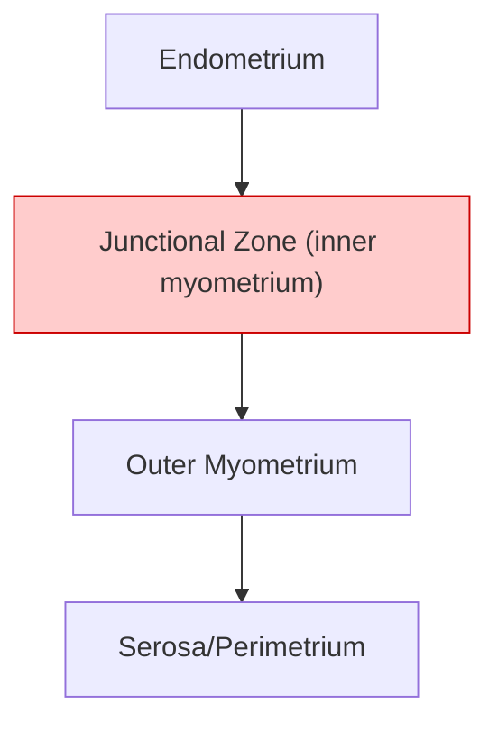
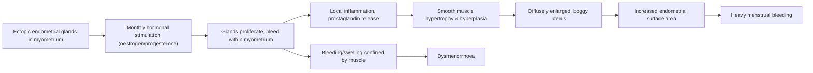

# Adenomyosis

## 1. Definition

Adenomyosis (子宮腺肌症) — breaking down the term: *"adeno-"* = gland, *"myo-"* = muscle, *"-osis"* = condition/process. So literally: **a condition where glandular tissue is found within muscle**.

***Adenomyosis is the invasion of endometrial glands and stroma into the myometrium, with surrounding smooth muscle hyperplasia*** [1]. This is the key defining feature — ectopic endometrial tissue is not just sitting passively in the myometrium, it actively induces the surrounding smooth muscle to hypertrophy and hyperplase, leading to a diffusely enlarged uterus.

Histologically, the formal criterion is: ***presence of endometrial tissue within myometrium ≥1 low-power field from the endomyometrial junction*** [1]. This threshold exists because the normal endometrial-myometrial border is somewhat irregular, and you need to distinguish true adenomyosis from normal undulations of the junction.

<Callout title="Key Distinction from Endometriosis">
Adenomyosis = endometrial tissue within the **myometrium** (i.e., the uterine wall itself).
Endometriosis = endometrial tissue **outside** the uterus entirely (ovaries, peritoneum, pouch of Douglas, etc.).
They are ***pathogenetically distinct*** although they ***commonly co-occur*** [1]. Think of adenomyosis as an "inward" invasion and endometriosis as an "outward" seeding.
</Callout>

---

## 2. Epidemiology

- ***Affects ~1% of women*** [1] — though this figure likely underestimates true prevalence, as definitive diagnosis historically required hysterectomy specimens. With improved imaging (MRI, high-resolution TVUS), reported prevalence in some studies ranges from 20–35% of hysterectomy specimens.
- ***Usually presents in the 35–50 year age group*** [1] — this makes sense because:
  - These women have had decades of menstrual cycling, providing repeated stimulus for endometrial invagination into the myometrium.
  - The condition is oestrogen-dependent; it tends to regress after menopause when oestrogen levels drop.
- More common in **multiparous** women — repeated pregnancies and deliveries may disrupt the endomyometrial junction, facilitating glandular invasion.
- Associated with prior **uterine surgery** (e.g., caesarean section, D&C, myomectomy) — surgical disruption of the endomyometrial border may allow endometrial tissue to penetrate into the myometrium.

### Risk Factors

| Risk Factor | Mechanism |
|---|---|
| Age 35–50 years | Cumulative exposure to oestrogen-driven menstrual cycling |
| Multiparity | Disruption of endomyometrial junction during pregnancy/delivery |
| Prior uterine surgery (C-section, D&C, myomectomy) | Iatrogenic breach of the endomyometrial barrier |
| Early menarche | Longer lifetime oestrogen exposure |
| Short menstrual cycles | More frequent endometrial cycling → more invagination opportunities |
| Obesity | Peripheral aromatisation of androgens → excess oestrogen |
| Tamoxifen use | Acts as a partial oestrogen agonist on the uterus |
| Coexisting endometriosis | Shared risk factors and possibly shared pathogenetic mechanisms |

---

## 3. Anatomy and Relevant Functional Considerations

### The Uterine Wall — Three Layers

Understanding adenomyosis requires understanding the normal uterine wall architecture:

1. **Endometrium** (innermost): The mucosal lining. Composed of:
   - *Stratum functionalis* — shed during menstruation, hormonally responsive.
   - *Stratum basalis* — the regenerative layer; does NOT shed during menstruation. This is the layer from which adenomyosis is thought to originate.

2. **Myometrium** (middle): Thick smooth muscle layer. Subdivided into:
   - **Junctional zone (JZ)** — the innermost layer of the myometrium, directly abutting the endometrium. This zone is critical in adenomyosis:
     - It has a different embryological origin (Müllerian) compared to the outer myometrium.
     - It is hormonally responsive and contracts during menstruation to aid in endometrial shedding.
     - ***On MRI, thickening of the junctional zone > 12 mm is highly suggestive of adenomyosis*** [1].
   - Outer myometrium — the bulk of the muscle wall.

3. **Serosa/Perimetrium** (outermost): Visceral peritoneum covering the uterus.

### The Junctional Zone — Why It Matters

The junctional zone (JZ) is the "battleground" in adenomyosis. Think of it as the gatekeeper between endometrium and myometrium. When this zone is disrupted — whether by surgery, repeated pregnancies, or intrinsic factors — endometrial glands can breach through and invade the myometrium. The JZ is the key structure visualised on MRI when assessing for adenomyosis.

---

## 4. Aetiology and Pathogenesis

The exact cause of adenomyosis is **unknown** [1], but several theories exist:

### Theory 1: Endomyometrial Invagination (Most Accepted)

***The endometrium directly invaginates from the endomyometrial junction into the myometrium*** [1].

- **How?** The stratum basalis of the endometrium herniates through the junctional zone into the myometrium. This is facilitated by:
  - Repeated mechanical trauma (menstruation, pregnancy, surgery).
  - High local oestrogen levels driving glandular proliferation and invasion.
  - Altered expression of matrix metalloproteinases (MMPs) that break down the extracellular matrix at the endomyometrial interface.
- **Why the basalis?** Because the basalis does not shed — it persists cycle after cycle, and if it starts growing "downward" instead of "upward," it invades into muscle.
- This theory is supported by the observation that adenomyosis is continuous with the endometrial surface in most cases.

### Theory 2: De Novo Metaplasia from Müllerian Rests

***Alternatively, adenomyosis may arise from de novo metaplasia from Müllerian rests within the myometrium*** [1].

- During embryological development, remnants of Müllerian duct tissue may persist within the myometrium.
- Under hormonal stimulation (oestrogen), these rests could undergo metaplasia into endometrial-type tissue.
- This theory explains cases where adenomyotic foci are found deep within the myometrium, completely disconnected from the endometrial surface.

### Theory 3: Tissue Injury and Repair (TIAR) — Modern Concept

This is a more recent and integrative theory:
- Repeated tissue injury at the endomyometrial junction (from uterine peristalsis during menstruation, or from surgical trauma) triggers a repair process.
- This repair process involves local oestrogen production, activation of stem cells, and epithelial-mesenchymal transition (EMT).
- Over time, this leads to progressive invagination and establishment of ectopic endometrial tissue within the myometrium.

### Downstream Consequence — The Vicious Cycle

***Once endometrial glands/stroma are within the myometrium, they induce hypertrophy and hyperplasia of the surrounding smooth muscle*** [1].

This is the hallmark pathological process:

***This results in a diffusely enlarged uterus, analogous to the concentric enlargement of a pregnant uterus*** [1] — because the muscle is hypertrophying concentrically around the ectopic glands, rather than a focal mass pushing things aside (as in a fibroid).

<Callout title="Adenomyosis is Oestrogen-Dependent" type="idea">
Like endometriosis, adenomyosis depends on oestrogen for growth. This is why:
- It presents in the reproductive years (peak 35–50).
- It regresses after menopause.
- GnRH agonists (which suppress oestrogen) provide symptomatic relief.
- Pregnancy can sometimes worsen symptoms (high oestrogen state).
</Callout>

---

## 5. Classification

### By Distribution Pattern

| Type | Description | Clinical Implication |
|---|---|---|
| ***Diffuse adenomyosis (typical)*** [1] | Widespread involvement of the myometrium; no discrete mass | The classic presentation: uniformly enlarged, boggy uterus |
| ***Focal adenomyosis (adenomyoma)*** [1] | Localised collection of ectopic endometrial tissue forming a discrete mass within the myometrium | ***Often confused with leiomyomas (fibroids)*** [1]; requires MRI for differentiation |

### By Depth of Invasion

Some classification systems grade adenomyosis by how deeply the ectopic glands penetrate:
- **Superficial**: Limited to the inner third of the myometrium (junctional zone).
- **Deep**: Extends into the outer two-thirds of the myometrium.
- Deeper invasion tends to correlate with more severe symptoms.

### MUSA Classification (Morphological Uterus Sonographic Assessment)

This is a standardised ultrasound-based classification system proposed by international consensus:
- **Location**: Anterior, posterior, lateral, fundal.
- **Type**: Diffuse vs. focal.
- **Extent**: Percentage of myometrial involvement.
- **Features**: Presence of cysts, echogenic islands, fan-shaped shadowing, etc.

<Callout title="Diffuse vs. Focal — Why It Matters Clinically">
- **Diffuse adenomyosis** → hysterectomy is often the definitive treatment because the disease is everywhere in the myometrium and cannot be "excised."
- **Focal adenomyosis (adenomyoma)** → may be amenable to surgical excision (adenomyomectomy) in women wishing to preserve fertility, though it is technically challenging.
</Callout>

---

## 6. Clinical Features

### 6.1 Symptoms

***Asymptomatic in 33% of cases*** [1] — adenomyosis is often found incidentally on imaging or in hysterectomy specimens.

For the symptomatic majority, the cardinal symptoms are:

#### A. Heavy Menstrual Bleeding (HMB) — 60%

***Heavy menstrual bleeding (60%): due to increased endometrial surface area of the enlarged uterus*** [1].

**Pathophysiological basis:**
1. The uterus is diffusely enlarged due to myometrial hypertrophy → the endometrial cavity is also stretched and expanded → more endometrial surface area to shed → heavier bleeding.
2. Ectopic endometrial glands within the myometrium also bleed during menstruation → this blood has nowhere to go and contributes to prolonged oozing.
3. The hypertrophied, adenomyotic myometrium has **impaired contractility** — normal myometrial contraction is critical for haemostasis after endometrial shedding (it compresses the spiral arterioles). Adenomyotic tissue disrupts the coordinated contraction → poor haemostasis → prolonged and heavy bleeding.
4. Increased local prostaglandin and inflammatory mediator production → vasodilation of endometrial vessels → more bleeding.

> **High Yield:** The mechanism is similar to why fibroids cause HMB — both increase endometrial surface area and impair myometrial contraction. The key difference is that fibroids cause *focal* enlargement while adenomyosis causes *diffuse* enlargement.

#### B. Dysmenorrhoea — 25%

***Dysmenorrhoea (25%): due to bleeding and swelling of endometrial islands confined by myometrium*** [1].

**Pathophysiological basis:**
1. During menstruation, the ectopic endometrial glands within the myometrium undergo the same cyclical changes as the normal endometrium — they proliferate, secrete, and then bleed.
2. Unlike the endometrial cavity (which has an exit through the cervix), blood from these ectopic glands is **trapped within the myometrium**. This causes local swelling and pressure.
3. The surrounding myometrium is being stretched and distended by this trapped blood → this activates pain receptors (nociceptors) in the myometrium.
4. Inflammatory mediators (prostaglandins, particularly PGF2α and PGE2) are released from the ectopic endometrial tissue → these cause myometrial smooth muscle spasm and sensitise nerve endings → pain.
5. The dysmenorrhoea is typically **secondary dysmenorrhoea** — i.e., it starts later in life (30s–40s) and worsens progressively, unlike primary dysmenorrhoea which starts at menarche.

**Character of pain:**
- Cramping, often midline, deep pelvic pain.
- Starts before menstruation and continues throughout (sometimes extending beyond the period).
- May worsen with each cycle as the disease progresses.

#### C. Deep Pelvic Pain

***Generally NOT associated with dyspareunia (but may have deep pelvic pain)*** [1].

**Why not dyspareunia?**
- Dyspareunia (pain during intercourse) is more characteristic of endometriosis (especially deep infiltrating endometriosis involving the uterosacral ligaments or pouch of Douglas, or ovarian endometriomas).
- In adenomyosis, the pathology is *within the myometrial wall* — it doesn't typically involve the pelvic peritoneum or pouch of Douglas, so deep thrust dyspareunia is not a hallmark feature.
- However, the diffusely enlarged, tender uterus may cause a vague deep pelvic heaviness or ache, especially premenstrually.

#### D. Infertility

***Infertility: controversial*** [1].

**Possible mechanisms (debated):**
1. Disrupted junctional zone peristalsis → impaired sperm transport toward the fallopian tubes.
2. Altered endometrial receptivity → defective implantation.
3. Chronic inflammatory milieu within the endometrium and myometrium → hostile environment for embryo implantation.
4. Increased uterine contractility → may expel the embryo.
5. Association with other conditions that cause infertility (e.g., endometriosis).

> Current evidence suggests adenomyosis likely does negatively impact fertility and IVF outcomes, but the data are not as robust as for endometriosis. It is increasingly recognised as a factor in recurrent implantation failure.

#### E. Other Symptoms
- **Intermenstrual bleeding** — ectopic glands may bleed at times outside the menstrual period.
- **Iron deficiency anaemia** — secondary to chronic HMB.
- **Menstrual clots and flooding** — from the heavy flow.
- **Chronic pelvic pain** — from ongoing low-grade inflammation in the myometrium.
- **Bladder/rectal pressure symptoms** — from an enlarged uterus pressing on adjacent structures (less common than with large fibroids, since adenomyotic uteri ***rarely exceed 12 weeks' size*** [1]).

---

### 6.2 Signs

***Physical examination findings*** [1]:

#### A. Bimanual Pelvic Examination

- ***Typically mobile*** [1] — the uterus is not fixed (unlike in endometriosis with dense adhesions). This is because adenomyosis is an intrinsic disease of the myometrium, not a peritoneal disease.
- ***Diffusely enlarged*** [1] — the uterus is symmetrically enlarged (contrast with fibroids, which cause asymmetric/irregular enlargement).
- ***Globular*** [1] — the uterus has a round, ball-like shape (rather than the normal pear shape). This is because the concentric myometrial hypertrophy expands the uterus in all directions.
- ***Boggy (soft)*** [1] — the uterus feels softer than expected. This is because:
  - The myometrium is infiltrated with glandular tissue and microcysts, making it less firm than normal muscle.
  - Contrast with fibroids, which feel firm/hard because they are composed of dense fibrous tissue and smooth muscle.
- ***Rarely exceeds 12 weeks' size*** [1] — i.e., usually < 12 cm. This is a useful clinical pearl to distinguish from fibroids (which can grow much larger).
- ***Tenderness*** [1] — especially during menstruation, due to active bleeding within the myometrial glands. The uterus may be tender on palpation, particularly in the premenstrual/menstrual phase.

<Callout title="Boggy vs. Firm — The Key Exam Distinction" type="error">
**Adenomyosis** = Diffusely enlarged, **boggy/soft**, globular, tender uterus.
**Fibroids** = Irregularly enlarged, **firm/hard**, non-tender, may have discrete lumps.
This is a favourite exam question! If the uterus is uniformly enlarged and soft → think adenomyosis. If it's irregular and firm → think fibroids.
</Callout>

#### B. Speculum Examination
- Cervix usually appears normal.
- There may be heavy menstrual flow seen at the os during menstruation.

---

## 7. Summary Table — Adenomyosis vs. Fibroids (Leiomyomas)

This is a critical comparison for exams:

| Feature | Adenomyosis | Fibroids (Leiomyomas) |
|---|---|---|
| **Pathology** | Endometrial glands/stroma within myometrium | Benign smooth muscle tumour |
| **Distribution** | Diffuse (or focal = adenomyoma) | Discrete, encapsulated masses |
| **Uterine enlargement** | Diffuse, symmetrical, globular | Irregular, asymmetric, lobulated |
| **Consistency** | Boggy/soft | Firm/hard |
| **Size** | Rarely > 12 weeks | Can be very large (> 20 weeks) |
| **Tenderness** | Yes, especially menstrual | Usually non-tender |
| **Mobility** | Mobile | Mobile (unless pedunculated/broad lig.) |
| **Peak age** | 35–50 years | 30–50 years |
| **Key symptom** | Dysmenorrhoea + HMB | HMB ± pressure symptoms |
| **Dyspareunia** | Not typical | Not typical |
| **Imaging** | Ill-defined, JZ thickening, no capsule | Well-defined, encapsulated, may calcify |
| **Definitive diagnosis** | Histology (hysterectomy) | Histology |
| **Definitive treatment** | Hysterectomy | Myomectomy or hysterectomy |

---

## 8. Approach to Evaluation

***Initial evaluation*** [1]:

### A. History
- ***HMB and dysmenorrhoea are the most characteristic symptoms*** [1].
- Ask about:
  - Menstrual pattern: duration, flow volume (number of pads/tampons, passing clots, flooding), impact on daily activities.
  - Dysmenorrhoea: onset, severity, timing relative to menses (typically starts before and continues through menstruation).
  - Fertility history and desire for future fertility (crucial for management decisions).
  - Previous uterine surgery (C-section, D&C, myomectomy).
  - Symptoms of anaemia (fatigue, breathlessness, palpitations).
  - Rule out red flags: postmenopausal bleeding, intermenstrual bleeding in women > 45 (need to exclude endometrial cancer).

### B. Physical Examination
- ***PE: typically mobile, diffusely enlarged, globular, boggy (soft) uterus (rarely exceed 12w) ± tenderness*** [1].
- Bimanual pelvic examination is the key clinical assessment.

### C. Endometrial Assessment
- ***Endometrial assessment (EA) may be indicated in the case of AUB > 45 years to rule out endometrial carcinoma*** [1].
- Methods: Pipelle endometrial biopsy (office-based, first-line), hysteroscopy with directed biopsy if Pipelle is inadequate.

### D. Imaging

#### Transvaginal Ultrasound (TVUS) — First Line

***TVUS is the 1st line imaging*** [1].

Key sonographic features:

| Feature | Description | Pathological Basis |
|---|---|---|
| ***Subendometrial echogenic linear striations/nodules*** [1] | Bright lines or dots just beneath the endometrium extending into the myometrium | Ectopic endometrial glands within the inner myometrium |
| ***Anechoic cysts (myometrial cysts)*** [1] | Small dark (fluid-filled) areas within the myometrium, typically 1–7 mm | Dilated ectopic endometrial glands filled with old blood or secretions |
| ***Focal or diffuse myometrial bulkiness (esp. fundal and posterior wall)*** [1] | Asymmetric thickening of the myometrium, often more prominent posteriorly | Smooth muscle hypertrophy/hyperplasia in response to ectopic glands |
| ***Increased vascularity corresponding to adenomyosis lesions*** [1] | On colour Doppler, increased blood flow within the thickened areas | Angiogenesis driven by ectopic endometrial tissue |
| **Heterogeneous myometrial echotexture** | The myometrium loses its normal homogeneous appearance | Intermixed glandular tissue and hypertrophied muscle |
| **Fan-shaped acoustic shadowing** | Shadows radiating from the lesion | Different acoustic impedance between glandular tissue and muscle |
| **Irregular/indistinct endometrial-myometrial border** | The normally sharp endomyometrial junction becomes blurred | Direct extension of endometrial tissue into the myometrium |

> **Sensitivity of TVUS**: Approximately 72–89% sensitive and 65–98% specific for adenomyosis, especially when performed by experienced sonographers.

#### Pelvic MRI — Gold Standard Imaging

***Pelvic MRI is the most sensitive (sensitivity 78–88%, specificity 67–93%), reserved for focal adenomyosis confused with fibroids*** [1].

Key MRI features:
- ***Thickening of the junctional zone (JZ) of the uterus > 12 mm is associated with adenomyosis*** [1].
- ***Foci of increased T1W and increased T2W density*** [1]:
  - **High T1W signal** = haemorrhagic foci (blood within ectopic glands).
  - **High T2W signal** = glandular tissue and oedema within the thickened JZ.
- The junctional zone appears as a band of low T2 signal on MRI (because it is compact smooth muscle). When it is thickened and contains high-signal foci, this is diagnostic of adenomyosis.
- MRI can distinguish adenomyoma from leiomyoma:
  - **Adenomyoma**: Ill-defined borders, no capsule, high T1 foci (blood), within thickened JZ.
  - **Leiomyoma**: Well-defined borders, pseudocapsule, low T2 signal (dense fibrous tissue), may calcify.

<Callout title="MRI Junctional Zone Thickness — The Key Number" type="idea">
- JZ < 8 mm = **normal**
- JZ 8–12 mm = **equivocal** (correlate clinically)
- ***JZ > 12 mm = highly suggestive of adenomyosis*** [1]
Remember: **12 mm** is the magic number for JZ thickening on MRI.
</Callout>

### E. Definitive Diagnosis

- The **gold standard** for definitive diagnosis is **histopathological examination** of a hysterectomy specimen.
- This is why adenomyosis was historically under-diagnosed — you couldn't confirm it without removing the uterus.
- With modern high-resolution TVUS and MRI, clinical/radiological diagnosis is now standard for management purposes, and histological confirmation is obtained when hysterectomy is eventually performed.

---

## 9. Gross and Histological Pathology

### Gross Appearance

***Grossly: uterus uniformly enlarged and boggy, classically crisscross appearance upon sectioning the uterus*** [1].

- On cut section, the myometrium shows a **trabeculated, whorled, "Swiss cheese"** appearance with small haemorrhagic or cystic areas scattered throughout.
- The classic ***"crisscross"*** pattern reflects the interwoven bands of hypertrophied smooth muscle surrounding islands of ectopic endometrial tissue.
- There is no capsule or clear boundary (unlike fibroids).
- The endometrial-myometrial junction is indistinct.

### Histological Appearance

- Endometrial glands and stroma are found deep within the myometrium (≥1 low-power field from the endomyometrial junction).
- The surrounding myometrium shows **smooth muscle hyperplasia and hypertrophy**.
- The ectopic glands may show various phases of the menstrual cycle (proliferative, secretory) or may be inactive.
- Old haemorrhage (haemosiderin-laden macrophages) may be seen around the ectopic glands.

---

> **High Yield Exam Points:**
> - Adenomyosis = endometrial glands + stroma in myometrium + smooth muscle hypertrophy
> - Peak age 35–50, affects ~1% women
> - Pathogenetically distinct from endometriosis but commonly co-occur
> - Cardinal symptoms: HMB (60%) + dysmenorrhoea (25%); 33% asymptomatic
> - Examination: mobile, diffusely enlarged, globular, boggy, tender uterus, rarely > 12 weeks
> - TVUS first line; MRI for equivocal/focal cases (JZ > 12 mm diagnostic)
> - Definitive diagnosis = histology from hysterectomy specimen
> - Diffuse (typical) vs. focal (adenomyoma — confused with fibroids)

<Callout title="High Yield Summary">

**Definition:** Invasion of endometrial glands and stroma into myometrium with surrounding smooth muscle hyperplasia.

**Epidemiology:** ~1% women, peak 35–50 years, multiparous, prior uterine surgery.

**Aetiology:** Unknown — endomyometrial invagination (most accepted) or de novo metaplasia from Müllerian rests. Pathogenetically distinct from but commonly co-occurs with endometriosis.

**Pathology:** Diffusely enlarged, boggy uterus with crisscross pattern on cut section. Histology: endometrial tissue ≥1 low-power field from endomyometrial junction.

**Classification:** Diffuse (typical) vs. focal (adenomyoma — mimics fibroids).

**Symptoms:** HMB (60%, due to ↑endometrial surface area), dysmenorrhoea (25%, due to bleeding/swelling of ectopic glands confined by myometrium), NOT typically dyspareunia, ?infertility (controversial), 33% asymptomatic.

**Signs:** Mobile, diffusely enlarged, globular, boggy/soft, tender uterus, rarely > 12 weeks' size.

**Approach:** History (HMB + dysmenorrhoea) → PE (boggy uterus) → TVUS 1st line (subendometrial striations, myometrial cysts, ↑vascularity) → MRI if equivocal (JZ > 12 mm, T1/T2 bright foci) → EA if AUB > 45y → Definitive Dx = histology.

</Callout>

---

<ActiveRecallQuiz
  title="Active Recall - Adenomyosis (Definition, Aetiology, Clinical Features)"
  items={[
    {
      question: "Define adenomyosis and state the histological criterion for diagnosis.",
      markscheme: "Invasion of endometrial glands and stroma into the myometrium with surrounding smooth muscle hyperplasia. Histologically: endometrial tissue within myometrium at least 1 low-power field from the endomyometrial junction."
    },
    {
      question: "Name 2 theories for the pathogenesis of adenomyosis.",
      markscheme: "1. Endomyometrial invagination of endometrium (most accepted). 2. De novo metaplasia from Mullerian rests within the myometrium. (Also accept TIAR theory.)"
    },
    {
      question: "Compare the uterine examination findings in adenomyosis vs fibroids.",
      markscheme: "Adenomyosis: diffusely enlarged, globular, boggy/soft, tender, mobile, rarely more than 12 weeks size. Fibroids: irregularly enlarged, firm/hard, non-tender, may have discrete lumps, can be very large."
    },
    {
      question: "Explain the pathophysiological mechanism of heavy menstrual bleeding in adenomyosis.",
      markscheme: "1. Myometrial hypertrophy causes diffuse uterine enlargement, increasing endometrial surface area. 2. Impaired myometrial contractility leads to poor haemostasis. 3. Ectopic endometrial glands bleed within myometrium. 4. Increased prostaglandins cause vasodilation."
    },
    {
      question: "What is the key MRI finding and diagnostic threshold for adenomyosis?",
      markscheme: "Thickening of the junctional zone of the uterus more than 12 mm, with foci of high T1W (haemorrhage) and high T2W (glandular tissue/oedema) signal."
    },
    {
      question: "Why is adenomyosis NOT typically associated with dyspareunia, unlike endometriosis?",
      markscheme: "Adenomyosis is confined to the myometrium (within the uterine wall) and does not typically involve the pelvic peritoneum, uterosacral ligaments, or pouch of Douglas, which are the structures that cause deep dyspareunia when affected by endometriosis."
    }
  ]}
/>

---

## References

[1] Senior notes: Adrian Lui Gynecology Notes.pdf (Section 2.3.3 Adenomyosis, p. 50)
