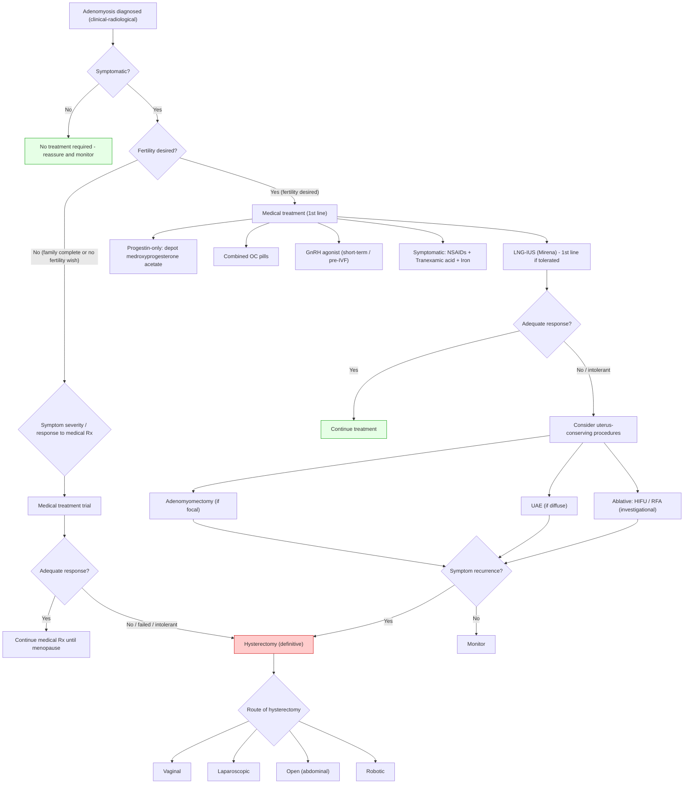

## Management of Adenomyosis

### Guiding Principles — How to Think About Management

Before diving into specifics, let's establish the logical framework. Management decisions in adenomyosis hinge on **three key questions**:

1. **Is the patient symptomatic?** — ***Asymptomatic adenomyosis incidentally found does not require any treatment*** [1].
2. **Does the patient desire future fertility?** — This determines whether uterus-conserving approaches are needed.
3. **How severe are the symptoms?** — This guides the escalation from medical → procedural → surgical treatment.

The fundamental management challenge is this: ***adenomyosis has no surgical plane for simple enucleation (even in adenomyoma)*** [1] — unlike fibroids, you cannot simply "shell out" the disease. The ectopic endometrial tissue is diffusely infiltrating the myometrium. Therefore:
- **Medical treatment** aims to suppress the hormonally-active ectopic glands.
- **Hysterectomy** is the only truly **definitive** cure.
- **Uterus-conserving procedures** offer intermediate options but have significant recurrence/failure rates.

---

### Management Algorithm

---

### 1. Conservative Management (Observation)

***Asymptomatic adenomyosis incidentally found does not require any treatment*** [1].

**Who qualifies:**
- Women with adenomyosis discovered incidentally on imaging performed for another indication.
- Women approaching menopause with minimal symptoms (the disease will regress naturally once oestrogen levels decline post-menopause).

**Rationale:** Adenomyosis is a benign condition — it does not undergo malignant transformation (though ***stromal sarcomas can rarely be found in association with adenomyosis*** [4]). There is no indication to treat the radiological finding if it is not causing symptoms or functional impairment.

**What to do:**
- Reassure the patient.
- Monitor symptoms at routine gynaecological reviews.
- Advise to return if symptoms develop (HMB, dysmenorrhoea, anaemia).

---

### 2. Medical Treatment

***Hormonal treatment: generally similar to endometriosis (unlike fibroids, where they are generally ineffective)*** [1].

This is a **critical pharmacological distinction**: adenomyosis is composed of hormonally-responsive ectopic endometrial tissue (just like endometriosis), so hormonal suppression works by causing **decidualisation and atrophy** of those glands. Fibroids, by contrast, are smooth muscle tumours — hormonal treatments have little effect on their bulk or bleeding.

Medical treatment is the **first-line approach** for symptomatic adenomyosis, especially in women who:
- Desire future fertility.
- Are not yet candidates for surgery.
- Are approaching menopause (bridging to natural resolution).

#### A. Non-Hormonal Medical Treatment (Symptomatic Relief)

These treat the **consequences** of adenomyosis (bleeding, pain, anaemia) without addressing the underlying disease:

| Drug | Dose | Mechanism | Role in Adenomyosis |
|---|---|---|---|
| **Tranexamic acid** (Transamin) | ***1g TDS PO up to 4 days per cycle, max 4g daily*** [11] | Anti-fibrinolytic: inhibits plasminogen activation → prevents clot breakdown → reduces menstrual blood loss | Reduces volume of HMB. Does not affect pain. Used as adjunct to hormonal therapy or for women who cannot take hormones. |
| **NSAIDs** (e.g., mefenamic acid / Ponstan) | ***250–500 mg TDS PO PRN*** [11] | Inhibits cyclooxygenase (COX) → reduces prostaglandin synthesis → decreases myometrial contractions and pain | Targets the dysmenorrhoea component. ***Fenamates may have a slight advantage as they also block PG action*** [3] (i.e., they inhibit both synthesis AND receptor binding of prostaglandins). |
| **Iron supplementation** (Ferrous sulphate) | ***300 mg TDS PO × 6 months if Hb < 10 g/dL*** [11] | Replaces iron stores depleted by chronic HMB | Essential supportive treatment for iron deficiency anaemia. Continue until Hb and ferritin normalise. |

<Callout title="NSAIDs in Adenomyosis vs. Fibroids" type="idea">

***NSAIDs do NOT appear to reduce blood loss in fibroids but can reduce painful menses*** [11]. In adenomyosis, NSAIDs address the dysmenorrhoea (by reducing prostaglandin-mediated myometrial spasm) but have limited effect on HMB. For bleeding control, tranexamic acid is more effective.
</Callout>

#### B. Hormonal Medical Treatment

***Hormonal treatment is generally similar to endometriosis*** [1]. The overarching principle: **suppress oestrogen-driven cyclical stimulation of the ectopic endometrial glands**.

##### i. Levonorgestrel-Releasing Intrauterine System (LNG-IUS / Mirena)

***Progestin-only treatment: e.g., Mirena*** [1].

| Aspect | Detail |
|---|---|
| **Mechanism** | Releases levonorgestrel locally within the uterine cavity → causes **decidualisation and atrophy** of the endometrium (both eutopic and ectopic glands within the inner myometrium) → reduces bleeding and pain. Also suppresses endometrial prostaglandin production. |
| **Why first-line?** | Delivers progestin directly to the target organ (uterus) with minimal systemic side effects. Proven efficacy in reducing HMB (up to 90% reduction in menstrual blood loss). Also provides contraception. Duration of action: 5 years (up to 8 years for contraception in newer data). |
| **Efficacy in adenomyosis** | Reduces menstrual blood loss significantly. Reduces dysmenorrhoea. May reduce uterine volume modestly. Best evidence of any medical treatment for adenomyosis-related HMB. |
| **Limitations** | Requires insertion (may be technically challenging in a distorted or enlarged cavity). May be expelled if the cavity is significantly enlarged/distorted. Initial irregular spotting/bleeding for 3–6 months. |
| **Contraindications** | Active PID, current STI, unexplained vaginal bleeding (until evaluated), uterine anomaly precluding insertion, current breast cancer. ***Mirena is suitable if fibroids < 3 cm with no cavity distortion*** [11] — by extension, if adenomyosis has significantly distorted/enlarged the cavity, it may not be appropriate. |

##### ii. Depot Medroxyprogesterone Acetate (DMPA / Depot Provera)

***Progestin-only treatment: e.g., depot Provera*** [1].

| Aspect | Detail |
|---|---|
| **Mechanism** | Systemic progestin → suppresses HPG axis → anovulation + endometrial atrophy → reduces bleeding and pain. Also causes decidualisation of ectopic endometrial glands. |
| **Dose** | 150 mg IM every 12 weeks |
| **Efficacy** | Effective for HMB and dysmenorrhoea. May induce amenorrhoea in ~50% of women by 12 months. |
| **Side effects** | Weight gain, mood changes, irregular bleeding (especially initially), delayed return of fertility (average 10 months after last injection), **bone density loss** with prolonged use ( > 2 years — especially relevant in young women). |
| **Contraindications** | Current breast cancer, severe liver disease, unexplained vaginal bleeding. |

##### iii. Combined Oral Contraceptive Pills (COCPs)

***Oral contraceptive pills: little data on efficacy but still commonly used*** [1].

| Aspect | Detail |
|---|---|
| **Mechanism** | ***Provide exogenous ovarian hormones → suppress HPG axis → provide manual control over menstrual cycles*** [12]. The progestin component causes endometrial atrophy; the oestrogen component stabilises the endometrium and prevents breakthrough bleeding. |
| **Regimens** | ***Cyclic (monthly withdrawal bleed), extended (one bleed every 3 months), continuous*** [12] — extended/continuous regimens may be more beneficial in adenomyosis as they reduce the frequency of withdrawal bleeds (and thus the frequency of painful menstruation). |
| **Efficacy** | ***Associated with 30% reduction in average monthly blood loss*** [12]. ***Makes bleeding more regular, lighter (cycle + flow control). Reduces dysmenorrhoea*** [12]. However, ***little data on efficacy specifically for adenomyosis*** [1] — most evidence is extrapolated from dysmenorrhoea and AUB studies. |
| **Side effects** | ***Minor: N/V, dizziness, breast tenderness, fluid retention, weight gain. Breakthrough bleeding. CVS risk: increased risk of MI, stroke, thromboembolism. Minimal increased risk in breast and cervical CA*** [12]. |
| **Contraindications** | ***Full breastfeeding (oestrogen affects milk production). Thromboembolic risk: Hx of VTE, major surgery, prolonged immobilisation, first 21 days postpartum*** [12]. Also: migraine with aura, uncontrolled hypertension, current breast cancer, active liver disease, age > 35 and smoking > 15 cigarettes/day. |

<Callout title="COCP in Adenomyosis — The Oestrogen Paradox" type="error">
COCPs contain oestrogen, which theoretically could stimulate adenomyotic tissue. However, in practice, the net effect of COCPs is **suppressive** because: (1) the progestin component dominates and causes endometrial atrophy, and (2) ovulation suppression eliminates the natural cyclical oestrogen peaks that drive adenomyotic growth. Nevertheless, in severe adenomyosis, progestin-only methods may be preferred to avoid any oestrogen exposure.
</Callout>

##### iv. GnRH Agonists

***GnRH agonists*** [1].

| Aspect | Detail |
|---|---|
| **Mechanism** | ***Desensitisation of the pituitary GnRH receptors → medically induce menopause → reduce size of adenomyotic tissue, reduce menstrual-related symptoms*** [11]. Initially causes a "flare" effect (transient increase in FSH/LH for 1–2 weeks) before down-regulation. |
| **Examples** | Goserelin (Zoladex) 3.6 mg SC monthly, Leuprolide (Lupron) 3.75 mg IM monthly |
| **Efficacy** | Highly effective — induces amenorrhoea, significantly reduces uterine volume and symptoms. |
| **Limitations** | ***Rapid relapse following discontinuation. Significant climacteric symptoms with menopause-related side effects (e.g., bone density loss) → therefore NOT for long-term use*** [11]. Typically limited to **6 months** without add-back therapy. |
| **Add-back therapy** | Low-dose oestrogen/progestin "add-back" can mitigate menopausal side effects (hot flushes, bone loss) while maintaining efficacy. Allows longer use (up to 12–24 months). |
| **Role in adenomyosis** | **Pre-operative** shrinkage before hysterectomy (makes surgery easier). **Bridging** in perimenopausal women (bridge symptoms until natural menopause). **Pre-IVF** in women with adenomyosis-related subfertility (2–3 months pre-treatment to reduce uterine volume and improve implantation rates). |
| **Side effects** | ***Irregular bleeding, URTI symptoms*** [11], hot flushes, vaginal dryness, mood changes, headache, bone density loss. |

##### v. GnRH Antagonists (Newer Option)

| Aspect | Detail |
|---|---|
| **Mechanism** | Competitive blockade of GnRH receptors → immediate suppression of FSH/LH (no initial flare, unlike agonists) |
| **Examples** | Elagolix, Relugolix (oral preparations — a major advantage over injectable GnRH agonists) |
| **Advantage** | Dose-dependent suppression — can be titrated to partially suppress oestrogen (maintaining some bone protection) rather than inducing complete menopause. No flare effect. Oral administration. |
| **Current status** | Emerging evidence for use in adenomyosis. Relugolix combination therapy (with add-back) is approved in some jurisdictions for uterine fibroids and is being studied for adenomyosis. |

##### vi. Aromatase Inhibitors

***Aromatase inhibitor*** [1].

| Aspect | Detail |
|---|---|
| **Mechanism** | Blocks aromatase enzyme → prevents peripheral conversion of androgens to oestrogens → reduces systemic and local oestrogen levels. Particularly targets **local aromatase** within adenomyotic tissue (which produces its own oestrogen via local aromatase expression — a self-sustaining paracrine loop). |
| **Examples** | Letrozole 2.5 mg daily, Anastrozole 1 mg daily |
| **Efficacy** | Limited but promising data. May be effective as second-line or adjunct therapy. |
| **Side effects** | Bone density loss, hot flushes, arthralgia, ovarian stimulation (can cause multiple follicle development in premenopausal women → must co-administer with progestin or GnRH agonist to prevent this). |
| **Role** | Reserved for refractory cases or when other hormonal options are contraindicated/ineffective. |

##### vii. Other Hormonal Options

| Drug | Mechanism | Notes |
|---|---|---|
| **Dienogest** (2 mg daily) | Selective progestin → decidualisation of ectopic endometrial tissue, suppresses ovulation, anti-inflammatory | Specifically studied and approved in some countries for endometriosis; growing evidence for adenomyosis. Well-tolerated. May become first-line progestin of choice. |
| ***Cyclical oral progestogens (e.g., Primolut N / norethisterone 5 mg TDS on day 5–26)*** [11] | Suppresses endometrial proliferation during luteal phase | Less effective than continuous progestin methods. Used mainly for cycle control. |
| **Danazol** | Androgenic steroid → suppresses HPG axis + causes endometrial atrophy | Effective but poorly tolerated (androgenic side effects: acne, hirsutism, voice deepening, weight gain, liver toxicity). Rarely used now. |

---

### Summary: Medical Treatment Comparison

| Treatment | HMB | Dysmenorrhoea | Uterine Volume | Fertility-Compatible | Duration |
|---|---|---|---|---|---|
| **LNG-IUS (Mirena)** | +++  | ++ | ± | Reversible (remove for conception) | Up to 5 years |
| **DMPA** | +++ | ++ | ± | Delayed return (10 months) | Ongoing injections |
| **COCP** | ++ | ++ | – | Reversible | Ongoing |
| **GnRH agonist** | +++ | +++ | ↓↓ | Used pre-IVF | Max 6 months (or with add-back) |
| **Aromatase inhibitor** | + | ++ | ↓ | No (use with GnRH agonist) | Short-term |
| **Dienogest** | ++ | +++ | ↓ | Reversible | Ongoing |
| **Tranexamic acid** | ++ | – | – | Yes | Per cycle |
| **NSAIDs** | ± | ++ | – | Yes | Per cycle |

---

### 3. Surgical Treatment

#### A. Hysterectomy — The Definitive Treatment

***Definitive treatment: only way to excise as there is no surgical plane for simple enucleation (even in adenomyoma)*** [1].

**Why is hysterectomy definitive?**
- The ectopic endometrial glands are diffusely infiltrating the myometrium with no capsule, no plane of cleavage, and no clear boundary.
- You cannot "peel out" adenomyosis the way you can enucleate a fibroid (which has a pseudocapsule).
- Removing the entire uterus removes all the diseased tissue.
- Cure rate: virtually 100% for symptom resolution.

**Indications for hysterectomy:**
- Symptomatic adenomyosis refractory to medical treatment.
- Completed childbearing or no fertility wish.
- Severe symptoms significantly impacting quality of life.
- ***Acute haemorrhage not responding to other therapies*** [11].
- Coexisting indications: ***increased risk for CA cervix, endometrium, ovaries (e.g., CIN, endometrial hyperplasia)*** [11].
- Patient preference.

##### Extent of Hysterectomy

***Extent: subtotal hysterectomy as cervix and ovaries are not affected*** [1].

This is an important point. Let's break it down:

| Structure | Affected by Adenomyosis? | Include in Surgery? |
|---|---|---|
| **Uterine body (corpus)** | Yes — the site of disease | **Must be removed** |
| **Cervix** | ***Not affected*** [1] | ***Can be preserved (subtotal/supracervical hysterectomy)*** [1] — preserving the cervix may be associated with better pelvic floor support and sexual function |
| **Ovaries** | ***Not affected*** [1] | ***Should be preserved*** [1] — especially in premenopausal women, to avoid surgical menopause. Bilateral salpingo-oophorectomy (BSO) is only added if there are separate indications (e.g., BRCA mutation, endometriosis of ovaries, perimenopausal age with ovarian pathology) |
| **Fallopian tubes** | Not directly affected | Opportunistic bilateral salpingectomy is increasingly recommended for ovarian cancer risk reduction (most high-grade serous ovarian cancers originate in the fimbriae) |

<Callout title="Subtotal vs. Total Hysterectomy for Adenomyosis">

The lecture notes state ***subtotal hysterectomy*** [1] (i.e., preserving the cervix). However, in clinical practice, **total hysterectomy** (removing cervix) is more commonly performed because:
- It eliminates the need for ongoing cervical screening (Pap smears).
- It removes any risk of cervical stump pathology.
- Some adenomyosis can extend to the isthmus/upper cervix.

The choice between subtotal and total hysterectomy is individualised — discuss with the patient. If cervical preservation is desired (for pelvic floor support), subtotal is acceptable as long as there is no cervical pathology.
</Callout>

##### Route of Hysterectomy

***Route: vaginal, laparoscopic, open, robotic — indications as in other cases*** [1].

| Route | When Preferred | Advantages | Limitations |
|---|---|---|---|
| **Vaginal** | Uterus < 12 weeks, mobile, adequate vaginal access | Shortest recovery, no abdominal incision, lowest complication rate | Limited by uterine size, access, and need for adnexal surgery |
| **Laparoscopic (TLH / LAVH)** | Most cases; gold standard approach in many centres | Minimally invasive, shorter recovery than open, good visualisation | Requires laparoscopic expertise; may be limited by very large uterus |
| **Open (abdominal)** | Very large uterus ( > 16–20 weeks), suspected malignancy, extensive adhesions | No size limitation, allows thorough exploration | Longer recovery, larger incision, more pain |
| **Robotic** | Similar to laparoscopic with added dexterity | Wristed instruments, 3D visualisation, ergonomic for surgeon | Expensive, longer setup time, limited availability |

#### B. Uterus-Conserving Surgical Options

For women who desire fertility or wish to avoid hysterectomy:

##### i. Adenomyomectomy (Excisional Surgery)

- **Concept:** Excise the focal adenomyotic lesion (adenomyoma) and reconstruct the myometrium.
- **Feasibility:** Only possible for **focal** adenomyosis (adenomyoma). Diffuse adenomyosis cannot be excised without removing the entire uterus.
- **Techniques:**
  - Laparoscopic or open excision of the adenomyoma.
  - Wedge resection of affected myometrial wall.
  - "Triple-flap" technique for deep posterior adenomyosis.
- **Challenges:**
  - No capsule or clear surgical plane — margins are poorly defined.
  - High risk of incomplete excision → symptom recurrence.
  - Risk of uterine rupture in subsequent pregnancy (weakened myometrial wall at the repair site).
  - Technically demanding.
- **Outcomes:** Symptom improvement in 50–80%, but recurrence rates of 30–40% at 5 years.

##### ii. Uterine Artery Embolisation (UAE)

***Uterine artery embolization (UAE): reserved for failure or C/I to medical + surgical therapy*** [1].

| Aspect | Detail |
|---|---|
| **Mechanism** | Fluoroscopy-guided catheterisation of the uterine arteries (via femoral artery approach) → injection of embolic agents (e.g., ***PVA particles, gelfoam, coils*** [13]) → occlusion of the uterine arteries → ischaemia of the adenomyotic tissue (and the entire uterus to some extent) → necrosis and shrinkage of the ectopic glands |
| **Indication** | ***Reserved for failure or C/I to medical + surgical therapy*** [1]. Also used when patient refuses hysterectomy. |
| **Efficacy** | ***~2/3 had long-term decrease in symptom severity*** [1] |
| **Limitations** | ***High rate of additional intervention for persistent or recurrent symptoms*** [1]. Less predictable than for fibroids (where UAE is more established). The diffuse nature of adenomyosis means ischaemia may be incomplete. |
| **Side effects** | Post-embolisation syndrome (pain, fever, nausea — self-limiting, 24–72 hours), infection, uterine necrosis (rare), ovarian failure (if ovarian arteries are inadvertently embolised — more common in women > 45), amenorrhoea |
| **Fertility** | Generally **not recommended** for women desiring fertility — risk of impaired uterine perfusion, endometrial damage, and uterine rupture in subsequent pregnancy |

> UAE works better for fibroids than adenomyosis because fibroids have a well-defined vascular supply that can be selectively targeted, whereas adenomyosis is diffusely supplied by the myometrial vasculature.

##### iii. High-Intensity Focused Ultrasound (HIFU)

***Ablative techniques: e.g., RFA, HIFU (investigational)*** [1].

| Aspect | Detail |
|---|---|
| **Mechanism** | Non-invasive. Focused ultrasound waves converge on the adenomyotic lesion → generate heat at the focal point → thermal ablation (coagulative necrosis) of the tissue → shrinkage over weeks to months |
| **Guidance** | MRI-guided (MRgFUS) or ultrasound-guided |
| **Indication** | ***Women with significant symptoms related to adenomyosis, intractable to standard medical therapy, or patient considering radiological intervention (UAE) or surgery*** [7] |
| **Selection criteria** | ***Localised adenomyotic lesion or adenomyoma identified of less than 10 cm in diameter as judged by contrast-enhanced MRI, involving only anterior or posterior uterine wall, and not both*** [7] |
| **Efficacy** | Emerging evidence: symptom improvement in 60–80%, but long-term data still accumulating |
| **Limitations** | Investigational status. Requires specific equipment and expertise. Not available in all centres. Not suitable for diffuse adenomyosis involving both walls. Limited long-term follow-up. |
| **Advantages** | Non-invasive (no incision), outpatient procedure, short recovery, can be repeated |
| **Fertility** | Limited data; some case reports of successful pregnancy after HIFU, but not yet recommended as a fertility-preserving standard |

##### iv. Radiofrequency Ablation (RFA)

| Aspect | Detail |
|---|---|
| **Mechanism** | Percutaneous or laparoscopic insertion of an RFA needle into the adenomyotic lesion → radiofrequency energy generates heat → thermal ablation of the lesion |
| **Status** | ***Investigational*** [1] |
| **Indication** | Focal adenomyosis refractory to medical treatment in women wishing to avoid hysterectomy |
| **Advantages** | Minimally invasive (laparoscopic or ultrasound-guided) |
| **Limitations** | Limited evidence base. Risk of incomplete ablation. Not suitable for diffuse disease. |

---

### 4. Approach by Clinical Scenario

| Scenario | Recommended Approach |
|---|---|
| **Asymptomatic, incidental finding** | ***No treatment required*** [1]. Reassure. Monitor. |
| **Mild symptoms, reproductive age, fertility desired** | LNG-IUS (if cavity not distorted) or dienogest. NSAIDs for dysmenorrhoea. Tranexamic acid for HMB. Iron supplementation. |
| **Moderate symptoms, fertility desired** | GnRH agonist pre-IVF (2–3 months). Consider adenomyomectomy if focal disease. |
| **Severe symptoms, fertility desired** | GnRH agonist + IVF. Adenomyomectomy if focal. HIFU if available and criteria met [7]. |
| **Mild-moderate symptoms, family complete** | LNG-IUS or COCP or DMPA. NSAIDs + tranexamic acid. |
| **Severe symptoms, family complete** | Hysterectomy (***subtotal, preserving ovaries*** [1]). Route: vaginal or laparoscopic preferred. |
| **Failed medical + not fit for surgery** | UAE (***reserved for failure or C/I to medical + surgical therapy*** [1]). |
| **Perimenopausal (approaching menopause)** | Medical treatment to bridge until natural menopause. GnRH agonist with add-back. Conservative management. |
| **Acute severe HMB** | Resuscitation → tranexamic acid IV → hormonal haemostasis (high-dose progestins or IV conjugated oestrogen) → if refractory: ***hysterectomy for acute haemorrhage not responding to other therapies*** [11]. |

---

### 5. Treatment Contraindications Summary

| Treatment | Key Contraindications |
|---|---|
| **LNG-IUS** | Active PID/STI, unexplained vaginal bleeding, current breast cancer, significantly distorted/enlarged cavity |
| **COCP** | ***VTE history, major surgery, prolonged immobilisation, first 21 days postpartum, full breastfeeding*** [12], migraine with aura, uncontrolled HTN, age > 35 + heavy smoking, current breast cancer |
| **DMPA** | Current breast cancer, severe liver disease, unexplained vaginal bleeding |
| **GnRH agonists** | Pregnancy, osteoporosis (relative — can use with add-back), duration > 6 months without add-back |
| **Tranexamic acid** | Active thromboembolic disease, history of VTE (relative), severe renal impairment, subarachnoid haemorrhage |
| **NSAIDs** | Peptic ulcer disease, aspirin-sensitive asthma, severe renal/hepatic impairment, third trimester pregnancy |
| **Hysterectomy** | Desire for future fertility, unfit for anaesthesia/surgery, patient preference |
| **UAE** | Desire for future fertility (relative), active PID, allergy to contrast, uncorrected coagulopathy, suspected malignancy |
| **HIFU** | Diffuse disease involving both walls, lesion > 10 cm [7], proximity to bowel/bladder, suspected malignancy |

---

> **High Yield Management Points:**
> - Asymptomatic = no treatment
> - Medical treatment is first-line and works because adenomyosis is hormonally responsive (like endometriosis, unlike fibroids)
> - LNG-IUS is the best-studied medical option for HMB
> - GnRH agonists are highly effective but time-limited (6 months without add-back)
> - Hysterectomy is the only definitive cure — subtotal, preserving ovaries
> - UAE is second-line with ~2/3 long-term improvement but high re-intervention rate
> - HIFU and RFA are investigational

<Callout title="High Yield Summary">

**Management Framework:**
1. **Asymptomatic** → No treatment. Reassure and monitor.
2. **Medical (1st line)** → Hormonal treatment similar to endometriosis (unlike fibroids). Options: LNG-IUS (Mirena, 1st choice), DMPA, COCP (little data but commonly used), GnRH agonists (short-term or pre-IVF), aromatase inhibitors (2nd line). Non-hormonal adjuncts: tranexamic acid + NSAIDs + iron.
3. **Hysterectomy (definitive)** → Only way to excise; no surgical plane for enucleation. Subtotal hysterectomy as cervix and ovaries not affected. Routes: vaginal, laparoscopic, open, robotic.
4. **Uterus-conserving procedures** → UAE (reserved for failure/CI to medical + surgical; ~2/3 improve but high re-intervention). HIFU/RFA (investigational; localised lesion < 10 cm, one wall only).

**Key Pharmacological Principle:** Adenomyosis responds to hormonal suppression (ectopic endometrial tissue is hormonally responsive). Fibroids do NOT respond to hormonal treatment (smooth muscle tumour, not endometrial tissue).

</Callout>

---

<ActiveRecallQuiz
  title="Active Recall - Management of Adenomyosis"
  items={[
    {
      question: "Why does hormonal treatment work for adenomyosis but not for fibroids? Name the specific principle.",
      markscheme: "Adenomyosis consists of ectopic endometrial glands and stroma which are hormonally responsive. Hormonal suppression (progestins, GnRH agonists) causes decidualisation and atrophy of these glands. Fibroids are composed of smooth muscle and collagen - they are not endometrial tissue and do not respond significantly to hormonal therapy."
    },
    {
      question: "What is the definitive treatment for adenomyosis and why is myomectomy/enucleation not possible?",
      markscheme: "Hysterectomy is the definitive treatment. Enucleation is not possible because adenomyosis has no surgical plane - the ectopic tissue diffusely infiltrates the myometrium without a capsule or clear boundary (unlike fibroids which have a pseudocapsule allowing enucleation)."
    },
    {
      question: "State the recommended extent of hysterectomy for adenomyosis and explain why.",
      markscheme: "Subtotal hysterectomy (supracervical) as cervix and ovaries are not affected by adenomyosis. Ovaries should be preserved to avoid surgical menopause. Cervix can be preserved for potential pelvic floor support benefits."
    },
    {
      question: "What is the role of UAE in adenomyosis management, and what is its main limitation?",
      markscheme: "UAE is reserved for failure or contraindication to medical plus surgical therapy. It achieves long-term symptom reduction in approximately two-thirds of patients. Main limitation: high rate of additional intervention for persistent or recurrent symptoms. Less predictable than UAE for fibroids due to the diffuse nature of adenomyosis."
    },
    {
      question: "A 43-year-old woman with adenomyosis and HMB wants to avoid surgery. Outline a stepwise medical management plan.",
      markscheme: "Step 1: LNG-IUS (Mirena) if cavity not distorted - first-line for HMB. Step 2: Adjunct tranexamic acid 1g TDS during menses for bleeding control. Step 3: NSAIDs (mefenamic acid) for dysmenorrhoea. Step 4: Iron supplementation if Hb less than 10. Step 5: If LNG-IUS fails, consider DMPA, COCP, or GnRH agonist (short-term with add-back). Step 6: If all medical options fail, consider UAE."
    },
    {
      question: "What are the HIFU selection criteria for adenomyosis from the lecture slides?",
      markscheme: "Localised adenomyotic lesion or adenomyoma less than 10 cm in diameter as judged by contrast-enhanced MRI, involving only anterior or posterior uterine wall and not both. Patient should have significant symptoms intractable to standard medical therapy, or be considering UAE or surgery."
    }
  ]}
/>

---

## References

[1] Senior notes: Adrian Lui Gynecology Notes.pdf (Section 2.3.3 Adenomyosis — Management, p. 51)
[3] Senior notes: Adrian Lui Gynecology Notes.pdf (Section on Dysmenorrhoea — Management, p. 44)
[4] Senior notes: Adrian Lui Gynecology Notes.pdf (Section 4.3.5 Uterine Sarcoma, p. 105)
[7] Lecture slides: GC 118. Pelvic mass ovarian cancer and cysts; uterine fibroid; pelvic imaging.pdf (p. 65 — HIFU indications)
[11] Senior notes: Adrian Lui Gynecology Notes.pdf (Section on Fibroids — Medical and Surgical Treatment, p. 91–92)
[12] Senior notes: Adrian Lui Gynecology Notes.pdf (Section on AUB/COCP management, p. 15)
[13] Senior notes: Ryan Ho Diagnostic Radiology.pdf (p. 85 — Transcatheter Embolization, embolic agents and UAE)
