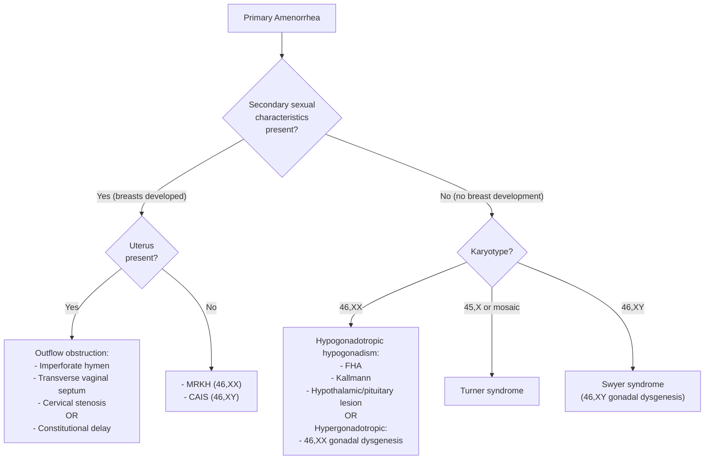
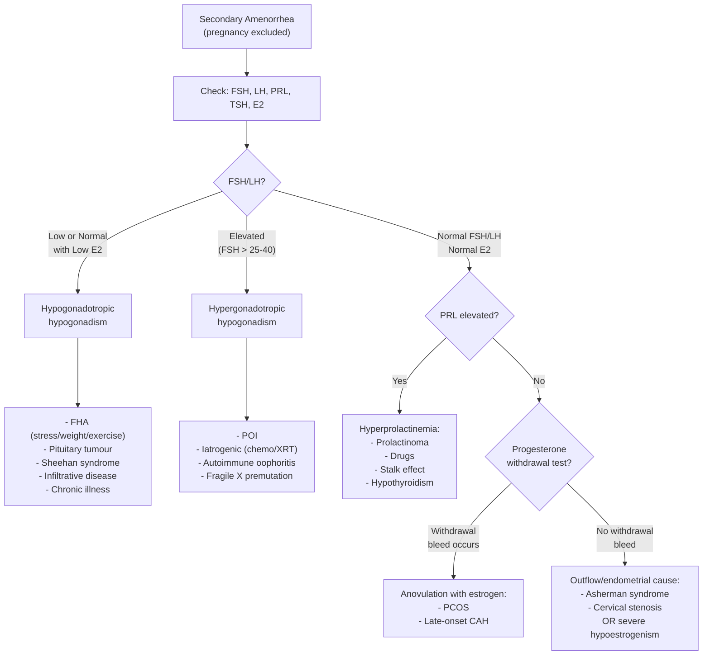
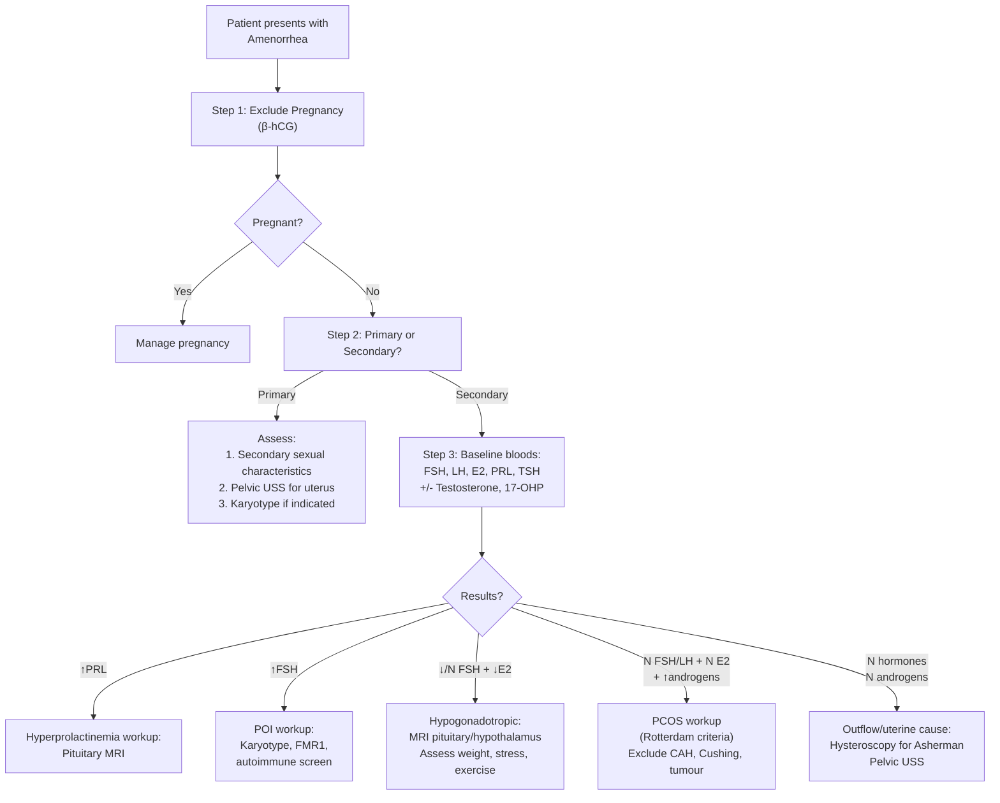

## Differential Diagnosis of Amenorrhea

The entire approach to the differential diagnosis of amenorrhea hinges on one principle you should tattoo on your brain: ***amenorrhea is a symptom, NOT a diagnosis*** [1][2]. Your job is to walk down the HPO-uterine axis and figure out where the chain is broken. The DDx is therefore **anatomically structured** — and then refined by a few key discriminators: Is it primary or secondary? Are secondary sexual characteristics present? What are the gonadotropin levels?

---

### 1. The First and Most Important "Differential": Physiological Causes

Before you launch into an elaborate workup, always exclude the **physiological causes** first. This is not optional — it is the most commonly examined pitfall.

> ***Do not forget the PHYSIOLOGICAL causes e.g. pregnancy!*** [1][2]

| Physiological Cause | Mechanism | How to Exclude |
|---|---|---|
| **Pregnancy** | hCG from trophoblast → maintains corpus luteum → continued progesterone → no endometrial shedding | Urine/serum β-hCG |
| **Lactation** | Suckling reflex → ↑prolactin → suppresses GnRH pulsatility → anovulation | History |
| **Menopause** | Exhaustion of ovarian follicular reserve → ↓estrogen, ↑FSH | Age, FSH level |
| **Pre-menarche** | HPO axis not yet activated | Age, Tanner staging |

---

### 2. Structured Differential Diagnosis by Compartment

The **compartment model** is the cleanest way to generate your differential. For each compartment, I will explain *why* each condition causes amenorrhea, so you can reason through any exam question from first principles rather than rote recall.

#### 2.1 Compartment IV — Hypothalamic Causes (↓GnRH → ↓FSH/LH → ↓Estrogen)

The hypothalamus is the "master switch." If GnRH pulses are disrupted, everything downstream grinds to a halt.

| Condition | Why It Causes Amenorrhea | Primary or Secondary? |
|---|---|---|
| ***Functional Hypothalamic Amenorrhea (FHA): stress, weight loss, excessive exercise*** [1][3] | ↓Energy availability → ↓leptin → ↓kisspeptin → ↓GnRH pulsatility; ↑CRH/cortisol directly suppresses GnRH | Usually secondary; can be primary if onset pre-menarche |
| ***Anorexia nervosa*** [4][7] | Subset of FHA — profound energy deficit → ↓leptin + ↑cortisol → GnRH suppression. ***Amenorrhea occurs early in the disease course*** [7] | Usually secondary (primary if pre-pubertal onset) |
| ***Kallmann syndrome*** [3][5] | Congenital GnRH deficiency due to failed migration of GnRH neurons from olfactory placode → no GnRH → no FSH/LH → no ovarian stimulation. ***Associated with anosmia*** [5] | **Primary** (with absent secondary sexual characteristics) |
| **Hypothalamic tumours** (craniopharyngioma, glioma) | Structural destruction of GnRH neurons | Primary or secondary depending on age of onset |
| **Infiltrative diseases** (sarcoidosis, histiocytosis X, hemochromatosis) [5] | Granulomatous/iron deposition damage to hypothalamic nuclei | Usually secondary |
| **Cranial irradiation / head trauma** [5] | Direct damage to hypothalamic neurons | Secondary |
| **Chronic systemic illness** (renal failure, uncontrolled DM, celiac disease) | Metabolic derangement → functional GnRH suppression (body "decides" it's not safe to reproduce) | Secondary |
| **Drugs** (opioids, GnRH agonists given continuously, marijuana) | Opioids → suppress GnRH; continuous GnRH → receptor downregulation | Secondary |

#### 2.2 Compartment III — Pituitary Causes (↓FSH/LH despite intact hypothalamus, or ↑PRL)

| Condition | Why It Causes Amenorrhea | Primary or Secondary? |
|---|---|---|
| ***Hyperprolactinemia*** [1][3] | ↑PRL → directly inhibits GnRH pulsatility + inhibits gonadotroph FSH/LH release → hypogonadotropic hypogonadism → anovulation | Usually secondary |
| ***— Prolactinoma*** [1] | Autonomous PRL secretion by tumour | Secondary |
| ***— Drug-induced*** (antipsychotics, metoclopramide, domperidone) [1] | D2 receptor blockade → loss of tonic dopamine inhibition of PRL | Secondary |
| **— Stalk effect** (non-functioning pituitary adenoma, craniopharyngioma) | Compression of pituitary stalk → interruption of dopamine delivery from hypothalamus to lactotrophs → ↑PRL (usually < 100 ng/mL, unlike prolactinoma which can be very high) | Secondary |
| **— Hypothyroidism** | ↑TRH → stimulates lactotrophs → ↑PRL | Secondary |
| ***Sheehan syndrome*** [5] | Massive postpartum hemorrhage → hypovolemia → ischemic necrosis of enlarged postpartum pituitary → panhypopituitarism → ↓FSH/LH (+ ↓PRL → failure to lactate, ↓ACTH, ↓TSH) | Secondary (specifically postpartum) |
| ***Pituitary apoplexy*** [5] | Sudden hemorrhage into pituitary adenoma → acute panhypopituitarism | Secondary (acute onset) |
| **Other pituitary adenomas** (non-functioning, GH-secreting) [8] | Mass effect → compression/destruction of gonadotrophs; GH-secreting: may co-secrete PRL (30%) | Secondary |
| ***Lymphocytic hypophysitis*** [5] | Autoimmune inflammation of pituitary (classically postpartum) → destruction of gonadotrophs | Secondary |
| **Empty sella syndrome** | Regression/compression of pituitary tissue → ↓gonadotroph function | Secondary |
| **Surgery / radiation to sella** [5] | Iatrogenic destruction of pituitary tissue | Secondary |

#### 2.3 Compartment II — Ovarian Causes (↑↑FSH, ↑LH → Hypergonadotropic Hypogonadism)

The ovaries fail, so there is no estrogen/progesterone. The pituitary "senses" the lack of negative feedback and cranks up FSH/LH — but the ovaries cannot respond.

| Condition | Why It Causes Amenorrhea | Primary or Secondary? |
|---|---|---|
| ***Premature ovarian insufficiency (POI)*** [1][3] | Loss of functional follicles before age 40 → no estrogen production → no endometrial proliferation; ↓estrogen → loss of negative feedback → ↑↑FSH | Primary (if follicle depletion before puberty) or secondary |
| ***Turner syndrome (45,X)*** [1] | Streak gonads with accelerated follicular atresia → no estrogen | **Primary** (with absent secondary sexual characteristics + short stature) |
| ***Gonadal dysgenesis (46,XY — Swyer syndrome)*** | Defective testicular development in XY → streak gonads → no testosterone/estrogen; Müllerian structures present (no AMH) | **Primary** |
| **Autoimmune oophoritis** [1] | Immune-mediated destruction of ovarian follicles (may be part of autoimmune polyendocrine syndrome) | Secondary (or primary) |
| ***Iatrogenic: chemotherapy, pelvic radiation, bilateral oophorectomy*** [1] | Direct destruction of follicles (alkylating agents are most gonadotoxic) or surgical removal | Secondary |
| **Infections** (mumps oophoritis, TB) [3] | Inflammatory destruction of ovarian parenchyma | Secondary |
| **Galactosemia** | Galactose-1-phosphate accumulation is directly toxic to ovarian follicles | Primary |
| **Resistant ovary syndrome (Savage syndrome)** | Follicles present but resistant to FSH/LH stimulation (FSH receptor mutation or anti-FSH receptor antibodies) → clinically indistinguishable from POI | Primary or secondary |
| **Fragile X premutation** [1] | FMR1 gene premutation → accelerated follicular atresia (mechanism not fully understood; possibly toxic RNA gain-of-function) | Secondary (POI) |

#### 2.4 Compartment II (Special) — Anovulatory with Normal/Near-Normal Estrogen

| Condition | Why It Causes Amenorrhea | Primary or Secondary? |
|---|---|---|
| ***Polycystic ovary syndrome (PCOS)*** [1][2][3] | Hyperinsulinemia → ↑thecal androgens + ↓SHBG → hyperandrogenism; disordered folliculogenesis → no dominant follicle → anovulation → no progesterone → amenorrhea/oligomenorrhea. ***Rotterdam criteria: 2 of 3 — oligo-anovulation, clinical/biochemical hyperandrogenism, polycystic ovaries on USS (follicle number per ovary ≥20 and/or ovarian volume ≥10mL)*** [1][2] | Secondary (rarely primary if severe) |

<Callout title="PCOS vs. POI — The Key Hormonal Distinction">
- **PCOS**: FSH normal or low-normal, LH often elevated (LH:FSH > 2:1), **estrogen is actually normal or even elevated** (from peripheral aromatization of androgens). The problem is **anovulation**, not estrogen deficiency.
- **POI**: FSH markedly elevated (>25–40 IU/L), estrogen is **low**. The problem is **follicular depletion/failure**.

This distinction has direct management implications: PCOS needs cycle regulation and endometrial protection (risk of hyperplasia from unopposed estrogen); POI needs estrogen replacement (risk of osteoporosis and cardiovascular disease from estrogen deficiency).
</Callout>

#### 2.5 Compartment I — Uterine / Outflow Tract Causes (Normal Hormones)

The HPO axis is completely intact — hormones are cycling normally. The problem is either **no functional endometrium** or **mechanical obstruction**.

| Condition | Why It Causes Amenorrhea | Primary or Secondary? |
|---|---|---|
| ***Müllerian agenesis (MRKH syndrome)*** [1][3] | Congenital absence of uterus and upper 2/3 of vagina → no endometrium to shed. 46,XX, normal ovaries → normal secondary sexual characteristics | **Primary** |
| ***Imperforate hymen*** [1] | Membrane blocks outflow → menstrual blood trapped (hematocolpos) → no visible menses despite normal cycling. Presents with cyclical pain + bulging bluish membrane | **Primary** |
| ***Transverse vaginal septum*** [1] | Same mechanism as imperforate hymen — outflow obstruction | **Primary** |
| ***Cervical / vaginal atresia*** [1] | Congenital narrowing or absence of cervical canal / vagina | **Primary** |
| ***Asherman syndrome (intrauterine adhesions)*** [1][3] | Intrauterine synechiae from endometrial trauma (D&C, endometritis) → obliterate uterine cavity → no functional endometrium to shed | **Secondary** |
| ***TB endometritis*** [1] | Mycobacterial infection destroys endometrium → Asherman-like picture; particularly relevant in endemic areas | Secondary |
| ***Complete androgen insensitivity syndrome (CAIS)*** [1] | 46,XY, non-functional AR → female phenotype; AMH causes Müllerian regression → no uterus → no menses. (Can also be classified under "androgen-related") | **Primary** |

#### 2.6 Other Endocrine Causes

| Condition | Why It Causes Amenorrhea |
|---|---|
| ***Hypothyroidism*** [1] | ↑TRH → ↑PRL → suppresses GnRH; also altered SHBG and sex steroid metabolism |
| **Hyperthyroidism** | ↑SHBG → ↓free estradiol → menstrual irregularity (usually oligomenorrhea) |
| ***Cushing syndrome*** [6] | ↑Cortisol → suppresses GnRH pulsatility; ↑adrenal androgens → anovulation. ***Oligo-/amenorrhea is a reproductive manifestation of Cushing's*** [6] |
| ***Congenital adrenal hyperplasia (non-classic/late-onset)*** [1][6] | ↓21-hydroxylase → shunting to androgen pathway → hyperandrogenism → anovulation. Can mimic PCOS. ***Diagnosed by elevated 17-OHP*** |
| **Androgen-secreting tumours** (ovarian: Sertoli-Leydig; adrenal: carcinoma) | Very high androgens → suppress GnRH + directly impair folliculogenesis. Rapid onset virilization is a red flag |
| ***Uncontrolled diabetes mellitus*** [7] | Metabolic derangement → functional hypothalamic suppression |

---

### 3. Primary Amenorrhea — Discriminating by Secondary Sexual Characteristics

This is the highest-yield clinical decision node for **primary amenorrhea** in exams:

**Key logic:**
1. **Breast development is a bioassay for estrogen.** If breasts have developed, the patient has been exposed to estrogen → the ovaries (or at least aromatization) are working to some degree.
2. **If breasts are present but no uterus** → either MRKH (46,XX, Müllerian agenesis) or CAIS (46,XY, no uterus because AMH caused Müllerian regression). Distinguish by karyotype and presence/absence of pubic hair (absent in CAIS because androgen receptors don't work).
3. **If no breast development** → the ovaries are not producing estrogen. Now ask *why*: is the problem upstream (low FSH/LH = hypogonadotropic, e.g., Kallmann) or at the ovary level (high FSH = hypergonadotropic, e.g., Turner)?

---

### 4. Secondary Amenorrhea — Systematic Differential

For **secondary amenorrhea**, the differential is dominated by acquired causes. After excluding pregnancy, the approach uses **gonadotropin levels + prolactin + thyroid function** to categorize:

<Callout title="The Progesterone Withdrawal Test — What It Tells You" type="idea">
Give medroxyprogesterone acetate 10mg daily for 5–10 days, then stop.

- **If withdrawal bleeding occurs within 2–7 days**: the endometrium was primed by estrogen (estrogen is present) and the outflow tract is patent. The problem is **anovulation** (most commonly PCOS). The progesterone you gave mimicked corpus luteum function, and its withdrawal triggered shedding.
- **If NO withdrawal bleeding**: either (a) there is **no estrogen** to prime the endometrium (severe hypoestrogenism — check FSH), or (b) the endometrium/outflow tract is damaged (Asherman). To distinguish, give estrogen + progesterone sequentially — if still no bleed, the problem is anatomical (Asherman).

This test is less commonly used now (we have better hormonal assays and imaging), but it remains conceptually important and is commonly examined.
</Callout>

---

### 5. Key Differentiating Features — Comparison Table

| Feature | FHA | PCOS | POI | Hyperprolactinemia | Asherman | Turner | MRKH | CAIS |
|---|---|---|---|---|---|---|---|---|
| **Type** | 2° (rarely 1°) | 2° | 2° (or 1°) | 2° | 2° | 1° | 1° | 1° |
| **FSH** | ↓ | N or ↓ | ↑↑ | ↓ or N | N | ↑↑ | N | N (or ↑) |
| **LH** | ↓ | ↑ (LH:FSH > 2) | ↑ | ↓ or N | N | ↑ | N | ↑ (male range) |
| **Estrogen** | ↓ | N or ↑ | ↓ | ↓ or N | N | ↓ | N | N (aromatized) |
| **Androgens** | ↓ | ↑ | ↓ | N | N | ↓ | N | ↑ (testosterone) |
| **Prolactin** | N | N | N | ↑ | N | N | N | N |
| **Breasts** | Present (if 2°) | Present | Present (if 2°) | Present | Present | Absent | Present | Present |
| **Uterus** | Present | Present | Present | Present | Present (adhesions) | Present | **Absent** | **Absent** |
| **Key clue** | Low BMI, stress | Hirsutism, acne, obesity | Hot flushes before 40 | Galactorrhea, headache | Post-D&C, no bleed to E+P | Short, webbed neck | Normal phenotype, blind vagina | No pubic hair, inguinal mass |

---

### 6. Important "Mimickers" and Pitfalls

***Secondary amenorrhea differential is broad — do not forget these commonly missed causes*** [7]:

| Mimicker | Why It's Missed | How to Identify |
|---|---|---|
| **Pregnancy** | Most embarrassing miss in medicine | β-hCG — always first |
| **Hypothyroidism** | Presents subtly; amenorrhea may be the presenting complaint | TSH — always checked in amenorrhea workup |
| ***Cushing syndrome*** [6] | Non-specific features (obesity, mood, acne) overlap with PCOS | ***More specific features: spontaneous bruising, proximal myopathy, purple striae, thin skin, supraclavicular fat pads*** [6]. Screen with overnight DST, 24h UFC, or late-night salivary cortisol [9] |
| ***Non-classic CAH*** | Mimics PCOS almost perfectly (hirsutism, acne, anovulation) | ***Early-morning 17-OHP*** (elevated in CAH; normal in PCOS) [6] |
| **Androgen-secreting tumour** | Rare but dangerous — rapid onset virilization in months | Very high testosterone ( > 5 nmol/L or > 200 ng/dL), rapid progression, imaging |
| **Drug-induced amenorrhea** | Patients may not volunteer medication history | Ask specifically about antipsychotics, depot MPA, opioids, GnRH agonists |
| **Post-pill amenorrhea** | Amenorrhea after stopping OCP — usually resolves in 3–6 months; if persistent, investigate as secondary amenorrhea | History; if > 6 months, full workup |

<Callout title="Cushing's vs. PCOS — The Exam Favourite" type="error">
Both can present with central obesity, acne, hirsutism, and amenorrhea. The key is that Cushing's has **catabolic** features that PCOS does not:
- Proximal myopathy (can't rise from chair), thin skin with easy bruising, purple (not white) striae, supraclavicular fat pads
- ***Consider CAH as a differential if young-onset with prominent androgen excess and primary amenorrhea*** [6]
</Callout>

---

### 7. Approach to Differential Diagnosis — Putting It All Together

The following is the recommended clinical reasoning sequence:

---

<Callout title="High Yield Summary — Differential Diagnosis of Amenorrhea">

1. **Always exclude pregnancy first** — the single most common cause of secondary amenorrhea
2. **Classify by compartment** using gonadotropins as the key discriminator:
   - ↓FSH/LH = hypothalamic-pituitary problem (FHA, prolactinoma, Sheehan, Kallmann)
   - ↑↑FSH = ovarian failure (POI, Turner, iatrogenic)
   - Normal FSH/LH + normal E2 + ↑androgens = anovulation (PCOS, non-classic CAH)
   - Normal everything = outflow/uterine (Asherman, MRKH)
3. **For primary amenorrhea**: first assess secondary sexual characteristics and uterus presence
4. **PCOS is the most common pathological cause of secondary amenorrhea** — but always rule out mimickers (Cushing, CAH, androgen-secreting tumour)
5. **Cushing vs. PCOS**: look for catabolic features (myopathy, thin skin, purple striae, bruising)
6. **Non-classic CAH vs. PCOS**: measure early-morning 17-OHP
7. **Asherman syndrome**: suspect in any secondary amenorrhea following uterine instrumentation with normal hormones
8. **Progesterone withdrawal test**: bleeding = anovulation with estrogen present; no bleeding = either no estrogen or endometrial/outflow problem

</Callout>

---

<ActiveRecallQuiz
  title="Active Recall - Differential Diagnosis of Amenorrhea"
  items={[
    {
      question: "A 28-year-old woman presents with 8 months of amenorrhea following a D&C for incomplete miscarriage. FSH, LH, estradiol, prolactin, and TSH are all normal. What is the most likely diagnosis, and what investigation would confirm it?",
      markscheme: "Asherman syndrome (intrauterine adhesions). Confirmed by hysteroscopy (gold standard) which directly visualizes intrauterine synechiae. Hormones are normal because the HPO axis is intact; the problem is endometrial destruction/scarring."
    },
    {
      question: "How do you distinguish PCOS from non-classic CAH in a young woman presenting with hirsutism, acne, and oligomenorrhea? Name the specific blood test and expected result for each condition.",
      markscheme: "Measure early-morning 17-hydroxyprogesterone (17-OHP). In non-classic CAH: 17-OHP is elevated (due to 21-hydroxylase deficiency causing upstream steroid accumulation). In PCOS: 17-OHP is normal. Both may have elevated testosterone and clinical hyperandrogenism, but the steroid precursor profile distinguishes them."
    },
    {
      question: "In primary amenorrhea, a patient has normal breast development but absent uterus on pelvic ultrasound. Name two conditions in the differential and state one key clinical feature that differentiates them.",
      markscheme: "Two conditions: (1) MRKH syndrome (46,XX, Mullerian agenesis) and (2) Complete Androgen Insensitivity Syndrome (CAIS, 46,XY). Key differentiator: pubic and axillary hair is NORMAL in MRKH (functioning androgen receptors) but ABSENT or sparse in CAIS (non-functional androgen receptors). Alternatively: karyotype (XX vs XY) or presence of testes in inguinal canal in CAIS."
    },
    {
      question: "A woman with secondary amenorrhea has FSH 85 IU/L, LH 60 IU/L, and estradiol 40 pmol/L. She is 32 years old. What is the diagnosis, and name three causes you would investigate.",
      markscheme: "Diagnosis: Premature Ovarian Insufficiency (POI) - ovarian failure before age 40 with elevated FSH. Three causes to investigate: (1) Karyotype for Turner mosaicism or X chromosome abnormalities, (2) FMR1 gene testing for Fragile X premutation, (3) Autoimmune screen (anti-adrenal antibodies, thyroid antibodies, as part of autoimmune polyendocrine syndrome). Also consider iatrogenic (chemo/XRT history)."
    },
    {
      question: "Explain the logic behind the progesterone withdrawal test. What does a positive result (withdrawal bleeding) indicate, and what does a negative result indicate?",
      markscheme: "Positive (withdrawal bleed): endometrium was primed by estrogen, meaning estrogen is present and outflow tract is patent. The problem is anovulation (e.g., PCOS). Progesterone mimicked corpus luteum; its withdrawal triggered endometrial shedding. Negative (no bleed): either (a) insufficient estrogen to prime the endometrium (severe hypoestrogenism, check FSH) or (b) endometrial/outflow tract destruction (Asherman). To distinguish: give combined estrogen + progesterone; if still no bleed, the problem is anatomical."
    }
  ]}
/>

---

## References

[1] Lecture slides: Block C - Climacteric symptoms_ menopause and related illness; amenorrhoea.pdf
[2] Lecture slides: GC 114. Climacteric symptoms menopause and related illness; amenorrhoea.pdf
[3] Senior notes: Maksim Medicine Notes.pdf (Endocrinology, p79)
[4] Senior notes: Ryan Ho Psychiatry.pdf (Eating Disorders, p210–214)
[5] Senior notes: Ryan Ho Endocrine.pdf (Hypopituitarism, p112)
[6] Senior notes: Ryan Ho Endocrine.pdf (Cushing's Syndrome, p60–61)
[7] Senior notes: Ryan Ho Psychiatry.pdf (Anorexia Nervosa DDx, p214)
[8] Senior notes: Ryan Ho Endocrine.pdf (Acromegaly, p111)
[9] Senior notes: Ryan Ho Chemical Path.pdf (Diagnosis of Cushing Syndrome, p29)
