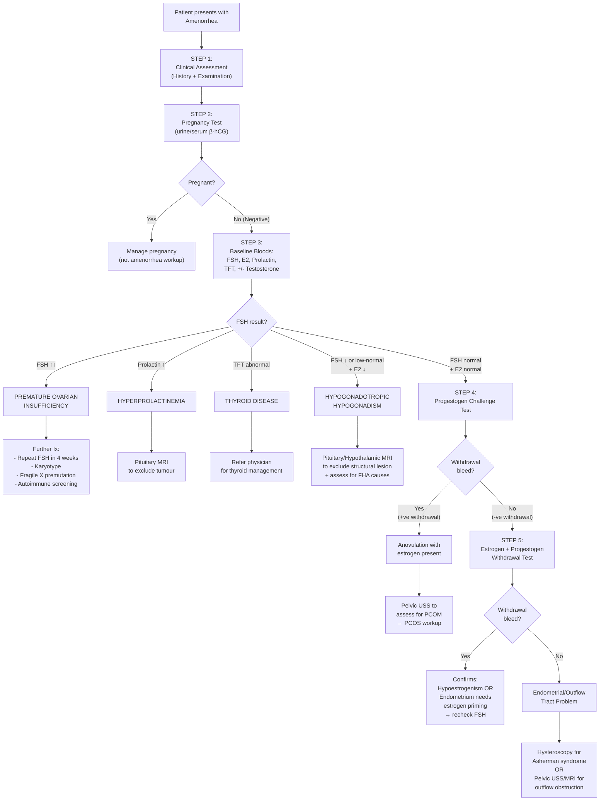

## Diagnostic Criteria, Algorithm, and Investigations for Amenorrhea

---

### 1. Diagnostic Criteria — Defining When to Investigate

Amenorrhea itself does not have "diagnostic criteria" in the way that, say, SLE or rheumatoid arthritis does. Instead, there are **thresholds that define when the symptom warrants investigation**, and then **diagnostic criteria for the underlying causes**.

#### 1.1 When to Investigate

| Scenario | Threshold | Rationale |
|---|---|---|
| **Primary amenorrhea** | ***No menses by age 15 with secondary sexual characteristics present, OR no menses by age 13 with no secondary sexual characteristics*** [1][2] | By age 15, >98% of girls with breast development have menstruated; by age 13, >95% have begun puberty. Failure to meet these milestones signals a break in the HPO-uterine axis |
| **Secondary amenorrhea** | ***Absence of menses for ≥3 months (previously regular cycles) or ≥6 months (previously irregular cycles)*** [1][2] | Occasional missed periods can be physiological; sustained absence indicates a pathological process |
| **Any reproductive-age woman with missed period** | Immediately | Rule out pregnancy — always the first test |

#### 1.2 Diagnostic Criteria for Key Underlying Causes

These are not criteria for "amenorrhea" per se, but for the conditions that *cause* amenorrhea. Understanding them is essential because your investigation strategy is designed to meet or exclude these criteria.

##### A. ***Premature Ovarian Insufficiency (POI)*** [1][2]

| Criterion | Detail |
|---|---|
| Age | < 40 years |
| **_Amenorrhea_** | **_≥4 months of oligo-/amenorrhea_** |
| **_FSH_** | **_Elevated FSH > 25 IU/L on two occasions at least 4 weeks apart_** (ESHRE 2016 guidelines; some use > 40 IU/L) |

*Why two measurements 4 weeks apart?* Because a single elevated FSH can occur transiently (e.g., during a random anovulatory cycle). Repeating confirms that the elevation is sustained, reflecting genuine ovarian failure rather than a transient fluctuation.

##### B. ***Polycystic Ovary Syndrome (PCOS) — Rotterdam Criteria (2003, revised 2018)*** [1][2]

***Need 2 out of 3:*** [1][2]
1. **_Oligo-/anovulation_** (clinically manifesting as oligo-/amenorrhea)
2. **_Clinical and/or biochemical hyperandrogenism_** (hirsutism, acne, elevated free testosterone / FAI / DHEA-S)
3. **_Polycystic ovaries on ultrasound_**: ***Follicle number per ovary ≥20 and/or ovarian volume ≥10 mL*** [1][2] (updated from the older threshold of ≥12 follicles, reflecting improved ultrasound resolution)

***Must exclude other causes of androgen excess*** (non-classic CAH, Cushing's, androgen-secreting tumour, thyroid disease, hyperprolactinemia) [1][2]

<Callout title="PCOS Diagnostic Subtleties" type="idea">
- In **adolescents**, diagnosis should be made cautiously: irregular cycles are normal for 2–3 years post-menarche, and polycystic ovarian morphology is common in adolescents. Use clinical + biochemical hyperandrogenism with anovulation, not ultrasound alone.
- The **2023 International PCOS Guidelines** emphasize that anti-Müllerian hormone (AMH) can be used as an alternative to pelvic USS for diagnosing polycystic ovarian morphology in adults (AMH > 35 pmol/L in adults suggests PCOM).
</Callout>

##### C. ***Functional Hypothalamic Amenorrhea (FHA)***

FHA is a **diagnosis of exclusion**. There are no specific "diagnostic criteria" per se. The diagnosis requires:
1. Amenorrhea (primary or secondary)
2. Low or normal FSH/LH with low estradiol (hypogonadotropic hypogonadism)
3. **Exclusion of organic hypothalamic-pituitary disease** (normal pituitary MRI)
4. Identifiable functional cause: stress, low energy availability, excessive exercise, low body weight

##### D. ***Hyperprolactinemia***

- Serum prolactin **> 500 mU/L** (or > 25 ng/mL) on a **non-stressed, fasting sample**
- Mild elevations (500–1000 mU/L) → consider drugs, stress, stalk effect, hypothyroidism
- Moderate elevations (1000–5000 mU/L) → microprolactinoma, drugs
- Marked elevations ( > 5000 mU/L) → macroprolactinoma (PRL level generally correlates with tumour size)

*Why non-stressed?* Prolactin is a stress hormone — venepuncture itself can transiently raise it. Ideally, insert a cannula, rest the patient for 30 minutes, then sample [5].

##### E. ***Turner Syndrome***

- Confirmed by **karyotype**: 45,X (or mosaic variants such as 45,X/46,XX)
- Clinical features support but karyotype is definitive

---

### 2. Diagnostic Algorithm

***The diagnostic approach to amenorrhea follows a systematic, stepwise algorithm*** [1][2]. The lecture slides present a clear algorithm that we'll now expand with full clinical reasoning [2]:

Let me walk through each step and explain the *reasoning* behind it:

---

### 3. Step-by-Step Investigation Approach

#### STEP 1: Clinical Assessment

This is the most important "investigation" — a thorough history and examination will narrow your differential dramatically *before* you order a single blood test.

**Key history elements:**
- Menstrual history (primary vs. secondary, cyclical pain)
- Weight changes, exercise habits, stress levels (→ FHA)
- Drug history (antipsychotics, OCP, depot MPA, opioids)
- Obstetric history: previous D&C, postpartum hemorrhage (→ Asherman, Sheehan)
- Galactorrhea (→ hyperprolactinemia)
- Hirsutism/acne (→ PCOS, CAH, Cushing's)
- Hot flushes, vaginal dryness (→ hypoestrogenism/POI)
- Sense of smell (→ Kallmann)
- Chronic illness symptoms

**Key examination elements:**
- BMI, nutritional status
- Tanner staging (primary amenorrhea)
- Hirsutism score (Ferriman-Gallwey), acne, acanthosis nigricans
- Visual fields (pituitary mass)
- Breast examination (galactorrhea, Tanner stage)
- External genitalia and vaginal examination (imperforate hymen, vaginal septum, blind-ending vagina)
- Dysmorphic features (Turner)

#### STEP 2: Pregnancy Test — Always First

| Test | Detail |
|---|---|
| **Urine β-hCG** | Qualitative; rapid; sensitive from ~1 week post-missed period |
| **Serum β-hCG** | Quantitative; more sensitive (detects from ~6–8 days post-ovulation); use if high clinical suspicion with negative urine test |

*Why is this step 1 in the algorithm?* Because pregnancy is the **most common cause** of secondary amenorrhea, and every subsequent investigation becomes meaningless (or even harmful, e.g., X-rays) if pregnancy is not excluded.

#### STEP 3: Baseline Hormonal Panel

***Investigations: FSH, LH, E2, PRL, TFT, testosterone*** [1][2]

This is the **critical discriminating panel**. Each test answers a specific question:

| Test | What It Tells You | Key Values & Interpretation |
|---|---|---|
| **_FSH_** | Is the pituitary driving the ovary, and is the ovary responding? | **↑↑ ( > 25–40 IU/L)**: Ovarian failure — pituitary is "screaming" but ovary can't respond (POI, Turner). **↓ or low-normal**: Hypothalamic-pituitary problem — inadequate drive (FHA, pituitary lesion). **Normal**: Either anovulation with estrogen present (PCOS) or outflow tract problem |
| **_LH_** | Helps refine the picture, especially LH:FSH ratio | **↑LH with normal/low FSH (LH:FSH > 2:1)**: Classic (but not diagnostic) for PCOS — tonic LH hypersecretion due to ↑GnRH pulse frequency. **↓LH**: Hypogonadotropic hypogonadism |
| **_E2 (Estradiol)_** | Is the ovary producing estrogen? | **Low ( < 100 pmol/L)**: Hypoestrogenic state — either ovarian failure (high FSH) or hypothalamic-pituitary suppression (low FSH). **Normal/High**: Estrogen is present → anovulation or outflow obstruction |
| **_PRL (Prolactin)_** | Is prolactin suppressing the HPO axis? | **↑ ( > 500–1000 mU/L)**: Investigate cause — prolactinoma, drugs, hypothyroidism, stalk effect. ***Mildly elevated PRL can also occur in PCOS*** (due to increased estrone from peripheral aromatization) |
| **_TFT (TSH ± fT4)_** | Is thyroid disease contributing? | **↑TSH**: Hypothyroidism → ↑TRH → ↑PRL → GnRH suppression. **↓TSH + ↑fT4**: Hyperthyroidism → altered SHBG, menstrual irregularity |
| **_Testosterone_** | Is there androgen excess? | **Mildly elevated (1.5–5 nmol/L)**: PCOS, non-classic CAH. ***Markedly elevated ( > 5 nmol/L)**: Androgen-secreting tumour*** — urgent imaging |

*Why this specific panel?* Because with just these 5–6 tests, you can categorize the patient into one of the major diagnostic groups (hypogonadotropic, hypergonadotropic, normogonadotropic, hyperprolactinemic, thyroid-related). This is the most cost-effective way to narrow a broad differential.

<Callout title="Interpreting the FSH — The Single Most Important Test" type="error">
FSH is the pivotal discriminator:
- **High FSH** = ovary is failing (the pituitary has lost negative feedback and is overproducing FSH)
- **Low FSH** = the pituitary is not stimulating the ovary (either hypothalamic GnRH failure or pituitary disease)
- **Normal FSH with amenorrhea** = the axis is cycling but something else is wrong (anovulation without follicular failure, or outflow obstruction)

A single FSH value must be interpreted in clinical context — a "normal" FSH in a 35-year-old with amenorrhea is very different from a "normal" FSH in a 16-year-old with primary amenorrhea.
</Callout>

#### STEP 4: Progestogen Challenge Test (Provera Withdrawal Test)

***Progestogen challenge test*** [1][2]

| Detail | Explanation |
|---|---|
| **Protocol** | Medroxyprogesterone acetate (Provera) 10 mg daily for 5–10 days, then stop |
| **Positive result** | Withdrawal bleed within 2–7 days of stopping |
| **Negative result** | No bleeding |

**What does this test actually do?**

Think of it from first principles:
- Progesterone acts on an **estrogen-primed endometrium** to induce secretory changes
- When progesterone is **withdrawn**, the secretory endometrium sheds → withdrawal bleed
- For this to happen, two conditions must be met:
  1. **The endometrium must have been primed by estrogen** (i.e., estrogen is present and acting)
  2. **The outflow tract must be patent** (blood can exit)

| Result | Interpretation | Most Likely Diagnoses |
|---|---|---|
| **_Positive (+ve) withdrawal bleed_** | Estrogen is present and the endometrium is responsive; outflow is patent. The problem is **anovulation** — no corpus luteum forming, so no endogenous progesterone → no natural shedding | ***PCOS*** (most common), non-classic CAH, other anovulatory states |
| **_Negative (-ve) no bleed_** | Either (a) **no estrogen** to prime the endometrium, OR (b) **endometrium is destroyed/outflow obstructed** | Need further testing → proceed to E+P withdrawal test |

#### STEP 5: Estrogen + Progestogen (E+P) Withdrawal Test

***E+P withdrawal test*** [1][2]

| Detail | Explanation |
|---|---|
| **Protocol** | Give conjugated estrogen (e.g., estradiol valerate 2 mg daily or equivalent) for 21 days + add progestogen for the last 10–14 days, then stop |
| **Positive result** | Withdrawal bleed after stopping |
| **Negative result** | No bleed despite exogenous estrogen + progestogen |

| Result | Interpretation | Diagnosis |
|---|---|---|
| **Positive bleed** | The endometrium *can* respond — it just needed estrogen first. This confirms **hypoestrogenism** as the cause. Outflow tract is patent | Go back to FSH: if ↑ → POI; if ↓/N → hypothalamic-pituitary cause |
| **Negative — no bleed** | Even with exogenous E+P, no bleeding → the endometrium itself is destroyed or the outflow tract is obstructed | ***Asherman syndrome*** or outflow tract obstruction → proceed to **hysteroscopy** |

*Why do we do this two-step approach?* Because it sequentially tests two variables: (1) Is estrogen present? (progestogen-only test) and (2) Can the endometrium respond to hormones at all? (E+P test). If even the E+P test is negative, the problem is mechanical, not hormonal.

---

### 4. Further Investigations — Depending on the Cause

***Other investigations depend on the suspected underlying cause*** [1][2]:

#### 4.1 Hormonal — Second-Line Tests

| Test | When to Order | Key Findings |
|---|---|---|
| ***SHBG (Sex Hormone-Binding Globulin)*** [1][2] | Suspected PCOS | **↓SHBG** → ↑free androgens (hyperinsulinemia suppresses SHBG production by hepatocytes). Calculate **Free Androgen Index (FAI)** = Total Testosterone × 100 / SHBG; FAI > 5 suggests hyperandrogenism |
| ***17-OH progesterone (17-OHP)*** [1][2] | Suspected non-classic CAH | **Early morning sample**. Normal: < 6 nmol/L. Elevated ( > 6–10 nmol/L): suggests 21-hydroxylase deficiency. Markedly elevated ( > 30 nmol/L): diagnostic of classic CAH. Borderline: proceed to ACTH stimulation test (250 μg synacthen → measure 17-OHP at 60 min; > 30 nmol/L confirms CAH) |
| **DHEA-S** | Suspected adrenal androgen source | Elevated → adrenal source of androgens (adrenal tumour, CAH, adrenal hyperplasia). Very high levels ( > 18.9 μmol/L) → adrenal tumour |
| **Cortisol workup** (overnight DST, 24h UFC, late-night salivary cortisol) [9] | Suspected Cushing's syndrome | See Cushing's diagnostic algorithm. Positive screening → refer endocrinology |
| ***GnRH stimulation test*** [1][2] | Distinguishing hypothalamic vs. pituitary cause | Administer GnRH (gonadorelin 100 μg IV) → measure LH/FSH at 0, 30, 60 min. **Normal/exaggerated response**: hypothalamic cause (pituitary is intact but understimulated). **Blunted/absent response**: pituitary cause (gonadotrophs are damaged). Caveat: prolonged GnRH deficiency may cause pituitary atrophy → false blunted response; may need GnRH priming first |
| **AMH (Anti-Müllerian Hormone)** | Assessing ovarian reserve; alternative to USS for PCOM in PCOS | **Very low/undetectable**: confirms severe ovarian reserve depletion (POI). **Elevated ( > 35 pmol/L in adults)**: suggestive of polycystic ovarian morphology (high follicle count → high AMH because each small antral follicle produces AMH) |
| **Inhibin B** | Rarely used; supplementary for ovarian reserve | Low in POI |

#### 4.2 Genetic Tests

| Test | When to Order | Key Findings |
|---|---|---|
| ***Karyotype*** [1][2] | ***Primary amenorrhea (all cases), POI ( < 40 years)*** [1][2] | **45,X** (or mosaic): Turner syndrome. **46,XY**: Swyer syndrome or CAIS. **46,XX**: Normal female karyotype (MRKH, FHA, etc.) |
| ***FMR1 gene testing (Fragile X premutation)*** [1][2] | ***POI*** [1][2] | **55–200 CGG repeats** (premutation range): associated with accelerated ovarian failure. Important for genetic counselling — premutation carriers have 50% risk of passing full mutation (>200 repeats → Fragile X syndrome) to offspring |
| **SRY gene** | If 46,XY found on karyotype | Confirms Y chromosome material → assess gonadal malignancy risk |

*Why karyotype in all primary amenorrhea?* Because chromosomal abnormalities (Turner variants, XY gonadal dysgenesis) are among the most common causes, and the diagnosis has major implications for management (cardiac screening in Turner, gonadectomy in XY individuals for malignancy prevention).

*Why karyotype and FMR1 in POI?* Turner mosaicism (45,X/46,XX) can present as POI rather than classic Turner. Fragile X premutation is found in ~3–6% of sporadic POI and ~13% of familial POI — identifying it has implications for genetic counselling regarding offspring.

#### 4.3 Radiological Investigations

| Investigation | When to Order | Key Findings |
|---|---|---|
| ***Pelvic ultrasound (USS)*** [1][2] | First-line imaging for all amenorrhea | **PCOS**: ≥20 antral follicles (2–9 mm) per ovary and/or ovarian volume ≥10 mL. **Hematocolpos/hematometra**: fluid-filled collection behind imperforate hymen or vaginal septum. **Absent uterus**: MRKH or CAIS. **Streak gonads**: Turner (may not be visible). **Endometrial thickness**: thin in hypoestrogenism; normal in outflow obstruction |
| ***3D ultrasound pelvis / MRI pelvis*** [1][2] | Suspected Müllerian anomalies, complex anatomy | Better delineation of uterine anatomy — unicornuate, bicornuate, septate uterus, or absent uterus. MRI is gold standard for Müllerian anomaly classification |
| ***USG renal tract*** [1][2] | Suspected MRKH, Turner syndrome | MRKH: associated renal anomalies (unilateral renal agenesis, pelvic kidney) in ~30%. Turner: horseshoe kidney, renal anomalies |
| ***Pituitary MRI (with gadolinium)*** [1][2] | ↑Prolactin, ↓FSH/LH (hypogonadotropic), visual field defects | **Microadenoma** ( < 10 mm): usually prolactinoma. **Macroadenoma** (≥10 mm): prolactinoma (PRL often > 5000 mU/L), non-functioning adenoma (stalk effect PRL usually < 2000 mU/L), craniopharyngioma (calcified, suprasellar). **Empty sella**: pituitary regression. **Infiltrative lesion**: sarcoidosis, histiocytosis |
| ***Visual field perimetry*** [1][2] | Pituitary/hypothalamic mass on MRI, or clinical suspicion | **Bitemporal hemianopia**: classic finding of optic chiasm compression by pituitary macroadenoma or craniopharyngioma |

<Callout title="Prolactin Level Correlates with Tumour Size">
This is a crucial concept:
- **Microprolactinoma** ( < 10 mm): PRL usually 1000–5000 mU/L
- **Macroprolactinoma** (≥10 mm): PRL usually > 5000 mU/L, often > 10,000 mU/L
- **Stalk effect** (non-functioning adenoma compressing stalk): PRL usually < 2000 mU/L

If you see a large pituitary mass with only mildly elevated PRL ( < 2000), it is likely a **non-functioning adenoma** causing stalk effect, NOT a prolactinoma. This matters because prolactinomas respond to dopamine agonists (medical treatment), whereas non-functioning adenomas may need surgery.

Also beware of the **"hook effect"**: very large prolactinomas with extremely high PRL ( > 100,000 mU/L) can saturate the immunoassay → falsely normal/mildly elevated result. If you suspect this, ask the lab to dilute the sample.
</Callout>

#### 4.4 Surgical / Procedural Investigations

| Investigation | When to Order | Key Findings |
|---|---|---|
| ***Hysteroscopy*** [1][2] | Suspected Asherman syndrome (secondary amenorrhea post-D&C with normal hormones and negative E+P test) | **Gold standard for Asherman syndrome**: directly visualizes intrauterine adhesions (synechiae). Also therapeutic — adhesiolysis can be performed simultaneously |
| ***Laparoscopy*** [1][2] | Rarely needed; may be used to visualize streak gonads, pelvic anatomy, or for gonadal biopsy in ambiguous cases | Streak gonads in Turner/Swyer. Ectopic testes in CAIS |
| ***Examination under anaesthesia (EUA)*** | Young patient with suspected outflow obstruction where office examination is not possible | Imperforate hymen, vaginal septum |

#### 4.5 Autoimmune Screening

***Autoimmune screening*** [1][2]

| Test | When to Order | Key Findings |
|---|---|---|
| **Anti-adrenal antibodies (21-hydroxylase Ab)** | POI — especially if other autoimmune conditions present | Positive → autoimmune adrenalitis / Addison's as part of autoimmune polyendocrine syndrome |
| **Anti-thyroid antibodies (TPO Ab)** | POI, or if TFT abnormal | Positive → autoimmune thyroid disease (often coexists with autoimmune POI) |
| **Anti-ovarian antibodies** | POI | Less well standardized; positive may suggest autoimmune oophoritis |
| **Fasting glucose, HbA1c** | PCOS (screen for metabolic syndrome) | Insulin resistance, impaired glucose tolerance, T2DM |
| **Lipid profile** | PCOS, POI (cardiovascular risk assessment) | Dyslipidemia |

*Why autoimmune screening in POI?* Because autoimmune oophoritis accounts for ~4–30% of POI cases and frequently coexists with other autoimmune conditions (autoimmune polyendocrine syndrome type 1 or 2). If you find autoimmune POI, screen for Addison's disease (life-threatening if missed) and thyroid disease.

#### 4.6 Bone Density Assessment

| Test | When to Order | Key Findings |
|---|---|---|
| **DEXA scan** | Prolonged amenorrhea with hypoestrogenism (POI, FHA, anorexia nervosa) | ↓BMD → osteopenia/osteoporosis. Estrogen deficiency accelerates bone resorption via ↑RANKL:OPG ratio [10]. Important for management decisions (HRT, calcium/vitamin D) |

---

### 5. Investigation Summary Table — Quick Reference

| Clinical Scenario | First-Line Investigations | Second-Line / Targeted | Expected Key Finding |
|---|---|---|---|
| **All amenorrhea** | β-hCG, ***FSH, LH, E2, PRL, TFT, testosterone*** [1][2] | As directed by results | Categorize into diagnostic group |
| **Primary amenorrhea** | Above + ***karyotype*** [1][2] + pelvic USS | 3D USS/MRI pelvis, renal USS | Turner (45,X), MRKH (absent uterus), CAIS (46,XY) |
| **↑FSH** (suspected POI) | Repeat FSH in 4 weeks, ***karyotype, Fragile X premutation*** [1][2] | Autoimmune screen, AMH, DEXA | Confirmed POI; identify aetiology |
| **↑PRL** | ***Pituitary MRI*** [1][2], TFT (rule out hypothyroidism), drug history | ***Visual field perimetry*** [1][2] | Prolactinoma vs. stalk effect vs. drug-induced |
| **↓FSH/LH** | ***Pituitary/hypothalamic MRI*** [1][2] | GnRH stimulation test, pituitary hormone profile (cortisol, TSH, GH, IGF-1) [5] | Structural lesion vs. FHA |
| **Normal FSH + E2, ↑androgens** | ***Pelvic USS*** [1][2], ***17-OHP, SHBG*** [1][2] | DHEA-S, cortisol workup if Cushing suspected | PCOS (Rotterdam criteria) vs. CAH vs. tumour |
| **Normal hormones, -ve E+P test** | ***Hysteroscopy*** [1][2] | HSG (hysterosalpingography) if hysteroscopy not available | Asherman syndrome |

---

### 6. Special Diagnostic Considerations

#### 6.1 Primary Amenorrhea — The Karyotype Is Non-Negotiable

***Karyotype should be performed in all cases of primary amenorrhea*** [1][2]. Even if the clinical picture seems obvious, chromosomal abnormalities are common enough that missing them has serious consequences:
- **Turner mosaicism** (45,X/46,XX): may have near-normal phenotype with only POI
- **46,XY with female phenotype** (CAIS or Swyer): need gonadectomy for malignancy prevention
- **46,XX**: rules out chromosomal cause → focus on Müllerian anomalies (MRKH) or functional causes

#### 6.2 The "Normogonadotropic" Patient — Don't Stop Investigating

A patient with normal FSH, LH, estradiol, prolactin, and TSH still has amenorrhea for a reason. This is where the **progestogen challenge test** and **pelvic USS** become critical:
- If she bleeds on progestogen → anovulation → investigate for PCOS (USS, androgens)
- If she doesn't bleed → E+P test → if still no bleed → Asherman/outflow → hysteroscopy

#### 6.3 Interpreting Dynamic Tests

***Dynamic tests: GnRH test for pituitary function*** [1][2]

| Test | Protocol | Interpretation |
|---|---|---|
| **GnRH stimulation test** | IV gonadorelin 100 μg → FSH/LH at 0, 30, 60 min | **Normal response** (LH rises ≥3-fold): pituitary gonadotrophs are intact → problem is hypothalamic (↓GnRH input). **Blunted response**: pituitary damage (adenoma, Sheehan, surgery). **Exaggerated response**: may be seen in PCOS (sensitized gonadotrophs due to chronic ↑GnRH pulse frequency) |
| **Insulin tolerance test (ITT)** [5] | 0.1 U/kg insulin IV → cortisol + GH at 0, 15, 30, 60, 90, 120 min | **Gold standard for GH and ACTH reserve** [5]. Normal: cortisol ≥498 nmol/L when glucose < 2.2 mmol/L. Used when panhypopituitarism is suspected (e.g., Sheehan) |
| **Short synacthen test** [5] | 250 μg synacthen IV → cortisol at 0, 30, 60 min | Peak cortisol > 550 nmol/L = normal adrenal reserve. Used to assess ACTH-adrenal axis when pituitary cause is suspected |

---

<Callout title="High Yield Summary — Diagnosis of Amenorrhea">

**Step 1**: Always **exclude pregnancy** (β-hCG) — the most common cause of secondary amenorrhea

**Step 2**: ***Baseline bloods — FSH, LH, E2, PRL, TFT, testosterone*** [1][2]:
- **↑↑FSH** → POI → repeat FSH in 4 weeks, ***karyotype, Fragile X, autoimmune screen***
- **↑PRL** → Hyperprolactinemia → ***pituitary MRI***, check TFT, drug history
- **Abnormal TFT** → Thyroid disease → ***refer physician***
- **↓FSH/LH + ↓E2** → Hypogonadotropic hypogonadism → ***pituitary/hypothalamic MRI***
- **Normal FSH/LH + normal E2** → ***progestogen challenge test***

**Step 3**: ***Progestogen challenge test*** [1][2]:
- Positive bleed → anovulation → ***pelvic USS for PCOS***
- Negative bleed → ***E+P withdrawal test***

**Step 4**: ***E+P withdrawal test*** [1][2]:
- Positive bleed → hypoestrogenism (recheck FSH)
- Negative bleed → endometrial/outflow problem → ***hysteroscopy***

**Primary amenorrhea**: always include ***karyotype*** and ***pelvic USS*** in initial workup

**Key second-line tests**: 17-OHP (CAH), SHBG/FAI (PCOS), DHEA-S (adrenal source), pituitary MRI, visual field perimetry, renal USS, DEXA scan, autoimmune screening, FMR1 testing

</Callout>

---

<ActiveRecallQuiz
  title="Active Recall - Diagnosis of Amenorrhea"
  items={[
    {
      question: "List the first-line baseline blood investigations for amenorrhea as stated in the lecture slides, and explain what each test discriminates.",
      markscheme: "FSH, LH, E2, PRL, TFT, testosterone. FSH discriminates ovarian failure (high) vs. hypothalamic-pituitary cause (low) vs. anovulation (normal). E2 tells you if estrogen is present. PRL screens for hyperprolactinemia. TFT screens for thyroid disease (hypothyroidism causes raised PRL). Testosterone screens for hyperandrogenism (PCOS, CAH, tumour)."
    },
    {
      question: "Describe the progestogen challenge test: the protocol, what a positive result means, and what a negative result means. Explain the physiological basis.",
      markscheme: "Protocol: Medroxyprogesterone acetate 10mg daily for 5-10 days then stop. Positive: withdrawal bleed within 2-7 days, meaning endometrium was estrogen-primed and outflow is patent; diagnosis is anovulation (e.g., PCOS). Negative: no bleed, meaning either no estrogen to prime endometrium OR endometrial/outflow destruction. Basis: progesterone withdrawal from an estrogen-primed secretory endometrium causes shedding; if no estrogen priming, no secretory endometrium forms and nothing sheds."
    },
    {
      question: "A pituitary MRI shows a 25mm sellar mass and serum prolactin is 1200 mU/L. Is this a prolactinoma or a non-functioning adenoma? Explain your reasoning.",
      markscheme: "Most likely a non-functioning pituitary adenoma causing stalk effect. Reasoning: A macroprolactinoma of this size would typically produce PRL far above 5000 mU/L (PRL correlates with tumour size). PRL of only 1200 mU/L with a large mass suggests the tumour is compressing the pituitary stalk, interrupting dopamine delivery from hypothalamus to lactotrophs, causing mild PRL elevation (stalk effect, usually less than 2000 mU/L). This distinction is critical because prolactinomas respond to dopamine agonists while non-functioning adenomas typically require surgery."
    },
    {
      question: "Why is karyotype mandatory in all cases of primary amenorrhea? Give two specific diagnoses where karyotype changes management.",
      markscheme: "Karyotype is mandatory because chromosomal abnormalities are common causes of primary amenorrhea and have critical management implications. (1) Turner syndrome (45,X): requires cardiac screening (coarctation, bicuspid aortic valve), renal USS, growth hormone therapy, and estrogen replacement for puberty induction. (2) Swyer syndrome (46,XY gonadal dysgenesis) or CAIS: 46,XY individuals have streak gonads or intra-abdominal testes with risk of gonadoblastoma/malignancy; prophylactic gonadectomy is required."
    },
    {
      question: "In the diagnostic algorithm for amenorrhea on the lecture slides, what investigation follows if FSH is elevated? List the specific further tests recommended.",
      markscheme: "Elevated FSH indicates POI. Further tests: (1) Repeat FSH in 4 weeks to confirm sustained elevation (POI requires FSH elevated on two occasions at least 4 weeks apart), (2) Karyotype (to detect Turner syndrome or mosaicism), (3) Fragile X premutation (FMR1 gene testing). Also: autoimmune screening (anti-adrenal, anti-thyroid antibodies), AMH, and DEXA scan for bone density assessment."
    }
  ]}
/>

---

## References

[1] Lecture slides: Block C - Climacteric symptoms_ menopause and related illness; amenorrhoea.pdf
[2] Lecture slides: GC 114. Climacteric symptoms menopause and related illness; amenorrhoea.pdf
[5] Senior notes: Ryan Ho Endocrine.pdf (Hypopituitarism, p112–113)
[9] Senior notes: Ryan Ho Chemical Path.pdf (Diagnosis of Cushing Syndrome, p29)
[10] Senior notes: Ryan Ho Endocrine.pdf (Osteoporosis, p47)
